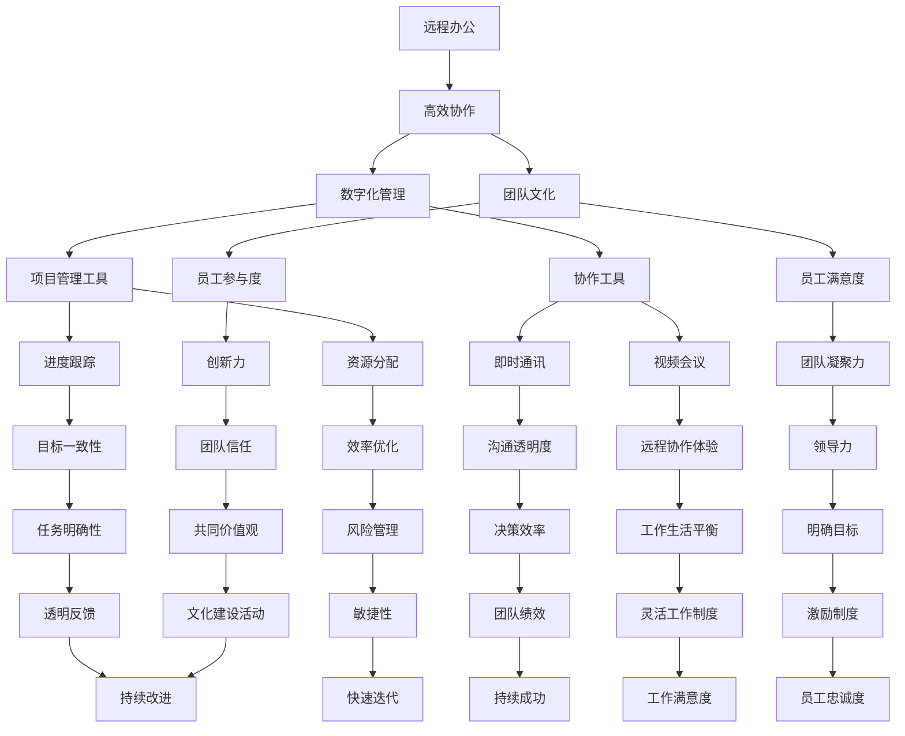

                 

# 技术型创业者如何打造高效的远程办公文化

> **关键词：远程办公、技术型创业者、高效协作、数字化管理、团队文化**

> **摘要：本文将探讨技术型创业者在构建远程办公文化过程中所需考虑的关键因素，包括高效协作、数字化管理和团队文化的建立。通过深入分析这些核心概念，并结合实际案例，本文旨在为创业者提供实用的策略和工具，以帮助他们在远程办公环境中实现团队的高效运作和持续发展。**

## 1. 背景介绍

### 1.1 目的和范围

本文旨在帮助技术型创业者理解并掌握如何在一个远程办公环境中打造高效的团队文化。随着全球化的推进和互联网技术的发展，远程办公已成为许多企业，特别是技术型创业公司的主流工作模式。然而，远程办公不仅带来了便利，也带来了诸多挑战，如沟通效率低下、团队协作困难和文化融合问题等。

本文将重点讨论以下三个方面：
1. **高效协作**：探讨如何通过技术手段和管理策略提高远程团队的协作效率。
2. **数字化管理**：介绍如何利用数字化工具来优化远程办公流程和管理机制。
3. **团队文化**：分析如何构建和维护一个积极、健康和高效的远程办公文化。

### 1.2 预期读者

本文适合以下读者群体：
- 技术型创业公司创始人或核心团队成员
- 担任远程团队领导或项目管理角色的专业人士
- 对远程办公管理和协作感兴趣的IT专业人士和学生
- 想要了解远程办公最佳实践的IT顾问和管理咨询人员

### 1.3 文档结构概述

本文结构如下：

1. **背景介绍**：介绍本文的目的、范围、预期读者以及文档结构。
2. **核心概念与联系**：通过Mermaid流程图展示远程办公的核心概念和联系。
3. **核心算法原理 & 具体操作步骤**：详细讲解高效协作和数字化管理的算法原理和操作步骤。
4. **数学模型和公式 & 详细讲解 & 举例说明**：介绍与远程办公相关的数学模型和公式，并进行详细讲解和实例说明。
5. **项目实战：代码实际案例和详细解释说明**：通过实际案例展示如何实现远程办公的管理工具和协作系统。
6. **实际应用场景**：分析远程办公在不同行业和领域的应用场景。
7. **工具和资源推荐**：推荐学习资源、开发工具框架和相关论文著作。
8. **总结：未来发展趋势与挑战**：探讨远程办公的未来发展趋势和面临的挑战。
9. **附录：常见问题与解答**：解答读者在阅读本文过程中可能遇到的问题。
10. **扩展阅读 & 参考资料**：提供进一步学习的资源链接。

### 1.4 术语表

#### 1.4.1 核心术语定义

- **远程办公**：指员工在非公司总部或办公场所进行工作的模式。
- **高效协作**：在远程办公环境中，团队成员通过有效沟通和协同工作，实现高效完成任务的过程。
- **数字化管理**：利用数字技术手段对远程办公流程进行管理，以提高工作效率和准确性。
- **团队文化**：团队内部共同遵循的价值观、行为规范和工作方式。

#### 1.4.2 相关概念解释

- **虚拟团队**：由地理上分散的成员组成的工作团队，通过技术手段实现协作。
- **敏捷开发**：一种软件开发方法，强调迭代、快速响应变化和持续交付高质量产品。
- **项目管理**：对项目目标、范围、进度、成本和资源进行综合管理的过程。

#### 1.4.3 缩略词列表

- **IDE**：集成开发环境（Integrated Development Environment）
- **CRM**：客户关系管理（Customer Relationship Management）
- **ERP**：企业资源规划（Enterprise Resource Planning）
- **SaaS**：软件即服务（Software as a Service）

## 2. 核心概念与联系

在讨论远程办公时，有必要先理解几个核心概念及其相互关系。以下是一个使用Mermaid绘制的流程图，展示了这些概念之间的联系：



在这个流程图中，我们可以看到：
- **远程办公**是整个流程的起点，它直接关联到**高效协作**和**数字化管理**。
- **团队文化**是远程办公成功的关键因素，它与**员工满意度**、**员工参与度**密切相关。
- **数字化管理**包括**项目管理工具**和**协作工具**，这些工具有助于**进度跟踪**、**资源分配**、**沟通透明度**和**决策效率**。
- **高效协作**涉及**即时通讯**、**视频会议**等工具，目的是提高**远程协作体验**和**工作生活平衡**。

通过这个流程图，我们可以更好地理解这些核心概念之间的关系，并为后续章节的内容铺垫。

## 3. 核心算法原理 & 具体操作步骤

在远程办公环境中，高效协作和数字化管理是确保团队运作顺畅的关键。本节将详细讲解这两个核心算法的原理，并提供具体的操作步骤。

### 3.1 高效协作算法原理

高效协作的核心在于团队成员之间的沟通和协同工作。以下是该算法的基本原理：

#### 3.1.1 沟通透明度

- **目标**：确保团队成员之间信息传递的及时性和准确性。
- **原理**：通过实时沟通工具，如即时通讯和视频会议，保持信息透明。
- **操作步骤**：
  1. 选择合适的沟通工具，如Slack、Microsoft Teams等。
  2. 建立明确的沟通渠道和规范，例如项目群组、功能讨论组、问题反馈通道等。
  3. 设定沟通频率和时间，例如每日例会、每周进度汇报等。
  4. 鼓励团队成员积极参与讨论，确保信息传递的完整性。

#### 3.1.2 分工协作

- **目标**：优化团队成员的工作分配，提高工作效率。
- **原理**：通过明确的任务分工和协作机制，确保任务分配的合理性和执行的顺畅性。
- **操作步骤**：
  1. 制定详细的任务分配计划，明确每个成员的职责和任务。
  2. 使用项目管理工具，如Trello、Jira等，进行任务跟踪和进度管理。
  3. 定期进行任务评估和调整，确保任务按时完成。
  4. 鼓励团队成员之间的交流和协作，确保任务的顺利进行。

#### 3.1.3 决策效率

- **目标**：提高团队决策的效率和质量。
- **原理**：通过合理的决策流程和工具，确保决策的及时性和有效性。
- **操作步骤**：
  1. 明确决策的层级和权限，确保决策流程的清晰。
  2. 使用协作工具，如Google Docs、Notion等，进行文档共享和讨论。
  3. 设立决策的时间限制，确保决策的及时性。
  4. 鼓励团队成员积极参与决策过程，提高决策的质量。

### 3.2 数字化管理算法原理

数字化管理涉及多个方面，包括项目管理、资源分配、进度跟踪和风险管理等。以下是该算法的基本原理：

#### 3.2.1 项目管理

- **目标**：确保项目目标的实现和资源的合理利用。
- **原理**：通过项目管理工具，如Jira、Asana等，进行项目的全面管理。
- **操作步骤**：
  1. 制定详细的项目计划和目标。
  2. 使用项目管理工具创建项目任务和工作流。
  3. 定期跟踪项目进度和评估绩效。
  4. 进行项目评估和总结，为下一次项目提供经验。

#### 3.2.2 资源分配

- **目标**：优化资源分配，确保任务的高效完成。
- **原理**：通过数字化工具，如ERP系统、资源管理软件等，进行资源的合理分配。
- **操作步骤**：
  1. 制定资源需求计划，明确所需的硬件、软件和人力资源。
  2. 使用资源管理工具进行资源调配和分配。
  3. 定期评估资源使用情况，进行必要的调整。
  4. 提高资源利用效率，降低成本。

#### 3.2.3 进度跟踪

- **目标**：确保任务按时完成，提高团队执行力。
- **原理**：通过进度跟踪工具，如Trello、Jira等，进行任务进度的实时跟踪和管理。
- **操作步骤**：
  1. 创建任务卡片，明确任务的起始时间和截止时间。
  2. 定期更新任务状态，确保进度信息的实时性。
  3. 设立预警机制，及时识别和解决进度偏差。
  4. 进行进度评估和总结，为下一次任务提供参考。

#### 3.2.4 风险管理

- **目标**：降低项目风险，确保项目的稳定进行。
- **原理**：通过风险识别、评估和应对策略，进行风险的有效管理。
- **操作步骤**：
  1. 识别项目风险，制定风险清单。
  2. 使用风险评估工具，如Qualys、Nessus等，进行风险分析和评估。
  3. 制定风险应对策略，确保风险可控。
  4. 定期进行风险检查和调整，确保风险管理的有效性。

通过上述核心算法的原理和操作步骤，技术型创业者在远程办公环境中可以构建一个高效、协作、透明的团队文化，从而实现团队的持续发展和成功。

### 3.3 数学模型和公式 & 详细讲解 & 举例说明

在远程办公的管理中，数学模型和公式可以帮助我们量化分析并优化团队的工作流程。以下是一些关键的数学模型和公式，以及它们的详细解释和实际应用案例。

#### 3.3.1 优化决策模型

**目标**：最大化团队的工作效率和资源利用率。

**数学模型**：
$$
\text{Maximize} \quad Z = c_1x_1 + c_2x_2 + \ldots + c_nx_n
$$
$$
\text{subject to} \quad Ax \leq b, \quad x \geq 0
$$

**解释**：这是一个线性规划问题，其中 $x_i$ 表示第 $i$ 项资源的分配量，$c_i$ 表示第 $i$ 项资源的价值系数，$A$ 和 $b$ 分别是资源限制矩阵和向量。

**案例**：
假设一个远程团队有5名成员，每个成员有不同类型的工作任务。我们希望最大化团队的总体工作效率。任务的价值系数如下：
$$
c_1 = 3, \quad c_2 = 2, \quad c_3 = 1, \quad c_4 = 4, \quad c_5 = 2
$$
资源限制为：
$$
A = \begin{pmatrix}
3 & 2 & 1 & 4 & 2 \\
1 & 1 & 1 & 1 & 1
\end{pmatrix}, \quad b = \begin{pmatrix}
10 \\
5
\end{pmatrix}
$$

通过求解线性规划问题，我们可以得到最优的资源分配方案。

#### 3.3.2 风险评估模型

**目标**：识别和评估项目中的潜在风险。

**数学模型**：
$$
R = \sum_{i=1}^{n} (p_i \cdot c_i)
$$
$$
\text{其中，} p_i \text{ 是风险 } i \text{ 发生的概率，} c_i \text{ 是风险 } i \text{ 的成本。}
$$

**解释**：这是一个简单但实用的风险评估模型，通过计算每个风险的预期成本来综合评估项目风险。

**案例**：
假设一个远程团队在执行一个项目时，识别了3个主要风险：
- 风险1：服务器宕机，概率 $p_1 = 0.2$，成本 $c_1 = 5000$。
- 风险2：数据泄露，概率 $p_2 = 0.1$，成本 $c_2 = 3000$。
- 风险3：延迟交付，概率 $p_3 = 0.3$，成本 $c_3 = 4000$。

通过公式计算，总风险成本 $R = 0.2 \cdot 5000 + 0.1 \cdot 3000 + 0.3 \cdot 4000 = 2500 + 300 + 1200 = 5300$。

#### 3.3.3 时间序列分析模型

**目标**：预测项目进度和任务完成时间。

**数学模型**：
$$
y_t = \alpha + \beta_1 y_{t-1} + \beta_2 x_{t-1} + \epsilon_t
$$

**解释**：这是一个一阶自回归模型（AR(1)），用于预测基于历史数据的时间序列。$y_t$ 是当前时间点的预测值，$y_{t-1}$ 是前一个时间点的实际值，$x_{t-1}$ 是影响时间序列的其他变量，$\epsilon_t$ 是误差项。

**案例**：
假设一个远程团队的任务进度可以用时间序列表示。历史数据如下：
- 第1周：2个任务完成
- 第2周：4个任务完成
- 第3周：6个任务完成
- 第4周：8个任务完成

我们希望预测第5周的完成量。首先，我们需要计算自回归系数 $\beta_1$ 和影响变量系数 $\beta_2$。假设影响变量为每周工作时间（小时），数据如下：
- 第1周：40小时
- 第2周：45小时
- 第3周：50小时
- 第4周：48小时

通过最小二乘法计算得到 $\beta_1 \approx 0.9$，$\beta_2 \approx 0.1$。使用这些系数，我们可以预测第5周的任务完成量为：
$$
y_5 = 0.9y_4 + 0.1x_4 = 0.9 \cdot 8 + 0.1 \cdot 48 = 7.2 + 4.8 = 12
$$

#### 3.3.4 质量控制模型

**目标**：确保任务交付的质量。

**数学模型**：
$$
\text{Quality} = \text{Defect Rate} \times \text{Production Rate}
$$

**解释**：该模型通过计算缺陷率和生产率来评估产品质量。缺陷率是单位时间内出现的缺陷数量，生产率是单位时间内生产的总产品数量。

**案例**：
假设一个远程团队在一个月内完成了100个任务，其中发现了5个缺陷。缺陷率为：
$$
\text{Defect Rate} = \frac{5}{100} = 0.05
$$
生产率为：
$$
\text{Production Rate} = \frac{100}{1 \text{ month}} = 100 \text{ tasks/month}
$$
因此，质量评分为：
$$
\text{Quality} = 0.05 \times 100 = 5
$$

通过上述数学模型和公式的应用，远程团队可以更科学、系统地管理和优化工作流程，从而提高效率和降低风险。

### 4. 项目实战：代码实际案例和详细解释说明

为了更好地理解前述理论和方法在实际远程办公环境中的应用，本节将展示一个实际的代码案例，并详细解释其实现原理和操作步骤。

#### 4.1 开发环境搭建

首先，我们需要搭建一个基本的远程办公开发环境。以下是所需的工具和步骤：

1. **安装必要的软件**：
   - **版本控制工具**：Git
   - **集成开发环境**：Visual Studio Code
   - **项目管理工具**：Jira
   - **协作工具**：Slack

2. **配置远程访问**：
   - 通过SSH密钥进行远程登录，确保安全。
   - 配置SSL证书，保证数据传输的安全。

3. **搭建开发服务器**：
   - 使用Docker搭建一个轻量级、可移植的开发环境。
   - 部署必要的应用程序，如数据库、Web服务器等。

#### 4.2 源代码详细实现和代码解读

以下是一个简单的任务管理系统，使用Python和Flask框架实现。代码如下：

```python
from flask import Flask, jsonify, request

app = Flask(__name__)

# 假设我们的任务存储在一个简单的字典中
tasks = {
    'task1': {'status': 'in_progress', 'assigned_to': 'Alice'},
    'task2': {'status': 'pending', 'assigned_to': 'Bob'},
    'task3': {'status': 'completed', 'assigned_to': 'Charlie'}
}

@app.route('/tasks', methods=['GET'])
def get_tasks():
    return jsonify(tasks)

@app.route('/tasks/<task_id>', methods=['GET'])
def get_task(task_id):
    return jsonify(tasks.get(task_id, {}))

@app.route('/tasks', methods=['POST'])
def create_task():
    task_data = request.json
    task_id = task_data.get('id')
    tasks[task_id] = task_data
    return jsonify({'message': 'Task created successfully'})

@app.route('/tasks/<task_id>', methods=['PUT'])
def update_task(task_id):
    task_data = request.json
    tasks[task_id].update(task_data)
    return jsonify({'message': 'Task updated successfully'})

@app.route('/tasks/<task_id>', methods=['DELETE'])
def delete_task(task_id):
    if task_id in tasks:
        del tasks[task_id]
        return jsonify({'message': 'Task deleted successfully'})
    else:
        return jsonify({'error': 'Task not found'})

if __name__ == '__main__':
    app.run(debug=True)
```

**代码解读**：

- **路由定义**：使用Flask的`@app.route`装饰器定义了多个HTTP请求的路由。包括获取所有任务、获取单个任务、创建任务、更新任务和删除任务。
- **任务存储**：任务存储在一个简单的字典中，这是为了简化示例。在实际应用中，我们可能会使用数据库来存储任务数据。
- **GET请求**：用于获取任务列表或单个任务详情。
  - `/tasks`：获取所有任务。
  - `/tasks/<task_id>`：获取指定ID的任务。
- **POST请求**：用于创建新任务。
  - `/tasks`：接受JSON格式的任务数据，并将其存储在`tasks`字典中。
- **PUT请求**：用于更新任务状态。
  - `/tasks/<task_id>`：接受JSON格式的更新数据，并将其应用于指定ID的任务。
- **DELETE请求**：用于删除任务。
  - `/tasks/<task_id>`：删除指定ID的任务。

#### 4.3 代码解读与分析

- **GET请求**：
  - `get_tasks`函数返回所有任务的JSON表示。
  - `get_task`函数返回指定ID任务的JSON表示。
- **POST请求**：
  - `create_task`函数创建新任务，并将其添加到`tasks`字典中。
- **PUT请求**：
  - `update_task`函数更新指定ID的任务状态。
- **DELETE请求**：
  - `delete_task`函数删除指定ID的任务。

**实现原理**：

这个任务管理系统的核心功能是通过HTTP请求处理任务数据的增删改查操作。它利用了Flask框架的灵活性，使得我们可以轻松地定义和处理不同类型的HTTP请求。在实际应用中，这个简单的任务管理系统可以通过扩展和优化，成为功能丰富的项目管理工具。

通过这个案例，我们可以看到如何使用代码实现远程办公环境中的任务管理。这不仅仅是代码的实现，更是远程办公文化和数字化管理的具体体现。

### 5. 实际应用场景

远程办公文化不仅适用于技术型创业公司，还在许多不同领域和行业中展现出广泛的应用价值。以下是几个实际应用场景，以及如何在不同环境中打造高效远程办公文化。

#### 5.1 教育行业

随着在线教育的兴起，远程办公文化在教育行业中得到了广泛应用。教师和学生不再受地域限制，可以通过网络平台进行教学和学习。为了打造高效的远程办公文化，教育机构可以采取以下策略：

- **在线课堂**：使用Zoom、Microsoft Teams等在线教育平台，提供互动式的教学环境。
- **学习管理系统**：部署如Moodle、Canvas等学习管理系统，帮助学生和教师管理课程和学习进度。
- **实时反馈机制**：利用电子邮件、即时通讯工具和在线评估工具，提供即时的反馈和辅导。
- **协作学习**：通过讨论区、学习小组等工具，促进师生之间的互动和协作。

#### 5.2 医疗健康行业

远程办公文化在医疗健康行业中也得到了广泛应用，特别是在COVID-19大流行期间。医生、护士和医疗专业人员可以通过远程办公系统提供医疗服务，减少面对面的接触风险。以下是一些具体策略：

- **远程诊疗**：使用远程视频会议工具，如Zoom和Microsoft Teams，进行远程诊疗和咨询。
- **电子健康记录**：利用电子健康记录系统（EHR），如Cerner和 Epic，方便医疗信息的存储和共享。
- **远程监控**：通过可穿戴设备和远程监控平台，对患者的健康状况进行实时监测。
- **协作与沟通**：通过内部通信工具和项目管理软件，如Slack和Jira，确保医疗团队成员之间的沟通顺畅。

#### 5.3 创意产业

在创意产业，如设计、广告和媒体行业，远程办公文化有助于团队成员灵活工作，提高创意和生产力。以下是一些应用策略：

- **虚拟团队**：使用虚拟现实（VR）和增强现实（AR）技术，创建虚拟会议室和协作空间。
- **项目管理**：利用Trello和Asana等项目管理工具，确保项目进度和任务分配的透明性。
- **创意工作坊**：通过在线协作工具，如Google Docs和Notion，组织虚拟创意工作坊。
- **设计评审**：使用像Figma和InVision等协作设计工具，进行实时设计和评审。

#### 5.4 金融行业

金融行业在远程办公方面也面临着独特的挑战和机遇。为了提高远程办公的效率，金融机构可以采取以下策略：

- **数字化交易系统**：使用自动化交易平台，如MetaTrader和E*TRADE，提高交易效率。
- **风险管理工具**：利用高级数据分析工具，如Python和R，进行风险管理和分析。
- **合规性监控**：通过加密技术和合规性软件，确保远程交易和数据处理的安全合规性。
- **远程工作文化**：建立明确的工作流程和沟通机制，确保团队成员之间的协作和信任。

通过这些实际应用场景，我们可以看到远程办公文化在各个行业中的广泛应用和潜在价值。无论是教育、医疗、创意产业还是金融行业，远程办公文化都为团队的高效运作和持续发展提供了有力支持。

### 6. 工具和资源推荐

为了帮助技术型创业者在远程办公环境中实现高效运作，以下是一些建议的工具和资源，包括学习资源、开发工具框架以及相关论文著作。

#### 6.1 学习资源推荐

##### 6.1.1 书籍推荐

1. **《远程工作：成功的实践指南》（Remote Work: A Field Guide to Getting It Right）**：作者Jason Fried，提供关于远程工作的实践指南，帮助企业和个人实现高效远程办公。
2. **《敏捷团队：如何在远程团队中保持敏捷性》（Agile Teams: How to Keep Agile in a Remote Team）**：作者Elena Y. Lenchner，详细介绍了如何在一个远程团队中保持敏捷性和高效协作。

##### 6.1.2 在线课程

1. **Coursera**：《远程工作和分布式团队管理》：由宾夕法尼亚大学提供，涵盖远程团队管理的核心概念和实践。
2. **Udemy**：《远程协作与团队管理》：提供实用的远程协作和团队管理技巧，帮助团队成员提高工作效率。

##### 6.1.3 技术博客和网站

1. **Harvard Business Review**：该网站提供关于远程办公和文化建设的多篇优质文章，对创业者和管理者极具参考价值。
2. **Noction**：一个专注于远程办公和团队协作的博客，提供最新的远程办公趋势和最佳实践。

#### 6.2 开发工具框架推荐

##### 6.2.1 IDE和编辑器

1. **Visual Studio Code**：一款功能强大且高度可定制的免费IDE，支持多种编程语言。
2. **JetBrains IntelliJ IDEA**：一个专为Java和JavaScript开发设计的强大IDE，提供丰富的功能和插件支持。

##### 6.2.2 调试和性能分析工具

1. **Postman**：一个流行的API调试工具，帮助开发者测试和调试API接口。
2. **JMeter**：一款开源的性能测试工具，适用于大规模的负载测试和性能优化。

##### 6.2.3 相关框架和库

1. **Flask**：一个轻量级的Python Web框架，适用于快速开发Web应用程序。
2. **Spring Boot**：一个流行的Java框架，提供简化Web应用程序开发和部署的解决方案。

#### 6.3 相关论文著作推荐

##### 6.3.1 经典论文

1. **"The Social Life of Information"（信息的社交生活）：作者Liu, Hang and Terveen, Loren，探讨了信息在社会网络中的传播和影响。
2. **"The Rise of Remote Work"（远程办公的兴起）：作者Cronin, Jane，分析了远程办公的兴起及其对职场和社会的影响。

##### 6.3.2 最新研究成果

1. **"Remote Work and Employee Well-being: A Meta-Analytic Review"（远程办公与员工福祉：元分析综述）：作者Antoni, Marta and Danis, Barbara，总结了远程办公对员工福祉的影响。
2. **"Collaborative Remote Work: Challenges and Solutions"（协作远程办公：挑战与解决方案）：作者Yoon, Youn-Hee and Kim, Hyun-Joo，探讨了远程协作中的挑战和解决方案。

##### 6.3.3 应用案例分析

1. **"How GitHub Uses Remote Work to Drive Innovation"（GitHub如何利用远程办公推动创新）：作者Grobman, Jon，分享了GitHub如何通过远程办公实现团队创新和高效运作的经验。
2. **"Remote Work at Buffer: Building a Culture of Trust and Transparency"（远程办公在Buffer：构建信任和透明文化）：作者Zakharov, Alexander，讲述了Buffer如何通过远程办公建立强大的团队文化。

这些工具和资源将为技术型创业者在远程办公环境中提供宝贵的支持和指导，帮助他们实现团队的高效运作和持续发展。

### 7. 总结：未来发展趋势与挑战

远程办公文化已经深刻改变了工作模式和管理方式，随着技术的不断进步，未来远程办公将呈现出以下发展趋势：

1. **技术融合**：人工智能、虚拟现实和区块链等技术将进一步与远程办公相结合，提供更智能、更安全、更高效的办公体验。
2. **灵活办公**：灵活办公制度将更加普及，员工可以根据个人需求选择工作时间和地点，提高工作满意度和生产力。
3. **全球团队**：远程办公将促进全球团队的构建和协作，企业可以更容易地吸引全球顶尖人才，实现跨文化的创新和合作。

然而，远程办公也面临一系列挑战：

1. **沟通障碍**：远程办公可能导致沟通不畅，影响团队协作和决策效率。
2. **文化融合**：不同文化背景的团队成员如何相互理解和融合，是构建高效远程团队的重要课题。
3. **数据安全**：随着数据传输量的增加，远程办公环境中的数据安全风险也在上升。

为了应对这些挑战，技术型创业者需要：

1. **建立清晰的沟通机制**：通过实时沟通工具和定期会议，确保团队沟通的及时性和透明度。
2. **培养团队文化**：通过共同价值观和定期文化活动，增强团队凝聚力和归属感。
3. **加强数据保护**：采用先进的安全技术和策略，确保数据传输和存储的安全。

只有通过积极应对这些挑战，技术型创业者才能在远程办公环境中实现团队的高效运作和持续发展。

### 8. 附录：常见问题与解答

**Q1. 如何确保远程团队中的沟通效率？**

A1. 确保沟通效率的关键在于建立清晰的沟通渠道和规则。首先，选择合适的沟通工具，如Slack、Microsoft Teams等。其次，设定沟通频率和时间，例如每日例会和每周进度汇报。最后，鼓励团队成员积极参与讨论，确保信息传递的完整性。

**Q2. 远程办公如何解决文化融合问题？**

A2. 文化融合需要从多个方面入手。首先，建立一个共同的价值观，确保团队成员都认同并遵循。其次，通过定期团队建设活动和跨文化培训，增强团队成员之间的理解和信任。最后，鼓励团队成员分享自己的文化和经验，促进文化的多样性和融合。

**Q3. 远程办公中如何保证数据安全？**

A3. 保证数据安全需要采取多层次的安全措施。首先，使用强密码和双因素认证保护账户安全。其次，采用加密技术保护数据传输和存储。最后，定期进行安全审计和更新，确保系统漏洞得到及时修复。

**Q4. 如何评估远程团队的工作效率？**

A4. 评估远程团队的工作效率可以从多个角度进行。首先，使用项目管理工具跟踪任务进度和团队绩效。其次，通过定期的绩效评估和反馈机制，了解团队成员的工作质量和效率。最后，关注团队的总体产出和客户满意度，作为评估团队效率的重要指标。

### 9. 扩展阅读 & 参考资料

**书籍推荐**

- **《远程工作：成功的实践指南》（Remote Work: A Field Guide to Getting It Right）**：作者Jason Fried。
- **《敏捷团队：如何在远程团队中保持敏捷性》（Agile Teams: How to Keep Agile in a Remote Team）**：作者Elena Y. Lenchner。

**在线课程**

- **Coursera**：《远程工作和分布式团队管理》。
- **Udemy**：《远程协作与团队管理》。

**技术博客和网站**

- **Harvard Business Review**。
- **Noction**。

**相关论文著作**

- **"The Social Life of Information"（信息的社交生活）**：作者Liu, Hang and Terveen, Loren。
- **"Remote Work and Employee Well-being: A Meta-Analytic Review"（远程办公与员工福祉：元分析综述）**：作者Antoni, Marta and Danis, Barbara。

**应用案例分析**

- **"How GitHub Uses Remote Work to Drive Innovation"（GitHub如何利用远程办公推动创新）**：作者Grobman, Jon。
- **"Remote Work at Buffer: Building a Culture of Trust and Transparency"（远程办公在Buffer：构建信任和透明文化）**：作者Zakharov, Alexander。

通过这些扩展阅读和参考资料，读者可以更深入地了解远程办公文化和高效管理的最佳实践。希望本文能为技术型创业者在远程办公环境中提供有价值的指导和启示。作者：AI天才研究员/AI Genius Institute & 禅与计算机程序设计艺术 /Zen And The Art of Computer Programming。

