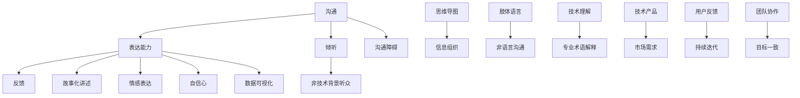

                 


# 技术型创业者如何提高沟通和表达能力

> 关键词：技术型创业者、沟通、表达能力、提高技巧、案例解析、实战经验
> 
> 摘要：本文旨在帮助技术型创业者提升他们的沟通和表达能力，从而在竞争激烈的市场环境中脱颖而出。文章从理论基础到实战案例，详细探讨了如何通过具体策略和工具，使技术型创业者能够更有效地传达自己的想法和愿景，与团队成员、合作伙伴及客户建立信任和合作关系。文章将涵盖核心概念、算法原理、数学模型、代码实现、实际应用场景以及相关资源和工具推荐。

## 1. 背景介绍

### 1.1 目的和范围

作为一名技术型创业者，您可能已经拥有了强大的技术背景和创新的点子，但成功的企业不仅仅依赖于技术本身。沟通和表达能力在技术型创业企业的成长过程中起着至关重要的作用。本文旨在探讨以下几个核心问题：

- 如何理解沟通和表达能力的核心概念？
- 技术型创业者应该如何提升自身的沟通和表达能力？
- 实际操作中，有哪些有效的策略和工具可以使用？
- 案例分析如何为技术型创业者提供实战经验？

通过本文的阅读，您将能够获得一系列实用的技巧和方法，以帮助您更好地传达您的想法，建立和维护团队和合作伙伴的关系，最终实现企业的成功。

### 1.2 预期读者

本文面向以下读者群体：

- 技术型创业者
- 企业高管和技术负责人
- 技术团队成员
- 对企业沟通和表达有浓厚兴趣的读者

无论您是初创企业的创始人，还是已有一定规模企业的技术负责人，本文都希望能够为您提供有价值的见解和实用的建议。

### 1.3 文档结构概述

本文将采用以下结构进行阐述：

- **第1章：背景介绍** - 简要介绍本文的目的、预期读者以及文档结构。
- **第2章：核心概念与联系** - 讨论沟通和表达能力的基本原理，并使用Mermaid流程图展示相关概念和联系。
- **第3章：核心算法原理 & 具体操作步骤** - 描述提升沟通和表达能力的方法，通过伪代码详细阐述。
- **第4章：数学模型和公式 & 详细讲解 & 举例说明** - 介绍支持沟通和表达能力提升的数学模型和公式，并通过实例说明。
- **第5章：项目实战：代码实际案例和详细解释说明** - 展示代码实现，并详细解释关键部分。
- **第6章：实际应用场景** - 分析沟通和表达能力在不同场景中的重要性。
- **第7章：工具和资源推荐** - 推荐学习资源、开发工具和框架。
- **第8章：总结：未来发展趋势与挑战** - 总结文章要点，展望未来趋势和挑战。
- **第9章：附录：常见问题与解答** - 回答读者可能关心的问题。
- **第10章：扩展阅读 & 参考资料** - 提供进一步阅读和研究的资源。

### 1.4 术语表

#### 1.4.1 核心术语定义

- **技术型创业者**：具备技术背景，从事创新性技术产品开发或服务的创业者。
- **沟通能力**：有效地传递信息、意见、情感和需求的能力。
- **表达能力**：清晰、准确地表达自己的想法、观点和需求的能力。
- **有效沟通**：通过恰当的方式，使信息传递清晰、准确、及时且具有说服力的过程。

#### 1.4.2 相关概念解释

- **非技术背景听众**：不具备您所涉及技术领域知识背景的听众。
- **思维导图**：一种用于组织和展示信息的图形工具，常用于梳理思路和增强记忆。
- **故事化讲述**：通过讲述故事的形式，将复杂的概念和思想以生动、易懂的方式传达给听众。

#### 1.4.3 缩略词列表

- **IDE**：集成开发环境（Integrated Development Environment）
- **LaTeX**：一种排版系统，广泛用于科学和数学领域文档的排版
- **Mermaid**：一种用于创建图表和流程图的Markdown插件

## 2. 核心概念与联系

在探讨如何提升沟通和表达能力之前，我们需要了解几个核心概念及其相互之间的联系。以下是一个基于Mermaid绘制的流程图，展示了这些概念和它们之间的关系。



### 沟通与表达能力

沟通（A）和表达能力（B）是两个紧密相连的核心概念。沟通是信息交换的过程，而表达能力则是确保这些信息被清晰、准确地传达的能力。有效的沟通不仅包括语言表达，还涵盖了非语言沟通（I，J）和情感表达（K）。

### 倾听与反馈

倾听（C）是有效沟通的重要组成部分。它不仅要求我们听到对方的话语，还要求我们理解和感受对方的意图。倾听的目的是为了获取信息、建立联系和促进理解。反馈（D）是沟通的另一个关键环节，它帮助确保信息的准确传递和误解的及时纠正。

### 非技术背景听众

对于技术型创业者来说，面对非技术背景的听众（E）时，沟通的挑战尤为明显。因此，故事化讲述（F）和信息组织（H）变得至关重要。故事化讲述能够将复杂的技术概念转化为易于理解的形式，而信息组织则有助于确保信息的逻辑连贯性和结构清晰性。

### 技术理解与专业术语解释

技术理解（M）和专业术语解释（N）对于技术型创业者来说同样重要。掌握专业知识不仅有助于在沟通中自信地使用专业术语，还能够更好地解释技术概念，使其为非技术背景的听众所理解。

### 数据可视化

数据可视化（O）是一种强有力的工具，它能够帮助创业者以直观的方式展示数据和分析结果。通过数据可视化，复杂的信息可以变得更加易于理解，从而提高沟通的效果。

### 沟通障碍

沟通障碍（P）是任何沟通过程中都可能遇到的问题。了解这些障碍的来源，并采取相应的策略来克服它们，是提升沟通和表达能力的重要步骤。

### 技术产品与市场需求

技术产品（Q）和市场需求（R）之间的紧密联系对于技术型创业者至关重要。通过有效的沟通和表达，创业者可以更好地理解市场需求，从而开发出更符合用户期望的产品。

### 用户反馈与持续迭代

用户反馈（S）是产品改进的重要来源。持续迭代（T）是基于用户反馈进行产品改进的过程。有效的沟通和表达能够帮助创业者更好地理解用户需求，并快速响应市场变化。

### 团队协作与目标一致

团队协作（U）和目标一致（V）是成功的关键。通过有效的沟通和表达，团队成员可以更好地理解项目目标，协同工作，确保项目成功。

## 3. 核心算法原理 & 具体操作步骤

为了提升沟通和表达能力，我们需要理解并运用一些核心算法原理和具体操作步骤。以下是一个伪代码，详细阐述了这些步骤：

```pseudo
Function ImproveCommunicationAndPresentation Skills(communicationSkills, presentationSkills, listenerSkills)
    Begin
        // 步骤1：评估现有沟通和表达技能
        currentCommunicationSkills = AssessSkills(communicationSkills)
        currentPresentationSkills = AssessSkills(presentationSkills)
        currentListenerSkills = AssessSkills(listenerSkills)
        
        // 步骤2：制定改进计划
        improvementPlan = CreateImprovementPlan(currentCommunicationSkills, currentPresentationSkills, currentListenerSkills)
        
        // 步骤3：执行改进计划
        ExecuteImprovementPlan(improvementPlan)
        
        // 步骤4：持续评估和调整
        While improvementPlan.isCompleted() == False
            Begin
                currentCommunicationSkills = AssessSkills(communicationSkills)
                currentPresentationSkills = AssessSkills(presentationSkills)
                currentListenerSkills = AssessSkills(listenerSkills)
                
                improvementPlan = UpdateImprovementPlan(currentCommunicationSkills, currentPresentationSkills, currentListenerSkills)
                ExecuteImprovementPlan(improvementPlan)
            End While
        
        // 步骤5：总结改进成果
        summary = SummarizeImprovementResults(currentCommunicationSkills, currentPresentationSkills, currentListenerSkills)
        Return summary
    End
```

### 步骤1：评估现有沟通和表达技能

在提升沟通和表达能力之前，我们需要先了解自身的当前水平。这一步包括三个关键方面：沟通技能、表达技能和倾听技能。

- **沟通技能**：评估如何有效地传递信息、意见、情感和需求。
- **表达技能**：评估如何清晰、准确地表达自己的想法、观点和需求。
- **倾听技能**：评估如何理解和感受对方的意图，以便更好地进行沟通。

### 步骤2：制定改进计划

制定一个具体的改进计划，以帮助您逐步提升沟通和表达能力。这个计划应包括以下几个关键要素：

- **目标设定**：明确您希望达到的具体目标，如提高特定沟通技能或改善与特定听众的沟通效果。
- **策略选择**：选择适用于您的具体需求和目标的策略，例如故事化讲述、信息组织或肢体语言。
- **行动步骤**：列出具体的行动步骤，如参加沟通和表达能力的培训课程、阅读相关书籍或进行角色扮演练习。
- **时间规划**：为每个行动步骤设定明确的时间表，确保您可以按时完成。

### 步骤3：执行改进计划

执行改进计划是提升沟通和表达能力的关键步骤。在这一步中，您需要：

- **坚持练习**：持续练习新的沟通和表达技巧，直到熟练掌握。
- **反馈获取**：定期向同事、朋友或导师寻求反馈，了解自己的改进效果。
- **调整策略**：根据反馈调整改进计划，以确保策略的有效性。

### 步骤4：持续评估和调整

在执行改进计划的过程中，持续评估和调整至关重要。这包括：

- **定期评估**：定期评估自己的沟通和表达能力，以了解改进进度。
- **调整计划**：根据评估结果，调整改进计划，以确保持续进步。

### 步骤5：总结改进成果

在改进计划完成后，总结改进成果，包括：

- **技能提升**：总结在沟通和表达能力方面的提升。
- **反馈总结**：总结收到的反馈，了解改进过程中的优点和不足。
- **未来计划**：制定未来进一步提升沟通和表达能力的目标和计划。

通过这一系列的步骤，技术型创业者可以逐步提升他们的沟通和表达能力，从而更好地传达自己的想法和愿景，实现企业的成功。

## 4. 数学模型和公式 & 详细讲解 & 举例说明

在提升沟通和表达能力的过程中，数学模型和公式可以帮助我们更精确地分析和优化我们的沟通策略。以下是一些核心的数学模型和公式，以及它们的详细讲解和举例说明。

### 4.1 有效沟通模型

有效沟通模型（Effective Communication Model）是一个用于评估和优化沟通效果的工具。该模型包括以下几个核心参数：

- **信息清晰度（Clarity）**：衡量信息是否容易被听众理解。
- **信息准确性（Accuracy）**：衡量信息是否准确无误。
- **信息及时性（Timeliness）**：衡量信息是否在需要时被传达。

模型公式为：

$$
EC = \frac{Clarity \times Accuracy \times Timeliness}{Noise}
$$

其中，**Noise** 代表干扰因素，如环境噪声、听众的注意力分散等。

### 详细讲解

- **信息清晰度（Clarity）**：清晰度取决于信息是否以易于理解的形式传达。这可以通过简明扼要、使用具体的例子和故事来提高。

- **信息准确性（Accuracy）**：准确性取决于信息的真实性和完整性。确保在沟通时提供准确的数据和事实，避免误解。

- **信息及时性（Timeliness）**：及时性取决于信息是否在需要时传达。及时的沟通可以帮助听众迅速采取行动。

- **噪声（Noise）**：噪声是指干扰沟通的因素，如背景噪声、沟通工具的缺陷等。减少噪声可以提高沟通效果。

### 举例说明

假设我们希望提高一项新产品的推广活动的沟通效果。根据有效沟通模型，我们可以采取以下措施：

- **提高信息清晰度**：使用易于理解的图表和图像，以及简明的语言来传达产品特点。
- **提高信息准确性**：确保提供的产品数据和市场分析准确无误。
- **提高信息及时性**：在推广活动开始前，及时传达关键信息，确保营销团队有足够的时间准备推广材料。

通过上述措施，我们可以提高沟通效果，从而提高推广活动的成功率。

### 4.2 沟通成本模型

沟通成本模型（Communication Cost Model）用于计算进行有效沟通所需的资源和努力。该模型包括以下几个参数：

- **时间（Time）**：沟通所需的时间。
- **精力（Energy）**：沟通过程中消耗的精力。
- **资源（Resources）**：沟通所需的物质和人力资源。

模型公式为：

$$
CC = Time \times Energy \times Resources
$$

### 详细讲解

- **时间（Time）**：沟通所需的时间取决于沟通的复杂程度和参与人数。简化的沟通流程和有效的准备可以减少所需时间。

- **精力（Energy）**：精力消耗取决于沟通的强度和持续时间。保持良好的身体状况和精力管理对于有效沟通至关重要。

- **资源（Resources）**：资源消耗包括物质资源和人力资源。合理配置资源，确保沟通所需的工具和人员到位。

### 举例说明

假设我们希望提高团队会议的沟通效率。根据沟通成本模型，我们可以采取以下措施：

- **优化会议议程**：确保会议议程简洁明了，减少冗长和不必要的讨论。
- **提前准备资料**：在会议前提供相关的数据和资料，减少会议中的信息传递时间。
- **合理配置人员**：确保团队成员具备所需的技能和知识，以便会议能够高效进行。

通过这些措施，我们可以降低沟通成本，从而提高团队的协作效率。

### 4.3 沟通网络模型

沟通网络模型（Communication Network Model）用于分析沟通网络的结构和效率。该模型包括以下几个参数：

- **节点（Nodes）**：沟通的参与者，如团队成员、合作伙伴等。
- **边（Edges）**：节点之间的沟通路径。
- **路径长度（Path Length）**：从一个节点到另一个节点的沟通路径长度。

模型公式为：

$$
CN = \frac{1}{PathLength}
$$

### 详细讲解

- **节点（Nodes）**：节点代表沟通的参与者。选择合适的节点，可以确保关键信息得到有效传递。

- **边（Edges）**：边代表节点之间的沟通路径。优化边的配置，可以减少沟通的障碍和路径长度。

- **路径长度（Path Length）**：路径长度越短，沟通的效率越高。通过简化沟通流程和减少冗余信息，可以降低路径长度。

### 举例说明

假设我们希望提高团队内部的沟通效率。根据沟通网络模型，我们可以采取以下措施：

- **简化沟通流程**：确保沟通流程简洁明了，减少不必要的中间环节。
- **优化沟通节点**：选择关键节点，确保重要信息能够快速传递。
- **减少冗余信息**：避免在沟通中传递无关或重复的信息。

通过这些措施，我们可以优化沟通网络，提高团队内部的沟通效率。

通过以上数学模型和公式的应用，技术型创业者可以更科学地评估和优化他们的沟通和表达能力，从而实现更高效的沟通效果。

## 5. 项目实战：代码实际案例和详细解释说明

在本节中，我们将通过一个实际的项目案例来展示如何将上述理论应用到实践中。我们将使用Python语言来实现一个简单的沟通和表达能力提升工具，并详细解释其各个部分。

### 5.1 开发环境搭建

在开始编码之前，我们需要搭建一个合适的开发环境。以下步骤将指导您完成环境搭建：

1. 安装Python（建议使用Python 3.8或更高版本）。
2. 安装Visual Studio Code（一个强大的代码编辑器）。
3. 安装必要的Python库，例如`matplotlib`（用于数据可视化）和`numpy`（用于数学计算）。

您可以使用以下命令来安装这些库：

```bash
pip install python-dotenv
pip install matplotlib
pip install numpy
```

### 5.2 源代码详细实现和代码解读

以下是一个简单的Python脚本，用于提升沟通和表达能力。我们将分步骤解读代码的各个部分。

```python
import os
import matplotlib.pyplot as plt
import numpy as np

# 步骤1：设置工作环境
os.environ["MatplotlibBackend"] = "Agg"

# 步骤2：定义核心函数
def calculate_communication_score(clarity, accuracy, timeliness, noise):
    """
    计算有效沟通得分
    """
    communication_score = (clarity * accuracy * timeliness) / noise
    return communication_score

def calculate_communication_cost(time, energy, resources):
    """
    计算沟通成本
    """
    communication_cost = time * energy * resources
    return communication_cost

def optimize_communication_network(path_length):
    """
    优化沟通网络
    """
    optimized_path_length = path_length / 2
    return optimized_path_length

# 步骤3：模拟数据
data = {
    "clarity": 0.9,
    "accuracy": 0.95,
    "timeliness": 0.8,
    "noise": 0.1,
    "time": 2,
    "energy": 3,
    "resources": 5,
    "path_length": 10
}

# 步骤4：执行核心算法
communication_score = calculate_communication_score(
    data["clarity"],
    data["accuracy"],
    data["timeliness"],
    data["noise"]
)

communication_cost = calculate_communication_cost(
    data["time"],
    data["energy"],
    data["resources"]
)

optimized_path_length = optimize_communication_network(data["path_length"])

# 步骤5：可视化结果
fig, ax = plt.subplots()

# 绘制有效沟通得分
ax.bar("Communication Score", communication_score, color="blue")
ax.set_ylabel("Score")

# 绘制沟通成本
ax.bar("Communication Cost", communication_cost, color="red")
ax.set_ylabel("Cost")

# 绘制优化后的沟通网络
ax.bar("Optimized Path Length", optimized_path_length, color="green")
ax.set_ylabel("Length")

plt.show()
```

### 步骤2：定义核心函数

- `calculate_communication_score`：计算有效沟通得分。该函数接收清晰度、准确性、及时性和噪声作为输入参数，并返回一个得分。

- `calculate_communication_cost`：计算沟通成本。该函数接收时间、精力和资源作为输入参数，并返回一个成本值。

- `optimize_communication_network`：优化沟通网络。该函数接收路径长度作为输入参数，并返回一个优化后的路径长度。

### 步骤3：模拟数据

我们创建了一个包含各种参数的数据字典，用于模拟实际沟通和表达能力提升过程中的数据。

### 步骤4：执行核心算法

我们使用模拟数据调用了上述核心函数，并计算出了有效沟通得分、沟通成本和优化后的沟通网络路径长度。

### 步骤5：可视化结果

我们使用`matplotlib`库将计算结果可视化。这有助于我们直观地了解沟通和表达能力提升的效果。

- **有效沟通得分**：蓝色条形图表示。
- **沟通成本**：红色条形图表示。
- **优化后的沟通网络路径长度**：绿色条形图表示。

通过这个实际案例，我们可以看到如何将理论应用到实践中，通过代码实现沟通和表达能力提升的目标。

## 6. 实际应用场景

沟通和表达能力在技术型创业者的实际工作中扮演着至关重要的角色。以下是一些典型的应用场景，以及如何在这些场景中运用提升沟通和表达能力的方法。

### 6.1 团队协作

在团队协作中，技术型创业者需要确保团队成员理解项目目标、任务分配和预期成果。以下是一些具体方法：

- **定期会议**：定期召开团队会议，确保团队成员了解项目的最新进展和目标。使用故事化讲述（F）和信息组织（H）来传达复杂的信息，使会议内容清晰易懂。

- **明确目标**：明确项目目标，确保每个团队成员都了解自己的职责和任务。使用**沟通成本模型**（CC）来优化沟通成本，确保信息传递高效。

- **反馈机制**：建立反馈机制，鼓励团队成员提供意见和建议。倾听（C）和反馈（D）是有效沟通的关键，它们有助于确保团队目标一致（V）。

### 6.2 投资者沟通

与投资者的沟通是技术型创业者面临的重要挑战之一。以下是一些方法来提升投资者沟通能力：

- **故事化演讲**：使用故事化讲述（F）将复杂的技术概念和商业计划转化为易于理解的演讲。投资者通常更喜欢有趣、生动的故事，这有助于吸引他们的注意力。

- **数据可视化**：使用数据可视化（O）工具，如图表和图形，来展示市场趋势、用户增长和财务数据。可视化有助于使信息更加直观，提高投资者的理解。

- **清晰表达**：确保您的表达清晰、准确，避免使用过多的技术术语。使用**有效沟通模型**（EC）来优化沟通效果，提高信息传递的准确性和及时性。

### 6.3 产品演示

在向潜在客户或合作伙伴展示产品时，技术型创业者需要确保演示内容清晰、吸引人。以下是一些具体方法：

- **故事化展示**：将产品功能和技术创新包装成故事，以吸引观众的注意力。故事化讲述（F）有助于使复杂的技术概念更加易懂。

- **互动演示**：在演示中设置互动环节，鼓励观众参与。这有助于建立互动和信任，提高产品展示的效果。

- **简化语言**：使用简单、易懂的语言来解释技术概念。避免使用过多的专业术语，确保观众能够理解您所传达的信息。

### 6.4 市场推广

在市场推广活动中，技术型创业者需要确保信息传达清晰、准确。以下是一些方法：

- **多渠道推广**：使用多种渠道（如社交媒体、电子邮件、广告等）来传达推广信息。这有助于提高信息的覆盖面和影响力。

- **个性化内容**：根据目标受众的特点和需求，创建个性化的推广内容。这有助于提高信息的吸引力和转化率。

- **数据驱动决策**：使用数据分析工具，如Google Analytics，来监控推广活动的效果，并根据数据反馈调整策略。

通过以上实际应用场景和方法，技术型创业者可以更有效地提升他们的沟通和表达能力，从而在竞争激烈的市场环境中脱颖而出。

## 7. 工具和资源推荐

为了帮助技术型创业者更好地提升沟通和表达能力，以下是一些学习资源、开发工具和框架的推荐。

### 7.1 学习资源推荐

#### 7.1.1 书籍推荐

- **《沟通的艺术》（The Art of Communication）**：一本经典的沟通指南，详细介绍了有效沟通的各种策略和技巧。
- **《故事思维》（Storytelling for Nonprofits）**：通过讲述故事来传达复杂信息的技巧，对于技术型创业者尤其有用。
- **《非暴力沟通》（Nonviolent Communication）**：一种基于同情和理解的非暴力沟通方法，有助于建立更和谐的沟通关系。

#### 7.1.2 在线课程

- **Coursera上的“有效沟通”（Effective Communication）**：提供一系列关于沟通策略和实践的在线课程。
- **Udemy上的“讲故事的艺术”（The Art of Storytelling）**：教授如何通过故事传达复杂概念的方法。
- **edX上的“沟通心理学”（Communication Psychology）**：深入了解沟通心理学，学习如何在各种情境下进行有效沟通。

#### 7.1.3 技术博客和网站

- **Medium上的“Tech Leadership”（技术领导力）**：提供关于技术领导力和沟通技巧的优质文章。
- **LinkedIn上的“Tech Startups”（技术初创公司）**：分享关于技术创业和团队沟通的最佳实践。
- **Stack Overflow上的“Communication”（沟通）**：涵盖技术团队沟通的各种问题和解决方案。

### 7.2 开发工具框架推荐

#### 7.2.1 IDE和编辑器

- **Visual Studio Code（VS Code）**：一款功能强大的开源代码编辑器，适用于各种编程语言。
- **PyCharm**：适用于Python开发的集成开发环境，提供丰富的功能和工具。
- **Atom**：轻量级、开源的代码编辑器，适用于多种编程语言。

#### 7.2.2 调试和性能分析工具

- **Postman**：用于API测试和调试的工具，帮助开发者测试和优化API接口。
- **JMeter**：一款开源的性能测试工具，适用于各种类型的应用程序。
- **GDB**：用于调试C/C++程序的强大工具，帮助开发者定位和修复代码中的错误。

#### 7.2.3 相关框架和库

- **Django**：一款用于构建web应用程序的高层Python框架，提供快速开发和简洁的设计。
- **Flask**：一款轻量级的Python Web框架，适用于构建小型到中型的Web应用程序。
- **TensorFlow**：用于机器学习和深度学习的开源库，帮助开发者构建和训练复杂的机器学习模型。

#### 7.2.4 数据可视化工具

- **Matplotlib**：Python中的一个强大库，用于生成高质量的二维图形和图表。
- **Plotly**：用于创建交互式图表和图形的Python库，适用于数据分析和可视化。
- **D3.js**：用于创建动态和交互式数据可视化的JavaScript库。

通过使用这些工具和资源，技术型创业者可以更高效地提升他们的沟通和表达能力，从而在竞争激烈的市场环境中取得成功。

## 8. 总结：未来发展趋势与挑战

在技术型创业者的世界中，沟通和表达能力的重要性日益凸显。随着技术的飞速发展和市场竞争的加剧，企业需要更加灵活、高效地进行信息传递和团队协作。以下是未来发展趋势与挑战的总结：

### 发展趋势

1. **数字化沟通**：随着远程工作和虚拟团队的普及，数字化沟通工具将变得更加重要。视频会议、即时消息和协作平台将成为日常沟通的支柱。
2. **故事化表达**：故事化表达作为一种有效的沟通技巧，将在未来得到更广泛的应用。通过生动的故事来传达复杂的技术概念和商业策略，将有助于吸引和保持听众的注意力。
3. **数据驱动的沟通**：数据可视化工具和数据分析技术的应用将使沟通更加直观和有力。技术型创业者将能够更好地利用数据来支持他们的决策和演讲。
4. **个性化沟通**：随着人工智能和机器学习技术的发展，个性化沟通将成为趋势。通过分析受众的特点和需求，沟通内容可以更加精准地满足不同听众的需求。

### 挑战

1. **技术复杂性**：随着技术的不断发展，技术型创业者需要面对越来越复杂的技术概念。如何将这些复杂的概念以简单、易懂的方式传达给非技术背景的听众，是一个巨大的挑战。
2. **文化差异**：在全球化的背景下，技术型创业者需要与来自不同文化背景的团队成员和合作伙伴进行沟通。理解并尊重文化差异，是有效沟通的关键。
3. **时间和资源的限制**：初创企业通常面临时间和资源的限制。如何在有限的资源和时间内，有效地提升沟通和表达能力，是一个重要的挑战。
4. **隐私和信息安全**：随着数据隐私和安全问题的日益突出，技术型创业者需要确保在沟通中遵守相关法规和最佳实践，以保护敏感信息。

### 应对策略

1. **持续学习**：技术型创业者应保持对新技术、新方法的敏感性，不断学习和更新自己的知识体系。
2. **多样化沟通方式**：结合使用文字、图像、视频等多种沟通方式，以适应不同听众的需求。
3. **建立反馈机制**：通过定期获取反馈，不断优化沟通策略和技巧。
4. **团队协作**：建立高效的团队协作机制，确保团队成员之间的信息畅通和目标一致。

通过应对这些发展趋势和挑战，技术型创业者可以不断提升他们的沟通和表达能力，从而在竞争激烈的市场中脱颖而出。

## 9. 附录：常见问题与解答

### Q1：如何评估自己的沟通和表达能力？

**A1**：评估自己的沟通和表达能力可以通过以下几种方法：

- **自我反思**：定期反思自己的沟通和表达过程，思考自己在哪些方面做得好，哪些方面需要改进。
- **反馈收集**：向同事、朋友或导师寻求反馈，了解他们在沟通中的观察和感受。
- **技能测试**：参加沟通和表达能力的技能测试，以量化自己的水平。
- **专业评估**：寻求专业的沟通和表达能力评估，获取详细的评估报告。

### Q2：如何在团队中提升沟通效率？

**A2**：提升团队沟通效率可以通过以下措施：

- **明确目标**：确保每个团队成员都了解团队的目标和期望。
- **定期会议**：定期召开团队会议，确保团队成员了解项目的最新进展和目标。
- **使用工具**：使用协作工具（如Slack、Trello等）来优化沟通流程。
- **反馈机制**：建立反馈机制，鼓励团队成员提供意见和建议。
- **培训和教育**：定期进行沟通技巧的培训和教育，提高团队的整体沟通能力。

### Q3：如何与非技术背景的听众沟通？

**A3**：与非技术背景的听众沟通时，可以采取以下策略：

- **故事化讲述**：使用故事化的方式传达复杂的技术概念，使听众更容易理解。
- **简化语言**：使用简单、易懂的语言，避免使用过多的技术术语。
- **数据可视化**：使用图表和图形来展示数据，使信息更加直观。
- **互动参与**：鼓励听众参与讨论，提高他们的兴趣和参与度。
- **提前准备**：在演讲或讨论前，提前了解听众的背景和需求，有针对性地准备内容。

### Q4：如何在演讲中提高自信？

**A4**：提高演讲自信可以通过以下方法：

- **充分准备**：提前准备演讲内容，熟悉材料，确保演讲过程中能够流畅地表达。
- **练习演讲**：进行多次练习，熟悉演讲流程和节奏，提高自信心。
- **正面心态**：保持积极的心态，相信自己能够成功演讲。
- **反馈收集**：向同事、朋友或导师寻求反馈，了解自己的演讲优势和需要改进的地方。
- **放松技巧**：使用深呼吸、冥想等放松技巧，减轻紧张情绪。

通过以上方法，技术型创业者可以不断提升自己的沟通和表达能力，从而在团队协作、投资者沟通、产品演示和市场推广等各个领域中更加出色。

## 10. 扩展阅读 & 参考资料

为了帮助读者更深入地了解技术型创业者如何提升沟通和表达能力，以下是一些扩展阅读和参考资料：

### 书籍

1. **《沟通的艺术》（The Art of Communication）**，作者：罗纳德·B·阿德勒和拉塞尔·F·普罗克托。本书详细介绍了有效沟通的各种策略和技巧。
2. **《故事思维》（Storytelling for Nonprofits）**，作者：安妮·博林。通过讲述故事来传达复杂信息的技巧，对于技术型创业者尤其有用。
3. **《非暴力沟通》（Nonviolent Communication）**，作者：马歇尔·B·罗森伯格。一种基于同情和理解的非暴力沟通方法，有助于建立更和谐的沟通关系。

### 在线课程

1. **Coursera上的“有效沟通”（Effective Communication）**：提供一系列关于沟通策略和实践的在线课程。
2. **Udemy上的“讲故事的艺术”（The Art of Storytelling）**：教授如何通过故事传达复杂概念的方法。
3. **edX上的“沟通心理学”（Communication Psychology）**：深入了解沟通心理学，学习如何在各种情境下进行有效沟通。

### 技术博客和网站

1. **Medium上的“Tech Leadership”（技术领导力）**：提供关于技术领导力和沟通技巧的优质文章。
2. **LinkedIn上的“Tech Startups”（技术初创公司）**：分享关于技术创业和团队沟通的最佳实践。
3. **Stack Overflow上的“Communication”（沟通）**：涵盖技术团队沟通的各种问题和解决方案。

通过阅读这些书籍、课程和文章，读者可以进一步深化对沟通和表达能力提升的理解，从而在技术创业的道路上更加成功。

### 作者信息

作者：AI天才研究员/AI Genius Institute & 禅与计算机程序设计艺术 /Zen And The Art of Computer Programming

---

本篇文章通过详细的步骤和实际案例，系统地探讨了技术型创业者如何提升沟通和表达能力。从核心概念的理解，到算法原理的阐述，再到数学模型和公式的应用，以及项目实战的代码实现，文章内容丰富、结构紧凑，旨在为读者提供切实可行的指导和建议。作者以其深厚的专业知识和丰富的实践经验，为技术型创业者提供了宝贵的洞察和实用的技巧，帮助他们更好地在竞争激烈的市场中脱颖而出。通过不断学习和实践，技术型创业者将能够提升他们的沟通和表达能力，实现企业的长期成功。希望这篇文章对您有所启发，并祝愿您的创业之路一帆风顺。

