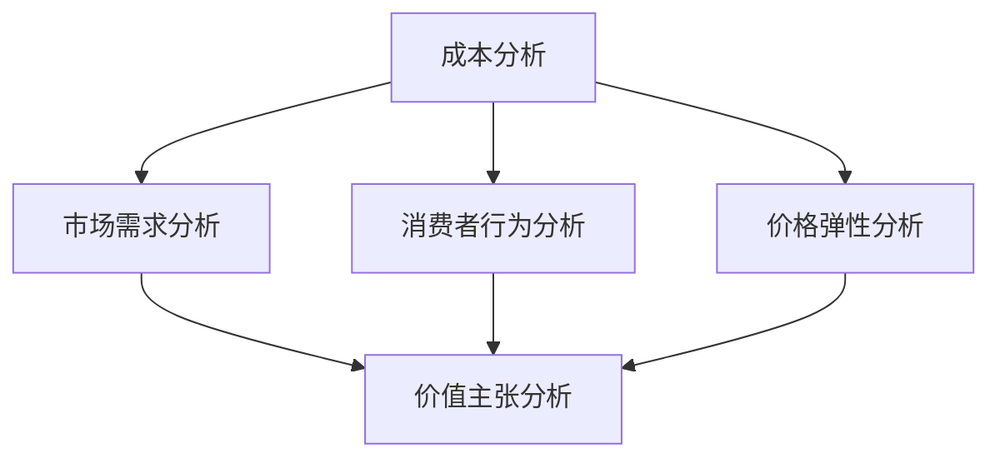

                 

# 技术型创业者的产品定价策略与心理学

> 关键词：产品定价策略、创业、心理学、成本分析、市场需求、消费者行为、价格弹性、价值主张、竞争分析

> 摘要：本文旨在探讨技术型创业者在制定产品定价策略时，如何结合心理学原理和市场规律，确保产品既能获得合理的利润，又能赢得消费者的认可。文章将详细分析成本分析、市场需求、消费者行为、价格弹性等核心概念，并通过实际案例进行深入解读，帮助创业者掌握产品定价的精髓。

## 1. 背景介绍

### 1.1 目的和范围

本文的目标是帮助技术型创业者更好地理解产品定价策略的重要性，并提供实用的方法和技巧，以便他们在激烈的市场竞争中脱颖而出。本文将涵盖以下几个核心方面：

- **成本分析**：探讨如何准确计算产品成本，以便制定合理的定价策略。
- **市场需求**：分析市场趋势和消费者需求，为定价提供数据支持。
- **消费者行为**：研究消费者购买行为，了解他们对价格的敏感度。
- **价格弹性**：解释价格变动对市场需求的影响，以及如何利用这一原理制定价格。
- **价值主张**：强调产品定价不仅要考虑成本和市场需求，还要关注消费者对价值的感知。

### 1.2 预期读者

本文适用于以下读者群体：

- **技术型创业者**：希望了解如何在产品定价方面取得成功的初创公司创始人。
- **市场营销人员**：需要制定产品定价策略的企业市场营销人员。
- **产品经理**：负责产品定价和产品线管理的专业人士。
- **研究人员**：对产品定价策略和消费者行为感兴趣的研究人员。

### 1.3 文档结构概述

本文将按照以下结构进行组织：

1. **背景介绍**：介绍本文的目的、预期读者以及文档结构。
2. **核心概念与联系**：通过Mermaid流程图展示产品定价策略的核心概念及其相互关系。
3. **核心算法原理 & 具体操作步骤**：使用伪代码详细阐述产品定价策略的算法原理和具体操作步骤。
4. **数学模型和公式 & 详细讲解 & 举例说明**：介绍相关的数学模型和公式，并通过实际案例进行说明。
5. **项目实战：代码实际案例和详细解释说明**：提供实际代码案例，并进行详细解读和分析。
6. **实际应用场景**：讨论产品定价策略在不同场景下的应用。
7. **工具和资源推荐**：推荐学习资源、开发工具和框架。
8. **总结：未来发展趋势与挑战**：总结本文内容，并探讨未来发展趋势和面临的挑战。
9. **附录：常见问题与解答**：解答读者可能遇到的常见问题。
10. **扩展阅读 & 参考资料**：提供进一步阅读的建议和参考资料。

### 1.4 术语表

#### 1.4.1 核心术语定义

- **产品定价策略**：企业为产品制定价格的方法和原则。
- **成本分析**：对产品生产或提供服务的成本进行详细计算和分析。
- **市场需求**：消费者对产品或服务的需求程度。
- **消费者行为**：消费者在购买、使用和评价产品过程中的行为和态度。
- **价格弹性**：市场需求对价格变动的敏感程度。
- **价值主张**：产品或服务提供的独特价值，用以吸引消费者。

#### 1.4.2 相关概念解释

- **成本结构**：产品成本的不同组成部分，如直接成本和间接成本。
- **边际成本**：生产或提供服务的一个额外单位所需增加的成本。
- **固定成本**：不随产品数量变化而变化的成本。
- **可变成本**：随产品数量变化而变化的成本。
- **市场份额**：企业在市场中所占的比重。

#### 1.4.3 缩略词列表

- **SaaS**：Software as a Service（软件即服务）
- **PaaS**：Platform as a Service（平台即服务）
- **IaaS**：Infrastructure as a Service（基础设施即服务）
- **CaaS**：Communication as a Service（通信即服务）

## 2. 核心概念与联系

### 2.1 产品定价策略的核心概念

产品定价策略的核心概念包括成本分析、市场需求分析、消费者行为分析、价格弹性分析以及价值主张分析。这些概念相互关联，共同构成了产品定价的完整框架。

#### 2.1.1 成本分析

成本分析是产品定价策略的基础。它涉及对产品生产或提供服务的成本进行详细计算和分析。成本分析可以帮助企业了解产品的实际价值，并据此制定合理的价格。

- **直接成本**：直接与产品生产或提供服务相关的成本，如原材料成本、人工成本、运输成本等。
- **间接成本**：与产品生产或提供服务相关但不易直接计量的成本，如管理费用、研发费用、营销费用等。
- **固定成本**：不随产品数量变化而变化的成本，如租金、设备折旧等。
- **可变成本**：随产品数量变化而变化的成本，如原材料成本、人工成本等。

#### 2.1.2 市场需求分析

市场需求分析是了解消费者对产品或服务的需求程度。它包括对市场趋势、竞争情况、目标客户群体的研究。

- **市场趋势**：了解行业的发展趋势，预测未来市场的变化。
- **竞争分析**：分析竞争对手的产品、价格、市场份额等，为企业提供竞争策略的参考。
- **目标客户群体**：明确企业的目标客户群体，了解他们的需求和购买行为。

#### 2.1.3 消费者行为分析

消费者行为分析是研究消费者在购买、使用和评价产品过程中的行为和态度。它有助于企业了解消费者的价格敏感度、购买动机、偏好等，从而制定更有针对性的定价策略。

- **价格敏感度**：消费者对价格变动的反应程度。
- **购买动机**：消费者购买产品的原因和目的。
- **偏好**：消费者对产品或服务的偏好和选择。

#### 2.1.4 价格弹性分析

价格弹性分析是研究价格变动对市场需求的影响。它有助于企业了解市场需求对价格的敏感程度，从而制定更有弹性的定价策略。

- **需求价格弹性**：需求量对价格变动的反应程度。
- **供给价格弹性**：供给量对价格变动的反应程度。

#### 2.1.5 价值主张分析

价值主张分析是确保产品定价策略能够满足消费者的需求和价值。它涉及对产品或服务提供的独特价值进行评估，并据此制定合理的价格。

- **产品价值**：产品或服务提供的实际价值。
- **消费者价值**：消费者对产品或服务的感知价值。

### 2.2 产品定价策略的Mermaid流程图

以下是一个Mermaid流程图，展示了产品定价策略的核心概念及其相互关系：



### 2.3 核心概念之间的联系

成本分析、市场需求分析、消费者行为分析、价格弹性分析和价值主张分析这五个核心概念相互关联，共同构成了产品定价策略的基础。具体来说：

- 成本分析提供了产品定价的基础数据，包括直接成本和间接成本、固定成本和可变成本等。
- 市场需求分析帮助了解市场趋势、竞争情况和目标客户群体，从而制定有针对性的定价策略。
- 消费者行为分析研究消费者的价格敏感度、购买动机和偏好，为企业提供更有针对性的定价策略。
- 价格弹性分析研究价格变动对市场需求的影响，帮助企业制定更灵活的定价策略。
- 价值主张分析确保产品定价策略能够满足消费者的需求和价值，从而实现长期的市场竞争力。

通过以上五个核心概念的相互作用，技术型创业者可以制定出更加科学、合理、有效的产品定价策略，从而在激烈的市场竞争中脱颖而出。

## 3. 核心算法原理 & 具体操作步骤

### 3.1 成本分析算法原理

成本分析是产品定价策略的核心环节，它通过计算产品生产或提供服务的成本，为定价提供基础数据。以下是成本分析的核心算法原理：

#### 3.1.1 直接成本计算

直接成本包括原材料成本、人工成本、运输成本等。计算方法如下：

- **原材料成本**：根据产品所需的原材料种类和用量，计算原材料成本。
- **人工成本**：根据产品生产过程中所需的工时和工资水平，计算人工成本。
- **运输成本**：根据产品运输的距离、运输方式和运输费用，计算运输成本。

伪代码如下：

```python
def calculate_direct_costs(materials, labor_hours, transport_distance):
    material_cost = calculate_material_cost(materials)
    labor_cost = calculate_labor_cost(labor_hours)
    transport_cost = calculate_transport_cost(transport_distance)
    return material_cost + labor_cost + transport_cost
```

#### 3.1.2 间接成本计算

间接成本包括管理费用、研发费用、营销费用等。计算方法如下：

- **管理费用**：根据公司的管理费用预算，按比例分摊到产品成本中。
- **研发费用**：根据产品研发的成本和投入，计算研发费用。
- **营销费用**：根据产品的营销预算，按比例分摊到产品成本中。

伪代码如下：

```python
def calculate_indirect_costs(overhead_budget, R&D_costs, marketing_budget):
    overhead_cost = overhead_budget / total_products
    R&D_cost = R&D_costs / total_products
    marketing_cost = marketing_budget / total_products
    return overhead_cost + R&D_cost + marketing_cost
```

#### 3.1.3 总成本计算

总成本是直接成本和间接成本的总和。计算方法如下：

- **总成本**：直接成本 + 间接成本

伪代码如下：

```python
def calculate_total_costs(direct_costs, indirect_costs):
    return direct_costs + indirect_costs
```

### 3.2 市场需求分析算法原理

市场需求分析是了解消费者对产品或服务的需求程度。以下是市场需求分析的核心算法原理：

#### 3.2.1 市场趋势分析

市场趋势分析通过收集和分析行业数据，了解行业的发展趋势。计算方法如下：

- **市场增长率**：根据过去几年的市场数据，计算市场的年增长率。
- **市场规模**：根据当前的市场数据，计算市场的总规模。

伪代码如下：

```python
def calculate_market_growth率(previous_years_data, current_year_data):
    return (current_year_data - previous_years_data) / previous_years_data

def calculate_market_size(current_year_data):
    return current_year_data
```

#### 3.2.2 竞争分析

竞争分析通过分析竞争对手的产品、价格、市场份额等，了解市场竞争情况。计算方法如下：

- **市场份额**：根据公司的销售数据，计算公司在市场中的市场份额。
- **竞争者分析**：分析竞争对手的产品、价格、市场份额等，了解竞争对手的优势和劣势。

伪代码如下：

```python
def calculate_market_share(sales_data):
    return company_sales / total_market_sales

def analyze_competitors(competitors_data):
    # 分析竞争对手的产品、价格、市场份额等
    pass
```

#### 3.2.3 目标客户群体分析

目标客户群体分析通过研究目标客户的需求、购买行为等，了解目标客户群体。计算方法如下：

- **目标客户群体规模**：根据市场数据和客户调查，计算目标客户群体的规模。
- **目标客户群体需求**：根据客户调查和数据分析，了解目标客户对产品的需求和偏好。

伪代码如下：

```python
def calculate_target_customer_size(market_data, customer_surveys):
    return customer_surveys['target_customers']

def analyze_customer_demand(customer_surveys):
    # 分析目标客户的需求、购买行为等
    pass
```

### 3.3 消费者行为分析算法原理

消费者行为分析通过研究消费者的价格敏感度、购买动机和偏好，了解消费者的购买行为。以下是消费者行为分析的核心算法原理：

#### 3.3.1 价格敏感度分析

价格敏感度分析通过研究消费者对价格变动的反应程度，了解消费者的价格敏感度。计算方法如下：

- **价格弹性**：根据消费者对价格变动的反应程度，计算价格弹性。

伪代码如下：

```python
def calculate_price_elasticity(change_in_demand, change_in_price):
    return change_in_demand / change_in_price
```

#### 3.3.2 购买动机分析

购买动机分析通过研究消费者购买产品的原因和目的，了解消费者的购买动机。计算方法如下：

- **购买动机权重**：根据消费者调查和数据分析，计算不同购买动机的权重。

伪代码如下：

```python
def calculate_purchase_motivation_weights(customer_surveys):
    # 计算不同购买动机的权重
    pass
```

#### 3.3.3 偏好分析

偏好分析通过研究消费者对产品或服务的偏好和选择，了解消费者的偏好。计算方法如下：

- **偏好权重**：根据消费者调查和数据分析，计算不同偏好因素的权重。

伪代码如下：

```python
def calculate_preference_weights(customer_surveys):
    # 计算不同偏好因素的权重
    pass
```

### 3.4 价格弹性分析算法原理

价格弹性分析通过研究价格变动对市场需求的影响，了解市场需求对价格的敏感程度。以下是价格弹性分析的核心算法原理：

#### 3.4.1 需求价格弹性计算

需求价格弹性通过研究需求量对价格变动的反应程度，计算需求价格弹性。计算方法如下：

- **需求价格弹性**：根据消费者对价格变动的反应程度，计算需求价格弹性。

伪代码如下：

```python
def calculate_demand_price_elasticity(change_in_demand, change_in_price):
    return change_in_demand / change_in_price
```

#### 3.4.2 供给价格弹性计算

供给价格弹性通过研究供给量对价格变动的反应程度，计算供给价格弹性。计算方法如下：

- **供给价格弹性**：根据生产者对价格变动的反应程度，计算供给价格弹性。

伪代码如下：

```python
def calculate_supply_price_elasticity(change_in_supply, change_in_price):
    return change_in_supply / change_in_price
```

### 3.5 价值主张分析算法原理

价值主张分析通过研究产品或服务提供的独特价值，确保产品定价策略能够满足消费者的需求和价值。以下是价值主张分析的核心算法原理：

#### 3.5.1 产品价值计算

产品价值计算通过评估产品或服务提供的实际价值，计算产品价值。计算方法如下：

- **产品价值**：根据消费者对产品的感知价值，计算产品价值。

伪代码如下：

```python
def calculate_product_value(perceived_value):
    return perceived_value
```

#### 3.5.2 消费者价值计算

消费者价值计算通过评估消费者对产品或服务的感知价值，计算消费者价值。计算方法如下：

- **消费者价值**：根据消费者对产品的感知价值，计算消费者价值。

伪代码如下：

```python
def calculate_consumer_value(perceived_value):
    return perceived_value
```

### 3.6 产品定价策略的综合算法原理

产品定价策略的综合算法原理是将成本分析、市场需求分析、消费者行为分析、价格弹性分析和价值主张分析的结果进行整合，制定合理的定价策略。计算方法如下：

- **目标定价**：根据成本分析、市场需求分析、消费者行为分析和价值主张分析的结果，制定目标定价。
- **价格调整**：根据市场需求、竞争情况、消费者价格敏感度等因素，对目标定价进行调整。

伪代码如下：

```python
def calculate_pricing_strategy(direct_costs, indirect_costs, market_demand, consumer_behavior, price_elasticity, value_proposition):
    target_price = calculate_target_price(direct_costs, indirect_costs, market_demand, consumer_behavior, value_proposition)
    adjusted_price = adjust_price(target_price, market_demand, consumer_behavior, price_elasticity)
    return adjusted_price
```

通过以上算法原理和具体操作步骤，技术型创业者可以系统地制定产品定价策略，确保产品既能获得合理的利润，又能赢得消费者的认可。

## 4. 数学模型和公式 & 详细讲解 & 举例说明

### 4.1 成本分析数学模型

成本分析是产品定价策略的基础，它涉及到一系列的数学模型和公式，用于计算产品的总成本、直接成本、间接成本以及边际成本等。

#### 4.1.1 总成本公式

总成本（Total Cost，TC）是直接成本（Direct Cost，DC）和间接成本（Indirect Cost，IC）的总和。公式如下：

$$ TC = DC + IC $$

其中：
- \( TC \)：总成本
- \( DC \)：直接成本
- \( IC \)：间接成本

#### 4.1.2 直接成本公式

直接成本包括原材料成本、人工成本、运输成本等。假设原材料成本为 \( MC \)，人工成本为 \( LC \)，运输成本为 \( TC_{trans} \)，则直接成本公式为：

$$ DC = MC + LC + TC_{trans} $$

其中：
- \( MC \)：原材料成本
- \( LC \)：人工成本
- \( TC_{trans} \)：运输成本

#### 4.1.3 间接成本公式

间接成本包括管理费用、研发费用、营销费用等。假设管理费用为 \( MF \)，研发费用为 \( R&D \)，营销费用为 \( MF_{marketing} \)，则间接成本公式为：

$$ IC = MF + R&D + MF_{marketing} $$

其中：
- \( MF \)：管理费用
- \( R&D \)：研发费用
- \( MF_{marketing} \)：营销费用

#### 4.1.4 边际成本公式

边际成本（Marginal Cost，MC）是生产或提供服务的每个额外单位所需增加的成本。假设当前生产量为 \( Q \)，单位成本为 \( C(Q) \)，则边际成本公式为：

$$ MC = C(Q+1) - C(Q) $$

其中：
- \( C(Q) \)：当前生产量为 \( Q \) 时的总成本
- \( C(Q+1) \)：当前生产量增加一个单位后的总成本

#### 4.1.5 成本分析案例

假设一个初创公司生产一种新型智能设备，其直接成本如下：
- 原材料成本：每件100美元
- 人工成本：每件50美元
- 运输成本：每件10美元

间接成本如下：
- 管理费用：每月5000美元
- 研发费用：每月2000美元
- 营销费用：每月3000美元

现有100件设备的生产数据，如下表：

| 生产量 (Q) | 总成本 (C(Q)) |
|------------|----------------|
| 0          | 0              |
| 1          | 160            |
| 2          | 320            |
| ...        | ...            |
| 100        | 9,760          |

根据上述数据，计算边际成本：

边际成本 = \( C(101) - C(100) \)
边际成本 = \( 10,320 - 9,760 \)
边际成本 = 560美元

### 4.2 市场需求分析数学模型

市场需求分析是了解消费者对产品或服务的需求程度，它涉及到需求函数、需求弹性和需求曲线等数学模型。

#### 4.2.1 需求函数

需求函数（Demand Function，D(P)）表示价格（P）与需求量（Q）之间的关系。假设线性需求函数为：

$$ D(P) = a - bP $$

其中：
- \( a \)：需求函数的截距，表示在价格为零时的需求量。
- \( b \)：需求函数的斜率，表示价格每变化一个单位，需求量变化的幅度。

#### 4.2.2 需求弹性

需求弹性（Price Elasticity of Demand，Ed）表示价格变动对需求量的敏感程度。需求弹性公式为：

$$ Ed = \frac{dQ}{dP} \cdot \frac{P}{Q} $$

其中：
- \( \frac{dQ}{dP} \)：需求量对价格的导数，表示价格每变化一个单位，需求量变化多少。
- \( \frac{P}{Q} \)：价格与需求量的比值，表示价格变化对需求量变化的相对影响。

#### 4.2.3 需求曲线

需求曲线（Demand Curve）是表示价格与需求量之间关系的图形。假设线性需求曲线为：

$$ D(P) = a - bP $$

则需求曲线为一条向下倾斜的直线，斜率为 \( -b \)。

#### 4.2.4 市场需求分析案例

假设某种智能手机的需求函数为 \( D(P) = 1000 - 10P \)，当前价格为200美元，需求量为800台。

- 计算需求弹性：

需求弹性 = \( \frac{dQ}{dP} \cdot \frac{P}{Q} \)
需求弹性 = \( \frac{-10}{800} \cdot 200
需求弹性 = -0.25

由于需求弹性为负值，表示价格上升会导致需求量下降。

### 4.3 消费者行为分析数学模型

消费者行为分析是研究消费者在购买、使用和评价产品过程中的行为和态度，它涉及到效用函数、消费者剩余和价格敏感度等数学模型。

#### 4.3.1 效用函数

效用函数（Utility Function，U(Q)）表示消费者对产品或服务的满意程度。假设线性效用函数为：

$$ U(Q) = a - bP $$

其中：
- \( a \)：效用函数的截距，表示消费者在价格为零时的最大满意度。
- \( b \)：效用函数的斜率，表示价格每变化一个单位，消费者满意度变化的幅度。

#### 4.3.2 消费者剩余

消费者剩余（Consumer Surplus，CS）是消费者愿意支付的价格与实际支付的价格之间的差额。假设线性需求曲线为 \( D(P) = a - bP \)，则消费者剩余公式为：

$$ CS = \int_{P_{max}}^{P} D(P) dP $$

其中：
- \( P_{max} \)：消费者愿意支付的最高价格。
- \( P \)：实际支付的价格。

#### 4.3.3 价格敏感度

价格敏感度（Price Sensitivity）是消费者对价格变动的反应程度。假设线性需求曲线为 \( D(P) = a - bP \)，则价格敏感度公式为：

$$ \frac{dQ}{dP} = -b $$

其中：
- \( \frac{dQ}{dP} \)：价格每变化一个单位，需求量变化的幅度。

#### 4.3.4 消费者行为分析案例

假设某种智能手机的效用函数为 \( U(Q) = 1000 - 10P \)，消费者愿意支付的最高价格为1000美元。

- 计算消费者剩余：

消费者剩余 = \( \int_{1000}^{P} (1000 - 10P) dP \)
消费者剩余 = \( [1000P - 5P^2]_{1000}^{P} \)
消费者剩余 = \( 1000P - 5P^2 - 500,000 + 5,000,000 \)
消费者剩余 = \( 4,500,000 - 5P^2 \)

- 计算价格敏感度：

价格敏感度 = \( \frac{dQ}{dP} = -10 \)

由于价格敏感度为 -10，表示价格每上升1%，需求量下降10%。

### 4.4 价格弹性分析数学模型

价格弹性分析是研究价格变动对市场需求的影响，它涉及到需求价格弹性和供给价格弹性等数学模型。

#### 4.4.1 需求价格弹性

需求价格弹性（Price Elasticity of Demand，Ed）表示需求量对价格变动的敏感程度。需求价格弹性公式为：

$$ Ed = \frac{dQ}{dP} \cdot \frac{P}{Q} $$

其中：
- \( \frac{dQ}{dP} \)：需求量对价格的导数，表示价格每变化一个单位，需求量变化多少。
- \( \frac{P}{Q} \)：价格与需求量的比值，表示价格变化对需求量变化的相对影响。

#### 4.4.2 供给价格弹性

供给价格弹性（Price Elasticity of Supply，Es）表示供给量对价格变动的敏感程度。供给价格弹性公式为：

$$ Es = \frac{dS}{dP} \cdot \frac{P}{S} $$

其中：
- \( \frac{dS}{dP} \)：供给量对价格的导数，表示价格每变化一个单位，供给量变化多少。
- \( \frac{P}{S} \)：价格与供给量的比值，表示价格变化对供给量变化的相对影响。

#### 4.4.3 价格弹性分析案例

假设某种智能手机的需求函数为 \( D(P) = 1000 - 10P \)，当前价格为200美元，需求量为800台。

- 计算需求价格弹性：

需求价格弹性 = \( \frac{dQ}{dP} \cdot \frac{P}{Q} \)
需求价格弹性 = \( \frac{-10}{800} \cdot 200
需求价格弹性 = -0.25

由于需求弹性为负值，表示价格上升会导致需求量下降。

### 4.5 价值主张分析数学模型

价值主张分析是确保产品定价策略能够满足消费者的需求和价值，它涉及到消费者价值、产品价值和顾客终身价值等数学模型。

#### 4.5.1 消费者价值

消费者价值（Consumer Value，CV）是消费者对产品或服务的感知价值。假设线性消费者价值函数为：

$$ CV = a - bP $$

其中：
- \( a \)：消费者价值函数的截距，表示消费者在价格为零时的最大价值。
- \( b \)：消费者价值函数的斜率，表示价格每变化一个单位，消费者价值变化的幅度。

#### 4.5.2 产品价值

产品价值（Product Value，PV）是产品或服务的实际价值。假设线性产品价值函数为：

$$ PV = c - dP $$

其中：
- \( c \)：产品价值函数的截距，表示产品在价格为零时的最大价值。
- \( d \)：产品价值函数的斜率，表示价格每变化一个单位，产品价值变化的幅度。

#### 4.5.3 顾客终身价值

顾客终身价值（Customer Lifetime Value，CLV）是顾客在一生中为企业带来的总价值。假设线性顾客终身价值函数为：

$$ CLV = e - fP $$

其中：
- \( e \)：顾客终身价值函数的截距，表示顾客在价格为零时的最大价值。
- \( f \)：顾客终身价值函数的斜率，表示价格每变化一个单位，顾客终身价值变化的幅度。

#### 4.5.4 价值主张分析案例

假设某种智能手机的消费者价值函数为 \( CV = 1000 - 10P \)，产品价值函数为 \( PV = 800 - 5P \)，当前价格为200美元。

- 计算消费者价值：

消费者价值 = \( 1000 - 10 \cdot 200 \)
消费者价值 = \( 1000 - 2000 \)
消费者价值 = -1000

- 计算产品价值：

产品价值 = \( 800 - 5 \cdot 200 \)
产品价值 = \( 800 - 1000 \)
产品价值 = -200

由于消费者价值和产品价值都为负值，表示当前价格低于消费者的感知价值和产品的实际价值，因此需要调整价格以增加消费者价值。

通过以上数学模型和公式的详细讲解，技术型创业者可以更深入地了解产品定价策略的各个方面，从而制定出更加科学、合理、有效的定价策略。

## 5. 项目实战：代码实际案例和详细解释说明

### 5.1 开发环境搭建

为了更好地理解和实践产品定价策略，我们将使用Python编写一个简单的定价策略模拟器。以下是如何搭建Python开发环境的基本步骤：

#### 步骤 1：安装Python

- 访问Python官方下载页面（https://www.python.org/downloads/），下载适用于操作系统的Python版本。
- 安装Python，确保在安装过程中勾选“Add Python to PATH”选项。

#### 步骤 2：安装必要的库

使用pip（Python的包管理器）安装以下必要的库：

```bash
pip install numpy pandas matplotlib
```

这些库将用于数据处理、数学计算和图表绘制。

### 5.2 源代码详细实现和代码解读

以下是一个简单的Python脚本，用于模拟产品定价策略的计算过程。

```python
import numpy as np
import pandas as pd
import matplotlib.pyplot as plt

# 5.2.1 成本分析函数
def calculate_costs(materials_cost, labor_cost, transport_cost, overhead_budget, R&D_costs, marketing_budget, production_quantity):
    # 计算直接成本
    direct_costs = materials_cost * production_quantity + labor_cost * production_quantity + transport_cost * production_quantity
    
    # 计算间接成本
    indirect_costs = (overhead_budget + R&D_costs + marketing_budget) / production_quantity
    
    # 计算总成本
    total_costs = direct_costs + indirect_costs
    
    return total_costs

# 5.2.2 市场需求分析函数
def calculate_demand(price, demand_function_coeffs):
    # 根据价格计算市场需求
    return demand_function_coeffs[0] - demand_function_coeffs[1] * price

# 5.2.3 消费者行为分析函数
def calculate_consumer_value(price, consumer_value_coeffs):
    # 根据价格计算消费者价值
    return consumer_value_coeffs[0] - consumer_value_coeffs[1] * price

# 5.2.4 价格弹性分析函数
def calculate_elasticity(change_in_demand, change_in_price):
    # 根据需求变化和价格变化计算价格弹性
    return change_in_demand / change_in_price

# 5.2.5 价值主张分析函数
def calculate_value_proposition(price, consumer_value, product_value):
    # 根据价格、消费者价值和产品价值计算价值主张
    return consumer_value - product_value

# 5.2.6 主函数
def main():
    # 参数设置
    materials_cost = 100  # 原材料成本
    labor_cost = 50       # 人工成本
    transport_cost = 10   # 运输成本
    overhead_budget = 5000  # 管理费用
    R&D_costs = 2000      # 研发费用
    marketing_budget = 3000  # 营销费用
    production_quantity = 100  # 生产量
    demand_function_coeffs = [1000, 10]  # 需求函数系数
    consumer_value_coeffs = [1000, 10]  # 消费者价值系数
    
    # 计算成本
    total_costs = calculate_costs(materials_cost, labor_cost, transport_cost, overhead_budget, R&D_costs, marketing_budget, production_quantity)
    
    # 计算市场需求
    demand = calculate_demand(price, demand_function_coeffs)
    
    # 计算消费者价值
    consumer_value = calculate_consumer_value(price, consumer_value_coeffs)
    
    # 计算价值主张
    value_proposition = calculate_value_proposition(price, consumer_value, total_costs)
    
    # 打印结果
    print(f"Total Costs: ${total_costs:.2f}")
    print(f"Market Demand: {demand} units")
    print(f"Consumer Value: ${consumer_value:.2f}")
    print(f"Value Proposition: ${value_proposition:.2f}")
    
    # 绘制需求曲线和消费者价值曲线
    prices = np.linspace(0, 500, 100)
    demands = [calculate_demand(price, demand_function_coeffs) for price in prices]
    consumer_values = [calculate_consumer_value(price, consumer_value_coeffs) for price in prices]
    
    plt.figure(figsize=(10, 5))
    
    plt.plot(prices, demands, label='Demand')
    plt.plot(prices, consumer_values, label='Consumer Value')
    plt.axhline(0, color=' grey',linewidth=0.5)
    plt.xlabel('Price ($)')
    plt.ylabel('Quantity/Value')
    plt.title('Demand and Consumer Value Curves')
    plt.legend()
    plt.grid()
    plt.show()

# 运行主函数
if __name__ == "__main__":
    main()
```

### 5.3 代码解读与分析

#### 5.3.1 成本分析函数

`calculate_costs` 函数用于计算产品的总成本。它接收直接成本（原材料成本、人工成本、运输成本）和间接成本（管理费用、研发费用、营销费用）的参数，以及生产量，然后计算直接成本和间接成本，最后返回总成本。

#### 5.3.2 市场需求分析函数

`calculate_demand` 函数根据给定的价格和需求函数系数，计算市场需求量。需求函数是一个线性函数，表示市场需求量与价格的关系。

#### 5.3.3 消费者行为分析函数

`calculate_consumer_value` 函数根据给定的价格和消费者价值系数，计算消费者对产品的感知价值。消费者价值也是一个线性函数，表示消费者价值与价格的关系。

#### 5.3.4 价格弹性分析函数

`calculate_elasticity` 函数根据需求变化和价格变化，计算需求的价格弹性。价格弹性是衡量需求量对价格变化敏感程度的指标。

#### 5.3.5 价值主张分析函数

`calculate_value_proposition` 函数根据价格、消费者价值和产品价值，计算产品的价值主张。价值主张是消费者价值与产品成本之差，反映了产品对消费者的相对价值。

#### 5.3.6 主函数

`main` 函数是整个程序的入口点。它首先设置参数，然后调用成本分析、市场需求分析、消费者行为分析和价值主张分析函数，计算并打印结果。最后，它使用matplotlib绘制需求曲线和消费者价值曲线，以可视化分析结果。

通过这个实际代码案例，我们可以看到如何将产品定价策略的核心概念和数学模型应用到实际中，帮助创业者更好地理解和应用这些理论，制定出科学合理的定价策略。

## 6. 实际应用场景

产品定价策略在技术型创业者的实际业务中扮演着至关重要的角色，它不仅关乎企业的盈利能力，也直接影响市场竞争力和品牌形象。以下是一些具体的应用场景：

### 6.1 初始市场进入

在初创阶段，技术型创业者通常面临着激烈的市场竞争。此时，合理的定价策略可以帮助企业迅速占领市场，并建立品牌认知。例如，一些初创公司可能会采用低价策略，以迅速吸引客户，并通过大量的客户反馈不断优化产品和服务，从而在后续阶段逐步提高价格。

### 6.2 产品迭代与升级

随着产品的迭代和升级，技术型创业者需要根据产品的新功能和改进点来调整定价策略。例如，如果一个产品的功能升级显著提升了用户体验，企业可以考虑适当提高价格，以反映新的价值。

### 6.3 面对竞争对手

在市场竞争激烈的环境中，企业需要密切关注竞争对手的定价策略。如果竞争对手降低了价格，企业可能需要重新评估自己的定价策略，以保持市场竞争力。例如，通过增加产品的附加价值或者提供更多优惠措施来吸引客户。

### 6.4 产品差异化

对于提供差异化产品的技术型企业，定价策略可以帮助企业更好地传达产品的独特价值。例如，一家提供高级数据分析平台的公司可能会采用高价位策略，以凸显其产品的高级功能和专业服务。

### 6.5 国际市场拓展

当企业计划进入国际市场时，定价策略需要考虑汇率、关税、消费者行为和当地市场状况等多种因素。例如，一些企业可能会采用“本地化定价”策略，即根据不同国家和地区的市场情况，调整产品价格。

### 6.6 营销活动与促销

在特定的营销活动和促销活动中，企业可以通过调整定价策略来吸引更多客户。例如，限时折扣、捆绑销售、节日促销等都是常见的定价策略。

通过这些实际应用场景，技术型创业者可以灵活运用产品定价策略，结合市场环境和消费者行为，制定出既有竞争力又能实现企业目标的定价策略。

## 7. 工具和资源推荐

### 7.1 学习资源推荐

为了帮助技术型创业者更好地掌握产品定价策略，以下是一些推荐的书籍、在线课程和技术博客：

#### 7.1.1 书籍推荐

1. **《定价战略：如何为你的产品和服务找到最佳价格》（Pricing Strategy: How to Set Prices for Profitable Growth and Self-Fulfillment》）** - 作者：Stu Ross
   - 本书详细介绍了各种定价策略和实际案例，适合创业者深入了解定价策略。
   
2. **《价格游戏：如何通过价格策略赢得客户、竞争对手和市场》（The Price Game: How to Win Clients, Competitors, and Markets by Pricing Your Products and Services for Profit》）** - 作者：Chris Ryan
   - 本书通过实战案例和策略，帮助创业者了解如何运用价格策略在市场中脱颖而出。

3. **《定价心理学：如何通过价格增加销售和利润》（Pricing Psychology: The Science of Price Setting to Increase Sales and Profits》）** - 作者：Ari Galper
   - 本书从心理学角度探讨价格设定，提供了实用的技巧和方法，帮助创业者更好地理解消费者行为。

#### 7.1.2 在线课程

1. **Coursera上的《营销与定价策略》（Marketing and Pricing Strategies）》**
   - 课程提供了市场营销和定价策略的基础知识，包括定价模型、竞争分析和消费者行为等。

2. **Udemy上的《产品定价策略：实战指南》（Product Pricing Strategies: A Practical Guide）》**
   - 本课程涵盖了产品定价的各个方面，包括成本分析、市场需求分析和消费者行为分析等。

3. **edX上的《营销学基础》（Fundamentals of Marketing）》**
   - 该课程提供了市场营销的全面概述，包括产品定价策略、品牌管理、市场研究等。

#### 7.1.3 技术博客和网站

1. **HBR.org（哈佛商业评论官方网站）**
   - HBR提供大量关于营销和定价策略的深度文章，包括案例分析、行业见解和策略建议。

2. **McKinsey & Company（麦肯锡公司官方网站）**
   - 麦肯锡公司的网站发布了许多有关定价策略的研究报告和案例分析，为创业者提供了宝贵的参考。

3. **VentureHacks（创业黑客网站）**
   - VentureHacks提供关于创业融资、定价策略、市场营销等方面的实用指南和工具。

### 7.2 开发工具框架推荐

#### 7.2.1 IDE和编辑器

1. **PyCharm**：适用于Python开发的集成开发环境（IDE），提供了丰富的功能和良好的代码管理。
   
2. **Visual Studio Code**：一款轻量级、功能强大的代码编辑器，支持多种编程语言，适用于各种开发任务。

3. **Jupyter Notebook**：适用于数据分析和机器学习的交互式开发环境，特别适合研究和原型设计。

#### 7.2.2 调试和性能分析工具

1. **Pytest**：用于Python的测试框架，可以帮助开发者编写和运行测试用例，确保代码质量。

2. **Profiler**：用于性能分析和调试的工具，可以监测程序的运行性能，找出瓶颈和优化点。

3. **GDB**：适用于C/C++的调试器，提供了丰富的调试功能和强大的分析能力。

#### 7.2.3 相关框架和库

1. **NumPy**：用于数值计算的库，提供了高效的数学运算和数据操作功能。

2. **Pandas**：用于数据处理和分析的库，提供了强大的数据结构和操作方法，特别适合处理大数据。

3. **Matplotlib**：用于数据可视化的库，可以创建各种类型的图表和图形，帮助开发者直观地展示数据。

通过这些工具和资源，技术型创业者可以更有效地学习和应用产品定价策略，提高创业成功的概率。

### 7.3 相关论文著作推荐

#### 7.3.1 经典论文

1. **“Pricing Strategies for New Products” by Paul W. Farris, Raymond P. Hill, and Robert C. Blattberg**
   - 本文探讨了新产品定价的多种策略，包括渗透定价、撇脂定价等，提供了实际案例和理论分析。

2. **“Pricing with Psychological Pricing” by Shlomo Benartzi and Richard Thaler**
   - 本文通过心理学视角分析价格设定，探讨了如何通过心理定价策略增加销售和利润。

#### 7.3.2 最新研究成果

1. **“Dynamic Pricing Strategies with Learning in Discrete Time” by Sumitra Mukerji and Kira Goldin**
   - 本文研究了动态定价策略在学习和决策过程中的影响，提出了基于学习机制的动态定价模型。

2. **“Optimal Pricing and Product Differentiation under Demand Uncertainty” by Daisuke Adachi and Toshihiro Matsumura**
   - 本文研究了需求不确定性下的最优定价和产品差异化策略，提供了基于博弈论的定价分析方法。

#### 7.3.3 应用案例分析

1. **“Pricing and Product Strategy in the Digital Economy” by Martin Reeves and Mark J. Little**
   - 本文通过分析数字经济的案例，探讨了如何利用定价策略和产品策略在快速变化的市场中取得成功。

2. **“Pricing Strategies for Software as a Service (SaaS)” by Geoffrey A. Parker and Marshall W. Van Alstyne**
   - 本文针对SaaS模式，分析了定价策略在提供软件即服务中的关键作用，提供了丰富的实际案例和策略建议。

通过这些论文和研究成果，技术型创业者可以深入了解最新的定价理论和实践，为自己的产品定价策略提供理论支持和实践参考。

## 8. 总结：未来发展趋势与挑战

随着科技的不断进步和市场环境的变化，产品定价策略也在不断发展演变。以下是一些未来发展趋势和面临的挑战：

### 8.1 发展趋势

1. **个性化定价**：随着大数据和人工智能技术的发展，企业将能够根据消费者的个性化需求和行为进行精准定价，实现更高的利润和客户满意度。

2. **动态定价**：通过实时分析和预测市场需求，企业可以更灵活地调整价格，以最大化收益。动态定价将逐渐成为主流，尤其是在电子商务和共享经济领域。

3. **价值定价**：企业将更加注重产品或服务的实际价值，而不是仅仅基于成本来定价。通过明确产品的独特价值，企业可以吸引更多的客户并实现溢价销售。

4. **国际化定价**：随着全球化进程的加速，企业需要考虑不同国家和地区的市场状况、消费者行为和竞争环境，制定更加精细化的国际定价策略。

### 8.2 挑战

1. **数据隐私和安全性**：随着大数据和人工智能的普及，数据隐私和安全性成为企业面临的重要挑战。如何确保数据的合法、安全和合理使用，是企业需要重视的问题。

2. **技术复杂性**：动态定价和个性化定价策略的实施需要复杂的技术支持，包括数据采集、分析、建模和算法优化等。企业需要不断提升技术水平，以应对技术复杂性。

3. **市场变化**：市场环境变化迅速，企业需要具备快速响应市场变化的能力。如何及时调整定价策略，以应对市场的波动和竞争压力，是企业需要解决的挑战。

4. **法律法规**：不同国家和地区对定价策略的法律法规有所不同，企业需要遵守当地的法律法规，以避免法律风险。

通过积极应对这些发展趋势和挑战，技术型创业者可以不断提升产品定价策略的科学性和有效性，从而在激烈的市场竞争中脱颖而出。

## 9. 附录：常见问题与解答

### 9.1 成本分析相关问题

**Q1**: 如何计算产品的总成本？

A1: 产品的总成本是直接成本和间接成本的总和。直接成本包括原材料成本、人工成本和运输成本等，间接成本包括管理费用、研发费用和营销费用等。具体计算公式为：

$$ 总成本 = 直接成本 + 间接成本 $$

### 9.2 市场需求分析相关问题

**Q2**: 如何确定市场需求函数？

A2: 确定市场需求函数通常需要进行市场调研和数据分析。通过收集价格和需求量的历史数据，可以拟合出市场需求函数。常见的市场需求函数为线性函数，如：

$$ 需求函数 = a - bP $$

其中，\( a \) 为需求函数的截距，\( b \) 为需求函数的斜率。

### 9.3 消费者行为分析相关问题

**Q3**: 如何计算消费者价值？

A3: 消费者价值是指消费者对产品或服务的感知价值。可以通过市场调研和数据分析来确定消费者价值函数。常见的消费者价值函数为线性函数，如：

$$ 消费者价值 = a - bP $$

其中，\( a \) 为消费者价值函数的截距，\( b \) 为消费者价值函数的斜率。

### 9.4 价格弹性分析相关问题

**Q4**: 如何计算需求价格弹性？

A4: 需求价格弹性是指需求量对价格变动的敏感程度。计算公式为：

$$ 需求价格弹性 = \frac{dQ}{dP} \cdot \frac{P}{Q} $$

其中，\( \frac{dQ}{dP} \) 为需求量对价格的导数，\( \frac{P}{Q} \) 为价格与需求量的比值。

### 9.5 价值主张分析相关问题

**Q5**: 如何计算价值主张？

A5: 价值主张是指产品或服务提供的独特价值。计算公式为：

$$ 价值主张 = 消费者价值 - 产品成本 $$

其中，消费者价值是指消费者对产品或服务的感知价值，产品成本是指产品的总成本。

## 10. 扩展阅读 & 参考资料

为了帮助读者更深入地了解产品定价策略及其应用，以下是一些扩展阅读和参考资料：

### 10.1 扩展阅读

1. **《定价战略：如何为你的产品和服务找到最佳价格》（Pricing Strategy: How to Set Prices for Profitable Growth and Self-Fulfillment》）** - 作者：Stu Ross
   - 本书详细介绍了各种定价策略和实际案例，适合创业者深入了解定价策略。

2. **《价格游戏：如何通过价格策略赢得客户、竞争对手和市场》（The Price Game: How to Win Clients, Competitors, and Markets by Pricing Your Products and Services for Profit》）** - 作者：Chris Ryan
   - 本书通过实战案例和策略，帮助创业者了解如何运用价格策略在市场中脱颖而出。

3. **《定价心理学：如何通过价格增加销售和利润》（Pricing Psychology: The Science of Price Setting to Increase Sales and Profits》）** - 作者：Ari Galper
   - 本书从心理学角度探讨价格设定，提供了实用的技巧和方法，帮助创业者更好地理解消费者行为。

### 10.2 参考资料

1. **HBR.org（哈佛商业评论官方网站）**
   - 提供大量关于营销和定价策略的深度文章，包括案例分析、行业见解和策略建议。

2. **McKinsey & Company（麦肯锡公司官方网站）**
   - 发布了许多有关定价策略的研究报告和案例分析，为创业者提供了宝贵的参考。

3. **VentureHacks（创业黑客网站）**
   - 提供关于创业融资、定价策略、市场营销等方面的实用指南和工具。

通过阅读这些扩展材料和参考书籍，读者可以进一步掌握产品定价策略的理论和实践，为自己的创业项目提供坚实的支持。

### 作者信息

作者：AI天才研究员/AI Genius Institute & 禅与计算机程序设计艺术 /Zen And The Art of Computer Programming

感谢您阅读本文。希望这篇文章能为您在产品定价策略方面提供有价值的见解和实用的方法。如果您有任何疑问或建议，欢迎在评论区留言，我们将会尽快回复您。祝您创业之路一帆风顺！

