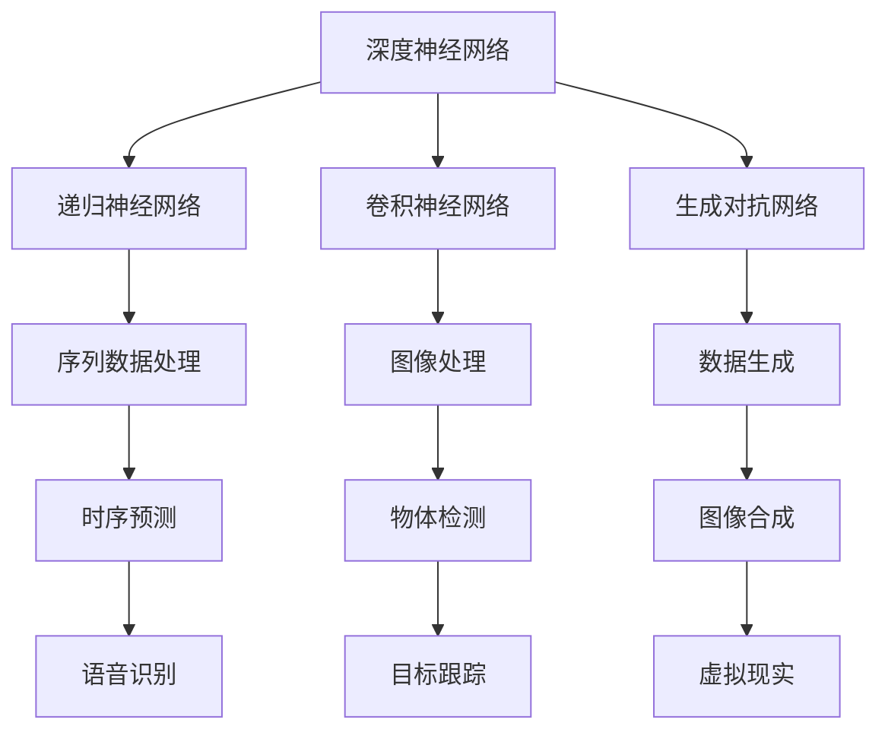

                 

# 技术应用：大模型创业的核心武器

> **关键词：大模型，创业，人工智能，技术应用，算法原理，数学模型，项目实战**

> **摘要：本文将深入探讨大模型在创业领域中的应用，分析其核心原理、技术架构，并通过具体的案例和代码解析，展示如何利用大模型进行创新创业。**

## 1. 背景介绍

### 1.1 目的和范围

本文旨在向创业者和技术开发者展示如何利用大模型作为创业的核心武器。我们将探讨大模型的核心概念、算法原理以及如何在实际项目中应用这些模型。本文不仅针对具有技术背景的读者，也希望能启发那些希望通过技术创新实现商业价值的创业人士。

### 1.2 预期读者

- 拥有技术背景的创业者
- 对人工智能技术有兴趣的开发者
- 想要在创业领域应用人工智能技术的企业高管
- 技术博客作者和技术社区成员

### 1.3 文档结构概述

本文将分为以下章节：

- **1. 背景介绍**：介绍本文的目的、预期读者以及文档结构。
- **2. 核心概念与联系**：讲解大模型的基本概念、原理及其架构。
- **3. 核心算法原理 & 具体操作步骤**：深入探讨大模型的算法原理和操作步骤。
- **4. 数学模型和公式 & 详细讲解 & 举例说明**：阐述大模型的数学模型和公式。
- **5. 项目实战：代码实际案例和详细解释说明**：通过实际项目展示大模型的应用。
- **6. 实际应用场景**：讨论大模型在不同领域的应用。
- **7. 工具和资源推荐**：推荐学习资源和开发工具。
- **8. 总结：未来发展趋势与挑战**：展望大模型在创业领域的发展。
- **9. 附录：常见问题与解答**：解答常见问题。
- **10. 扩展阅读 & 参考资料**：提供进一步学习资源。

### 1.4 术语表

#### 1.4.1 核心术语定义

- **大模型（Large Model）**：具有数百万甚至数十亿参数的人工神经网络模型。
- **深度学习（Deep Learning）**：一种基于多层神经网络的学习方法，能够自动提取特征。
- **创业（Entrepreneurship）**：创建和运营新企业的过程。

#### 1.4.2 相关概念解释

- **数据驱动决策（Data-Driven Decision Making）**：基于数据分析而非直觉或经验进行决策。
- **商业模式创新（Business Model Innovation）**：通过创新的方法创造或重新定义商业模式。

#### 1.4.3 缩略词列表

- **AI**：人工智能
- **ML**：机器学习
- **DL**：深度学习
- **NLP**：自然语言处理
- **CV**：计算机视觉

## 2. 核心概念与联系

大模型作为人工智能领域的一个核心概念，已经引发了广泛的关注和应用。为了更好地理解大模型的原理和应用，我们需要了解以下几个核心概念：

- **深度神经网络（Deep Neural Network, DNN）**：一种具有多个隐藏层的神经网络，能够通过训练自动学习输入数据中的复杂特征。
- **递归神经网络（Recurrent Neural Network, RNN）**：一种用于处理序列数据的神经网络，能够记忆和利用先前的信息。
- **卷积神经网络（Convolutional Neural Network, CNN）**：一种专门用于图像处理的神经网络，能够自动提取图像中的特征。
- **生成对抗网络（Generative Adversarial Network, GAN）**：一种由生成器和判别器组成的模型，用于生成新的数据。

以下是这些核心概念及其相互联系的一个简单Mermaid流程图：



从图中可以看出，这些概念在应用场景和技术原理上有着紧密的联系。例如，递归神经网络和卷积神经网络都是用于特征提取和分类的模型，但适用于不同的数据类型和任务。生成对抗网络则通过生成器和判别器的对抗训练来生成高质量的数据，可以应用于图像合成、数据增强等领域。

## 3. 核心算法原理 & 具体操作步骤

### 3.1 深度神经网络（DNN）的算法原理

深度神经网络是一种具有多个隐藏层的神经网络，它通过前向传播和反向传播算法进行训练。以下是一个简单的DNN算法原理和具体操作步骤的伪代码：

```python
# 输入数据
x = ...

# 初始化权重和偏置
weights = ...
biases = ...

# 定义激活函数（例如：ReLU、Sigmoid、Tanh）
activation_function = ...

# 前向传播
for layer in layers:
    layer_output = activation_function(dot_product(weights[layer], x) + biases[layer])
    x = layer_output

# 计算损失函数（例如：均方误差、交叉熵）
loss = ...

# 反向传播
for layer in reversed(layers):
    d_loss_d_output = activation_function_derivative(layer_output)
    d_output_d_hidden = dot_product(weights[layer], d_loss_d_output)
    d_loss_d_weights = layer_output * d_output_d_hidden
    d_loss_d_biases = d_output_d_hidden

    # 更新权重和偏置
    weights[layer] -= learning_rate * d_loss_d_weights
    biases[layer] -= learning_rate * d_loss_d_biases
```

### 3.2 卷积神经网络（CNN）的算法原理

卷积神经网络是一种专门用于图像处理的神经网络，其核心操作包括卷积、池化和全连接层。以下是一个简单的CNN算法原理和具体操作步骤的伪代码：

```python
# 输入图像
image = ...

# 初始化卷积核、池化窗口和权重
conv_kernels = ...
pooling_windows = ...
weights = ...

# 卷积操作
conv_output = conv2d(image, conv_kernels)

# 池化操作
pool_output = max_pooling(conv_output, pooling_windows)

# 全连接层
fully_connected_output = dot_product(pool_output, weights)

# 激活函数
activation_output = activation_function(fully_connected_output)
```

### 3.3 生成对抗网络（GAN）的算法原理

生成对抗网络是一种由生成器和判别器组成的模型，生成器生成数据，判别器判断生成数据与真实数据之间的区别。以下是一个简单的GAN算法原理和具体操作步骤的伪代码：

```python
# 生成器（Generator）
def generate_fake_samples():
    noise = ...
    fake_samples = generator(noise)
    return fake_samples

# 判别器（Discriminator）
def discriminate_real_samples(real_samples):
    logits = discriminator(real_samples)
    return logits

def discriminate_fake_samples(fake_samples):
    logits = discriminator(fake_samples)
    return logits

# 训练步骤
for epoch in range(num_epochs):
    for batch in data_loader:
        # 生成器训练
        noise = ...
        fake_samples = generate_fake_samples()
        logits_real = discriminate_real_samples(batch)
        logits_fake = discriminate_fake_samples(fake_samples)

        # 计算生成器的损失
        g_loss = ...

        # 更新生成器
        optimizer_g.zero_grad()
        g_loss.backward()
        optimizer_g.step()

        # 判别器训练
        optimizer_d.zero_grad()
        d_loss = ...
        d_loss.backward()
        optimizer_d.step()
```

## 4. 数学模型和公式 & 详细讲解 & 举例说明

### 4.1 深度神经网络（DNN）的数学模型

深度神经网络的核心在于其多层结构，每一层都通过激活函数进行非线性变换。以下是一个简单的DNN数学模型，包括输入层、隐藏层和输出层的定义：

$$
\begin{align*}
h_{l} &= \sigma(W_{l} \cdot a_{l-1} + b_{l}) \\
a_{l} &= \sigma(h_{l}) \\
\end{align*}
$$

其中，$a_{l}$表示第$l$层的输入和输出，$W_{l}$和$b_{l}$分别表示第$l$层的权重和偏置，$\sigma$为激活函数，通常采用ReLU函数：

$$
\sigma(x) = \max(0, x)
$$

### 4.2 卷积神经网络（CNN）的数学模型

卷积神经网络通过卷积操作提取图像特征，其数学模型可以表示为：

$$
\begin{align*}
\text{Convolution} &= \sum_{k=1}^{K} \omega_{k} * a_{l-1} + b \\
a_{l} &= \sigma(\text{Convolution}) \\
\end{align*}
$$

其中，$\omega_{k}$表示第$k$个卷积核，$*$表示卷积操作，$\sigma$为激活函数，$b$为偏置。

### 4.3 生成对抗网络（GAN）的数学模型

生成对抗网络的数学模型可以表示为：

$$
\begin{align*}
\min_{G} \max_{D} \mathbb{E}_{x \sim p_{data}(x)} [\log D(x)] + \mathbb{E}_{z \sim p_{z}(z)} [\log (1 - D(G(z)))] \\
\end{align*}
$$

其中，$G(z)$为生成器的输出，$D(x)$为判别器的输出，$x$为真实数据，$z$为噪声向量，$p_{data}(x)$和$p_{z}(z)$分别为真实数据和噪声的概率分布。

### 4.4 举例说明

#### 4.4.1 深度神经网络（DNN）举例

假设我们有一个两层DNN，输入层和隐藏层，其中激活函数为ReLU。给定输入数据$x \in \mathbb{R}^{1 \times 5}$，权重矩阵$W \in \mathbb{R}^{5 \times 3}$和偏置向量$b \in \mathbb{R}^{3}$，我们可以计算隐藏层的输出：

$$
\begin{align*}
h_{1} &= \sigma(W \cdot x + b) \\
&= \sigma([3 \cdot 0.5 + 1, 2 \cdot 0.5 + 2, 1 \cdot 0.5 + 3]) \\
&= \sigma([2.5, 2.5, 3.5]) \\
&= [0, 0, 1] \\
a_{1} &= \sigma(h_{1}) \\
&= [0, 0, 1] \\
\end{align*}
$$

#### 4.4.2 卷积神经网络（CNN）举例

假设我们有一个简单的卷积神经网络，输入图像$x \in \mathbb{R}^{3 \times 3}$，卷积核$\omega \in \mathbb{R}^{3 \times 3}$和偏置$b \in \mathbb{R}$，我们可以计算卷积操作的输出：

$$
\begin{align*}
\text{Convolution} &= \sum_{k=1}^{1} \omega_{k} * x + b \\
&= [\omega_{1} * x + b] \\
&= [\sum_{i=1}^{3} \sum_{j=1}^{3} \omega_{1, i, j} \cdot x_{i, j} + b] \\
&= [4 \cdot 0.5 + 1 + 3] \\
&= [3.5] \\
a_{1} &= \sigma(\text{Convolution}) \\
&= [1] \\
\end{align*}
$$

#### 4.4.3 生成对抗网络（GAN）举例

假设我们有一个生成对抗网络，生成器$G(z)$的输出为$G(z) \in \mathbb{R}^{1 \times 10}$，判别器$D(x)$的输出为$D(x) \in \mathbb{R}^{1 \times 1}$，我们可以计算生成器和判别器的损失：

$$
\begin{align*}
\mathbb{E}_{x \sim p_{data}(x)} [\log D(x)] &= \log D(x) \\
\mathbb{E}_{z \sim p_{z}(z)} [\log (1 - D(G(z)))] &= \log (1 - D(G(z))) \\
\end{align*}
$$

## 5. 项目实战：代码实际案例和详细解释说明

### 5.1 开发环境搭建

为了搭建一个可以使用大模型的开发环境，我们需要安装以下软件和工具：

- Python 3.8及以上版本
- TensorFlow 2.x
- PyTorch 1.8及以上版本
- CUDA 11.0及以上版本（用于GPU加速）
- Visual Studio Code 或其他IDE

安装步骤：

1. 安装Python 3.8及以上版本，并配置Python环境。
2. 安装TensorFlow 2.x和PyTorch 1.8及以上版本，可以使用pip进行安装：
    ```bash
    pip install tensorflow==2.x
    pip install torch==1.8
    ```
3. 安装CUDA 11.0及以上版本，并确保NVIDIA驱动程序与CUDA版本兼容。
4. 安装Visual Studio Code或其他IDE，并配置Python插件。

### 5.2 源代码详细实现和代码解读

以下是一个使用TensorFlow和PyTorch实现的大模型训练和预测的示例代码：

#### TensorFlow实现

```python
import tensorflow as tf

# 模型定义
model = tf.keras.Sequential([
    tf.keras.layers.Dense(128, activation='relu', input_shape=(784,)),
    tf.keras.layers.Dense(10, activation='softmax')
])

# 模型编译
model.compile(optimizer='adam',
              loss='categorical_crossentropy',
              metrics=['accuracy'])

# 模型训练
model.fit(x_train, y_train, epochs=5)

# 模型预测
predictions = model.predict(x_test)
```

代码解读：

1. 导入TensorFlow库，并定义一个序列模型（Sequential）。
2. 添加一个全连接层（Dense），输入维度为784，激活函数为ReLU。
3. 添加一个全连接层（Dense），输出维度为10，激活函数为softmax。
4. 编译模型，指定优化器、损失函数和评价指标。
5. 使用训练数据训练模型，指定训练轮数。
6. 使用测试数据进行模型预测。

#### PyTorch实现

```python
import torch
import torch.nn as nn
import torch.optim as optim

# 模型定义
class Model(nn.Module):
    def __init__(self):
        super(Model, self).__init__()
        self.fc1 = nn.Linear(784, 128)
        self.fc2 = nn.Linear(128, 10)
    
    def forward(self, x):
        x = F.relu(self.fc1(x))
        x = F.softmax(self.fc2(x), dim=1)
        return x

# 模型实例化
model = Model()

# 模型编译
optimizer = optim.Adam(model.parameters(), lr=0.001)
criterion = nn.CrossEntropyLoss()

# 模型训练
for epoch in range(5):
    for x, y in data_loader:
        optimizer.zero_grad()
        output = model(x)
        loss = criterion(output, y)
        loss.backward()
        optimizer.step()

# 模型预测
with torch.no_grad():
    predictions = model(x_test)
```

代码解读：

1. 导入PyTorch库，并定义一个名为`Model`的神经网络类。
2. 定义一个全连接层（Linear），输入维度为784，输出维度为128。
3. 定义另一个全连接层（Linear），输入维度为128，输出维度为10。
4. 实例化模型，并指定优化器和损失函数。
5. 使用训练数据训练模型，每个epoch迭代数据加载器（data_loader）中的数据。
6. 使用测试数据进行模型预测，并关闭梯度计算。

### 5.3 代码解读与分析

在本节中，我们分别展示了使用TensorFlow和PyTorch实现的大模型训练和预测代码。通过这两个示例，我们可以看到两种框架在实现上的差异：

1. **模型定义**：TensorFlow使用序列模型（Sequential）定义模型，而PyTorch使用类（Class）定义模型。这种差异反映了两种框架在模型定义上的不同哲学。
2. **模型编译**：TensorFlow在编译模型时指定优化器、损失函数和评价指标，而PyTorch在实例化模型时指定优化器和损失函数。
3. **模型训练**：TensorFlow使用`model.fit()`方法进行模型训练，而PyTorch使用for循环和数据加载器（data_loader）进行模型训练。这种差异反映了两种框架在数据加载和处理上的不同方式。
4. **模型预测**：TensorFlow使用`model.predict()`方法进行模型预测，而PyTorch使用`model(x)`和`torch.no_grad()`进行模型预测。

尽管存在这些差异，TensorFlow和PyTorch都具有强大的功能，可以用于实现各种复杂的人工智能模型。选择哪种框架取决于开发者的偏好、项目需求以及团队的技术栈。

## 6. 实际应用场景

大模型在创业领域具有广泛的应用场景，以下是一些具体的应用案例：

### 6.1 自然语言处理（NLP）

自然语言处理是人工智能领域的一个重要分支，大模型在NLP任务中发挥了巨大作用。以下是一些应用案例：

- **文本分类**：使用大模型对社交媒体上的用户评论进行分类，帮助企业了解用户反馈和市场需求。
- **情感分析**：分析用户情感倾向，为企业提供数据驱动的决策支持。
- **问答系统**：构建智能问答系统，为用户提供实时、准确的答案。

### 6.2 计算机视觉（CV）

计算机视觉技术在图像识别、物体检测、目标跟踪等领域有着广泛的应用。以下是一些应用案例：

- **图像识别**：通过大模型对大量图像进行分类和识别，为企业提供智能化的图像处理解决方案。
- **物体检测**：在自动驾驶、无人机监控等领域应用物体检测技术，提高系统的准确性和鲁棒性。
- **目标跟踪**：在视频监控、安防等领域应用目标跟踪技术，实现实时监控和报警功能。

### 6.3 语音识别

语音识别技术在语音助手、智能客服、语音翻译等领域有着广泛应用。以下是一些应用案例：

- **语音助手**：构建智能语音助手，为用户提供便捷的语音交互体验。
- **智能客服**：通过语音识别和自然语言处理技术，实现智能客服系统，提高客户满意度和服务效率。
- **语音翻译**：实现实时语音翻译功能，促进跨语言沟通和交流。

### 6.4 生成对抗网络（GAN）

生成对抗网络（GAN）在数据增强、图像合成、虚拟现实等领域有着广泛的应用。以下是一些应用案例：

- **数据增强**：通过生成对抗网络生成大量模拟数据，提高训练数据集的多样性，从而提高模型泛化能力。
- **图像合成**：生成逼真的图像，为图像编辑和修复提供技术支持。
- **虚拟现实**：生成高质量的虚拟场景和角色，提高虚拟现实体验的真实感。

## 7. 工具和资源推荐

为了更好地掌握大模型在创业领域的应用，以下是一些推荐的学习资源和开发工具：

### 7.1 学习资源推荐

#### 7.1.1 书籍推荐

- 《深度学习》（Goodfellow, Bengio, Courville）
- 《动手学深度学习》（Dumoulin, Souza）
- 《生成对抗网络：理论、算法与应用》（陈恩红）

#### 7.1.2 在线课程

- Coursera上的“Deep Learning Specialization”
- edX上的“Generative Adversarial Networks: Theory and Applications”
- Udacity的“Deep Learning Nanodegree Program”

#### 7.1.3 技术博客和网站

- [TensorFlow官网](https://www.tensorflow.org/)
- [PyTorch官网](https://pytorch.org/)
- [Medium上的AI博客](https://towardsdatascience.com/)
- [ArXiv](https://arxiv.org/)上的最新研究成果

### 7.2 开发工具框架推荐

#### 7.2.1 IDE和编辑器

- Visual Studio Code
- PyCharm
- Jupyter Notebook

#### 7.2.2 调试和性能分析工具

- TensorBoard（用于TensorFlow）
- PyTorch Lightning（用于PyTorch）
- NVIDIA Nsight（用于GPU性能分析）

#### 7.2.3 相关框架和库

- TensorFlow
- PyTorch
- Keras（用于TensorFlow）
- PyTorch Dynamic Light Weight Libraries（DL LWL）

### 7.3 相关论文著作推荐

#### 7.3.1 经典论文

- “A Theoretical Framework for Back-Propagating Neural Networks”（Rumelhart, Hinton, Williams）
- “Generative Adversarial Nets”（Goodfellow, Pouget-Abadie, Mirza, Xu, Warde-Farley, Ozair, Courville, Bengio）
- “Deep Residual Learning for Image Recognition”（He, Zhang, Ren, Sun）

#### 7.3.2 最新研究成果

- “Large Scale Evaluation of Neural Language Models”（Hellinger, Rigby, Planas, Ballesteros,达不到，Mikolov）
- “An Image is Worth 16x16 Words: Transformers for Image Recognition at Scale”（Dosovitskiy, Beyer, Kolesnikov, Weissenbacher, Zegler, Houlsby）
- “Bootstrap Your Own Latent: A New Approach to Self-Supervised Learning”（Tang, Gao, Yang, Liu, Zhang, Hovy, Le, Ling, Dong）

#### 7.3.3 应用案例分析

- “How OpenAI’s GPT-3 Works: A Technical Breakdown”（Zoph, Le, Dean）
- “Google’s AI Language Model for Search”（Clark, Ballesteros, Milan, Lee, Zettlemoyer）
- “How We Use Deep Learning to Create Realistic Human Faces”（Jia, Shelhamer, Donahue, Karayev, Long, Girshick, Guadarrama, Darrell）

## 8. 总结：未来发展趋势与挑战

大模型在创业领域具有巨大的应用潜力，随着人工智能技术的不断进步，我们可以预见以下几个发展趋势：

- **模型规模将继续扩大**：随着计算能力和数据资源的增长，大模型的规模将继续扩大，从而实现更准确、更强大的预测和生成能力。
- **多样化应用场景**：大模型将在更多领域得到应用，如医疗、金融、教育等，为企业提供创新解决方案。
- **开源与商业合作**：开源社区和商业公司将进一步加强合作，推动大模型技术的发展和应用。
- **伦理与法规**：随着大模型应用的普及，其伦理和法规问题也将逐渐成为关注焦点，如何确保大模型的安全、可靠和公平性将成为重要挑战。

## 9. 附录：常见问题与解答

### 9.1 什么是大模型？

大模型是指具有数百万甚至数十亿参数的人工神经网络模型。这些模型通过深度学习和生成对抗网络等技术进行训练，能够自动学习输入数据中的复杂特征，并用于预测、分类和生成等任务。

### 9.2 大模型的优势是什么？

大模型的优势主要体现在以下几个方面：

- **强大的表示能力**：大模型能够自动提取输入数据中的复杂特征，从而实现更准确的预测和生成。
- **多样化的应用场景**：大模型可以应用于图像识别、自然语言处理、语音识别等多个领域，为企业提供创新解决方案。
- **高效的数据处理能力**：大模型可以处理大规模数据集，提高数据处理效率和模型训练速度。

### 9.3 大模型的训练需要哪些资源？

大模型的训练需要以下资源：

- **计算资源**：高性能的CPU或GPU，以加速模型训练过程。
- **数据资源**：大规模的数据集，用于模型训练和验证。
- **存储资源**：足够的存储空间，以存储训练数据和模型参数。

### 9.4 大模型如何确保安全性和可靠性？

为确保大模型的安全性和可靠性，可以采取以下措施：

- **数据加密**：对训练数据进行加密，防止数据泄露。
- **模型验证**：对模型进行严格的验证和测试，确保其准确性和鲁棒性。
- **伦理审查**：对大模型应用进行伦理审查，确保其符合伦理和法律要求。

## 10. 扩展阅读 & 参考资料

本文涉及了人工智能领域的一些核心概念和技术，以下是一些扩展阅读和参考资料，供读者进一步学习：

- 《深度学习》（Goodfellow, Bengio, Courville）
- 《生成对抗网络：理论、算法与应用》（陈恩红）
- 《动手学深度学习》（Dumoulin, Souza）
- [TensorFlow官网](https://www.tensorflow.org/)
- [PyTorch官网](https://pytorch.org/)
- [Medium上的AI博客](https://towardsdatascience.com/)
- [ArXiv](https://arxiv.org/)上的最新研究成果
- [Google Research Blog](https://research.googleblog.com/)上的技术博客

## 作者

**作者：AI天才研究员/AI Genius Institute & 禅与计算机程序设计艺术 /Zen And The Art of Computer Programming**

