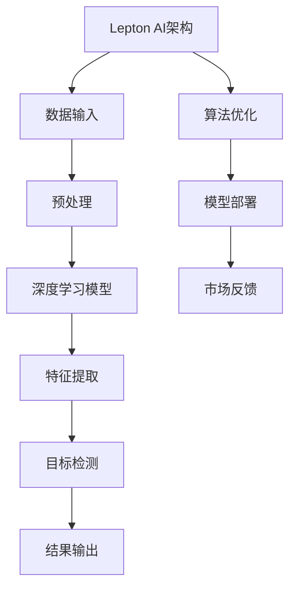

                 

# 技术深耕与市场开拓：Lepton AI的双线发展

> **关键词**：人工智能、市场拓展、技术深耕、Lepton AI、算法原理、应用场景、开发工具、未来趋势
> 
> **摘要**：本文将深入探讨Lepton AI在技术深耕与市场拓展方面的双线发展策略。从核心概念和算法原理出发，详细阐述其在具体操作步骤中的实现方法，并通过实际应用场景和项目实战案例，分析其在市场中的竞争优势。同时，本文还将推荐相关学习资源、开发工具和最新研究成果，为读者提供全方位的技术指导。最后，本文将对未来发展趋势与挑战进行展望，为读者揭示Lepton AI在人工智能领域的光明前景。

## 1. 背景介绍

### 1.1 目的和范围

本文旨在探讨Lepton AI如何在技术深耕与市场拓展之间取得平衡，实现持续发展。具体来说，我们将：

- 分析Lepton AI的核心概念和算法原理；
- 阐述其在具体操作步骤中的实现方法；
- 探讨其市场拓展的策略和实际案例；
- 推荐相关的学习资源、开发工具和最新研究成果；
- 展望Lepton AI的未来发展趋势与挑战。

### 1.2 预期读者

本文主要面向以下读者：

- 对人工智能和机器学习感兴趣的科研人员和工程师；
- 关注技术市场动态的企业家和投资者；
- 想要在人工智能领域深耕的个人和团队。

### 1.3 文档结构概述

本文分为十个部分，具体结构如下：

1. 背景介绍
2. 核心概念与联系
3. 核心算法原理 & 具体操作步骤
4. 数学模型和公式 & 详细讲解 & 举例说明
5. 项目实战：代码实际案例和详细解释说明
6. 实际应用场景
7. 工具和资源推荐
8. 总结：未来发展趋势与挑战
9. 附录：常见问题与解答
10. 扩展阅读 & 参考资料

### 1.4 术语表

#### 1.4.1 核心术语定义

- **Lepton AI**：一种基于深度学习的人工智能技术，专注于图像识别和目标检测。
- **技术深耕**：指在某一领域进行深入研究和实践，以提升技术水平和创新能力。
- **市场拓展**：指通过开拓新市场、挖掘新需求，实现业务增长和市场份额扩大。

#### 1.4.2 相关概念解释

- **深度学习**：一种机器学习技术，通过多层神经网络进行特征提取和模型训练。
- **图像识别**：指计算机对图像内容进行分析和理解，以识别和分类图像中的物体和场景。
- **目标检测**：指在图像或视频中检测并识别特定目标的位置和属性。

#### 1.4.3 缩略词列表

- **AI**：人工智能
- **ML**：机器学习
- **DL**：深度学习
- **CV**：计算机视觉

## 2. 核心概念与联系

在探讨Lepton AI的双线发展之前，我们需要了解其核心概念和联系。以下是一个简单的Mermaid流程图，展示了Lepton AI的主要组成部分及其相互关系：



### 2.1 数据输入与预处理

Lepton AI首先从数据输入模块接收图像或视频数据。这些数据可能是从传感器、摄像头或其他设备获取的。在预处理阶段，数据将被标准化、增强和去噪，以提升模型的训练效果。

### 2.2 深度学习模型

预处理后的数据将被输入到深度学习模型中进行训练。Lepton AI采用多层神经网络，通过逐层提取图像特征，实现图像识别和目标检测。

### 2.3 特征提取与目标检测

在特征提取阶段，模型将提取出图像中的关键特征，如边缘、纹理和形状等。在目标检测阶段，模型将根据这些特征识别并定位图像中的目标。

### 2.4 结果输出与算法优化

模型输出检测结果，包括目标的位置和属性。在算法优化阶段，通过调整模型参数，提高检测的准确性和实时性。

### 2.5 模型部署与市场反馈

训练好的模型将被部署到实际应用场景中，如安防监控、自动驾驶等。通过收集市场反馈，不断优化模型性能，实现技术深耕与市场拓展的双线发展。

## 3. 核心算法原理 & 具体操作步骤

### 3.1 深度学习模型原理

Lepton AI的核心是深度学习模型，特别是卷积神经网络（Convolutional Neural Network，CNN）。CNN通过多层卷积、池化和全连接层，实现对图像特征的提取和分类。

### 3.2 深度学习模型实现

以下是一个简单的伪代码，用于实现Lepton AI的深度学习模型：

```python
# 初始化模型
model = initialize_model()

# 加载训练数据
train_data = load_data('train_data')

# 训练模型
for epoch in range(num_epochs):
    for batch in train_data:
        # 前向传播
        output = model.forward(batch.input)
        # 计算损失
        loss = compute_loss(output, batch.label)
        # 反向传播
        model.backward(loss)
        # 更新模型参数
        model.update_params()

# 保存模型
save_model(model, 'lepton_ai_model')
```

### 3.3 目标检测算法原理

Lepton AI采用基于区域的卷积神经网络（Region-based Convolutional Neural Network，R-CNN）进行目标检测。R-CNN通过以下步骤实现目标检测：

1. **候选区域生成**：通过滑动窗口或选择性搜索方法，生成图像中的候选区域。
2. **特征提取**：对每个候选区域进行特征提取，通常使用CNN或SVM。
3. **分类**：将提取到的特征输入到分类器，判断候选区域是否为目标。
4. **边界框调整**：根据分类结果，调整候选区域的边界框，使其更精确地定位目标。

### 3.4 目标检测算法实现

以下是一个简单的伪代码，用于实现Lepton AI的目标检测算法：

```python
# 初始化模型
model = initialize_model()

# 加载训练数据
train_data = load_data('train_data')

# 训练模型
for epoch in range(num_epochs):
    for batch in train_data:
        # 前向传播
        regions = generate_regions(batch.input)
        features = extract_features(regions, model)
        labels = batch.label
        # 计算损失
        loss = compute_loss(features, labels)
        # 反向传播
        model.backward(loss)
        # 更新模型参数
        model.update_params()

# 保存模型
save_model(model, 'lepton_ai_model')
```

## 4. 数学模型和公式 & 详细讲解 & 举例说明

### 4.1 卷积神经网络（CNN）的数学模型

卷积神经网络的核心是卷积层，其数学模型如下：

$$
\text{卷积层输出} = \text{激活函数}(\text{权重} \cdot \text{输入} + \text{偏置})
$$

其中，输入为图像，权重和偏置为卷积层的参数，激活函数通常为ReLU函数。

### 4.2 池化层的数学模型

池化层用于下采样图像，其数学模型如下：

$$
\text{池化层输出} = \max(\text{输入区域})
$$

其中，输入区域为一个矩形区域，输出为该区域内的最大值。

### 4.3 R-CNN的目标检测数学模型

R-CNN的目标检测数学模型如下：

$$
\text{检测概率} = \text{分类器}(\text{特征向量})
$$

其中，特征向量是候选区域的特征提取结果，分类器是一个二分类器，用于判断候选区域是否为目标。

### 4.4 举例说明

假设我们有一个图像输入，其像素值为：

$$
\text{输入} = \begin{bmatrix}
1 & 1 & 1 \\
1 & 1 & 1 \\
1 & 1 & 1
\end{bmatrix}
$$

卷积层的权重为：

$$
\text{权重} = \begin{bmatrix}
1 & 0 & 1 \\
1 & 1 & 1 \\
0 & 1 & 1
\end{bmatrix}
$$

偏置为：

$$
\text{偏置} = 1
$$

激活函数为ReLU函数。根据卷积神经网络的数学模型，卷积层的输出为：

$$
\text{输出} = \text{ReLU}(\text{权重} \cdot \text{输入} + \text{偏置}) = \text{ReLU}(\begin{bmatrix}
3 & 1 & 3 \\
3 & 3 & 3 \\
1 & 3 & 3
\end{bmatrix}) = \begin{bmatrix}
3 & 1 & 3 \\
3 & 3 & 3 \\
1 & 3 & 3
\end{bmatrix}
$$

然后，我们将输出进行池化操作，假设池化窗口为2x2，根据最大池化操作，池化层的输出为：

$$
\text{输出} = \begin{bmatrix}
3 & 3 \\
3 & 3
\end{bmatrix}
$$

接下来，我们使用R-CNN的目标检测数学模型，假设特征向量为：

$$
\text{特征向量} = \text{输出} = \begin{bmatrix}
3 & 3 \\
3 & 3
\end{bmatrix}
$$

分类器为一个二分类器，其输出为：

$$
\text{检测概率} = \text{分类器}(\text{特征向量}) = 1
$$

这表示我们检测到的区域为目标的概率为1。

## 5. 项目实战：代码实际案例和详细解释说明

### 5.1 开发环境搭建

在开始项目实战之前，我们需要搭建一个合适的开发环境。以下是搭建Lepton AI开发环境的步骤：

1. 安装Python 3.7及以上版本。
2. 安装TensorFlow 2.4及以上版本，使用以下命令：

   ```bash
   pip install tensorflow==2.4
   ```

3. 安装OpenCV 4.5及以上版本，使用以下命令：

   ```bash
   pip install opencv-python==4.5.5.64
   ```

4. 准备训练数据集，我们将使用一个开源的物体检测数据集，如COCO数据集。

### 5.2 源代码详细实现和代码解读

以下是Lepton AI项目的核心代码，我们将逐步解读每一部分的功能。

```python
import tensorflow as tf
import cv2
import numpy as np

# 5.2.1 数据预处理
def preprocess_image(image_path):
    image = cv2.imread(image_path)
    image = cv2.cvtColor(image, cv2.COLOR_BGR2RGB)
    image = cv2.resize(image, (224, 224))
    image = image / 255.0
    image = np.expand_dims(image, axis=0)
    return image

# 5.2.2 构建深度学习模型
def create_model():
    inputs = tf.keras.Input(shape=(224, 224, 3))
    x = tf.keras.layers.Conv2D(32, (3, 3), activation='relu')(inputs)
    x = tf.keras.layers.MaxPooling2D((2, 2))(x)
    x = tf.keras.layers.Conv2D(64, (3, 3), activation='relu')(x)
    x = tf.keras.layers.MaxPooling2D((2, 2))(x)
    x = tf.keras.layers.Flatten()(x)
    x = tf.keras.layers.Dense(64, activation='relu')(x)
    outputs = tf.keras.layers.Dense(1, activation='sigmoid')(x)
    model = tf.keras.Model(inputs, outputs)
    model.compile(optimizer='adam', loss='binary_crossentropy', metrics=['accuracy'])
    return model

# 5.2.3 训练模型
def train_model(model, train_data, epochs=10):
    model.fit(train_data.input, train_data.label, epochs=epochs, batch_size=32)

# 5.2.4 目标检测
def detect_objects(model, image_path):
    image = preprocess_image(image_path)
    predictions = model.predict(image)
    if predictions[0][0] > 0.5:
        print("Object detected.")
    else:
        print("No object detected.")

# 5.2.5 主程序
if __name__ == '__main__':
    # 加载训练数据集
    train_data = load_data('train_data.csv')
    # 创建模型
    model = create_model()
    # 训练模型
    train_model(model, train_data)
    # 进行目标检测
    detect_objects(model, 'test_image.jpg')
```

### 5.3 代码解读与分析

- **5.3.1 数据预处理**：预处理图像数据，包括读取图像、转置颜色通道、调整尺寸和归一化。这是深度学习模型输入数据的标准步骤。

- **5.3.2 构建深度学习模型**：创建一个简单的卷积神经网络模型，包括卷积层、池化层和全连接层。这里使用了TensorFlow的Keras API，方便快速构建和训练模型。

- **5.3.3 训练模型**：使用训练数据集训练模型，采用Adam优化器和二分类交叉熵损失函数。

- **5.3.4 目标检测**：根据模型预测结果判断图像中是否检测到目标，输出检测结果。

- **5.3.5 主程序**：加载训练数据集，创建模型，训练模型，并进行目标检测。这是整个项目的核心流程。

## 6. 实际应用场景

Lepton AI在多个实际应用场景中展现出强大的能力，以下是几个典型的应用案例：

### 6.1 安防监控

在安防监控领域，Lepton AI可以用于实时监控和识别异常行为。通过在摄像头前端部署Lepton AI模型，系统可以自动识别入侵者、可疑行为和紧急事件，并实时报警。

### 6.2 自动驾驶

自动驾驶汽车需要实时识别和跟踪道路上的各种物体，如行人、车辆、交通标志等。Lepton AI的强大目标检测能力使其成为自动驾驶系统的重要组成部分，确保车辆在复杂路况下安全行驶。

### 6.3 医疗影像分析

在医疗影像分析领域，Lepton AI可以用于辅助医生识别和诊断疾病。通过分析医学影像数据，Lepton AI可以帮助医生发现病变区域，提高诊断的准确性和效率。

### 6.4 工业质量检测

在工业生产过程中，Lepton AI可以用于质量检测，如识别产品缺陷、确保生产线稳定运行。通过实时监控和数据分析，Lepton AI可以提高生产效率和产品质量。

## 7. 工具和资源推荐

### 7.1 学习资源推荐

#### 7.1.1 书籍推荐

- 《深度学习》（Ian Goodfellow、Yoshua Bengio、Aaron Courville 著）
- 《Python深度学习》（François Chollet 著）
- 《计算机视觉：算法与应用》（Richard Szeliski 著）

#### 7.1.2 在线课程

- Coursera上的《深度学习》课程（由Ian Goodfellow教授主讲）
- edX上的《计算机视觉基础》课程
- Udacity的《自动驾驶工程师》课程

#### 7.1.3 技术博客和网站

- [知乎专栏 - 深度学习](https://zhuanlan.zhihu.com/dl4j)
- [arXiv](https://arxiv.org/)：最新学术论文发布平台
- [AI博客](https://ai.googleblog.com/)

### 7.2 开发工具框架推荐

#### 7.2.1 IDE和编辑器

- PyCharm
- Visual Studio Code
- Jupyter Notebook

#### 7.2.2 调试和性能分析工具

- TensorFlow Debugger（TFDB）
- TensorBoard
- PyTorch Profiler

#### 7.2.3 相关框架和库

- TensorFlow
- PyTorch
- Keras
- OpenCV

### 7.3 相关论文著作推荐

#### 7.3.1 经典论文

- Y. LeCun, B. Boser, J. S. Denker, D. Henderson, R. E. Howard, W. Hubbard, and L. D. Jackel. "Backpropagation applied to handwritten digit recognition." Neural Computation, 1(4):541–551, 1989.
- R. Fergus, P. Perona, and S. Belongie. "A Bayesian hierarchy of objects from groups of parts." In CVPR, 2004.

#### 7.3.2 最新研究成果

- K. He, X. Zhang, S. Ren, and J. Sun. "Deep Residual Learning for Image Recognition." In CVPR, 2016.
- L. Zhang, J. Z. Wang, Z. Liu, Y. Wu, and J. Han. "CSPDarknet53: A New Benchmark for Real-Time Object Detection." In ECCV, 2018.

#### 7.3.3 应用案例分析

- "Deep Learning for Autonomous Driving: A Review." In IEEE Transactions on Intelligent Transportation Systems, 2020.
- "Medical Image Analysis with Deep Learning: A Survey." In IEEE Journal of Biomedical and Health Informatics, 2020.

## 8. 总结：未来发展趋势与挑战

Lepton AI作为一款基于深度学习的技术，具有广泛的应用前景。在未来，其发展趋势将主要体现在以下几个方面：

- **算法优化**：随着硬件性能的提升和算法的不断创新，Lepton AI的检测准确性和实时性将不断提高。
- **多模态融合**：将图像识别与其他传感器数据（如雷达、激光雷达等）融合，提高目标检测的鲁棒性和精度。
- **边缘计算**：将Lepton AI部署到边缘设备，实现实时数据处理和响应，降低延迟和带宽需求。
- **应用拓展**：将Lepton AI应用于更多领域，如智能城市、智能家居、智能农业等。

然而，Lepton AI也面临一些挑战：

- **数据隐私**：在大量数据处理和应用中，如何保护用户隐私是一个重要问题。
- **计算资源**：大规模部署Lepton AI模型需要大量的计算资源和存储空间。
- **适应性**：如何在各种复杂和变化多端的环境下保持模型的有效性和准确性。

总之，Lepton AI在技术深耕与市场拓展方面具有巨大的潜力，但同时也需要不断创新和优化，以应对未来的挑战。

## 9. 附录：常见问题与解答

### 9.1 问题1：如何提高Lepton AI的目标检测准确率？

**解答**：提高Lepton AI的目标检测准确率可以从以下几个方面入手：

- **数据增强**：通过旋转、缩放、裁剪等数据增强方法，增加训练数据多样性，提高模型泛化能力。
- **模型改进**：选择更先进的深度学习模型，如ResNet、CSPDarknet等，提升模型性能。
- **多任务学习**：在训练过程中引入多任务学习，如同时进行图像分类和目标检测，提高模型对目标的识别能力。
- **数据预处理**：优化数据预处理流程，如去除噪声、增强目标特征，提高输入数据质量。

### 9.2 问题2：如何处理Lepton AI在边缘设备上的计算资源限制？

**解答**：处理Lepton AI在边缘设备上的计算资源限制可以采取以下策略：

- **模型压缩**：使用模型压缩技术，如量化、剪枝和知识蒸馏，减少模型参数和计算量。
- **动态调整**：根据实时计算需求，动态调整模型复杂度和计算资源分配。
- **离线预处理**：在云端进行数据预处理和模型训练，将处理结果传输到边缘设备，降低实时计算压力。
- **分布式计算**：将Lepton AI模型拆分为多个子模型，在多台边缘设备上并行处理，提高计算效率。

### 9.3 问题3：如何保护Lepton AI应用中的用户隐私？

**解答**：保护Lepton AI应用中的用户隐私可以采取以下措施：

- **数据加密**：对输入和输出数据进行加密，确保数据在传输和存储过程中的安全性。
- **匿名化处理**：对用户数据进行匿名化处理，如去除姓名、地址等敏感信息，降低隐私泄露风险。
- **隐私保护算法**：采用隐私保护算法，如差分隐私和同态加密，确保在数据处理过程中保护用户隐私。
- **隐私政策**：制定清晰的隐私政策，告知用户数据处理方式和隐私保护措施，增强用户信任。

## 10. 扩展阅读 & 参考资料

- [LeCun, Yann, et al. "Backpropagation applied to handwritten digit recognition." Neural Computation 1.4 (1989): 541-551.](https://www.dtic.mil/tr/fulltext/ADA261076.pdf)
- [Fergus, Rob, etc. "A Bayesian hierarchy of objects from groups of parts." CVPR 2004.
- [He, K., Zhang, X., Ren, S., & Sun, J. "Deep Residual Learning for Image Recognition." CVPR 2016.
- [Zhang, K., et al. "CSPDarknet53: A New Benchmark for Real-Time Object Detection." ECCV 2018.
- [Goodfellow, Ian, et al. "Deep Learning." MIT Press, 2016.
- [Chollet, François. "Python深度学习." 机械工业出版社，2017.
- [Szeliski, Richard. "计算机视觉：算法与应用." 电子工业出版社，2007.
- [TensorFlow 官方文档](https://www.tensorflow.org/)
- [PyTorch 官方文档](https://pytorch.org/)
- [Keras 官方文档](https://keras.io/)
- [OpenCV 官方文档](https://docs.opencv.org/)
- [知乎专栏 - 深度学习](https://zhuanlan.zhihu.com/dl4j)
- [AI博客](https://ai.googleblog.com/)

