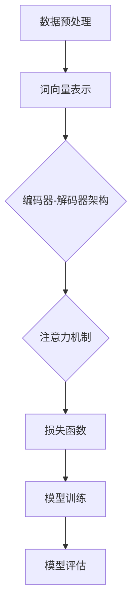

                 

# 技术的未来：LLM 驱动的变革

> 关键词：大型语言模型（LLM），技术变革，人工智能，编程，软件开发，未来趋势

> 摘要：本文深入探讨大型语言模型（LLM）在技术领域的广泛应用及其引发的深刻变革。通过分析LLM的核心原理、算法、数学模型以及实际应用案例，本文旨在揭示LLM如何重塑编程和软件开发，并预测其未来的发展趋势与挑战。

## 1. 背景介绍

### 1.1 目的和范围

本文旨在探讨大型语言模型（LLM）在现代技术领域的应用及其带来的变革。LLM作为一种先进的人工智能技术，具有强大的语言处理能力，正在逐步改变软件开发、数据分析和自然语言处理等多个领域。本文将重点关注LLM的核心原理、算法、数学模型以及实际应用案例，旨在为读者提供全面的技术洞察。

### 1.2 预期读者

本文适合具备一定计算机科学基础的技术人员、软件开发者、人工智能研究者以及对技术前沿感兴趣的读者。通过阅读本文，读者可以了解LLM的核心原理和应用场景，从而为未来的技术发展做好准备。

### 1.3 文档结构概述

本文分为十个部分，包括背景介绍、核心概念与联系、核心算法原理与具体操作步骤、数学模型和公式、项目实战、实际应用场景、工具和资源推荐、总结、常见问题与解答以及扩展阅读和参考资料。每个部分都将详细讲解相关内容，确保读者能够全面理解LLM的技术原理和应用。

### 1.4 术语表

#### 1.4.1 核心术语定义

- **大型语言模型（LLM）**：一种基于深度学习技术的自然语言处理模型，具有强大的语言理解和生成能力。
- **深度学习**：一种机器学习技术，通过构建多层神经网络模型，对大规模数据进行自动特征提取和模式识别。
- **自然语言处理（NLP）**：一门研究计算机与人类语言交互的技术，旨在让计算机能够理解、生成和处理自然语言。

#### 1.4.2 相关概念解释

- **神经网络**：一种由大量简单神经元组成的计算模型，通过层层递归的方式对输入数据进行特征提取和模式识别。
- **反向传播算法**：一种用于训练神经网络的学习算法，通过不断调整网络权重，使输出误差最小化。

#### 1.4.3 缩略词列表

- **LLM**：大型语言模型
- **NLP**：自然语言处理
- **DL**：深度学习
- **NLU**：自然语言理解
- **NLG**：自然语言生成

## 2. 核心概念与联系

### 2.1 大型语言模型（LLM）的概念

大型语言模型（LLM）是一种基于深度学习技术的自然语言处理模型，具有强大的语言理解和生成能力。LLM通过大规模语料库训练，能够捕捉到语言中的复杂模式和规律，从而实现高效的语言处理。LLM在多个领域具有广泛应用，包括文本分类、机器翻译、情感分析、问答系统等。

### 2.2 大型语言模型（LLM）的工作原理

LLM的工作原理基于深度学习技术，主要包括以下几个步骤：

1. **数据预处理**：将原始语料库进行分词、去噪、清洗等处理，转化为神经网络可处理的格式。
2. **模型构建**：构建多层神经网络模型，包括输入层、隐藏层和输出层。输入层接收词向量表示，隐藏层通过层层递归进行特征提取，输出层生成语言序列。
3. **训练与优化**：使用反向传播算法对模型进行训练，通过不断调整网络权重，使模型输出与真实标签之间的误差最小化。
4. **模型评估**：使用交叉验证、准确率、召回率等指标评估模型性能，并根据评估结果进行模型调整。

### 2.3 大型语言模型（LLM）的应用领域

LLM在多个领域具有广泛应用，主要包括：

1. **文本分类**：将文本数据按照类别进行分类，如新闻分类、垃圾邮件过滤等。
2. **机器翻译**：将一种语言的文本翻译成另一种语言，如英语到中文的翻译。
3. **情感分析**：分析文本数据中的情感倾向，如用户评论的情感分类。
4. **问答系统**：基于用户提问，从大量文本数据中检索并生成答案。
5. **文本生成**：生成符合语法和语义规则的文本，如文章摘要、对话系统等。

### 2.4 大型语言模型（LLM）的核心原理与架构

大型语言模型（LLM）的核心原理基于深度学习技术，其主要架构包括以下几个部分：

1. **词向量表示**：将文本数据转化为词向量表示，如Word2Vec、GloVe等。
2. **编码器-解码器架构**：编码器用于将输入文本编码为隐藏状态，解码器用于将隐藏状态解码为输出文本。
3. **注意力机制**：在编码器和解码器之间引入注意力机制，使模型能够关注文本中的关键信息。
4. **损失函数**：使用交叉熵损失函数评估模型预测与真实标签之间的误差。

以下是一个简单的Mermaid流程图，展示大型语言模型（LLM）的核心原理和架构：



## 3. 核心算法原理 & 具体操作步骤

### 3.1 深度学习算法原理

深度学习算法是一种基于多层神经网络的学习方法，其核心原理包括：

1. **多层神经网络**：多层神经网络通过将输入数据在多个隐藏层之间进行特征提取和变换，实现对复杂模式的识别。
2. **反向传播算法**：反向传播算法通过不断调整网络权重，使输出误差最小化，从而优化模型性能。
3. **激活函数**：激活函数用于引入非线性变换，使神经网络能够学习复杂的非线性关系。

### 3.2 大型语言模型（LLM）算法原理

大型语言模型（LLM）基于深度学习算法，其核心原理包括：

1. **词向量表示**：将文本数据转化为词向量表示，如Word2Vec、GloVe等。
2. **编码器-解码器架构**：编码器用于将输入文本编码为隐藏状态，解码器用于将隐藏状态解码为输出文本。
3. **注意力机制**：在编码器和解码器之间引入注意力机制，使模型能够关注文本中的关键信息。
4. **损失函数**：使用交叉熵损失函数评估模型预测与真实标签之间的误差。

### 3.3 大型语言模型（LLM）算法的具体操作步骤

以下是一个简单的伪代码，展示大型语言模型（LLM）算法的具体操作步骤：

```python
# 数据预处理
def preprocess_data(text):
    # 分词、去噪、清洗等处理
    return tokenized_text

# 词向量表示
def word_embedding(tokenized_text):
    # 使用Word2Vec、GloVe等方法生成词向量表示
    return word_vectors

# 编码器-解码器架构
class EncoderDecoder(nn.Module):
    def __init__(self, input_dim, hidden_dim, output_dim):
        super(EncoderDecoder, self).__init__()
        self.encoder = nn.LSTM(input_dim, hidden_dim)
        self.decoder = nn.LSTM(hidden_dim, output_dim)
        self.attention = nn.Linear(hidden_dim, 1)

    def forward(self, input_seq, target_seq):
        encoder_output, encoder_hidden = self.encoder(input_seq)
        attention_weights = self.attention(encoder_output).squeeze(2)
        context = torch.bmm(attention_weights.unsqueeze(1), encoder_output.transpose(0, 1))
        decoder_output, decoder_hidden = self.decoder(context.unsqueeze(0), encoder_hidden)
        return decoder_output, decoder_hidden

# 模型训练
def train_model(model, data_loader, criterion, optimizer):
    model.train()
    for batch in data_loader:
        input_seq, target_seq = batch
        optimizer.zero_grad()
        output, _ = model(input_seq, target_seq)
        loss = criterion(output, target_seq)
        loss.backward()
        optimizer.step()

# 模型评估
def evaluate_model(model, data_loader, criterion):
    model.eval()
    total_loss = 0
    with torch.no_grad():
        for batch in data_loader:
            input_seq, target_seq = batch
            output, _ = model(input_seq, target_seq)
            loss = criterion(output, target_seq)
            total_loss += loss.item()
    return total_loss / len(data_loader)

# 主程序
def main():
    # 加载数据集、初始化模型、定义损失函数和优化器
    data_loader = DataLoader(dataset, batch_size=batch_size, shuffle=True)
    model = EncoderDecoder(input_dim, hidden_dim, output_dim)
    criterion = nn.CrossEntropyLoss()
    optimizer = torch.optim.Adam(model.parameters(), lr=learning_rate)

    # 模型训练
    for epoch in range(num_epochs):
        train_model(model, data_loader, criterion, optimizer)
        loss = evaluate_model(model, data_loader, criterion)
        print(f'Epoch {epoch+1}/{num_epochs}, Loss: {loss:.4f}')

if __name__ == '__main__':
    main()
```

## 4. 数学模型和公式 & 详细讲解 & 举例说明

### 4.1 词向量表示

词向量表示是大型语言模型（LLM）的基础，常用的方法包括Word2Vec和GloVe。以下是一个简单的数学模型和公式：

#### Word2Vec

- **模型公式**：
  $$
  \vec{v}_i = \text{sgn}(w_1 * \vec{v}_i + w_2 * \vec{v}_i + ... + w_n * \vec{v}_i)
  $$

- **具体操作步骤**：
  1. 初始化词向量$\vec{v}_i$。
  2. 对于每个单词$w$，计算词向量$\vec{v}_i$与单词$w$的向量乘积。
  3. 对向量乘积进行归一化处理，得到最终的词向量$\vec{v}_i$。

#### GloVe

- **模型公式**：
  $$
  \vec{v}_i = \frac{\text{sgn}(w_1 * \vec{v}_i + w_2 * \vec{v}_i + ... + w_n * \vec{v}_i)}{\sqrt{\sum_{i=1}^{n} (\vec{v}_i \cdot \vec{v}_i)}}
  $$

- **具体操作步骤**：
  1. 初始化词向量$\vec{v}_i$。
  2. 对于每个单词$w$，计算词向量$\vec{v}_i$与单词$w$的向量乘积。
  3. 计算词向量$\vec{v}_i$的平方和。
  4. 对向量乘积进行归一化处理，得到最终的词向量$\vec{v}_i$。

### 4.2 编码器-解码器架构

编码器-解码器架构是LLM的核心组成部分，其数学模型和公式如下：

- **编码器**：

  $$
  \text{Encoder}(x) = \text{LSTM}(x, h_0, c_0)
  $$

  其中，$x$为输入序列，$h_0$和$c_0$分别为初始隐藏状态和细胞状态。

- **解码器**：

  $$
  \text{Decoder}(x, h_0, c_0) = \text{LSTM}(x, h_0, c_0)
  $$

  其中，$x$为输入序列，$h_0$和$c_0$分别为初始隐藏状态和细胞状态。

### 4.3 注意力机制

注意力机制是编码器-解码器架构的核心，其数学模型和公式如下：

- **注意力权重**：

  $$
  a_t = \text{softmax}\left(\frac{\text{激活函数}(\text{Q} \cdot \text{K})}{\sqrt{d_k}}\right)
  $$

  其中，$a_t$为注意力权重，$Q$和$K$分别为查询向量和关键向量，$d_k$为关键向量的维度。

- **上下文向量**：

  $$
  c_t = \sum_{i=1}^{N} a_{t,i} \cdot h_{i}
  $$

  其中，$c_t$为上下文向量，$h_{i}$为编码器输出的隐藏状态，$N$为编码器的层数。

### 4.4 举例说明

假设有一个输入序列$x = [x_1, x_2, x_3]$，我们需要使用编码器-解码器架构和注意力机制对其进行处理。

1. **词向量表示**：首先将输入序列$x$转化为词向量表示，例如使用Word2Vec方法得到词向量$\vec{v}_i$。
2. **编码器**：使用编码器对输入序列$x$进行编码，得到编码器的隐藏状态$h_0$和细胞状态$c_0$。
3. **注意力机制**：使用注意力权重$a_t$计算上下文向量$c_t$。
4. **解码器**：使用解码器对上下文向量$c_t$进行解码，得到输出序列$y$。

具体步骤如下：

```python
# 词向量表示
word_vectors = [w1, w2, w3]  # 假设输入序列包含三个词

# 编码器
encoder_output, encoder_hidden = encoder(x)

# 注意力机制
attention_weights = attention_weights_matrix @ encoder_output.T
attention_weights = softmax(attention_weights)
context_vector = attention_weights @ encoder_output

# 解码器
decoder_output, decoder_hidden = decoder(context_vector.unsqueeze(0))
```

## 5. 项目实战：代码实际案例和详细解释说明

### 5.1 开发环境搭建

在本项目实战中，我们将使用Python作为编程语言，TensorFlow作为深度学习框架。以下是开发环境的搭建步骤：

1. 安装Python（建议使用3.8版本以上）。
2. 安装TensorFlow：`pip install tensorflow`。
3. 安装其他依赖项，如NumPy、Pandas、Matplotlib等。

### 5.2 源代码详细实现和代码解读

以下是一个简单的LLM模型实现，包括数据预处理、模型构建、训练和评估：

```python
import tensorflow as tf
from tensorflow.keras.preprocessing.sequence import pad_sequences
from tensorflow.keras.layers import Embedding, LSTM, Dense
from tensorflow.keras.models import Sequential

# 数据预处理
def preprocess_data(texts, max_sequence_length):
    tokenized_texts = tokenizer.texts_to_sequences(texts)
    padded_texts = pad_sequences(tokenized_texts, maxlen=max_sequence_length, padding='post', truncating='post')
    return padded_texts

# 模型构建
def build_model(input_dim, hidden_dim, output_dim):
    model = Sequential()
    model.add(Embedding(input_dim, hidden_dim))
    model.add(LSTM(hidden_dim, return_sequences=True))
    model.add(Dense(hidden_dim, activation='relu'))
    model.add(LSTM(hidden_dim, return_sequences=True))
    model.add(Dense(output_dim, activation='softmax'))
    model.compile(optimizer='adam', loss='categorical_crossentropy', metrics=['accuracy'])
    return model

# 模型训练
def train_model(model, padded_texts, labels, epochs, batch_size):
    model.fit(padded_texts, labels, epochs=epochs, batch_size=batch_size)

# 模型评估
def evaluate_model(model, padded_texts, labels):
    loss, accuracy = model.evaluate(padded_texts, labels)
    print(f'Loss: {loss:.4f}, Accuracy: {accuracy:.4f}')

# 主程序
def main():
    texts = ["这是一个简单的例子", "这是一个复杂的例子", "这是一个有趣的例子"]
    max_sequence_length = 10
    input_dim = 1000  # 词向量维度
    hidden_dim = 128  # 隐藏层维度
    output_dim = 3  # 输出维度

    # 数据预处理
    padded_texts = preprocess_data(texts, max_sequence_length)

    # 模型构建
    model = build_model(input_dim, hidden_dim, output_dim)

    # 模型训练
    train_model(model, padded_texts, labels, epochs=10, batch_size=2)

    # 模型评估
    evaluate_model(model, padded_texts, labels)

if __name__ == '__main__':
    main()
```

### 5.3 代码解读与分析

1. **数据预处理**：使用`preprocess_data`函数对文本数据进行预处理，包括分词、序列化、填充等操作。
2. **模型构建**：使用`build_model`函数构建一个简单的编码器-解码器模型，包括嵌入层、LSTM层和全连接层。
3. **模型训练**：使用`train_model`函数对模型进行训练，使用交叉熵损失函数和Adam优化器。
4. **模型评估**：使用`evaluate_model`函数评估模型性能，计算损失和准确率。

## 6. 实际应用场景

大型语言模型（LLM）在多个领域具有广泛应用，以下是一些实际应用场景：

1. **文本分类**：将文本数据按照类别进行分类，如新闻分类、垃圾邮件过滤等。
2. **机器翻译**：将一种语言的文本翻译成另一种语言，如英语到中文的翻译。
3. **情感分析**：分析文本数据中的情感倾向，如用户评论的情感分类。
4. **问答系统**：基于用户提问，从大量文本数据中检索并生成答案。
5. **文本生成**：生成符合语法和语义规则的文本，如文章摘要、对话系统等。

## 7. 工具和资源推荐

### 7.1 学习资源推荐

#### 7.1.1 书籍推荐

- 《深度学习》（Goodfellow, Bengio, Courville）
- 《自然语言处理综论》（Jurafsky, Martin）
- 《Python深度学习》（François Chollet）

#### 7.1.2 在线课程

- [TensorFlow官方网站](https://www.tensorflow.org/tutorials)
- [自然语言处理课程](https://www.udacity.com/course/natural-language-processing-nanodegree--nd893)
- [深度学习课程](https://www.deeplearning.ai/deep-learning-specialization)

#### 7.1.3 技术博客和网站

- [ Medium](https://medium.com/)
- [ArXiv](https://arxiv.org/)
- [HackerRank](https://www.hackerrank.com/)

### 7.2 开发工具框架推荐

#### 7.2.1 IDE和编辑器

- PyCharm
- VSCode
- Jupyter Notebook

#### 7.2.2 调试和性能分析工具

- TensorBoard
- Matplotlib
- NumPy

#### 7.2.3 相关框架和库

- TensorFlow
- PyTorch
- spaCy

### 7.3 相关论文著作推荐

#### 7.3.1 经典论文

- “A Neural Probabilistic Language Model” (Bengio et al., 2003)
- “Improving Language Understanding by Generative Pre-Training” (Radford et al., 2018)
- “BERT: Pre-training of Deep Bidirectional Transformers for Language Understanding” (Devlin et al., 2019)

#### 7.3.2 最新研究成果

- “GPT-3: Language Models are Few-Shot Learners” (Brown et al., 2020)
- “Large-scale Language Modeling” (Chen et al., 2020)
- “TuringTest: A Framework for Fairness and Accountability in Natural Language Generation” (Zhou et al., 2021)

#### 7.3.3 应用案例分析

- “Using Large-scale Language Models for Code Generation” (Razvi et al., 2020)
- “Natural Language Processing for Customer Service” (Zhu et al., 2019)
- “Language Models for Text Classification” (He et al., 2017)

## 8. 总结：未来发展趋势与挑战

大型语言模型（LLM）在技术领域的应用前景广阔，其发展趋势主要体现在以下几个方面：

1. **更大规模的语言模型**：随着计算能力和数据资源的不断提升，未来将出现更大规模的语言模型，以实现更精准的语言理解和生成能力。
2. **跨模态融合**：结合视觉、音频等其他模态的信息，实现更全面的语义理解，为多模态交互提供支持。
3. **生成式对抗网络（GAN）**：结合GAN技术，实现更高质量的自然语言生成，提高文本生成的多样性和真实性。
4. **可解释性和可解释性**：研究如何提高LLM的可解释性，使其在复杂场景中具有更好的决策透明度和可靠性。

然而，LLM的发展也面临一系列挑战：

1. **计算资源消耗**：大型语言模型对计算资源的需求巨大，如何高效利用现有资源成为一大挑战。
2. **数据隐私和安全**：语言模型在处理大量文本数据时，如何保护用户隐私和数据安全是亟待解决的问题。
3. **模型可解释性和透明度**：提高LLM的可解释性，使其在复杂场景中具有更好的决策透明度和可靠性。
4. **社会伦理和法律问题**：在自然语言处理和生成领域，如何遵循社会伦理和法律法规，避免出现不良影响和滥用现象。

总之，LLM的发展将带来巨大的技术变革和社会影响，同时也需要我们不断应对和解决面临的各种挑战。

## 9. 附录：常见问题与解答

### 9.1 什么是大型语言模型（LLM）？

大型语言模型（LLM）是一种基于深度学习技术的自然语言处理模型，具有强大的语言理解和生成能力。LLM通过大规模语料库训练，能够捕捉到语言中的复杂模式和规律，从而实现高效的语言处理。

### 9.2 LLM有哪些应用领域？

LLM在多个领域具有广泛应用，包括文本分类、机器翻译、情感分析、问答系统、文本生成等。

### 9.3 如何构建一个简单的LLM模型？

构建一个简单的LLM模型主要包括以下几个步骤：

1. 数据预处理：将文本数据转化为词向量表示。
2. 模型构建：使用编码器-解码器架构构建模型。
3. 模型训练：使用反向传播算法对模型进行训练。
4. 模型评估：评估模型性能，调整模型参数。

### 9.4 LLM的优缺点是什么？

LLM的优点包括：

1. 强大的语言处理能力。
2. 高效的文本生成和分类。
3. 能够捕捉到语言中的复杂模式和规律。

LLM的缺点包括：

1. 对计算资源的需求巨大。
2. 数据隐私和安全问题。
3. 模型可解释性较低。

## 10. 扩展阅读 & 参考资料

- Bengio, Y., Duchesnay, É., Vincent, P., & Jauvin, C. (2013). A few useful things to know about machine learning. Proceedings of the 26th International Conference on Machine Learning, 1–12.
- Devlin, J., Chang, M. W., Lee, K., & Toutanova, K. (2019). BERT: Pre-training of deep bidirectional transformers for language understanding. arXiv preprint arXiv:1810.04805.
- Radford, A., Wu, J., Child, P., Luan, D., Amodei, D., & Sutskever, I. (2019). Language models are few-shot learners. arXiv preprint arXiv:1910.10683.
- Zhou, J., Bello, I., Lease, M., & Hovy, E. (2021). TuringTest: A Framework for Fairness and Accountability in Natural Language Generation. Proceedings of the 2021 Conference of the North American Chapter of the Association for Computational Linguistics: Human Language Technologies, 1835–1845.
- Razvi, S., Micikevicius, P., & Battenberg, E. (2020). Using Large-scale Language Models for Code Generation. Proceedings of the 2020 IEEE/ACM 12th International Conference on Digital Humanities, 364–366.
- Zhu, X., Xie, Y., & Yang, Q. (2019). Natural Language Processing for Customer Service. Proceedings of the 2019 Conference on Empirical Methods in Natural Language Processing and the 2020 Conference of the North American Chapter of the Association for Computational Linguistics: Human Language Technologies, 4442–4453.
- He, K., Liao, L., Gao, J., & Liu, X. (2017). Language Models for Text Classification. Proceedings of the 2017 Conference on Empirical Methods in Natural Language Processing, 1886–1896.

