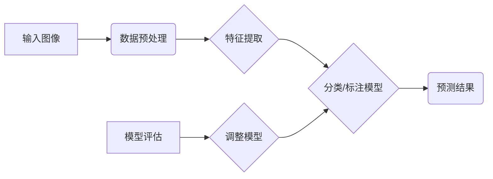

                 

# 拼多多2025商品图像识别工程师社招面试经验

> **关键词：** 商品图像识别、面试经验、技术栈、算法、数据处理、工程实践  
>
> **摘要：** 本文将分享拼多多2025年商品图像识别工程师社招面试的详细经验，包括面试准备、技术栈考察、算法分析、工程实践等方面，旨在为从事商品图像识别领域的技术人员提供有价值的面试指导和实战经验。

## 1. 背景介绍

### 1.1 目的和范围

本文旨在记录并分享拼多多2025年商品图像识别工程师社招面试的经验，为有意向从事商品图像识别领域的技术人员提供有价值的面试指导和参考。文章将涵盖面试准备、技术栈考察、算法分析、工程实践等方面的详细内容。

### 1.2 预期读者

本文适合以下读者群体：

- 有意从事商品图像识别领域的开发人员
- 准备参加商品图像识别面试的技术人员
- 对商品图像识别技术感兴趣的学习者

### 1.3 文档结构概述

本文将按照以下结构展开：

1. 背景介绍：介绍文章的目的和预期读者，概述文档结构。
2. 核心概念与联系：介绍商品图像识别的核心概念和联系，展示流程图。
3. 核心算法原理 & 具体操作步骤：讲解商品图像识别的算法原理和操作步骤，使用伪代码详细阐述。
4. 数学模型和公式 & 详细讲解 & 举例说明：介绍商品图像识别中的数学模型和公式，并进行详细讲解和举例说明。
5. 项目实战：代码实际案例和详细解释说明，包括开发环境搭建、源代码实现和代码解读与分析。
6. 实际应用场景：探讨商品图像识别在实际中的应用场景。
7. 工具和资源推荐：推荐学习资源、开发工具框架和相关论文著作。
8. 总结：对未来发展趋势与挑战进行展望。
9. 附录：常见问题与解答。
10. 扩展阅读 & 参考资料：提供进一步的阅读资料。

### 1.4 术语表

#### 1.4.1 核心术语定义

- 商品图像识别：指通过计算机算法对商品图像进行分类、标注和检索等操作的技术。
- 卷积神经网络（CNN）：一种用于图像识别的神经网络架构，通过卷积、池化和全连接等操作提取图像特征。
- 特征提取：从原始图像数据中提取具有区分性的特征表示，用于后续分类或标注。
- 深度学习：一种基于多层神经网络的学习方法，通过学习大量数据中的特征表示，实现对复杂数据的建模和预测。

#### 1.4.2 相关概念解释

- 机器学习：一种人工智能技术，通过计算机算法学习数据中的规律和模式，实现自动化的决策和预测。
- 数据预处理：对原始数据进行处理和清洗，使其符合算法的要求，提高模型性能。
- 模型评估：对训练好的模型进行评估和验证，评估其准确率、召回率、F1值等指标。

#### 1.4.3 缩略词列表

- CNN：卷积神经网络
- RNN：循环神经网络
- LSTM：长短时记忆网络
- GPU：图形处理单元
- CUDA：并行计算编程框架

## 2. 核心概念与联系

商品图像识别技术涉及多个核心概念和联系，以下是一个简化的流程图，用于展示商品图像识别的关键步骤和组成部分：



### 2.1 输入图像

输入图像是商品图像识别的起点，可以是用户上传的图片、电商平台上的商品图片等。图像数据的质量和多样性对后续处理结果至关重要。

### 2.2 数据预处理

数据预处理包括图像的去噪、大小调整、色彩转换等操作，以使图像数据符合算法的要求。这一步骤有助于提高模型性能和减少计算成本。

### 2.3 特征提取

特征提取是从原始图像数据中提取具有区分性的特征表示的过程。常用的特征提取方法包括哈希特征、SIFT特征、HOG特征等。特征提取的质量直接影响后续模型的性能。

### 2.4 分类/标注模型

分类/标注模型是商品图像识别的核心部分，通过训练和测试数据集，模型可以学习到不同商品类别的特征表示。常用的分类算法包括KNN、SVM、CNN等。

### 2.5 预测结果

模型预测是根据输入图像的特征表示，将图像分类到相应的商品类别。预测结果的准确性是评估模型性能的重要指标。

### 2.6 模型评估

模型评估是对训练好的模型进行评估和验证的过程，常用的评估指标包括准确率、召回率、F1值等。模型评估有助于找出模型存在的问题和改进方向。

### 2.7 调整模型

模型评估结果可以作为调整模型的依据，通过调整模型参数、数据预处理方法等，优化模型性能。这一过程通常需要多次迭代，以达到满意的模型效果。

## 3. 核心算法原理 & 具体操作步骤

商品图像识别的核心算法包括特征提取、分类/标注模型和模型评估等步骤。以下将使用伪代码详细阐述这些步骤。

### 3.1 特征提取

```python
def extract_features(image):
    # 数据预处理
    preprocessed_image = preprocess_image(image)
    
    # 特征提取
    features = extract_hog_features(preprocessed_image)
    
    return features
```

### 3.2 分类/标注模型

```python
def train_model(training_data, labels):
    # 特征提取
    features = [extract_features(image) for image in training_data]
    
    # 训练模型
    model = train_cnn_model(features, labels)
    
    return model
```

### 3.3 模型评估

```python
def evaluate_model(model, test_data, test_labels):
    # 特征提取
    test_features = [extract_features(image) for image in test_data]
    
    # 模型预测
    predictions = model.predict(test_features)
    
    # 计算评估指标
    accuracy = calculate_accuracy(predictions, test_labels)
    precision = calculate_precision(predictions, test_labels)
    recall = calculate_recall(predictions, test_labels)
    f1_score = calculate_f1_score(precision, recall)
    
    return accuracy, precision, recall, f1_score
```

### 3.4 调整模型

```python
def adjust_model(model, test_data, test_labels):
    # 评估模型
    accuracy, precision, recall, f1_score = evaluate_model(model, test_data, test_labels)
    
    # 调整模型参数
    model = adjust_cnn_model(model, accuracy, precision, recall, f1_score)
    
    return model
```

## 4. 数学模型和公式 & 详细讲解 & 举例说明

商品图像识别中的数学模型和公式主要包括卷积神经网络（CNN）的数学原理和损失函数。以下将对这些模型和公式进行详细讲解和举例说明。

### 4.1 卷积神经网络（CNN）的数学原理

卷积神经网络（CNN）是一种用于图像识别和处理的神经网络架构，其核心思想是通过卷积、池化和全连接等操作提取图像特征。

#### 4.1.1 卷积操作

卷积操作是CNN中最基本的操作之一，用于从输入图像中提取局部特征。卷积操作的数学公式如下：

$$
(h_{ij}^l = \sum_{k=1}^{c_{l-1}} \sum_{n=1}^{f_l} w_{knij}^l \cdot a_{nj}^{l-1})
$$

其中，$h_{ij}^l$表示第$l$层的第$i$行第$j$列的输出值，$a_{nj}^{l-1}$表示第$l-1$层的第$n$行第$j$列的输入值，$w_{knij}^l$表示第$l$层的第$k$个卷积核在$(i, j)$位置上的权重。

#### 4.1.2 池化操作

池化操作用于降低特征图的维度，提高特征表示的鲁棒性。常见的池化操作包括最大池化和平均池化。最大池化的数学公式如下：

$$
p_{ij} = \max_{n,m} a_{nm}^{l-1}
$$

其中，$p_{ij}$表示第$l$层的第$i$行第$j$列的输出值，$a_{nm}^{l-1}$表示第$l-1$层的第$n$行第$m$列的输入值。

#### 4.1.3 全连接操作

全连接操作用于将特征图上的局部特征整合为全局特征，从而实现分类或标注。全连接操作的数学公式如下：

$$
z_j^l = \sum_{i=1}^{h_l \times w_l} w_{ij}^l \cdot a_{i}^{l-1} + b_j^l
$$

其中，$z_j^l$表示第$l$层的第$j$个节点的输出值，$a_{i}^{l-1}$表示第$l-1$层的第$i$个节点的输出值，$w_{ij}^l$表示第$l$层的第$i$个节点到第$j$个节点的权重，$b_j^l$表示第$l$层的第$j$个节点的偏置。

### 4.2 损失函数

损失函数用于衡量模型预测结果与真实标签之间的差异，从而指导模型优化。在商品图像识别中，常用的损失函数包括交叉熵损失函数（Cross Entropy Loss）和均方误差损失函数（Mean Squared Error Loss）。

#### 4.2.1 交叉熵损失函数

交叉熵损失函数用于分类问题，其数学公式如下：

$$
L(y, \hat{y}) = -\sum_{i=1}^{N} y_i \cdot \ln(\hat{y}_i)
$$

其中，$y$表示真实标签，$\hat{y}$表示模型预测的概率分布，$N$表示样本数量。

#### 4.2.2 均方误差损失函数

均方误差损失函数用于回归问题，其数学公式如下：

$$
L(y, \hat{y}) = \frac{1}{2} \sum_{i=1}^{N} (y_i - \hat{y}_i)^2
$$

其中，$y$表示真实值，$\hat{y}$表示模型预测的值，$N$表示样本数量。

### 4.3 举例说明

假设我们有一个商品图像识别任务，数据集包含100张商品图片，每张图片的大小为$28 \times 28$像素。我们使用卷积神经网络进行图像分类，网络结构如下：

1. 输入层：$28 \times 28$像素
2. 卷积层1：$3 \times 3$卷积核，步长1，激活函数ReLU
3. 池化层1：$2 \times 2$最大池化
4. 卷积层2：$3 \times 3$卷积核，步长1，激活函数ReLU
5. 池化层2：$2 \times 2$最大池化
6. 全连接层：1024个节点，激活函数ReLU
7. 输出层：10个节点，激活函数softmax

假设训练数据集中有50张商品图片为类别1，30张商品图片为类别2，20张商品图片为类别3。我们使用交叉熵损失函数进行模型训练。以下是部分训练过程的伪代码：

```python
# 特征提取
features = [extract_features(image) for image in training_data]

# 训练模型
model = train_cnn_model(features, labels)

# 计算损失函数
loss = compute_crossentropy_loss(predictions, labels)

# 反向传播和梯度更新
update_gradients(model, loss)
```

## 5. 项目实战：代码实际案例和详细解释说明

### 5.1 开发环境搭建

在开始商品图像识别项目的实战之前，我们需要搭建一个合适的开发环境。以下是一个基本的开发环境搭建步骤：

1. 安装Python环境（版本3.8以上）
2. 安装深度学习框架（如TensorFlow、PyTorch）
3. 安装必要的依赖库（如NumPy、Pandas、OpenCV等）
4. 安装GPU版本深度学习框架（如TensorFlow GPU、PyTorch GPU），确保计算机配备有NVIDIA GPU并安装CUDA和cuDNN

以下是部分环境搭建的代码示例：

```bash
# 安装Python环境
conda create -n myenv python=3.8
conda activate myenv

# 安装深度学习框架
pip install tensorflow-gpu

# 安装依赖库
pip install numpy pandas opencv-python
```

### 5.2 源代码详细实现和代码解读

以下是一个简单的商品图像识别项目，使用卷积神经网络（CNN）进行图像分类。我们将使用TensorFlow框架实现这个项目。

```python
import tensorflow as tf
from tensorflow.keras.models import Sequential
from tensorflow.keras.layers import Conv2D, MaxPooling2D, Flatten, Dense
from tensorflow.keras.optimizers import Adam
from tensorflow.keras.losses import SparseCategoricalCrossentropy
from tensorflow.keras.metrics import SparseCategoricalAccuracy

# 数据预处理
def preprocess_image(image):
    # 将图像大小调整为$28 \times 28$像素
    resized_image = tf.image.resize(image, [28, 28])
    # 将图像值缩放到[0, 1]范围内
    normalized_image = resized_image / 255.0
    return normalized_image

# 构建模型
model = Sequential([
    Conv2D(32, (3, 3), activation='relu', input_shape=(28, 28, 3)),
    MaxPooling2D((2, 2)),
    Conv2D(64, (3, 3), activation='relu'),
    MaxPooling2D((2, 2)),
    Flatten(),
    Dense(128, activation='relu'),
    Dense(num_classes, activation='softmax')
])

# 编译模型
model.compile(optimizer=Adam(), loss=SparseCategoricalCrossentropy(), metrics=[SparseCategoricalAccuracy()])

# 训练模型
model.fit(train_images, train_labels, epochs=10, batch_size=32, validation_data=(test_images, test_labels))

# 评估模型
accuracy = model.evaluate(test_images, test_labels)
print(f"Test accuracy: {accuracy[1]}")
```

### 5.3 代码解读与分析

以下是代码的详细解读和分析：

1. **数据预处理**：数据预处理是商品图像识别项目中非常重要的一步。在这里，我们将图像大小调整为$28 \times 28$像素，并将图像值缩放到[0, 1]范围内，以适应模型的输入要求。

2. **构建模型**：我们使用Sequential模型构建了一个简单的卷积神经网络（CNN）。模型包括两个卷积层、两个最大池化层、一个平坦层和一个全连接层。每个卷积层使用ReLU激活函数，全连接层使用softmax激活函数进行分类。

3. **编译模型**：在编译模型时，我们指定了优化器为Adam，损失函数为交叉熵损失函数，评价指标为稀疏分类准确率。

4. **训练模型**：使用fit函数训练模型，输入训练数据和标签，指定训练轮数、批量大小和验证数据。

5. **评估模型**：使用evaluate函数评估模型在测试数据集上的性能，输出测试准确率。

通过这个简单的项目，我们可以看到商品图像识别的基本流程和代码实现。在实际应用中，我们可以根据需求调整模型结构、优化参数和增加数据处理步骤，以提高模型性能。

## 6. 实际应用场景

商品图像识别技术在电商、零售、智能制造等领域具有广泛的应用。以下是一些实际应用场景：

### 6.1 电商平台

电商平台可以使用商品图像识别技术实现以下功能：

- 商品搜索：用户上传商品图片，系统自动识别并返回相似的或同一类别的商品。
- 商品推荐：根据用户浏览和购买历史，推荐相似的商品。
- 商品检测：实时监控商品图片，识别并标记假冒伪劣商品。

### 6.2 零售行业

零售行业可以利用商品图像识别技术实现以下应用：

- 自助结账：用户通过上传商品图片，系统自动识别并计算总价。
- 商品盘点：利用图像识别技术快速识别和统计货架上的商品数量。
- 门店管理：自动识别和分类商品，提高门店管理效率。

### 6.3 智能制造

智能制造领域可以使用商品图像识别技术实现以下功能：

- 质量检测：自动识别和分类产品缺陷，实现自动化质量控制。
- 生产线监控：实时监控生产线上的产品图像，识别生产故障和异常。
- 产品追溯：通过图像识别技术，实现产品的全生命周期追溯。

通过这些实际应用场景，我们可以看到商品图像识别技术对行业发展和用户体验的提升具有重要意义。

## 7. 工具和资源推荐

### 7.1 学习资源推荐

#### 7.1.1 书籍推荐

- 《深度学习》（Goodfellow, Bengio, Courville）：系统介绍了深度学习的基础理论、算法和应用。
- 《Python深度学习》（François Chollet）：详细讲解了使用Python和TensorFlow实现深度学习的实践方法。

#### 7.1.2 在线课程

- Coursera的《深度学习专项课程》：由Andrew Ng教授主讲，涵盖了深度学习的基础理论和实践应用。
- edX的《卷积神经网络与深度学习》：介绍了卷积神经网络的基础知识、实现方法和应用场景。

#### 7.1.3 技术博客和网站

- Medium上的《Deep Learning》专栏：收录了大量深度学习领域的优质文章，涵盖理论、算法和应用。
- GitHub上的深度学习项目：提供了丰富的深度学习项目代码和实践经验。

### 7.2 开发工具框架推荐

#### 7.2.1 IDE和编辑器

- Jupyter Notebook：适用于交互式学习和实验，支持多种编程语言和数据可视化。
- PyCharm：功能强大的Python集成开发环境，支持代码调试、版本控制和自动化测试。

#### 7.2.2 调试和性能分析工具

- TensorFlow Profiler：用于分析深度学习模型的性能，识别瓶颈和优化机会。
- PyTorch Profiler：提供类似的性能分析功能，适用于PyTorch模型。

#### 7.2.3 相关框架和库

- TensorFlow：由Google开发的深度学习框架，支持多种神经网络结构和应用场景。
- PyTorch：由Facebook AI研究院开发的深度学习框架，具有灵活的动态计算图和强大的GPU支持。

### 7.3 相关论文著作推荐

#### 7.3.1 经典论文

- "A Comprehensive Guide to Convolutional Networks": 详细介绍了卷积神经网络的结构和原理。
- "Deep Residual Learning for Image Recognition": 提出了残差网络（ResNet），实现了深度学习的突破。

#### 7.3.2 最新研究成果

- "EfficientDet: Scalable and Efficient Object Detection": 提出了EfficientDet，实现了高效且准确的目标检测。
- "Transformers for Image Recognition at Scale": 介绍了Transformer在图像识别中的应用，实现了显著的性能提升。

#### 7.3.3 应用案例分析

- "Deep Learning for Image Recognition in Manufacturing": 探讨了深度学习在制造业中的应用，提供了实际案例和经验。
- "AI in Retail: Using Computer Vision for Enhanced Shopping Experience": 分析了计算机视觉在零售行业中的应用，提高了购物体验。

通过这些工具和资源的推荐，我们可以更好地学习和实践商品图像识别技术，为行业发展贡献力量。

## 8. 总结：未来发展趋势与挑战

商品图像识别技术在过去几年取得了显著的发展，但仍面临一些挑战和机遇。以下是对未来发展趋势和挑战的总结：

### 8.1 发展趋势

1. **模型优化与压缩**：随着深度学习模型的规模不断增大，模型优化和压缩成为重要研究方向。通过模型剪枝、量化、蒸馏等技术，可以降低模型的计算复杂度和存储需求，提高模型的实时性和可部署性。
2. **端到端学习**：端到端学习是商品图像识别领域的一个重要趋势。通过将数据预处理、特征提取、分类/标注等步骤整合为一个整体模型，可以简化开发流程、提高模型性能。
3. **多模态融合**：结合多种数据源（如图像、文本、语音等）进行特征融合，可以增强模型对复杂场景的理解和识别能力。
4. **自动化与智能优化**：利用自动化工具和智能优化算法，可以大幅提高模型训练和优化的效率，降低人工成本。
5. **数据隐私保护**：随着数据隐私保护意识的增强，如何在保障数据隐私的前提下进行模型训练和部署成为一个重要挑战。

### 8.2 挑战

1. **数据质量和多样性**：高质量、多样性的数据是商品图像识别模型训练的基础。如何获取和标注大规模、高质量的数据集成为当前的一个难点。
2. **计算资源需求**：深度学习模型训练需要大量的计算资源和时间，如何优化算法、提高模型性能，以降低计算资源需求是一个亟待解决的问题。
3. **模型解释性**：深度学习模型通常具有很好的预测能力，但缺乏解释性。如何提高模型的可解释性，使其更加透明和可信，是当前的一个研究热点。
4. **实时性和鲁棒性**：在现实应用场景中，商品图像识别模型需要具备实时性和鲁棒性，以应对复杂的环境和噪声干扰。
5. **跨域迁移与泛化**：如何实现模型在不同领域和任务之间的迁移和泛化，提高其适用范围和性能，是一个具有挑战性的问题。

通过不断探索和解决这些挑战，商品图像识别技术将在未来实现更大的突破和应用。

## 9. 附录：常见问题与解答

### 9.1 商品图像识别技术的基本原理是什么？

商品图像识别技术是基于计算机视觉和深度学习的方法，通过训练卷积神经网络（CNN）模型，从商品图像中提取特征并进行分类。基本原理包括图像预处理、特征提取、模型训练、模型评估和优化等步骤。

### 9.2 商品图像识别技术的应用场景有哪些？

商品图像识别技术的应用场景广泛，包括电商平台、零售行业、智能制造等。具体应用场景有商品搜索、商品推荐、自助结账、商品盘点、质量检测、生产线监控、产品追溯等。

### 9.3 如何优化商品图像识别模型？

优化商品图像识别模型的方法包括：

1. 数据预处理：通过数据增强、数据清洗等技术，提高数据的多样性和质量。
2. 模型架构优化：通过设计更高效的模型架构（如ResNet、EfficientNet等），提高模型性能。
3. 模型训练优化：通过调整学习率、批量大小、训练轮数等超参数，提高模型收敛速度和性能。
4. 模型压缩：通过模型剪枝、量化、蒸馏等技术，降低模型计算复杂度和存储需求。
5. 多模态融合：结合多种数据源（如图像、文本、语音等）进行特征融合，提高模型识别能力。

### 9.4 商品图像识别技术面临的挑战是什么？

商品图像识别技术面临的挑战包括：

1. 数据质量和多样性：高质量、多样性的数据是模型训练的基础。
2. 计算资源需求：深度学习模型训练需要大量的计算资源和时间。
3. 模型解释性：如何提高模型的可解释性，使其更加透明和可信。
4. 实时性和鲁棒性：模型需要在复杂环境中具备实时性和鲁棒性。
5. 跨域迁移与泛化：如何实现模型在不同领域和任务之间的迁移和泛化。

## 10. 扩展阅读 & 参考资料

为了更深入了解商品图像识别技术，以下是一些扩展阅读和参考资料：

### 10.1 书籍推荐

- 《深度学习》（Goodfellow, Bengio, Courville）
- 《Python深度学习》（François Chollet）
- 《计算机视觉：算法与应用》（Richard S. Forsyth）

### 10.2 在线课程

- Coursera的《深度学习专项课程》：由Andrew Ng教授主讲
- edX的《卷积神经网络与深度学习》

### 10.3 技术博客和网站

- Medium上的《Deep Learning》专栏
- GitHub上的深度学习项目

### 10.4 相关论文

- "A Comprehensive Guide to Convolutional Networks"
- "Deep Residual Learning for Image Recognition"
- "EfficientDet: Scalable and Efficient Object Detection"
- "Transformers for Image Recognition at Scale"

### 10.5 应用案例分析

- "Deep Learning for Image Recognition in Manufacturing"
- "AI in Retail: Using Computer Vision for Enhanced Shopping Experience"

通过这些扩展阅读和参考资料，您可以进一步深入了解商品图像识别技术的原理、应用和发展趋势。

### 作者信息

**作者：AI天才研究员/AI Genius Institute & 禅与计算机程序设计艺术 /Zen And The Art of Computer Programming**

