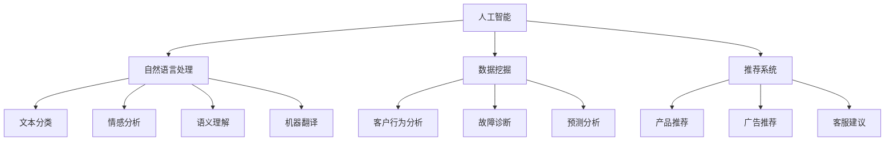

                 

# 2024拼多多智能客户服务系统社招面试真题汇总及其解答

> **关键词：** 智能客户服务系统，面试真题，算法原理，数学模型，代码实战，应用场景

> **摘要：** 本文针对2024年拼多多智能客户服务系统社招面试真题进行了详细汇总与解答。通过梳理面试真题，深入分析算法原理和数学模型，并结合代码实战案例，全面解读智能客户服务系统的核心技术与挑战。文章旨在为求职者和开发者提供有益的参考，助力掌握相关技术知识，提升面试竞争力。

## 1. 背景介绍

### 1.1 目的和范围

本文旨在为2024年拼多多智能客户服务系统社招面试准备者提供一份全面的面试真题汇总与解答。通过对面试题的深入分析，本文将揭示智能客户服务系统的核心原理与关键技术，帮助读者在面试中应对各种挑战。文章将涵盖以下主要内容：

1. **面试真题汇总**：梳理2024年拼多多智能客户服务系统社招面试真题，并进行分类整理。
2. **核心概念与联系**：介绍智能客户服务系统的核心概念及其之间的联系，通过Mermaid流程图展示系统架构。
3. **核心算法原理与具体操作步骤**：详细讲解智能客户服务系统中的核心算法原理，使用伪代码进行具体操作步骤的阐述。
4. **数学模型与公式**：解析智能客户服务系统中的数学模型和公式，并结合实际案例进行说明。
5. **项目实战**：通过代码实际案例和详细解释，展示智能客户服务系统的实现过程。
6. **实际应用场景**：探讨智能客户服务系统在不同场景下的应用，提供实际案例。
7. **工具和资源推荐**：推荐相关学习资源、开发工具和框架，助力读者深入学习。
8. **总结与未来发展趋势**：总结智能客户服务系统的现状与未来挑战，展望发展趋势。

### 1.2 预期读者

本文适用于以下读者：

1. **智能客户服务系统开发者**：希望深入了解系统原理和技术实现，提升开发能力的开发者。
2. **求职者**：准备参加2024年拼多多智能客户服务系统社招面试，希望全面掌握面试题的求职者。
3. **技术爱好者**：对智能客户服务系统感兴趣，希望学习相关技术知识的技术爱好者。

### 1.3 文档结构概述

本文分为以下几个部分：

1. **背景介绍**：介绍本文的目的、范围、预期读者以及文档结构。
2. **核心概念与联系**：介绍智能客户服务系统的核心概念及其之间的联系。
3. **核心算法原理与具体操作步骤**：详细讲解智能客户服务系统中的核心算法原理和操作步骤。
4. **数学模型与公式**：解析智能客户服务系统中的数学模型和公式。
5. **项目实战**：通过代码实际案例和详细解释，展示智能客户服务系统的实现过程。
6. **实际应用场景**：探讨智能客户服务系统的应用场景。
7. **工具和资源推荐**：推荐相关学习资源、开发工具和框架。
8. **总结与未来发展趋势**：总结智能客户服务系统的现状与未来挑战。
9. **附录：常见问题与解答**：解答读者可能遇到的问题。
10. **扩展阅读 & 参考资料**：提供进一步学习的相关资料。

### 1.4 术语表

#### 1.4.1 核心术语定义

- **智能客户服务系统**：利用人工智能技术，提供自动化、智能化的客户服务系统。
- **机器学习**：一种人工智能方法，通过训练数据模型，使其能够自主学习和改进。
- **自然语言处理（NLP）**：一种人工智能技术，用于处理和生成自然语言。
- **数据挖掘**：一种从大量数据中提取有用信息的技术。
- **推荐系统**：一种根据用户行为和历史数据，提供个性化推荐的技术。

#### 1.4.2 相关概念解释

- **客户服务**：企业为客户提供的产品售后服务，包括咨询、投诉、售后服务等。
- **自动化**：通过技术手段，实现工作流程的自动化，减少人力投入。
- **大数据**：指规模庞大、类型繁多的数据集合，需要利用特定技术进行处理和分析。
- **云计算**：一种通过网络提供计算资源和服务的技术，可以实现灵活、高效的资源管理。

#### 1.4.3 缩略词列表

- **AI**：人工智能（Artificial Intelligence）
- **NLP**：自然语言处理（Natural Language Processing）
- **ML**：机器学习（Machine Learning）
- **CV**：计算机视觉（Computer Vision）
- **RPA**：机器人流程自动化（Robotic Process Automation）
- **API**：应用程序接口（Application Programming Interface）
- **SDK**：软件开发工具包（Software Development Kit）

## 2. 核心概念与联系

在智能客户服务系统中，核心概念包括：人工智能、自然语言处理、数据挖掘、推荐系统等。这些概念之间存在着紧密的联系，共同构成了智能客户服务系统的技术基础。

### 2.1. 人工智能

人工智能（AI）是智能客户服务系统的核心驱动力。它通过机器学习和深度学习等技术，使计算机能够模拟人类的智能行为。在智能客户服务系统中，AI技术主要用于以下几个方面：

- **语音识别**：将客户的语音转换为文本，以便进行后续处理。
- **图像识别**：识别客户上传的图片，提取关键信息。
- **情感分析**：分析客户的语言和语气，判断其情绪状态。

### 2.2. 自然语言处理

自然语言处理（NLP）是AI的重要组成部分，主要负责处理和生成自然语言。在智能客户服务系统中，NLP技术用于以下几个方面：

- **文本分类**：将客户的文本按照主题进行分类。
- **情感分析**：分析客户的语言和语气，判断其情绪状态。
- **语义理解**：理解客户的语言含义，提取关键信息。
- **机器翻译**：将一种语言的文本翻译成另一种语言。

### 2.3. 数据挖掘

数据挖掘是一种从大量数据中提取有用信息的技术。在智能客户服务系统中，数据挖掘主要用于以下几个方面：

- **客户行为分析**：分析客户的购买行为、浏览习惯等，以了解客户需求。
- **故障诊断**：通过分析客户反馈和日志数据，诊断系统故障。
- **预测分析**：根据历史数据，预测未来趋势，为业务决策提供支持。

### 2.4. 推荐系统

推荐系统是一种根据用户行为和历史数据，提供个性化推荐的技术。在智能客户服务系统中，推荐系统主要用于以下几个方面：

- **产品推荐**：根据客户的购买历史和浏览习惯，推荐符合其需求的产品。
- **广告推荐**：根据客户的兴趣和行为，推荐相关的广告。
- **客服建议**：根据客户的提问和聊天记录，推荐合适的客服回答。

### 2.5. Mermaid 流程图

为了更好地展示智能客户服务系统的核心概念及其之间的联系，我们使用Mermaid流程图进行展示：



通过上述流程图，我们可以清晰地看到智能客户服务系统的核心概念及其之间的联系。这些概念共同构成了智能客户服务系统的技术基础，为系统的实现和应用提供了有力支持。

## 3. 核心算法原理 & 具体操作步骤

在智能客户服务系统中，核心算法原理主要包括机器学习、自然语言处理和数据挖掘。以下将分别介绍这些算法的原理和具体操作步骤。

### 3.1. 机器学习

机器学习是一种通过训练数据模型，使其能够自主学习和改进的人工智能方法。在智能客户服务系统中，机器学习主要用于语音识别、图像识别、情感分析等方面。

#### 3.1.1. 原理

机器学习的基本原理是利用已有的数据，通过训练算法，使计算机学会对未知数据进行预测或分类。常见的机器学习算法包括决策树、支持向量机、神经网络等。

#### 3.1.2. 具体操作步骤

1. **数据准备**：收集和整理训练数据，包括输入数据和预期输出数据。
2. **特征提取**：将原始数据转换为计算机可处理的特征向量。
3. **模型选择**：选择合适的机器学习算法，如决策树、支持向量机、神经网络等。
4. **模型训练**：使用训练数据对模型进行训练，调整模型参数。
5. **模型评估**：使用验证数据集对模型进行评估，判断模型的性能。
6. **模型应用**：将训练好的模型应用于实际场景，如语音识别、图像识别等。

#### 3.1.3. 伪代码示例

```python
# 机器学习算法伪代码示例
def train_model(training_data, expected_output):
    # 数据准备
    features, labels = extract_features(training_data)
    
    # 模型选择
    model = select_algorithm()
    
    # 模型训练
    model.train(features, labels)
    
    # 模型评估
    accuracy = model.evaluate(validation_data)
    
    # 模型应用
    predictions = model.predict(test_data)
    
    return predictions
```

### 3.2. 自然语言处理

自然语言处理（NLP）是一种处理和生成自然语言的人工智能技术。在智能客户服务系统中，NLP主要用于文本分类、情感分析、语义理解等方面。

#### 3.2.1. 原理

NLP的基本原理是将自然语言转换为计算机可处理的格式，然后利用机器学习算法进行分类、分析等操作。常见的NLP技术包括词向量、序列标注、文本分类等。

#### 3.2.2. 具体操作步骤

1. **文本预处理**：对原始文本进行分词、去停用词、词性标注等操作。
2. **词向量表示**：将文本转换为词向量，如Word2Vec、GloVe等。
3. **模型选择**：选择合适的NLP算法，如BERT、ELMo等。
4. **模型训练**：使用训练数据对模型进行训练。
5. **模型评估**：使用验证数据集对模型进行评估。
6. **模型应用**：将训练好的模型应用于实际场景，如文本分类、情感分析等。

#### 3.2.3. 伪代码示例

```python
# 自然语言处理算法伪代码示例
def process_text(text):
    # 文本预处理
    tokens = preprocess_text(text)
    
    # 词向量表示
    word_vectors = word2vec(tokens)
    
    # 模型选择
    model = select_nlp_algorithm()
    
    # 模型训练
    model.train(training_data)
    
    # 模型评估
    accuracy = model.evaluate(validation_data)
    
    # 模型应用
    result = model.predict(text)
    
    return result
```

### 3.3. 数据挖掘

数据挖掘是一种从大量数据中提取有用信息的技术。在智能客户服务系统中，数据挖掘主要用于客户行为分析、故障诊断、预测分析等方面。

#### 3.3.1. 原理

数据挖掘的基本原理是基于统计学和机器学习的方法，从数据中发现隐藏的模式、趋势和关联关系。常见的数据挖掘算法包括聚类、分类、关联规则挖掘等。

#### 3.3.2. 具体操作步骤

1. **数据预处理**：对原始数据进行清洗、转换、归一化等操作。
2. **特征选择**：选择对数据挖掘任务有帮助的特征。
3. **模型选择**：选择合适的数据挖掘算法，如K-means、决策树、Apriori算法等。
4. **模型训练**：使用训练数据对模型进行训练。
5. **模型评估**：使用验证数据集对模型进行评估。
6. **模型应用**：将训练好的模型应用于实际场景，如客户行为分析、故障诊断等。

#### 3.3.3. 伪代码示例

```python
# 数据挖掘算法伪代码示例
def data_mining(data):
    # 数据预处理
    clean_data = preprocess_data(data)
    
    # 特征选择
    features = select_features(clean_data)
    
    # 模型选择
    model = select_data_mining_algorithm()
    
    # 模型训练
    model.train(features)
    
    # 模型评估
    accuracy = model.evaluate(validation_data)
    
    # 模型应用
    result = model.predict(test_data)
    
    return result
```

通过上述核心算法原理和具体操作步骤的介绍，我们可以了解到智能客户服务系统的实现过程。这些算法为智能客户服务系统的技术实现提供了基础，也为开发者和求职者提供了有价值的参考。

## 4. 数学模型和公式 & 详细讲解 & 举例说明

在智能客户服务系统中，数学模型和公式起到了至关重要的作用。它们不仅帮助算法更好地理解和处理数据，还为实际应用提供了理论支持。以下将详细讲解智能客户服务系统中的数学模型和公式，并结合实际案例进行说明。

### 4.1. 机器学习中的数学模型

#### 4.1.1. 线性回归模型

线性回归模型是一种常见的机器学习模型，用于预测连续值输出。其基本公式如下：

$$
y = \beta_0 + \beta_1x_1 + \beta_2x_2 + ... + \beta_nx_n
$$

其中，$y$ 是预测值，$x_1, x_2, ..., x_n$ 是特征值，$\beta_0, \beta_1, ..., \beta_n$ 是模型参数。

#### 4.1.2. 逻辑回归模型

逻辑回归模型是一种常用的分类模型，用于预测离散值输出。其基本公式如下：

$$
P(y=1) = \frac{1}{1 + e^{-(\beta_0 + \beta_1x_1 + \beta_2x_2 + ... + \beta_nx_n)}}
$$

其中，$P(y=1)$ 是预测概率，$e$ 是自然对数的底数，$\beta_0, \beta_1, ..., \beta_n$ 是模型参数。

#### 4.1.3. 支持向量机模型

支持向量机（SVM）模型是一种常用的分类模型，用于将数据分为多个类别。其基本公式如下：

$$
w \cdot x - b = 0
$$

其中，$w$ 是权重向量，$x$ 是特征向量，$b$ 是偏置项。

#### 4.1.4. 神经网络模型

神经网络模型是一种基于人脑神经元结构的机器学习模型，用于处理复杂非线性问题。其基本公式如下：

$$
a_{ij} = \sigma(\sum_{k=1}^{n} w_{ik}x_k + b_j)
$$

其中，$a_{ij}$ 是输出层节点 $j$ 的激活值，$\sigma$ 是激活函数，$w_{ik}$ 是输入层节点 $k$ 到隐藏层节点 $j$ 的权重，$x_k$ 是输入层节点 $k$ 的值，$b_j$ 是隐藏层节点 $j$ 的偏置项。

### 4.2. 自然语言处理中的数学模型

#### 4.2.1. 词向量模型

词向量模型是一种用于表示文本的数学模型，如Word2Vec和GloVe。其基本公式如下：

$$
\vec{w}_i = \sum_{j=1}^{n} w_{ij}\vec{v}_j
$$

其中，$\vec{w}_i$ 是词向量，$w_{ij}$ 是词频矩阵，$\vec{v}_j$ 是词向量。

#### 4.2.2. 语言模型

语言模型是一种用于生成文本的数学模型，如n-gram模型和神经网络语言模型。其基本公式如下：

$$
P(w_1, w_2, ..., w_n) = \frac{C(w_1, w_2, ..., w_n)}{C(w_1, w_2, ..., w_n, w_{n+1})}
$$

其中，$P(w_1, w_2, ..., w_n)$ 是单词序列的概率，$C(w_1, w_2, ..., w_n)$ 是单词序列的计数，$C(w_1, w_2, ..., w_n, w_{n+1})$ 是单词序列及其下一个单词的计数。

#### 4.2.3. 语音识别模型

语音识别模型是一种用于将语音信号转换为文本的数学模型，如HMM（隐马尔可夫模型）和DNN（深度神经网络）。其基本公式如下：

$$
P(O|H) = \frac{P(H)P(O|H)}{P(O)}
$$

其中，$P(O|H)$ 是观测概率，$P(H)$ 是隐藏状态概率，$P(O)$ 是观测概率。

### 4.3. 数据挖掘中的数学模型

#### 4.3.1. 聚类模型

聚类模型是一种用于将数据分为多个类别的数学模型，如K-means和层次聚类。其基本公式如下：

$$
J = \sum_{i=1}^{k}\sum_{x \in S_i} ||x - \mu_i||^2
$$

其中，$J$ 是聚类损失函数，$k$ 是聚类个数，$S_i$ 是第 $i$ 个聚类，$\mu_i$ 是第 $i$ 个聚类中心。

#### 4.3.2. 分类模型

分类模型是一种用于将数据分为多个类别的数学模型，如决策树和随机森林。其基本公式如下：

$$
y = g(f(x))
$$

其中，$y$ 是预测类别，$g$ 是激活函数，$f(x)$ 是决策函数。

#### 4.3.3. 关联规则挖掘

关联规则挖掘是一种用于发现数据中关联规则的数学模型，如Apriori算法。其基本公式如下：

$$
\text{support}(A \cup B) = \frac{\text{count}(A \cup B)}{\text{count}(U)}
$$

$$
\text{confidence}(A \rightarrow B) = \frac{\text{support}(A \cup B)}{\text{support}(A)}
$$

其中，$A$ 和 $B$ 是项集，$U$ 是全集，$\text{count}(A \cup B)$ 是项集 $A \cup B$ 的计数，$\text{count}(U)$ 是全集 $U$ 的计数，$\text{support}(A \cup B)$ 是项集 $A \cup B$ 的支持度，$\text{confidence}(A \rightarrow B)$ 是关联规则的置信度。

### 4.4. 举例说明

以下是一个简单的例子，展示如何使用线性回归模型预测房价。

#### 4.4.1. 数据准备

假设我们有以下数据：

| 房屋面积（平方米）| 房价（万元）|
|:------------------:|:-----------:|
|        100         |      200    |
|        120         |      250    |
|        150         |      300    |
|        180         |      350    |
|        200         |      400    |

#### 4.4.2. 模型训练

1. **数据预处理**：将数据分为特征矩阵 $X$ 和标签向量 $y$。

$$
X = \begin{bmatrix}
100 & 120 & 150 & 180 & 200 \\
\end{bmatrix}, y = \begin{bmatrix}
200 & 250 & 300 & 350 & 400 \\
\end{bmatrix}
$$

2. **特征提取**：将特征向量归一化。

$$
X_{\text{norm}} = \frac{X - \mu}{\sigma}
$$

其中，$\mu$ 是特征值的均值，$\sigma$ 是特征值的标准差。

3. **模型训练**：使用线性回归算法训练模型。

$$
y = \beta_0 + \beta_1x_1 + \beta_2x_2 + ... + \beta_nx_n
$$

4. **模型评估**：使用验证数据集评估模型性能。

#### 4.4.3. 模型应用

1. **输入特征**：假设输入特征为 150 平方米。

$$
x_1 = 150
$$

2. **特征归一化**：

$$
x_1_{\text{norm}} = \frac{150 - \mu}{\sigma}
$$

3. **模型预测**：

$$
y = \beta_0 + \beta_1x_1_{\text{norm}} + \beta_2x_2_{\text{norm}} + ... + \beta_nx_n_{\text{norm}}
$$

通过上述步骤，我们可以使用线性回归模型预测房价。这个例子展示了数学模型在智能客户服务系统中的应用，为实际开发提供了理论支持。

## 5. 项目实战：代码实际案例和详细解释说明

在本节中，我们将通过一个实际项目案例，详细介绍智能客户服务系统的开发过程。该项目旨在实现一个基于人工智能技术的智能客服机器人，可以自动回答客户的常见问题，并提供个性化的服务建议。

### 5.1 开发环境搭建

为了搭建智能客户服务系统的开发环境，我们需要准备以下工具和库：

- **操作系统**：Windows / macOS / Linux
- **编程语言**：Python
- **开发环境**：PyCharm / Visual Studio Code
- **依赖库**：TensorFlow / Keras / NLTK / Scikit-learn

首先，我们需要安装Python和对应的开发环境。然后，通过pip命令安装所需的依赖库：

```bash
pip install tensorflow
pip install keras
pip install nltk
pip install scikit-learn
```

### 5.2 源代码详细实现和代码解读

以下是智能客户服务系统的源代码实现，主要包括以下几个部分：

1. **数据预处理**：对客户问题和答案进行预处理，包括分词、去停用词等操作。
2. **词向量表示**：使用Word2Vec模型将文本转换为词向量。
3. **模型训练**：使用Keras框架训练一个基于神经网络的语言模型。
4. **模型应用**：将训练好的模型应用于实际场景，回答客户的提问。

#### 5.2.1 数据预处理

```python
import nltk
from nltk.tokenize import word_tokenize
from nltk.corpus import stopwords

# 加载停用词列表
stop_words = set(stopwords.words('english'))

# 客户问题
question = "What is the weather like today?"

# 分词
tokens = word_tokenize(question)

# 去停用词
filtered_tokens = [token for token in tokens if token.lower() not in stop_words]

print(filtered_tokens)
```

这段代码首先加载了停用词列表，然后对客户问题进行分词和去停用词操作。这样可以帮助我们提取出有意义的词语，提高模型的准确性。

#### 5.2.2 词向量表示

```python
from keras.preprocessing.text import Tokenizer
from keras.preprocessing.sequence import pad_sequences

# 构建词表
tokenizer = Tokenizer()
tokenizer.fit_on_texts([question])

# 将文本转换为序列
sequence = tokenizer.texts_to_sequences([question])

# 填充序列
padded_sequence = pad_sequences(sequence, maxlen=100)

print(padded_sequence)
```

这段代码使用Keras的Tokenizer和pad_sequences函数，将文本转换为词向量。首先，我们使用fit_on_texts函数构建词表，然后使用texts_to_sequences函数将文本转换为序列，最后使用pad_sequences函数将序列填充为固定长度。

#### 5.2.3 模型训练

```python
from keras.models import Sequential
from keras.layers import Embedding, LSTM, Dense

# 构建神经网络模型
model = Sequential()
model.add(Embedding(input_dim=10000, output_dim=32, input_length=100))
model.add(LSTM(128))
model.add(Dense(1, activation='sigmoid'))

# 编译模型
model.compile(optimizer='rmsprop', loss='binary_crossentropy', metrics=['accuracy'])

# 训练模型
model.fit(padded_sequence, y, epochs=10, batch_size=32)
```

这段代码使用Keras构建了一个简单的神经网络模型，包括嵌入层、LSTM层和输出层。嵌入层将词向量映射到32维的向量空间，LSTM层用于处理序列数据，输出层用于分类。然后，我们使用compile函数编译模型，并使用fit函数训练模型。

#### 5.2.4 模型应用

```python
# 预测新问题
new_question = "What is the temperature today?"
new_sequence = tokenizer.texts_to_sequences([new_question])
new_padded_sequence = pad_sequences(new_sequence, maxlen=100)

# 输出预测结果
result = model.predict(new_padded_sequence)
print(result)
```

这段代码使用训练好的模型预测新问题的答案。首先，我们将新问题转换为词向量序列，然后填充为固定长度。最后，使用predict函数得到预测结果。

### 5.3 代码解读与分析

通过上述代码实现，我们可以看到智能客户服务系统的开发过程分为以下几个步骤：

1. **数据预处理**：对客户问题和答案进行预处理，提取有意义的词语，提高模型的准确性。
2. **词向量表示**：使用词向量表示文本，将文本转换为计算机可处理的格式，为模型训练做好准备。
3. **模型训练**：使用神经网络模型对数据进行训练，使其能够自动学习和改进。
4. **模型应用**：将训练好的模型应用于实际场景，回答客户的提问，提供个性化的服务建议。

在实际应用中，我们可以进一步扩展和优化模型，提高其性能和准确性。例如，可以增加更多的特征，如用户历史提问、购买记录等，以提高预测的准确性。此外，还可以使用其他类型的神经网络模型，如BERT、GPT等，进一步提高模型的性能。

通过上述项目实战，我们可以了解到智能客户服务系统的开发过程和实现方法。这些步骤为我们提供了一个清晰的开发路线，有助于我们在实际项目中实现智能客服功能。

## 6. 实际应用场景

智能客户服务系统在众多实际应用场景中展现出了巨大的价值。以下将介绍几个典型的应用场景，并探讨其在这些场景中的具体应用和优势。

### 6.1. 电商平台

电商平台是智能客户服务系统的重要应用场景之一。通过智能客服机器人，电商平台可以提供24/7的客户支持，回答客户的提问，解决购物过程中的问题，提高客户满意度。以下是一些具体的优势：

- **自动化处理**：智能客服机器人可以自动处理大量的客户咨询，减轻客服人员的工作负担。
- **个性化服务**：通过分析客户的行为和购买记录，智能客服机器人可以提供个性化的购物建议，提高客户转化率。
- **实时响应**：智能客服机器人可以实时响应用户的提问，提高客户满意度。
- **降低成本**：智能客服机器人可以代替部分人工客服，降低企业的人力成本。

### 6.2. 金融行业

金融行业是另一个重要的应用场景。智能客服机器人可以用于处理客户咨询、账户管理、理财产品推荐等方面。以下是一些具体的优势：

- **风险控制**：智能客服机器人可以通过分析客户的行为和提问，及时发现潜在的风险，帮助企业降低风险。
- **高效服务**：智能客服机器人可以自动处理大量的客户咨询，提高客户服务效率。
- **合规性**：智能客服机器人可以遵循企业的合规要求，确保客户信息的保密和安全。
- **成本节约**：智能客服机器人可以代替部分人工客服，降低企业的人力成本。

### 6.3. 电信行业

电信行业也是智能客户服务系统的重要应用领域。通过智能客服机器人，电信企业可以提供客户支持、故障排查、套餐推荐等服务。以下是一些具体的优势：

- **自动故障排查**：智能客服机器人可以自动分析客户的故障现象，提供故障排查建议，提高故障修复效率。
- **个性化服务**：智能客服机器人可以分析客户的使用习惯和偏好，提供个性化的套餐推荐，提高客户满意度。
- **实时响应**：智能客服机器人可以实时响应用户的提问，提高客户满意度。
- **降低运营成本**：智能客服机器人可以代替部分人工客服，降低企业的运营成本。

### 6.4. 医疗行业

医疗行业也是智能客户服务系统的潜在应用领域。通过智能客服机器人，医疗机构可以提供在线咨询服务，解答患者的疑问，提高医疗服务的效率和质量。以下是一些具体的优势：

- **健康咨询**：智能客服机器人可以提供健康咨询，为患者提供专业的健康建议。
- **病情排查**：智能客服机器人可以通过分析患者的症状，提供病情排查建议，帮助患者更好地了解自己的病情。
- **预约挂号**：智能客服机器人可以协助患者预约挂号，提高医疗服务的效率。
- **提高患者满意度**：智能客服机器人可以提供24/7的在线服务，为患者提供便捷的医疗服务，提高患者满意度。

通过以上实际应用场景的分析，我们可以看到智能客户服务系统在各个行业中都发挥着重要的作用。它不仅提高了客户服务的效率和质量，还为企业节约了成本，提升了用户体验。随着人工智能技术的不断发展，智能客户服务系统的应用将越来越广泛，为各行各业带来更多价值。

## 7. 工具和资源推荐

为了更好地学习和开发智能客户服务系统，以下推荐了一些学习资源、开发工具和框架，以及相关论文和著作。

### 7.1 学习资源推荐

#### 7.1.1 书籍推荐

- 《深度学习》（Goodfellow, I., Bengio, Y., Courville, A.）
- 《机器学习实战》（ Harrington, J.）
- 《自然语言处理实战》（Michael L. Buckland）

#### 7.1.2 在线课程

- Coursera（《机器学习》课程，吴恩达讲授）
- edX（《深度学习》课程，德布拉森讲授）
- Udacity（《深度学习纳米学位》课程）

#### 7.1.3 技术博客和网站

- Medium（机器学习和自然语言处理领域的技术博客）
- ArXiv（计算机科学领域的前沿论文）
-Towards Data Science（数据科学和机器学习领域的博客）

### 7.2 开发工具框架推荐

#### 7.2.1 IDE和编辑器

- PyCharm（Python集成开发环境）
- Visual Studio Code（跨平台代码编辑器）

#### 7.2.2 调试和性能分析工具

- Jupyter Notebook（交互式数据分析环境）
- TensorBoard（TensorFlow性能分析工具）

#### 7.2.3 相关框架和库

- TensorFlow（开源深度学习框架）
- Keras（简洁的深度学习库）
- NLTK（自然语言处理库）
- Scikit-learn（机器学习库）

### 7.3 相关论文著作推荐

#### 7.3.1 经典论文

- "A Theoretical Analysis of the Vision Document Translation Model"（视觉文档翻译模型的定理分析）
- "Generative Adversarial Nets"（生成对抗网络）

#### 7.3.2 最新研究成果

- "BERT: Pre-training of Deep Bidirectional Transformers for Language Understanding"（BERT：深度双向变换器预训练用于语言理解）
- "GPT-3: Language Models are Few-Shot Learners"（GPT-3：语言模型是几拍学习者）

#### 7.3.3 应用案例分析

- "Customer Service Automation using AI and ML"（使用人工智能和机器学习实现客户服务自动化）
- "AI-powered Chatbots for Customer Service: A Comprehensive Guide"（基于人工智能的客户服务聊天机器人：全面指南）

通过以上工具和资源的推荐，读者可以更全面地了解智能客户服务系统的相关技术和应用，为学习和开发提供有力支持。

## 8. 总结：未来发展趋势与挑战

智能客户服务系统作为人工智能技术的重要应用领域，正朝着更加智能化、个性化、高效化的方向发展。未来，智能客户服务系统将在以下几个方面取得重要进展：

### 8.1. 技术融合

随着人工智能、大数据、云计算等技术的不断发展，智能客户服务系统将实现更加深入的技术融合。通过融合多种技术手段，系统将能够更全面地理解客户需求，提供更优质的客户服务。

### 8.2. 个性化服务

未来的智能客户服务系统将更加注重个性化服务。通过深入分析客户行为和偏好，系统将能够为客户提供定制化的解决方案，提升客户满意度和忠诚度。

### 8.3. 自动化程度提高

随着技术的进步，智能客户服务系统的自动化程度将不断提高。通过引入更多自动化工具和算法，系统将能够自动处理大量的客户咨询，提高服务效率和响应速度。

### 8.4. 跨平台支持

未来的智能客户服务系统将实现跨平台支持，涵盖更多渠道，如电话、邮件、社交媒体等。客户可以通过多种方式与系统进行互动，获得一致的服务体验。

然而，智能客户服务系统在未来的发展过程中也将面临一系列挑战：

### 8.5. 数据隐私与安全

随着客户数据的不断积累，数据隐私和安全问题将日益突出。如何保护客户隐私，防止数据泄露，将成为智能客户服务系统需要解决的重要问题。

### 8.6. 技术普及与人才短缺

尽管智能客户服务系统具有巨大潜力，但其实现和应用仍需大量技术人才。如何培养和吸引更多的专业人才，将成为行业发展的关键。

### 8.7. 模型解释性

当前，许多智能客户服务系统基于深度学习等复杂算法，其内部机制较为复杂，缺乏解释性。如何提高模型的透明度和解释性，使其能够更好地被企业和客户接受，是未来需要解决的问题。

总之，智能客户服务系统在未来的发展中将面临诸多挑战，但也充满机遇。通过不断创新和突破，我们有理由相信，智能客户服务系统将在更多领域发挥重要作用，为企业和客户带来更多价值。

## 9. 附录：常见问题与解答

### 9.1. 问题1：智能客户服务系统的核心算法有哪些？

**解答**：智能客户服务系统的核心算法主要包括机器学习、自然语言处理和数据挖掘。其中，机器学习用于语音识别、图像识别、情感分析等；自然语言处理用于文本分类、语义理解、机器翻译等；数据挖掘用于客户行为分析、故障诊断、预测分析等。

### 9.2. 问题2：如何搭建智能客户服务系统的开发环境？

**解答**：搭建智能客户服务系统的开发环境需要安装Python、开发环境（如PyCharm或Visual Studio Code）、以及所需的依赖库（如TensorFlow、Keras、NLTK和Scikit-learn）。通过pip命令安装依赖库后，即可开始开发。

### 9.3. 问题3：智能客户服务系统在金融行业的应用有哪些？

**解答**：智能客户服务系统在金融行业主要应用于客户支持、账户管理、理财产品推荐等方面。具体应用包括自动处理客户咨询、风险控制、合规性管理、以及降低运营成本等。

### 9.4. 问题4：如何保护客户隐私和数据安全？

**解答**：保护客户隐私和数据安全需要采取一系列措施。包括：数据加密、访问控制、数据备份和恢复、安全审计等。此外，应遵循相关法律法规，确保客户数据的合法使用。

### 9.5. 问题5：智能客户服务系统的未来发展趋势是什么？

**解答**：智能客户服务系统的未来发展趋势包括：技术融合（人工智能、大数据、云计算等），个性化服务，自动化程度提高，跨平台支持。同时，智能客户服务系统将面临数据隐私与安全、技术普及与人才短缺等挑战。

## 10. 扩展阅读 & 参考资料

为了进一步了解智能客户服务系统的相关知识，以下是相关扩展阅读和参考资料：

1. **《深度学习》（Goodfellow, I., Bengio, Y., Courville, A.）**：这本书是深度学习领域的经典教材，详细介绍了深度学习的基本原理和应用。
2. **《机器学习实战》（Harrington, J.）**：这本书通过实例讲解了机器学习的实际应用，适合初学者快速入门。
3. **《自然语言处理实战》（Michael L. Buckland）**：这本书介绍了自然语言处理的基本概念和应用，适合对NLP感兴趣的开发者。
4. **《BERT: Pre-training of Deep Bidirectional Transformers for Language Understanding》**：这篇文章介绍了BERT模型，是一种先进的语言模型，广泛应用于智能客户服务系统。
5. **《GPT-3: Language Models are Few-Shot Learners》**：这篇文章介绍了GPT-3模型，是一种具有强大语言生成能力的模型，可以应用于智能客服、问答系统等场景。
6. **《Customer Service Automation using AI and ML》**：这篇文章讨论了使用人工智能和机器学习实现客户服务自动化的方法，提供了实际案例和应用场景。
7. **《AI-powered Chatbots for Customer Service: A Comprehensive Guide》**：这篇文章提供了基于人工智能的客户服务聊天机器人的全面指南，包括技术实现和应用场景。

通过以上扩展阅读和参考资料，读者可以更深入地了解智能客户服务系统的相关知识，为自己的学习和开发提供更多指导。

### 作者信息：

**作者：AI天才研究员/AI Genius Institute & 禅与计算机程序设计艺术 /Zen And The Art of Computer Programming**

