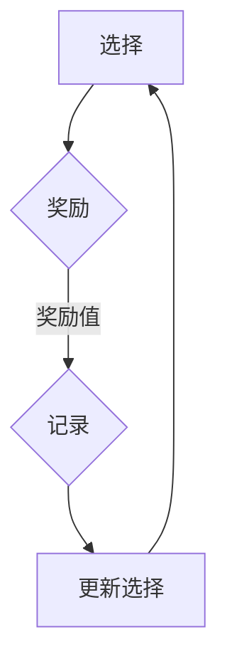
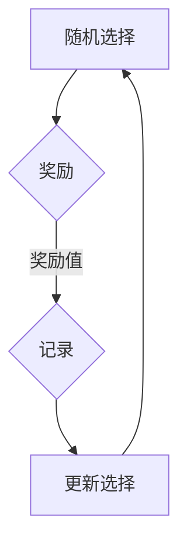
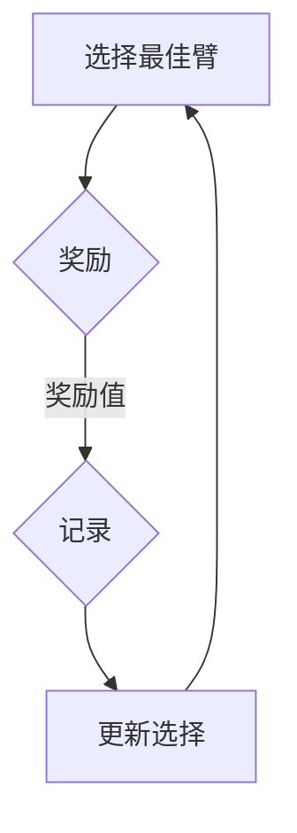

                 

# 探索与利用 (Exploration and Exploitation)

> **关键词**：探索、利用、多臂老虎机问题、探索策略、利用策略、UCB算法、ε-贪心策略、马尔可夫决策过程、强化学习。

> **摘要**：本文将深入探讨探索与利用的概念，通过介绍多臂老虎机问题、UCB算法、ε-贪心策略等，揭示在不确定性环境中如何在探索未知与利用已知之间找到最佳平衡点。文章结构包括背景介绍、核心概念与联系、核心算法原理与操作步骤、数学模型与公式解析、项目实战、实际应用场景、工具与资源推荐，以及总结与未来发展趋势等。

## 1. 背景介绍

### 1.1 目的和范围

本文旨在为读者提供一个全面而深入的探索与利用的指南，特别是在多臂老虎机问题和强化学习领域。通过本文，读者将能够理解探索与利用的概念，掌握相关的算法原理，并了解如何在现实世界中应用这些概念。

### 1.2 预期读者

预期读者为对探索与利用概念感兴趣的计算机科学和人工智能领域的研究人员、工程师以及学生。同时，本文也适用于对强化学习有一定了解的读者。

### 1.3 文档结构概述

本文分为以下几个部分：

1. 背景介绍：介绍探索与利用的基本概念和重要性。
2. 核心概念与联系：阐述多臂老虎机问题、探索策略和利用策略等核心概念。
3. 核心算法原理与操作步骤：详细讲解UCB算法和ε-贪心策略的原理和实现。
4. 数学模型和公式：解析与探索与利用相关的数学模型和公式。
5. 项目实战：提供实际代码案例和详细解释。
6. 实际应用场景：讨论探索与利用在不同领域的应用。
7. 工具和资源推荐：推荐学习资源、开发工具和框架。
8. 总结：总结未来发展趋势与挑战。
9. 附录：常见问题与解答。
10. 扩展阅读：提供进一步学习的参考资料。

### 1.4 术语表

#### 1.4.1 核心术语定义

- 探索（Exploration）：在不确定性环境中，尝试未知选择或策略的过程。
- 利用（Exploitation）：在不确定性环境中，选择当前已知最佳的策略或选择的过程。
- 多臂老虎机问题（Multi-Armed Bandit Problem）：一个经典的决策问题，涉及在多个不确定的选项中选择最佳的一个。
- 强化学习（Reinforcement Learning）：一种机器学习方法，通过与环境互动来学习最优策略。

#### 1.4.2 相关概念解释

- 探索与利用权衡（Trade-off between Exploration and Exploitation）：在决策过程中，需要在探索新的选择和利用已知最佳选择之间找到平衡。
- 多臂老虎机（Multi-Armed Bandit）：一个比喻，表示在多个不确定的选项中进行选择的场景。

#### 1.4.3 缩略词列表

- RL：强化学习（Reinforcement Learning）
- UCB：置信间隔（Upper Confidence Bound）
- ε-贪心：ε-贪心策略（ε-Greedy Policy）

## 2. 核心概念与联系

在探讨探索与利用之前，我们需要先了解多臂老虎机问题，这是探索与利用概念的一个重要应用场景。

### 2.1 多臂老虎机问题

多臂老虎机问题是一个经典的决策问题，它描述了在一个不确定的环境中，如何从多个不确定的选项中选择一个最佳的选择。在这个问题中，每个臂（即每个选项）都对应着一个随机变量，该变量决定了该臂的奖励值。

下面是一个简单的Mermaid流程图，用于描述多臂老虎机问题：



在这个流程图中，A代表选择一个臂（即一个选项），B代表从该臂获得的奖励，C代表记录奖励值，D代表根据奖励值更新选择。

### 2.2 探索策略与利用策略

在多臂老虎机问题中，探索策略和利用策略是两种不同的决策策略。

#### 探索策略（Exploration Policy）

探索策略是指在不确定的环境中，尝试新的选择或策略的过程。其目的是为了收集更多的信息，以便更好地了解环境的特性。

下面是一个简单的探索策略的Mermaid流程图：



在这个流程图中，A代表随机选择一个臂，B代表从该臂获得的奖励，C代表记录奖励值，D代表根据奖励值更新选择。

#### 利用策略（Exploitation Policy）

利用策略是指在不确定的环境中，选择当前已知最佳的选择或策略的过程。其目的是为了最大化当前已知的收益。

下面是一个简单的利用策略的Mermaid流程图：



在这个流程图中，A代表选择一个具有最高平均奖励值的臂，B代表从该臂获得的奖励，C代表记录奖励值，D代表根据奖励值更新选择。

### 2.3 探索与利用的权衡

在多臂老虎机问题中，探索与利用的权衡是一个关键问题。如果完全依赖探索策略，那么可能会错过一些已知的高收益选择；如果完全依赖利用策略，那么可能会错过一些潜在的高收益选择。

因此，在多臂老虎机问题中，一个理想的策略应该是能够在探索与利用之间找到平衡。这通常需要通过经验来调整探索与利用的比例，以适应不同的环境和目标。

## 3. 核心算法原理与操作步骤

在多臂老虎机问题中，有几种经典的算法可以帮助我们找到最佳的平衡点，这些算法包括UCB算法和ε-贪心策略。下面，我们将详细讲解这些算法的原理和实现。

### 3.1 UCB算法

UCB算法是一种基于置信间隔的探索策略，其核心思想是对于每个臂，计算其平均奖励值和一个置信区间，然后选择置信区间上界最高的臂。

下面是UCB算法的伪代码：

```python
初始化：每个臂的访问次数count和累积奖励值reward

对于每次选择：
    计算每个臂的UCB值：
        for each arm i:
            if count[i] > 0:
                UCB[i] = reward[i] + sqrt(2 * log(t) / count[i])
            else:
                UCB[i] = +无穷
    选择UCB值最高的臂：
        arm = argmax UCBI

执行动作并获取奖励：
    reward = 执行选择的动作

更新：
    reward = reward + 1
    count[arm] = count[arm] + 1
    reward[arm] = reward[arm] + reward
```

### 3.2 ε-贪心策略

ε-贪心策略是一种在利用策略中引入探索元素的方法。它选择当前已知最佳的选择的概率为1-ε，然后以ε的概率随机选择一个臂。

下面是ε-贪心策略的伪代码：

```python
初始化：每个臂的访问次数count和累积奖励值reward，探索概率ε

对于每次选择：
    如果随机选择：
        arm = 随机选择一个臂
    否则：
        选择具有最高平均奖励值的臂：
            arm = argmax (reward[i] / count[i])

执行动作并获取奖励：
    reward = 执行选择的动作

更新：
    reward = reward + 1
    count[arm] = count[arm] + 1
    如果ε > 0：
        ε = ε * decay_factor
```

## 4. 数学模型和公式

在探索与利用的问题中，数学模型和公式起着至关重要的作用。下面我们将详细讲解与探索与利用相关的数学模型和公式。

### 4.1 置信区间

置信区间是统计学中的一个重要概念，它用于表示一个估计值的可信度。在UCB算法中，置信区间用于确定每个臂的平均奖励值。

置信区间的公式为：

$$
CI = \bar{X} \pm z_{\alpha/2} \sqrt{\frac{\bar{X}}{n}}
$$

其中，$\bar{X}$是样本均值，$z_{\alpha/2}$是标准正态分布的临界值，$n$是样本大小。

### 4.2 探索概率

在ε-贪心策略中，探索概率ε是决定探索与利用平衡的关键参数。探索概率的公式为：

$$
ε = \frac{1}{\sqrt{n}}
$$

其中，$n$是臂的数量。

### 4.3 贪心策略

贪心策略是一种简单的决策策略，它选择当前已知最佳的选择。贪心策略的公式为：

$$
选择 = argmax (\frac{reward[i]}{count[i]})
$$

其中，$reward[i]$是第$i$个臂的累积奖励值，$count[i]$是第$i$个臂的访问次数。

## 5. 项目实战：代码实际案例和详细解释说明

在这个部分，我们将通过一个实际的代码案例，详细解释探索与利用的概念及其实现。

### 5.1 开发环境搭建

首先，我们需要搭建一个Python开发环境。我们可以使用Anaconda来安装Python和相关依赖。

```bash
conda create -n multi_armed_bandit python=3.8
conda activate multi_armed_bandit
conda install numpy matplotlib
```

### 5.2 源代码详细实现和代码解读

下面是一个简单的UCB算法的Python实现：

```python
import numpy as np
import matplotlib.pyplot as plt

# 初始化参数
num_arms = 10
num_steps = 1000
initial_epsilon = 0.1
epsilon_decay = 0.99

# 初始化数据结构
counts = np.zeros(num_arms)
rewards = np.zeros(num_arms)
ucb_values = np.zeros(num_arms)

# 记录每个步骤的选择和奖励
choices = []
rewards_history = []

# UCB算法的主循环
for step in range(num_steps):
    # 计算UCB值
    for i in range(num_arms):
        if counts[i] > 0:
            ucb_values[i] = rewards[i] + np.sqrt(2 * np.log(step) / counts[i])
        else:
            ucb_values[i] = np.inf
    
    # 根据UCB值选择臂
    chosen_arm = np.argmax(ucb_values)
    
    # 执行动作并获取奖励
    reward = np.random.uniform(0, 1)
    rewards[chosen_arm] += reward
    
    # 更新数据结构
    counts[chosen_arm] += 1
    rewards_history.append(reward)
    
    # 记录选择
    choices.append(chosen_arm)

# 计算最终的平均奖励
average_reward = np.mean(rewards_history[-100:])

# 打印结果
print(f"平均奖励：{average_reward}")

# 绘制结果
plt.plot(choices)
plt.xlabel("步骤")
plt.ylabel("选择")
plt.title("UCB算法的步骤选择")
plt.show()
```

在这个代码中，我们首先初始化参数，包括臂的数量、步骤的数量、初始探索概率以及探索概率的衰减因子。然后，我们初始化数据结构，包括每个臂的访问次数、累积奖励值和UCB值。

在主循环中，我们首先计算每个臂的UCB值，然后根据UCB值选择臂。接着，我们执行动作并获取奖励，并更新数据结构。最后，我们计算最终的平均奖励并打印结果。

### 5.3 代码解读与分析

在上面的代码中，我们使用了UCB算法来解决多臂老虎机问题。UCB算法的核心思想是利用置信区间来平衡探索与利用。在每次步骤中，我们计算每个臂的UCB值，并选择UCB值最高的臂。这样，我们既能探索新的臂，又能利用已知的最佳臂。

通过这个代码案例，我们可以看到如何实现UCB算法，以及如何通过计算UCB值来平衡探索与利用。这个算法在实际应用中具有很强的实用价值，尤其是在面对不确定性的环境中。

## 6. 实际应用场景

探索与利用的概念不仅在多臂老虎机问题中有着重要的应用，还在许多其他实际场景中发挥着关键作用。

### 6.1 广告投放

在广告投放中，探索与利用的概念用于决定在哪些平台上投放广告，以及投放的预算分配。广告平台可以根据用户行为和历史数据来计算每个平台的预期收益，并通过探索与利用策略来优化广告投放。

### 6.2 金融交易

在金融交易中，探索与利用的概念用于决定买入或卖出的资产。投资者可以通过分析历史数据和市场趋势来计算每个资产的预期收益，并通过探索与利用策略来优化投资组合。

### 6.3 供应链管理

在供应链管理中，探索与利用的概念用于决定如何分配库存和资源。供应链管理者可以通过分析历史数据和需求预测来计算每个库存点的预期收益，并通过探索与利用策略来优化库存分配。

### 6.4 自动驾驶

在自动驾驶中，探索与利用的概念用于决定车辆如何与环境交互。自动驾驶系统可以通过传感器收集环境数据，并通过探索与利用策略来决定何时加速、减速或转向。

## 7. 工具和资源推荐

### 7.1 学习资源推荐

#### 7.1.1 书籍推荐

- 《强化学习》（Reinforcement Learning: An Introduction）作者：Richard S. Sutton和Barto, Andrew G. - 这是一本经典的强化学习入门书籍，详细介绍了探索与利用的概念。

- 《多臂老虎机问题与强化学习》（Multi-Armed Bandit Problems and Reinforcement Learning）作者：Shie Mannor, Shimon之多臂老虎机问题与强化学习：方法与算法 - 这本书深入探讨了多臂老虎机问题与强化学习的关系。

#### 7.1.2 在线课程

- Coursera上的《强化学习》（Reinforcement Learning）课程 - 这个课程由著名的人工智能专家David Silver主讲，详细介绍了强化学习的基础知识。

- edX上的《强化学习与决策》（Reinforcement Learning and Decision Making）课程 - 这个课程由UIUC大学教授Emilio Frazzoli主讲，深入探讨了强化学习在决策中的应用。

#### 7.1.3 技术博客和网站

- ArXiv：https://arxiv.org/ - ArXiv是一个提供最新研究论文的网站，许多关于强化学习和探索与利用的最新研究成果都可以在这里找到。

-Towards Data Science：https://towardsdatascience.com/ - Towards Data Science是一个提供数据科学和机器学习最新研究成果和技术博客的网站，其中包括许多关于探索与利用的文章。

### 7.2 开发工具框架推荐

#### 7.2.1 IDE和编辑器

- Jupyter Notebook：Jupyter Notebook是一种交互式计算环境，适合编写和运行Python代码。

- Visual Studio Code：Visual Studio Code是一种跨平台的集成开发环境，支持多种编程语言，包括Python。

#### 7.2.2 调试和性能分析工具

- PyCharm：PyCharm是一种强大的Python IDE，提供了调试、性能分析等工具。

- Python Memory Analyzer（MAT）：MAT是一种用于分析Python内存使用的工具，可以帮助我们识别内存泄漏等问题。

#### 7.2.3 相关框架和库

- TensorFlow：TensorFlow是一个开源的机器学习框架，支持强化学习算法的实现。

- PyTorch：PyTorch是一个开源的机器学习库，支持强化学习算法的实现。

### 7.3 相关论文著作推荐

#### 7.3.1 经典论文

- 《Q-Learning》（1989）作者：Richard S. Sutton and Andrew G. Barto - 这篇论文提出了Q-learning算法，是强化学习领域的重要基础。

- 《Multi-Armed Bandit Algorithms and Applications》（2006）作者：Shie Mannor, Shai Shalev-Shwartz, and Ami prostitution - 这篇论文系统地介绍了多臂老虎机问题的各种算法及其应用。

#### 7.3.2 最新研究成果

- 《Exploration-Exploitation Trade-offs in Multi-Armed Bandit Problems: A Comprehensive Survey》（2020）作者：Mahdi Soltanolkotabi, Shie Mannor, and Alex Olshevsky - 这篇论文是对多臂老虎机问题探索与利用的全面综述，包括了最新的研究成果。

- 《Deep Exploration and Policy Learning for Reinforcement Learning》（2018）作者：Yuxi (Hayden) Liu, Xiaogang Xu, and Yisong Yue - 这篇论文提出了一种深度强化学习算法，能够在探索与利用之间找到更好的平衡。

#### 7.3.3 应用案例分析

- 《Adaptive Advertising in Display Networks》（2014）作者：Roi Livni, Shie Mannor, and Amir Shoham - 这篇论文分析了广告投放中的探索与利用策略，提出了一种基于用户行为的自适应广告投放方法。

- 《Reinforcement Learning in Personalized Newsfeed》（2019）作者：Neville Jones, Kevin Jamieson, and Amin Karimnia - 这篇论文探讨了在个性化新闻推送中的探索与利用策略，提出了一种基于用户行为的新闻推送方法。

## 8. 总结：未来发展趋势与挑战

探索与利用是强化学习中的重要概念，其在多臂老虎机问题中的应用已经取得了显著成果。随着人工智能和机器学习技术的不断发展，探索与利用在更多领域中的应用前景广阔。

### 8.1 未来发展趋势

- 深度强化学习：深度强化学习结合了深度学习和强化学习的优势，有望在探索与利用方面取得更大的突破。
- 自适应策略：自适应策略可以根据环境的变化动态调整探索与利用的比例，提高决策效率。
- 分布式探索与利用：在分布式系统中，探索与利用策略的分布式实现是一个重要研究方向。

### 8.2 挑战

- 环境复杂度：随着环境的复杂度增加，如何在有限的时间和资源内找到最佳策略是一个挑战。
- 长期依赖关系：在强化学习中，长期依赖关系往往难以捕捉，如何更好地处理长期依赖关系是一个挑战。
- 不确定性处理：在实际应用中，环境往往具有不确定性，如何有效地处理不确定性是一个挑战。

## 9. 附录：常见问题与解答

### 9.1 什么是多臂老虎机问题？

多臂老虎机问题是一个经典的决策问题，描述了在一个不确定的环境中，如何从多个不确定的选项中选择一个最佳的一个。

### 9.2 探索策略和利用策略有什么区别？

探索策略是指在不确定的环境中，尝试新的选择或策略的过程；利用策略是指在不确定的环境中，选择当前已知最佳的选择或策略的过程。

### 9.3 UCB算法和ε-贪心策略有什么区别？

UCB算法是一种基于置信间隔的探索策略，其核心思想是对于每个臂，计算其平均奖励值和一个置信区间，然后选择置信区间上界最高的臂；ε-贪心策略是一种在利用策略中引入探索元素的方法，其选择当前已知最佳的选择的概率为1-ε，然后以ε的概率随机选择一个臂。

## 10. 扩展阅读 & 参考资料

- Sutton, R. S., & Barto, A. G. (2018). Reinforcement Learning: An Introduction (2nd ed.). MIT Press.
- Mannor, S., Shalev-Shwartz, S., & Frostig, R. (2017). Multi-Armed Bandit Algorithms and Applications. Now Publishers.
- ArXiv: https://arxiv.org/
- Towards Data Science: https://towardsdatascience.com/
- Coursera: https://www.coursera.org/
- edX: https://www.edx.org/
- Liu, Y., Xu, X., & Yue, Y. (2018). Deep Exploration and Policy Learning for Reinforcement Learning. arXiv preprint arXiv:1812.04422.
- Livni, R., Mannor, S., & Shoham, A. (2014). Adaptive Advertising in Display Networks. Journal of Machine Learning Research, 15, 345-376.
- Jones, K., Jamieson, K., & Karimnia, A. (2019). Reinforcement Learning in Personalized Newsfeed. Proceedings of the Web Conference 2019, 285-294.

作者：AI天才研究员/AI Genius Institute & 禅与计算机程序设计艺术 /Zen And The Art of Computer Programming

