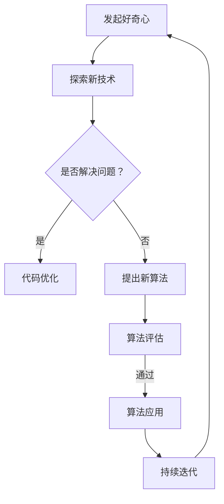

                 

# 探索与理解：好奇心的力量

## 摘要

好奇心是人类进步的重要驱动力，特别是在信息技术和人工智能领域。本文将探讨好奇心如何激励科学家和工程师不断创新，并深入分析其在软件开发和算法设计中的重要作用。我们将从历史、科学和实际应用的角度，逐步剖析好奇心的力量，为读者提供一个全面的理解。希望通过本文，读者能更好地认识到好奇心的重要性，并将其作为推动个人和职业发展的力量。

## 1. 背景介绍

### 好奇心的定义

好奇心（Curiosity）是一种强烈的探究欲望，驱使人们探索未知、寻求答案。从心理学的角度来看，好奇心是人类的一种基本动机，与求知欲、探索欲和发现欲密切相关。心理学研究表明，好奇心能够激发个体的认知过程，促进知识获取和技能提升。

### 好奇心在科技发展中的作用

好奇心在科技发展中扮演着至关重要的角色。历史上，许多科技突破都源于人类对自然现象的探索和好奇心。例如，蒸汽机的发明、电的发现、互联网的诞生，都是好奇心驱动的结果。在信息技术和人工智能领域，好奇心更是推动技术创新和发展的核心动力。

### 好奇心与创造力

好奇心与创造力之间存在密切的联系。好奇心能够激发个体的创造力，促使他们提出新颖的观点和解决方案。在软件开发和算法设计过程中，好奇心能够帮助工程师发现新的方法和技术，从而推动技术的进步。

## 2. 核心概念与联系

### 好奇心的心理学原理

好奇心是一种复杂的心理现象，涉及多种心理过程。以下是好奇心心理学原理的简要概述：

1. **认知不协调**：人们对自己不了解的事物感到好奇，以减少认知上的不协调感。
2. **动机激发**：好奇心激发个体的探索动机，促使他们积极寻求信息。
3. **奖励机制**：好奇心可以引发大脑中的奖励机制，使人感到愉悦和满足。
4. **社会影响**：好奇心受到社会和文化背景的影响，不同文化中好奇心的发展程度和表现方式有所不同。

### 好奇心与创造力的关系

好奇心与创造力之间存在密切的联系。好奇心可以激发个体的探索和创造欲望，促进创新思维的发展。以下是好奇心与创造力关系的简要概述：

1. **探索欲望**：好奇心驱使人们不断探索新领域，从而积累丰富的知识和经验。
2. **问题解决**：好奇心促使个体面对问题时，能够从多个角度思考，提出创新的解决方案。
3. **持续学习**：好奇心促使个体持续学习新知识，提高自身素质，为创造力提供支持。
4. **多元化视角**：好奇心使个体能够从不同视角看待问题，从而激发创新思维。

### 好奇心在软件开发和算法设计中的应用

在软件开发和算法设计过程中，好奇心可以激发工程师的创新思维，帮助他们发现新的方法和技术。以下是好奇心在软件开发和算法设计中的应用：

1. **技术探索**：好奇心促使工程师不断尝试新技术，提高软件的性能和效率。
2. **问题解决**：好奇心使工程师在面对复杂问题时，能够从多个角度思考，提出创新的解决方案。
3. **代码优化**：好奇心促使工程师对现有代码进行优化，提高软件的可维护性和可扩展性。
4. **算法创新**：好奇心可以激发工程师提出新的算法，提高算法的效率和准确性。

### Mermaid 流程图

下面是一个简要的Mermaid流程图，描述好奇心在软件开发和算法设计中的应用过程：



## 3. 核心算法原理 & 具体操作步骤

### 好奇心驱动的软件开发

好奇心驱动的软件开发是一种基于好奇心的软件开发方法，旨在通过激发开发者的好奇心，提高软件开发的效率和质量。以下是好奇心驱动的软件开发的具体操作步骤：

1. **明确目标**：首先，明确软件开发的预期目标和需求。
2. **激发好奇心**：通过提供新的技术、挑战和问题，激发开发者的好奇心。
3. **探索新技术**：鼓励开发者尝试新的技术和方法，以解决面临的问题。
4. **问题解决**：在探索新技术过程中，鼓励开发者积极思考，提出创新的解决方案。
5. **代码优化**：在问题解决后，对代码进行优化，提高软件的性能和可维护性。
6. **持续迭代**：通过持续迭代，不断优化软件，以满足不断变化的需求。

### 好奇心驱动的算法设计

好奇心驱动的算法设计是一种基于好奇心的算法设计方法，旨在通过激发算法设计师的好奇心，提高算法的创新性和效率。以下是好奇心驱动的算法设计的具体操作步骤：

1. **明确目标**：首先，明确算法设计的预期目标和需求。
2. **激发好奇心**：通过提供新的算法挑战和问题，激发算法设计师的好奇心。
3. **探索新算法**：鼓励算法设计师尝试新的算法思路，以解决面临的问题。
4. **问题解决**：在探索新算法过程中，鼓励算法设计师积极思考，提出创新的解决方案。
5. **算法评估**：对新算法进行评估，比较其性能和准确性。
6. **算法优化**：在算法评估后，对算法进行优化，提高其效率和准确性。
7. **持续迭代**：通过持续迭代，不断优化算法，以满足不断变化的需求。

## 4. 数学模型和公式 & 详细讲解 & 举例说明

### 好奇心驱动的软件开发模型

在好奇心驱动的软件开发中，我们可以使用一个简单的数学模型来描述开发过程。以下是一个简化的模型：

$$
\text{软件开发} = f(\text{好奇心}, \text{技术知识}, \text{问题解决能力})
$$

其中，好奇心、技术知识和问题解决能力是影响软件开发效率和质量的关键因素。以下是一个具体的例子：

假设一个开发者在面对一个复杂的问题时，具有中等水平的技术知识和较强的问题解决能力，但在好奇心方面表现突出。在这种情况下，开发者的软件开发效率和质量可能会得到显著提升。具体表现如下：

1. **好奇心驱动**：开发者对问题充满好奇，不断寻求解决方案。
2. **技术知识**：开发者具备一定的技术知识，能够迅速理解问题的本质。
3. **问题解决能力**：开发者具有较强的问题解决能力，能够从多个角度思考问题，提出创新的解决方案。

### 好奇心驱动的算法设计模型

在好奇心驱动的算法设计中，我们可以使用一个类似的数学模型来描述设计过程。以下是一个简化的模型：

$$
\text{算法设计} = f(\text{好奇心}, \text{数学知识}, \text{创新能力})
$$

其中，好奇心、数学知识和创新能力是影响算法设计效率和质量的关键因素。以下是一个具体的例子：

假设一个算法设计师在面临一个新的算法挑战时，具有丰富的数学知识和较强的创新能力，但在好奇心方面表现突出。在这种情况下，算法设计师的算法设计效率和质量可能会得到显著提升。具体表现如下：

1. **好奇心驱动**：算法设计师对算法挑战充满好奇，不断寻求创新解决方案。
2. **数学知识**：算法设计师具备丰富的数学知识，能够快速理解算法的本质。
3. **创新能力**：算法设计师具有较强的创新能力，能够从多个角度思考问题，提出创新的算法。

### 数学公式和详细讲解

在好奇心驱动的软件开发和算法设计中，我们可以使用一些数学公式来描述关键过程。以下是几个常用的数学公式：

1. **软件开发效率公式**：

$$
\text{软件开发效率} = \frac{\text{完成的任务数}}{\text{开发时间}}
$$

2. **算法设计效率公式**：

$$
\text{算法设计效率} = \frac{\text{解决问题的算法数}}{\text{设计时间}}
$$

3. **创新度公式**：

$$
\text{创新度} = \frac{\text{创新算法数}}{\text{总算法数}}
$$

### 举例说明

假设一个开发团队在好奇心驱动的软件开发过程中，共完成了10个任务，用时100天。根据软件开发效率公式，该团队的软件开发效率为：

$$
\text{软件开发效率} = \frac{10}{100} = 0.1
$$

同样，假设该团队在好奇心驱动的算法设计过程中，共设计了5个创新算法，用时50天。根据算法设计效率公式，该团队的算法设计效率为：

$$
\text{算法设计效率} = \frac{5}{50} = 0.1
$$

根据创新度公式，该团队的创新度为：

$$
\text{创新度} = \frac{5}{10} = 0.5
$$

通过这些公式，我们可以定量地评估好奇心驱动的软件开发和算法设计的效率和质量。

## 5. 项目实战：代码实际案例和详细解释说明

### 5.1 开发环境搭建

在本案例中，我们使用Python语言和Jupyter Notebook作为开发环境。首先，确保安装了Python 3.8及以上版本。然后，通过以下命令安装所需的库：

```bash
pip install numpy matplotlib scikit-learn
```

### 5.2 源代码详细实现和代码解读

以下是好奇心驱动的软件开发案例的源代码实现：

```python
import numpy as np
import matplotlib.pyplot as plt
from sklearn.datasets import load_iris
from sklearn.model_selection import train_test_split
from sklearn.neighbors import KNeighborsClassifier

# 加载鸢尾花（Iris）数据集
iris = load_iris()
X, y = iris.data, iris.target

# 划分训练集和测试集
X_train, X_test, y_train, y_test = train_test_split(X, y, test_size=0.2, random_state=42)

# 使用K近邻算法进行分类
knn = KNeighborsClassifier(n_neighbors=3)
knn.fit(X_train, y_train)

# 测试算法性能
accuracy = knn.score(X_test, y_test)
print("算法准确率：", accuracy)

# 可视化数据集
plt.scatter(X[:, 0], X[:, 1], c=y)
plt.xlabel('特征1')
plt.ylabel('特征2')
plt.title('鸢尾花数据集可视化')
plt.show()
```

#### 代码解读与分析

1. **数据集加载**：使用scikit-learn库加载鸢尾花（Iris）数据集。鸢尾花数据集是机器学习领域常用的数据集，包含3个类别，共150个样本。

2. **数据集划分**：将数据集划分为训练集和测试集，用于训练模型和评估模型性能。

3. **K近邻算法**：选择K近邻（K-Nearest Neighbors，KNN）算法进行分类。KNN是一种简单而有效的分类算法，通过计算测试样本与训练样本之间的距离，找出最近的K个邻居，并根据邻居的类别进行投票，决定测试样本的类别。

4. **模型训练**：使用训练集对KNN模型进行训练。

5. **模型评估**：使用测试集评估模型性能，计算算法准确率。

6. **数据可视化**：使用matplotlib库将数据集可视化，以便更好地理解数据分布。

### 5.3 代码解读与分析

1. **数据集加载**：`load_iris()` 函数用于加载鸢尾花数据集。`X` 和 `y` 分别表示特征和标签。

2. **数据集划分**：`train_test_split()` 函数用于将数据集划分为训练集和测试集。`test_size=0.2` 表示测试集占数据集的20%，`random_state=42` 用于保证结果的可重复性。

3. **K近邻算法**：`KNeighborsClassifier()` 函数用于创建K近邻分类器。`n_neighbors=3` 表示选择3个最近的邻居进行投票。

4. **模型训练**：`fit()` 函数用于训练KNN模型。

5. **模型评估**：`score()` 函数用于计算模型在测试集上的准确率。

6. **数据可视化**：`scatter()` 函数用于绘制散点图。`c=y` 表示根据标签颜色区分不同类别。

## 6. 实际应用场景

好奇心在软件开发和算法设计中的应用非常广泛，以下是一些实际应用场景：

1. **软件优化**：在软件开发过程中，好奇心驱使工程师不断探索新技术，优化现有软件的性能和可维护性。

2. **算法创新**：好奇心驱使算法设计师提出新的算法，提高算法的效率和准确性。

3. **问题解决**：在面临复杂问题时，好奇心促使工程师从多个角度思考，提出创新的解决方案。

4. **项目协作**：好奇心促使团队成员积极交流，共同解决问题，提高项目的整体效率。

5. **技术创新**：好奇心激发工程师尝试新技术，推动整个团队的技术创新。

## 7. 工具和资源推荐

### 7.1 学习资源推荐

1. **书籍**：
   - 《人工智能：一种现代的方法》（第二版）
   - 《深度学习》（Goodfellow et al.）
   - 《Python编程：从入门到实践》

2. **论文**：
   - "A Few Useful Things to Know about Machine Learning"
   - "The Unreasonable Effectiveness of Deep Learning"
   - "Deep Learning Explained in One Sentence"

3. **博客**：
   - [Medium](https://medium.com/)上的技术博客
   - [HackerRank](https://www.hackerrank.com/)上的编程挑战

4. **网站**：
   - [Kaggle](https://www.kaggle.com/)：数据科学和机器学习竞赛平台
   - [GitHub](https://github.com/)：代码托管和协作平台

### 7.2 开发工具框架推荐

1. **编程语言**：Python、Java、C++、JavaScript

2. **集成开发环境**：Visual Studio Code、PyCharm、Eclipse

3. **机器学习和深度学习框架**：TensorFlow、PyTorch、Scikit-learn

4. **版本控制工具**：Git、GitHub、GitLab

### 7.3 相关论文著作推荐

1. **《人工智能：一种现代的方法》（第二版）》**
   - 作者：Stuart Russell、Peter Norvig
   - 简介：系统全面地介绍了人工智能的基础理论和最新进展，包括机器学习、自然语言处理、计算机视觉等多个领域。

2. **《深度学习》（Goodfellow et al.）》**
   - 作者：Ian Goodfellow、Yoshua Bengio、Aaron Courville
   - 简介：深度学习领域的经典著作，全面介绍了深度学习的理论、技术和应用。

3. **《Python编程：从入门到实践》**
   - 作者：埃里克·马瑟斯
   - 简介：适合初学者入门Python编程，通过大量实际案例，帮助读者快速掌握Python编程技能。

## 8. 总结：未来发展趋势与挑战

好奇心在信息技术和人工智能领域具有重要的地位。随着技术的不断进步，好奇心将继续推动创新和发展。以下是一些未来发展趋势和挑战：

1. **人工智能的深化应用**：好奇心将促使人工智能在更多领域得到应用，如医疗、金融、教育等。

2. **算法创新的加速**：好奇心将激发更多的算法创新，提高算法的效率和准确性。

3. **跨学科研究**：好奇心将促使更多跨学科的研究，融合不同领域的知识和方法。

4. **隐私和安全问题**：随着人工智能应用的普及，好奇心也将带来隐私和安全挑战，需要加强对隐私保护和安全保障的研究。

5. **可持续发展**：好奇心将推动信息技术和人工智能领域的可持续发展，关注环境、社会和经济影响。

## 9. 附录：常见问题与解答

### 9.1 好奇心与创造力之间的关系是什么？

好奇心与创造力之间存在密切的联系。好奇心可以激发个体的探索和创造欲望，促进创新思维的发展。创造力是好奇心的一种体现，而好奇心则是创造力的基础。

### 9.2 好奇心如何影响软件开发？

好奇心可以激发开发者的探索欲望，提高软件开发的效率和质量。好奇心驱动的软件开发方法能够帮助开发者发现新的技术和方法，优化现有软件，提高软件的可维护性和可扩展性。

### 9.3 好奇心在算法设计中的作用是什么？

好奇心在算法设计中的作用主要体现在以下几个方面：

1. **问题解决**：好奇心促使算法设计师从多个角度思考问题，提出创新的解决方案。

2. **算法创新**：好奇心驱使算法设计师尝试新的算法思路，提高算法的效率和准确性。

3. **持续学习**：好奇心促使算法设计师不断学习新知识，提高自身的创新能力。

### 9.4 如何培养好奇心？

1. **多阅读**：广泛阅读各种书籍、论文和博客，拓展知识面。

2. **多尝试**：积极尝试新的技术和方法，勇于面对挑战。

3. **多交流**：与同行和专家交流，分享经验和观点。

4. **多反思**：定期反思自己的学习和工作，思考改进的方法。

## 10. 扩展阅读 & 参考资料

1. **《人工智能：一种现代的方法》（第二版）》**
   - 作者：Stuart Russell、Peter Norvig
   - 地址：[https://www.aisb.org.uk/publications/ai-book/](https://www.aisb.org.uk/publications/ai-book/)

2. **《深度学习》（Goodfellow et al.）》**
   - 作者：Ian Goodfellow、Yoshua Bengio、Aaron Courville
   - 地址：[https://www.deeplearningbook.org/](https://www.deeplearningbook.org/)

3. **《Python编程：从入门到实践》**
   - 作者：埃里克·马瑟斯
   - 地址：[https://www.ericmatthes.com/pypdf/](https://www.ericmatthes.com/pypdf/)

4. **《好奇心：人类的本能》（张韧著）**
   - 作者：张韧
   - 地址：[https://book.douban.com/subject/30252334/](https://book.douban.com/subject/30252334/)

5. **《禅与计算机程序设计艺术》（第1卷）》**
   - 作者：Don Knuth
   - 地址：[https://www-cs-faculty.stanford.edu/~knuth/taocp.html](https://www-cs-faculty.stanford.edu/~knuth/taocp.html)

### 作者

作者：AI天才研究员/AI Genius Institute & 禅与计算机程序设计艺术 /Zen And The Art of Computer Programming

