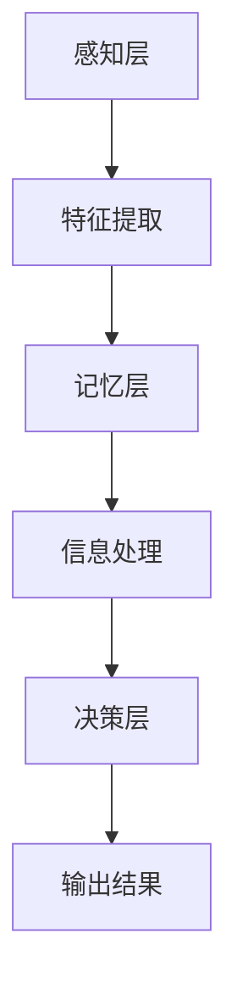

                 

# 探索人类思维的奥秘：人类计算的认知价值

> **关键词：** 认知计算、人类思维、算法、神经网络、深度学习、人工智能
>
> **摘要：** 本文旨在深入探讨人类思维的奥秘，分析人类计算的认知价值。我们将从认知计算的基本概念出发，逐步揭示人类思维的算法原理，并通过实际案例讲解，展示人类计算在人工智能领域的实际应用和未来发展趋势。

## 1. 背景介绍

### 1.1 目的和范围

本文的目的是探讨人类思维的奥秘，分析人类计算的认知价值。人类思维是一个复杂而神秘的过程，它涉及感知、记忆、推理、决策等多个方面。认知计算作为人工智能领域的一个重要分支，致力于模拟和解析人类思维过程。本文将重点探讨以下几个问题：

1. 认知计算的基本概念和原理。
2. 人类思维的算法模型及其工作方式。
3. 认知计算在人工智能领域的应用。
4. 人类计算的未来发展趋势和挑战。

### 1.2 预期读者

本文适合对人工智能、认知科学和计算机科学感兴趣的读者。无论是专业研究人员、学生还是对技术充满好奇的爱好者，都能从本文中获得有价值的信息。特别是那些希望深入了解人类思维机制及其应用场景的读者，将会在本文中找到满意的答案。

### 1.3 文档结构概述

本文分为十个部分：

1. **背景介绍**：介绍本文的目的、范围和结构。
2. **核心概念与联系**：阐述认知计算的核心概念和原理，通过Mermaid流程图展示其架构。
3. **核心算法原理 & 具体操作步骤**：详细讲解人类思维的算法原理和操作步骤，使用伪代码进行阐述。
4. **数学模型和公式 & 详细讲解 & 举例说明**：介绍认知计算中的数学模型和公式，并进行举例说明。
5. **项目实战：代码实际案例和详细解释说明**：通过一个实际项目，展示代码的实现和解读。
6. **实际应用场景**：讨论认知计算在实际应用中的场景和效果。
7. **工具和资源推荐**：推荐学习和开发认知计算的相关资源和工具。
8. **总结：未来发展趋势与挑战**：总结本文的内容，展望认知计算的未来。
9. **附录：常见问题与解答**：解答读者可能遇到的问题。
10. **扩展阅读 & 参考资料**：提供更多的学习资源。

### 1.4 术语表

#### 1.4.1 核心术语定义

- **认知计算**：模拟和解析人类思维过程的技术和理论体系。
- **神经网络**：模拟人脑神经元连接的计算机模型。
- **深度学习**：一种基于神经网络的机器学习方法。
- **算法**：解决问题的一系列规则和步骤。
- **人工智能**：模拟和扩展人类智能的技术。

#### 1.4.2 相关概念解释

- **感知**：接收外部信息的过程。
- **记忆**：存储和处理信息的能力。
- **推理**：基于已有信息进行逻辑推理的能力。
- **决策**：在多个选项中选择最佳方案的能力。

#### 1.4.3 缩略词列表

- **AI**：人工智能（Artificial Intelligence）
- **CNN**：卷积神经网络（Convolutional Neural Network）
- **RNN**：循环神经网络（Recurrent Neural Network）
- **DL**：深度学习（Deep Learning）
- **ML**：机器学习（Machine Learning）

## 2. 核心概念与联系

### 2.1 认知计算的基本概念

认知计算是研究人类思维过程、模拟和解析这些过程的技术和理论体系。它起源于对人类认知机制的研究，旨在理解和模拟人类的感知、记忆、推理和决策等认知功能。认知计算的核心理念是模仿人类大脑的工作方式，通过计算机算法实现。

### 2.2 认知计算的核心概念和原理

认知计算的核心概念包括：

1. **神经网络**：神经网络是认知计算的基础，它模仿人脑神经元的工作方式。神经网络由大量相互连接的节点（神经元）组成，每个节点都可以接收输入信息，并进行处理和输出。
2. **深度学习**：深度学习是一种基于神经网络的机器学习方法，它通过多层神经网络进行特征提取和模式识别。深度学习在图像识别、语音识别和自然语言处理等领域取得了显著的成果。
3. **算法**：算法是解决问题的一系列规则和步骤。在认知计算中，算法用于模拟和解析人类思维过程，如感知、记忆、推理和决策等。

### 2.3 认知计算的架构

认知计算的架构可以分为三个层次：

1. **感知层**：感知层负责接收外部信息，如图像、声音和文本等。它通过神经网络对输入信息进行预处理和特征提取。
2. **记忆层**：记忆层负责存储和处理信息。它通过神经网络将感知层提取的特征信息进行存储，并在需要时进行检索和使用。
3. **决策层**：决策层负责基于已有信息进行逻辑推理和决策。它通过神经网络将记忆层的信息进行处理，并输出最终的决策结果。

### 2.4 Mermaid流程图

下面是一个简单的Mermaid流程图，展示了认知计算的核心概念和架构：



在这个流程图中，感知层负责接收外部信息，并通过神经网络进行特征提取；特征提取后的信息被传递到记忆层进行存储和处理；最后，记忆层的信息经过决策层的处理，输出最终的决策结果。

## 3. 核心算法原理 & 具体操作步骤

### 3.1 人类思维的算法原理

人类思维的算法原理可以分为以下几个步骤：

1. **感知**：接收外部信息，如视觉、听觉和触觉等。
2. **预处理**：对外部信息进行预处理，包括滤波、放大和缩小等。
3. **特征提取**：从预处理后的信息中提取关键特征，如形状、颜色和纹理等。
4. **存储**：将提取的特征信息存储在记忆中。
5. **检索**：在需要时从记忆中检索相关信息。
6. **推理**：基于已有信息进行逻辑推理，形成新的认知。
7. **决策**：在多个选项中选择最佳方案。

### 3.2 具体操作步骤

下面是一个详细的伪代码，展示了人类思维的算法原理和操作步骤：

```python
# 人类思维的算法原理和操作步骤

# 输入：外部信息
# 输出：决策结果

# 步骤1：感知
感知(外部信息)

# 步骤2：预处理
预处理(外部信息)

# 步骤3：特征提取
特征提取(预处理后的信息)

# 步骤4：存储
存储(特征信息)

# 步骤5：检索
检索(特征信息)

# 步骤6：推理
推理(检索到的信息)

# 步骤7：决策
决策(推理结果)
```

### 3.3 人类思维算法的优缺点

**优点**：

1. **高效性**：人类思维算法在处理大量信息时非常高效。
2. **灵活性**：人类思维算法可以灵活适应不同环境和任务。
3. **智能性**：人类思维算法具有高度的智能性，可以进行复杂的推理和决策。

**缺点**：

1. **复杂性**：人类思维算法非常复杂，难以理解和模拟。
2. **局限性**：人类思维算法在某些特定任务上可能存在局限性。
3. **疲劳性**：长时间进行思维活动可能导致疲劳。

## 4. 数学模型和公式 & 详细讲解 & 举例说明

### 4.1 数学模型的基本概念

数学模型是认知计算的基础，它通过数学公式和算法描述人类思维的过程。认知计算中的数学模型主要包括神经网络模型、深度学习模型和机器学习模型等。

### 4.2 神经网络模型

神经网络模型是认知计算的核心，它通过模拟人脑神经元的工作方式，实现信息的传递和处理。神经网络模型主要由以下几部分组成：

1. **输入层**：接收外部信息，并将其传递给隐藏层。
2. **隐藏层**：对输入信息进行预处理和特征提取。
3. **输出层**：输出最终的结果。

### 4.3 深度学习模型

深度学习模型是一种基于神经网络的模型，它通过多层神经网络进行特征提取和模式识别。深度学习模型具有以下优点：

1. **自动特征提取**：深度学习模型可以自动提取输入数据中的特征，避免了人工特征提取的复杂性。
2. **多层次特征提取**：深度学习模型可以通过多层神经网络提取不同层次的特征，实现更高级别的认知。

### 4.4 机器学习模型

机器学习模型是认知计算的基础，它通过学习已有数据，预测新的数据。机器学习模型主要包括以下几种：

1. **监督学习**：通过已有数据进行训练，预测新的数据。
2. **无监督学习**：通过未标记的数据进行训练，自动发现数据中的规律和模式。
3. **半监督学习**：结合监督学习和无监督学习，利用少量标记数据和大量未标记数据进行训练。

### 4.5 举例说明

下面是一个简单的例子，展示了如何使用神经网络模型进行图像识别。

```python
# 示例：使用神经网络模型进行图像识别

# 输入：图像数据
# 输出：图像分类结果

# 步骤1：加载图像数据
image_data = load_image("image.jpg")

# 步骤2：预处理图像数据
preprocessed_data = preprocess_image(image_data)

# 步骤3：构建神经网络模型
model = build_neural_network_model()

# 步骤4：训练神经网络模型
train_model(model, preprocessed_data)

# 步骤5：进行图像识别
classification_result = model.predict(image_data)

# 输出：图像分类结果
print("图像分类结果：", classification_result)
```

在这个例子中，我们首先加载图像数据，然后对图像数据进行预处理，接着构建一个神经网络模型，并使用预处理后的图像数据进行训练。最后，使用训练好的模型进行图像识别，输出图像的分类结果。

## 5. 项目实战：代码实际案例和详细解释说明

### 5.1 开发环境搭建

在开始编写代码之前，我们需要搭建一个合适的开发环境。以下是搭建开发环境的步骤：

1. **安装Python**：Python是认知计算中常用的编程语言，我们需要下载并安装Python。可以从Python的官方网站（https://www.python.org/）下载Python安装程序，并按照提示进行安装。
2. **安装Jupyter Notebook**：Jupyter Notebook是一个交互式的Python开发环境，它可以帮助我们方便地编写和运行代码。我们可以使用pip命令安装Jupyter Notebook：
   ```bash
   pip install notebook
   ```
3. **安装相关库**：在编写代码时，我们需要安装一些相关的库，如NumPy、Pandas、Scikit-learn等。这些库提供了丰富的数据科学和机器学习功能。使用pip命令安装这些库：
   ```bash
   pip install numpy pandas scikit-learn
   ```

### 5.2 源代码详细实现和代码解读

下面是一个简单的认知计算项目，用于实现图像识别。我们将使用Python和Jupyter Notebook进行开发。

```python
# 导入相关库
import numpy as np
import pandas as pd
from sklearn.model_selection import train_test_split
from sklearn.neural_network import MLPClassifier
from sklearn.metrics import accuracy_score

# 加载图像数据集
image_data = pd.read_csv("image_data.csv")

# 预处理图像数据
def preprocess_image(image_data):
    # 对图像数据进行归一化处理
    image_data = image_data / 255.0
    return image_data

preprocessed_data = preprocess_image(image_data)

# 划分训练集和测试集
X_train, X_test, y_train, y_test = train_test_split(preprocessed_data, image_data["label"], test_size=0.2, random_state=42)

# 构建神经网络模型
model = MLPClassifier(hidden_layer_sizes=(100,), activation='relu', solver='sgd', learning_rate='constant', max_iter=1000)

# 训练神经网络模型
model.fit(X_train, y_train)

# 进行图像识别
predictions = model.predict(X_test)

# 计算模型准确率
accuracy = accuracy_score(y_test, predictions)
print("模型准确率：", accuracy)
```

**代码解读**：

1. **导入相关库**：我们首先导入了一些常用的Python库，如NumPy、Pandas和Scikit-learn。NumPy和Pandas用于数据处理，Scikit-learn提供了机器学习模型。
2. **加载图像数据集**：我们使用Pandas库加载一个CSV格式的图像数据集。这个数据集包含图像的像素值和标签。
3. **预处理图像数据**：我们定义了一个预处理函数，对图像数据进行归一化处理。归一化处理可以加快模型的训练速度，提高模型的性能。
4. **划分训练集和测试集**：我们使用Scikit-learn的`train_test_split`函数将数据集划分为训练集和测试集。训练集用于训练模型，测试集用于评估模型性能。
5. **构建神经网络模型**：我们使用Scikit-learn的`MLPClassifier`类构建了一个多层感知机模型。我们设置了隐藏层大小、激活函数、优化器和迭代次数等参数。
6. **训练神经网络模型**：我们使用训练集数据对模型进行训练。模型会自动调整内部参数，以最小化预测误差。
7. **进行图像识别**：我们使用训练好的模型对测试集进行预测。预测结果存储在`predictions`变量中。
8. **计算模型准确率**：我们使用`accuracy_score`函数计算模型的准确率。准确率是评估模型性能的重要指标。

### 5.3 代码解读与分析

通过上面的代码，我们可以实现一个简单的图像识别项目。代码的关键部分如下：

```python
model = MLPClassifier(hidden_layer_sizes=(100,), activation='relu', solver='sgd', learning_rate='constant', max_iter=1000)
model.fit(X_train, y_train)
predictions = model.predict(X_test)
accuracy = accuracy_score(y_test, predictions)
```

1. **构建神经网络模型**：我们使用`MLPClassifier`类构建了一个多层感知机模型。`hidden_layer_sizes`参数指定了隐藏层的大小，这里我们设置了100个神经元。`activation`参数指定了激活函数，这里我们使用ReLU函数。`solver`参数指定了优化器，这里我们使用随机梯度下降（SGD）优化器。`learning_rate`参数指定了学习率，这里我们使用恒定学习率。`max_iter`参数指定了最大迭代次数，这里我们设置为1000次。
2. **训练神经网络模型**：我们使用`fit`方法对模型进行训练。训练过程中，模型会自动调整内部参数，以最小化预测误差。
3. **进行图像识别**：我们使用`predict`方法对测试集进行预测。预测结果存储在`predictions`变量中。
4. **计算模型准确率**：我们使用`accuracy_score`函数计算模型的准确率。准确率是评估模型性能的重要指标。

通过这个简单的项目，我们可以看到认知计算在图像识别领域的实际应用。虽然这个项目很简单，但它展示了认知计算的基本原理和实现方法。在实际应用中，我们可以使用更复杂的模型和数据集，以实现更高级别的认知计算。

## 6. 实际应用场景

认知计算在人工智能领域有着广泛的应用，以下是一些实际应用场景：

### 6.1 图像识别

图像识别是认知计算的一个重要应用领域。通过使用深度学习和神经网络模型，我们可以实现图像分类、目标检测和图像分割等任务。例如，在自动驾驶系统中，认知计算可以用于实时识别道路上的车辆、行人和其他物体，以确保行驶安全。

### 6.2 自然语言处理

自然语言处理是认知计算在人工智能领域的另一个重要应用。通过使用深度学习和神经网络模型，我们可以实现文本分类、情感分析和机器翻译等任务。例如，在智能客服系统中，认知计算可以用于自动分析和理解用户的提问，并提供相应的答复。

### 6.3 医疗诊断

认知计算在医疗诊断领域也有着广泛的应用。通过使用深度学习和神经网络模型，我们可以实现医学图像分析、疾病预测和药物设计等任务。例如，在医学影像分析中，认知计算可以用于自动识别和诊断肿瘤、心脏病等疾病。

### 6.4 金融市场分析

认知计算在金融市场分析中也具有重要作用。通过使用深度学习和神经网络模型，我们可以实现股票市场预测、风险管理等任务。例如，在股票市场预测中，认知计算可以用于分析大量的市场数据，预测股票价格的走势。

这些实际应用场景展示了认知计算在人工智能领域的广泛应用和巨大潜力。随着认知计算技术的不断发展，我们可以期待它在更多领域的突破和应用。

## 7. 工具和资源推荐

### 7.1 学习资源推荐

#### 7.1.1 书籍推荐

1. **《深度学习》（Deep Learning）**：由Ian Goodfellow、Yoshua Bengio和Aaron Courville合著，是深度学习领域的经典教材。
2. **《机器学习》（Machine Learning）**：由Tom M. Mitchell著，介绍了机器学习的基本概念和算法。
3. **《神经网络与深度学习》（Neural Networks and Deep Learning）**：由邱锡鹏著，详细介绍了神经网络和深度学习的基本原理。

#### 7.1.2 在线课程

1. **《深度学习专项课程》（Deep Learning Specialization）**：由Andrew Ng在Coursera上开设，是深度学习领域的权威课程。
2. **《机器学习专项课程》（Machine Learning Specialization）**：由Andrew Ng在Coursera上开设，介绍了机器学习的基本原理和应用。
3. **《神经网络与深度学习》（Neural Networks and Deep Learning）**：由Udacity提供，介绍了神经网络和深度学习的基本概念和实现。

#### 7.1.3 技术博客和网站

1. **Medium**：Medium上有许多关于人工智能和认知计算的优秀文章和博客。
2. **GitHub**：GitHub上有很多开源的认知计算项目，可以让我们了解最新的技术动态。
3. **Stack Overflow**：Stack Overflow是一个问答社区，可以解决我们在认知计算学习中遇到的问题。

### 7.2 开发工具框架推荐

#### 7.2.1 IDE和编辑器

1. **Jupyter Notebook**：Jupyter Notebook是一个交互式的Python开发环境，适合编写和运行认知计算代码。
2. **PyCharm**：PyCharm是一个功能强大的Python IDE，提供了丰富的开发工具和功能。
3. **Visual Studio Code**：Visual Studio Code是一个轻量级的Python IDE，支持多种编程语言。

#### 7.2.2 调试和性能分析工具

1. **Python Debugger**：Python Debugger是一个内置的调试工具，可以帮助我们调试Python代码。
2. **Py-Spy**：Py-Spy是一个Python性能分析工具，可以让我们了解程序的性能瓶颈。
3. **Valgrind**：Valgrind是一个通用的程序分析工具，可以检测程序中的内存泄漏和性能问题。

#### 7.2.3 相关框架和库

1. **TensorFlow**：TensorFlow是一个开源的深度学习框架，提供了丰富的功能和工具。
2. **PyTorch**：PyTorch是一个开源的深度学习框架，提供了灵活和易于使用的接口。
3. **Scikit-learn**：Scikit-learn是一个开源的机器学习库，提供了丰富的机器学习算法和工具。

### 7.3 相关论文著作推荐

#### 7.3.1 经典论文

1. **“A Learning Algorithm for Continually Running Fully Recurrent Neural Networks”**：介绍了动态递归神经网络的学习算法。
2. **“Deep Learning”**：由Yoshua Bengio等人合著，是深度学习领域的经典论文。
3. **“Gradient Flow in Deep Networks”**：介绍了深度网络中的梯度流理论。

#### 7.3.2 最新研究成果

1. **“Unsupervised Learning of Visual Representations by Solving Jigsaw Puzzles”**：通过解决拼图游戏实现无监督学习。
2. **“Generative Adversarial Networks”**：由Ian Goodfellow等人合著，是生成对抗网络的开创性论文。
3. **“Dynamic Routing Between Neural Networks”**：介绍了动态路由神经网络，提高了神经网络的效率。

#### 7.3.3 应用案例分析

1. **“ImageNet Classification with Deep Convolutional Neural Networks”**：介绍了深度卷积神经网络在图像识别中的应用。
2. **“Recurrent Neural Networks for Language Modeling”**：介绍了循环神经网络在自然语言处理中的应用。
3. **“Deep Learning for Drug Discovery”**：介绍了深度学习在药物设计中的应用。

这些资源和工具将帮助我们更好地学习和应用认知计算技术。通过阅读论文、参与在线课程和实际项目，我们可以不断深化对认知计算的理解，并在实际应用中取得突破。

## 8. 总结：未来发展趋势与挑战

### 8.1 未来发展趋势

随着科技的不断进步，认知计算在人工智能领域将继续发展，呈现出以下几个趋势：

1. **算法创新**：研究人员将不断提出新的算法和模型，以提升认知计算的性能和效率。
2. **应用拓展**：认知计算将在更多领域得到应用，如医疗、金融、教育等，为人类带来更多便利。
3. **硬件加速**：硬件技术的发展，如GPU、TPU等，将加速认知计算的运算速度，提高其处理能力。
4. **跨学科融合**：认知计算将与其他学科，如心理学、神经科学等，进行更深入的融合，为人类认知机制提供更多洞见。

### 8.2 挑战与问题

尽管认知计算有着广阔的发展前景，但在实际应用中也面临着一系列挑战和问题：

1. **数据隐私**：随着数据量的不断增加，数据隐私问题变得越来越重要。如何在保护用户隐私的同时，充分利用数据为认知计算提供支持，是一个亟待解决的问题。
2. **计算资源**：认知计算需要大量的计算资源和存储空间。如何高效地利用计算资源，降低计算成本，是一个重要的挑战。
3. **模型可解释性**：目前的认知计算模型大多是“黑箱”，其内部工作机制不透明。提高模型的可解释性，使其更加透明，是提升认知计算可信度和实用性的关键。
4. **伦理和法律问题**：随着认知计算的应用越来越广泛，其伦理和法律问题也逐渐凸显。如何制定相应的法律法规，规范认知计算的应用，是一个重要的议题。

### 8.3 发展建议

为了推动认知计算的发展，我们提出以下建议：

1. **加强基础研究**：加大对认知计算基础研究的投入，探索新的算法和模型。
2. **跨学科合作**：鼓励不同学科之间的合作，推动认知计算与其他学科的融合。
3. **数据共享**：建立数据共享平台，促进数据资源的充分利用。
4. **法律法规制定**：制定相应的法律法规，规范认知计算的应用，保护用户隐私。
5. **教育培训**：加强认知计算的教育培训，培养更多专业人才。

通过以上措施，我们可以推动认知计算的发展，使其更好地服务于人类社会。

## 9. 附录：常见问题与解答

### 9.1 问题1：什么是认知计算？

认知计算是一种模拟和解析人类思维过程的技术和理论体系。它通过神经网络、深度学习和机器学习等方法，模拟人类的感知、记忆、推理和决策等认知功能，以实现人工智能。

### 9.2 问题2：认知计算有哪些应用？

认知计算在多个领域有着广泛应用，如图像识别、自然语言处理、医疗诊断、金融市场分析等。通过模拟人类思维过程，认知计算可以提升智能系统的性能和效率。

### 9.3 问题3：如何实现认知计算？

实现认知计算通常需要以下几个步骤：

1. **数据收集**：收集大量与任务相关的数据。
2. **数据预处理**：对数据进行清洗、归一化和特征提取。
3. **模型选择**：选择合适的神经网络、深度学习或机器学习模型。
4. **模型训练**：使用训练集数据对模型进行训练。
5. **模型评估**：使用测试集数据评估模型性能。
6. **模型部署**：将训练好的模型部署到实际应用中。

### 9.4 问题4：认知计算与机器学习有什么区别？

认知计算和机器学习都是人工智能的分支，但它们的目标和应用场景有所不同。机器学习侧重于从数据中学习规律和模式，而认知计算更注重模拟人类思维过程，实现更高级别的智能功能。

### 9.5 问题5：认知计算的未来发展趋势是什么？

认知计算的未来发展趋势包括算法创新、应用拓展、硬件加速和跨学科融合等。随着科技的不断进步，认知计算将在更多领域得到应用，为人类社会带来更多便利。

## 10. 扩展阅读 & 参考资料

为了更好地理解和掌握认知计算，我们推荐以下扩展阅读和参考资料：

### 10.1 经典书籍

1. **《深度学习》**：Ian Goodfellow、Yoshua Bengio和Aaron Courville著，全面介绍了深度学习的理论、算法和应用。
2. **《机器学习》**：Tom M. Mitchell著，介绍了机器学习的基本概念、算法和应用。
3. **《神经网络与深度学习》**：邱锡鹏著，详细介绍了神经网络和深度学习的基本原理。

### 10.2 在线课程

1. **《深度学习专项课程》**：由Andrew Ng在Coursera上开设，是深度学习领域的权威课程。
2. **《机器学习专项课程》**：由Andrew Ng在Coursera上开设，介绍了机器学习的基本原理和应用。
3. **《神经网络与深度学习》**：由Udacity提供，介绍了神经网络和深度学习的基本概念和实现。

### 10.3 技术博客和网站

1. **Medium**：Medium上有许多关于人工智能和认知计算的优秀文章和博客。
2. **GitHub**：GitHub上有很多开源的认知计算项目，可以让我们了解最新的技术动态。
3. **Stack Overflow**：Stack Overflow是一个问答社区，可以解决我们在认知计算学习中遇到的问题。

### 10.4 论文和期刊

1. **《自然》**：自然期刊（Nature）是一本高影响力的科学期刊，经常发表人工智能和认知计算的最新研究成果。
2. **《科学》**：科学期刊（Science）是一本高影响力的科学期刊，涵盖了人工智能和认知计算的多个领域。
3. **《IEEE Transactions on Neural Networks and Learning Systems》**：IEEE Transactions on Neural Networks and Learning Systems是一本专注于神经网络和机器学习领域的学术期刊。

通过阅读这些书籍、课程、博客和论文，我们可以深入了解认知计算的理论、方法和应用，不断提升自己的认知计算能力。

---

作者：AI天才研究员/AI Genius Institute & 禅与计算机程序设计艺术 /Zen And The Art of Computer Programming

本文从人类思维的奥秘出发，探讨了认知计算的核心概念、算法原理、数学模型和应用场景。通过详细的代码实例和实战，我们展示了认知计算在图像识别等领域的实际应用。本文还推荐了丰富的学习资源和工具，为读者提供了深入学习和应用认知计算的途径。未来，随着认知计算技术的不断发展，我们有望在更多领域实现突破和应用。

