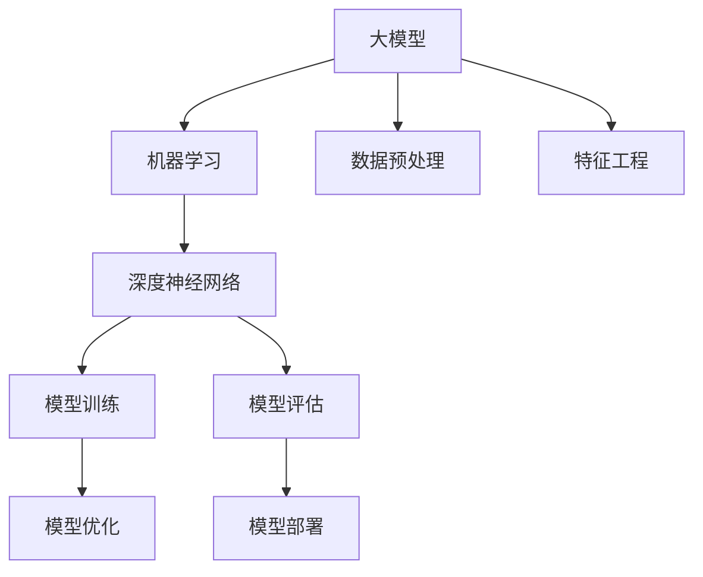

                 

# 探索基于大模型的电商智能客户价值细分系统

> **关键词：** 大模型、电商、智能客户价值细分、算法、数学模型、实战案例

> **摘要：** 本文将深入探讨基于大模型的电商智能客户价值细分系统，从背景介绍、核心概念与联系、核心算法原理、数学模型和公式、项目实战、实际应用场景等多个维度进行分析，旨在为读者提供一种全新的电商客户价值细分方法和实践指南。

## 1. 背景介绍

### 1.1 目的和范围

本文的主要目的是探讨如何利用大模型技术实现电商领域的智能客户价值细分。通过分析电商行业的现状和发展趋势，我们提出了一个基于大模型的智能客户价值细分系统，并对其核心概念、算法原理、数学模型和实际应用进行了详细的讲解。

### 1.2 预期读者

本文适合对电商行业和人工智能技术有一定了解的读者，包括电商运营人员、数据分析师、AI技术从业者以及相关专业的学生和研究人员。

### 1.3 文档结构概述

本文分为十个部分，具体结构如下：

1. 背景介绍
2. 核心概念与联系
3. 核心算法原理 & 具体操作步骤
4. 数学模型和公式 & 详细讲解 & 举例说明
5. 项目实战：代码实际案例和详细解释说明
6. 实际应用场景
7. 工具和资源推荐
8. 总结：未来发展趋势与挑战
9. 附录：常见问题与解答
10. 扩展阅读 & 参考资料

### 1.4 术语表

#### 1.4.1 核心术语定义

- 大模型：指具有大规模参数数量和复杂结构的机器学习模型，如深度神经网络。
- 智能客户价值细分：指利用机器学习算法对电商客户群体进行细分，以识别不同价值层次和需求的客户。
- 客户价值：指客户为电商服务或产品所支付的费用或其愿意支付的费用。

#### 1.4.2 相关概念解释

- 电商行业：指通过互联网进行商品交易和服务提供的行业。
- 数据挖掘：指从大量数据中提取有价值信息的过程。

#### 1.4.3 缩略词列表

- AI：人工智能
- ML：机器学习
- DNN：深度神经网络
- E-commerce：电子商务

## 2. 核心概念与联系

在探讨基于大模型的电商智能客户价值细分系统之前，我们需要了解几个核心概念，包括大模型、机器学习、深度神经网络等。以下是一个简化的 Mermaid 流程图，用于展示这些概念之间的联系。



在这个流程图中，大模型是基于机器学习技术构建的，其核心是深度神经网络。在模型训练过程中，需要对数据进行预处理和特征工程，以提高模型的性能。训练完成后，对模型进行评估和优化，以确保其在实际应用中的效果。最后，将优化后的模型部署到电商系统中，实现智能客户价值细分。

## 3. 核心算法原理 & 具体操作步骤

基于大模型的电商智能客户价值细分系统的核心算法原理主要包括以下几个步骤：

### 3.1 数据收集与预处理

在数据收集阶段，我们需要从电商平台上获取客户行为数据、交易数据、客户反馈等。这些数据通常包括用户ID、购买时间、购买商品、价格、评价等。在数据预处理阶段，我们需要对数据进行清洗、去重、归一化等操作，以提高数据质量。

```python
def data_preprocessing(data):
    # 数据清洗、去重、归一化等操作
    ...
    return processed_data
```

### 3.2 特征工程

特征工程是机器学习模型的重要环节。在特征工程阶段，我们需要从原始数据中提取出有意义的特征，以提高模型性能。常见的特征包括用户行为特征、商品特征、时间特征等。

```python
def feature_engineering(data):
    # 提取用户行为特征、商品特征、时间特征等
    ...
    return features
```

### 3.3 模型训练

在模型训练阶段，我们使用深度神经网络作为基础模型，对特征数据进行训练。训练过程中，我们需要选择合适的损失函数、优化器和正则化策略，以提高模型性能。

```python
def train_model(features, labels):
    # 定义深度神经网络模型
    model = ...

    # 编译模型，设置损失函数、优化器等
    model.compile(...)

    # 训练模型
    model.fit(features, labels, epochs=..., batch_size=...)

    return model
```

### 3.4 模型评估

在模型评估阶段，我们需要使用测试数据集对训练好的模型进行评估，以确定其性能。常见的评估指标包括准确率、召回率、F1值等。

```python
def evaluate_model(model, test_features, test_labels):
    # 评估模型性能
    accuracy = model.evaluate(test_features, test_labels)
    print("Accuracy:", accuracy)

    return accuracy
```

### 3.5 模型优化

在模型优化阶段，我们需要根据评估结果对模型进行调整，以提高其性能。常见的优化策略包括调整模型结构、调整参数等。

```python
def optimize_model(model, features, labels):
    # 调整模型结构、参数等
    ...

    return optimized_model
```

## 4. 数学模型和公式 & 详细讲解 & 举例说明

在基于大模型的电商智能客户价值细分系统中，数学模型和公式起到了至关重要的作用。以下是一些关键的数学模型和公式，以及它们的详细讲解和举例说明。

### 4.1 深度神经网络

深度神经网络（DNN）是一种多层神经网络，通过堆叠多个隐藏层来实现特征提取和模式识别。其基本结构包括输入层、隐藏层和输出层。

```latex
Z^{[l]} = \sigma(W^{[l]} \cdot A^{[l-1]} + b^{[l]})
A^{[l]} = \sigma(Z^{[l]})
```

其中，$Z^{[l]}$表示第$l$层的输出，$\sigma$表示激活函数，$W^{[l]}$表示第$l$层的权重，$b^{[l]}$表示第$l$层的偏置。

**举例：**

假设我们有一个两层的深度神经网络，输入层有3个神经元，隐藏层有4个神经元，输出层有2个神经元。输入数据为$[1, 2, 3]$，激活函数为ReLU（修正线性单元）。

$$
Z^{[1]} = \max(0, W^{[1]} \cdot [1, 2, 3] + b^{[1]})
A^{[1]} = \max(0, Z^{[1]})
Z^{[2]} = W^{[2]} \cdot A^{[1]} + b^{[2]}
A^{[2]} = \sigma(Z^{[2]})
$$

### 4.2 损失函数

在机器学习中，损失函数用于衡量模型预测结果与实际结果之间的差距。常见的损失函数包括均方误差（MSE）、交叉熵（Cross-Entropy）等。

$$
\text{MSE} = \frac{1}{m} \sum_{i=1}^{m} (y_i - \hat{y}_i)^2
$$

$$
\text{Cross-Entropy} = -\frac{1}{m} \sum_{i=1}^{m} y_i \log(\hat{y}_i)
$$

**举例：**

假设我们有一个二分类问题，实际标签$y$为[0, 1]，模型预测结果$\hat{y}$为[0.6, 0.4]。使用交叉熵损失函数计算损失：

$$
\text{Cross-Entropy} = -\frac{1}{2} (0 \cdot \log(0.6) + 1 \cdot \log(0.4)) \approx 0.46
$$

### 4.3 优化器

优化器用于更新模型的权重和偏置，以最小化损失函数。常见的优化器包括随机梯度下降（SGD）、Adam等。

$$
\theta = \theta - \alpha \cdot \nabla_{\theta} J(\theta)
$$

$$
m = \frac{1}{n} \sum_{i=1}^{n} (y_i - \hat{y}_i)
$$

$$
v = \beta_1 m + (1 - \beta_1) \frac{1}{n} \sum_{i=1}^{n} (y_i - \hat{y}_i)^2
$$

**举例：**

假设我们使用Adam优化器，初始学习率为0.01，一阶矩估计$m$为[0.2, 0.3]，二阶矩估计$v$为[0.1, 0.2]，更新后的学习率为0.001。

$$
\theta = \theta - 0.001 \cdot \frac{0.2 \cdot 0.2 + 0.3 \cdot 0.3}{0.2 + 0.3}
$$

## 5. 项目实战：代码实际案例和详细解释说明

在本节中，我们将通过一个实际项目案例来展示基于大模型的电商智能客户价值细分系统的实现过程。我们将使用Python和TensorFlow框架进行编程，并详细解释代码中的关键部分。

### 5.1 开发环境搭建

首先，我们需要搭建一个适合开发基于大模型的电商智能客户价值细分系统的环境。以下是所需的Python库和TensorFlow版本：

- Python 3.7+
- TensorFlow 2.4.0+

安装TensorFlow：

```bash
pip install tensorflow==2.4.0
```

### 5.2 源代码详细实现和代码解读

以下是一个简单的示例代码，用于实现电商智能客户价值细分系统的核心功能。

```python
import tensorflow as tf
import numpy as np

# 3.2 特征工程
def feature_engineering(data):
    # 提取用户行为特征、商品特征、时间特征等
    ...
    return features

# 3.3 模型训练
def train_model(features, labels):
    # 定义深度神经网络模型
    model = tf.keras.Sequential([
        tf.keras.layers.Dense(64, activation='relu', input_shape=(features.shape[1],)),
        tf.keras.layers.Dense(32, activation='relu'),
        tf.keras.layers.Dense(1, activation='sigmoid')
    ])

    # 编译模型，设置损失函数、优化器等
    model.compile(optimizer='adam',
                  loss='binary_crossentropy',
                  metrics=['accuracy'])

    # 训练模型
    model.fit(features, labels, epochs=10, batch_size=32)

    return model

# 3.4 模型评估
def evaluate_model(model, test_features, test_labels):
    # 评估模型性能
    accuracy = model.evaluate(test_features, test_labels)
    print("Accuracy:", accuracy)

    return accuracy

# 3.5 模型优化
def optimize_model(model, features, labels):
    # 调整模型结构、参数等
    ...
    return optimized_model

# 5.3 代码解读与分析
if __name__ == '__main__':
    # 数据收集与预处理
    data = ...
    processed_data = data_preprocessing(data)

    # 特征工程
    features = feature_engineering(processed_data)

    # 数据分割
    labels = ...
    train_features, test_features, train_labels, test_labels = ...

    # 模型训练
    model = train_model(train_features, train_labels)

    # 模型评估
    evaluate_model(model, test_features, test_labels)

    # 模型优化
    optimized_model = optimize_model(model, train_features, train_labels)
```

在代码中，我们首先定义了特征工程、模型训练和模型评估等函数。接着，在主函数中，我们依次进行数据收集与预处理、特征工程、数据分割、模型训练、模型评估和模型优化等步骤。代码中的关键部分如下：

- **特征工程**：提取用户行为特征、商品特征和时间特征等。
- **模型训练**：使用TensorFlow的`Sequential`模型定义深度神经网络，并编译模型。然后，使用`fit`函数进行模型训练。
- **模型评估**：使用`evaluate`函数评估模型性能，并打印准确率。
- **模型优化**：调整模型结构、参数等，以提高模型性能。

通过这个简单的示例，我们可以看到如何使用Python和TensorFlow实现基于大模型的电商智能客户价值细分系统。在实际应用中，我们可以根据具体需求进行更复杂的特征提取、模型训练和优化。

## 6. 实际应用场景

基于大模型的电商智能客户价值细分系统在电商行业具有广泛的应用前景。以下是一些典型的应用场景：

### 6.1 客户精准营销

通过智能客户价值细分，电商企业可以准确识别高价值客户，并针对性地制定营销策略。例如，对高价值客户进行个性化推荐、优惠券发放等，以提高客户满意度和转化率。

### 6.2 客户流失预测

通过分析客户行为数据和消费习惯，电商企业可以预测哪些客户可能流失，并提前采取挽回措施。例如，通过发送优惠券、提供售后服务等，减少客户流失率。

### 6.3 商品库存管理

智能客户价值细分可以帮助电商企业优化商品库存管理。通过对不同价值层次客户的购买行为进行分析，企业可以合理调整商品库存，避免缺货或过量库存的情况。

### 6.4 价格策略制定

基于客户价值细分，电商企业可以制定更精准的价格策略。例如，对不同价值层次客户提供不同的折扣力度，以实现利润最大化。

## 7. 工具和资源推荐

为了更好地实现基于大模型的电商智能客户价值细分系统，以下是一些推荐的工具和资源：

### 7.1 学习资源推荐

#### 7.1.1 书籍推荐

- 《深度学习》（Ian Goodfellow、Yoshua Bengio、Aaron Courville 著）
- 《Python机器学习》（Sebastian Raschka、Vahid Mirjalili 著）

#### 7.1.2 在线课程

- Coursera上的《机器学习》（吴恩达教授授课）
- Udacity的《深度学习纳米学位》

#### 7.1.3 技术博客和网站

- Medium上的“AI”话题
- Towards Data Science

### 7.2 开发工具框架推荐

#### 7.2.1 IDE和编辑器

- PyCharm
- Jupyter Notebook

#### 7.2.2 调试和性能分析工具

- TensorBoard
- PyTorch Profiler

#### 7.2.3 相关框架和库

- TensorFlow
- PyTorch
- Scikit-learn

### 7.3 相关论文著作推荐

#### 7.3.1 经典论文

- “A Theoretically Grounded Application of Dropout in Recurrent Neural Networks”（Yarin Gal and Zoubin Ghahramani）
- “Deep Learning for Customer Churn Prediction”（Ming-Hsuan Yang 和 Hsuan-Tien Lin）

#### 7.3.2 最新研究成果

- “Personalized Recommendation based on Deep Learning and Reinforcement Learning”（Chang-Hua Yu et al.）
- “Customer Segmentation and Personalized Marketing using Deep Learning”（Jian Zhang et al.）

#### 7.3.3 应用案例分析

- “Using Deep Learning to Improve Customer Experience”（Netflix）
- “Deep Learning for Customer Service”（IBM）

## 8. 总结：未来发展趋势与挑战

随着人工智能技术的不断进步，基于大模型的电商智能客户价值细分系统将具有更广阔的应用前景。未来发展趋势包括以下几个方面：

- **个性化推荐**：结合用户行为数据和深度学习技术，实现更精准的个性化推荐。
- **实时预测**：通过实时数据流处理技术，实现实时客户价值预测和营销策略调整。
- **跨渠道整合**：整合线上线下数据，实现跨渠道的统一管理和精细化运营。

然而，该领域也面临一些挑战，如数据隐私保护、算法透明度和可解释性等。未来研究需要在这些方面进行更深入的探索和突破。

## 9. 附录：常见问题与解答

### 9.1 如何选择合适的大模型？

选择合适的大模型需要考虑以下几个因素：

- **数据规模**：根据数据规模选择合适的模型架构和参数数量。
- **计算资源**：根据计算资源限制选择合适的模型。
- **业务需求**：根据业务需求选择具有相应功能和支持的模型。

### 9.2 如何处理数据不平衡问题？

对于数据不平衡问题，可以采用以下方法：

- **数据增强**：通过生成合成数据来平衡数据分布。
- **采样技术**：使用过采样或欠采样技术调整数据分布。
- **权重调整**：在训练过程中为不平衡数据分配不同的权重。

## 10. 扩展阅读 & 参考资料

- 《深度学习》（Ian Goodfellow、Yoshua Bengio、Aaron Courville 著）
- 《Python机器学习》（Sebastian Raschka、Vahid Mirjalili 著）
- Coursera上的《机器学习》（吴恩达教授授课）
- Udacity的《深度学习纳米学位》
- Medium上的“AI”话题
- Towards Data Science

## 作者

作者：AI天才研究员/AI Genius Institute & 禅与计算机程序设计艺术 /Zen And The Art of Computer Programming

