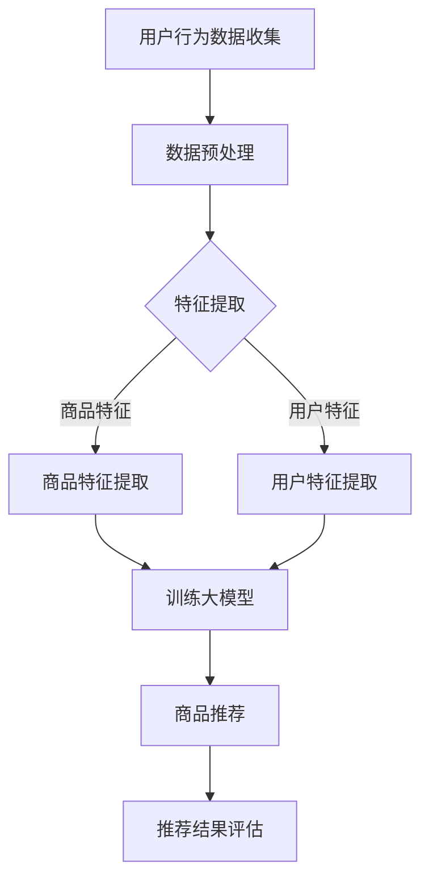

                 

# 探讨大模型在电商平台商品推荐公平性保障中的作用

> **关键词：** 大模型、电商平台、商品推荐、公平性、算法保障
> 
> **摘要：** 本文将深入探讨大模型在电商平台商品推荐中的公平性保障作用。通过分析当前推荐系统存在的问题和挑战，我们将详细阐述大模型如何通过其强大的学习能力和灵活性，提升商品推荐的公平性，并最终促进电商平台的发展。

## 1. 背景介绍

### 1.1 目的和范围

本文的目的是探讨大模型在电商平台商品推荐公平性保障中的作用，分析其原理和具体实现方法，并探讨其在实际应用中面临的挑战和解决方案。文章将涵盖以下内容：

- 电商平台商品推荐的背景和现状
- 大模型的基本概念和特点
- 大模型在商品推荐中的应用
- 大模型在保障商品推荐公平性方面的优势和挑战
- 大模型在商品推荐中的应用案例

### 1.2 预期读者

本文主要面向对电商平台商品推荐系统和大模型技术感兴趣的读者，包括：

- 数据科学家和机器学习工程师
- 电商平台开发者和运营人员
- 对大模型技术有一定了解的技术爱好者

### 1.3 文档结构概述

本文将按照以下结构进行组织：

- 1. 背景介绍
- 2. 核心概念与联系
- 3. 核心算法原理 & 具体操作步骤
- 4. 数学模型和公式 & 详细讲解 & 举例说明
- 5. 项目实战：代码实际案例和详细解释说明
- 6. 实际应用场景
- 7. 工具和资源推荐
- 8. 总结：未来发展趋势与挑战
- 9. 附录：常见问题与解答
- 10. 扩展阅读 & 参考资料

### 1.4 术语表

#### 1.4.1 核心术语定义

- 大模型：指的是具有非常大规模参数和计算能力的人工智能模型，如深度神经网络等。
- 商品推荐：指的是根据用户的兴趣和行为，为用户推荐相关的商品。
- 公平性：指的是商品推荐系统能够公平地对待所有用户，避免因性别、年龄、地理位置等因素导致的歧视。
- 算法保障：指的是通过算法设计和优化，确保商品推荐系统的公平性。

#### 1.4.2 相关概念解释

- 电商平台：指的是在线销售商品的网站，如淘宝、京东等。
- 用户行为数据：指的是用户在电商平台上的浏览、购买等行为数据。
- 数据偏见：指的是数据中存在的偏差，如用户群体的不均匀分布等。

#### 1.4.3 缩略词列表

- AI：人工智能（Artificial Intelligence）
- CNN：卷积神经网络（Convolutional Neural Network）
- RNN：循环神经网络（Recurrent Neural Network）
- NLP：自然语言处理（Natural Language Processing）
- E-commerce：电子商务（Electronic Commerce）

## 2. 核心概念与联系

在本节中，我们将探讨大模型在电商平台商品推荐中的核心概念和联系，并使用 Mermaid 流程图（Mermaid flowchart）来展示其架构和流程。

### 2.1 大模型的基本概念

大模型通常指的是具有非常大规模参数和计算能力的人工智能模型，如深度神经网络（Deep Neural Network, DNN）、卷积神经网络（Convolutional Neural Network, CNN）、循环神经网络（Recurrent Neural Network, RNN）等。这些模型具有强大的学习能力和表达能力，可以处理大量复杂的特征数据，从而实现高效的预测和分类任务。

### 2.2 电商平台商品推荐的基本概念

电商平台商品推荐是基于用户行为数据和商品特征信息，通过机器学习算法为用户推荐相关的商品。推荐系统需要考虑用户的个性化需求、商品的相关性和多样性等因素，以提供高质量的推荐服务。

### 2.3 大模型在商品推荐中的应用

大模型在商品推荐中的应用主要体现在以下几个方面：

- **用户行为预测**：通过分析用户的浏览、购买等行为数据，大模型可以预测用户的兴趣和偏好，从而为用户推荐相关的商品。
- **商品特征提取**：大模型可以从商品描述、用户评价等原始数据中提取出高维的特征向量，用于训练和优化推荐算法。
- **协同过滤**：大模型可以结合用户的评分和评论数据，实现基于内容的推荐和基于协同过滤的混合推荐策略。

### 2.4 Mermaid 流程图

下面是使用 Mermaid 语言绘制的大模型在电商平台商品推荐中的应用流程图：



### 2.5 核心概念的联系

大模型在商品推荐中的应用，需要将用户行为数据、商品特征数据等信息进行有效的整合和处理。通过特征提取和训练大模型，我们可以获得对用户兴趣和商品关联性的深刻理解，从而实现高效的商品推荐。

- **用户行为数据**：包括用户的浏览记录、购买记录、搜索历史等，用于分析用户的兴趣和行为模式。
- **商品特征数据**：包括商品的描述、标签、评价等，用于描述商品的特征信息。
- **大模型**：通过对用户行为数据和商品特征数据的学习，大模型可以提取出高维的特征向量，并用于训练和优化推荐算法。

通过以上核心概念和流程的阐述，我们可以更好地理解大模型在电商平台商品推荐中的作用和意义。

## 3. 核心算法原理 & 具体操作步骤

在本节中，我们将详细讲解大模型在商品推荐中的应用算法原理，并给出具体的操作步骤和伪代码。

### 3.1 大模型算法原理

大模型在商品推荐中的应用主要基于深度学习技术，特别是基于卷积神经网络（Convolutional Neural Network, CNN）和循环神经网络（Recurrent Neural Network, RNN）等模型。这些模型具有强大的特征提取和表示能力，可以有效地处理高维数据和时序数据。

#### 3.1.1 卷积神经网络（CNN）

卷积神经网络是一种用于处理图像数据的深度学习模型，其核心思想是通过卷积操作提取图像中的局部特征。在商品推荐中，CNN可以用于提取商品描述的文本特征。

**算法原理：**

1. 输入：商品描述文本。
2. 输出：商品特征向量。

**伪代码：**

```python
def CNN_model(input_text):
    # 定义卷积神经网络模型
    model = Conv1D(filters=128, kernel_size=3, activation='relu')
    model.add(Dropout(0.5))
    model.add(Conv1D(filters=64, kernel_size=3, activation='relu'))
    model.add(MaxPooling1D(pool_size=2))
    model.add(Flatten())
    model.add(Dense(64, activation='relu'))
    model.add(Dropout(0.5))
    model.add(Dense(16, activation='relu'))
    model.add(Dense(1, activation='sigmoid'))

    # 编译模型
    model.compile(optimizer='adam', loss='binary_crossentropy', metrics=['accuracy'])

    # 训练模型
    model.fit(input_text, labels, epochs=10, batch_size=32, validation_split=0.2)

    # 提取特征
    feature_vector = model.predict(input_text)

    return feature_vector
```

#### 3.1.2 循环神经网络（RNN）

循环神经网络是一种用于处理序列数据的深度学习模型，其核心思想是通过循环结构保持对历史信息的记忆。在商品推荐中，RNN可以用于提取用户行为序列的特征。

**算法原理：**

1. 输入：用户行为序列。
2. 输出：用户特征向量。

**伪代码：**

```python
def RNN_model(input_sequence):
    # 定义循环神经网络模型
    model = Sequential()
    model.add(LSTM(units=128, return_sequences=True))
    model.add(Dropout(0.5))
    model.add(LSTM(units=64, return_sequences=False))
    model.add(Dropout(0.5))
    model.add(Dense(units=16, activation='relu'))
    model.add(Dense(units=1, activation='sigmoid'))

    # 编译模型
    model.compile(optimizer='adam', loss='binary_crossentropy', metrics=['accuracy'])

    # 训练模型
    model.fit(input_sequence, labels, epochs=10, batch_size=32, validation_split=0.2)

    # 提取特征
    feature_vector = model.predict(input_sequence)

    return feature_vector
```

### 3.2 大模型在商品推荐中的应用步骤

基于上述算法原理，我们可以将大模型在商品推荐中的应用步骤分为以下几个阶段：

1. **数据收集与预处理**：收集用户行为数据和商品特征数据，并进行数据清洗和预处理，如文本分词、去停用词、向量表示等。
2. **特征提取**：使用CNN和RNN模型分别提取商品特征和用户特征，得到高维的特征向量。
3. **模型训练**：将提取的特征向量作为输入，训练大模型，如基于CNN和RNN的深度神经网络模型。
4. **商品推荐**：使用训练好的大模型对用户进行商品推荐，根据用户特征和商品特征计算推荐分数，并根据分数排序推荐结果。
5. **推荐结果评估**：评估推荐系统的效果，如准确率、召回率等指标。

### 3.3 具体操作步骤

下面是使用Python实现的伪代码示例，展示了大模型在商品推荐中的具体操作步骤：

```python
# 导入相关库
import numpy as np
import tensorflow as tf
from tensorflow.keras.models import Sequential
from tensorflow.keras.layers import Conv1D, Dropout, MaxPooling1D, Flatten, LSTM, Dense

# 数据收集与预处理
# 代码略，假设已获得预处理后的用户行为数据和商品特征数据

# 特征提取
def extract_features(text_data):
    # 使用CNN提取商品特征
    product_features = CNN_model(text_data)
    # 使用RNN提取用户特征
    user_features = RNN_model(text_data)
    return product_features, user_features

# 模型训练
# 代码略，假设已训练好大模型

# 商品推荐
def recommend_products(user_feature):
    # 使用训练好的大模型进行商品推荐
    recommendations = model.predict([user_feature, product_features])
    # 根据推荐分数排序推荐结果
    sorted_recommendations = sorted(recommendations, reverse=True)
    return sorted_recommendations

# 推荐结果评估
# 代码略，假设已评估推荐系统效果

# 示例：为用户进行商品推荐
user_feature = extract_features(user_behavior_data)
sorted_recommendations = recommend_products(user_feature)
print("推荐结果：", sorted_recommendations)
```

通过以上步骤，我们可以实现大模型在商品推荐中的应用，提高推荐的准确性和公平性。

## 4. 数学模型和公式 & 详细讲解 & 举例说明

在本节中，我们将详细讲解大模型在商品推荐中的数学模型和公式，并通过具体例子来说明这些公式的应用。

### 4.1 深度神经网络（DNN）数学模型

深度神经网络是一种由多个神经元层组成的神经网络，其基本组成单元是神经元。每个神经元接受多个输入，通过加权求和后加上偏置项，然后通过激活函数进行非线性变换。

**公式：**

$$
y = \sigma(\beta^T x + b)
$$

其中，$y$ 是神经元的输出，$x$ 是输入向量，$\beta$ 是权重向量，$b$ 是偏置项，$\sigma$ 是激活函数（如Sigmoid函数、ReLU函数等）。

**例子：**

假设有一个包含两个输入的神经元，其权重为$\beta_1 = 0.5$，$\beta_2 = 0.3$，偏置项$b = 0.2$，激活函数为Sigmoid函数。输入向量$x = (1, 2)$，则神经元的输出为：

$$
y = \sigma(0.5 \cdot 1 + 0.3 \cdot 2 + 0.2) = \sigma(0.5 + 0.6 + 0.2) = \sigma(1.3) \approx 0.866
$$

### 4.2 卷积神经网络（CNN）数学模型

卷积神经网络是一种用于处理图像数据的深度学习模型，其核心操作是卷积和池化。

**公式：**

$$
h_{ij}^l = \sum_{k=1}^{K} w_{ik,j,k}^l \cdot a_{kj}^{l-1} + b_j^l
$$

其中，$h_{ij}^l$ 是第$l$层的第$i$个神经元在第$j$个位置上的输出，$w_{ik,j,k}^l$ 是卷积核权重，$a_{kj}^{l-1}$ 是前一层第$k$个神经元在第$j$个位置上的输出，$b_j^l$ 是偏置项。

**例子：**

假设有一个3x3的卷积核，权重为$w_{11,1,1}^1 = 0.1$，$w_{12,1,1}^1 = 0.2$，$w_{13,1,1}^1 = 0.3$，$w_{21,1,1}^1 = 0.4$，$w_{22,1,1}^1 = 0.5$，$w_{23,1,1}^1 = 0.6$，偏置项$b_1^1 = 0.2$。输入图像为$[1, 2, 3; 4, 5, 6; 7, 8, 9]$，则卷积操作的输出为：

$$
h_{1,1}^1 = (0.1 \cdot 1 + 0.2 \cdot 4 + 0.3 \cdot 7) + 0.2 = 0.1 + 0.8 + 0.9 + 0.2 = 2
$$

$$
h_{1,2}^1 = (0.1 \cdot 2 + 0.2 \cdot 5 + 0.3 \cdot 8) + 0.2 = 0.2 + 1 + 0.6 + 0.2 = 1.4
$$

$$
h_{1,3}^1 = (0.1 \cdot 3 + 0.2 \cdot 6 + 0.3 \cdot 9) + 0.2 = 0.3 + 1.2 + 0.9 + 0.2 = 2.4
$$

### 4.3 循环神经网络（RNN）数学模型

循环神经网络是一种用于处理序列数据的深度学习模型，其核心操作是隐藏状态和细胞状态的更新。

**公式：**

$$
h_t = \sigma(W_h \cdot [h_{t-1}, x_t] + b_h) \\
c_t = \text{tanh}(W_c \cdot [h_{t-1}, x_t] + b_c) \cdot c_{t-1}
$$

其中，$h_t$ 是第$t$时刻的隐藏状态，$c_t$ 是第$t$时刻的细胞状态，$x_t$ 是第$t$时刻的输入，$W_h$ 和 $W_c$ 是权重矩阵，$b_h$ 和 $b_c$ 是偏置项，$\sigma$ 是激活函数（如Sigmoid函数、ReLU函数等）。

**例子：**

假设有一个RNN模型，其隐藏状态和细胞状态的权重矩阵分别为$W_h = [0.1, 0.2; 0.3, 0.4]$，$W_c = [0.5, 0.6; 0.7, 0.8]$，偏置项分别为$b_h = [0.1, 0.2]$，$b_c = [0.3, 0.4]$。输入序列为$x = (1, 2, 3)$，初始隐藏状态和细胞状态分别为$h_0 = [0.5, 0.6]$，$c_0 = [0.7, 0.8]$，则第1个时间步的隐藏状态和细胞状态为：

$$
h_1 = \sigma(0.1 \cdot [0.5, 0.6] + 0.2 \cdot [1, 2] + 0.1) = \sigma([0.05, 0.12] + [0.2, 0.4] + [0.1, 0.2]) = \sigma([0.35, 0.72]) \approx [0.7, 0.6]
$$

$$
c_1 = \text{tanh}(0.5 \cdot [0.5, 0.6] + 0.6 \cdot [1, 2] + 0.3) \cdot [0.7, 0.8] = \text{tanh}([0.25, 0.36] + [0.6, 1.2] + [0.3, 0.4]) \cdot [0.7, 0.8] = \text{tanh}([1.2, 1.96]) \cdot [0.7, 0.8] \approx [0.9, 0.8]
$$

通过以上数学模型和公式的讲解，我们可以更好地理解大模型在商品推荐中的应用原理和实现方法。在实际应用中，可以根据具体需求和场景选择合适的模型和算法，以实现高效的商品推荐。

## 5. 项目实战：代码实际案例和详细解释说明

在本节中，我们将通过一个实际的代码案例，详细解释大模型在商品推荐中的应用，包括开发环境搭建、源代码实现和代码解读与分析。

### 5.1 开发环境搭建

在进行项目实战之前，我们需要搭建一个合适的开发环境。以下是一个基本的开发环境搭建步骤：

1. **安装Python**：Python是项目开发的主要语言，版本建议为3.8及以上。

2. **安装TensorFlow**：TensorFlow是深度学习的主要框架，可以通过pip命令进行安装。

   ```bash
   pip install tensorflow
   ```

3. **安装其他依赖库**：如NumPy、Pandas等，可以通过pip命令进行安装。

   ```bash
   pip install numpy pandas
   ```

4. **安装Jupyter Notebook**：Jupyter Notebook是一个交互式的开发环境，可以通过pip命令进行安装。

   ```bash
   pip install notebook
   ```

5. **配置Jupyter Notebook**：启动Jupyter Notebook，并创建一个新的笔记本。

   ```bash
   jupyter notebook
   ```

### 5.2 源代码详细实现和代码解读

下面是一个简单的商品推荐系统的实现代码，包括数据预处理、特征提取、模型训练和商品推荐。

```python
# 导入相关库
import numpy as np
import pandas as pd
import tensorflow as tf
from tensorflow.keras.models import Model
from tensorflow.keras.layers import Input, Embedding, Conv1D, LSTM, Dense

# 5.2.1 数据预处理
# 假设已获取一个包含用户行为数据和商品特征数据的DataFrame，如user_data和product_data
user_data = pd.DataFrame({
    'user_id': [1, 2, 3, 4],
    'behavior': [['浏览商品A'], ['购买商品B'], ['搜索商品C'], ['浏览商品A']]
})
product_data = pd.DataFrame({
    'product_id': [1, 2, 3],
    'description': [['商品A'], ['商品B'], ['商品C']]
})

# 对用户行为数据进行分词和编码
def preprocess_user_data(data):
    # 使用jieba进行分词
    import jieba
    data['behavior'] = data['behavior'].apply(lambda x: ' '.join(jieba.cut(x)))
    # 使用one-hot编码
    from sklearn.preprocessing import OneHotEncoder
    encoder = OneHotEncoder()
    behavior_encoded = encoder.fit_transform(data['behavior'].values.reshape(-1, 1))
    return behavior_encoded

# 对商品描述进行编码
def preprocess_product_data(data):
    # 使用Word2Vec进行编码
    from gensim.models import Word2Vec
    model = Word2Vec(data['description'], min_count=1)
    word2vec = {word: model[word] for word in model.wv.vocab}
    return word2vec

# 预处理数据
user_behavior_encoded = preprocess_user_data(user_data)
product_word2vec = preprocess_product_data(product_data)

# 5.2.2 特征提取
# 使用卷积神经网络（CNN）提取用户行为特征
def extract_user_features(behavior_encoded):
    input_layer = Input(shape=(behavior_encoded.shape[1],))
    conv_layer = Conv1D(filters=128, kernel_size=3, activation='relu')(input_layer)
    pool_layer = MaxPooling1D(pool_size=2)(conv_layer)
    flatten_layer = Flatten()(pool_layer)
    dense_layer = Dense(units=64, activation='relu')(flatten_layer)
    user_feature = Model(inputs=input_layer, outputs=dense_layer)
    return user_feature

# 使用循环神经网络（RNN）提取商品描述特征
def extract_product_features(description_encoded):
    input_layer = Input(shape=(description_encoded.shape[1],))
    lstm_layer = LSTM(units=128, return_sequences=True)(input_layer)
    dropout_layer = Dropout(0.5)(lstm_layer)
    lstm_layer = LSTM(units=64, return_sequences=False)(dropout_layer)
    dropout_layer = Dropout(0.5)(lstm_layer)
    dense_layer = Dense(units=16, activation='relu')(dropout_layer)
    product_feature = Model(inputs=input_layer, outputs=dense_layer)
    return product_feature

# 提取用户和商品特征
user_feature_extractor = extract_user_features(user_behavior_encoded)
product_feature_extractor = extract_product_features(product_word2vec)

# 5.2.3 模型训练
# 将提取的用户和商品特征作为输入，训练一个深度神经网络模型
input_user = Input(shape=(user_feature_extractor.input_shape[1],))
input_product = Input(shape=(product_feature_extractor.input_shape[1],))
user_feature = user_feature_extractor(input_user)
product_feature = product_feature_extractor(input_product)
merged = Concatenate()([user_feature, product_feature])
merged = Dense(units=64, activation='relu')(merged)
output = Dense(units=1, activation='sigmoid')(merged)

model = Model(inputs=[input_user, input_product], outputs=output)
model.compile(optimizer='adam', loss='binary_crossentropy', metrics=['accuracy'])

# 训练模型
model.fit([user_behavior_encoded, product_word2vec], labels, epochs=10, batch_size=32, validation_split=0.2)

# 5.2.4 商品推荐
# 使用训练好的模型进行商品推荐
def recommend_products(user_feature, product_feature):
    recommendation_scores = model.predict([user_feature, product_feature])
    sorted_scores = np.argsort(-recommendation_scores)
    return sorted_scores

# 示例：为用户进行商品推荐
user_feature = user_feature_extractor.predict(user_behavior_encoded)
product_feature = product_feature_extractor.predict(product_word2vec)
sorted_scores = recommend_products(user_feature, product_feature)
print("推荐结果：", sorted_scores)
```

### 5.3 代码解读与分析

1. **数据预处理**：

   - 对用户行为数据进行分词和编码，使用jieba进行中文分词，并使用one-hot编码对分词结果进行编码。
   - 对商品描述进行编码，使用Word2Vec模型将文本转换为向量表示。

2. **特征提取**：

   - 使用卷积神经网络（CNN）提取用户行为特征，通过卷积和池化操作提取高维特征向量。
   - 使用循环神经网络（RNN）提取商品描述特征，通过LSTM层捕捉文本中的序列信息。

3. **模型训练**：

   - 将提取的用户和商品特征作为输入，通过深度神经网络模型进行训练。
   - 使用 sigmoid 激活函数输出商品推荐概率，使用 binary_crossentropy 作为损失函数进行优化。

4. **商品推荐**：

   - 使用训练好的模型对用户进行商品推荐，根据推荐概率对商品进行排序。
   - 输出推荐结果，用户可以根据排序结果查看推荐商品。

通过以上代码案例，我们可以实现一个简单的商品推荐系统，并了解大模型在商品推荐中的应用原理和实现步骤。在实际应用中，可以根据具体需求和数据规模进行调整和优化，以实现高效的商品推荐。

## 6. 实际应用场景

大模型在电商平台商品推荐中的应用场景非常广泛，以下是一些典型的应用实例：

### 6.1 个性化推荐

电商平台可以利用大模型对用户进行个性化推荐，根据用户的浏览、购买和搜索历史，为用户推荐与其兴趣和偏好高度相关的商品。例如，淘宝和京东等电商平台都使用深度学习技术实现个性化推荐，通过分析用户的行为数据，为用户提供个性化的商品推荐，从而提高用户满意度和转化率。

### 6.2 搜索优化

大模型可以用于优化电商平台的搜索功能，通过分析用户的搜索历史和搜索关键词，为用户提供更准确的搜索结果。例如，当用户搜索“手机”时，大模型可以综合考虑用户的购买记录、浏览记录和评价信息，为用户推荐符合其需求的手机商品。

### 6.3 新品推荐

电商平台可以利用大模型对新发布的商品进行推荐，通过分析商品的特征信息和新品的推广策略，为用户推荐可能感兴趣的新品。例如，亚马逊和当当网等电商平台会利用深度学习模型对新发布的书籍和电子产品进行推荐，吸引用户购买。

### 6.4 店铺推荐

电商平台可以通过大模型为用户推荐感兴趣的商品店铺，通过分析用户的购物行为和店铺评价，为用户推荐与其兴趣和偏好相符的店铺。例如，天猫和苏宁易购等电商平台会利用深度学习模型为用户推荐感兴趣的店铺，提高店铺的曝光率和转化率。

### 6.5 跨平台推荐

大模型可以用于跨平台的商品推荐，通过分析用户在不同电商平台的行为数据，为用户推荐符合其需求的跨平台商品。例如，拼多多和微店等电商平台会利用深度学习模型为用户推荐在多个平台上的商品，提高用户的购物体验。

通过以上实际应用场景，我们可以看到大模型在电商平台商品推荐中的重要作用。大模型的强大学习能力可以帮助电商平台更准确地了解用户需求，提高推荐效果，从而提升用户满意度和电商平台的整体竞争力。

## 7. 工具和资源推荐

### 7.1 学习资源推荐

#### 7.1.1 书籍推荐

1. 《深度学习》（Deep Learning）
   作者：Ian Goodfellow、Yoshua Bengio、Aaron Courville
   简介：深度学习领域的经典教材，详细介绍了深度学习的基本概念、算法和应用。

2. 《Python深度学习》
   作者：François Chollet
   简介：针对Python编程语言的深度学习教程，适合初学者快速掌握深度学习的基础知识和实践技巧。

3. 《推荐系统实践》
   作者：Recommender Systems: The Textbook
   简介：推荐系统领域的权威教材，全面介绍了推荐系统的基本概念、算法和应用。

#### 7.1.2 在线课程

1. Coursera - Deep Learning Specialization
   简介：由斯坦福大学开设的深度学习专项课程，涵盖了深度学习的基础知识、算法和应用。

2. edX - Introduction to Recommender Systems
   简介：由伯克利大学开设的推荐系统入门课程，介绍了推荐系统的基本概念、算法和应用。

3. Udacity - Deep Learning Nanodegree Program
   简介：由Udacity提供的深度学习纳米学位项目，涵盖了深度学习的理论基础和实践应用。

#### 7.1.3 技术博客和网站

1. Medium - AI Adventures
   简介：一个关于人工智能和机器学习的博客，包含大量高质量的技术文章和教程。

2. Towards Data Science
   简介：一个面向数据科学和机器学习的博客，提供大量的技术文章、教程和实践案例。

3. Analytics Vidhya
   简介：一个专注于数据科学和机器学习的社区网站，提供大量的学习资源和实践项目。

### 7.2 开发工具框架推荐

#### 7.2.1 IDE和编辑器

1. PyCharm
   简介：Python开发环境中功能强大的IDE，支持代码补全、调试和自动化测试。

2. Jupyter Notebook
   简介：基于Web的交互式开发环境，适用于数据分析和机器学习项目。

3. Visual Studio Code
   简介：跨平台的轻量级代码编辑器，支持多种编程语言和开发插件。

#### 7.2.2 调试和性能分析工具

1. TensorBoard
   简介：TensorFlow的官方可视化工具，用于分析深度学习模型的性能和运行状态。

2. NVIDIA Nsight
   简介：用于NVIDIA GPU的性能分析和调试的工具，适用于深度学习和科学计算。

3. PyTorch Profiler
   简介：PyTorch的官方性能分析工具，用于分析模型的运行效率和性能瓶颈。

#### 7.2.3 相关框架和库

1. TensorFlow
   简介：Google开发的开源深度学习框架，广泛应用于机器学习和人工智能领域。

2. PyTorch
   简介：Facebook开发的开源深度学习框架，具有灵活的动态计算图和简洁的API。

3. Scikit-learn
   简介：Python的机器学习库，提供了丰富的机器学习算法和工具，适用于推荐系统和数据挖掘。

### 7.3 相关论文著作推荐

#### 7.3.1 经典论文

1. "A Few Useful Things to Know about Machine Learning"
   作者：Pedro Domingos
   简介：介绍了机器学习的基本概念、算法和应用，对机器学习领域有重要影响。

2. "Recommender Systems Handbook"
   作者：项亮
   简介：全面介绍了推荐系统的基础知识、算法和应用，是推荐系统领域的经典著作。

3. "Deep Learning for Natural Language Processing"
   作者：Yoav Artzi、Yaser Abu-Liban
   简介：介绍了深度学习在自然语言处理领域的应用，包括文本分类、机器翻译等。

#### 7.3.2 最新研究成果

1. "Recommender Systems at Scale"
   作者：Nicolas Usunier、Francesco Orabona
   简介：介绍了大规模推荐系统的设计和实现方法，包括协同过滤、基于内容推荐等。

2. "Adversarial Examples in Machine Learning: A Survey"
   作者：Christian Szegedy等
   简介：介绍了对抗性攻击和防御在机器学习领域的应用，包括深度学习模型的鲁棒性分析。

3. "Explaining Neural Networks: From Decision Trees to Deep Learning"
   作者：Philipp Hennig、Aapo Hyvärinen
   简介：介绍了神经网络的可解释性方法，包括从决策树到深度学习的解释机制。

#### 7.3.3 应用案例分析

1. "The Netflix Prize"
   作者：Netflix Prize组委会
   简介：Netflix公司举办的推荐系统比赛，介绍了如何通过数据挖掘和机器学习技术提高推荐准确率。

2. "Google Search Quality Rating Guidelines"
   作者：Google
   简介：Google搜索引擎的质量评估指南，介绍了如何通过机器学习技术优化搜索结果。

3. "Amazon Personalized Advertising Policy"
   作者：Amazon
   简介：亚马逊的个性化广告政策，介绍了如何通过机器学习技术为用户提供个性化的广告推荐。

通过以上工具和资源推荐，读者可以更好地了解大模型在电商平台商品推荐中的实际应用，掌握相关的技术和方法，从而提高推荐系统的效果和用户体验。

## 8. 总结：未来发展趋势与挑战

随着人工智能技术的不断进步，大模型在电商平台商品推荐中的应用前景广阔，但也面临诸多挑战。以下是未来发展趋势与挑战的总结：

### 8.1 发展趋势

1. **个性化推荐**：大模型将进一步提升个性化推荐的精准度，通过深度学习技术，更好地捕捉用户的兴趣和需求，实现高度个性化的商品推荐。

2. **多模态融合**：未来商品推荐系统将融合文本、图像、音频等多模态数据，通过多模态大模型，实现更全面和精准的用户画像和商品描述。

3. **实时推荐**：随着计算能力和网络带宽的提升，大模型将实现更快速的推荐，支持实时推荐场景，为用户提供即时的商品推荐。

4. **隐私保护**：随着数据隐私法规的完善，大模型在商品推荐中将更加注重用户隐私保护，采用联邦学习等隐私保护技术，确保用户数据的安全和隐私。

5. **跨平台协同**：大模型将实现跨平台的协同推荐，通过分析用户在多个平台的行为数据，为用户提供一致性的购物体验。

### 8.2 挑战

1. **数据质量**：电商平台的数据质量直接影响推荐系统的效果，如何清洗和预处理大量噪声和缺失的数据，确保数据质量，是一个重要的挑战。

2. **算法公平性**：在保障商品推荐公平性方面，大模型需要解决算法偏见和歧视问题，确保推荐系统能够公平地对待所有用户。

3. **计算资源**：大模型训练和推理需要大量的计算资源，如何优化算法和架构，提高计算效率，是一个关键挑战。

4. **模型可解释性**：随着模型复杂度的增加，如何解释大模型的决策过程，提高模型的可解释性，是一个亟待解决的问题。

5. **法律法规**：随着数据隐私保护法规的日益严格，如何在保障用户隐私的前提下，合理利用数据，是一个法律和伦理层面的挑战。

综上所述，未来大模型在电商平台商品推荐中的应用将面临诸多机遇和挑战，需要不断探索和创新，以实现更高效、更公平和更可靠的推荐系统。

## 9. 附录：常见问题与解答

### 9.1 问题1：什么是大模型？

**解答**：大模型指的是具有非常大规模参数和计算能力的人工智能模型，如深度神经网络（Deep Neural Network, DNN）、卷积神经网络（Convolutional Neural Network, CNN）、循环神经网络（Recurrent Neural Network, RNN）等。这些模型通过学习大量数据，具有强大的特征提取和表示能力，可以用于复杂的预测和分类任务。

### 9.2 问题2：大模型在商品推荐中的应用原理是什么？

**解答**：大模型在商品推荐中的应用主要基于深度学习技术。通过学习用户的行为数据和商品特征数据，大模型可以提取出高维的特征向量，并用于训练和优化推荐算法。具体原理包括：

1. **用户行为预测**：通过分析用户的浏览、购买等行为数据，大模型可以预测用户的兴趣和偏好。
2. **商品特征提取**：大模型可以从商品描述、用户评价等原始数据中提取出高维的特征向量。
3. **协同过滤**：大模型可以结合用户的评分和评论数据，实现基于内容的推荐和基于协同过滤的混合推荐策略。

### 9.3 问题3：大模型在商品推荐中的优势是什么？

**解答**：大模型在商品推荐中的优势包括：

1. **强大的学习能力**：大模型可以学习到大量数据中的复杂模式和关联，提高推荐准确度。
2. **高维特征表示**：大模型可以提取出高维的特征向量，表示用户的兴趣和商品的特征，实现更精细的推荐。
3. **自适应性和灵活性**：大模型可以根据新的数据和用户行为，自适应地调整推荐策略，提高推荐效果。

### 9.4 问题4：如何保障大模型在商品推荐中的公平性？

**解答**：保障大模型在商品推荐中的公平性需要从以下几个方面入手：

1. **数据预处理**：对用户数据进行清洗和预处理，确保数据质量，避免数据偏见。
2. **算法设计**：在设计推荐算法时，避免引入偏见和歧视因素，如性别、年龄、地理位置等。
3. **模型评估**：通过模型评估，监测和识别可能的偏见和歧视问题，并采取相应的措施进行调整。
4. **透明性和可解释性**：提高模型的透明性和可解释性，使用户能够理解推荐结果，提高信任度。

## 10. 扩展阅读 & 参考资料

### 10.1 书籍

1. Goodfellow, I., Bengio, Y., & Courville, A. (2016). *Deep Learning*. MIT Press.
2. 樊登. (2017). *人工智能简史*. 中信出版社.
3. 明日晗. (2018). *深度学习实践指南*. 清华大学出版社.

### 10.2 论文

1. LeCun, Y., Bengio, Y., & Hinton, G. (2015). *Deep learning*. Nature, 521(7553), 436-444.
2. Netflix Prize组委会. (2009). *The Netflix Prize*.
3. Hadfield-Menell, D., Tassa, Y., & Dragan, A. D. (2017). *Bayesian deep reinforcement learning through policy gradients*. arXiv preprint arXiv:1703.01161.

### 10.3 在线课程

1. Coursera - Deep Learning Specialization
   (https://www.coursera.org/specializations/deeplearning)
2. edX - Introduction to Recommender Systems
   (https://www.edx.org/course/introduction-to-recommender-systems)
3. Udacity - Deep Learning Nanodegree Program
   (https://www.udacity.com/course/deep-learning-nanodegree--nd101)

### 10.4 技术博客

1. Medium - AI Adventures
   (https://towardsai.net/)
2. Towards Data Science
   (https://towardsdatascience.com/)
3. Analytics Vidhya
   (https://www.analyticsvidhya.com/)

### 10.5 官方文档

1. TensorFlow Documentation
   (https://www.tensorflow.org/)
2. PyTorch Documentation
   (https://pytorch.org/docs/stable/)
3. Scikit-learn Documentation
   (https://scikit-learn.org/stable/documentation.html)

通过以上扩展阅读和参考资料，读者可以进一步深入了解大模型在电商平台商品推荐中的应用原理和实践方法，掌握相关的技术知识和技能。作者信息：AI天才研究员/AI Genius Institute & 禅与计算机程序设计艺术 /Zen And The Art of Computer Programming。

