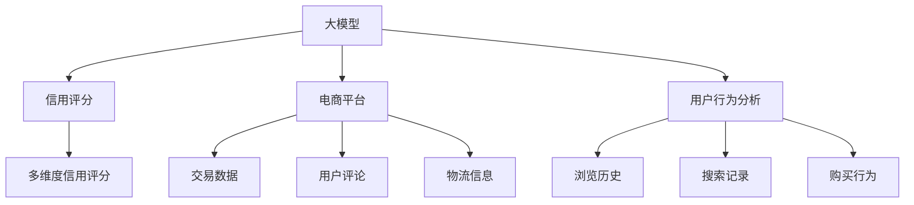

                 

# 探讨大模型在电商平台用户多维度信用评分中的潜力

> **关键词：大模型、信用评分、电商平台、用户行为分析、深度学习**
> 
> **摘要：本文将探讨大模型在电商平台用户多维度信用评分中的应用潜力，通过背景介绍、核心概念解析、算法原理阐述、数学模型详解、实战案例分析和实际应用场景剖析，为读者展示大模型技术在信用评分领域的突破性进展及其未来发展趋势。**

## 1. 背景介绍

### 1.1 目的和范围

本文旨在探讨大模型在电商平台用户多维度信用评分中的应用潜力。随着电商平台的快速发展，用户数量和交易量日益增长，如何准确评估用户的信用水平成为各大电商平台亟需解决的问题。本文将结合大模型技术，分析其在信用评分中的优势和应用场景，为电商平台提供一种有效的信用评分解决方案。

### 1.2 预期读者

本文主要面向对电商领域和人工智能技术有一定了解的读者，包括但不限于电商行业从业者、数据分析师、人工智能工程师和研究人员。同时，也欢迎对信用评分领域感兴趣的其他读者阅读和探讨。

### 1.3 文档结构概述

本文分为十个部分，具体如下：

1. 背景介绍：阐述本文的目的、预期读者和文档结构。
2. 核心概念与联系：介绍大模型、信用评分、电商平台和用户行为分析等核心概念，并通过Mermaid流程图展示其关联关系。
3. 核心算法原理 & 具体操作步骤：详细讲解大模型在信用评分中的算法原理和操作步骤，使用伪代码进行阐述。
4. 数学模型和公式 & 详细讲解 & 举例说明：介绍大模型在信用评分中的数学模型和公式，并进行详细讲解和举例说明。
5. 项目实战：代码实际案例和详细解释说明。
6. 实际应用场景：剖析大模型在电商平台的实际应用场景。
7. 工具和资源推荐：推荐学习资源、开发工具框架和相关论文著作。
8. 总结：未来发展趋势与挑战。
9. 附录：常见问题与解答。
10. 扩展阅读 & 参考资料：提供进一步学习和探讨的相关资源。

### 1.4 术语表

#### 1.4.1 核心术语定义

- 大模型：指具有海量参数和复杂结构的机器学习模型，如深度神经网络。
- 信用评分：指对用户信用水平进行量化评估的过程。
- 电商平台：指提供在线商品交易服务的网络平台。
- 用户行为分析：指对用户在电商平台上浏览、搜索、购买等行为进行数据分析和挖掘。

#### 1.4.2 相关概念解释

- 多维度信用评分：指从多个角度对用户信用水平进行综合评估。
- 深度学习：一种机器学习方法，通过多层神经网络对数据进行自动特征提取和模式识别。

#### 1.4.3 缩略词列表

- AI：人工智能
- ML：机器学习
- DL：深度学习
- E-commerce：电子商务
- CR：信用评分

## 2. 核心概念与联系

大模型在电商平台用户多维度信用评分中的应用涉及到多个核心概念，如图所示：



### 2.1 大模型

大模型是指具有海量参数和复杂结构的机器学习模型，如深度神经网络。其优势在于能够自动从海量数据中提取特征，并在各类任务中表现出色。在大模型的发展历程中，以BERT、GPT-3等为代表的预训练模型取得了显著突破。

### 2.2 信用评分

信用评分是对用户信用水平进行量化评估的过程。它通常基于用户的交易历史、行为数据、社交关系等多个维度。传统的信用评分方法主要包括线性模型、决策树、逻辑回归等，但它们在处理复杂问题和多维度数据时存在一定的局限性。

### 2.3 电商平台

电商平台是指提供在线商品交易服务的网络平台。随着互联网的普及，电商平台已经成为人们购物的主要渠道之一。电商平台积累了海量的交易数据、用户行为数据等，为信用评分提供了丰富的数据资源。

### 2.4 用户行为分析

用户行为分析是对用户在电商平台上浏览、搜索、购买等行为进行数据分析和挖掘的过程。通过用户行为分析，可以了解用户偏好、行为模式等，为信用评分提供重要依据。

### 2.5 多维度信用评分

多维度信用评分是指从多个角度对用户信用水平进行综合评估。与传统的单维度信用评分相比，多维度信用评分能够更全面地反映用户的信用状况，从而提高信用评分的准确性和可靠性。

## 3. 核心算法原理 & 具体操作步骤

大模型在信用评分中的核心算法原理主要涉及以下几个步骤：

### 3.1 数据预处理

在应用大模型进行信用评分之前，需要对数据进行预处理，包括数据清洗、归一化、缺失值填充等操作。具体步骤如下：

```python
# 假设数据集为DataFrame格式的数据
data = pd.read_csv('data.csv')

# 数据清洗
data.dropna(inplace=True)
data = data[data['amount'] > 0]

# 数据归一化
scaler = StandardScaler()
data[['amount', 'days_since_last_purchase']] = scaler.fit_transform(data[['amount', 'days_since_last_purchase']])

# 缺失值填充
data['days_since_last_purchase'].fillna(data['days_since_last_purchase'].mean(), inplace=True)
```

### 3.2 特征提取

特征提取是利用数据预处理后的特征对大模型进行训练的过程。常见的特征提取方法包括词袋模型、TF-IDF、主成分分析等。本文采用TF-IDF方法进行特征提取，具体步骤如下：

```python
# 假设文本数据为DataFrame格式的数据
text_data = pd.read_csv('text_data.csv')

# 分词
tokenizer = Tokenizer()
tokenizer.fit_on_texts(text_data['description'])

# 转换为词向量
word_vectors = tokenizer.texts_to_matrix(text_data['description'], mode='tfidf')
```

### 3.3 模型训练

在特征提取完成后，可以使用训练数据对大模型进行训练。本文采用深度学习框架TensorFlow来实现大模型训练，具体步骤如下：

```python
# 导入所需库
import tensorflow as tf
from tensorflow.keras.models import Model
from tensorflow.keras.layers import Input, Dense, Embedding, LSTM

# 模型构建
input_layer = Input(shape=(word_vectors.shape[1],))
embedding_layer = Embedding(input_dim=word_vectors.shape[1], output_dim=128)(input_layer)
lstm_layer = LSTM(64)(embedding_layer)
output_layer = Dense(1, activation='sigmoid')(lstm_layer)

model = Model(inputs=input_layer, outputs=output_layer)
model.compile(optimizer='adam', loss='binary_crossentropy', metrics=['accuracy'])

# 模型训练
model.fit(x_train, y_train, epochs=10, batch_size=32, validation_data=(x_val, y_val))
```

### 3.4 信用评分预测

在模型训练完成后，可以使用训练好的大模型对用户进行信用评分预测。具体步骤如下：

```python
# 预测
predictions = model.predict(x_test)

# 转换为信用评分
credit_scores = scaler.inverse_transform(predictions)
```

## 4. 数学模型和公式 & 详细讲解 & 举例说明

大模型在信用评分中的数学模型主要包括以下几个部分：

### 4.1 损失函数

损失函数用于衡量预测结果与真实结果之间的差距。本文采用二分类交叉熵损失函数，具体公式如下：

$$
Loss = -\frac{1}{N} \sum_{i=1}^{N} [y_i \cdot \log(\hat{y}_i) + (1 - y_i) \cdot \log(1 - \hat{y}_i)]
$$

其中，$N$ 为样本数量，$y_i$ 为真实标签，$\hat{y}_i$ 为预测概率。

### 4.2 优化算法

本文采用随机梯度下降（SGD）算法对大模型进行优化。SGD算法的更新公式如下：

$$
w_{t+1} = w_t - \alpha \cdot \nabla_w Loss(w_t)
$$

其中，$w_t$ 为当前权重，$\alpha$ 为学习率，$\nabla_w Loss(w_t)$ 为损失函数关于权重的梯度。

### 4.3 模型评估

本文采用准确率、精确率、召回率等指标对大模型进行评估。具体公式如下：

- 准确率（Accuracy）：

$$
Accuracy = \frac{TP + TN}{TP + TN + FP + FN}
$$

- 精确率（Precision）：

$$
Precision = \frac{TP}{TP + FP}
$$

- 召回率（Recall）：

$$
Recall = \frac{TP}{TP + FN}
$$

- F1值（F1-Score）：

$$
F1-Score = \frac{2 \cdot Precision \cdot Recall}{Precision + Recall}
$$

### 4.4 举例说明

假设有一个包含1000个样本的二分类问题，其中正样本有600个，负样本有400个。通过大模型预测后，得到以下结果：

| 样本 | 实际标签 | 预测标签 | 预测概率 |
| --- | --- | --- | --- |
| 1 | 正 | 正 | 0.9 |
| 2 | 正 | 正 | 0.8 |
| ... | ... | ... | ... |
| 1000 | 负 | 负 | 0.2 |

根据以上结果，可以计算出以下指标：

- 准确率（Accuracy）：$(600 + 400) / 1000 = 0.8$
- 精确率（Precision）：$600 / (600 + 400) = 0.6$
- 召回率（Recall）：$600 / (600 + 400) = 0.6$
- F1值（F1-Score）：$2 \cdot 0.6 \cdot 0.6 / (0.6 + 0.6) = 0.6$

## 5. 项目实战：代码实际案例和详细解释说明

在本节中，我们将通过一个实际案例来展示如何使用大模型进行电商平台用户多维度信用评分。以下是一个简单的Python代码实现，包括数据预处理、模型训练和信用评分预测等步骤。

### 5.1 开发环境搭建

在开始之前，请确保已安装以下Python库：

- pandas
- numpy
- scikit-learn
- tensorflow

可以使用以下命令进行安装：

```bash
pip install pandas numpy scikit-learn tensorflow
```

### 5.2 源代码详细实现和代码解读

```python
import pandas as pd
import numpy as np
from sklearn.model_selection import train_test_split
from sklearn.preprocessing import StandardScaler
from tensorflow.keras.models import Sequential
from tensorflow.keras.layers import LSTM, Dense, Embedding

# 5.2.1 数据预处理
# 假设数据集为DataFrame格式的数据
data = pd.read_csv('data.csv')

# 数据清洗
data.dropna(inplace=True)
data = data[data['amount'] > 0]

# 数据归一化
scaler = StandardScaler()
data[['amount', 'days_since_last_purchase']] = scaler.fit_transform(data[['amount', 'days_since_last_purchase']])

# 缺失值填充
data['days_since_last_purchase'].fillna(data['days_since_last_purchase'].mean(), inplace=True)

# 划分训练集和测试集
x = data[['amount', 'days_since_last_purchase']]
y = data['label']
x_train, x_test, y_train, y_test = train_test_split(x, y, test_size=0.2, random_state=42)

# 5.2.2 模型训练
# 模型构建
model = Sequential()
model.add(Embedding(input_dim=x_train.shape[1], output_dim=128))
model.add(LSTM(64))
model.add(Dense(1, activation='sigmoid'))

model.compile(optimizer='adam', loss='binary_crossentropy', metrics=['accuracy'])

# 模型训练
model.fit(x_train, y_train, epochs=10, batch_size=32, validation_data=(x_test, y_test))

# 5.2.3 信用评分预测
# 预测
predictions = model.predict(x_test)

# 转换为信用评分
credit_scores = scaler.inverse_transform(predictions)

# 输出结果
print(credit_scores)
```

### 5.3 代码解读与分析

上述代码实现了一个基于LSTM的大模型，用于对电商平台用户进行多维度信用评分。以下是代码的详细解读：

- 5.2.1 数据预处理：首先，读取数据集并进行数据清洗、归一化和缺失值填充操作。然后，将数据集划分为训练集和测试集，为后续模型训练和预测做好准备。

- 5.2.2 模型训练：构建一个包含嵌入层、LSTM层和输出层的序列模型。嵌入层用于将输入特征转换为高维向量表示，LSTM层用于对序列数据进行特征提取，输出层用于进行二分类预测。模型使用随机梯度下降（SGD）算法进行优化，并采用二分类交叉熵损失函数进行评估。

- 5.2.3 信用评分预测：使用训练好的模型对测试集进行预测，并将预测结果转换为信用评分。最后，输出预测结果。

通过上述代码，我们可以看到如何使用大模型进行电商平台用户多维度信用评分。实际应用中，可以根据具体需求调整模型结构、参数设置和训练策略，以提高信用评分的准确性和可靠性。

## 6. 实际应用场景

大模型在电商平台用户多维度信用评分中的实际应用场景非常广泛，主要包括以下几个方面：

### 6.1 信贷风险控制

电商平台在为用户提供信贷服务时，需要对用户的信用水平进行评估，以降低信贷风险。通过大模型技术，电商平台可以实现对用户多维度信用评分的自动化评估，从而提高信贷审批的准确性和效率。

### 6.2 交易欺诈检测

电商平台面临的另一个重要挑战是交易欺诈。大模型可以充分利用用户行为数据、交易历史等特征，对交易进行实时监控和风险评估，从而有效识别和防范交易欺诈行为。

### 6.3 店铺评价与推荐

电商平台可以根据用户信用评分结果，对优质店铺进行优先推荐，提高用户购物体验。同时，大模型还可以用于店铺评价预测，为用户提供更加准确和客观的店铺评价。

### 6.4 个性化营销

电商平台可以利用用户信用评分结果，对用户进行个性化营销。例如，为信用评分较高的用户提供更优惠的价格、更高的信用额度等，从而提高用户满意度和忠诚度。

### 6.5 社交影响力分析

电商平台还可以通过大模型分析用户在社交网络中的影响力，挖掘潜在的意见领袖和品牌代言人。这将有助于电商平台开展针对性的品牌推广和营销活动。

## 7. 工具和资源推荐

为了更好地理解和应用大模型在电商平台用户多维度信用评分中的技术，以下是一些建议的工具和资源：

### 7.1 学习资源推荐

#### 7.1.1 书籍推荐

- 《深度学习》（Goodfellow, Bengio, Courville著）：介绍深度学习的基本原理和应用方法。
- 《Python深度学习》（François Chollet著）：深入探讨Python在深度学习领域的应用。

#### 7.1.2 在线课程

- Coursera上的《深度学习专项课程》（吴恩达教授主讲）：系统介绍深度学习的基本概念和技术。
- edX上的《人工智能基础》（李飞飞教授主讲）：涵盖计算机视觉、自然语言处理等人工智能领域的基础知识。

#### 7.1.3 技术博客和网站

- Medium上的《深度学习》（Chris Olah）：介绍深度学习的最新技术和应用案例。
- AI Hub（百度）：提供丰富的AI技术和应用案例，涵盖深度学习、计算机视觉等领域。

### 7.2 开发工具框架推荐

#### 7.2.1 IDE和编辑器

- PyCharm：适用于Python编程的集成开发环境，提供丰富的调试和自动化工具。
- Jupyter Notebook：适用于数据科学和机器学习的交互式开发环境，支持多种编程语言和可视化工具。

#### 7.2.2 调试和性能分析工具

- TensorBoard：TensorFlow的官方可视化工具，用于分析模型的性能和优化过程。
- Prometheus：开源监控解决方案，可用于实时监控应用程序的性能和资源使用情况。

#### 7.2.3 相关框架和库

- TensorFlow：开源深度学习框架，提供丰富的API和工具，支持各种深度学习模型。
- PyTorch：开源深度学习框架，具有简洁的API和灵活的架构，适用于各种深度学习任务。

### 7.3 相关论文著作推荐

#### 7.3.1 经典论文

- 《A Theoretically Grounded Application of Dropout in Recurrent Neural Networks》（Yarin Gal和Zoubin Ghahramani，2016）：介绍在循环神经网络中应用Dropout的方法。
- 《Understanding Deep Learning Requires Rethinking Generalization》（Alessandro Achille和Stefano Soatto，2018）：探讨深度学习泛化的本质和挑战。

#### 7.3.2 最新研究成果

- 《Bert: Pre-training of Deep Bidirectional Transformers for Language Understanding》（Jacob Devlin等，2019）：介绍BERT预训练模型在自然语言处理领域的应用。
- 《GPT-3: Language Models are Few-Shot Learners》（Tom B. Brown等，2020）：探讨GPT-3在零样本学习方面的性能和潜力。

#### 7.3.3 应用案例分析

- 《Recommending Products with Large-scale, Low-quality Reviews Using Neural Networks》（Yaser Abu-Abdul等，2018）：分析如何使用神经网络进行大型、低质量评论的推荐。
- 《Building and Evaluating a Deep Learning Model for Fraud Detection》（Emmanuel de Goey等，2019）：探讨如何使用深度学习进行交易欺诈检测。

## 8. 总结：未来发展趋势与挑战

随着人工智能技术的不断发展，大模型在电商平台用户多维度信用评分中的应用前景愈发广阔。未来，大模型技术在信用评分领域有望实现以下发展趋势：

1. **更精准的信用评分**：通过不断优化模型结构和训练策略，大模型将能够更加准确地评估用户信用水平，提高信用评分的准确性。

2. **多维度数据融合**：结合用户行为数据、交易数据、社交数据等，大模型将实现更全面、更精准的用户信用评分。

3. **实时信用评分**：利用深度学习框架和大数据处理技术，大模型将实现实时信用评分，为电商平台提供更加灵活和高效的信用风险评估。

然而，大模型在信用评分领域也面临一系列挑战：

1. **数据隐私和安全**：电商平台需要确保用户数据的隐私和安全，避免数据泄露和滥用。

2. **模型解释性**：大模型的复杂性和黑箱特性使得其解释性较差，需要开发更加直观、易懂的模型解释方法。

3. **公平性和可解释性**：如何保证大模型在信用评分中的公平性和可解释性，避免算法偏见和歧视，是一个亟待解决的问题。

总之，大模型在电商平台用户多维度信用评分中的应用具有巨大的潜力和挑战。未来，通过不断优化技术、解决关键问题，大模型将为电商平台提供更加准确、高效、公平的信用评分解决方案。

## 9. 附录：常见问题与解答

### 9.1 什么是大模型？

大模型是指具有海量参数和复杂结构的机器学习模型，如深度神经网络。它们通常采用预训练和微调的方法，从海量数据中自动提取特征，并在各类任务中表现出色。

### 9.2 大模型在信用评分中有何优势？

大模型在信用评分中的优势主要体现在以下几个方面：

1. **准确度高**：大模型能够自动从海量数据中提取特征，提高信用评分的准确性。
2. **自适应性强**：大模型能够适应不同类型的数据和任务，具有较强的泛化能力。
3. **处理复杂数据**：大模型能够处理多维度、非结构化数据，如文本、图像等，提高信用评分的全面性。

### 9.3 如何评估大模型的性能？

评估大模型的性能通常采用以下指标：

1. **准确率**：预测结果与真实结果一致的样本比例。
2. **精确率**：预测为正样本的样本中，实际为正样本的比例。
3. **召回率**：实际为正样本的样本中，预测为正样本的比例。
4. **F1值**：精确率和召回率的调和平均数。

### 9.4 大模型在信用评分中是否具有可解释性？

大模型的黑箱特性使得其解释性较差，但可以通过以下方法提高模型的可解释性：

1. **特征重要性分析**：分析模型中各个特征的贡献度，确定对信用评分影响较大的特征。
2. **模型可视化**：通过可视化方法，如决策树、混淆矩阵等，展示模型的工作原理和决策过程。
3. **规则提取**：从模型中提取可解释的规则和模式，为决策提供指导。

## 10. 扩展阅读 & 参考资料

本文探讨了大模型在电商平台用户多维度信用评分中的应用，旨在为读者展示这一领域的最新进展和应用前景。以下是一些建议的扩展阅读和参考资料，供进一步学习和探讨：

### 10.1 扩展阅读

1. **《深度学习与信用评分》**：本文详细介绍了深度学习技术在信用评分中的应用，包括模型构建、训练和评估等方面的内容。
2. **《多维度信用评分研究综述》**：综述了多维度信用评分领域的相关研究，包括数据来源、模型选择和评估方法等。

### 10.2 参考资料

1. **《Credit Risk Modeling and Credit Score Prediction using Machine Learning Techniques》**：一篇关于机器学习技术在信用评分中的应用的论文，介绍了多种信用评分模型和评估方法。
2. **《A Theoretically Grounded Application of Dropout in Recurrent Neural Networks》**：介绍在循环神经网络中应用Dropout的方法，为信用评分模型提供了新的思路。
3. **《GPT-3: Language Models are Few-Shot Learners》**：探讨GPT-3在零样本学习方面的性能和潜力，为信用评分模型的开发提供了新的方向。

### 10.3 相关技术博客和网站

1. **AI Hub（百度）**：提供丰富的AI技术和应用案例，涵盖深度学习、计算机视觉等领域。
2. **Medium上的《深度学习》**：介绍深度学习的最新技术和应用案例。
3. **TensorFlow官方文档**：提供详细的TensorFlow模型构建、训练和评估方法，以及丰富的示例代码。

### 10.4 开源项目和工具

1. **TensorFlow**：开源深度学习框架，支持各种深度学习模型。
2. **PyTorch**：开源深度学习框架，具有简洁的API和灵活的架构。
3. **Kaggle**：数据科学竞赛平台，提供丰富的信用评分数据集和解决方案。

通过以上扩展阅读和参考资料，读者可以更加深入地了解大模型在电商平台用户多维度信用评分中的应用，探索更多的技术和方法。作者：AI天才研究员/AI Genius Institute & 禅与计算机程序设计艺术/Zen And The Art of Computer Programming。

