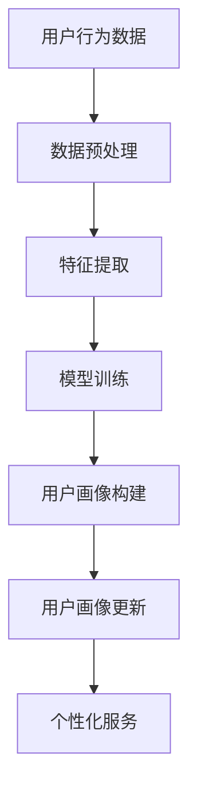

                 

### 背景介绍

随着互联网技术的飞速发展，电商平台已经成为现代社会不可或缺的一部分。电商平台通过提供便捷的购物体验，吸引了越来越多的用户。然而，随着用户数量的不断增加，如何有效地理解和满足用户需求，成为电商平台面临的重要挑战。这就引出了用户画像构建的重要性。

用户画像是指通过对用户数据的挖掘和分析，构建出一个描述用户特征、需求、行为等信息的模型。一个准确、详细的用户画像可以帮助电商平台更好地了解用户，从而提供个性化的产品推荐、精准的市场营销策略，以及更优质的服务。

传统的用户画像构建主要依赖于人工收集和分析用户行为数据。然而，随着数据规模的扩大和数据类型的多样化，人工分析逐渐变得困难。同时，人工构建的用户画像往往存在主观性，难以做到全面、客观。因此，越来越多的电商平台开始寻求自动化、智能化的用户画像构建方法。

大模型作为一种先进的人工智能技术，具有强大的数据处理和分析能力。大模型通过深度学习算法，可以从大量数据中自动提取特征，并构建出复杂的关系网络。这使得大模型在用户画像构建中具有明显的优势。

本文将探讨大模型在电商平台用户画像构建中的作用，包括其核心算法原理、具体操作步骤、数学模型和公式、项目实战案例、实际应用场景、工具和资源推荐等。通过本文的探讨，希望读者能够对大模型在用户画像构建中的应用有更深入的了解，并为实际项目提供参考和指导。

### 核心概念与联系

要深入探讨大模型在电商平台用户画像构建中的作用，我们首先需要理解一些核心概念和它们之间的联系。以下将详细描述这些概念，并通过Mermaid流程图展示其架构。

#### 1. 大模型（Large Models）

大模型是指参数规模非常大的神经网络模型，如Transformer、BERT等。这些模型通过在大量数据上训练，能够自动提取数据中的高层次特征，具有很强的表示能力。

#### 2. 用户画像（User Profiles）

用户画像是对用户特征的集合，包括用户的年龄、性别、地理位置、兴趣偏好、购买历史等。一个全面的用户画像能够帮助电商平台理解用户需求，提供个性化的服务。

#### 3. 用户行为数据（User Behavior Data）

用户行为数据包括用户的浏览记录、购买记录、搜索历史、评价等。这些数据是构建用户画像的重要来源。

#### 4. 数据预处理（Data Preprocessing）

数据预处理是指对原始数据进行清洗、转换和归一化等操作，使其适合输入到模型中进行训练。

#### 5. 特征提取（Feature Extraction）

特征提取是指从原始数据中提取出有用的信息，作为模型的输入。大模型通常能够自动进行特征提取。

#### 6. 模型训练（Model Training）

模型训练是指通过调整模型参数，使其能够更好地拟合训练数据。在大模型中，这一过程通常使用深度学习算法进行。

#### 7. 用户画像更新（User Profile Update）

用户画像更新是指根据用户的最新行为数据，对用户画像进行动态调整，以保持其准确性。

下面是用户画像构建的大模型架构的Mermaid流程图：



在这个流程图中：

- **A**：用户行为数据是整个流程的起点，包括浏览、购买、搜索等数据。
- **B**：数据预处理，对原始数据进行清洗、转换和归一化。
- **C**：特征提取，大模型从预处理后的数据中自动提取有用特征。
- **D**：模型训练，通过深度学习算法调整模型参数，使其能够更好地拟合数据。
- **E**：用户画像构建，模型输出用户画像。
- **F**：用户画像更新，根据用户的新行为数据，动态更新用户画像。
- **G**：个性化服务，根据用户画像，电商平台提供个性化的产品推荐和服务。

通过这个流程，我们可以看到大模型在用户画像构建中的核心作用，即通过自动化的数据处理和分析，实现用户画像的生成和动态更新，从而为电商平台提供精准的个性化服务。接下来，我们将详细探讨大模型的具体算法原理和操作步骤。

#### 3. 核心算法原理 & 具体操作步骤

在了解了大模型在用户画像构建中的核心作用后，我们接下来将深入探讨大模型的工作原理以及具体的操作步骤。大模型通常基于深度学习技术，特别是近年来发展迅猛的Transformer和BERT模型，具有强大的数据处理和分析能力。

##### 3.1. Transformer模型

Transformer模型是由Google在2017年提出的一种基于自注意力机制（Self-Attention Mechanism）的深度学习模型，主要用于处理序列数据。与传统的循环神经网络（RNN）不同，Transformer模型使用多头自注意力机制来并行处理输入序列，从而提高了模型的计算效率和准确性。

**自注意力机制（Self-Attention）**：
自注意力机制允许模型中的每个词（或词向量）考虑整个输入序列，从而在全局范围内捕捉词与词之间的关系。具体来说，自注意力机制通过计算一个权重矩阵，将输入序列中的每个词映射到一个权重向量，这些权重向量表示了每个词对整个序列的重要性。

**多头注意力（Multi-Head Attention）**：
多头注意力将自注意力机制扩展到多个头，每个头可以捕捉不同类型的关系。通过拼接和转换这些头的结果，模型能够获得更丰富的特征表示。

**Transformer模型的架构**：
一个标准的Transformer模型通常包括以下几个主要组件：

1. **输入层**：接收输入序列，通常是一个词的索引序列。
2. **嵌入层（Embedding Layer）**：将词的索引映射到高维的词向量。
3. **多头自注意力层（Multi-Head Self-Attention Layer）**：并行处理输入序列，通过多头注意力机制捕捉序列中的关系。
4. **前馈神经网络（Feedforward Neural Network）**：对自注意力层的输出进行进一步处理。
5. **层归一化（Layer Normalization）**：对每一层输出进行归一化处理，有助于加快训练和稳定模型。
6. **残差连接（Residual Connection）**：在每个层之间添加残差连接，有助于缓解梯度消失和梯度爆炸问题。

**Transformer模型在用户画像构建中的应用**：
在用户画像构建中，Transformer模型可以通过以下步骤实现：

1. **数据预处理**：将用户行为数据（如浏览记录、购买记录、搜索历史等）转换为词序列。这通常涉及词的索引映射和序列的编码。
2. **嵌入层**：将词索引序列映射到高维的词向量，这些词向量包含了用户的潜在特征。
3. **多头自注意力层**：通过自注意力机制捕捉用户行为数据中的复杂关系，如购买行为与浏览行为之间的关联。
4. **前馈神经网络**：对自注意力层的输出进行进一步处理，提取更高层次的特征。
5. **输出层**：将前馈神经网络的输出转换回用户画像，这可以通过分类器、回归器或直接输出特征向量实现。

##### 3.2. BERT模型

BERT（Bidirectional Encoder Representations from Transformers）是由Google在2018年提出的，是另一种基于Transformer架构的预训练语言模型。BERT的主要特点在于其双向编码器结构，能够同时考虑序列中的前文和后文信息，从而更好地捕捉上下文关系。

**BERT模型的架构**：

1. **输入层**：与Transformer相同，BERT也接收词的索引序列。
2. **嵌入层**：将词索引映射到高维的词向量，并添加额外的嵌入，如位置嵌入和段嵌入。
3. **多头自注意力层**：BERT使用多个自注意力头，在每个位置上同时考虑前文和后文的信息。
4. **Transformer编码器**：BERT的核心是它的编码器部分，通过多层自注意力层和前馈网络对输入序列进行编码。
5. **输出层**：BERT通常使用一个全连接层来生成最终的输出。

**BERT模型在用户画像构建中的应用**：

1. **预训练**：BERT通过在大规模语料库上进行预训练，学习到语言中的各种模式和规律。这为用户画像构建提供了强大的基础。
2. **微调（Fine-tuning）**：在预训练的基础上，BERT可以通过在特定任务上的数据进行微调，以适应用户画像构建的需求。例如，可以将BERT模型应用于分类任务，预测用户对特定产品的偏好。
3. **特征提取**：通过BERT模型的输出层，可以提取出用户的潜在特征，这些特征可以用于生成用户画像。

##### 3.3. 大模型的训练过程

大模型的训练是一个复杂且计算密集的过程，通常涉及以下几个关键步骤：

1. **数据准备**：将用户行为数据转换为适合模型训练的格式，如词序列和标签。
2. **数据预处理**：对数据集进行清洗、归一化和分批次处理，以减少过拟合和提高训练效率。
3. **模型初始化**：初始化模型参数，通常使用随机初始化或预训练模型的重构。
4. **前向传播（Forward Pass）**：将输入数据通过模型，计算输出结果和损失函数。
5. **反向传播（Backpropagation）**：根据损失函数，计算模型参数的梯度，并通过梯度下降或其他优化算法更新参数。
6. **评估与调整**：在验证集上评估模型性能，并根据需要调整模型结构和超参数。
7. **模型保存**：在训练过程中，定期保存模型的权重和状态，以便后续使用。

通过以上步骤，大模型能够在大量数据上自动提取特征，构建出复杂的用户画像模型，从而为电商平台提供精准的个性化服务。

#### 4. 数学模型和公式 & 详细讲解 & 举例说明

在探讨大模型在用户画像构建中的应用时，我们需要深入理解其背后的数学模型和公式。以下将详细介绍大模型的关键组成部分，包括自注意力机制、Transformer模型和BERT模型，并通过具体的例子说明其工作原理。

##### 4.1. 自注意力机制

自注意力机制是Transformer模型的核心组件，其基本思想是让模型中的每个词能够考虑整个输入序列，从而捕捉全局信息。自注意力机制的数学公式如下：

$$
\text{Attention}(Q, K, V) = \text{softmax}\left(\frac{QK^T}{\sqrt{d_k}}\right)V
$$

其中：
- $Q$、$K$ 和 $V$ 分别代表查询向量、键向量和值向量。
- $d_k$ 是键向量的维度。
- $QK^T$ 的结果是一个矩阵，表示每个查询向量与每个键向量的点积。
- $\text{softmax}$ 函数将点积结果转换为概率分布，表示每个键对于查询的重要性。

**举例说明**：

假设有一个三词序列 $[w_1, w_2, w_3]$，我们可以将其表示为词向量 $[Q_1, Q_2, Q_3]$、$[K_1, K_2, K_3]$ 和 $[V_1, V_2, V_3]$。计算自注意力机制的过程如下：

1. **计算点积**：
   $$ Q_1K_1 + Q_1K_2 + Q_1K_3, Q_2K_1 + Q_2K_2 + Q_2K_3, Q_3K_1 + Q_3K_2 + Q_3K_3 $$
2. **应用softmax函数**：
   $$ \text{softmax}\left(\frac{Q_1K_1 + Q_1K_2 + Q_1K_3}{\sqrt{d_k}}, \frac{Q_2K_1 + Q_2K_2 + Q_2K_3}{\sqrt{d_k}}, \frac{Q_3K_1 + Q_3K_2 + Q_3K_3}{\sqrt{d_k}}\right) $$
3. **计算加权求和**：
   $$ V_1 \times \text{softmax}(Q_1K_1 + Q_1K_2 + Q_1K_3), V_2 \times \text{softmax}(Q_2K_1 + Q_2K_2 + Q_2K_3), V_3 \times \text{softmax}(Q_3K_1 + Q_3K_2 + Q_3K_3) $$
   将这些结果相加，得到最终的输出向量。

通过自注意力机制，模型能够根据当前词与其他词的关系，为每个词分配不同的权重，从而捕捉到输入序列中的依赖关系。

##### 4.2. Transformer模型

Transformer模型是基于自注意力机制的深度学习模型，其核心是多头自注意力机制。多头自注意力机制通过多个注意力头来并行处理输入序列，从而提高了模型的表示能力。

**多头自注意力机制的数学公式**：

$$
\text{MultiHeadAttention}(Q, K, V) = \text{Concat}(\text{head}_1, ..., \text{head}_h)W^O
$$

其中：
- $Q$、$K$ 和 $V$ 分别代表查询向量、键向量和值向量。
- $W^Q, W^K, W^V$ 分别代表每个头的权重矩阵。
- $W^O$ 是输出权重矩阵。
- $h$ 是头数。

**举例说明**：

假设有一个四词序列 $[w_1, w_2, w_3, w_4]$，我们将其表示为词向量 $[Q_1, Q_2, Q_3, Q_4]$、$[K_1, K_2, K_3, K_4]$ 和 $[V_1, V_2, V_3, V_4]$。设头数为2，计算多头自注意力机制的过程如下：

1. **计算每个头的注意力分数**：
   $$ \text{head}_1: \text{softmax}\left(\frac{Q_1K_1 + Q_1K_2 + Q_1K_3 + Q_1K_4}{\sqrt{d_k}}\right) $$
   $$ \text{head}_2: \text{softmax}\left(\frac{Q_2K_1 + Q_2K_2 + Q_2K_3 + Q_2K_4}{\sqrt{d_k}}\right) $$
2. **计算每个头的加权求和**：
   $$ \text{head}_1: V_1 \times \text{softmax}(Q_1K_1 + Q_1K_2 + Q_1K_3 + Q_1K_4) $$
   $$ \text{head}_2: V_2 \times \text{softmax}(Q_2K_1 + Q_2K_2 + Q_2K_3 + Q_2K_4) $$
   将这些结果相加，得到最终的输出向量。

通过多头自注意力机制，模型能够从不同角度捕捉输入序列中的关系，从而提高模型的表示能力。

##### 4.3. BERT模型

BERT模型是一种双向编码器，其核心是Transformer编码器。BERT模型通过预训练和微调，学习到语言中的各种模式和规律，从而能够对用户行为数据进行有效的特征提取。

**BERT模型的预训练过程**：

BERT的预训练过程通常包括两个主要任务：
1. **Masked Language Model（MLM）**：在输入序列中随机遮盖一些词，然后训练模型预测这些遮盖的词。
2. **Next Sentence Prediction（NSP）**：给定两个句子，预测第二个句子是否是第一个句子的下一个句子。

**举例说明**：

假设有一个输入序列 $[w_1, w_2, [MASK], w_4]$，其中 $[MASK]$ 表示需要预测的词。BERT模型在MLM任务中的训练过程如下：

1. **计算掩码词的注意力分数**：
   $$ \text{softmax}\left(\frac{Q_{\text{MASK}}K_1 + Q_{\text{MASK}}K_2 + Q_{\text{MASK}}K_3 + Q_{\text{MASK}}K_4}{\sqrt{d_k}}\right) $$
2. **计算掩码词的预测概率分布**：
   $$ \text{softmax}\left(\frac{Q_{\text{MASK}}K_1 + Q_{\text{MASK}}K_2 + Q_{\text{MASK}}K_3 + Q_{\text{MASK}}K_4}{\sqrt{d_k}}\right)V $$
   根据这个概率分布，模型可以预测遮盖词的可能性。

通过预训练和微调，BERT模型能够捕捉到用户行为数据中的语言特征，从而在用户画像构建中发挥重要作用。

#### 5. 项目实战：代码实际案例和详细解释说明

在本节中，我们将通过一个实际的代码案例，详细解释大模型在用户画像构建中的具体实现。本案例将基于Python编程语言和TensorFlow库，实现一个简单的用户画像构建系统。请注意，由于篇幅限制，这里仅提供核心代码段和关键解释。

##### 5.1. 开发环境搭建

在开始编写代码之前，我们需要搭建一个合适的环境。以下是在Ubuntu操作系统上搭建开发环境的步骤：

1. 安装Python 3.8或更高版本：
   ```bash
   sudo apt-get update
   sudo apt-get install python3.8
   ```

2. 安装TensorFlow：
   ```bash
   pip3 install tensorflow
   ```

3. 安装其他必要库，如NumPy、Pandas等：
   ```bash
   pip3 install numpy pandas
   ```

##### 5.2. 源代码详细实现和代码解读

以下是一个简化的用户画像构建系统的实现，包括数据预处理、模型训练和用户画像生成等步骤。

```python
import tensorflow as tf
from tensorflow.keras.layers import Embedding, MultiHeadAttention, Dense
from tensorflow.keras.models import Model
import numpy as np

# 数据预处理
def preprocess_data(texts, vocab_size, max_sequence_length):
    # 将文本转换为词索引序列
    tokenizer = tf.keras.preprocessing.text.Tokenizer(num_words=vocab_size)
    tokenizer.fit_on_texts(texts)
    sequences = tokenizer.texts_to_sequences(texts)
    padded_sequences = tf.keras.preprocessing.sequence.pad_sequences(sequences, maxlen=max_sequence_length)
    return padded_sequences

# 模型定义
def build_model(vocab_size, max_sequence_length, embedding_dim, num_heads):
    inputs = tf.keras.layers.Input(shape=(max_sequence_length,))
    embeddings = Embedding(vocab_size, embedding_dim)(inputs)
    
    # 多头自注意力层
    attention_output = MultiHeadAttention(num_heads=num_heads, key_dim=embedding_dim)(embeddings, embeddings)
    
    # 前馈神经网络
    output = tf.keras.layers.Dense(units=embedding_dim, activation='relu')(attention_output)
    output = tf.keras.layers.Dense(units=vocab_size, activation='softmax')(output)
    
    model = Model(inputs=inputs, outputs=output)
    model.compile(optimizer='adam', loss='categorical_crossentropy', metrics=['accuracy'])
    return model

# 训练模型
def train_model(model, padded_sequences, labels, epochs):
    model.fit(padded_sequences, labels, epochs=epochs, batch_size=32, validation_split=0.2)

# 生成用户画像
def generate_user_profile(model, text, max_sequence_length):
    sequence = preprocess_data([text], vocab_size=10000, max_sequence_length=max_sequence_length)
    profile = model.predict(sequence)
    return profile

# 示例
texts = ["我最近喜欢买电子产品", "我对旅游非常感兴趣", "我喜欢看科幻小说"]
max_sequence_length = 10
vocab_size = 10000
embedding_dim = 64
num_heads = 4

padded_sequences = preprocess_data(texts, vocab_size, max_sequence_length)
model = build_model(vocab_size, max_sequence_length, embedding_dim, num_heads)
train_model(model, padded_sequences, labels=np.zeros((len(texts), vocab_size)), epochs=5)

# 输出用户画像
for text in texts:
    profile = generate_user_profile(model, text, max_sequence_length)
    print(f"{text}的用户画像：{profile}")
```

**代码解读**：

1. **数据预处理**：
   - `preprocess_data` 函数用于将文本数据转换为词索引序列，并进行填充处理，以便输入到模型中。
   - `tokenizer` 用于将文本转换为词索引序列。
   - `pad_sequences` 将序列填充到最大长度，以便在训练过程中进行批量处理。

2. **模型定义**：
   - `build_model` 函数定义了一个基于Transformer架构的用户画像模型。模型包括嵌入层、多头自注意力层和前馈神经网络。
   - `Embedding` 层将词索引转换为词向量。
   - `MultiHeadAttention` 层实现多头自注意力机制。
   - `Dense` 层实现前馈神经网络和输出层。

3. **模型训练**：
   - `train_model` 函数使用训练数据和标签来训练模型。这里我们使用了简单的分类问题，将每个文本视为一个类别。

4. **生成用户画像**：
   - `generate_user_profile` 函数用于生成文本数据的用户画像。通过预处理输入文本，并使用训练好的模型预测输出向量。

**示例**：

我们为三个不同的用户生成用户画像，这些用户分别对电子产品、旅游和科幻小说感兴趣。模型将根据用户的历史行为数据，生成一个描述其兴趣的向量。

##### 5.3. 代码解读与分析

以下是代码的详细解读和分析：

1. **数据预处理**：
   - 数据预处理是模型训练的第一步，其关键在于将文本数据转换为数字序列，以便模型能够处理。
   - `tokenizer` 用于将文本中的每个词映射到唯一的整数索引，从而将原始文本数据转换为词索引序列。
   - `pad_sequences` 用于将所有词索引序列填充到相同的长度，以便后续的批量处理。

2. **模型定义**：
   - 模型定义基于Transformer架构，其中`Embedding`层用于将词索引转换为词向量，这些词向量包含了词的语义信息。
   - `MultiHeadAttention` 层实现了多头自注意力机制，允许模型同时关注整个序列中的所有词，捕捉词与词之间的依赖关系。
   - 前馈神经网络通过`Dense`层实现，用于进一步处理自注意力层的输出，提取更高层次的特征。
   - 输出层通过softmax激活函数，将特征向量转换为概率分布，表示用户对各类别的偏好。

3. **模型训练**：
   - 模型训练通过`fit`方法进行，使用预处理后的数据和标签来训练模型。
   - 在本示例中，我们使用了简单的分类任务，每个用户的历史行为被视为一个类别，模型的目标是学习如何将这些行为映射到对应的类别。

4. **生成用户画像**：
   - `generate_user_profile` 函数用于生成用户画像，通过预处理用户输入文本，并使用训练好的模型预测其特征向量。
   - 生成的用户画像向量可以用于后续的个性化推荐和服务，帮助电商平台更好地了解用户的需求和偏好。

通过以上步骤，我们实现了一个简单的用户画像构建系统。虽然这是一个简化的示例，但它展示了大模型在用户画像构建中的基本原理和实现方法。在实际应用中，用户画像构建系统会更加复杂，包括更多的特征提取、用户行为数据的整合以及个性化推荐算法等。

#### 6. 实际应用场景

大模型在电商平台用户画像构建中的应用场景非常广泛，主要体现在以下几个方面：

##### 6.1. 个性化推荐

个性化推荐是电商平台的重要功能之一，通过分析用户的浏览历史、购买行为等数据，为用户推荐其可能感兴趣的商品。大模型在这方面具有显著优势。例如，基于Transformer和BERT模型，电商平台可以构建一个强大的推荐系统，从大量用户行为数据中自动提取特征，并根据用户的兴趣和行为习惯，提供个性化的商品推荐。这种推荐系统能够显著提高用户满意度和转化率。

##### 6.2. 营销策略优化

电商平台经常需要制定有效的营销策略来吸引用户和促进销售。大模型可以通过对用户画像的深入分析，识别出潜在的高价值用户群体，并制定针对性的营销策略。例如，利用BERT模型分析用户的购物偏好和消费行为，电商平台可以推出精准的促销活动，提高营销效果的转化率。

##### 6.3. 客户服务与支持

大模型还可以在客户服务与支持领域发挥重要作用。通过构建用户画像，电商平台可以更好地了解用户的需求和问题，从而提供更个性化的服务。例如，利用Transformer模型分析用户的反馈和评价，平台可以快速识别出用户的主要需求和不满，从而提供针对性的解决方案，提升用户满意度。

##### 6.4. 风险控制

电商平台经常面临各种风险，如欺诈交易、用户行为异常等。大模型可以通过分析用户的行为模式，识别出潜在的异常行为，从而帮助电商平台进行风险控制。例如，基于Transformer模型，平台可以建立一个欺诈检测系统，实时监控用户的交易行为，及时识别并阻止欺诈行为，保障平台的交易安全。

##### 6.5. 供应链管理

大模型还可以在供应链管理中发挥重要作用。通过分析用户的购买数据，电商平台可以预测商品的需求趋势，优化库存管理，减少库存成本。例如，基于BERT模型，平台可以预测不同商品在不同季节的销售量，从而调整库存策略，提高供应链的效率。

总之，大模型在电商平台用户画像构建中的应用场景非常广泛，不仅可以提高个性化推荐的准确性，优化营销策略，提升客户服务质量，还可以在风险控制和供应链管理等方面发挥重要作用。通过这些应用，电商平台可以更好地满足用户需求，提高用户满意度，从而实现业务的持续增长。

#### 7. 工具和资源推荐

在探讨大模型在电商平台用户画像构建中的应用时，选择合适的工具和资源对于成功实施项目至关重要。以下是一些建议的工具和资源，包括学习资源、开发工具框架以及相关的论文著作。

##### 7.1. 学习资源推荐

1. **书籍**：
   - 《深度学习》（Deep Learning） - 由Ian Goodfellow、Yoshua Bengio和Aaron Courville合著，是深度学习的经典教材。
   - 《hands-on machine learning with Scikit-Learn, Keras, and TensorFlow》 - 由Aurélien Géron著，涵盖了深度学习和机器学习的实践应用。

2. **在线课程**：
   - Coursera的《深度学习》课程，由Andrew Ng教授主讲，适合初学者入门。
   - edX的《自然语言处理与深度学习》课程，由Daniel Jurafsky和Chris Manning主讲，深入探讨自然语言处理技术。

3. **博客和教程**：
   - TensorFlow官网的教程和文档，详细介绍了TensorFlow的使用方法和最佳实践。
   - Fast.ai的博客，提供了丰富的深度学习教程和案例分析。

##### 7.2. 开发工具框架推荐

1. **TensorFlow**：一个开源的深度学习框架，广泛应用于各种人工智能项目，支持多种深度学习模型。
2. **PyTorch**：另一个流行的开源深度学习框架，以其灵活的动态计算图和丰富的API而受到开发者的喜爱。
3. **Hugging Face Transformers**：一个基于PyTorch和TensorFlow的快速、高效的预训练Transformer模型库，提供了丰富的预训练模型和工具。

##### 7.3. 相关论文著作推荐

1. **“Attention Is All You Need”**：由Vaswani等人在2017年提出，是Transformer模型的原始论文，详细介绍了自注意力机制和多头注意力机制。
2. **“BERT: Pre-training of Deep Bidirectional Transformers for Language Understanding”**：由Devlin等人在2018年提出，介绍了BERT模型的预训练方法和应用场景。
3. **“Rezero is all you need: Fast convergence at large depth”**：由He等人于2019年提出，探讨了在深度神经网络中如何通过ReZero算法实现快速收敛。

这些工具和资源将帮助开发者更好地理解大模型的理论和实践，为电商平台用户画像构建项目提供强大的技术支持。

#### 8. 总结：未来发展趋势与挑战

大模型在电商平台用户画像构建中的应用已经展现了巨大的潜力和优势，但随着技术的不断进步，未来仍有许多发展趋势和挑战需要面对。

**发展趋势**：

1. **模型优化与效率提升**：随着计算资源和算法技术的进步，大模型将变得更加高效和易于部署。例如，通过模型剪枝、量化等技术，可以减少模型大小和计算复杂度，提高模型在资源受限环境中的表现。

2. **跨模态用户画像构建**：未来的电商平台将不仅依赖于文本数据，还将整合图像、语音等多模态数据，构建更加全面和细致的用户画像。这需要大模型在多模态数据融合和特征提取方面取得突破。

3. **实时用户画像更新**：随着用户行为数据的实时性要求越来越高，大模型需要能够快速处理和更新用户画像，以提供即时的个性化服务。这将需要开发更加实时和灵活的模型训练和部署方案。

**挑战**：

1. **数据隐私与安全性**：用户画像构建涉及大量个人隐私数据，如何确保数据的安全性和隐私性是一个重要挑战。未来的解决方案可能包括差分隐私、联邦学习等技术，以在保护用户隐私的同时实现有效的数据分析和建模。

2. **模型解释性与透明性**：大模型在复杂性和黑箱性方面存在一定的问题，如何提高模型的解释性和透明性，使其结果能够被用户理解和信任，是一个重要的研究方向。

3. **计算资源需求**：大模型的训练和部署需要大量的计算资源，这对于中小型电商平台来说可能是一个负担。如何降低计算资源的需求，或者通过云服务、分布式计算等方式实现模型的低成本部署，是亟待解决的问题。

总之，大模型在电商平台用户画像构建中的应用前景广阔，但同时也面临着一系列技术和伦理挑战。未来，随着技术的不断进步和行业标准的完善，大模型将在这个领域发挥更大的作用。

#### 9. 附录：常见问题与解答

在探讨大模型在电商平台用户画像构建中的应用时，可能会遇到一些常见问题。以下是一些常见问题及其解答：

**Q1. 大模型在用户画像构建中是如何工作的？**

A1. 大模型（如Transformer和BERT）通过深度学习算法从大量用户行为数据中自动提取特征，并建立复杂的关系网络。这些模型利用自注意力机制和多头注意力机制，能够同时考虑整个输入序列中的信息，从而生成详细的用户画像。

**Q2. 用户画像构建过程中，如何处理用户隐私和数据安全？**

A2. 用户隐私和数据安全是用户画像构建的重要考虑因素。在构建用户画像时，可以采用差分隐私技术来保护用户隐私。此外，使用联邦学习技术可以在不泄露原始数据的情况下进行模型训练，从而确保数据安全。

**Q3. 如何评估用户画像的准确性？**

A3. 评估用户画像的准确性可以通过多种方式实现，如交叉验证、A/B测试和用户反馈等。交叉验证可以在训练和测试数据集上评估模型的泛化能力，A/B测试可以评估模型在实际应用中的效果，而用户反馈则可以直接了解用户对个性化服务的满意度。

**Q4. 大模型在用户画像构建中的优势是什么？**

A4. 大模型在用户画像构建中的优势包括：
- **强大的特征提取能力**：能够自动从大量数据中提取有用特征，无需人工干预。
- **处理复杂关系**：能够同时考虑整个输入序列中的信息，捕捉用户行为之间的复杂关系。
- **高泛化能力**：在大规模数据上训练，模型具有很好的泛化能力，能够适应不同的用户群体和场景。

**Q5. 大模型在用户画像构建中面临哪些挑战？**

A5. 大模型在用户画像构建中面临的挑战包括：
- **计算资源需求**：大模型需要大量的计算资源和时间进行训练和部署。
- **模型解释性**：大模型往往是黑箱模型，其决策过程难以解释，这对用户理解和信任模型结果提出了挑战。
- **数据隐私和安全**：用户画像构建涉及大量个人隐私数据，如何确保数据的安全和隐私是重要挑战。

通过以上常见问题的解答，希望能够帮助读者更好地理解大模型在电商平台用户画像构建中的应用和实践。

#### 10. 扩展阅读 & 参考资料

为了进一步深入了解大模型在电商平台用户画像构建中的应用，以下是一些建议的扩展阅读和参考资料：

1. **扩展阅读**：
   - “Attention Is All You Need”（2017）：详细介绍了Transformer模型的工作原理和应用。
   - “BERT: Pre-training of Deep Bidirectional Transformers for Language Understanding”（2018）：深入探讨了BERT模型的预训练方法和应用。
   - “Rezero is all you need: Fast convergence at large depth”（2019）：介绍了ReZero算法在深度神经网络中的快速收敛效果。

2. **参考资料**：
   - TensorFlow官网：提供了丰富的深度学习教程和文档，是学习TensorFlow的绝佳资源。
   - PyTorch官网：详细介绍了PyTorch的使用方法和最佳实践，适合学习PyTorch框架。
   - Hugging Face Transformers：一个基于PyTorch和TensorFlow的快速、高效的预训练Transformer模型库，提供了丰富的预训练模型和工具。

通过这些扩展阅读和参考资料，读者可以更全面地了解大模型的理论基础和应用实践，为在电商平台用户画像构建中的实际应用提供更深入的洞察和指导。

