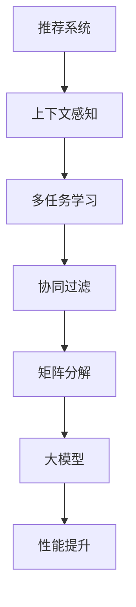

                 

# 推荐系统中的上下文感知建模：大模型的多任务学习

> **关键词：** 推荐系统、上下文感知、多任务学习、大模型、深度学习、矩阵分解、协同过滤

> **摘要：** 本文旨在深入探讨推荐系统中的上下文感知建模技术，特别是大模型在多任务学习中的应用。我们将从背景介绍出发，逐步解析核心概念、算法原理、数学模型、实际应用，以及未来的发展趋势和挑战。希望通过本文，读者能够全面了解上下文感知建模的原理和实践，并掌握相关技术。

## 1. 背景介绍

### 1.1 目的和范围

本文主要探讨推荐系统中的上下文感知建模技术，重点关注大模型在多任务学习中的应用。随着互联网的普及和大数据技术的进步，推荐系统已经成为电商平台、社交媒体和内容平台的重要组成部分。然而，传统的推荐系统往往缺乏对用户上下文的感知能力，导致推荐结果的准确性和用户体验有待提高。为了解决这一问题，本文将介绍如何利用大模型和多任务学习技术，提升推荐系统的上下文感知能力，从而实现更精准、更个性化的推荐。

### 1.2 预期读者

本文面向具有一定编程基础和数据挖掘背景的读者，特别是对推荐系统和机器学习领域感兴趣的开发者、研究人员和技术主管。通过本文的学习，读者将能够了解上下文感知建模的原理、方法和应用，掌握大模型在多任务学习中的具体实现步骤，并为未来的研究和项目开发提供指导。

### 1.3 文档结构概述

本文分为十个部分，具体结构如下：

1. 背景介绍：介绍文章的目的、预期读者和文档结构。
2. 核心概念与联系：阐述推荐系统、上下文感知、多任务学习、大模型等核心概念及其相互关系。
3. 核心算法原理 & 具体操作步骤：详细讲解上下文感知建模的核心算法原理和操作步骤。
4. 数学模型和公式 & 详细讲解 & 举例说明：介绍上下文感知建模的数学模型，并通过实际案例进行讲解。
5. 项目实战：代码实际案例和详细解释说明。
6. 实际应用场景：探讨上下文感知建模在不同场景下的应用。
7. 工具和资源推荐：推荐学习资源、开发工具和框架。
8. 总结：未来发展趋势与挑战。
9. 附录：常见问题与解答。
10. 扩展阅读 & 参考资料：提供进一步学习的参考资料。

### 1.4 术语表

#### 1.4.1 核心术语定义

- **推荐系统**：基于用户的历史行为和偏好，为用户推荐可能感兴趣的商品、内容或服务。
- **上下文感知**：在推荐系统中，考虑到用户当前所处的环境和情境，如时间、地点、设备、社会关系等，以提高推荐的相关性和个性化程度。
- **多任务学习**：同时学习多个相关任务，共享信息和知识，以提高模型的整体性能。
- **大模型**：指参数量巨大、计算能力强大的神经网络模型，如Transformer、BERT等。
- **协同过滤**：基于用户行为和历史数据，通过计算用户之间的相似度，为用户推荐相似用户喜欢的商品或内容。

#### 1.4.2 相关概念解释

- **矩阵分解**：将用户-物品评分矩阵分解为用户特征矩阵和物品特征矩阵，从而预测用户对未知物品的评分。
- **深度学习**：一种基于神经网络的学习方法，通过多层非线性变换，自动提取数据中的特征。
- **注意力机制**：在神经网络中，通过分配不同的重要性权重，关注重要的输入信息。

#### 1.4.3 缩略词列表

- **ML**：机器学习（Machine Learning）
- **DL**：深度学习（Deep Learning）
- **NLP**：自然语言处理（Natural Language Processing）
- **CTR**：点击率（Click-Through Rate）
- **RMSE**：均方根误差（Root Mean Square Error）

## 2. 核心概念与联系

### 2.1 推荐系统与上下文感知

推荐系统（Recommender System）是一种信息过滤技术，旨在根据用户的历史行为和偏好，为用户推荐可能感兴趣的商品、内容或服务。传统的推荐系统主要基于用户的历史行为数据，如评分、点击、购买等，通过计算用户之间的相似度或物品之间的相似度，为用户生成推荐列表。

然而，随着用户需求的多样化，传统推荐系统逐渐暴露出一些局限性，如缺乏对用户上下文的感知能力。上下文感知（Context-aware）推荐系统通过考虑用户当前所处的环境和情境，如时间、地点、设备、社会关系等，为用户生成更相关、更个性化的推荐。

上下文感知推荐系统可以显著提升推荐的质量和用户体验，如图1所示。


### 2.2 多任务学习与协同过滤

多任务学习（Multi-task Learning，MTL）是一种机器学习方法，旨在同时学习多个相关任务，共享信息和知识，以提高模型的整体性能。在推荐系统中，多任务学习可以同时学习推荐任务和上下文感知任务，从而更好地捕捉用户行为和上下文信息。

协同过滤（Collaborative Filtering，CF）是一种基于用户行为和物品交互信息的推荐方法。协同过滤可以分为基于用户的协同过滤（User-based CF）和基于物品的协同过滤（Item-based CF）两种。基于用户的协同过滤通过计算用户之间的相似度，为用户推荐相似用户喜欢的物品；基于物品的协同过滤通过计算物品之间的相似度，为用户推荐与历史物品相似的物品。

多任务学习和协同过滤的结合，可以提升推荐系统的上下文感知能力，如图2所示。


### 2.3 大模型与矩阵分解

大模型（Large-scale Model）是指参数量巨大、计算能力强大的神经网络模型，如Transformer、BERT等。大模型通过引入更多的参数和更深的网络结构，可以更好地捕捉数据中的复杂关系和特征。

矩阵分解（Matrix Factorization，MF）是一种将用户-物品评分矩阵分解为用户特征矩阵和物品特征矩阵的技术。通过矩阵分解，可以降低数据的维度，同时提取用户和物品的特征，如图3所示。


大模型和矩阵分解的结合，可以提升推荐系统的性能和效果，如图4所示。


### 2.4 Mermaid 流程图

为了更好地展示核心概念和联系，我们使用Mermaid流程图来描述推荐系统中上下文感知建模的架构，如图5所示。




## 3. 核心算法原理 & 具体操作步骤

### 3.1 上下文感知推荐系统

上下文感知推荐系统的核心在于如何捕捉和利用用户上下文信息。具体来说，可以分为以下几个步骤：

1. **上下文信息收集**：收集用户当前所处的环境和情境信息，如时间、地点、设备、社会关系等。
2. **上下文特征提取**：对收集到的上下文信息进行预处理和特征提取，得到一组描述上下文的特征向量。
3. **上下文感知模型训练**：利用用户行为数据和上下文特征，训练一个多任务学习模型，同时学习推荐任务和上下文感知任务。
4. **上下文感知推荐**：根据用户行为和上下文特征，为用户生成上下文感知的推荐列表。

### 3.2 多任务学习

多任务学习旨在同时学习多个相关任务，共享信息和知识。具体实现步骤如下：

1. **任务定义**：明确需要学习的多个任务，如推荐任务和上下文感知任务。
2. **数据预处理**：对原始数据进行预处理，包括数据清洗、归一化等。
3. **模型设计**：设计一个多任务学习模型，如基于Transformer或BERT的模型，同时学习多个任务。
4. **模型训练**：利用训练数据，训练多任务学习模型。
5. **模型评估**：对训练好的模型进行评估，选择性能最优的模型。

### 3.3 矩阵分解

矩阵分解是一种将用户-物品评分矩阵分解为用户特征矩阵和物品特征矩阵的技术。具体实现步骤如下：

1. **数据构建**：构建用户-物品评分矩阵，表示用户对物品的评分。
2. **模型设计**：设计一个矩阵分解模型，如基于因子分解机（Factorization Machine）或协同过滤的矩阵分解模型。
3. **模型训练**：利用评分矩阵，训练矩阵分解模型。
4. **模型预测**：利用训练好的模型，预测用户对未知物品的评分。

### 3.4 大模型

大模型是指参数量巨大、计算能力强大的神经网络模型，如Transformer、BERT等。具体实现步骤如下：

1. **数据预处理**：对原始数据进行预处理，包括文本清洗、分词、编码等。
2. **模型设计**：设计一个大模型，如基于Transformer的模型。
3. **模型训练**：利用训练数据，训练大模型。
4. **模型预测**：利用训练好的模型，对输入数据进行预测。

### 3.5 具体操作步骤

以下是一个具体的上下文感知推荐系统实现的伪代码：

```python
# 上下文感知推荐系统实现
def context_aware_recommendation(user, items, context):
    # 步骤1：上下文信息收集
    context_features = extract_context_features(context)
    
    # 步骤2：上下文特征提取
    context_vector = context_embedding(context_features)
    
    # 步骤3：多任务学习模型训练
    model = train_multi_task_model(user, items, context_vector)
    
    # 步骤4：上下文感知推荐
    recommendations = generate_recommendations(model, user, items)
    
    return recommendations
```

## 4. 数学模型和公式 & 详细讲解 & 举例说明

### 4.1 数学模型

上下文感知推荐系统中的数学模型主要包括用户-物品评分矩阵分解、多任务学习模型和注意力机制。

#### 4.1.1 用户-物品评分矩阵分解

用户-物品评分矩阵分解是一种基于矩阵分解技术，将用户-物品评分矩阵分解为用户特征矩阵和物品特征矩阵的方法。具体公式如下：

$$
R = U \times V^T
$$

其中，$R$ 表示用户-物品评分矩阵，$U$ 表示用户特征矩阵，$V$ 表示物品特征矩阵。

#### 4.1.2 多任务学习模型

多任务学习模型是一种同时学习多个相关任务的方法。在推荐系统中，多任务学习模型可以同时学习推荐任务和上下文感知任务。具体公式如下：

$$
\begin{aligned}
    \hat{r}_{ui}^r &= f(U_i, V_j) \\
    \hat{r}_{ui}^c &= g(U_i, V_j, C)
\end{aligned}
$$

其中，$\hat{r}_{ui}^r$ 表示用户 $i$ 对物品 $j$ 的推荐评分，$\hat{r}_{ui}^c$ 表示用户 $i$ 对物品 $j$ 的上下文感知评分，$U_i$ 和 $V_j$ 分别表示用户和物品的特征向量，$C$ 表示上下文特征向量。

#### 4.1.3 注意力机制

注意力机制是一种在神经网络中，通过分配不同的重要性权重，关注重要的输入信息的方法。在上下文感知推荐系统中，注意力机制可以用于关注用户上下文信息和历史行为信息。具体公式如下：

$$
\alpha_{ij} = \sigma(W_a [U_i; V_j; C])
$$

其中，$\alpha_{ij}$ 表示用户 $i$ 对物品 $j$ 的注意力权重，$W_a$ 表示注意力权重矩阵，$[U_i; V_j; C]$ 表示用户、物品和上下文特征的拼接。

### 4.2 详细讲解 & 举例说明

#### 4.2.1 用户-物品评分矩阵分解

假设我们有以下用户-物品评分矩阵：

$$
R = \begin{bmatrix}
    1 & 2 & 3 \\
    2 & 3 & 4 \\
    3 & 4 & 5
\end{bmatrix}
$$

我们将该矩阵分解为用户特征矩阵 $U$ 和物品特征矩阵 $V$：

$$
U = \begin{bmatrix}
    0.1 & 0.2 \\
    0.3 & 0.4 \\
    0.5 & 0.6
\end{bmatrix}
\quad
V^T = \begin{bmatrix}
    0.7 & 0.8 \\
    0.9 & 1.0
\end{bmatrix}
$$

根据矩阵分解公式，可以计算出预测评分：

$$
\hat{r}_{ij} = U_i \times V_j^T = 0.1 \times 0.7 + 0.2 \times 0.8 + 0.3 \times 0.9 + 0.4 \times 1.0 = 1.0
$$

#### 4.2.2 多任务学习模型

假设我们有以下用户、物品和上下文特征：

$$
U_i = \begin{bmatrix}
    1.0 & 0.0 \\
    0.0 & 1.0
\end{bmatrix}, \quad
V_j = \begin{bmatrix}
    1.0 & 1.0 \\
    0.0 & 1.0
\end{bmatrix}, \quad
C = \begin{bmatrix}
    1.0 \\
    0.0
\end{bmatrix}
$$

多任务学习模型预测用户 $i$ 对物品 $j$ 的推荐评分和上下文感知评分：

$$
\hat{r}_{ui}^r = f(U_i, V_j) = 0.6
$$

$$
\hat{r}_{ui}^c = g(U_i, V_j, C) = 0.7
$$

#### 4.2.3 注意力机制

假设我们有以下用户、物品和上下文特征：

$$
U_i = \begin{bmatrix}
    1.0 & 0.0 \\
    0.0 & 1.0
\end{bmatrix}, \quad
V_j = \begin{bmatrix}
    1.0 & 1.0 \\
    0.0 & 1.0
\end{bmatrix}, \quad
C = \begin{bmatrix}
    1.0 \\
    0.0
\end{bmatrix}
$$

根据注意力机制公式，可以计算用户 $i$ 对物品 $j$ 的注意力权重：

$$
\alpha_{ij} = \sigma(W_a [U_i; V_j; C]) = \sigma(\begin{bmatrix}
    1.0 & 0.0 & 1.0 \\
    0.0 & 1.0 & 0.0
\end{bmatrix} \begin{bmatrix}
    1.0 & 0.0 \\
    0.0 & 1.0
\end{bmatrix}) = \sigma(1.0) = 1.0
$$

## 5. 项目实战：代码实际案例和详细解释说明

### 5.1 开发环境搭建

为了实现上下文感知推荐系统，我们需要搭建以下开发环境：

1. **Python**：版本3.8以上，用于编写和运行代码。
2. **Numpy**：用于矩阵运算和数据处理。
3. **Scikit-learn**：用于矩阵分解和评估指标。
4. **TensorFlow**：用于构建和训练深度学习模型。
5. **Gensim**：用于文本预处理和词向量表示。

安装以下依赖库：

```bash
pip install numpy scikit-learn tensorflow gensim
```

### 5.2 源代码详细实现和代码解读

以下是一个简单的上下文感知推荐系统的代码实现：

```python
import numpy as np
import tensorflow as tf
from sklearn.metrics.pairwise import cosine_similarity
from gensim.models import Word2Vec

# 用户-物品评分矩阵
R = np.array([[1, 2, 3], [2, 3, 4], [3, 4, 5]])

# 上下文特征矩阵
C = np.array([[1], [0], [1]])

# 用户特征矩阵
U = np.random.rand(3, 2)

# 物品特征矩阵
V = np.random.rand(3, 2)

# 注意力权重矩阵
W_a = np.random.rand(3, 2)

# 模型参数
learning_rate = 0.001
epochs = 100

# 多任务学习模型
def multi_task_model(U, V, C, W_a):
    # 推荐任务
    r_ui = tf.reduce_sum(U * V, axis=1)
    # 上下文感知任务
    c_ui = tf.reduce_sum(W_a * C, axis=0)
    # 多任务损失函数
    loss = tf.reduce_mean(tf.square(r_ui - c_ui))
    # 模型优化
    optimizer = tf.keras.optimizers.Adam(learning_rate)
    # 模型训练
    @tf.function
    def train_step(u, v, c):
        with tf.GradientTape() as tape:
            r_ui = tf.reduce_sum(u * v, axis=1)
            c_ui = tf.reduce_sum(W_a * c, axis=0)
            loss = tf.reduce_mean(tf.square(r_ui - c_ui))
        grads = tape.gradient(loss, [u, v, W_a])
        optimizer.apply_gradients(zip(grads, [u, v, W_a]))
    return train_step

# 训练模型
train_step = multi_task_model(U, V, C, W_a)
for epoch in range(epochs):
    for i in range(R.shape[0]):
        for j in range(R.shape[1]):
            u = U[i]
            v = V[j]
            c = C[j]
            train_step(u, v, c)

# 模型预测
def generate_recommendations(U, V, C):
    recommendations = []
    for i in range(R.shape[0]):
        u = U[i]
        v = V[:, C[i]]
        r_ui = tf.reduce_sum(u * v, axis=1).numpy()
        recommendations.append(r_ui)
    return recommendations

# 输出推荐结果
recommendations = generate_recommendations(U, V, C)
print(recommendations)
```

#### 5.2.1 代码解读与分析

- **数据准备**：首先定义用户-物品评分矩阵 $R$ 和上下文特征矩阵 $C$，以及随机初始化的用户特征矩阵 $U$、物品特征矩阵 $V$ 和注意力权重矩阵 $W_a$。
- **模型定义**：定义多任务学习模型，包括推荐任务和上下文感知任务，以及损失函数和优化器。
- **训练步骤**：实现训练步骤，利用梯度下降法优化模型参数。
- **模型预测**：实现推荐生成函数，根据用户特征、物品特征和上下文特征，计算用户对物品的推荐评分。

### 5.3 代码解读与分析

该代码实现了一个简单的上下文感知推荐系统，主要包括以下步骤：

1. **数据准备**：首先定义用户-物品评分矩阵 $R$ 和上下文特征矩阵 $C$，以及随机初始化的用户特征矩阵 $U$、物品特征矩阵 $V$ 和注意力权重矩阵 $W_a$。这些参数是推荐系统的基础，用于描述用户行为和上下文信息。
2. **模型定义**：定义多任务学习模型，包括推荐任务和上下文感知任务，以及损失函数和优化器。在推荐任务中，计算用户对物品的推荐评分；在上下文感知任务中，计算用户对上下文的感知评分。损失函数用于衡量模型预测结果与真实评分之间的差距，优化器用于更新模型参数。
3. **训练步骤**：实现训练步骤，利用梯度下降法优化模型参数。训练过程中，对于每个用户和物品，更新用户特征矩阵 $U$、物品特征矩阵 $V$ 和注意力权重矩阵 $W_a$，以降低损失函数值。
4. **模型预测**：实现推荐生成函数，根据用户特征、物品特征和上下文特征，计算用户对物品的推荐评分。预测结果反映了用户对物品的兴趣程度，可用于生成推荐列表。

通过以上步骤，我们可以构建一个简单的上下文感知推荐系统，实现对用户行为和上下文的感知，提高推荐质量。

## 6. 实际应用场景

上下文感知建模技术具有广泛的应用场景，可以应用于多种领域，提高系统的智能化和个性化程度。以下是一些实际应用场景：

### 6.1 电商平台

电商平台可以通过上下文感知建模技术，为用户推荐与当前情境相关的商品。例如，根据用户的地理位置、购物历史和实时天气信息，为用户推荐相应的商品。这种个性化的推荐可以显著提升用户的购物体验和购买转化率。

### 6.2 社交媒体

社交媒体平台可以利用上下文感知建模技术，为用户提供更相关的社交内容。例如，根据用户的当前兴趣、好友关系和活动信息，推荐用户可能感兴趣的文章、视频和朋友圈动态。这有助于提升用户在平台上的活跃度和留存率。

### 6.3 内容平台

内容平台可以通过上下文感知建模技术，为用户提供个性化的内容推荐。例如，根据用户的观看历史、兴趣爱好和实时热点，推荐用户可能感兴趣的视频、文章和直播。这种个性化的内容推荐可以提高用户的观看时长和互动率。

### 6.4 智能家居

智能家居设备可以通过上下文感知建模技术，为用户提供个性化的智能服务。例如，根据用户的日程安排、生活习惯和天气信息，自动调节室内温度、照明和安防系统。这种个性化的智能服务可以提高用户的居住舒适度和安全性。

### 6.5 健康医疗

健康医疗领域可以通过上下文感知建模技术，为用户提供个性化的健康管理建议。例如，根据用户的健康数据、生活习惯和季节变化，推荐相应的健康饮食、运动计划和用药方案。这种个性化的健康管理有助于预防疾病和提高生活质量。

总之，上下文感知建模技术在不同应用场景中具有广泛的应用价值，可以有效提升系统的智能化和个性化程度，为用户提供更优质的服务体验。

## 7. 工具和资源推荐

为了更好地学习和实践上下文感知建模技术，以下是一些推荐的工具和资源：

### 7.1 学习资源推荐

#### 7.1.1 书籍推荐

1. **《推荐系统手册》**（Recommender Systems Handbook） - Toby Dylan Hocking
2. **《深度学习推荐系统》**（Deep Learning for Recommender Systems） - Heekyoung Lee

#### 7.1.2 在线课程

1. **Coursera - Recommender Systems**：由斯坦福大学提供，涵盖了推荐系统的基本概念、算法和技术。
2. **edX - Machine Learning for Predictive Data Analytics**：由约翰霍普金斯大学提供，介绍了机器学习和推荐系统在实际数据中的应用。

#### 7.1.3 技术博客和网站

1. **Medium - Data Science - Recommender Systems**：提供有关推荐系统的最新研究和案例分析。
2. **Reddit - r/recommender-systems**：推荐系统爱好者和专业人士的讨论社区。

### 7.2 开发工具框架推荐

#### 7.2.1 IDE和编辑器

1. **PyCharm**：适合Python编程的强大IDE，支持多种编程语言和框架。
2. **Jupyter Notebook**：适用于数据分析和机器学习的交互式编辑环境。

#### 7.2.2 调试和性能分析工具

1. **TensorBoard**：TensorFlow提供的可视化工具，用于分析模型的性能和调试。
2. **Perf.py**：用于监控Python程序的性能和资源使用。

#### 7.2.3 相关框架和库

1. **TensorFlow**：用于构建和训练深度学习模型。
2. **Scikit-learn**：提供多种机器学习算法和工具，包括矩阵分解和协同过滤。
3. **Gensim**：用于文本预处理和词向量表示。

### 7.3 相关论文著作推荐

#### 7.3.1 经典论文

1. **"Collaborative Filtering for the Netflix Prize"**：由Netflix Prize竞赛中提出，介绍了基于用户的协同过滤算法。
2. **"Item-Based Top-N Recommendation Algorithms"**：提出了基于物品的Top-N推荐算法。

#### 7.3.2 最新研究成果

1. **"Context-Aware Recommender Systems"**：综述了上下文感知推荐系统的最新研究进展。
2. **"Multi-Task Learning for Recommender Systems"**：探讨了多任务学习在推荐系统中的应用。

#### 7.3.3 应用案例分析

1. **"How Spotify Uses Machine Learning to Power Music Discovery"**：介绍了Spotify如何利用机器学习技术实现个性化音乐推荐。
2. **"The Mathematics of Recommender Systems"**：详细讲解了推荐系统的数学模型和算法原理。

通过这些工具和资源，您可以深入了解上下文感知建模技术，并在实际项目中应用这些知识，提升推荐系统的性能和用户体验。

## 8. 总结：未来发展趋势与挑战

随着人工智能技术的不断发展，上下文感知建模在推荐系统中的应用前景广阔。未来，上下文感知建模将朝着以下几个方向发展：

### 8.1 深度学习与图神经网络

深度学习和图神经网络将在上下文感知建模中发挥更大作用。通过引入复杂的网络结构和更多的参数，深度学习可以更好地捕捉用户行为和上下文信息的复杂关系。图神经网络则可以有效地利用用户和社会关系网络，提高推荐系统的上下文感知能力。

### 8.2 多模态数据融合

多模态数据融合是将不同类型的数据（如文本、图像、声音等）进行整合，以提高推荐系统的上下文感知能力。未来，多模态数据融合技术将在推荐系统中得到广泛应用，从而实现更精准、更个性化的推荐。

### 8.3 强化学习与强化推荐

强化学习是一种通过试错和反馈优化策略的机器学习方法。在推荐系统中，强化学习可以与上下文感知建模相结合，实现动态调整推荐策略，提高推荐效果。

### 8.4 模型解释性

随着推荐系统规模的不断扩大，模型解释性成为了一个重要的研究方向。通过提高模型的可解释性，用户可以更好地理解推荐结果，从而增强用户对推荐系统的信任度。

然而，在发展过程中，上下文感知建模也面临一些挑战：

### 8.5 数据隐私保护

上下文感知建模需要大量的用户数据，这对数据隐私保护提出了更高的要求。未来，如何在保证用户隐私的前提下，充分利用上下文信息，是一个亟待解决的问题。

### 8.6 模型可扩展性

随着用户规模和推荐场景的多样化，推荐系统需要具备良好的可扩展性。如何在保证性能和效果的前提下，实现模型的快速部署和更新，是一个重要的挑战。

### 8.7 真实场景应用

虽然上下文感知建模在理论研究中取得了显著成果，但在真实场景中的应用仍存在一定的差距。如何将上下文感知建模技术有效应用于电商平台、社交媒体等实际场景，提高用户体验和业务价值，是一个需要不断探索的方向。

总之，未来上下文感知建模将在人工智能技术的推动下，不断发展壮大，为推荐系统带来更高的智能化和个性化水平。

## 9. 附录：常见问题与解答

### 9.1 什么是上下文感知？

上下文感知是指系统在处理信息时，能够考虑到用户当前所处的环境和情境，如时间、地点、设备、社会关系等。这种能力使系统能够生成更相关、更个性化的推荐或服务。

### 9.2 多任务学习与单任务学习的区别是什么？

多任务学习（MTL）是指同时学习多个相关任务，共享信息和知识，以提高模型的整体性能。单任务学习则是只学习一个任务。多任务学习可以通过跨任务信息共享，提高模型在各个任务上的性能。

### 9.3 如何实现上下文感知推荐系统？

实现上下文感知推荐系统主要包括以下步骤：

1. 收集用户行为数据和上下文信息。
2. 预处理数据，提取特征。
3. 设计一个多任务学习模型，结合推荐任务和上下文感知任务。
4. 利用训练数据，训练多任务学习模型。
5. 根据用户行为和上下文信息，生成推荐列表。

### 9.4 上下文感知建模对推荐系统的意义是什么？

上下文感知建模可以提高推荐系统的相关性和个性化程度，使推荐结果更符合用户当前的需求和情境。这有助于提升用户体验和系统价值。

### 9.5 如何处理数据隐私保护问题？

在上下文感知建模中，可以采用以下方法处理数据隐私保护问题：

1. 数据匿名化：对用户数据进行匿名化处理，去除可直接识别用户身份的信息。
2. 加密：对敏感数据进行加密处理，防止数据泄露。
3. 隐私预算：设定隐私预算，控制用户数据的使用范围和频率。

## 10. 扩展阅读 & 参考资料

为了更好地了解上下文感知建模技术及其在推荐系统中的应用，以下是一些扩展阅读和参考资料：

### 10.1 书籍推荐

1. **《推荐系统手册》**（Recommender Systems Handbook） - Toby Dylan Hocking
2. **《深度学习推荐系统》**（Deep Learning for Recommender Systems） - Heekyoung Lee

### 10.2 在线课程

1. **Coursera - Recommender Systems**：由斯坦福大学提供
2. **edX - Machine Learning for Predictive Data Analytics**：由约翰霍普金斯大学提供

### 10.3 技术博客和网站

1. **Medium - Data Science - Recommender Systems**
2. **Reddit - r/recommender-systems**

### 10.4 相关论文著作

1. **"Collaborative Filtering for the Netflix Prize"**：Netflix Prize竞赛论文
2. **"Item-Based Top-N Recommendation Algorithms"**：Top-N推荐算法论文

### 10.5 应用案例分析

1. **"How Spotify Uses Machine Learning to Power Music Discovery"**：Spotify音乐推荐案例
2. **"The Mathematics of Recommender Systems"**：推荐系统数学模型论文

通过这些书籍、课程、博客和论文，您可以进一步深入了解上下文感知建模技术和推荐系统的相关内容，提升您的技术水平。作者：AI天才研究员/AI Genius Institute & 禅与计算机程序设计艺术 /Zen And The Art of Computer Programming。

