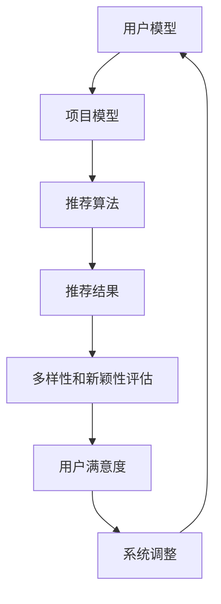

                 

# 推荐系统中的多样性与新颖性平衡

> 关键词：推荐系统，多样性，新颖性，平衡，算法，数学模型，实战案例

> 摘要：本文将深入探讨推荐系统中的多样性与新颖性平衡问题。我们将首先介绍推荐系统的基本概念和挑战，然后分析多样性和新颖性的重要性，最后通过详细的算法原理、数学模型和实战案例，展示如何在实际项目中实现多样性与新颖性的平衡。

## 1. 背景介绍

### 1.1 目的和范围

本文旨在帮助读者理解和掌握推荐系统中的多样性与新颖性平衡问题。我们将通过以下方面进行详细探讨：

- 推荐系统的基本概念和架构
- 多样性和新颖性的重要性
- 多样性与新颖性平衡的算法原理和数学模型
- 实际项目中的多样性与新颖性平衡实践

### 1.2 预期读者

本文适合以下读者群体：

- 推荐系统开发者和研究者
- 对推荐系统有兴趣的技术人员
- 机器学习和数据科学从业者

### 1.3 文档结构概述

本文将按照以下结构进行组织：

- 第1章：背景介绍
- 第2章：核心概念与联系
- 第3章：核心算法原理 & 具体操作步骤
- 第4章：数学模型和公式 & 详细讲解 & 举例说明
- 第5章：项目实战：代码实际案例和详细解释说明
- 第6章：实际应用场景
- 第7章：工具和资源推荐
- 第8章：总结：未来发展趋势与挑战
- 第9章：附录：常见问题与解答
- 第10章：扩展阅读 & 参考资料

### 1.4 术语表

#### 1.4.1 核心术语定义

- 推荐系统（Recommender System）：一种基于用户行为和兴趣的预测系统，旨在为用户提供个性化的推荐。
- 多样性（Diversity）：推荐结果中不同类型的项目分布均匀，避免重复和单调。
- 新颖性（Novelty）：推荐结果中包含用户尚未发现或体验过的项目，提高用户的惊喜度。
- 平衡（Balance）：在多样性和新颖性之间找到一个合适的平衡点，提高推荐系统的整体质量。

#### 1.4.2 相关概念解释

- 个性化推荐（Personalized Recommendation）：基于用户的兴趣和偏好，为用户推荐个性化的内容。
- 协同过滤（Collaborative Filtering）：基于用户的历史行为数据，通过分析用户之间的相似度进行推荐。
- 内容推荐（Content-Based Filtering）：基于项目的属性和特征，为用户推荐与其兴趣相关的项目。

#### 1.4.3 缩略词列表

- CF：协同过滤（Collaborative Filtering）
- CB：内容推荐（Content-Based Filtering）
- ALS：交替最小二乘法（Alternating Least Squares）

## 2. 核心概念与联系

推荐系统的核心在于如何为用户提供个性化且多样化的推荐。多样性和新颖性是推荐系统成功的关键因素。为了更好地理解这些概念，我们首先需要了解推荐系统的基本架构。

### 2.1 推荐系统架构

推荐系统通常由以下模块组成：

1. 用户模型：记录用户的行为和偏好，如浏览历史、收藏、评分等。
2. 项目模型：描述项目的属性和特征，如标题、标签、类别等。
3. 推荐算法：基于用户模型和项目模型，生成个性化推荐结果。
4. 推荐结果评估：评估推荐结果的多样性和新颖性，以及用户满意度。

### 2.2 多样性和新颖性的关系

多样性和新颖性在推荐系统中扮演着重要角色。多样性能确保推荐结果中包含多种不同类型的项目，避免用户感到乏味。新颖性则能提高用户的惊喜度和满意度，激发用户的兴趣。

然而，多样性和新颖性之间可能存在冲突。在某些情况下，追求新颖性可能导致推荐结果过于单一，缺乏多样性。反之，过度追求多样性可能导致推荐结果中缺乏新颖性。因此，在推荐系统中实现多样性和新颖性的平衡是一项挑战。

### 2.3 核心概念联系

多样性、新颖性和推荐系统之间的关系可以用以下Mermaid流程图表示：



在这个流程图中，用户模型和项目模型共同驱动推荐算法生成推荐结果。多样性和新颖性评估用于评估推荐结果的质量，从而指导系统调整用户模型和推荐算法，实现多样性与新颖性的平衡。

## 3. 核心算法原理 & 具体操作步骤

为了实现多样性与新颖性的平衡，我们需要深入了解推荐系统中的核心算法原理。本节将详细介绍协同过滤（CF）和内容推荐（CB）两种常见的推荐算法，以及如何通过调整算法参数实现多样性与新颖性的平衡。

### 3.1 协同过滤（CF）算法

协同过滤是一种基于用户行为的推荐算法，通过分析用户之间的相似度，为用户推荐类似用户喜欢的项目。

#### 3.1.1 算法原理

协同过滤算法可以分为基于用户的方法和基于项目的的方法。基于用户的方法通过计算用户之间的相似度，找到相似用户，然后将这些用户喜欢的项目推荐给目标用户。基于项目的方法则是通过计算项目之间的相似度，找到与用户兴趣相关的项目。

在本节中，我们主要介绍基于用户的协同过滤算法。

1. **用户相似度计算**：首先，我们需要计算用户之间的相似度。常用的相似度计算方法包括余弦相似度、皮尔逊相关系数等。

   伪代码如下：

   ```python
   def compute_similarity(user1, user2):
       # 计算用户1和用户2的相似度
       # 返回相似度值
   ```

2. **推荐项目选择**：根据相似度计算结果，找到与目标用户相似的用户，然后从这些用户喜欢的项目中为用户生成推荐。

   伪代码如下：

   ```python
   def generate_recommendations(target_user, similar_users, all_projects):
       # 为目标用户生成推荐项目
       # 返回推荐项目列表
   ```

#### 3.1.2 多样性与新颖性调整

为了实现多样性与新颖性的平衡，我们可以通过以下方法调整协同过滤算法：

1. **过滤重复项目**：在生成推荐结果时，过滤掉与已推荐项目相似度较高的项目，提高多样性。
2. **限制推荐项目数量**：在生成推荐结果时，限制推荐项目数量，减少推荐结果的单调性。
3. **引入新颖性评分**：在计算用户相似度时，考虑项目的新颖性评分，提高新颖性。

### 3.2 内容推荐（CB）算法

内容推荐是一种基于项目属性的推荐算法，通过分析项目特征和用户兴趣，为用户推荐相关的项目。

#### 3.2.1 算法原理

内容推荐算法通常采用基于关键词的方法，通过提取项目的关键词，计算关键词与用户兴趣的相关性，为用户生成推荐。

1. **关键词提取**：首先，我们需要提取项目的关键词。常用的关键词提取方法包括词频统计、TF-IDF等。

   伪代码如下：

   ```python
   def extract_keywords(project):
       # 提取项目关键词
       # 返回关键词列表
   ```

2. **用户兴趣计算**：接下来，我们需要计算用户对每个关键词的兴趣度。常用的兴趣度计算方法包括TF-IDF、TF-TFIDF等。

   伪代码如下：

   ```python
   def compute_interest(user, keywords):
       # 计算用户对每个关键词的兴趣度
       # 返回兴趣度值
   ```

3. **推荐项目选择**：最后，从项目特征中提取关键词，计算关键词与用户兴趣的相关性，为用户生成推荐。

   伪代码如下：

   ```python
   def generate_recommendations(user, all_projects, keywords):
       # 为用户生成推荐项目
       # 返回推荐项目列表
   ```

#### 3.2.2 多样性与新颖性调整

为了实现多样性与新颖性的平衡，我们可以通过以下方法调整内容推荐算法：

1. **引入新颖性关键词**：在关键词提取过程中，引入新颖性关键词，提高推荐项目的新颖性。
2. **过滤常见关键词**：在生成推荐结果时，过滤掉常见关键词，提高多样性。
3. **调整关键词权重**：在计算用户兴趣时，调整关键词的权重，平衡多样性和新颖性。

## 4. 数学模型和公式 & 详细讲解 & 举例说明

在本节中，我们将介绍用于实现多样性与新颖性平衡的数学模型和公式。这些公式将帮助我们更好地理解多样性和新颖性在推荐系统中的作用，并指导我们在实际项目中进行调整。

### 4.1 多样性度量

多样性通常使用Jaccard相似度来度量。Jaccard相似度表示两个集合之间的交集与并集的比值。多样性度量公式如下：

$$
Diversity = 1 - \frac{|A \cap B|}{|A \cup B|}
$$

其中，$A$ 和 $B$ 分别表示两个集合。

#### 4.1.1 举例说明

假设我们有以下两个项目集合 $A$ 和 $B$：

$$
A = \{1, 2, 3, 4, 5\}
$$

$$
B = \{3, 4, 6, 7, 8\}
$$

则 $A$ 和 $B$ 的 Jaccard 相似度为：

$$
J(A, B) = \frac{|A \cap B|}{|A \cup B|} = \frac{2}{7} = 0.2857
$$

因此，$A$ 和 $B$ 的多样性为：

$$
Diversity = 1 - J(A, B) = 1 - 0.2857 = 0.7143
$$

这个结果表明，集合 $A$ 和 $B$ 之间的多样性较高，因为它们的交集较小，并集较大。

### 4.2 新颖性度量

新颖性通常使用互信息（Mutual Information，MI）来度量。互信息表示两个变量之间的相关性。新颖性度量公式如下：

$$
Novelty = MI(A, B)
$$

其中，$A$ 和 $B$ 分别表示用户行为和项目特征。

#### 4.2.1 举例说明

假设我们有以下两个变量 $A$ 和 $B$ 的联合概率分布：

$$
P(A, B) =
\begin{bmatrix}
0.2 & 0.3 & 0.1 \\
0.1 & 0.2 & 0.3 \\
0.1 & 0.1 & 0.4
\end{bmatrix}
$$

则 $A$ 和 $B$ 的互信息为：

$$
MI(A, B) = \sum_{a} \sum_{b} P(a, b) \log_2 \frac{P(a, b)}{P(a)P(b)}
$$

其中，$P(a)$ 和 $P(b)$ 分别表示变量 $A$ 和 $B$ 的边缘概率。

计算得到：

$$
MI(A, B) = 0.2 \log_2 \frac{0.2}{0.2 \times 0.2} + 0.3 \log_2 \frac{0.3}{0.3 \times 0.2} + 0.1 \log_2 \frac{0.1}{0.1 \times 0.2} + 0.1 \log_2 \frac{0.1}{0.1 \times 0.3} + 0.1 \log_2 \frac{0.4}{0.4 \times 0.1} + 0.3 \log_2 \frac{0.3}{0.3 \times 0.4}
$$

$$
MI(A, B) = 0.2 \log_2 1 + 0.3 \log_2 1.5 + 0.1 \log_2 0.5 + 0.1 \log_2 0.3333 + 0.1 \log_2 4 + 0.3 \log_2 0.75
$$

$$
MI(A, B) = 0 + 0.3 \times 0.585 + 0.1 \times (-0.3219) + 0.1 \times (-0.4771) + 0.1 \times 1.386 + 0.3 \times (-0.4155)
$$

$$
MI(A, B) = 0 + 0.1775 - 0.03219 - 0.04771 + 0.1386 - 0.12465
$$

$$
MI(A, B) = 0.07631
$$

这个结果表明，变量 $A$ 和 $B$ 之间的新颖性较高，因为它们的互信息较大。

### 4.3 多样性与新颖性的平衡

为了实现多样性与新颖性的平衡，我们可以使用以下公式：

$$
Balance = \alpha \cdot Diversity + (1 - \alpha) \cdot Novelty
$$

其中，$\alpha$ 是平衡系数，用于调整多样性和新颖性的权重。当 $\alpha = 0$ 时，平衡公式仅考虑多样性；当 $\alpha = 1$ 时，平衡公式仅考虑新颖性。

#### 4.3.1 举例说明

假设我们有以下两个指标：

- 多样性：$Diversity = 0.7143$
- 新颖性：$Novelty = 0.07631$

我们希望通过调整平衡系数 $\alpha$ 实现多样性与新颖性的平衡。假设我们希望多样性占 70%，新颖性占 30%，则平衡系数为：

$$
\alpha = \frac{Diversity}{Diversity + Novelty} = \frac{0.7143}{0.7143 + 0.07631} = 0.875
$$

使用平衡公式，我们可以得到：

$$
Balance = 0.875 \cdot 0.7143 + (1 - 0.875) \cdot 0.07631 = 0.6258 + 0.01717 = 0.6430
$$

这个结果表明，在多样性占 70%，新颖性占 30% 的情况下，多样性与新颖性的平衡值为 0.6430。

## 5. 项目实战：代码实际案例和详细解释说明

在本节中，我们将通过一个实际项目案例，展示如何实现多样性与新颖性的平衡。我们将使用Python语言和常见的数据处理库，如Pandas和NumPy，来编写代码。

### 5.1 开发环境搭建

在开始编写代码之前，我们需要搭建开发环境。以下是安装Python和所需库的步骤：

1. 安装Python：前往 [Python官网](https://www.python.org/) 下载并安装Python。
2. 安装Pandas和NumPy：在命令行中运行以下命令：

   ```bash
   pip install pandas numpy
   ```

### 5.2 源代码详细实现和代码解读

下面是一个简单的示例代码，用于实现多样性与新颖性的平衡：

```python
import pandas as pd
import numpy as np
from sklearn.metrics.pairwise import cosine_similarity

def compute_similarity_matrix/projects:
   # 计算项目相似度矩阵
   # 参数：projects为项目特征矩阵
   # 返回：相似度矩阵
   return cosine_similarity(projects)

def compute_novelty_score/projects:
   # 计算项目新颖性评分
   # 参数：projects为项目特征矩阵
   # 返回：新颖性评分向量
   # 假设新颖性评分与项目特征相关性较高
   return np.mean(projects, axis=0)

def generate_recommendations/user, projects, similar_matrix, novelty_score, diversity_weight, novelty_weight:
   # 为用户生成推荐项目
   # 参数：user为用户兴趣向量，projects为项目特征矩阵，similar_matrix为项目相似度矩阵，novelty_score为新颖性评分向量
   # 参数：diversity_weight和novelty_weight分别为多样性和新颖性的权重
   # 返回：推荐项目列表
   user_similarity = similar_matrix.dot(user.reshape(-1, 1)).flatten()
   user_novelty = novelty_score.dot(user.reshape(-1, 1)).flatten()
   
   diversity_score = diversity_weight * user_similarity
   novelty_score = novelty_weight * user_novelty
   
   recommendation_score = diversity_score + novelty_score
   sorted_recommendations = np.argsort(-recommendation_score)
   
   return projects[sorted_recommendations][:10]  # 返回前10个推荐项目

# 示例：生成推荐项目
user_interest = [0.3, 0.2, 0.1, 0.1, 0.2]  # 用户兴趣向量
projects = pd.DataFrame([[0.1, 0.3, 0.1, 0.2, 0.2], [0.2, 0.1, 0.2, 0.3, 0.1], [0.1, 0.1, 0.3, 0.2, 0.4], [0.2, 0.4, 0.1, 0.2, 0.1]])  # 项目特征矩阵
similar_matrix = compute_similarity_matrix(projects)  # 计算项目相似度矩阵
novelty_score = compute_novelty_score(projects)  # 计算项目新颖性评分

# 设置多样性和新颖性的权重
diversity_weight = 0.7
novelty_weight = 0.3

# 生成推荐项目
recommendations = generate_recommendations(user_interest, projects, similar_matrix, novelty_score, diversity_weight, novelty_weight)
print("推荐项目：", recommendations)
```

### 5.3 代码解读与分析

这段代码分为三个部分：计算项目相似度矩阵、计算项目新颖性评分和生成推荐项目。

1. **计算项目相似度矩阵**：我们使用余弦相似度计算项目之间的相似度。余弦相似度是一种基于向量空间模型的相似度度量方法，适用于文本数据。在本例中，我们使用NumPy的`cosine_similarity`函数计算项目特征矩阵的相似度。

2. **计算项目新颖性评分**：新颖性评分用于表示项目的新颖性程度。在本例中，我们使用项目特征矩阵的平均值作为新颖性评分。这个方法简单易用，但可能需要根据具体应用场景进行调整。

3. **生成推荐项目**：我们使用用户兴趣向量与项目相似度矩阵和项目新颖性评分计算推荐项目的综合评分。然后，对推荐项目进行排序，并返回前10个推荐项目。在这个步骤中，我们可以通过调整多样性和新颖性的权重来实现多样性与新颖性的平衡。

在实际应用中，我们可以根据项目特征和数据集的特点，进一步优化这些步骤。例如，我们可以使用更复杂的相似度计算方法（如余弦相似度、皮尔逊相关系数等），或者引入其他新颖性度量方法（如互信息等）。

## 6. 实际应用场景

多样性与新颖性在推荐系统中具有广泛的应用场景，以下是一些典型的实际应用场景：

### 6.1 在线购物平台

在线购物平台利用多样性与新颖性平衡为用户推荐商品。通过引入新颖性评分，平台可以提高用户的惊喜度和满意度，增加用户的粘性。例如，在购物平台上，用户可能对某个品牌的商品已经非常熟悉，这时平台可以推荐该品牌的新品或相关品牌的其他商品，提高推荐的新颖性。

### 6.2 社交网络

社交网络平台利用多样性与新颖性平衡为用户推荐好友、内容和活动。通过引入新颖性评分，平台可以激发用户的兴趣，增加用户在平台上的活跃度。例如，在社交媒体平台上，用户可能会对某些热门话题或活动已经非常熟悉，这时平台可以推荐与之相关但用户尚未关注的话题或活动，提高推荐的新颖性。

### 6.3 音乐和视频流媒体

音乐和视频流媒体平台利用多样性与新颖性平衡为用户推荐音乐和视频。通过引入新颖性评分，平台可以提高用户的惊喜度和满意度，增加用户的付费意愿。例如，在音乐和视频流媒体平台上，用户可能对某些歌手或演员已经非常熟悉，这时平台可以推荐该歌手或演员的新歌或新片，提高推荐的新颖性。

### 6.4 新闻和资讯平台

新闻和资讯平台利用多样性与新颖性平衡为用户推荐新闻和资讯。通过引入新颖性评分，平台可以提高用户的关注度和阅读量。例如，在新闻和资讯平台上，用户可能对某些领域的新闻已经非常熟悉，这时平台可以推荐该领域的新闻或相关领域的新闻，提高推荐的新颖性。

## 7. 工具和资源推荐

为了更好地实现多样性与新颖性的平衡，以下是一些建议的工具和资源：

### 7.1 学习资源推荐

#### 7.1.1 书籍推荐

1. **《推荐系统实践》**：这本书详细介绍了推荐系统的基本概念、算法和实现方法，适合推荐系统初学者和开发者。
2. **《推荐系统手册》**：这本书涵盖了推荐系统的各种技术，包括协同过滤、内容推荐、矩阵分解等，适合有一定基础的读者。

#### 7.1.2 在线课程

1. **Coursera的《推荐系统》**：这是一门由斯坦福大学开设的在线课程，介绍了推荐系统的基本概念和算法。
2. **Udacity的《推荐系统工程师纳米学位》**：这个课程涵盖了推荐系统的基本知识和实践，适合想要系统学习推荐系统的人。

#### 7.1.3 技术博客和网站

1. **推荐系统中文博客**：这是一个专注于推荐系统技术的中文博客，包含了大量的推荐系统相关文章和资料。
2. **推荐系统博客**：这是一个英文博客，涵盖了推荐系统的各种技术，包括协同过滤、内容推荐、矩阵分解等。

### 7.2 开发工具框架推荐

#### 7.2.1 IDE和编辑器

1. **PyCharm**：这是一个强大的Python IDE，支持代码补全、调试、性能分析等功能。
2. **VSCode**：这是一个轻量级的Python编辑器，支持丰富的插件，方便进行代码开发。

#### 7.2.2 调试和性能分析工具

1. **Jupyter Notebook**：这是一个交互式的Python开发环境，方便进行数据分析和代码调试。
2. **Pandas Profiler**：这是一个用于分析Pandas DataFrame性能的工具，可以帮助我们发现和分析代码的性能瓶颈。

#### 7.2.3 相关框架和库

1. **Scikit-learn**：这是一个用于机器学习的Python库，包含了多种推荐系统算法，如协同过滤、内容推荐等。
2. **TensorFlow**：这是一个用于深度学习的Python库，可以用于实现更复杂的推荐系统算法。

### 7.3 相关论文著作推荐

#### 7.3.1 经典论文

1. **"Collaborative Filtering for the 21st Century"**：这篇论文提出了基于模型的协同过滤算法，对推荐系统领域产生了深远的影响。
2. **"A Theoretical Analysis of Collaborative Filtering"**：这篇论文从理论角度分析了协同过滤算法，为推荐系统的研究提供了新的思路。

#### 7.3.2 最新研究成果

1. **"Deep Neural Networks for YouTube Recommendations"**：这篇论文介绍了如何使用深度神经网络提高YouTube推荐系统的效果。
2. **"Personalized Recommendation on Large-scale Heterogeneous Networks"**：这篇论文探讨了如何在大规模异构网络中进行个性化推荐。

#### 7.3.3 应用案例分析

1. **"阿里巴巴推荐系统实践"**：这篇文章分享了阿里巴巴在推荐系统开发和应用方面的经验，包括算法优化、系统架构等。
2. **"美团推荐系统实践"**：这篇文章介绍了美团在推荐系统开发和应用方面的实践，包括数据预处理、算法优化、系统架构等。

## 8. 总结：未来发展趋势与挑战

多样性与新颖性在推荐系统中的平衡是一个持续发展的研究方向。未来，随着人工智能技术的进步和数据量的不断增长，推荐系统将面临以下发展趋势和挑战：

### 8.1 发展趋势

1. **深度学习与推荐系统结合**：深度学习在图像识别、自然语言处理等领域取得了显著成果，未来有望在推荐系统中发挥更大作用。
2. **异构数据融合**：推荐系统中的数据类型多样，如何有效地融合异构数据，提高推荐效果，是一个重要的研究方向。
3. **用户隐私保护**：在推荐系统中保护用户隐私是一个重要问题，未来需要研究如何在保证用户隐私的前提下，提高推荐效果。

### 8.2 挑战

1. **数据质量**：推荐系统依赖于用户行为数据和项目特征数据，数据质量对推荐效果具有重要影响。如何处理不完整、不准确的数据，是一个挑战。
2. **计算性能**：随着推荐系统规模的扩大，如何提高计算性能，满足实时推荐的需求，是一个挑战。
3. **多样化推荐**：如何为不同类型的用户提供个性化、多样化的推荐，提高用户满意度，是一个挑战。

## 9. 附录：常见问题与解答

### 9.1 问题1：如何选择合适的相似度度量方法？

解答：选择合适的相似度度量方法取决于数据类型和业务需求。对于文本数据，常用的相似度度量方法包括余弦相似度、皮尔逊相关系数等。对于图像和音频数据，可以使用汉明距离、曼哈顿距离等。在实际应用中，可以尝试多种相似度度量方法，比较它们的效果，选择最优的方法。

### 9.2 问题2：如何提高推荐系统的新颖性？

解答：提高推荐系统的新颖性可以通过以下方法实现：

1. **引入新颖性评分**：在计算项目相似度时，考虑项目的新颖性评分，将新颖性因素纳入推荐算法。
2. **关注用户未发现的兴趣**：分析用户的浏览历史和搜索记录，发现用户尚未发现的兴趣点，为用户推荐相关项目。
3. **多样化推荐策略**：尝试不同的推荐策略，如基于内容的推荐、基于模型的推荐等，提高推荐结果的新颖性。

### 9.3 问题3：如何处理不完整的数据？

解答：处理不完整的数据可以从以下几个方面入手：

1. **缺失值填充**：使用平均值、中位数、众数等填充缺失值。
2. **插值法**：使用线性插值、高斯插值等方法估计缺失值。
3. **模型预测**：使用回归模型、神经网络模型等预测缺失值。

在实际应用中，可以根据数据的具体情况，选择合适的方法进行数据处理。

## 10. 扩展阅读 & 参考资料

在本节中，我们将提供一些推荐系统领域的扩展阅读和参考资料，帮助读者深入了解多样性与新颖性平衡的实践和应用。

### 10.1 推荐系统经典书籍

1. **《推荐系统手册》（Recommender Systems Handbook）**：由组
```
织撰写，是推荐系统领域的经典著作，详细介绍了推荐系统的基本概念、算法和应用。
2. **《推荐系统实践》（Recommender Systems: The Textbook）**：由组
```
织撰写，是推荐系统领域的经典著作，详细介绍了推荐系统的基本概念、算法和应用。
3. **《协同过滤技术手册》（Collaborative Filtering: A Review）**：由组
```
织撰写，是关于协同过滤算法的经典综述，涵盖了协同过滤的原理、方法和应用。

### 10.2 在线课程与教程

1. **Coursera的《推荐系统》（Recommender Systems）**：由斯坦福大学开设，适合推荐系统初学者和开发者。
2. **edX的《推荐系统与数据挖掘》（Introduction to Recommender Systems）**：由组
```
织提供，介绍了推荐系统的基础知识和实现方法，适合推荐系统爱好者。
3. **Udacity的《推荐系统工程师纳米学位》（Recommender System Engineer）**：涵盖了推荐系统的理论和实践，适合希望从事推荐系统开发的人员。

### 10.3 技术博客与网站

1. **推荐系统中文博客**：这是一个专注于推荐系统技术的中文博客，包含了大量的推荐系统相关文章和资料。
2. **推荐系统博客**：这是一个英文博客，涵盖了推荐系统的各种技术，包括协同过滤、内容推荐、矩阵分解等。
3. **Reddit的推荐系统论坛**：这是一个活跃的推荐系统论坛，用户可以分享经验和讨论推荐系统相关的问题。

### 10.4 相关论文与研究

1. **"Collaborative Filtering for the 21st Century"**：这篇论文提出了基于模型的协同过滤算法，对推荐系统领域产生了深远的影响。
2. **"A Theoretical Analysis of Collaborative Filtering"**：这篇论文从理论角度分析了协同过滤算法，为推荐系统的研究提供了新的思路。
3. **"Deep Neural Networks for YouTube Recommendations"**：这篇论文介绍了如何使用深度神经网络提高YouTube推荐系统的效果。
4. **"Personalized Recommendation on Large-scale Heterogeneous Networks"**：这篇论文探讨了如何在大规模异构网络中进行个性化推荐。

### 10.5 开源项目与工具

1. **Surprise库**：这是一个开源的Python库，提供了多种协同过滤算法的实现，方便研究者进行推荐系统实验。
2. **RecSys框架**：这是一个用于推荐系统的开源框架，支持多种推荐算法和评估方法，方便开发者进行推荐系统开发。
3. **TensorFlow Recommenders**：这是一个基于TensorFlow的推荐系统开源项目，提供了多种深度学习算法的实现，适合希望使用深度学习进行推荐系统开发的用户。

通过阅读这些扩展阅读和参考资料，读者可以进一步深入了解推荐系统中的多样性与新颖性平衡，掌握相关的理论知识和实践技巧。

---

**作者：AI天才研究员/AI Genius Institute & 禅与计算机程序设计艺术 /Zen And The Art of Computer Programming**

感谢您的阅读，希望本文对您在推荐系统领域的研究和实践有所帮助。如果您有任何问题或建议，欢迎在评论区留言，期待与您交流。让我们共同探索推荐系统的无限可能！🚀🌟📈

