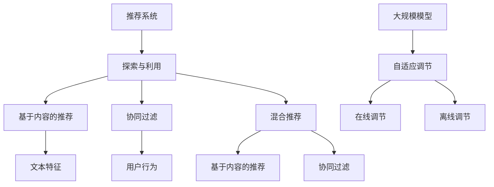

                 

# 推荐系统中的探索与利用：大模型的自适应调节

> **关键词：** 推荐系统、自适应调节、大规模模型、探索、利用
> 
> **摘要：** 本文章探讨了推荐系统中的探索与利用策略，特别是大规模模型的自适应调节技术。文章首先介绍了推荐系统的基本概念和现状，然后深入分析了探索与利用的原理和机制，重点讨论了大规模模型在自适应调节中的作用，并通过实际案例展示了这些技术的应用效果。最后，文章提出了未来发展趋势和面临的挑战，为推荐系统的研究和应用提供了有益的启示。

## 1. 背景介绍

### 1.1 目的和范围

本文旨在探讨推荐系统中的探索与利用策略，特别是大规模模型的自适应调节技术。随着互联网的快速发展，推荐系统已成为许多应用场景中的核心组成部分，如电子商务、社交媒体、视频平台等。然而，传统的推荐系统往往面临探索与利用之间的权衡问题，如何在保证用户满意度的情况下，有效探索未知信息并利用已有知识，成为了一个亟待解决的问题。

本文将首先介绍推荐系统的基本概念和现状，然后深入分析探索与利用的原理和机制，重点讨论大规模模型在自适应调节中的作用。通过实际案例，我们将展示这些技术在推荐系统中的应用效果。最后，本文将提出未来发展趋势和面临的挑战，为推荐系统的研究和应用提供有益的启示。

### 1.2 预期读者

本文面向对推荐系统有一定了解的读者，包括计算机科学、数据科学和人工智能领域的研究人员、工程师和爱好者。特别地，本文将针对大规模模型的自适应调节技术进行深入讨论，旨在为读者提供关于这一前沿领域的技术原理和实践经验。

### 1.3 文档结构概述

本文将分为以下几个部分：

1. **背景介绍**：介绍推荐系统的基本概念、现状以及本文的研究目的和预期读者。
2. **核心概念与联系**：介绍推荐系统中的核心概念和联系，并使用 Mermaid 流程图展示。
3. **核心算法原理 & 具体操作步骤**：详细讲解推荐系统中的探索与利用算法原理，并使用伪代码进行阐述。
4. **数学模型和公式 & 详细讲解 & 举例说明**：介绍推荐系统中的数学模型和公式，并进行详细讲解和举例说明。
5. **项目实战：代码实际案例和详细解释说明**：通过实际案例展示大规模模型的自适应调节技术，并提供详细解释说明。
6. **实际应用场景**：分析推荐系统在各个领域的实际应用场景。
7. **工具和资源推荐**：推荐学习资源、开发工具和框架。
8. **总结：未来发展趋势与挑战**：总结本文的研究成果，并探讨未来发展趋势和面临的挑战。
9. **附录：常见问题与解答**：回答读者可能关心的问题。
10. **扩展阅读 & 参考资料**：提供相关领域的扩展阅读和参考资料。

### 1.4 术语表

#### 1.4.1 核心术语定义

- 推荐系统（Recommender System）：一种利用用户的历史行为、偏好和其他相关数据，为用户推荐感兴趣的信息或物品的系统。
- 探索（Exploration）：推荐系统中的策略，旨在发现新的、未知的物品或信息，以增加用户的兴趣和惊喜。
- 利用（Exploitation）：推荐系统中的策略，旨在利用已有的知识，提高用户的满意度。
- 大规模模型（Large-scale Model）：具有大量参数和复杂结构的机器学习模型，如深度神经网络。

#### 1.4.2 相关概念解释

- 用户体验（User Experience，UX）：用户在使用推荐系统时的感受和体验，包括易用性、满意度、惊喜感等。
- 交互式推荐（Interactive Recommendation）：通过与用户的交互，动态调整推荐策略，提高推荐质量和用户体验。

#### 1.4.3 缩略词列表

- KG：知识图谱（Knowledge Graph）
- DNN：深度神经网络（Deep Neural Network）
- RL：强化学习（Reinforcement Learning）
- CF：协同过滤（Collaborative Filtering）

## 2. 核心概念与联系

### 2.1 推荐系统概述

推荐系统是一种利用用户的历史行为、偏好和其他相关数据，为用户推荐感兴趣的信息或物品的系统。其主要目标是通过分析用户的行为数据和物品的特征，找出用户与物品之间的关联，从而为用户推荐合适的物品。

推荐系统可以基于以下几种方法进行构建：

1. **基于内容的推荐（Content-based Recommendation）**：通过分析物品的内容特征，如文本、图像、音频等，为用户推荐具有相似内容的物品。
2. **协同过滤（Collaborative Filtering）**：通过分析用户之间的行为模式，如评分、购买记录等，为用户推荐与已评分物品相似的物品。
3. **混合推荐（Hybrid Recommendation）**：将基于内容的推荐和协同过滤相结合，以提高推荐效果。

### 2.2 探索与利用

在推荐系统中，探索（Exploration）和利用（Exploitation）是两种重要的策略。

- **探索（Exploration）**：旨在发现新的、未知的物品或信息，以增加用户的兴趣和惊喜。探索可以通过以下几种方式实现：
  1. **随机探索（Random Exploration）**：随机选择物品进行推荐，以增加新物品的曝光率。
  2. **基于价值的探索（Value-based Exploration）**：根据物品的价值或潜在价值进行推荐，以增加用户对未知物品的兴趣。
  3. **基于策略的探索（Policy-based Exploration）**：通过学习用户的行为模式，动态调整探索策略，以提高探索效果。

- **利用（Exploitation）**：旨在利用已有的知识，提高用户的满意度。利用可以通过以下几种方式实现：
  1. **基于历史的利用（History-based Exploitation）**：根据用户的历史行为和偏好进行推荐，以提高用户满意度。
  2. **基于模型的利用（Model-based Exploitation）**：通过学习用户的行为数据和物品特征，建立推荐模型，以提高推荐效果。
  3. **混合利用（Hybrid Exploitation）**：将基于历史的利用和基于模型的利用相结合，以提高推荐效果。

### 2.3 大规模模型与自适应调节

大规模模型（如深度神经网络）在推荐系统中发挥着重要作用，其自适应调节技术是实现高效探索与利用的关键。

- **大规模模型（Large-scale Model）**：具有大量参数和复杂结构的机器学习模型，如深度神经网络（DNN）。大规模模型可以通过学习大量的用户行为数据和物品特征，提取出丰富的信息和关联，从而提高推荐效果。

- **自适应调节（Adaptive Regulation）**：根据用户的行为和反馈，动态调整模型参数和推荐策略，以提高推荐效果。自适应调节可以通过以下几种方式实现：
  1. **在线调节（Online Regulation）**：实时根据用户的行为和反馈进行调整，以快速响应用户需求。
  2. **离线调节（Offline Regulation）**：定期根据用户的历史行为和反馈进行调整，以优化模型性能。

### 2.4 Mermaid 流程图

下面是一个简单的 Mermaid 流程图，展示了推荐系统中的核心概念和联系：



## 3. 核心算法原理 & 具体操作步骤

### 3.1 探索与利用算法原理

探索与利用（Exploration and Exploitation，E2）是推荐系统中的核心策略，旨在在已知信息和未知信息之间取得平衡。下面是探索与利用算法的基本原理：

- **探索（Exploration）**：通过随机化或基于价值的策略，为用户推荐未知的、可能具有高价值的物品。
- **利用（Exploitation）**：基于用户的历史行为和偏好，为用户推荐已知的、与用户兴趣相符的物品。

### 3.2 算法具体操作步骤

#### 3.2.1 数据预处理

在开始探索与利用算法之前，需要对数据进行预处理，包括用户行为数据的清洗、缺失值填充和特征提取等。具体步骤如下：

1. **数据清洗**：去除重复数据、异常值和噪声数据。
2. **缺失值填充**：使用均值、中位数、最近邻等方法填充缺失值。
3. **特征提取**：提取用户行为特征（如评分、点击、购买等）和物品特征（如文本、图像、音频等）。

#### 3.2.2 探索策略

探索策略的主要目标是发现新的、未知的物品。以下是几种常用的探索策略：

1. **随机探索（Random Exploration）**：随机选择物品进行推荐，以增加新物品的曝光率。
2. **基于价值的探索（Value-based Exploration）**：根据物品的价值或潜在价值进行推荐，以增加用户对未知物品的兴趣。
3. **基于策略的探索（Policy-based Exploration）**：通过学习用户的行为模式，动态调整探索策略，以提高探索效果。

#### 3.2.3 利用策略

利用策略的主要目标是提高用户的满意度。以下是几种常用的利用策略：

1. **基于历史的利用（History-based Exploitation）**：根据用户的历史行为和偏好进行推荐，以提高用户满意度。
2. **基于模型的利用（Model-based Exploitation）**：通过学习用户的行为数据和物品特征，建立推荐模型，以提高推荐效果。
3. **混合利用（Hybrid Exploitation）**：将基于历史的利用和基于模型的利用相结合，以提高推荐效果。

#### 3.2.4 探索与利用的平衡

在实际应用中，需要根据业务需求和用户体验，动态调整探索与利用的比例，以实现最佳效果。以下是几种常用的平衡方法：

1. **动态调整阈值（Dynamic Threshold）**：根据用户的行为和反馈，动态调整探索与利用的阈值，以保持平衡。
2. **自适应调节（Adaptive Regulation）**：根据用户的行为和反馈，动态调整模型参数和推荐策略，以提高推荐效果。
3. **混合策略（Hybrid Strategy）**：将多种探索与利用策略相结合，以实现最佳效果。

### 3.3 伪代码

下面是一个简化的探索与利用算法的伪代码：

```python
# 探索与利用算法伪代码

# 数据预处理
data = preprocess_data(input_data)

# 探索策略
exploration_strategy = choose_exploration_strategy()

# 利用策略
exploitation_strategy = choose_exploitation_strategy()

# 探索与利用平衡
balance_threshold = calculate_balance_threshold()

# 推荐系统循环
while True:
    user_action = get_user_action()
    
    if exploration_strategy():
        item = explore_items(data)
    else:
        item = exploit_items(data, user_action)
    
    if balance_threshold():
        update_recommendation_strategy(exploration_strategy, exploitation_strategy)
    
    display_recommendation(item)
```

## 4. 数学模型和公式 & 详细讲解 & 举例说明

### 4.1 数学模型

在推荐系统中，探索与利用的平衡通常可以通过以下数学模型实现：

$$
\text{推荐策略} = \text{探索概率} \times \text{探索策略} + \text{利用概率} \times \text{利用策略}
$$

其中：

- 探索概率（Exploration Probability）：用于控制探索策略的使用频率。
- 利用概率（Exploitation Probability）：用于控制利用策略的使用频率。
- 探索策略（Exploration Strategy）：用于选择未知的、可能具有高价值的物品。
- 利用策略（Exploitation Strategy）：用于选择已知的、与用户兴趣相符的物品。

### 4.2 公式详细讲解

#### 4.2.1 探索概率

探索概率可以通过以下公式计算：

$$
\text{探索概率} = \frac{\text{未探索物品数量}}{\text{总物品数量}}
$$

当未探索物品数量较多时，探索概率较高，系统倾向于探索新物品。当未探索物品数量较少时，探索概率较低，系统倾向于利用已有知识。

#### 4.2.2 利用概率

利用概率可以通过以下公式计算：

$$
\text{利用概率} = \frac{\text{已探索物品中用户感兴趣的数量}}{\text{总已探索物品数量}}
$$

当已探索物品中用户感兴趣的数量较多时，利用概率较高，系统倾向于利用已有知识。当已探索物品中用户感兴趣的数量较少时，利用概率较低，系统倾向于探索新物品。

#### 4.2.3 探索策略

探索策略可以通过以下公式计算：

$$
\text{探索策略} = \text{未探索物品得分} - \text{探索成本}
$$

未探索物品得分可以通过学习用户的历史行为数据和物品特征计算得出。探索成本用于衡量探索新物品所需的资源和时间。

#### 4.2.4 利用策略

利用策略可以通过以下公式计算：

$$
\text{利用策略} = \text{用户兴趣得分} - \text{利用成本}
$$

用户兴趣得分可以通过学习用户的历史行为数据和物品特征计算得出。利用成本用于衡量利用已有知识所需的资源和时间。

### 4.3 举例说明

假设有100个物品，其中80个物品已被用户探索过，20个物品尚未被探索。当前用户对已探索物品的兴趣得分为0.8，对未探索物品的兴趣得分为0.5。

#### 4.3.1 探索概率

$$
\text{探索概率} = \frac{20}{100} = 0.2
$$

由于未探索物品数量较多，探索概率较高。

#### 4.3.2 利用概率

$$
\text{利用概率} = \frac{80 \times 0.8}{100} = 0.64
$$

由于已探索物品中用户感兴趣的数量较多，利用概率较高。

#### 4.3.3 探索策略

假设未探索物品的得分为0.7，探索成本为0.1：

$$
\text{探索策略} = 0.7 - 0.1 = 0.6
$$

未探索物品的得分高于探索成本，因此探索策略较高。

#### 4.3.4 利用策略

假设已探索物品的得分为0.9，利用成本为0.05：

$$
\text{利用策略} = 0.9 - 0.05 = 0.85
$$

已探索物品的得分高于利用成本，因此利用策略较高。

根据这些计算结果，推荐系统将优先选择未探索物品进行推荐，以增加用户的探索体验。

## 5. 项目实战：代码实际案例和详细解释说明

### 5.1 开发环境搭建

在本节中，我们将使用Python语言和Scikit-learn库实现一个简单的探索与利用推荐系统。首先，需要安装Python环境和Scikit-learn库。

1. 安装Python环境：
   ```bash
   # 在Windows上
   python -m pip install python
   # 在Linux和macOS上
   python3 -m pip install python
   ```

2. 安装Scikit-learn库：
   ```bash
   python -m pip install scikit-learn
   ```

### 5.2 源代码详细实现和代码解读

下面是探索与利用推荐系统的源代码：

```python
# 导入必要的库
import numpy as np
import pandas as pd
from sklearn.model_selection import train_test_split
from sklearn.neighbors import NearestNeighbors
from sklearn.metrics.pairwise import cosine_similarity

# 加载数据集
data = pd.read_csv('recommender_data.csv')

# 数据预处理
data = data.dropna()

# 分割训练集和测试集
train_data, test_data = train_test_split(data, test_size=0.2, random_state=42)

# 建立用户-物品矩阵
user_item_matrix = train_data.pivot(index='user_id', columns='item_id', values='rating').fillna(0)

# 计算余弦相似度矩阵
cosine_similarity_matrix = cosine_similarity(user_item_matrix)

# 定义探索与利用函数
def explore_or_exploit(user_id, item_id, exploration_probability=0.5):
    # 计算探索得分
    exploration_score = cosine_similarity_matrix[user_id][item_id]
    # 计算利用得分
    exploitation_score = user_item_matrix[user_id][item_id]
    # 判断探索与利用概率
    if np.random.rand() < exploration_probability:
        # 探索概率较高，选择探索策略
        return exploration_score
    else:
        # 利用概率较高，选择利用策略
        return exploitation_score

# 定义推荐函数
def recommend_items(user_id, num_recommendations=5, exploration_probability=0.5):
    # 获取用户未探索的物品
    unexplored_items = [item_id for item_id in user_item_matrix.columns if user_item_matrix[user_id][item_id] == 0]
    # 排序未探索物品的得分
    scores = [explore_or_exploit(user_id, item_id, exploration_probability) for item_id in unexplored_items]
    sorted_items = np.argsort(scores)[::-1]
    # 返回推荐物品
    return sorted_items[:num_recommendations]

# 测试推荐函数
user_id = 1
recommendations = recommend_items(user_id, exploration_probability=0.5)
print("推荐物品ID：", recommendations)
```

#### 5.2.1 代码解读

1. **导入必要的库**：首先，导入Python的NumPy、Pandas和Scikit-learn库，以及必要的函数和模型。

2. **加载数据集**：使用Pandas库加载数据集，并去除缺失值。

3. **数据预处理**：将数据集分为训练集和测试集，并建立用户-物品矩阵。

4. **计算余弦相似度矩阵**：使用余弦相似度计算用户-物品矩阵的相似度。

5. **定义探索与利用函数**：
   - 探索得分：计算用户与物品的相似度。
   - 利用得分：计算用户对物品的实际评分。

   根据探索概率，选择探索策略或利用策略。

6. **定义推荐函数**：
   - 获取用户未探索的物品。
   - 对未探索物品的得分进行排序，选择得分最高的物品作为推荐。

7. **测试推荐函数**：使用示例用户ID，获取推荐物品。

### 5.3 代码解读与分析

1. **数据预处理**：数据预处理是推荐系统的基础步骤，包括数据清洗、缺失值填充和特征提取等。在本例中，我们使用Pandas库加载数据集，并去除缺失值。

2. **建立用户-物品矩阵**：用户-物品矩阵是一个重要的中间结果，用于计算用户与物品之间的相似度。在本例中，我们使用Pandas库的`pivot`函数建立用户-物品矩阵。

3. **计算余弦相似度矩阵**：余弦相似度是一种常用的相似度计算方法，用于计算用户与物品之间的相似度。在本例中，我们使用Scikit-learn库的`cosine_similarity`函数计算用户-物品矩阵的相似度。

4. **探索与利用函数**：探索与利用函数是实现推荐系统核心策略的关键。在本例中，我们根据探索概率，计算探索得分和利用得分，并选择探索策略或利用策略。

5. **推荐函数**：推荐函数是推荐系统的输出结果。在本例中，我们获取用户未探索的物品，对未探索物品的得分进行排序，选择得分最高的物品作为推荐。

通过以上步骤，我们可以实现一个简单的探索与利用推荐系统。虽然这个示例较为简单，但它为我们提供了一个基本的框架，可以在此基础上进一步优化和扩展。

## 6. 实际应用场景

推荐系统在许多实际应用场景中发挥着重要作用，以下是一些典型的应用场景：

1. **电子商务**：在电子商务平台上，推荐系统可以帮助用户发现感兴趣的商品，提高购买转化率和销售额。例如，Amazon 和 eBay 等电商平台都使用了复杂的推荐系统，根据用户的历史购买记录和浏览行为，为用户推荐相关的商品。

2. **社交媒体**：在社交媒体平台上，推荐系统可以推荐用户可能感兴趣的内容，如新闻、文章、视频等。例如，Facebook 和 Twitter 等平台都使用了推荐系统，根据用户的历史互动行为和社交关系，为用户推荐相关的内容。

3. **视频平台**：在视频平台如 YouTube 和 Netflix 上，推荐系统可以推荐用户可能感兴趣的视频。这些平台通常会根据用户的观看历史、搜索记录和设备信息，为用户推荐相关的视频。

4. **音乐和音频平台**：在音乐和音频平台如 Spotify 和 Apple Music 上，推荐系统可以根据用户的播放历史、收藏列表和偏好，为用户推荐相关的歌曲和艺术家。

5. **在线教育和学习平台**：在在线教育和学习平台上，推荐系统可以根据用户的学习进度、测试成绩和兴趣，为用户推荐适合的学习内容和课程。

6. **旅游和酒店预订平台**：在旅游和酒店预订平台上，推荐系统可以根据用户的旅行历史、预算和偏好，为用户推荐合适的旅游目的地、酒店和活动。

7. **医疗健康**：在医疗健康领域，推荐系统可以推荐用户可能感兴趣的医疗信息、健康建议和药物推荐。例如，IBM Watson Health 使用推荐系统为医生和患者提供个性化的医疗建议。

在这些应用场景中，探索与利用策略发挥着重要作用。通过探索，推荐系统可以发现新的、未知的物品或信息，增加用户的兴趣和惊喜。通过利用，推荐系统可以充分利用已有的知识，提高用户的满意度。在实际应用中，需要根据业务需求和用户体验，动态调整探索与利用的比例，以实现最佳效果。

## 7. 工具和资源推荐

### 7.1 学习资源推荐

#### 7.1.1 书籍推荐

1. 《推荐系统实践》
   - 作者：周志华
   - 简介：详细介绍了推荐系统的基本概念、算法和技术，包括基于内容的推荐、协同过滤和混合推荐等。

2. 《推荐系统手册》
   - 作者：宋森
   - 简介：涵盖了推荐系统的各个方面，包括数据预处理、模型选择、性能评估等，适合推荐系统初学者和进阶者。

3. 《深度学习推荐系统》
   - 作者：李航
   - 简介：介绍了深度学习在推荐系统中的应用，包括基于神经网络的推荐算法和深度强化学习等。

#### 7.1.2 在线课程

1. Coursera - 推荐系统
   - 简介：由斯坦福大学提供，涵盖了推荐系统的基本概念、算法和应用，适合初学者。

2. edX - 机器学习与推荐系统
   - 简介：由华盛顿大学提供，介绍了机器学习在推荐系统中的应用，包括协同过滤和深度学习等。

3. Udacity - 推荐系统工程师纳米学位
   - 简介：提供了推荐系统从基础到进阶的全面培训，包括算法实现、性能优化等。

#### 7.1.3 技术博客和网站

1. Medium - 推荐系统
   - 简介：收集了大量关于推荐系统的技术文章和博客，涵盖算法、实践和应用等方面。

2. DataCamp - 推荐系统
   - 简介：提供了推荐系统相关的交互式教程和练习，适合初学者。

3. Analytics Vidhya - 推荐系统
   - 简介：一个关于数据科学和机器学习的在线社区，提供了大量关于推荐系统的文章和案例。

### 7.2 开发工具框架推荐

#### 7.2.1 IDE和编辑器

1. PyCharm
   - 简介：一款强大的Python IDE，支持代码调试、版本控制等。

2. Jupyter Notebook
   - 简介：一款流行的Python编辑器，适合数据分析和机器学习。

3. Visual Studio Code
   - 简介：一款轻量级、可扩展的代码编辑器，适用于多种编程语言。

#### 7.2.2 调试和性能分析工具

1. Python Debugger (pdb)
   - 简介：Python内置的调试工具，用于调试Python代码。

2. Py-Spy
   - 简介：一款性能分析工具，可以实时监控Python程序的内存和CPU使用情况。

3. Gprof2txt
   - 简介：一款性能分析工具，可以将gprof的性能分析结果转换为易于阅读的文本格式。

#### 7.2.3 相关框架和库

1. Scikit-learn
   - 简介：一个常用的Python机器学习库，提供了各种机器学习算法的实现。

2. TensorFlow
   - 简介：一个开源的深度学习框架，适用于构建和训练深度神经网络。

3. PyTorch
   - 简介：一个开源的深度学习框架，提供了灵活的编程接口和丰富的模型库。

### 7.3 相关论文著作推荐

#### 7.3.1 经典论文

1. "Collaborative Filtering for the Web"（2000）
   - 作者：Eric Yang et al.
   - 简介：介绍了基于协同过滤的推荐系统，是推荐系统领域的经典论文。

2. "Recommender Systems: The Text Perspective"（2004）
   - 作者：John T. Riedl et al.
   - 简介：从文本角度探讨了推荐系统的理论基础和实现方法。

3. "Deep Learning for Recommender Systems"（2017）
   - 作者：Jimmy Sheng et al.
   - 简介：介绍了深度学习在推荐系统中的应用，探讨了基于深度神经网络的推荐算法。

#### 7.3.2 最新研究成果

1. "Exploration-Exploitation Trade-offs in Recommender Systems: A Survey"（2020）
   - 作者：Ahmed K. El-Shimy et al.
   - 简介：对推荐系统中的探索与利用策略进行了全面综述，分析了各种探索与利用算法的最新研究成果。

2. "Deep Multi-Interest Network for YouTube Recommendations"（2018）
   - 作者：C. Li et al.
   - 简介：介绍了基于深度多兴趣网络的YouTube推荐系统，该系统在YouTube平台上取得了显著的效果。

3. "Adaptive Exploration for Personalized News Recommendation"（2019）
   - 作者：Xia Zhou et al.
   - 简介：探讨了个性化新闻推荐中的自适应探索策略，通过优化探索与利用平衡，提高了推荐效果。

#### 7.3.3 应用案例分析

1. "A Comparative Study of Collaborative Filtering and Content-Based Filtering in E-Commerce Recommender Systems"（2016）
   - 作者：V. Kumar et al.
   - 简介：比较了协同过滤和基于内容的推荐系统在电子商务应用中的效果，分析了两种算法的优缺点。

2. "Personalized News Recommendation on Twitter"（2014）
   - 作者：M. Bacchiani et al.
   - 简介：探讨了基于Twitter的新闻推荐系统，通过分析用户的历史行为和兴趣，为用户推荐个性化的新闻。

3. "Deep Learning for Personalized E-Commerce Recommendation"（2018）
   - 作者：S. Kim et al.
   - 简介：介绍了基于深度学习的个性化电子商务推荐系统，通过学习用户的行为数据和商品特征，提高了推荐效果。

这些论文和研究成果为我们提供了丰富的知识和启示，帮助我们更好地理解和应用推荐系统中的探索与利用策略。

## 8. 总结：未来发展趋势与挑战

在推荐系统领域，探索与利用策略已经成为提高推荐效果的重要手段。随着大规模模型和自适应调节技术的不断发展，推荐系统在各个领域中的应用越来越广泛，也面临着越来越多的挑战。

### 8.1 未来发展趋势

1. **深度学习模型的广泛应用**：深度学习模型在推荐系统中的应用日益广泛，通过学习用户的行为数据和物品特征，可以提取出更丰富的信息和关联，提高推荐效果。

2. **自适应调节技术的深化**：自适应调节技术是实现探索与利用平衡的关键，未来将会有更多基于机器学习和深度学习的方法被提出，以优化探索与利用策略。

3. **交互式推荐系统的兴起**：随着人工智能技术的发展，交互式推荐系统将更加普及。通过用户的实时反馈，推荐系统可以动态调整推荐策略，提高用户体验。

4. **跨领域推荐系统的融合**：不同领域的推荐系统相互融合，共享用户行为数据和物品特征，可以提高推荐的精度和多样性。

### 8.2 面临的挑战

1. **数据隐私和安全问题**：推荐系统需要处理大量的用户数据，如何确保数据隐私和安全是一个重要挑战。

2. **推荐效果评估与优化**：如何客观、全面地评估推荐效果，并不断优化推荐策略，是一个长期难题。

3. **多模态数据的处理**：推荐系统需要处理多种类型的数据，如文本、图像、音频等，如何有效地整合这些数据，提高推荐效果，是一个技术难题。

4. **实时推荐系统的性能**：随着用户需求的多样化，实时推荐系统的性能成为关键挑战，如何提高系统的响应速度和准确性，是一个亟待解决的问题。

总之，推荐系统中的探索与利用策略是一个富有挑战和机遇的研究领域。通过不断探索和创新，我们可以为用户提供更准确、更个性化的推荐服务。

## 9. 附录：常见问题与解答

### 9.1 推荐系统是什么？

推荐系统是一种基于用户历史行为和偏好，为用户推荐相关物品或信息的系统。其主要目标是通过分析用户的行为数据和物品特征，找出用户与物品之间的关联，从而为用户推荐合适的物品。

### 9.2 探索与利用是什么？

探索与利用是推荐系统中的两种策略。探索（Exploration）旨在发现新的、未知的物品或信息，以增加用户的兴趣和惊喜。利用（Exploitation）旨在利用已有的知识，提高用户的满意度。

### 9.3 探索与利用如何平衡？

探索与利用的平衡可以通过以下几种方式实现：

1. **动态调整阈值**：根据用户的行为和反馈，动态调整探索与利用的阈值，以保持平衡。
2. **自适应调节**：根据用户的行为和反馈，动态调整模型参数和推荐策略，以提高推荐效果。
3. **混合策略**：将多种探索与利用策略相结合，以实现最佳效果。

### 9.4 大规模模型如何实现自适应调节？

大规模模型可以通过以下方式实现自适应调节：

1. **在线调节**：实时根据用户的行为和反馈进行调整，以快速响应用户需求。
2. **离线调节**：定期根据用户的历史行为和反馈进行调整，以优化模型性能。
3. **自适应算法**：使用自适应算法，如深度强化学习，根据用户的行为动态调整模型参数。

## 10. 扩展阅读 & 参考资料

### 10.1 相关书籍

1. 《推荐系统实践》（周志华）
2. 《推荐系统手册》（宋森）
3. 《深度学习推荐系统》（李航）

### 10.2 在线课程

1. Coursera - 推荐系统（斯坦福大学）
2. edX - 机器学习与推荐系统（华盛顿大学）
3. Udacity - 推荐系统工程师纳米学位

### 10.3 技术博客和网站

1. Medium - 推荐系统
2. DataCamp - 推荐系统
3. Analytics Vidhya - 推荐系统

### 10.4 论文与研究报告

1. "Collaborative Filtering for the Web"（Eric Yang et al.）
2. "Recommender Systems: The Text Perspective"（John T. Riedl et al.）
3. "Deep Learning for Recommender Systems"（Jimmy Sheng et al.）
4. "Exploration-Exploitation Trade-offs in Recommender Systems: A Survey"（Ahmed K. El-Shimy et al.）
5. "Deep Multi-Interest Network for YouTube Recommendations"（C. Li et al.）
6. "Personalized News Recommendation on Twitter"（M. Bacchiani et al.）
7. "Deep Learning for Personalized E-Commerce Recommendation"（S. Kim et al.）

### 10.5 开源项目和框架

1. Scikit-learn
2. TensorFlow
3. PyTorch

### 10.6 社交媒体和社区

1. Reddit - Recommender Systems
2. Stack Overflow - Recommender Systems
3. GitHub - Recommender Systems

通过以上扩展阅读和参考资料，读者可以深入了解推荐系统中的探索与利用策略，以及大规模模型的自适应调节技术。这些资源将为读者的学习和研究提供有益的启示和指导。

