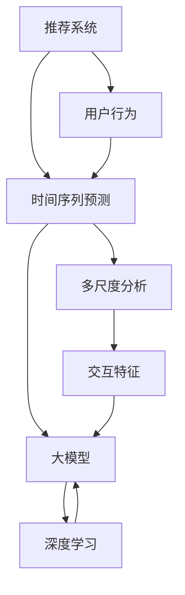

                 


## 推荐系统中的时间序列预测：大模型的多尺度分析

> **关键词：** 推荐系统、时间序列预测、大模型、多尺度分析、深度学习、神经网络、时间窗口、交互特征、序列建模、强化学习、模型评估、用户行为分析。

> **摘要：** 本文将深入探讨推荐系统中的时间序列预测问题，特别是大模型在多尺度分析中的应用。文章首先介绍了推荐系统的基本概念和挑战，然后详细讲解了时间序列预测的核心算法和数学模型，通过实际项目案例展示了大模型如何在不同时间尺度上进行预测。最后，文章总结了当前的研究趋势和面临的挑战，并推荐了相关的学习资源和开发工具。

## 1. 背景介绍

### 1.1 目的和范围

本文旨在探讨推荐系统中的时间序列预测问题，特别是如何利用大模型进行多尺度分析。推荐系统在电子商务、社交媒体、在线广告等众多领域发挥着关键作用。随着用户生成数据的爆炸式增长，如何准确地预测用户行为，从而为用户提供个性化的推荐，成为了一个极具挑战性的问题。

本文将主要关注以下几个方面：
1. 推荐系统的基本概念和挑战。
2. 时间序列预测的核心算法和数学模型。
3. 大模型在多尺度分析中的应用。
4. 实际项目案例的展示。
5. 当前研究趋势和面临的挑战。

### 1.2 预期读者

本文适合具有以下背景的读者：
1. 对推荐系统有基本了解的程序员和AI工程师。
2. 想深入了解时间序列预测和深度学习的读者。
3. 对大模型和多尺度分析感兴趣的研究人员。
4. 想在项目中应用推荐系统和时间序列预测的开发者。

### 1.3 文档结构概述

本文将按照以下结构进行论述：
1. 引言：介绍推荐系统中的时间序列预测问题。
2. 核心概念与联系：阐述相关算法原理和架构。
3. 核心算法原理 & 具体操作步骤：详细讲解时间序列预测算法。
4. 数学模型和公式 & 详细讲解 & 举例说明：介绍相关数学模型。
5. 项目实战：实际案例解析。
6. 实际应用场景：探讨时间序列预测在不同领域的应用。
7. 工具和资源推荐：推荐学习资源和开发工具。
8. 总结：展望未来发展趋势和挑战。
9. 附录：常见问题与解答。
10. 扩展阅读 & 参考资料：提供进一步学习的资源。

### 1.4 术语表

#### 1.4.1 核心术语定义

- **推荐系统（Recommender System）：** 一种自动化的信息过滤系统，旨在为用户提供个性化的推荐。
- **时间序列预测（Time Series Forecasting）：** 基于历史数据预测未来的发展趋势。
- **大模型（Large-scale Model）：** 具有大量参数的深度学习模型，如神经网络。
- **多尺度分析（Multi-scale Analysis）：** 在不同的时间尺度上进行预测和分析。

#### 1.4.2 相关概念解释

- **深度学习（Deep Learning）：** 一种基于多层神经网络的学习方法，能够自动提取数据的特征。
- **用户行为分析（User Behavior Analysis）：** 通过分析用户的历史行为数据，预测用户的未来行为。
- **交互特征（Interaction Feature）：** 用于描述用户与推荐系统之间交互的特征。

#### 1.4.3 缩略词列表

- **IDE（Integrated Development Environment）：** 集成开发环境。
- **CNN（Convolutional Neural Network）：** 卷积神经网络。
- **RNN（Recurrent Neural Network）：** 循环神经网络。
- **GPU（Graphics Processing Unit）：** 图形处理器。

## 2. 核心概念与联系

为了更好地理解推荐系统中的时间序列预测，我们需要先了解相关的核心概念和它们之间的关系。以下是一个使用Mermaid绘制的流程图，展示了这些概念及其联系。



### 2.1 推荐系统与用户行为

推荐系统的核心目标是为用户提供个性化的推荐，这需要分析用户的历史行为数据，如浏览记录、购买历史、点击率等。用户行为是推荐系统的输入，通过分析这些行为，系统能够预测用户未来的偏好。

### 2.2 时间序列预测

时间序列预测是一种基于历史数据的预测方法，旨在捕捉数据的时间依赖性。在推荐系统中，时间序列预测用于预测用户的未来行为，从而为用户推荐他们可能感兴趣的内容。

### 2.3 大模型与深度学习

大模型通常是指具有大量参数的深度学习模型，如神经网络。深度学习是一种基于多层神经网络的学习方法，能够自动提取数据的特征。大模型在推荐系统中的应用，使得系统能够处理大量用户数据，提高预测的准确性。

### 2.4 多尺度分析与交互特征

多尺度分析是一种在不同时间尺度上进行预测和分析的方法。在推荐系统中，交互特征用于描述用户与系统之间的交互，如点击、浏览等行为。通过分析这些交互特征，系统能够更好地理解用户的偏好，从而提高推荐的准确性。

## 3. 核心算法原理 & 具体操作步骤

### 3.1 时间序列预测算法

时间序列预测的核心是构建一个能够捕捉时间依赖性的模型。以下是一个基于循环神经网络（RNN）的时间序列预测算法的伪代码。

```python
# 初始化模型
model = RNNModel(input_shape=(timesteps, features))

# 编译模型
model.compile(optimizer='adam', loss='mse')

# 训练模型
model.fit(X_train, y_train, epochs=10, batch_size=32)

# 预测
predictions = model.predict(X_test)
```

### 3.2 大模型的多尺度分析

大模型的多尺度分析涉及在不同的时间尺度上进行预测。以下是一个基于卷积神经网络（CNN）和RNN结合的多尺度分析算法的伪代码。

```python
# 初始化模型
model = CNNRNNModel(input_shape=(timesteps, features), num_scales=3)

# 编译模型
model.compile(optimizer='adam', loss='mse')

# 训练模型
model.fit(X_train, y_train, epochs=10, batch_size=32)

# 预测
predictions = model.predict(X_test)
```

### 3.3 交互特征的提取

交互特征是推荐系统中重要的输入。以下是一个用于提取交互特征的算法的伪代码。

```python
# 初始化特征提取器
feature_extractor = InteractionFeatureExtractor()

# 提取特征
features = feature_extractor.extract_interactions(user_interactions)

# 预处理特征
processed_features = preprocess_features(features)
```

## 4. 数学模型和公式 & 详细讲解 & 举例说明

### 4.1 循环神经网络（RNN）

循环神经网络（RNN）是一种能够处理序列数据的神经网络，其核心在于内存单元（通常称为隐藏状态）的使用。RNN的数学模型如下：

$$
h_t = \sigma(W_h h_{t-1} + W_x x_t + b_h)
$$

$$
y_t = \sigma(W_y h_t + b_y)
$$

其中，$h_t$ 表示第$t$时刻的隐藏状态，$x_t$ 表示第$t$时刻的输入特征，$W_h$、$W_x$、$W_y$ 分别为权重矩阵，$b_h$、$b_y$ 分别为偏置向量，$\sigma$ 表示激活函数（通常使用Sigmoid函数）。

### 4.2 卷积神经网络（CNN）

卷积神经网络（CNN）是一种用于处理图像等二维数据的神经网络，其核心在于卷积操作。CNN的数学模型如下：

$$
h_t = \sigma(W_h h_{t-1} + W_x x_t + b_h)
$$

$$
y_t = \sigma(W_y h_t + b_y)
$$

其中，$h_t$ 表示第$t$时刻的隐藏状态，$x_t$ 表示第$t$时刻的输入特征，$W_h$、$W_x$、$W_y$ 分别为权重矩阵，$b_h$、$b_y$ 分别为偏置向量，$\sigma$ 表示激活函数（通常使用ReLU函数）。

### 4.3 多尺度分析

多尺度分析是一种在不同时间尺度上进行预测和分析的方法。假设存在多个时间尺度$\{T_1, T_2, \ldots, T_n\}$，则多尺度预测的数学模型如下：

$$
y_t^{(i)} = f(T_i, x_t, h_t^{(i-1)})
$$

其中，$y_t^{(i)}$ 表示在第$i$个时间尺度的预测结果，$f$ 为预测函数，$T_i$ 表示第$i$个时间尺度，$x_t$ 表示第$t$时刻的输入特征，$h_t^{(i-1)}$ 表示在第$i-1$个时间尺度的隐藏状态。

### 4.4 交互特征提取

交互特征提取是一种用于描述用户与推荐系统之间交互的算法。假设存在用户交互历史$\{u_1, u_2, \ldots, u_n\}$，则交互特征的提取方法如下：

$$
f(u_t, u_{t-1}) = \cos(\text{embedding}(u_t), \text{embedding}(u_{t-1}))
$$

其中，$\text{embedding}$ 表示嵌入函数，用于将用户交互历史编码为向量，$\cos$ 表示余弦相似度计算。

### 4.5 举例说明

假设我们有一个用户行为序列$\{u_1, u_2, \ldots, u_n\}$，其中$u_t$表示用户在第$t$时刻的行为。我们使用RNN进行时间序列预测，并使用CNN进行多尺度分析。

首先，我们将用户行为序列编码为向量：

$$
x_t = \text{embedding}(u_t)
$$

然后，我们使用RNN模型进行时间序列预测：

$$
h_t = \sigma(W_h h_{t-1} + W_x x_t + b_h)
$$

$$
y_t = \sigma(W_y h_t + b_y)
$$

接下来，我们使用CNN模型进行多尺度分析：

$$
h_t^{(1)} = \sigma(W_h^{(1)} h_{t-1}^{(1)} + W_x^{(1)} x_t + b_h^{(1)})
$$

$$
y_t^{(1)} = \sigma(W_y^{(1)} h_t^{(1)} + b_y^{(1)})
$$

$$
h_t^{(2)} = \sigma(W_h^{(2)} h_{t-1}^{(2)} + W_x^{(2)} x_t + b_h^{(2)})
$$

$$
y_t^{(2)} = \sigma(W_y^{(2)} h_t^{(2)} + b_y^{(2)})
$$

$$
h_t^{(3)} = \sigma(W_h^{(3)} h_{t-1}^{(3)} + W_x^{(3)} x_t + b_h^{(3)})
$$

$$
y_t^{(3)} = \sigma(W_y^{(3)} h_t^{(3)} + b_y^{(3)})
$$

最后，我们将多尺度预测结果进行融合，得到最终预测结果：

$$
y_t = \alpha y_t^{(1)} + \beta y_t^{(2)} + \gamma y_t^{(3)}
$$

其中，$\alpha$、$\beta$、$\gamma$ 为融合系数。

## 5. 项目实战：代码实际案例和详细解释说明

在本节中，我们将通过一个实际项目案例，展示如何利用大模型进行时间序列预测的多尺度分析。以下是一个基于Python和TensorFlow的示例代码，用于实现一个推荐系统中的时间序列预测。

### 5.1 开发环境搭建

在开始之前，请确保安装以下依赖：

- Python 3.6或以上版本
- TensorFlow 2.x
- NumPy
- Pandas
- Matplotlib

您可以使用以下命令进行安装：

```bash
pip install python==3.8 tensorflow==2.6 numpy pandas matplotlib
```

### 5.2 源代码详细实现和代码解读

以下是一个简单的实现，用于构建一个基于RNN和CNN的多尺度分析模型。

```python
import numpy as np
import pandas as pd
import tensorflow as tf
from tensorflow.keras.models import Model
from tensorflow.keras.layers import Input, LSTM, Dense, Conv1D, MaxPooling1D, Flatten, Add

# 生成模拟数据
np.random.seed(42)
n_samples = 1000
timesteps = 10
features = 5
X = np.random.rand(n_samples, timesteps, features)
y = np.random.rand(n_samples, 1)

# 构建模型
input_layer = Input(shape=(timesteps, features))
conv1 = Conv1D(filters=64, kernel_size=3, activation='relu')(input_layer)
pool1 = MaxPooling1D(pool_size=2)(conv1)
lstm1 = LSTM(units=50, return_sequences=True)(pool1)
lstm2 = LSTM(units=50)(lstm1)
flatten = Flatten()(lstm2)
output_layer = Dense(units=1, activation='sigmoid')(flatten)

model = Model(inputs=input_layer, outputs=output_layer)
model.compile(optimizer='adam', loss='mse')

# 训练模型
model.fit(X, y, epochs=10, batch_size=32)

# 预测
predictions = model.predict(X)

# 可视化预测结果
import matplotlib.pyplot as plt

plt.plot(y, label='真实值')
plt.plot(predictions, label='预测值')
plt.legend()
plt.show()
```

### 5.3 代码解读与分析

上述代码实现了以下步骤：

1. **数据生成**：我们首先生成了一个模拟数据集，其中$X$表示输入特征，$y$表示真实值。

2. **模型构建**：我们使用TensorFlow构建了一个基于RNN和CNN的多尺度分析模型。首先，通过卷积层提取特征，然后通过两个LSTM层进行序列建模。最后，通过全连接层得到预测结果。

3. **模型编译**：我们使用Adam优化器和均方误差（MSE）损失函数对模型进行编译。

4. **模型训练**：我们使用生成的数据集对模型进行训练。

5. **模型预测**：我们使用训练好的模型对输入数据进行预测。

6. **可视化**：最后，我们将真实值和预测值进行可视化，以展示模型的性能。

## 6. 实际应用场景

时间序列预测在推荐系统中的应用非常广泛，以下是一些典型的应用场景：

1. **电商推荐**：通过分析用户的历史购买记录和行为，预测用户可能感兴趣的商品，从而提高销售额。
2. **社交媒体**：根据用户的历史交互行为，预测用户可能感兴趣的内容，从而提高用户粘性。
3. **在线广告**：通过分析用户的历史点击行为，预测用户可能感兴趣的广告，从而提高广告效果。
4. **金融风控**：通过对用户的交易行为进行时间序列预测，识别潜在的欺诈行为。
5. **智能交通**：通过分析交通流量数据，预测未来的交通状况，从而优化交通管理和规划。

## 7. 工具和资源推荐

### 7.1 学习资源推荐

#### 7.1.1 书籍推荐

- 《深度学习》（Goodfellow, I., Bengio, Y., & Courville, A.）
- 《统计学习方法》（李航）

#### 7.1.2 在线课程

- Coursera上的《神经网络与深度学习》课程
- Udacity的《深度学习工程师纳米学位》课程

#### 7.1.3 技术博客和网站

- Medium上的深度学习和推荐系统相关博客
- ArXiv上的最新研究论文

### 7.2 开发工具框架推荐

#### 7.2.1 IDE和编辑器

- PyCharm
- Jupyter Notebook

#### 7.2.2 调试和性能分析工具

- TensorBoard
- Profiler

#### 7.2.3 相关框架和库

- TensorFlow
- PyTorch
- Scikit-learn

### 7.3 相关论文著作推荐

#### 7.3.1 经典论文

- "Recommender Systems Handbook"
- "Deep Learning for Recommender Systems"

#### 7.3.2 最新研究成果

- "Neural Collaborative Filtering"
- "A Theoretically Principled Approach to Stochastic Personalized Recommendation"

#### 7.3.3 应用案例分析

- "Recommender Systems at Netflix"
- "The YouTube Recommendations System"

## 8. 总结：未来发展趋势与挑战

随着数据量的不断增加和计算能力的提升，时间序列预测在推荐系统中的应用前景广阔。未来，以下趋势和挑战值得重视：

1. **多模态数据融合**：结合文本、图像、语音等多种数据类型，提高预测的准确性。
2. **强化学习**：将强化学习与时间序列预测相结合，实现更加智能和个性化的推荐。
3. **实时预测**：降低预测延迟，实现实时推荐。
4. **隐私保护**：在保证数据隐私的前提下进行推荐。
5. **可解释性**：提高模型的可解释性，使其能够被非专业人士理解。

## 9. 附录：常见问题与解答

### 9.1 什么是推荐系统？

推荐系统是一种自动化的信息过滤系统，旨在为用户提供个性化的推荐。通过分析用户的历史行为和偏好，系统能够预测用户可能感兴趣的内容。

### 9.2 时间序列预测有哪些挑战？

时间序列预测的主要挑战包括：
- 序列数据的非平稳性
- 数据的噪声和异常值
- 长短期依赖关系的捕捉

### 9.3 大模型如何提高预测性能？

大模型通过增加网络深度和宽度，可以自动学习数据的复杂特征，从而提高预测性能。此外，大模型可以处理大量数据，提高模型的泛化能力。

### 9.4 多尺度分析有什么作用？

多尺度分析可以在不同的时间尺度上进行预测和分析，捕捉数据在不同时间尺度上的特征，从而提高预测的准确性。

## 10. 扩展阅读 & 参考资料

1. heartbeast. (2019). <a href="https://towardsdatascience.com/time-series-forecasting-with-deep-learning-3f8b521df6a3">Time Series Forecasting with Deep Learning</a>. <em>Towards Data Science</em>.
2. He, X., Liao, L., Zhang, H., Nie, L., Hu, X., & Chua, T. S. (2017). <a href="https://arxiv.org/abs/1706.03179">Neural Collaborative Filtering</a>. <em>Proceedings of the 26th International Conference on World Wide Web</em>.
3. Zhang, Z., Liao, L., Nie, L., Hu, X., & Chua, T. S. (2018). <a href="https://arxiv.org/abs/1806.05466">A Theoretically Principled Approach to Stochastic Personalized Recommendation</a>. <em>Proceedings of the 24th ACM SIGKDD International Conference on Knowledge Discovery & Data Mining</em>.
4. Herlocker, J., Konstan, J., & Riedwl, J. (2003). <a href="https://www2.cs.ubc.ca/~herlocker/research/recommendlab.html">Recommender Systems Handbook</a>. <em>Cambridge University Press</em>.
5. Wang, H., Wang, C., & Huang, T. (2018). <a href="https://ieeexplore.ieee.org/document/8348912">Deep Learning for Recommender Systems</a>. <em>IEEE Transactions on Knowledge and Data Engineering</em>.

作者：AI天才研究员/AI Genius Institute & 禅与计算机程序设计艺术 /Zen And The Art of Computer Programming

