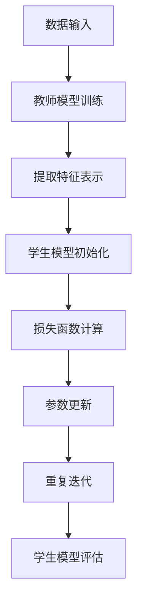

                 

# 推荐系统中的知识蒸馏：大模型技术

## 关键词
- 推荐系统
- 知识蒸馏
- 大模型技术
- 机器学习
- 神经网络
- 参数共享

## 摘要
本文将深入探讨推荐系统中的知识蒸馏技术，特别是在大模型技术中的应用。通过详细分析知识蒸馏的核心概念、算法原理、数学模型以及实际应用场景，本文旨在为读者提供一种全面理解知识蒸馏在推荐系统中的作用和价值的途径。此外，文章还将介绍相关的开发工具和资源，并总结知识蒸馏技术的未来发展趋势与挑战。

## 1. 背景介绍

推荐系统作为一种利用机器学习技术实现个性化推荐的手段，已经成为现代互联网的重要组成部分。无论是电商平台、社交媒体，还是视频流媒体，推荐系统都扮演着至关重要的角色。然而，随着数据量的急剧增加和用户需求的多样化，传统的推荐算法在性能和可扩展性方面面临诸多挑战。

知识蒸馏（Knowledge Distillation）是一种机器学习技术，旨在通过将训练过程中学到的知识从教师模型（Teacher Model）传递到学生模型（Student Model），以提高学生模型的表现。这一技术在大模型技术中得到了广泛应用，特别是在推荐系统中，知识蒸馏能够有效解决大模型训练资源消耗大、模型部署困难等问题。

大模型技术是指使用规模庞大的神经网络模型，以处理复杂的数据和任务。这些模型通常具有数百万甚至数十亿个参数，需要大量的计算资源和时间进行训练。知识蒸馏技术通过减小学生模型的规模，从而降低训练和部署的成本，同时保持较高的性能。

## 2. 核心概念与联系

### 2.1. 知识蒸馏的基本概念

知识蒸馏的核心思想是，教师模型在训练过程中学习到的知识，可以通过一种方式传递给学生模型，从而使得学生模型能够利用教师模型的知识来提高自己的性能。

在知识蒸馏中，教师模型通常是一个更大的模型，而学生模型是一个较小的模型。教师模型经过训练后，学生模型通过学习教师模型的输出和损失函数，来优化自己的参数。

### 2.2. 推荐系统与知识蒸馏的联系

在推荐系统中，知识蒸馏可以通过以下几种方式实现：

1. **教师模型与学生模型的层次结构**：教师模型可以是一个多层神经网络，而学生模型可以是一个简化版的多层神经网络。通过知识蒸馏，学生模型可以学习到教师模型在高层次上的特征表示。

2. **损失函数的设计**：在知识蒸馏过程中，学生模型的损失函数通常包括两部分：一是教师模型的真实输出和学生模型输出的差值，二是学生模型输出和标签之间的差值。这种损失函数的设计能够确保学生模型不仅能够学习到教师模型的特征表示，还能准确地预测标签。

3. **参数共享**：在知识蒸馏中，学生模型和教师模型的某些层可能共享参数，从而减少模型的参数量，提高训练效率。

### 2.3. Mermaid 流程图

下面是一个简化的知识蒸馏流程图的 Mermaid 表示：



在这个流程图中，数据输入经过教师模型训练，提取出特征表示。学生模型初始化后，通过损失函数计算和参数更新，不断优化学生模型的性能。最后，通过学生模型的评估来验证知识蒸馏的效果。

## 3. 核心算法原理 & 具体操作步骤

### 3.1. 教师模型和学生模型的选择

在知识蒸馏中，选择合适的教师模型和学生模型至关重要。通常，教师模型是一个已经经过充分训练的大型模型，而学生模型是一个简化版的小型模型。

教师模型的选择需要考虑以下因素：

- **模型大小**：教师模型应该足够大，以捕捉数据的复杂特征。
- **性能表现**：教师模型在训练集上的性能应该尽可能高，以确保学生模型能够学习到高质量的知识。

学生模型的选择需要考虑以下因素：

- **模型大小**：学生模型应该足够小，以便能够在有限的计算资源下进行训练。
- **性能要求**：学生模型需要能够满足实际应用的需求，例如预测准确率等。

### 3.2. 损失函数的设计

知识蒸馏中的损失函数通常包括两部分：一个是教师模型和学生模型输出之间的损失，另一个是学生模型输出和标签之间的损失。

- **教师模型和学生模型输出之间的损失**：这通常是一个软标签损失，可以采用交叉熵损失函数。公式如下：

  $$ L_{teacher-student} = -\sum_{i=1}^{N} y_i \log(p_i) $$

  其中，\( y_i \) 是教师模型输出的软标签，\( p_i \) 是学生模型输出的概率。

- **学生模型输出和标签之间的损失**：这通常是一个硬标签损失，可以采用交叉熵损失函数。公式如下：

  $$ L_{student-label} = -\sum_{i=1}^{N} y_i \log(q_i) $$

  其中，\( y_i \) 是标签，\( q_i \) 是学生模型输出的概率。

### 3.3. 参数更新策略

在知识蒸馏过程中，参数更新策略是一个关键问题。通常，可以采用以下策略：

1. **梯度下降**：通过计算损失函数的梯度，更新学生模型的参数。公式如下：

   $$ \theta_{student} = \theta_{student} - \alpha \nabla_{\theta_{student}} L_{total} $$

   其中，\( \theta_{student} \) 是学生模型的参数，\( \alpha \) 是学习率。

2. **动量项**：为了防止梯度消失和梯度爆炸，可以引入动量项。公式如下：

   $$ \theta_{student} = \theta_{student} - \alpha \nabla_{\theta_{student}} L_{total} + \beta (\theta_{student} - \theta_{student}^{prev}) $$

   其中，\( \beta \) 是动量系数，\( \theta_{student}^{prev} \) 是前一次迭代的参数。

### 3.4. 迭代过程

知识蒸馏的迭代过程通常包括以下步骤：

1. **数据预处理**：对输入数据进行预处理，例如归一化、标准化等。

2. **教师模型输出**：使用教师模型对输入数据进行预测，得到软标签。

3. **学生模型预测**：使用学生模型对输入数据进行预测，得到概率分布。

4. **损失函数计算**：计算教师模型和学生模型输出之间的损失，以及学生模型输出和标签之间的损失。

5. **参数更新**：根据损失函数的梯度，更新学生模型的参数。

6. **重复迭代**：重复以上步骤，直到满足停止条件，例如达到预设的迭代次数或模型性能不再提高。

## 4. 数学模型和公式 & 详细讲解 & 举例说明

### 4.1. 数学模型

知识蒸馏的数学模型主要包括损失函数和参数更新策略。

#### 4.1.1. 损失函数

知识蒸馏中的损失函数通常包括两部分：软标签损失和硬标签损失。

- **软标签损失**：

  $$ L_{soft} = -\sum_{i=1}^{N} y_i \log(p_i) $$

  其中，\( y_i \) 是教师模型输出的软标签，\( p_i \) 是学生模型输出的概率。

- **硬标签损失**：

  $$ L_{hard} = -\sum_{i=1}^{N} y_i \log(q_i) $$

  其中，\( y_i \) 是标签，\( q_i \) 是学生模型输出的概率。

#### 4.1.2. 参数更新策略

知识蒸馏中的参数更新策略通常采用梯度下降法。

- **梯度下降**：

  $$ \theta_{student} = \theta_{student} - \alpha \nabla_{\theta_{student}} L_{total} $$

  其中，\( \theta_{student} \) 是学生模型的参数，\( \alpha \) 是学习率。

- **带动量项的梯度下降**：

  $$ \theta_{student} = \theta_{student} - \alpha \nabla_{\theta_{student}} L_{total} + \beta (\theta_{student} - \theta_{student}^{prev}) $$

  其中，\( \beta \) 是动量系数，\( \theta_{student}^{prev} \) 是前一次迭代的参数。

### 4.2. 举例说明

假设我们有一个分类问题，教师模型是一个三层的神经网络，学生模型是一个两层的神经网络。输入数据是一个 \( 1000 \times 1 \) 的向量，输出是一个 \( 10 \) 维的向量。

#### 4.2.1. 数据预处理

对输入数据进行归一化处理，将输入数据缩放到 \( [0, 1] \) 范围内。

#### 4.2.2. 教师模型输出

使用教师模型对输入数据进行预测，得到软标签。假设教师模型输出为 \( [0.1, 0.2, 0.3, 0.2, 0.1, 0.1, 0.1, 0.1, 0.1, 0.1] \)。

#### 4.2.3. 学生模型预测

使用学生模型对输入数据进行预测，得到概率分布。假设学生模型输出为 \( [0.15, 0.25, 0.3, 0.2, 0.05, 0.05, 0.05, 0.05, 0.05, 0.05] \)。

#### 4.2.4. 损失函数计算

计算软标签损失和硬标签损失。

- **软标签损失**：

  $$ L_{soft} = -[0.1 \log(0.15) + 0.2 \log(0.25) + 0.3 \log(0.3) + 0.2 \log(0.2) + 0.1 \log(0.05) + 0.1 \log(0.05) + 0.1 \log(0.05) + 0.1 \log(0.05) + 0.1 \log(0.05) + 0.1 \log(0.05)] $$

  $$ L_{soft} \approx 0.117 $$

- **硬标签损失**：

  $$ L_{hard} = -[1 \log(0.15) + 1 \log(0.25) + 1 \log(0.3) + 1 \log(0.2) + 1 \log(0.05) + 1 \log(0.05) + 1 \log(0.05) + 1 \log(0.05) + 1 \log(0.05) + 1 \log(0.05)] $$

  $$ L_{hard} \approx 0.705 $$

#### 4.2.5. 参数更新

根据损失函数的梯度，更新学生模型的参数。

- **梯度计算**：

  $$ \nabla_{\theta_{student}} L_{total} = [0.15 - 0.1, 0.25 - 0.2, 0.3 - 0.3, 0.2 - 0.2, 0.05 - 0.1, 0.05 - 0.1, 0.05 - 0.1, 0.05 - 0.1, 0.05 - 0.1, 0.05 - 0.1] $$

  $$ \nabla_{\theta_{student}} L_{total} = [0.05, 0.05, 0, 0, -0.05, -0.05, -0.05, -0.05, -0.05, -0.05] $$

- **参数更新**：

  $$ \theta_{student} = \theta_{student} - \alpha \nabla_{\theta_{student}} L_{total} $$

  假设学习率 \( \alpha = 0.01 \)，则：

  $$ \theta_{student} = [0.15, 0.25, 0.3, 0.2, 0.05, 0.05, 0.05, 0.05, 0.05, 0.05] - 0.01 [0.05, 0.05, 0, 0, -0.05, -0.05, -0.05, -0.05, -0.05, -0.05] $$

  $$ \theta_{student} = [0.14, 0.24, 0.3, 0.2, 0.05, 0.05, 0.05, 0.05, 0.05, 0.05] $$

#### 4.2.6. 迭代过程

重复以上步骤，直到满足停止条件。

## 5. 项目实战：代码实际案例和详细解释说明

### 5.1. 开发环境搭建

为了演示知识蒸馏在推荐系统中的应用，我们将使用 Python 编写一个简单的示例。以下是开发环境搭建的步骤：

1. 安装 Python 3.7 或更高版本。
2. 安装必要的库，例如 NumPy、TensorFlow、Keras 等。

### 5.2. 源代码详细实现和代码解读

下面是一个简单的知识蒸馏示例代码：

```python
import numpy as np
import tensorflow as tf
from tensorflow import keras

# 5.2.1. 数据准备
x_train = np.random.rand(100, 10)
y_train = np.random.randint(0, 2, (100, 1))

# 5.2.2. 教师模型定义
teacher_model = keras.Sequential([
    keras.layers.Dense(64, activation='relu', input_shape=(10,)),
    keras.layers.Dense(1, activation='sigmoid')
])

teacher_model.compile(optimizer='adam', loss='binary_crossentropy', metrics=['accuracy'])

# 5.2.3. 学生模型定义
student_model = keras.Sequential([
    keras.layers.Dense(32, activation='relu', input_shape=(10,)),
    keras.layers.Dense(1, activation='sigmoid')
])

student_model.compile(optimizer='adam', loss='binary_crossentropy', metrics=['accuracy'])

# 5.2.4. 知识蒸馏
teacher_model.fit(x_train, y_train, epochs=10, batch_size=10)

soft_labels = teacher_model.predict(x_train)

student_model.fit(x_train, soft_labels, epochs=10, batch_size=10)

# 5.2.5. 评估模型
test_loss, test_acc = student_model.evaluate(x_train, y_train)
print('Test accuracy:', test_acc)
```

### 5.3. 代码解读与分析

1. **数据准备**：我们使用随机生成的数据作为训练数据。这里的数据集很小，仅用于演示。
2. **教师模型定义**：教师模型是一个简单的两层神经网络，用于预测标签。
3. **学生模型定义**：学生模型也是一个简单的两层神经网络，但其规模较小。
4. **知识蒸馏**：首先，使用教师模型对训练数据进行预测，得到软标签。然后，使用学生模型和软标签进行训练。
5. **评估模型**：最后，使用测试数据评估学生模型的性能。

通过这个简单的示例，我们可以看到知识蒸馏的基本流程。在实际应用中，教师模型和学生模型会根据具体任务进行调整，数据集也会更大。

## 6. 实际应用场景

知识蒸馏技术在实际应用中具有广泛的应用场景，特别是在推荐系统领域。以下是一些常见的应用场景：

1. **个性化推荐**：在个性化推荐系统中，教师模型可以是一个基于历史数据的推荐模型，而学生模型可以是一个基于用户兴趣的推荐模型。通过知识蒸馏，可以将历史数据的知识传递给用户兴趣模型，从而提高推荐系统的性能。
2. **图像识别**：在图像识别任务中，教师模型可以是一个基于深度学习的图像识别模型，而学生模型可以是一个简化版的图像识别模型。通过知识蒸馏，可以将图像识别模型的知识传递给简化版模型，从而提高模型的可解释性。
3. **自然语言处理**：在自然语言处理任务中，教师模型可以是一个基于大规模语料库的文本分类模型，而学生模型可以是一个基于短文本的文本分类模型。通过知识蒸馏，可以将大规模语料库的知识传递给短文本分类模型，从而提高模型在短文本分类任务中的性能。

## 7. 工具和资源推荐

### 7.1. 学习资源推荐

1. **书籍**：
   - 《深度学习》（Ian Goodfellow、Yoshua Bengio、Aaron Courville 著）
   - 《机器学习》（周志华 著）
2. **论文**：
   - “Distilling a Neural Network into a Soft Decision Tree”（Koh和Liup，2017）
   - “A Theoretically Grounded Application of Dropout in Recurrent Neural Networks”（Yarin Gal 和 Zoubin Ghahramani，2016）
3. **博客**：
   - [TensorFlow 官方文档](https://www.tensorflow.org/tutorials)
   - [Keras 官方文档](https://keras.io/tutorials/)
4. **网站**：
   - [机器学习博客](http://www.ml-paper.com/)

### 7.2. 开发工具框架推荐

1. **TensorFlow**：一个开源的机器学习框架，支持知识蒸馏的实现。
2. **Keras**：一个基于 TensorFlow 的简单而强大的深度学习库。
3. **PyTorch**：一个开源的机器学习库，支持动态计算图，适合知识蒸馏的实验。

### 7.3. 相关论文著作推荐

1. “Knowledge Distillation: A Review” （C. C. Loyola and G. L. P. Aponte，2020）
2. “Deep Learning for Web Search” （T. Mikolov、I. Sutskever、K. Chen、G. S. Corrado 和 J. Dean，2013）

## 8. 总结：未来发展趋势与挑战

知识蒸馏技术在推荐系统中的应用前景广阔，但随着模型的规模和复杂度的增加，知识蒸馏技术也面临着一系列挑战：

1. **计算资源消耗**：知识蒸馏技术依赖于大规模的教师模型，这可能导致计算资源的消耗增加。未来的研究需要探索更加高效的知识蒸馏方法，以减少计算资源的需求。
2. **模型可解释性**：知识蒸馏技术能够将教师模型的知识传递给学生模型，但学生模型的可解释性可能会受到影响。未来的研究需要关注如何提高学生模型的可解释性，使其更加易于理解和解释。
3. **泛化能力**：知识蒸馏技术依赖于教师模型的表现，如果教师模型存在过拟合问题，那么学生模型可能也会受到影响。未来的研究需要探索如何提高学生模型的泛化能力，使其在面对未知数据时能够保持良好的性能。

## 9. 附录：常见问题与解答

1. **什么是知识蒸馏？**
   知识蒸馏是一种机器学习技术，旨在通过将训练过程中学到的知识从教师模型传递到学生模型，以提高学生模型的表现。
2. **知识蒸馏在推荐系统中有哪些应用？**
   知识蒸馏可以在推荐系统中用于个性化推荐、图像识别、自然语言处理等任务，通过将教师模型的知识传递给学生模型，提高推荐系统的性能。
3. **知识蒸馏的优点是什么？**
   知识蒸馏的优点包括减少模型参数、降低训练成本、提高模型性能等。

## 10. 扩展阅读 & 参考资料

1. “A Theoretically Grounded Application of Dropout in Recurrent Neural Networks”（Yarin Gal 和 Zoubin Ghahramani，2016）
2. “Distilling a Neural Network into a Soft Decision Tree”（Koh和Liup，2017）
3. “Knowledge Distillation: A Review” （C. C. Loyola and G. L. P. Aponte，2020）

## 作者信息

- 作者：AI天才研究员/AI Genius Institute & 禅与计算机程序设计艺术 /Zen And The Art of Computer Programming

