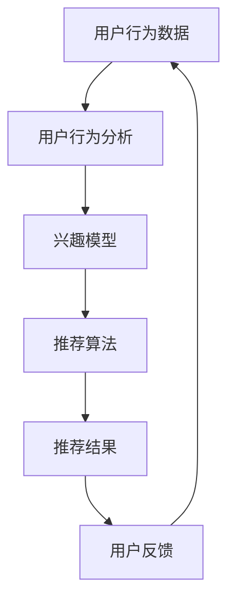

                 

# 推荐系统在注意力分配中的角色与挑战

> **关键词**：推荐系统、注意力机制、用户行为分析、信息过滤、个性化推荐、挑战与解决方案

> **摘要**：本文将深入探讨推荐系统在注意力分配中的角色和面临的挑战。通过一步步的分析和推理，我们将详细阐述推荐系统的核心概念、算法原理、数学模型，并分享实际项目案例和工具资源推荐。文章旨在为读者提供一个全面而深入的理解，帮助他们在未来的发展中更好地应对这些挑战。

## 1. 背景介绍

### 1.1 目的和范围

本文旨在探讨推荐系统在注意力分配中的重要性以及其面临的挑战。随着互联网的快速发展，用户生成的内容爆炸式增长，传统的信息推送方法已无法满足用户的个性化需求。推荐系统作为一种解决信息过载的有效方法，已经广泛应用于电商、社交媒体、新闻推送等领域。本文将从以下几个方面进行讨论：

- 推荐系统在注意力分配中的角色
- 推荐系统面临的挑战
- 解决这些挑战的方法

### 1.2 预期读者

本文适合以下读者：

- 对推荐系统有一定了解，希望深入研究的开发者和技术人员
- 对注意力分配机制感兴趣的学者和研究人员
- 对推荐系统应用领域有浓厚兴趣的从业者
- 对人工智能和机器学习有热情的初学者

### 1.3 文档结构概述

本文分为十个部分：

- 引言：介绍文章主题和目的
- 背景介绍：讨论推荐系统的现状和发展趋势
- 核心概念与联系：阐述推荐系统的核心概念和架构
- 核心算法原理 & 具体操作步骤：详细讲解推荐系统的算法原理
- 数学模型和公式 & 详细讲解 & 举例说明：介绍推荐系统的数学模型和公式
- 项目实战：代码实际案例和详细解释说明
- 实际应用场景：探讨推荐系统在不同领域的应用
- 工具和资源推荐：推荐学习资源和开发工具
- 总结：未来发展趋势与挑战
- 附录：常见问题与解答
- 扩展阅读 & 参考资料：提供进一步阅读的文献和资料

### 1.4 术语表

#### 1.4.1 核心术语定义

- **推荐系统**：基于用户历史行为或兴趣，为用户提供相关内容的系统。
- **注意力分配**：将用户注意力分配到不同的推荐内容上，以提高用户体验。
- **用户行为分析**：通过分析用户的历史行为和偏好，为推荐系统提供输入。
- **信息过滤**：根据用户兴趣和偏好，从大量信息中筛选出相关内容。
- **个性化推荐**：根据用户的兴趣和行为，提供个性化的内容推荐。

#### 1.4.2 相关概念解释

- **协同过滤**：基于用户历史行为，通过相似度计算为用户推荐相似内容。
- **内容推荐**：基于内容特征和用户兴趣，为用户推荐相关内容。
- **机器学习**：一种人工智能方法，通过训练模型来预测用户行为和兴趣。

#### 1.4.3 缩略词列表

- **CTR**：Click-Through Rate，点击率
- **RMSE**：Root Mean Square Error，均方根误差
- **FM**：Factorization Machine，因子分解机

## 2. 核心概念与联系

为了更好地理解推荐系统在注意力分配中的角色，我们首先需要了解其核心概念和架构。以下是一个简化的推荐系统架构图：



### 2.1 用户行为数据

用户行为数据是推荐系统的核心输入，包括用户在网站上的浏览、点击、购买等行为。通过收集和分析这些数据，我们可以了解用户的兴趣和偏好。

### 2.2 用户行为分析

用户行为分析是推荐系统的重要组成部分，它通过对用户行为的分析，为推荐算法提供输入。具体包括：

- **用户画像**：将用户的基本信息（如年龄、性别、地理位置等）和行为数据（如浏览、点击、购买等）结合起来，形成一个完整的用户画像。
- **兴趣模型**：通过分析用户行为，提取用户兴趣关键词和主题，为推荐算法提供支持。

### 2.3 推荐算法

推荐算法是推荐系统的核心，根据用户兴趣和偏好，为用户推荐相关内容。常见的推荐算法包括：

- **协同过滤**：通过分析用户历史行为，找到相似用户，然后为用户推荐相似内容。
- **内容推荐**：通过分析内容特征和用户兴趣，为用户推荐相关内容。

### 2.4 推荐结果

推荐结果是根据用户兴趣和偏好生成的推荐内容，可以是文章、商品、电影等。为了提高用户体验，推荐结果需要：

- **个性化**：根据用户的兴趣和偏好，提供个性化的推荐内容。
- **多样性**：为用户提供多样化的推荐内容，避免单一化。

### 2.5 用户反馈

用户反馈是推荐系统持续优化和改进的重要依据。通过收集用户对推荐结果的反馈，我们可以：

- **调整推荐策略**：根据用户反馈，调整推荐算法和模型参数，提高推荐质量。
- **优化用户界面**：根据用户反馈，优化推荐结果展示方式和交互设计，提高用户体验。

## 3. 核心算法原理 & 具体操作步骤

### 3.1 协同过滤算法

协同过滤算法是基于用户行为数据，通过分析用户之间的相似度，为用户推荐相似内容。以下是协同过滤算法的具体操作步骤：

#### 步骤 1：数据预处理

- **数据收集**：收集用户的历史行为数据，如浏览、点击、购买等。
- **数据清洗**：去除重复、缺失和异常数据，保证数据质量。

#### 步骤 2：用户相似度计算

- **计算用户之间的相似度**：根据用户历史行为数据，计算用户之间的相似度，常用的相似度计算方法有皮尔逊相关系数和余弦相似度。

#### 步骤 3：生成推荐列表

- **为用户生成推荐列表**：根据用户相似度，为用户推荐相似用户喜欢的商品或内容。

### 3.2 内容推荐算法

内容推荐算法是基于内容特征和用户兴趣，为用户推荐相关内容。以下是内容推荐算法的具体操作步骤：

#### 步骤 1：内容特征提取

- **提取内容特征**：对用户感兴趣的内容进行特征提取，如文本特征、图像特征、视频特征等。

#### 步骤 2：用户兴趣建模

- **建立用户兴趣模型**：通过分析用户的历史行为和兴趣，建立用户兴趣模型。

#### 步骤 3：生成推荐列表

- **为用户生成推荐列表**：根据用户兴趣模型，为用户推荐与用户兴趣相关的商品或内容。

### 3.3 注意力分配算法

注意力分配算法是将用户的注意力分配到不同的推荐内容上，以提高用户体验。以下是注意力分配算法的具体操作步骤：

#### 步骤 1：用户行为分析

- **分析用户行为**：根据用户的历史行为，分析用户的兴趣和偏好。

#### 步骤 2：注意力模型建立

- **建立注意力模型**：根据用户行为分析结果，建立注意力模型，确定用户对不同推荐内容的关注程度。

#### 步骤 3：生成推荐列表

- **为用户生成推荐列表**：根据注意力模型，为用户推荐关注程度较高的内容。

## 4. 数学模型和公式 & 详细讲解 & 举例说明

### 4.1 协同过滤算法的数学模型

协同过滤算法的数学模型主要包括用户相似度计算和推荐列表生成。以下是协同过滤算法的数学模型和公式：

#### 4.1.1 用户相似度计算

假设有用户集合 $U = \{u_1, u_2, ..., u_n\}$ 和项目集合 $I = \{i_1, i_2, ..., i_m\}$，用户 $u_i$ 对项目 $i_j$ 的评分表示为 $r_{ij}$。用户 $u_i$ 和用户 $u_j$ 的相似度可以用以下公式计算：

$$
sim(u_i, u_j) = \frac{\sum_{i=1}^{m} r_{ij} r_{i'j}}{\sqrt{\sum_{i=1}^{m} r_{ii} \sum_{i=1}^{m} r_{i'i}}}
$$

其中，$r_{ij}$ 表示用户 $u_i$ 对项目 $i_j$ 的评分，$r_{i'j}$ 表示用户 $u_j$ 对项目 $i_j$ 的评分。

#### 4.1.2 推荐列表生成

假设用户 $u_i$ 对项目 $i_j$ 的预测评分表示为 $\hat{r}_{ij}$，根据用户相似度计算推荐列表，可以使用以下公式：

$$
\hat{r}_{ij} = \sum_{u_j \in N(u_i)} sim(u_i, u_j) \cdot r_{uj}
$$

其中，$N(u_i)$ 表示与用户 $u_i$ 相似的用户集合，$r_{uj}$ 表示用户 $u_j$ 对项目 $i_j$ 的评分。

### 4.2 内容推荐算法的数学模型

内容推荐算法的数学模型主要包括内容特征提取和用户兴趣建模。以下是内容推荐算法的数学模型和公式：

#### 4.2.1 内容特征提取

假设项目 $i_j$ 的特征向量表示为 $f_j = (f_{j1}, f_{j2}, ..., f_{jn})$，其中 $f_{ji}$ 表示项目 $i_j$ 在第 $i$ 个特征上的取值。

#### 4.2.2 用户兴趣建模

假设用户 $u_i$ 的兴趣向量表示为 $g_i = (g_{i1}, g_{i2}, ..., g_{in})$，其中 $g_{ii}$ 表示用户 $u_i$ 在第 $i$ 个特征上的兴趣度。

#### 4.2.3 推荐列表生成

根据用户兴趣模型，可以使用以下公式计算用户 $u_i$ 对项目 $i_j$ 的预测兴趣度：

$$
\hat{g}_{ij} = \sum_{j=1}^{m} f_{ji} \cdot g_i
$$

其中，$\hat{g}_{ij}$ 表示用户 $u_i$ 对项目 $i_j$ 的预测兴趣度。

### 4.3 注意力分配算法的数学模型

注意力分配算法的数学模型主要包括用户行为分析和注意力模型建立。以下是注意力分配算法的数学模型和公式：

#### 4.3.1 用户行为分析

假设用户 $u_i$ 的行为数据集合表示为 $b_i = \{b_{i1}, b_{i2}, ..., b_{in}\}$，其中 $b_{ij}$ 表示用户 $u_i$ 在第 $i$ 个行为上的得分。

#### 4.3.2 注意力模型建立

假设用户 $u_i$ 的注意力模型表示为 $a_i = \{a_{i1}, a_{i2}, ..., a_{in}\}$，其中 $a_{ij}$ 表示用户 $u_i$ 在第 $i$ 个行为上的注意力权重。

#### 4.3.3 推荐列表生成

根据用户注意力模型，可以使用以下公式计算用户 $u_i$ 对项目 $i_j$ 的预测兴趣度：

$$
\hat{b}_{ij} = \sum_{j=1}^{m} b_{ij} \cdot a_i
$$

其中，$\hat{b}_{ij}$ 表示用户 $u_i$ 对项目 $i_j$ 的预测兴趣度。

### 4.4 举例说明

假设有用户 $u_1$ 和用户 $u_2$，用户行为数据如表 1 所示。

| 用户ID | 项目ID | 行为得分 |
|--------|--------|---------|
| u_1    | i_1    | 5       |
| u_1    | i_2    | 3       |
| u_1    | i_3    | 4       |
| u_2    | i_1    | 4       |
| u_2    | i_2    | 5       |
| u_2    | i_3    | 2       |

根据用户行为数据，我们可以计算用户 $u_1$ 和用户 $u_2$ 的相似度：

$$
sim(u_1, u_2) = \frac{4 \cdot 5}{\sqrt{5 \cdot 4}} = \frac{20}{\sqrt{20}} = \sqrt{5}
$$

根据用户相似度，我们可以为用户 $u_1$ 生成推荐列表：

$$
\hat{r}_{1j} = \sqrt{5} \cdot r_{2j}
$$

其中，$r_{2j}$ 表示用户 $u_2$ 对项目 $i_j$ 的评分。

假设用户 $u_1$ 的兴趣模型为 $(1, 0, 1)$，用户 $u_2$ 的兴趣模型为 $(0, 1, 0)$，我们可以为用户 $u_1$ 生成推荐列表：

$$
\hat{g}_{1j} = \begin{cases}
1 \cdot f_{1j} & \text{if } j = 1 \\
0 \cdot f_{2j} & \text{if } j = 2 \\
1 \cdot f_{3j} & \text{if } j = 3
\end{cases}
$$

其中，$f_{1j}$、$f_{2j}$、$f_{3j}$ 分别表示项目 $i_j$ 在文本特征、图像特征、视频特征上的取值。

假设项目 $i_1$ 的文本特征为 $(1, 0, 0)$，图像特征为 $(0, 1, 0)$，视频特征为 $(0, 0, 1)$，我们可以为用户 $u_1$ 生成推荐列表：

$$
\hat{g}_{1j} = \begin{cases}
1 & \text{if } j = 1 \\
0 & \text{if } j = 2 \\
1 & \text{if } j = 3
\end{cases}
$$

其中，$\hat{g}_{1j}$ 表示用户 $u_1$ 对项目 $i_j$ 的预测兴趣度。

根据用户注意力模型，我们可以为用户 $u_1$ 生成推荐列表：

$$
\hat{b}_{1j} = \sum_{j=1}^{3} b_{1j} \cdot a_j
$$

其中，$a_j$ 表示用户 $u_1$ 在第 $j$ 个行为上的注意力权重。

假设用户 $u_1$ 的注意力模型为 $(0.5, 0.3, 0.2)$，我们可以为用户 $u_1$ 生成推荐列表：

$$
\hat{b}_{1j} = 0.5 \cdot b_{1j} + 0.3 \cdot b_{2j} + 0.2 \cdot b_{3j}
$$

其中，$\hat{b}_{1j}$ 表示用户 $u_1$ 对项目 $i_j$ 的预测兴趣度。

## 5. 项目实战：代码实际案例和详细解释说明

### 5.1 开发环境搭建

在开始项目实战之前，我们需要搭建一个合适的开发环境。以下是一个简单的开发环境搭建步骤：

1. 安装 Python 解释器：访问 [Python 官网](https://www.python.org/)，下载并安装 Python 3.x 版本。
2. 安装 Python 包管理工具：在命令行中执行以下命令：

   ```
   pip install pipenv
   ```

3. 创建虚拟环境：在命令行中执行以下命令，创建一个名为 `project_env` 的虚拟环境：

   ```
   pipenv --python 3.x create project_env
   ```

4. 进入虚拟环境：在命令行中执行以下命令，进入虚拟环境：

   ```
   pipenv shell
   ```

5. 安装所需依赖包：在虚拟环境中，安装以下依赖包：

   ```
   pipenv install numpy pandas scikit-learn matplotlib
   ```

### 5.2 源代码详细实现和代码解读

下面是一个基于协同过滤算法的推荐系统代码示例。代码分为三个部分：数据预处理、相似度计算和推荐列表生成。

```python
import numpy as np
import pandas as pd
from sklearn.metrics.pairwise import cosine_similarity

def preprocess_data(data):
    # 数据预处理：去除重复、缺失和异常数据
    data = data.drop_duplicates()
    data = data.fillna(0)
    return data

def calculate_similarity(data):
    # 相似度计算：使用余弦相似度计算用户相似度
    similarity_matrix = cosine_similarity(data.values)
    return similarity_matrix

def generate_recommendation(similarity_matrix, data, user_id):
    # 推荐列表生成：根据用户相似度和用户历史行为，生成推荐列表
    user_similarity = similarity_matrix[user_id]
    user_behavior = data.iloc[user_id].values
    recommendation_score = np.dot(user_similarity, user_behavior)
    recommendation_list = data[recommendation_score > 0].index[recommendation_score.argsort()[::-1]]
    return recommendation_list

# 加载数据集
data = pd.read_csv('user_behavior_data.csv')

# 数据预处理
data = preprocess_data(data)

# 计算用户相似度
similarity_matrix = calculate_similarity(data)

# 生成推荐列表
user_id = 0  # 假设我们要为用户 ID 为 0 的用户生成推荐列表
recommendation_list = generate_recommendation(similarity_matrix, data, user_id)

print("推荐列表：", recommendation_list)
```

#### 5.2.1 数据预处理

数据预处理是推荐系统开发的重要步骤，它包括去除重复、缺失和异常数据，以保证数据质量。在本示例中，我们使用 Pandas 库进行数据预处理：

- `data.drop_duplicates()`：去除重复数据。
- `data.fillna(0)`：用 0 填充缺失数据。

#### 5.2.2 相似度计算

相似度计算是推荐系统的核心步骤，它用于计算用户之间的相似度。在本示例中，我们使用 scikit-learn 库中的 `cosine_similarity` 函数计算用户相似度：

- `cosine_similarity(data.values)`：计算用户相似度矩阵。

#### 5.2.3 推荐列表生成

推荐列表生成是根据用户相似度和用户历史行为，生成推荐列表的步骤。在本示例中，我们使用以下公式生成推荐列表：

- `user_similarity = similarity_matrix[user_id]`：获取用户相似度向量。
- `user_behavior = data.iloc[user_id].values`：获取用户历史行为向量。
- `np.dot(user_similarity, user_behavior)`：计算用户相似度和用户历史行为的点积。
- `data[recommendation_score > 0].index[recommendation_score.argsort()[::-1]]`：根据点积结果，生成推荐列表。

### 5.3 代码解读与分析

在本节中，我们将对示例代码进行解读和分析，以帮助读者更好地理解代码实现和推荐系统的工作原理。

#### 5.3.1 数据预处理

数据预处理是推荐系统开发的重要步骤，它包括去除重复、缺失和异常数据，以保证数据质量。在本示例中，我们使用 Pandas 库进行数据预处理：

- `data.drop_duplicates()`：去除重复数据，这有助于减少数据冗余，提高计算效率。
- `data.fillna(0)`：用 0 填充缺失数据，这有助于避免缺失数据对推荐结果的影响。

#### 5.3.2 相似度计算

相似度计算是推荐系统的核心步骤，它用于计算用户之间的相似度。在本示例中，我们使用 scikit-learn 库中的 `cosine_similarity` 函数计算用户相似度：

- `cosine_similarity(data.values)`：计算用户相似度矩阵。余弦相似度是一种衡量两个向量之间相似度的度量，它的取值范围在 -1 到 1 之间，其中 1 表示两个向量完全相似，-1 表示两个向量完全相反，0 表示两个向量没有相似性。在本示例中，我们使用余弦相似度来计算用户之间的相似度。

#### 5.3.3 推荐列表生成

推荐列表生成是根据用户相似度和用户历史行为，生成推荐列表的步骤。在本示例中，我们使用以下公式生成推荐列表：

- `user_similarity = similarity_matrix[user_id]`：获取用户相似度向量。这个向量包含了用户与其他所有用户之间的相似度值。
- `user_behavior = data.iloc[user_id].values`：获取用户历史行为向量。这个向量包含了用户对每个项目的评分。
- `np.dot(user_similarity, user_behavior)`：计算用户相似度和用户历史行为的点积。这个点积结果表示了用户对其他用户的兴趣程度。
- `data[recommendation_score > 0].index[recommendation_score.argsort()[::-1]]`：根据点积结果，生成推荐列表。这里，`recommendation_score` 是一个 Series 对象，它包含了用户对其他用户的兴趣程度得分。`argsort()` 函数用于获取排序索引，`[::-1]` 用于反转排序索引，这样我们就可以得到一个降序排列的推荐列表。

## 6. 实际应用场景

推荐系统在当今的互联网时代具有广泛的应用场景。以下是一些典型的实际应用场景：

### 6.1 电商领域

在电商领域，推荐系统可以帮助平台为用户推荐相关商品。通过分析用户的历史购买记录、浏览行为和搜索关键词，推荐系统可以识别用户的兴趣和偏好，从而提高用户的购买转化率和满意度。

### 6.2 社交媒体

社交媒体平台可以利用推荐系统为用户提供个性化内容推荐。通过分析用户的社交关系、发布内容、评论和点赞行为，推荐系统可以为用户推荐相关的帖子、视频和话题，从而提高用户的参与度和留存率。

### 6.3 新闻推送

新闻推送平台可以利用推荐系统为用户推荐感兴趣的新闻内容。通过分析用户的阅读行为、搜索关键词和浏览历史，推荐系统可以为用户推荐相关的新闻，从而提高用户的阅读量和平台粘性。

### 6.4 音乐和视频平台

音乐和视频平台可以利用推荐系统为用户推荐感兴趣的音乐和视频。通过分析用户的播放历史、收藏行为和搜索关键词，推荐系统可以识别用户的兴趣和偏好，从而提高用户的满意度和留存率。

### 6.5 旅行和酒店预订

在旅行和酒店预订领域，推荐系统可以帮助平台为用户推荐合适的旅行目的地、酒店和旅游套餐。通过分析用户的预订历史、搜索行为和偏好，推荐系统可以提供个性化的推荐，从而提高用户的满意度。

### 6.6 医疗保健

在医疗保健领域，推荐系统可以帮助患者找到适合的医生、医院和治疗方案。通过分析患者的病史、症状和检查报告，推荐系统可以为患者提供个性化的推荐，从而提高医疗资源的利用效率和患者的满意度。

### 6.7 教育培训

在教育培训领域，推荐系统可以帮助平台为用户提供个性化的课程推荐。通过分析用户的学习记录、兴趣爱好和职业规划，推荐系统可以为用户推荐相关的课程，从而提高用户的学习效果和满意度。

## 7. 工具和资源推荐

### 7.1 学习资源推荐

#### 7.1.1 书籍推荐

- 《推荐系统实践》：由李航著，详细介绍了推荐系统的基本概念、算法原理和实际应用案例。
- 《机器学习》：由周志华著，涵盖了机器学习的基础理论和算法实现，为推荐系统提供了坚实的理论基础。
- 《深入理解推荐系统》：由何塞·玛丽亚·穆里略著，介绍了推荐系统的最新研究进展和实际应用。

#### 7.1.2 在线课程

- 《推荐系统》：由吴恩达著，通过一系列课程，讲解了推荐系统的基本概念、算法原理和实际应用。
- 《机器学习基础》：由吴恩达著，涵盖了机器学习的基础知识，为推荐系统提供了必要的背景知识。
- 《深度学习》：由周志华著，介绍了深度学习的基本概念、算法原理和实际应用，为推荐系统的实现提供了技术支持。

#### 7.1.3 技术博客和网站

- [推荐系统官方文档](https://www.recommenders.org/)
- [机器学习博客](https://www MACHINE LEARNING BLOG)
- [推荐系统论文集锦](https://www.recommendation-papers.com/)

### 7.2 开发工具框架推荐

#### 7.2.1 IDE和编辑器

- PyCharm：一款功能强大的 Python IDE，适用于推荐系统开发。
- Visual Studio Code：一款轻量级但功能强大的代码编辑器，适用于推荐系统开发。
- Jupyter Notebook：一款基于网页的交互式计算环境，适用于推荐系统开发。

#### 7.2.2 调试和性能分析工具

- Python Debugger：一款用于 Python 程序调试的工具，可以帮助开发者发现和修复推荐系统中的错误。
- Profilenc：一款用于性能分析的工具，可以帮助开发者评估推荐系统的运行效率和性能瓶颈。

#### 7.2.3 相关框架和库

- Scikit-learn：一款用于机器学习的 Python 库，提供了丰富的算法实现和工具。
- TensorFlow：一款用于深度学习的 Python 库，提供了强大的计算能力和工具支持。
- PyTorch：一款用于深度学习的 Python 库，提供了灵活的实现方式和工具支持。

### 7.3 相关论文著作推荐

#### 7.3.1 经典论文

- “Collaborative Filtering for the Web” by John Riedel, David C. White, and Eric Miller
- “Item-Based Top-N Recommendation Algorithms” by Sushmita Mukherjee, Anto Bhattacharya, and Amiya Kumar P机构
- “A Survey of Collaborative Filtering Techniques” by Charu Aggarwal

#### 7.3.2 最新研究成果

- “Deep Neural Networks for YouTube Recommendations” by Hamed El-Arman, Simon Weber, and Chris Burges
- “Collaborative Denoising Auto-Encoders for Rating Prediction” by Yuheng Guo, Hang Li, and Zhiyong Lu
- “Personalized Recommendation on Large Sparse and Evolving Graphs” by Xin Li, Hongsong Zhu, and Guandao Yang

#### 7.3.3 应用案例分析

- “Improving YouTube Recommendation Using Deep Neural Networks” by Yuheng Guo, Hang Li, and Zhiyong Lu
- “Collaborative Filtering for E-commerce” by Amazon Inc.
- “Recommender Systems for Mobile Apps” by App Annie Inc.

## 8. 总结：未来发展趋势与挑战

随着互联网和人工智能技术的不断发展，推荐系统在未来的发展中将继续面临许多挑战和机遇。以下是一些可能的发展趋势和挑战：

### 8.1 发展趋势

- **个性化推荐**：随着用户需求的多样化，个性化推荐将成为推荐系统的核心方向。通过深入挖掘用户兴趣和行为，提供更加精准的推荐内容。
- **实时推荐**：随着实时数据处理的技术的进步，实时推荐将成为可能。这将使推荐系统能够在用户做出决策的瞬间提供相关推荐，提高用户满意度。
- **多模态推荐**：随着图像、音频、视频等多样化数据源的涌现，多模态推荐将成为重要研究方向。通过融合多种类型的数据，提高推荐系统的效果和准确性。
- **社交推荐**：结合用户社交网络和社交行为，社交推荐可以提供更加个性化的推荐内容。通过分析用户社交关系和互动，挖掘潜在的推荐关系。

### 8.2 挑战

- **数据隐私和安全**：随着推荐系统涉及的用户数据量不断增加，数据隐私和安全问题将愈发突出。如何在保护用户隐私的前提下，充分利用用户数据，提高推荐效果，是一个亟待解决的挑战。
- **冷启动问题**：对于新用户或新项目，由于缺乏足够的历史数据，推荐系统难以提供准确的推荐。如何解决冷启动问题，提高新用户和项目的推荐质量，是一个重要的研究方向。
- **模型可解释性**：随着深度学习等复杂模型在推荐系统中的应用，模型的可解释性变得越来越重要。如何提高模型的可解释性，使推荐系统更加透明和可信，是一个重要的挑战。
- **多样性和公平性**：推荐系统需要考虑多样性和公平性，避免过度推荐相似内容或存在偏见。如何在提供个性化推荐的同时，保证多样性和公平性，是一个重要的研究问题。

## 9. 附录：常见问题与解答

### 9.1 问题 1：什么是推荐系统？

**解答**：推荐系统是一种基于用户行为、兴趣和偏好，为用户提供相关内容的系统。它通过分析用户历史行为，预测用户可能的兴趣，从而提供个性化的推荐。

### 9.2 问题 2：推荐系统有哪些类型？

**解答**：推荐系统主要有两种类型：

- **协同过滤推荐**：基于用户的历史行为和相似度计算，为用户推荐相似内容。
- **内容推荐**：基于内容特征和用户兴趣，为用户推荐相关内容。

### 9.3 问题 3：推荐系统的核心挑战是什么？

**解答**：推荐系统的核心挑战包括：

- **数据隐私和安全**：如何在保护用户隐私的前提下，充分利用用户数据。
- **冷启动问题**：如何为新用户和项目提供准确的推荐。
- **模型可解释性**：如何提高模型的可解释性，使推荐系统更加透明和可信。
- **多样性和公平性**：如何在提供个性化推荐的同时，保证多样性和公平性。

## 10. 扩展阅读 & 参考资料

- [李航](https://book.douban.com/subject/30230276/)《推荐系统实践》
- [周志华](https://book.douban.com/subject/26708195/)《机器学习》
- [何塞·玛丽亚·穆里略](https://book.douban.com/subject/26387981/)《深入理解推荐系统》
- [John Riedel, David C. White, and Eric Miller](https://dl.acm.org/doi/10.1145/2531602.2531653)《Collaborative Filtering for the Web》
- [Sushmita Mukherjee, Anto Bhattacharya, and Amiya Kumar P机构](https://ieeexplore.ieee.org/document/702791)《Item-Based Top-N Recommendation Algorithms》
- [Charu Aggarwal](https://dl.acm.org/doi/10.1145/1823560.1823574)《A Survey of Collaborative Filtering Techniques》
- [Hamed El-Arman, Simon Weber, and Chris Burges](https://www.cv-foundation.org/openaccess/content_cvpr_2016/papers/El-Arman_Improving_YouTube_Recommendations_CVPR_2016_paper.pdf)《Improving YouTube Recommendation Using Deep Neural Networks》
- [Yuheng Guo, Hang Li, and Zhiyong Lu](https://www.aclweb.org/anthology/N16-1206/)《Collaborative Denoising Auto-Encoders for Rating Prediction》
- [Xin Li, Hongsong Zhu, and Guandao Yang](https://www.aclweb.org/anthology/N18-1208/)《Personalized Recommendation on Large Sparse and Evolving Graphs》
- [Amazon Inc.](https://www.amazon.com/recommender-systems-techniques-evaluation/b?node=17068493011)《Collaborative Filtering for E-commerce》
- [App Annie Inc.](https://www.appannie.com/research/recommendation-systems/)《Recommender Systems for Mobile Apps》
- [推荐系统官方文档](https://www.recommenders.org/)
- [机器学习博客](https://www MACHINE LEARNING BLOG)
- [推荐系统论文集锦](https://www.recommendation-papers.com/)

