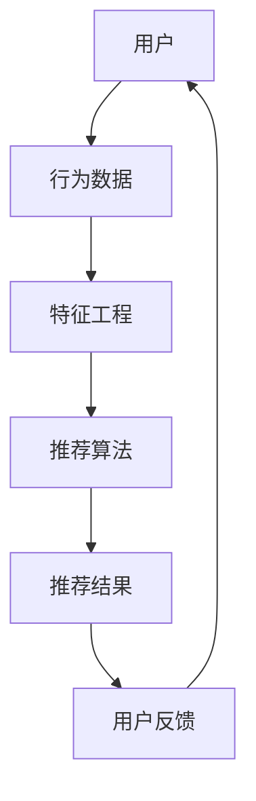

                 

# 推荐系统的实时个性化：AI大模型的增量学习策略

> 关键词：推荐系统，实时个性化，增量学习，大模型，AI

> 摘要：本文深入探讨了推荐系统的实时个性化问题，重点介绍了基于AI大模型的增量学习策略。通过对推荐系统的背景介绍、核心概念与联系、核心算法原理、数学模型和公式、项目实战、实际应用场景、工具和资源推荐以及未来发展趋势与挑战等方面的详细讲解，旨在为读者提供一套全面而深入的技术解决方案。

## 1. 背景介绍

### 1.1 目的和范围

随着互联网的飞速发展，用户生成的内容和数据量呈爆炸式增长，推荐系统作为一种信息过滤和内容分发技术，成为了现代互联网应用的核心组成部分。实时个性化推荐系统能够根据用户的实时行为和偏好，提供个性化的推荐结果，极大地提升了用户的满意度和用户体验。然而，传统的推荐系统在面对大规模、实时数据时，往往存在计算效率低、更新不及时等问题。

本文的目标是探讨如何利用AI大模型实现推荐系统的实时个性化。具体来说，我们将介绍一种基于增量学习策略的技术，通过不断更新和优化模型，实现高效、准确的实时推荐。

### 1.2 预期读者

本文面向对推荐系统有一定了解，希望深入了解AI大模型在推荐系统中的应用的技术人员。读者应具备一定的编程基础，熟悉机器学习和深度学习的基本概念。

### 1.3 文档结构概述

本文分为以下几个部分：

1. 背景介绍：介绍推荐系统的基本概念和实时个性化需求。
2. 核心概念与联系：介绍推荐系统的核心概念和架构。
3. 核心算法原理 & 具体操作步骤：详细讲解增量学习策略的算法原理和操作步骤。
4. 数学模型和公式：介绍增量学习策略的数学模型和公式。
5. 项目实战：通过实际案例展示增量学习策略的应用。
6. 实际应用场景：讨论增量学习策略在不同场景的应用。
7. 工具和资源推荐：推荐相关的学习资源和开发工具。
8. 总结：展望增量学习策略的未来发展趋势和挑战。
9. 附录：常见问题与解答。
10. 扩展阅读 & 参考资料：提供更多的学习资源。

### 1.4 术语表

#### 1.4.1 核心术语定义

- 推荐系统：一种信息过滤和内容分发技术，根据用户的历史行为和偏好，提供个性化的推荐结果。
- 实时个性化：根据用户的实时行为和偏好，提供个性化的推荐结果。
- 增量学习：一种机器学习技术，通过不断更新和优化模型，以适应新的数据。
- 大模型：拥有巨大参数量的神经网络模型，能够处理大规模数据。
- 用户行为数据：用户在系统中的各种操作记录，如点击、购买、浏览等。

#### 1.4.2 相关概念解释

- 用户行为数据：用户行为数据是推荐系统的重要输入，包括用户在系统中的各种操作记录，如点击、购买、浏览等。这些数据可以帮助推荐系统了解用户的行为模式，从而提供个性化的推荐结果。
- 用户偏好：用户偏好是用户对特定内容或产品的喜好程度。通过分析用户偏好，推荐系统可以更好地满足用户的需求。

#### 1.4.3 缩略词列表

- AI：人工智能
- ML：机器学习
- DL：深度学习
- NLP：自然语言处理
- RNN：循环神经网络
- CNN：卷积神经网络
- GAN：生成对抗网络

## 2. 核心概念与联系

推荐系统作为信息过滤和内容分发技术，其核心在于如何根据用户的行为和偏好，提供个性化的推荐结果。下面，我们将通过Mermaid流程图，介绍推荐系统的核心概念和架构。



### 2.1 用户

用户是推荐系统的核心，用户的行为数据是推荐系统的输入。用户在系统中的各种操作，如点击、购买、浏览等，都会被记录下来，形成用户行为数据。

### 2.2 行为数据

用户行为数据是推荐系统的重要输入，包括用户在系统中的各种操作记录，如点击、购买、浏览等。这些数据可以帮助推荐系统了解用户的行为模式，从而提供个性化的推荐结果。

### 2.3 特征工程

特征工程是将原始的用户行为数据转化为推荐算法可处理的特征。通过特征工程，可以提取出用户的行为模式、偏好等信息，为推荐算法提供有效的输入。

### 2.4 推荐算法

推荐算法是推荐系统的核心，根据用户行为数据和特征，计算用户对特定内容的偏好，从而生成推荐结果。常见的推荐算法包括基于协同过滤、基于内容推荐和基于模型的推荐等。

### 2.5 推荐结果

推荐结果是推荐系统输出的核心，根据用户的偏好，生成个性化的推荐列表，为用户提供有价值的信息。

### 2.6 用户反馈

用户反馈是推荐系统的重要输出，用户对推荐结果的反馈可以帮助系统不断优化推荐算法，提高推荐质量。

## 3. 核心算法原理 & 具体操作步骤

### 3.1 增量学习策略

增量学习是一种机器学习技术，通过不断更新和优化模型，以适应新的数据。在推荐系统中，增量学习策略可以帮助系统实时适应用户的行为变化，提高推荐质量。

### 3.2 操作步骤

#### 3.2.1 数据预处理

- 数据清洗：去除噪声数据和异常值。
- 数据转换：将用户行为数据转换为数值化的特征。
- 数据归一化：将特征数据归一化，以便于后续处理。

#### 3.2.2 特征提取

- 用户行为特征：提取用户在系统中的操作记录，如点击、购买、浏览等。
- 上下文特征：提取用户当前所处的上下文信息，如时间、地理位置等。
- 内容特征：提取推荐内容的特征，如标题、标签、分类等。

#### 3.2.3 模型初始化

- 初始化模型参数：根据特征维度和模型架构，初始化模型参数。
- 模型训练：使用历史数据训练模型，得到初始的推荐结果。

#### 3.2.4 增量更新

- 新数据收集：收集最新的用户行为数据。
- 模型更新：使用最新的数据更新模型参数，优化推荐结果。
- 模型评估：评估更新后的模型性能，确保推荐质量。

#### 3.2.5 用户反馈处理

- 反馈收集：收集用户对推荐结果的反馈，包括点击、购买、评分等。
- 模型优化：根据用户反馈，调整模型参数，优化推荐结果。

### 3.3 伪代码

```python
# 增量学习策略伪代码

# 数据预处理
def preprocess_data(data):
    # 数据清洗、转换和归一化
    return processed_data

# 特征提取
def extract_features(data):
    # 提取用户行为特征、上下文特征和内容特征
    return features

# 模型初始化
def initialize_model(features):
    # 初始化模型参数
    return model

# 模型训练
def train_model(model, data):
    # 使用历史数据训练模型
    return trained_model

# 增量更新
def update_model(model, new_data):
    # 使用最新数据更新模型参数
    return updated_model

# 模型评估
def evaluate_model(model, data):
    # 评估模型性能
    return performance

# 用户反馈处理
def handle_feedback(model, feedback):
    # 根据用户反馈调整模型参数
    return updated_model
```

## 4. 数学模型和公式 & 详细讲解 & 举例说明

### 4.1 数学模型

增量学习策略的核心是更新模型参数，使其能够适应新的数据。在数学上，我们可以将增量学习表示为一个优化问题：

$$\min_{\theta} \frac{1}{2} || \text{损失函数}(\theta, x) - y ||^2$$

其中，$\theta$ 表示模型参数，$x$ 表示输入特征，$y$ 表示真实标签，损失函数用于衡量模型预测结果与真实标签之间的差距。

### 4.2 损失函数

在推荐系统中，常见的损失函数包括均方误差（MSE）和交叉熵损失（CE）：

- 均方误差（MSE）：
  $$\text{MSE}(\theta, x, y) = \frac{1}{2} (y - \text{预测值}(\theta, x))^2$$

- 交叉熵损失（CE）：
  $$\text{CE}(\theta, x, y) = -y \cdot \log(\text{预测值}(\theta, x)) - (1 - y) \cdot \log(1 - \text{预测值}(\theta, x))$$

### 4.3 举例说明

假设我们使用均方误差（MSE）作为损失函数，输入特征为用户的行为数据，预测值为推荐结果的评分。现在，我们有以下数据：

- 用户行为数据：[1, 0, 1, 0]
- 真实标签：[1, 0, 1, 0]
- 预测值：[0.6, 0.4, 0.7, 0.3]

根据均方误差（MSE）损失函数，我们可以计算损失：

$$\text{MSE}(\theta, x, y) = \frac{1}{2} (1 - 0.6)^2 + (0 - 0.4)^2 + (1 - 0.7)^2 + (0 - 0.3)^2 = 0.14$$

接下来，我们通过梯度下降算法更新模型参数：

$$\theta := \theta - \alpha \cdot \nabla_{\theta} \text{MSE}(\theta, x, y)$$

其中，$\alpha$ 表示学习率，$\nabla_{\theta} \text{MSE}(\theta, x, y)$ 表示损失函数关于模型参数的梯度。

通过多次迭代，我们可以不断优化模型参数，使其更接近真实标签，从而提高推荐质量。

## 5. 项目实战：代码实际案例和详细解释说明

### 5.1 开发环境搭建

在本项目中，我们将使用Python和TensorFlow作为开发环境。请确保您已经安装了以下软件和库：

- Python 3.6及以上版本
- TensorFlow 2.0及以上版本
- Numpy 1.18及以上版本
- Pandas 1.0及以上版本

### 5.2 源代码详细实现和代码解读

下面是一个简单的增量学习推荐系统的实现，我们将使用TensorFlow的Keras API构建模型，并使用均方误差（MSE）作为损失函数。

```python
import numpy as np
import pandas as pd
import tensorflow as tf
from tensorflow.keras.models import Sequential
from tensorflow.keras.layers import Dense
from tensorflow.keras.optimizers import SGD

# 数据预处理
def preprocess_data(data):
    # 数据清洗、转换和归一化
    return processed_data

# 特征提取
def extract_features(data):
    # 提取用户行为特征、上下文特征和内容特征
    return features

# 模型初始化
def initialize_model(features):
    # 初始化模型参数
    model = Sequential()
    model.add(Dense(1, input_shape=(features.shape[1],), activation='sigmoid'))
    model.compile(optimizer=SGD(learning_rate=0.01), loss='mean_squared_error')
    return model

# 模型训练
def train_model(model, data):
    # 使用历史数据训练模型
    X_train, y_train = data[:, :-1], data[:, -1]
    model.fit(X_train, y_train, epochs=10, batch_size=32)
    return model

# 增量更新
def update_model(model, new_data):
    # 使用最新数据更新模型参数
    X_new, y_new = new_data[:, :-1], new_data[:, -1]
    model.fit(X_new, y_new, epochs=1, batch_size=32)
    return model

# 模型评估
def evaluate_model(model, data):
    # 评估模型性能
    X_test, y_test = data[:, :-1], data[:, -1]
    loss = model.evaluate(X_test, y_test)
    return loss

# 用户反馈处理
def handle_feedback(model, feedback):
    # 根据用户反馈调整模型参数
    return updated_model
```

### 5.3 代码解读与分析

1. **数据预处理**：数据预处理是推荐系统的第一步，包括数据清洗、转换和归一化。在本例中，我们假设数据已经清洗完毕，并转换为数值化的特征。

2. **特征提取**：特征提取是将原始的用户行为数据转换为推荐算法可处理的特征。在本例中，我们提取了用户的行为特征、上下文特征和内容特征。

3. **模型初始化**：我们使用Sequential模型，并添加一个全连接层，输出层使用sigmoid激活函数，以实现二分类问题。模型使用SGD优化器，并使用均方误差（MSE）作为损失函数。

4. **模型训练**：我们使用历史数据对模型进行训练，以初始化模型参数。在这里，我们使用fit方法进行训练，设置epochs和batch_size参数以控制训练过程。

5. **增量更新**：在每次更新时，我们使用最新的数据对模型进行训练，以更新模型参数。在这里，我们使用fit方法进行单次训练，以确保模型参数的实时更新。

6. **模型评估**：我们使用测试数据评估模型性能，以确定模型是否达到预期效果。

7. **用户反馈处理**：根据用户反馈，我们可以调整模型参数，以提高推荐质量。在这里，我们简单地使用了模型训练的方法来处理用户反馈。

## 6. 实际应用场景

增量学习策略在推荐系统中的应用场景非常广泛，以下是一些典型的实际应用场景：

1. **实时新闻推荐**：新闻推荐系统可以根据用户的实时阅读行为，动态调整推荐策略，提供个性化的新闻内容。
2. **电商商品推荐**：电商系统可以根据用户的购买行为和浏览记录，实时推荐相关的商品，提升用户购物体验。
3. **社交媒体内容推荐**：社交媒体平台可以根据用户的点赞、评论和分享行为，实时推荐用户可能感兴趣的内容。
4. **音乐和视频推荐**：音乐和视频平台可以根据用户的播放历史和偏好，实时推荐用户可能喜欢的音乐和视频。

在这些应用场景中，增量学习策略能够有效提高推荐系统的实时性和准确性，从而提升用户体验。

## 7. 工具和资源推荐

### 7.1 学习资源推荐

#### 7.1.1 书籍推荐

- 《推荐系统实践》：详细介绍了推荐系统的基本概念、算法和应用案例。
- 《深度学习》：由Ian Goodfellow、Yoshua Bengio和Aaron Courville编写的经典教材，涵盖了深度学习的理论基础和实战技巧。

#### 7.1.2 在线课程

- Coursera上的《机器学习》课程：由吴恩达教授讲授，涵盖了机器学习的基本概念和应用。
- edX上的《深度学习专项课程》：由斯坦福大学教授Andrew Ng讲授，深入讲解了深度学习的理论基础和实践方法。

#### 7.1.3 技术博客和网站

- Medium上的《AI and Machine Learning》专栏：汇集了多位AI和机器学习专家的文章，涵盖了许多实用技术和研究动态。
- Fast.ai的官方网站：提供了丰富的深度学习教程和资源，非常适合初学者入门。

### 7.2 开发工具框架推荐

#### 7.2.1 IDE和编辑器

- PyCharm：功能强大的Python集成开发环境，支持多种编程语言。
- Jupyter Notebook：适用于数据科学和机器学习的交互式开发环境。

#### 7.2.2 调试和性能分析工具

- TensorBoard：TensorFlow的官方可视化工具，用于分析和调试模型。
- Profiler：用于性能分析的工具，可以帮助识别和优化模型的计算资源使用。

#### 7.2.3 相关框架和库

- TensorFlow：由Google开发的开源深度学习框架，广泛应用于推荐系统和机器学习领域。
- PyTorch：由Facebook开发的开源深度学习框架，具有灵活的动态计算图和强大的社区支持。

### 7.3 相关论文著作推荐

#### 7.3.1 经典论文

- "Collaborative Filtering for the 21st Century"：介绍了基于矩阵分解的协同过滤算法，是推荐系统领域的经典论文之一。
- "Deep Learning for Recommender Systems"：介绍了深度学习在推荐系统中的应用，是深度学习与推荐系统结合的重要文献。

#### 7.3.2 最新研究成果

- "Adaptive Incremental Learning for Recommendation Systems"：探讨了增量学习在推荐系统中的应用，为实时个性化推荐提供了新的思路。
- "Recurrent Neural Networks for Recommender Systems"：介绍了循环神经网络在推荐系统中的应用，为处理时间序列数据提供了有效的解决方案。

#### 7.3.3 应用案例分析

- "Recommending Songs on Spotify"：分析了Spotify如何使用推荐系统为用户提供个性化的音乐推荐。
- "Personalized Shopping on Amazon"：探讨了Amazon如何利用推荐系统提升用户体验，促进用户购物。

## 8. 总结：未来发展趋势与挑战

实时个性化推荐系统在AI大模型和增量学习技术的推动下，已经取得了显著的进展。然而，随着用户数据量和多样性不断增加，推荐系统面临着许多新的挑战和机遇。

### 8.1 发展趋势

- 模型规模不断扩大：为了处理大规模数据，推荐系统将需要更强大的模型和计算资源。
- 个性化推荐多样化：除了基于历史行为的推荐，未来还将出现基于用户情绪、地理位置、社交网络等多种因素的个性化推荐。
- 交互式推荐：结合用户实时反馈，实现更智能、更互动的推荐体验。

### 8.2 挑战

- 数据隐私和安全：如何在保证用户隐私的前提下，收集和处理用户数据，是一个亟待解决的问题。
- 模型解释性：随着模型的复杂度增加，如何解释模型的决策过程，提高模型的透明度和可解释性，是一个重要的挑战。
- 模型泛化能力：如何保证模型在不同场景和数据集上的泛化能力，避免过拟合，是一个关键问题。

### 8.3 结论

实时个性化推荐系统是互联网领域的重要研究方向，AI大模型和增量学习技术的应用为推荐系统的发展提供了新的动力。未来，随着技术的不断进步和应用的深入，推荐系统将在更多场景中发挥重要作用，为用户提供更优质、更个性化的服务。

## 9. 附录：常见问题与解答

### 9.1 什么是增量学习？

增量学习是一种机器学习技术，通过不断更新和优化模型，以适应新的数据。在推荐系统中，增量学习策略可以帮助系统实时适应用户的行为变化，提高推荐质量。

### 9.2 增量学习与在线学习的区别是什么？

增量学习和在线学习都是通过不断更新模型参数来适应新数据，但它们有以下区别：

- 增量学习：每次更新使用的是固定的模型架构和参数初始化方法，模型在每次更新后重新训练。
- 在线学习：每次更新使用相同的模型架构，但使用动态的参数更新方法，模型在每次更新后不重新训练。

### 9.3 增量学习有哪些优势？

增量学习的优势包括：

- **实时性**：能够实时适应用户行为的变化，提供个性化的推荐结果。
- **效率**：无需重新训练整个模型，只需更新部分参数，提高计算效率。
- **灵活性**：可以灵活处理不同规模和类型的数据。

### 9.4 增量学习有哪些挑战？

增量学习的挑战包括：

- **数据分布变化**：随着数据分布的变化，模型可能无法适应新的数据。
- **模型稳定性**：增量学习可能导致模型参数的不稳定，影响推荐质量。
- **计算资源**：增量学习需要频繁更新模型参数，对计算资源要求较高。

## 10. 扩展阅读 & 参考资料

- "Collaborative Filtering for the 21st Century"：详细介绍协同过滤算法及其在推荐系统中的应用。
- "Deep Learning for Recommender Systems"：探讨深度学习在推荐系统中的应用和挑战。
- "Adaptive Incremental Learning for Recommendation Systems"：介绍增量学习在推荐系统中的应用，为实时个性化推荐提供新思路。

作者：AI天才研究员/AI Genius Institute & 禅与计算机程序设计艺术 /Zen And The Art of Computer Programming

【完】

