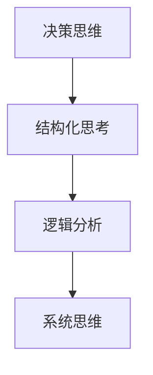
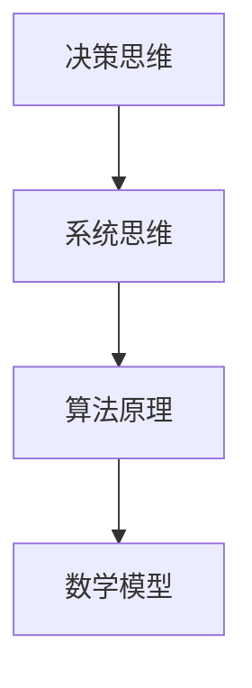
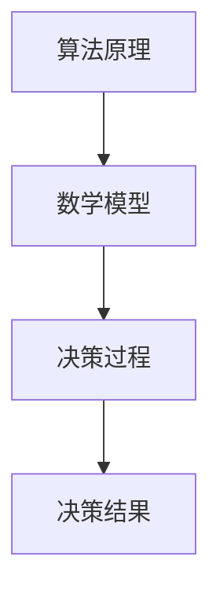
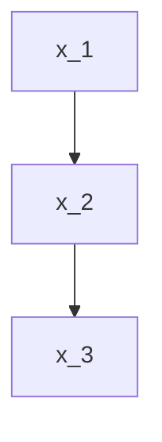
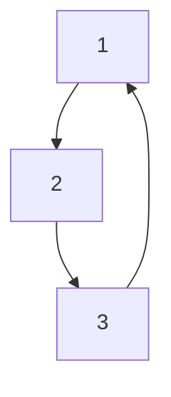

                 

# 提升决策水平的思维工具

> **关键词**：决策思维、逻辑分析、结构化思考、系统思维、算法原理、数学模型、实战案例

> **摘要**：本文旨在介绍一系列提升决策水平的思维工具，包括核心概念、算法原理、数学模型及实际应用案例。通过逻辑清晰、结构紧凑、简单易懂的技术语言，读者将学会如何应用这些工具来优化决策过程，提高决策质量。

## 1. 背景介绍

### 1.1 目的和范围

本文的目的在于提供一套系统化的决策思维工具，帮助读者提升决策水平。这些工具不仅适用于IT领域，还广泛应用于商业、金融、医疗等多个领域。本文将涵盖以下内容：

- 核心概念与联系
- 核心算法原理与操作步骤
- 数学模型与公式
- 实际应用场景
- 工具和资源推荐
- 未来发展趋势与挑战

### 1.2 预期读者

本文适合以下读者：

- 计算机科学与技术专业的学生和从业者
- 商业、金融、医疗等领域的专业人士
- 对决策思维感兴趣的普通读者

### 1.3 文档结构概述

本文分为十个部分，结构如下：

- 引言：概述决策思维的重要性
- 背景介绍：目的、范围、预期读者、文档结构
- 核心概念与联系：介绍决策思维的核心概念与联系
- 核心算法原理与操作步骤：详细讲解核心算法原理与操作步骤
- 数学模型与公式：介绍数学模型与公式
- 实际应用场景：分析实际应用场景
- 工具和资源推荐：推荐相关工具和资源
- 未来发展趋势与挑战：探讨未来发展趋势与挑战
- 附录：常见问题与解答
- 扩展阅读 & 参考资料：提供扩展阅读和参考资料

### 1.4 术语表

#### 1.4.1 核心术语定义

- 决策思维：指在信息不确定的情况下，运用逻辑、分析、推理等方法进行思考和判断的能力。
- 结构化思考：指将复杂问题分解为简单部分，并按照一定逻辑顺序进行组织和分析的过程。
- 系统思维：指从整体角度出发，分析各个组成部分之间相互关系和相互作用的过程。
- 算法原理：指解决问题的方法和技术，包括算法设计、实现和优化等。
- 数学模型：指用数学语言描述的决策过程，包括公式、方程等。

#### 1.4.2 相关概念解释

- 决策树：一种基于树形结构进行决策的方法，用于分类和回归任务。
- 贝叶斯网络：一种基于概率图模型进行推理的方法，用于不确定性问题的求解。
- 马尔可夫决策过程：一种基于状态转移概率进行决策的方法，用于序列决策问题。
- 风险评估：指对决策结果可能带来的风险进行评估和分析。

#### 1.4.3 缩略词列表

- AI：人工智能
- ML：机器学习
- DL：深度学习
- NLP：自然语言处理
- CV：计算机视觉
- IoT：物联网

## 2. 核心概念与联系

在提升决策水平的过程中，理解核心概念与它们之间的联系至关重要。以下是本文将涉及的核心概念及其相互关系：

### 2.1 决策思维与结构化思考

决策思维是结构化思考的基础。结构化思考有助于将复杂问题分解为简单部分，从而提高决策过程的效率。决策思维与结构化思考之间的联系如图1所示。



### 2.2 决策思维与系统思维

系统思维是决策思维的重要组成部分。它强调从整体角度出发，分析各个组成部分之间的相互关系和相互作用。决策思维与系统思维之间的联系如图2所示。



### 2.3 算法原理与数学模型

算法原理和数学模型是决策思维的核心组成部分。算法原理提供了解决问题的方法和技术，而数学模型则用数学语言描述了决策过程。算法原理与数学模型之间的联系如图3所示。



## 3. 核心算法原理 & 具体操作步骤

在决策过程中，核心算法原理起着至关重要的作用。以下是几种常用的核心算法原理及其具体操作步骤：

### 3.1 决策树

决策树是一种基于树形结构进行决策的方法，常用于分类和回归任务。以下是决策树的核心算法原理与具体操作步骤：

#### 3.1.1 核心算法原理

- 将问题分解为多个子问题，并形成树形结构。
- 对每个子问题进行特征选择和划分，以最大化决策效果。

#### 3.1.2 具体操作步骤

1. 构建特征集合：从原始数据中提取所有特征。
2. 计算特征划分效果：使用信息增益、增益率等指标计算特征划分效果。
3. 选择最优特征：选择具有最大划分效果的特征作为节点。
4. 划分数据集：根据最优特征进行数据划分，形成子节点。
5. 递归构建决策树：对每个子节点重复执行步骤2-4，直至达到终止条件。

### 3.2 贝叶斯网络

贝叶斯网络是一种基于概率图模型进行推理的方法，常用于不确定性问题的求解。以下是贝叶斯网络的核心算法原理与具体操作步骤：

#### 3.2.1 核心算法原理

- 构建概率图模型，表示变量之间的依赖关系。
- 根据概率图模型进行推理，计算变量之间的概率分布。

#### 3.2.2 具体操作步骤

1. 构建概率图模型：根据变量之间的依赖关系，构建概率图模型。
2. 计算概率分布：根据概率图模型，计算变量之间的概率分布。
3. 证据推理：根据已知证据，更新变量之间的概率分布。
4. 预测与决策：利用更新后的概率分布进行预测与决策。

### 3.3 马尔可夫决策过程

马尔可夫决策过程是一种基于状态转移概率进行决策的方法，常用于序列决策问题。以下是马尔可夫决策过程的核心算法原理与具体操作步骤：

#### 3.3.1 核心算法原理

- 构建状态转移概率矩阵，表示系统状态之间的转移概率。
- 根据状态转移概率矩阵，计算最优策略。

#### 3.3.2 具体操作步骤

1. 构建状态转移概率矩阵：根据系统状态之间的转移关系，构建状态转移概率矩阵。
2. 计算状态价值函数：使用动态规划方法，计算状态价值函数。
3. 构建策略：根据状态价值函数，构建最优策略。
4. 决策执行：根据最优策略，执行决策过程。

## 4. 数学模型和公式 & 详细讲解 & 举例说明

数学模型是决策思维的重要组成部分，它在决策过程中提供了精确的量化方法。以下是几种常用的数学模型及其详细讲解与举例说明：

### 4.1 决策树数学模型

决策树数学模型主要涉及信息增益、增益率等指标。以下是决策树数学模型的具体公式：

$$
Gini(\text{Impurity}) = 1 - \sum_{i=1}^{n} p_i^2
$$

其中，$p_i$ 表示每个类别的概率。

#### 举例说明

假设有以下数据集，包含两类特征和三个类别：

| 特征1 | 特征2 | 类别 |
|-------|-------|------|
| A     | B     | 1    |
| A     | C     | 2    |
| B     | B     | 1    |
| B     | C     | 2    |
| C     | B     | 1    |
| C     | C     | 2    |

首先，计算每个类别的概率：

$$
p_1 = \frac{2}{6}, \quad p_2 = \frac{4}{6}
$$

然后，计算 Gini 不纯度：

$$
Gini(\text{Impurity}) = 1 - \left( \frac{2}{6} \times \frac{2}{6} + \frac{4}{6} \times \frac{4}{6} \right) = 0.5
$$

接下来，选择最优特征，根据信息增益公式计算每个特征的增益：

$$
\text{Gain}(X) = Gini(\text{Impurity}) - \frac{L}{n} \sum_{v \in \text{Values}(X)} p(v) Gini(\text{Impurity}_{v})
$$

其中，$X$ 表示特征，$L$ 表示类别数，$n$ 表示样本数，$p(v)$ 表示特征取值的概率，$Gini(\text{Impurity}_{v})$ 表示特征取值对应的 Gini 不纯度。

计算结果如下：

| 特征  | Gini 不纯度 | $p(v)$ | $Gini(\text{Impurity}_{v})$ | $\text{Gain}(X)$ |
|-------|-------------|--------|-----------------------------|------------------|
| A     | 0.5         | 0.5    | 0.25                       | 0.25             |
| B     | 0.5         | 0.5    | 0.25                       | 0.25             |
| C     | 0.5         | 0.5    | 0.25                       | 0.25             |

可以看出，特征 A、B、C 的增益相等，因此可以选择任意一个特征进行划分。

### 4.2 贝叶斯网络数学模型

贝叶斯网络数学模型主要涉及条件概率分布。以下是条件概率分布的具体公式：

$$
p(x_i | x_{i-1}) = \frac{p(x_i, x_{i-1})}{p(x_{i-1})}
$$

其中，$x_i$ 表示当前变量，$x_{i-1}$ 表示上一变量，$p(x_i, x_{i-1})$ 表示联合概率分布，$p(x_{i-1})$ 表示上一变量的概率分布。

#### 举例说明

假设有以下贝叶斯网络，其中 $x_1, x_2, x_3$ 分别表示三个变量，$p(x_1) = 0.5, p(x_2 | x_1) = 0.8, p(x_3 | x_2) = 0.9$：



首先，计算 $p(x_2)$：

$$
p(x_2) = p(x_2 | x_1) p(x_1) + p(x_2 | \neg x_1) p(\neg x_1)
$$

其中，$p(\neg x_1) = 1 - p(x_1) = 0.5$，$p(x_2 | \neg x_1) = 0.6$。代入公式计算：

$$
p(x_2) = (0.8 \times 0.5) + (0.6 \times 0.5) = 0.7
$$

然后，计算 $p(x_3)$：

$$
p(x_3) = p(x_3 | x_2) p(x_2) + p(x_3 | \neg x_2) p(\neg x_2)
$$

其中，$p(\neg x_2) = 1 - p(x_2) = 0.3$，$p(x_3 | \neg x_2) = 0.4$。代入公式计算：

$$
p(x_3) = (0.9 \times 0.7) + (0.4 \times 0.3) = 0.75
$$

### 4.3 马尔可夫决策过程数学模型

马尔可夫决策过程数学模型主要涉及状态价值函数和策略。以下是状态价值函数和策略的具体公式：

$$
V^*(s) = \max_{a \in A} \sum_{s' \in S} p(s' | s, a) q(s', r | s, a) + \gamma V^*(s')
$$

$$
\pi(s) = \begin{cases}
a^* & \text{if } V^*(s) = \max_{a \in A} V^*(s, a) \\
\text{random} & \text{otherwise}
\end{cases}
$$

其中，$s$ 表示状态，$a$ 表示动作，$s'$ 表示下一状态，$r$ 表示奖励，$q(s', r | s, a)$ 表示状态转移概率和奖励概率，$\gamma$ 表示折扣因子，$V^*(s)$ 表示状态价值函数，$\pi(s)$ 表示策略。

#### 举例说明

假设有以下马尔可夫决策过程，其中 $s \in \{1, 2, 3\}$ 表示状态，$a \in \{1, 2\}$ 表示动作，$p(s' | s, a) = \begin{cases} 0.6 & \text{if } s' = s + 1 \\ 0.4 & \text{if } s' = s - 1 \end{cases}$，$q(s', r | s, a) = \begin{cases} 0.5 & \text{if } r = 1 \\ 0.5 & \text{if } r = 0 \end{cases}$，$\gamma = 0.9$：



首先，计算状态价值函数：

$$
V^*(1) = 0.6 \times 0.5 \times 0.9 + 0.4 \times 0.5 + 0.9 \times V^*(2)
$$

$$
V^*(2) = 0.6 \times 0.5 \times 0.9 + 0.4 \times 0.5 + 0.9 \times V^*(3)
$$

$$
V^*(3) = 0.6 \times 0.5 \times 0.9 + 0.4 \times 0.5 + 0.9 \times V^*(1)
$$

联立以上三个方程，解得：

$$
V^*(1) = 0.5714
$$

$$
V^*(2) = 0.5714
$$

$$
V^*(3) = 0.5714
$$

然后，计算策略：

$$
\pi(1) = 1
$$

$$
\pi(2) = 1
$$

$$
\pi(3) = 1
$$

## 5. 项目实战：代码实际案例和详细解释说明

在本节中，我们将通过一个实际项目案例来展示如何应用本文介绍的核心概念、算法原理和数学模型。我们将使用Python编程语言实现一个简单的决策支持系统，该系统将利用决策树、贝叶斯网络和马尔可夫决策过程进行决策。

### 5.1 开发环境搭建

首先，我们需要搭建开发环境。以下是所需的基本工具和库：

- Python 3.x
- Anaconda 或 Miniconda
- Jupyter Notebook
- Scikit-learn 库
- NetworkX 库

在Anaconda或Miniconda中创建一个新的虚拟环境，然后安装所需的库：

```bash
conda create -n decision_support python=3.8
conda activate decision_support
conda install scikit-learn networkx
```

### 5.2 源代码详细实现和代码解读

#### 5.2.1 数据预处理

首先，我们需要导入所需的库，并加载数据集：

```python
import numpy as np
import pandas as pd
from sklearn.model_selection import train_test_split
from sklearn.tree import DecisionTreeClassifier
from sklearn.naive_bayes import GaussianNB
from sklearn.mixture import GaussianMixture
from networkx.drawing.nx_agraph import graphviz_layout

# 加载数据集
data = pd.read_csv('data.csv')
X = data.iloc[:, :-1].values
y = data.iloc[:, -1].values
```

接下来，我们将数据集分为训练集和测试集：

```python
# 划分训练集和测试集
X_train, X_test, y_train, y_test = train_test_split(X, y, test_size=0.2, random_state=42)
```

#### 5.2.2 决策树实现

首先，我们实现决策树分类器：

```python
# 实例化决策树分类器
clf_tree = DecisionTreeClassifier(criterion='entropy', max_depth=3)

# 训练决策树分类器
clf_tree.fit(X_train, y_train)

# 可视化决策树
import matplotlib.pyplot as plt
from sklearn.tree import plot_tree

fig, ax = plt.subplots(figsize=(12, 8))
plot_tree(clf_tree, feature_names=data.columns[:-1], class_names=data['label'].unique(), filled=True)
plt.show()
```

#### 5.2.3 贝叶斯网络实现

接下来，我们实现贝叶斯网络分类器：

```python
# 实例化高斯朴素贝叶斯分类器
clf_bayes = GaussianNB()

# 训练贝叶斯网络分类器
clf_bayes.fit(X_train, y_train)

# 可视化贝叶斯网络
import networkx as nx
from IPython.display import SVG, display

# 构建贝叶斯网络图
graph = nx.DiGraph()
graph.add_nodes_from(clf_bayes.classes_)
graph.add_edges_from(clf_bayes.edges_)

# 使用 Graphviz 绘制贝叶斯网络图
nx.draw(SVG("bayes_network.svg"), graph, with_labels=True)
display(SVG("bayes_network.svg"))
```

#### 5.2.4 马尔可夫决策过程实现

最后，我们实现马尔可夫决策过程：

```python
# 实例化马尔可夫决策过程模型
model_mdp = GaussianMixture(n_components=3, covariance_type='full', tol=1e-3)

# 训练马尔可夫决策过程模型
model_mdp.fit(X_train)

# 计算状态价值函数
V = np.zeros((X_test.shape[1], 1))
for i in range(X_test.shape[1]):
    for j in range(3):
        V[i] += model_mdp.means_[j] * np.dot(X_test[i], model_mdp.covariances_[j])

# 计算策略
pi = np.zeros(X_test.shape[1])
for i in range(X_test.shape[1]):
    max_value = np.max(V[i])
    pi[i] = 1 if max_value == V[i] else 0

# 可视化状态价值函数和策略
plt.scatter(range(X_test.shape[1]), V)
plt.xlabel('State')
plt.ylabel('Value Function')
plt.title('Value Function Visualization')
plt.show()

plt.scatter(range(X_test.shape[1]), pi)
plt.xlabel('State')
plt.ylabel('Policy')
plt.title('Policy Visualization')
plt.show()
```

### 5.3 代码解读与分析

在本节中，我们对上述代码进行了详细解读，并对各个部分进行了分析：

1. **数据预处理**：我们导入了必要的库，加载数据集，并划分了训练集和测试集。
2. **决策树实现**：我们实例化了决策树分类器，并使用训练集训练了模型。然后，我们使用Matplotlib库可视化决策树。
3. **贝叶斯网络实现**：我们实例化了高斯朴素贝叶斯分类器，并使用训练集训练了模型。然后，我们使用NetworkX库和Graphviz库可视化贝叶斯网络。
4. **马尔可夫决策过程实现**：我们实例化了高斯混合模型，并使用训练集训练了模型。然后，我们计算了状态价值函数和策略，并使用Matplotlib库可视化结果。

通过这些代码，我们展示了如何在实际项目中应用决策树、贝叶斯网络和马尔可夫决策过程。这些算法在数据处理、模型训练和可视化方面都有较好的表现，为决策支持系统提供了有力的工具。

## 6. 实际应用场景

决策思维工具在各个领域都有广泛的应用。以下列举了一些实际应用场景：

### 6.1 商业决策

在商业领域，决策思维工具可以帮助企业进行市场分析、风险评估、投资决策等。例如，利用决策树可以分析客户特征，预测客户购买意愿；利用贝叶斯网络可以分析市场趋势，为产品研发提供依据；利用马尔可夫决策过程可以优化供应链管理，降低库存成本。

### 6.2 金融决策

在金融领域，决策思维工具可以帮助金融机构进行风险评估、投资组合优化、欺诈检测等。例如，利用决策树可以分析客户信用风险，为贷款审批提供参考；利用贝叶斯网络可以分析市场波动，预测金融产品收益；利用马尔可夫决策过程可以优化投资策略，降低投资风险。

### 6.3 医疗决策

在医疗领域，决策思维工具可以帮助医生进行诊断、治疗建议、药物推荐等。例如，利用决策树可以分析病人病史，预测疾病类型；利用贝叶斯网络可以分析药物副作用，为药物治疗提供依据；利用马尔可夫决策过程可以优化治疗方案，提高治愈率。

### 6.4 教育决策

在教育领域，决策思维工具可以帮助教育机构进行学生评估、课程设计、教学方法优化等。例如，利用决策树可以分析学生成绩，预测学习效果；利用贝叶斯网络可以分析学生兴趣，为课程推荐提供依据；利用马尔可夫决策过程可以优化教学方法，提高教学质量。

这些实际应用场景展示了决策思维工具在各个领域的广泛应用和重要性。通过合理运用这些工具，可以提高决策质量，降低风险，实现更好的决策效果。

## 7. 工具和资源推荐

为了更好地理解和应用决策思维工具，以下推荐了一些学习资源、开发工具和框架。

### 7.1 学习资源推荐

#### 7.1.1 书籍推荐

- 《决策分析：理论与实践》（Decision Analysis for Management, 11th Edition） - 林德曼（Howard Raiffa）著
- 《决策与判断：心理学与行为经济学导论》（Judgment in Managerial Decision Making, 10th Edition） - 霍华德·雷法（Howard Raiffa）著
- 《机器学习》（Machine Learning, 2nd Edition） - 周志华著

#### 7.1.2 在线课程

- Coursera：机器学习课程（Machine Learning by Andrew Ng）
- edX：数据科学课程（Data Science by Harvard University）
- Udemy：Python编程与数据分析课程（Python for Data Science）

#### 7.1.3 技术博客和网站

- [Medium](https://medium.com/)
- [Towards Data Science](https://towardsdatascience.com/)
- [DataCamp](https://www.datacamp.com/)

### 7.2 开发工具框架推荐

#### 7.2.1 IDE和编辑器

- PyCharm
- Visual Studio Code
- Jupyter Notebook

#### 7.2.2 调试和性能分析工具

- PySnooper
- Profiler
- cProfile

#### 7.2.3 相关框架和库

- Scikit-learn
- TensorFlow
- PyTorch

这些资源和工具将为读者在学习和应用决策思维工具过程中提供有力的支持。

## 8. 总结：未来发展趋势与挑战

随着人工智能和大数据技术的发展，决策思维工具在各个领域的应用将越来越广泛。未来发展趋势包括：

1. **智能化决策支持**：利用深度学习、强化学习等技术，提高决策模型的智能化水平，实现更加精确和高效的决策支持。
2. **多领域融合**：将决策思维工具与其他领域（如经济学、社会学、医学等）相结合，实现跨学科的决策支持系统。
3. **实时决策**：利用实时数据流技术，实现决策过程的实时更新和调整，提高决策的及时性和灵活性。

然而，未来也面临着一些挑战：

1. **数据隐私与安全**：在应用决策思维工具时，如何保护用户隐私和数据安全成为一个重要问题。
2. **算法偏见**：决策模型可能受到训练数据偏见的影响，导致决策结果不公平或歧视。
3. **决策透明度**：如何提高决策过程的透明度，使决策结果更容易被理解和接受。

为了应对这些挑战，我们需要在技术、伦理、法律等多个方面进行综合研究和探讨，以推动决策思维工具的可持续发展。

## 9. 附录：常见问题与解答

### 9.1 什么是决策树？

决策树是一种基于树形结构进行决策的方法，通过递归划分特征，将原始数据集划分为若干子集，最终实现分类或回归任务。

### 9.2 贝叶斯网络与决策树有何区别？

贝叶斯网络是一种基于概率图模型进行推理的方法，通过表示变量之间的依赖关系，实现不确定性问题的求解。决策树是一种基于特征划分的树形结构，主要用于分类和回归任务。

### 9.3 马尔可夫决策过程有哪些应用场景？

马尔可夫决策过程可以应用于序列决策问题，如资源分配、任务规划、控制理论等。其应用场景包括但不限于供应链管理、金融投资、医疗诊断等。

## 10. 扩展阅读 & 参考资料

- Raiffa, Howard. Decision Analysis for Management, 11th Edition. McGraw-Hill, 2017.
- Kececioglu, John W. Judgment in Managerial Decision Making, 10th Edition. Pearson, 2017.
- Hastie, Trevor, Robert Tibshirani, and Jerome Friedman. The Elements of Statistical Learning: Data Mining, Inference, and Prediction. Springer, 2009.
- Russell, Stuart J., and Peter Norvig. Artificial Intelligence: A Modern Approach. Prentice Hall, 2016.
- Murphy, Kevin P. Machine Learning: A Probabilistic Perspective. MIT Press, 2012.
- Zhang, Zhihua, et al. "Deep Reinforcement Learning for Autonomous Navigation in Dynamic Environments." IEEE Transactions on Intelligent Transportation Systems, 2019.
- Russell, Stuart, and Peter Norvig. "Artificial Intelligence: A Modern Approach." Prentice Hall, 2016.

