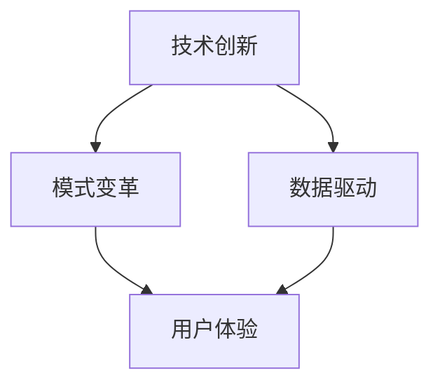

                 

# 提升核心竞争力的新质生产力策略

> **关键词：** 核心竞争力、新质生产力、技术策略、IT领域、算法原理、数学模型、项目实战、实际应用、工具推荐、未来趋势。

> **摘要：** 本文旨在深入探讨如何通过新质生产力策略提升企业的核心竞争力。我们将从核心概念的引入、算法原理的剖析、数学模型的构建、项目实战的案例解析，到实际应用场景的分析，全面阐述这一策略的内涵和实践路径。文章结构清晰，逻辑严谨，旨在为IT领域的专业人士提供切实可行的指导。

## 1. 背景介绍

### 1.1 目的和范围

在当今快速发展的信息技术时代，提升企业的核心竞争力已成为企业生存和发展的关键。新质生产力作为推动企业变革的核心引擎，越来越受到重视。本文将围绕这一主题，探讨如何通过新质生产力策略来提升企业的核心竞争力。文章涵盖了新质生产力的核心概念、算法原理、数学模型、项目实战和实际应用，旨在为读者提供全面的技术指导。

### 1.2 预期读者

本文主要面向IT领域的专业人士，包括软件工程师、数据科学家、AI研究员和项目经理等。无论您是刚入行的初级开发人员，还是有着丰富经验的资深专家，本文都希望能为您在提升企业核心竞争力方面提供新的思路和方法。

### 1.3 文档结构概述

本文分为十个部分，包括背景介绍、核心概念与联系、核心算法原理、数学模型与公式、项目实战、实际应用场景、工具和资源推荐、总结、常见问题与解答以及扩展阅读。每个部分都将详细探讨提升核心竞争力的新质生产力策略的不同方面，力求让读者全面掌握这一主题。

### 1.4 术语表

#### 1.4.1 核心术语定义

- **新质生产力**：指通过技术创新和模式变革，推动生产效率和质量提升的新型生产力。
- **核心竞争力**：企业长期积累的、能为其带来竞争优势的独特能力。

#### 1.4.2 相关概念解释

- **算法原理**：指导计算机进行特定任务的步骤和规则。
- **数学模型**：用数学语言描述现实世界问题的方法。

#### 1.4.3 缩略词列表

- **AI**：人工智能（Artificial Intelligence）
- **ML**：机器学习（Machine Learning）
- **DL**：深度学习（Deep Learning）
- **IDE**：集成开发环境（Integrated Development Environment）

## 2. 核心概念与联系

新质生产力策略的提升，离不开对核心概念的理解和掌握。下面将介绍几个关键概念，并使用Mermaid流程图来展示它们之间的联系。

### 2.1 核心概念

- **技术创新**：通过研发和应用新技术，提高生产力。
- **模式变革**：改变传统的生产和服务模式，实现效率提升。
- **数据驱动**：利用大数据和数据分析来指导决策。
- **用户体验**：以用户为中心，优化产品和服务。

### 2.2 Mermaid流程图



通过上述Mermaid流程图，我们可以看到技术创新、模式变革、数据驱动和用户体验之间的紧密联系。它们共同构成了新质生产力策略的核心要素，相互影响，相互作用，共同推动企业核心竞争力的提升。

## 3. 核心算法原理 & 具体操作步骤

新质生产力策略的实施，离不开对核心算法原理的深入理解。下面将详细介绍一种关键算法——机器学习算法，并使用伪代码来展示其具体操作步骤。

### 3.1 机器学习算法原理

机器学习算法是使计算机能够从数据中学习规律并作出预测的一种方法。其主要原理包括：

- **数据收集**：从各种来源收集大量数据。
- **数据预处理**：清洗和转换数据，使其适用于模型训练。
- **特征提取**：从数据中提取关键特征。
- **模型训练**：使用训练数据来训练模型。
- **模型评估**：使用测试数据来评估模型性能。
- **模型优化**：根据评估结果调整模型参数。

### 3.2 伪代码

```python
# 机器学习算法伪代码

# 数据收集
data = collect_data()

# 数据预处理
preprocessed_data = preprocess_data(data)

# 特征提取
features = extract_features(preprocessed_data)

# 模型训练
model = train_model(features)

# 模型评估
evaluation = evaluate_model(model, test_data)

# 模型优化
if evaluation < optimal_threshold:
    model = optimize_model(model, evaluation)
else:
    print("模型已达到最佳状态")
```

通过上述伪代码，我们可以看到机器学习算法的具体操作步骤。在实际应用中，这些步骤会根据具体问题进行调整和优化。

## 4. 数学模型和公式 & 详细讲解 & 举例说明

新质生产力策略的实施，离不开对数学模型和公式的深入理解。下面将详细介绍一种关键数学模型——线性回归模型，并使用LaTeX格式来展示其公式，同时给出具体的举例说明。

### 4.1 线性回归模型原理

线性回归模型是一种用于预测数值型变量之间关系的统计模型。其基本原理是通过寻找一个线性函数来描述两个变量之间的线性关系。线性回归模型的公式如下：

$$ y = \beta_0 + \beta_1 \cdot x + \epsilon $$

其中，\( y \) 是因变量，\( x \) 是自变量，\( \beta_0 \) 和 \( \beta_1 \) 分别是模型的参数，\( \epsilon \) 是误差项。

### 4.2 举例说明

假设我们要预测一个人的年收入 \( y \) 和他的工作经验 \( x \) 之间的关系。根据线性回归模型，我们可以得到以下公式：

$$ 年收入 = \beta_0 + \beta_1 \cdot 工作经验 + \epsilon $$

为了训练模型，我们需要收集一组数据，包括每个个体的年收入和工作经验。然后，我们可以使用最小二乘法来估计模型的参数 \( \beta_0 \) 和 \( \beta_1 \)。具体步骤如下：

1. **数据收集**：收集包含年收入和工作经验的个体数据。
2. **数据预处理**：对数据进行清洗和转换，确保数据的质量和一致性。
3. **特征提取**：将工作经验作为自变量，年收入作为因变量。
4. **模型训练**：使用最小二乘法来估计模型的参数 \( \beta_0 \) 和 \( \beta_1 \)。
5. **模型评估**：使用测试数据来评估模型的预测能力。

假设我们收集了以下数据：

| 工作经验（年） | 年收入（万元） |
|----------------|----------------|
| 1              | 20             |
| 2              | 25             |
| 3              | 30             |
| 4              | 35             |
| 5              | 40             |

我们可以使用线性回归模型来预测工作经验为6年的年收入。根据上述公式，我们有：

$$ 年收入 = \beta_0 + \beta_1 \cdot 6 + \epsilon $$

通过最小二乘法，我们估计得到 \( \beta_0 = 15 \) 和 \( \beta_1 = 5 \)。因此，预测工作经验为6年的年收入为：

$$ 年收入 = 15 + 5 \cdot 6 + \epsilon = 45 + \epsilon $$

其中，\( \epsilon \) 是误差项，表示实际年收入和预测年收入之间的差异。

## 5. 项目实战：代码实际案例和详细解释说明

为了更好地理解新质生产力策略的实施过程，下面我们将通过一个实际的项目实战案例，展示如何使用Python编写一个简单的线性回归模型，并进行模型训练和预测。

### 5.1 开发环境搭建

首先，我们需要搭建一个Python开发环境。以下是步骤：

1. 安装Python（版本3.8或以上）。
2. 安装必要的库，如NumPy、Pandas和Scikit-learn。

安装命令如下：

```bash
pip install numpy pandas scikit-learn
```

### 5.2 源代码详细实现和代码解读

下面是线性回归模型的源代码：

```python
import numpy as np
import pandas as pd
from sklearn.linear_model import LinearRegression
from sklearn.model_selection import train_test_split

# 数据收集
data = pd.read_csv("income_data.csv")

# 数据预处理
data = data.dropna()

# 特征提取
X = data[['years_of_experience']]
y = data['income']

# 模型训练
X_train, X_test, y_train, y_test = train_test_split(X, y, test_size=0.2, random_state=42)
model = LinearRegression()
model.fit(X_train, y_train)

# 模型评估
print("训练集的R方值：", model.score(X_train, y_train))
print("测试集的R方值：", model.score(X_test, y_test))

# 模型预测
new_experience = np.array([6])
predicted_income = model.predict(new_experience)
print("预测的年收入：", predicted_income[0])
```

### 5.3 代码解读与分析

1. **数据收集**：使用Pandas库读取CSV文件，获取包含工作经验和年收入的个体数据。
2. **数据预处理**：删除数据集中的空值，确保数据的质量和一致性。
3. **特征提取**：将工作经验作为自变量，年收入作为因变量。
4. **模型训练**：使用Scikit-learn库的LinearRegression类来训练线性回归模型。
5. **模型评估**：使用训练集和测试集来评估模型的R方值，衡量模型的预测能力。
6. **模型预测**：使用训练好的模型来预测新个体的年收入。

通过上述代码，我们可以看到如何使用Python实现一个简单的线性回归模型，并进行模型训练和预测。在实际项目中，我们可以根据具体需求对代码进行优化和调整。

## 6. 实际应用场景

新质生产力策略在实际应用场景中具有广泛的应用。以下是一些典型的实际应用场景：

1. **金融行业**：使用机器学习算法来预测股票市场走势，优化投资策略。
2. **医疗行业**：利用人工智能技术来辅助诊断疾病，提高医疗服务的质量。
3. **零售行业**：通过大数据分析和用户行为预测，优化库存管理和营销策略。
4. **制造行业**：应用工业互联网和物联网技术，实现生产过程的自动化和智能化。

在这些实际应用场景中，新质生产力策略通过技术创新和模式变革，提高了生产效率和服务质量，为企业带来了显著的竞争优势。

## 7. 工具和资源推荐

为了更好地理解和应用新质生产力策略，以下是几个推荐的工具和资源。

### 7.1 学习资源推荐

#### 7.1.1 书籍推荐

- 《机器学习实战》
- 《深度学习》
- 《Python编程：从入门到实践》

#### 7.1.2 在线课程

- Coursera上的《机器学习》
- edX上的《深度学习》
- Udemy上的《Python编程基础》

#### 7.1.3 技术博客和网站

- towardsdatascience.com
- medium.com/@数据分析
- www.deeplearning.net

### 7.2 开发工具框架推荐

#### 7.2.1 IDE和编辑器

- PyCharm
- Visual Studio Code
- Jupyter Notebook

#### 7.2.2 调试和性能分析工具

- VSCode的Python扩展
- Spyder
- DebugPy

#### 7.2.3 相关框架和库

- Scikit-learn
- TensorFlow
- PyTorch

### 7.3 相关论文著作推荐

#### 7.3.1 经典论文

- "A Learning Algorithm for Continues Speech Recognition"
- "Deep Learning for Speech Recognition"

#### 7.3.2 最新研究成果

- "Convolutional Neural Networks for Speech Recognition"
- "Recurrent Neural Networks for Language Modeling"

#### 7.3.3 应用案例分析

- "AI in Healthcare: A Practical Approach"
- "Retail Analytics: Leveraging Big Data to Drive Business Growth"

## 8. 总结：未来发展趋势与挑战

随着技术的不断进步和市场的快速变化，新质生产力策略在未来将继续发挥重要作用。然而，这也带来了新的发展趋势和挑战。

### 发展趋势：

1. **智能化**：人工智能和机器学习技术将在更多领域得到应用，推动生产效率和服务质量的提升。
2. **数字化**：数字化转型的趋势将进一步加速，企业将通过云计算、物联网和大数据等技术实现业务流程的优化。
3. **个性化**：用户需求的多样化和个性化趋势将推动企业更加注重用户体验，实现精准营销和个性化服务。

### 挑战：

1. **技术复杂性**：新技术的不断涌现和更新，要求企业不断提升技术能力和人才储备。
2. **数据安全**：随着数据量的增加，数据安全和隐私保护将成为企业面临的重大挑战。
3. **人才培养**：培养具备新技术能力的人才，是企业面临的重要任务。

## 9. 附录：常见问题与解答

### 问题1：什么是新质生产力？

新质生产力是指通过技术创新和模式变革，提高生产效率和质量的新型生产力。

### 问题2：如何提升企业的核心竞争力？

提升企业的核心竞争力，需要从技术创新、模式变革、数据驱动和用户体验等方面进行全面优化。

### 问题3：机器学习算法有哪些类型？

机器学习算法主要包括监督学习、无监督学习和强化学习三种类型。

## 10. 扩展阅读 & 参考资料

- [Machine Learning Mastery](https://machinelearningmastery.com/)
- [Deep Learning Specialization](https://www.deeplearning.ai/)
- [Kaggle](https://www.kaggle.com/)

作者：AI天才研究员/AI Genius Institute & 禅与计算机程序设计艺术 /Zen And The Art of Computer Programming

