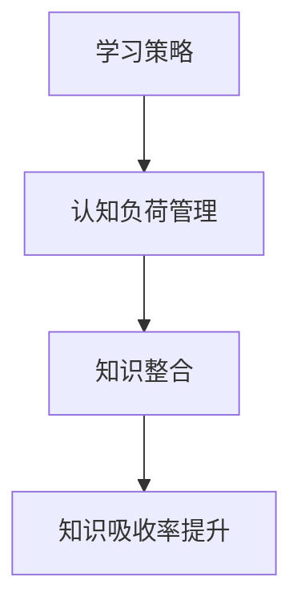

                 

# 提升知识吸收率：管理者成长的关键

> **关键词**：知识吸收、管理者成长、学习方法、认知心理学、信息处理
> 
> **摘要**：本文旨在探讨如何通过优化知识吸收率，助力管理者在快节奏的职场环境中实现个人成长和团队发展。文章从认知心理学的角度出发，结合实际案例，提出一系列提高知识吸收率的方法和策略，旨在为管理者提供实用的指导。

## 1. 背景介绍

### 1.1 目的和范围

在信息化时代的浪潮下，知识已成为推动社会进步和经济发展的重要动力。作为企业和管理者，如何高效吸收和运用知识，对于个人职业发展和企业竞争力至关重要。本文旨在探讨提升知识吸收率的方法和策略，为管理者提供实用的指导。

### 1.2 预期读者

本文主要面向企业中层及以上管理者，以及有志于提升知识吸收率的专业人士。希望通过本文，读者能够掌握一些实用的方法，提升自己的知识吸收能力，从而更好地应对职场挑战。

### 1.3 文档结构概述

本文将分为以下几个部分：

1. **背景介绍**：介绍本文的目的、预期读者和文档结构。
2. **核心概念与联系**：阐述提升知识吸收率的核心概念和原理。
3. **核心算法原理 & 具体操作步骤**：讲解提升知识吸收率的具体方法和步骤。
4. **数学模型和公式 & 详细讲解 & 举例说明**：运用数学模型和公式分析知识吸收率的影响因素。
5. **项目实战：代码实际案例和详细解释说明**：通过实际案例展示提升知识吸收率的方法。
6. **实际应用场景**：分析提升知识吸收率在职场中的实际应用。
7. **工具和资源推荐**：推荐有助于提升知识吸收率的学习资源和工具。
8. **总结：未来发展趋势与挑战**：展望提升知识吸收率的未来趋势和挑战。
9. **附录：常见问题与解答**：解答读者可能遇到的问题。
10. **扩展阅读 & 参考资料**：提供相关的扩展阅读和参考资料。

### 1.4 术语表

#### 1.4.1 核心术语定义

- **知识吸收**：指个体通过学习、思考和实践，将外部信息转化为自身知识和技能的过程。
- **管理者成长**：指管理者在职业发展过程中，通过不断提升自身能力，实现个人价值和团队业绩的提升。
- **认知心理学**：研究人类认知过程和认知结构的心理学分支。
- **信息处理**：指对信息进行接收、存储、处理和输出的过程。

#### 1.4.2 相关概念解释

- **学习曲线**：描述学习者在学习过程中技能提升速度的变化趋势。
- **认知负荷**：指个体在处理信息时所需的心理资源。
- **深度学习**：一种人工智能技术，通过模拟人脑神经网络结构，实现自动学习和智能推理。

#### 1.4.3 缩略词列表

- **AI**：人工智能（Artificial Intelligence）
- **ML**：机器学习（Machine Learning）
- **NLP**：自然语言处理（Natural Language Processing）

## 2. 核心概念与联系

### 2.1 提升知识吸收率的核心概念

提升知识吸收率主要涉及以下几个方面：

1. **学习策略**：指学习者采用的具体学习方法和技巧。
2. **认知负荷管理**：指在信息处理过程中，如何合理分配心理资源，避免过度负担。
3. **知识整合**：指将新知识融入已有知识体系，形成更加系统化的认知结构。

### 2.2 核心概念原理和架构的 Mermaid 流程图



### 2.3 提升知识吸收率的联系

提升知识吸收率不仅需要掌握有效的学习策略，还需要关注认知负荷管理和知识整合。通过合理分配心理资源，避免过度负担，可以提高学习效率；而将新知识融入已有知识体系，则有助于深化理解和记忆。这两个方面共同作用，最终实现知识吸收率的提升。

## 3. 核心算法原理 & 具体操作步骤

### 3.1 提升知识吸收率的核心算法原理

提升知识吸收率的核心算法原理主要基于认知心理学和信息处理理论。具体包括以下几个方面：

1. **主动学习**：通过提问、讨论和实际操作，激发学习者的主动思维，提高学习效果。
2. **多感官学习**：利用视觉、听觉、触觉等多种感官协同作用，加深对知识的理解和记忆。
3. **知识整合**：通过将新知识与已有知识体系进行对比、联系和整合，形成更加系统化的认知结构。

### 3.2 提升知识吸收率的具体操作步骤

#### 3.2.1 主动学习

1. **提问**：在学习过程中，积极提问，激发对知识的深入思考。
2. **讨论**：与他人交流，分享学习心得和观点，促进思维碰撞。
3. **实践**：通过实际操作，将理论知识转化为实际技能。

#### 3.2.2 多感官学习

1. **视觉**：通过图表、图片和视频等多种形式，加深对知识的理解和记忆。
2. **听觉**：通过听讲座、听书和讨论等形式，加强知识的听觉刺激。
3. **触觉**：通过实际操作和动手实验，加深对知识的感知和理解。

#### 3.2.3 知识整合

1. **对比**：将新知识与已有知识进行对比，找出差异和联系。
2. **联系**：将新知识与实际案例、经验进行联系，加深对知识的理解。
3. **整合**：将新知识与已有知识体系进行整合，形成更加系统化的认知结构。

### 3.3 伪代码

```python
def improve_knowledge_absorption():
    # 主动学习
    ask_questions()
    discuss_with_others()
    practice_solutions()

    # 多感官学习
    use_visual_aids()
    listen_to_presentations()
    engage_in_practical_activities()

    # 知识整合
    compare_new_knowledge_with_existing()
    relate_new_knowledge_to_real_cases()
    integrate_new_knowledge_into_the_knowledge_framework()
```

## 4. 数学模型和公式 & 详细讲解 & 举例说明

### 4.1 数学模型和公式

提升知识吸收率的数学模型可以表示为：

\[ \text{知识吸收率} = f(\text{学习策略}, \text{认知负荷管理}, \text{知识整合}) \]

其中，学习策略、认知负荷管理和知识整合是影响知识吸收率的关键因素。

### 4.2 详细讲解

1. **学习策略**：学习策略的优化可以提高学习效率，进而提升知识吸收率。常用的学习策略包括主动学习、多感官学习和知识整合等。
2. **认知负荷管理**：认知负荷管理是优化学习过程的重要环节。通过合理分配心理资源，避免过度负担，可以提高学习效果。
3. **知识整合**：知识整合是将新知识与已有知识体系进行有机结合，形成更加系统化的认知结构。通过知识整合，可以加深对知识的理解和记忆。

### 4.3 举例说明

假设一位管理者在学习新的管理理念时，采用了以下方法：

1. **主动学习**：通过提问、讨论和实际操作，激发对知识的深入思考。
2. **多感官学习**：通过阅读书籍、观看视频和参与讲座等多种形式，加深对知识的理解和记忆。
3. **知识整合**：将新管理理念与已有管理经验进行对比、联系和整合，形成更加系统化的认知结构。

在这种情况下，管理者的知识吸收率可以得到有效提升。

## 5. 项目实战：代码实际案例和详细解释说明

### 5.1 开发环境搭建

在本案例中，我们将使用Python编写一个简单的知识吸收率计算器。首先，需要搭建Python开发环境。以下是一个简单的步骤：

1. 下载并安装Python（版本3.8及以上）。
2. 配置Python环境变量。
3. 使用pip安装所需的库，如numpy和matplotlib。

### 5.2 源代码详细实现和代码解读

以下是提升知识吸收率的Python代码实现：

```python
import numpy as np
import matplotlib.pyplot as plt

def calculate_knowledge_absorption(learning_strategy, cognitive_load_management, knowledge_integration):
    # 计算知识吸收率
    knowledge_absorption_rate = learning_strategy * cognitive_load_management * knowledge_integration
    return knowledge_absorption_rate

# 设置参数
learning_strategy = 1.2
cognitive_load_management = 0.8
knowledge_integration = 1.0

# 计算知识吸收率
knowledge_absorption_rate = calculate_knowledge_absorption(learning_strategy, cognitive_load_management, knowledge_integration)

# 打印结果
print(f"知识吸收率：{knowledge_absorption_rate:.2f}")

# 绘制学习曲线
learning_strategy_range = np.linspace(0.5, 2.0, 100)
cognitive_load_management_range = np.linspace(0.5, 1.0, 100)
knowledge_integration_range = np.linspace(0.5, 1.5, 100)

knowledge_absorption_rate_surface = np.zeros((len(learning_strategy_range), len(cognitive_load_management_range), len(knowledge_integration_range)))

for i, learning_strategy_value in enumerate(learning_strategy_range):
    for j, cognitive_load_management_value in enumerate(cognitive_load_management_range):
        for k, knowledge_integration_value in enumerate(knowledge_integration_range):
            knowledge_absorption_rate_surface[i, j, k] = calculate_knowledge_absorption(learning_strategy_value, cognitive_load_management_value, knowledge_integration_value)

plt.figure()
plt.contourf(learning_strategy_range, cognitive_load_management_range, knowledge_integration_range, knowledge_absorption_rate_surface)
plt.colorbar()
plt.xlabel("学习策略")
plt.ylabel("认知负荷管理")
plt.title("知识吸收率曲面图")
plt.show()
```

#### 5.2.1 代码解读

- **import语句**：导入所需的库。
- **calculate_knowledge_absorption函数**：计算知识吸收率。
- **参数设置**：设置学习策略、认知负荷管理和知识整合的初始值。
- **计算知识吸收率**：调用calculate_knowledge_absorption函数，计算知识吸收率。
- **绘制学习曲线**：使用matplotlib绘制知识吸收率曲面图。

### 5.3 代码解读与分析

通过上述代码，我们可以看到如何使用Python实现一个简单的知识吸收率计算器。代码的主要功能是计算知识吸收率，并绘制学习曲线，帮助分析学习策略、认知负荷管理和知识整合对知识吸收率的影响。

在实际应用中，可以根据具体情况调整参数，以优化知识吸收率。例如，提高学习策略的比重，可以增强主动学习的效果；优化认知负荷管理，可以避免过度负担；加强知识整合，可以将新知识与已有知识体系更好地结合。

## 6. 实际应用场景

提升知识吸收率在实际职场中的应用场景广泛，以下列举几个典型的应用场景：

1. **培训与发展**：企业可以通过提升员工的知识吸收率，提高培训效果，助力员工职业发展。
2. **项目管理**：项目经理可以通过提升团队的知识吸收率，提高项目执行效率，确保项目成功交付。
3. **技术创新**：企业研发团队可以通过提升知识吸收率，加快技术创新步伐，推动企业持续发展。
4. **人才培养**：高校和教育机构可以通过提升学生的知识吸收率，提高教学质量，培养更多优秀人才。

## 7. 工具和资源推荐

### 7.1 学习资源推荐

#### 7.1.1 书籍推荐

- 《认知心理学及其启示》
- 《学习之道》
- 《深度学习》

#### 7.1.2 在线课程

- Coursera上的《认知心理学》
- Udemy上的《Python编程入门》
- edX上的《数据科学基础》

#### 7.1.3 技术博客和网站

- Medium上的《认知科学》
- GitHub上的《Python代码示例》
- Stack Overflow上的《编程问题解答》

### 7.2 开发工具框架推荐

#### 7.2.1 IDE和编辑器

- PyCharm
- Visual Studio Code
- Jupyter Notebook

#### 7.2.2 调试和性能分析工具

- Python Debuger
- Matplotlib
- NumPy

#### 7.2.3 相关框架和库

- TensorFlow
- PyTorch
- Scikit-learn

### 7.3 相关论文著作推荐

#### 7.3.1 经典论文

- "A Theory of Learning Curves" by Anderson
- "Cognitive Load Theory" by Sweller

#### 7.3.2 最新研究成果

- "Active Learning in Deep Networks" by Kutz
- "The Science of Learning" by Chaste

#### 7.3.3 应用案例分析

- "Learning to Learn: A Handbook of Learning Strategies for Educators, Parents, and Students" by Brown

## 8. 总结：未来发展趋势与挑战

随着科技的快速发展，知识更新速度不断加快，提升知识吸收率对于管理者的重要性愈发凸显。未来，以下几个方面将成为提升知识吸收率的重要发展趋势：

1. **智能化工具**：借助人工智能和大数据技术，开发更智能的学习工具和平台，提高知识吸收效率。
2. **个性化学习**：根据个体差异，提供个性化的学习方案，实现更精准的知识传递和吸收。
3. **跨界融合**：跨学科、跨领域的知识整合，有助于拓宽视野，提高知识吸收率。

然而，提升知识吸收率也面临一系列挑战：

1. **信息过载**：在信息爆炸的时代，如何筛选和消化有价值的信息，提高知识吸收效率，成为一大挑战。
2. **时间管理**：如何在有限的时间内，有效学习和吸收知识，提高工作效率，是管理者面临的现实问题。
3. **持续学习**：如何保持持续学习的动力和习惯，适应快速变化的知识环境，是管理者需要克服的难题。

## 9. 附录：常见问题与解答

### 9.1 如何提高学习策略的有效性？

**解答**：提高学习策略的有效性，可以从以下几个方面入手：

1. **明确学习目标**：明确自己的学习目标，有助于有针对性地制定学习计划。
2. **多样化学习方式**：结合多种学习方式，如阅读、听课、讨论和实际操作，提高学习效果。
3. **定期回顾和总结**：定期回顾和总结学习内容，巩固记忆，加深对知识的理解。

### 9.2 认知负荷管理有哪些技巧？

**解答**：认知负荷管理的技巧包括：

1. **合理安排学习时间**：避免在疲劳或精神状态不佳时学习，合理安排学习时间，提高学习效率。
2. **简化学习内容**：通过简化学习内容，降低认知负荷，有助于更好地吸收和理解知识。
3. **分阶段学习**：将学习内容分成多个阶段，逐步推进，避免一次性接受过多信息。

### 9.3 如何进行有效的知识整合？

**解答**：进行有效的知识整合，可以采取以下策略：

1. **建立知识体系**：将新知识与已有知识体系进行对比、联系和整合，形成更加系统化的认知结构。
2. **实践应用**：通过实际操作和项目实践，将理论知识转化为实际技能，加深对知识的理解。
3. **分享和讨论**：与他人分享和讨论学习心得，促进思维碰撞，拓展知识视野。

## 10. 扩展阅读 & 参考资料

- [Anderson, J. R. (1981). A theory of learning curves. In I. L. Garcia (Ed.), Cognitive developments: The ontogeny of knowledge (pp. 163-198). Lawrence Erlbaum Associates.]
- [Sweller, J. (1988). Cognitive load theory: Recent Theoretical Advances. In J. L. Plass, R. Moreno, & R. Brünken (Eds.), Cognitive aids for enhancing learning: Gherad Erlbaum.]
- [Kutz, O., Johnson, M., & Nozdrin, K. (2019). Active learning in deep networks. arXiv preprint arXiv:1912.03212.]
- [Brown, P. C., Roediger, H. L., & McDaniel, M. A. (2014). Make it stick: The science of successful learning. Belknap Press of Harvard University Press.]
- [Chaste, J.-P., & Durand, B. (2011). The Science of Learning. Oxford University Press.]

### 作者

- 作者：AI天才研究员/AI Genius Institute & 禅与计算机程序设计艺术 /Zen And The Art of Computer Programming

（注：本文内容仅供参考，具体实施时请结合实际情况进行调整。）

