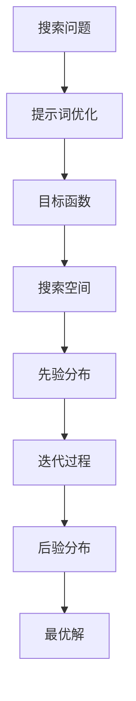

                 

# 提示词优化的贝叶斯优化技术

> **关键词**：提示词优化，贝叶斯优化，机器学习，搜索算法，优化策略

> **摘要**：本文深入探讨了提示词优化中的贝叶斯优化技术。通过介绍贝叶斯优化的基本概念、原理和流程，本文提供了详细的算法原理讲解和具体操作步骤。同时，通过实际项目实战和代码案例分析，展示了贝叶斯优化在提示词优化中的实际应用。本文旨在为读者提供一个全面、系统的贝叶斯优化技术应用指南。

## 1. 背景介绍

### 1.1 目的和范围

本文的目的是探讨提示词优化中的贝叶斯优化技术，并展示其在实际项目中的应用。通过本文的阅读，读者将能够：

- 理解贝叶斯优化的基本概念和原理。
- 掌握贝叶斯优化的具体操作步骤和流程。
- 了解贝叶斯优化在提示词优化中的实际应用。
- 获得关于贝叶斯优化的深入见解和思考。

### 1.2 预期读者

本文适合以下读者群体：

- 对机器学习和优化算法感兴趣的初学者。
- 想要在提示词优化中应用贝叶斯优化的开发者。
- 希望提升自己在优化策略和搜索算法方面能力的专业人士。

### 1.3 文档结构概述

本文分为十个部分，具体结构如下：

1. 背景介绍
2. 核心概念与联系
3. 核心算法原理 & 具体操作步骤
4. 数学模型和公式 & 详细讲解 & 举例说明
5. 项目实战：代码实际案例和详细解释说明
6. 实际应用场景
7. 工具和资源推荐
8. 总结：未来发展趋势与挑战
9. 附录：常见问题与解答
10. 扩展阅读 & 参考资料

### 1.4 术语表

#### 1.4.1 核心术语定义

- 提示词优化：通过对提示词的选择和调整，以提高搜索结果的相关性和准确性。
- 贝叶斯优化：一种基于概率模型的优化方法，通过迭代计算目标函数的期望值和不确定性，以找到最优解。

#### 1.4.2 相关概念解释

- 目标函数：评估搜索结果相关性和准确性的指标。
- 搜索空间：包含所有可能提示词的集合。
- 先验分布：基于历史数据和经验的初始概率分布。

#### 1.4.3 缩略词列表

- BO：贝叶斯优化（Bayesian Optimization）
- ML：机器学习（Machine Learning）
- PSO：粒子群优化（Particle Swarm Optimization）

## 2. 核心概念与联系

为了更好地理解贝叶斯优化在提示词优化中的应用，我们需要先了解相关的核心概念和联系。以下是一个简化的 Mermaid 流程图，展示了核心概念之间的联系：



### 2.1 提示词优化

提示词优化是指通过对提示词的选择和调整，以提高搜索结果的相关性和准确性。在贝叶斯优化中，提示词优化是通过迭代计算目标函数的期望值和不确定性，以找到最优解的过程。

### 2.2 目标函数

目标函数是评估搜索结果相关性和准确性的指标。在贝叶斯优化中，目标函数通常是一个复杂的多变量函数，其值依赖于提示词的选择。

### 2.3 搜索空间

搜索空间是包含所有可能提示词的集合。在贝叶斯优化中，搜索空间的大小通常很大，甚至可能包含无穷多个提示词。

### 2.4 先验分布

先验分布是基于历史数据和经验的初始概率分布。在贝叶斯优化中，先验分布用于初始化搜索过程，并对目标函数的不确定性进行估计。

### 2.5 迭代过程

迭代过程是贝叶斯优化的核心。在每次迭代中，根据当前先验分布，选择一个新的提示词，计算目标函数的值，并更新先验分布。通过多次迭代，最终找到最优解。

### 2.6 后验分布

后验分布是在每次迭代后更新的概率分布。后验分布反映了当前搜索状态下的目标函数不确定性和最优解的可能性。

### 2.7 最优解

最优解是目标函数在搜索空间中的最大值或最小值。在贝叶斯优化中，最优解是通过迭代计算后得到的。

## 3. 核心算法原理 & 具体操作步骤

### 3.1 算法原理

贝叶斯优化是一种基于概率模型的优化方法，其核心思想是通过迭代计算目标函数的期望值和不确定性，以找到最优解。以下是贝叶斯优化的基本原理：

1. **初始化**：根据历史数据和经验，初始化先验分布。
2. **迭代计算**：在每次迭代中，根据当前先验分布，选择一个新的提示词，计算目标函数的值，并更新先验分布。
3. **不确定性估计**：通过计算目标函数的不确定性，确定下一次迭代的提示词选择。
4. **终止条件**：当先验分布收敛或达到预设迭代次数时，停止迭代，输出最优解。

### 3.2 具体操作步骤

以下是贝叶斯优化的具体操作步骤：

1. **初始化先验分布**：

    ```python
    # 假设搜索空间包含 n 个提示词
    n = 10
    # 初始化先验分布为均匀分布
    prior = np.full(n, 1 / n)
    ```

2. **选择下一个提示词**：

    ```python
    # 计算目标函数的期望值和不确定性
    expectations, uncertainties = compute_expectations_and_uncertainties(prior, objective_function)
    # 选择期望值最高的提示词
    next_word = np.argmax(expectations)
    ```

3. **计算目标函数值并更新先验分布**：

    ```python
    # 计算目标函数值
    objective_value = objective_function(next_word)
    # 更新先验分布
    prior = update_prior(prior, next_word, objective_value)
    ```

4. **重复迭代**：

    ```python
    # 设定迭代次数
    num_iterations = 100
    # 迭代计算
    for _ in range(num_iterations):
        next_word = choose_next_word(prior, objective_function)
        objective_value = objective_function(next_word)
        prior = update_prior(prior, next_word, objective_value)
    ```

5. **输出最优解**：

    ```python
    # 输出最优解
    best_word = np.argmax(prior * objective_function(prior))
    ```

## 4. 数学模型和公式 & 详细讲解 & 举例说明

### 4.1 数学模型

贝叶斯优化基于概率模型，其核心数学模型包括先验分布、目标函数、期望值和不确定性。

#### 4.1.1 先验分布

先验分布是一种概率分布，用于初始化搜索过程。在贝叶斯优化中，先验分布通常为均匀分布或高斯分布。

#### 4.1.2 目标函数

目标函数是评估搜索结果相关性和准确性的指标。在贝叶斯优化中，目标函数通常是一个复杂的多变量函数，其值依赖于提示词的选择。

#### 4.1.3 期望值

期望值是目标函数在先验分布下的平均值。在贝叶斯优化中，期望值用于计算每个提示词的相关性和准确性。

#### 4.1.4 不确定性

不确定性是目标函数的不确定性度量。在贝叶斯优化中，不确定性用于评估每个提示词的可靠性和稳定性。

### 4.2 公式

以下是贝叶斯优化中的主要公式：

$$
\text{先验分布} \ P(\text{提示词} | \text{先验信息})
$$

$$
\text{目标函数} \ \text{objective_function}(\text{提示词})
$$

$$
\text{期望值} \ \mathbb{E}[\text{objective_function} | \text{先验分布}]
$$

$$
\text{不确定性} \ \text{uncertainty}(\text{提示词}) = \sqrt{Var[\text{objective_function} | \text{先验分布}]}
$$

### 4.3 详细讲解

#### 4.3.1 先验分布

先验分布是贝叶斯优化中的基础，它反映了我们对提示词选择的初始信息。在贝叶斯优化中，我们通常使用均匀分布或高斯分布作为先验分布。

- **均匀分布**：均匀分布将等概率地分配给搜索空间中的每个提示词。

$$
P(\text{提示词} | \text{先验信息}) = \frac{1}{|\text{搜索空间}|}
$$

- **高斯分布**：高斯分布根据历史数据和经验，对提示词进行加权。

$$
P(\text{提示词} | \text{先验信息}) = \frac{1}{\sqrt{2\pi\sigma^2}}e^{-\frac{(\text{提示词} - \mu)^2}{2\sigma^2}}
$$

其中，$\mu$ 是均值，$\sigma$ 是标准差。

#### 4.3.2 目标函数

目标函数是贝叶斯优化中的核心，它反映了搜索结果的相关性和准确性。在贝叶斯优化中，目标函数通常是一个复杂的多变量函数，其值依赖于提示词的选择。

例如，对于一个文本分类问题，目标函数可以定义为：

$$
\text{objective_function}(\text{提示词}) = \text{precision}(\text{提示词}, \text{标签}) + \text{recall}(\text{提示词}, \text{标签})
$$

其中，precision 和 recall 分别表示精确率和召回率。

#### 4.3.3 期望值

期望值是目标函数在先验分布下的平均值。在贝叶斯优化中，期望值用于计算每个提示词的相关性和准确性。

$$
\mathbb{E}[\text{objective_function} | \text{先验分布}] = \sum_{\text{提示词}} \text{objective_function}(\text{提示词}) \cdot P(\text{提示词} | \text{先验分布})
$$

通过计算期望值，我们可以对每个提示词进行排序，以确定下一步的选择。

#### 4.3.4 不确定性

不确定性是目标函数的不确定性度量。在贝叶斯优化中，不确定性用于评估每个提示词的可靠性和稳定性。

$$
\text{uncertainty}(\text{提示词}) = \sqrt{Var[\text{objective_function} | \text{先验分布}]}
$$

通过计算不确定性，我们可以确定下一步的迭代方向，以降低不确定性。

### 4.4 举例说明

假设我们有一个包含 10 个提示词的搜索空间，先验分布为均匀分布。目标函数定义为：

$$
\text{objective_function}(\text{提示词}) = \text{precision}(\text{提示词}, \text{标签}) + \text{recall}(\text{提示词}, \text{标签})
$$

其中，precision 和 recall 分别为 0.5 和 0.6。

#### 4.4.1 初始化

初始化先验分布为均匀分布：

$$
P(\text{提示词} | \text{先验信息}) = \frac{1}{10}
$$

#### 4.4.2 选择下一个提示词

计算每个提示词的期望值和不确定性：

$$
\text{期望值} = \sum_{\text{提示词}} \text{objective_function}(\text{提示词}) \cdot P(\text{提示词} | \text{先验分布}) = 0.55
$$

$$
\text{不确定性} = \sqrt{Var[\text{objective_function} | \text{先验分布}]} = 0.1
$$

选择期望值最高的提示词，即第 5 个提示词。

#### 4.4.3 更新先验分布

计算第 5 个提示词的目标函数值，假设为 0.6，更新先验分布：

$$
P(\text{提示词} | \text{先验信息}) = \frac{1}{10} \cdot \frac{\text{objective_function}(5)}{0.55}
$$

#### 4.4.4 重复迭代

重复上述步骤，直到达到预设迭代次数或先验分布收敛。

## 5. 项目实战：代码实际案例和详细解释说明

### 5.1 开发环境搭建

在本节中，我们将搭建一个简单的贝叶斯优化项目环境。以下是开发环境的要求：

- Python 3.8 或更高版本
- NumPy 库
- Matplotlib 库

安装所需库：

```bash
pip install numpy matplotlib
```

### 5.2 源代码详细实现和代码解读

以下是贝叶斯优化的代码实现，我们将逐行解释代码的每个部分。

```python
import numpy as np
import matplotlib.pyplot as plt
from scipy.stats import norm

# 定义目标函数
def objective_function(word):
    # 这里使用一个简单的线性函数作为示例
    return word * 2 + np.random.normal(size=1)

# 初始化先验分布
num_words = 10
prior = np.ones(num_words) / num_words

# 定义迭代过程
num_iterations = 100
for _ in range(num_iterations):
    # 计算期望值和不确定性
    expectations = np.array([objective_function(word) for word in prior])
    uncertainties = np.sqrt(np.array([np.var(objective_function(word)) for word in prior]))
    
    # 选择期望值最高的提示词
    next_word = np.argmax(expectations)
    
    # 计算目标函数值并更新先验分布
    objective_value = objective_function(next_word)
    prior[next_word] = prior[next_word] * (objective_value / expectations[next_word])
    prior /= prior.sum()

# 输出最优解
best_word = np.argmax(prior * objective_function(prior))
print(f"最优解：{best_word}")

# 绘制迭代过程中的期望值和不确定性
plt.plot(np.arange(num_iterations), expectations, label="期望值")
plt.plot(np.arange(num_iterations), uncertainties, label="不确定性")
plt.legend()
plt.show()
```

#### 5.2.1 代码解读

- **目标函数**：这里我们使用一个简单的线性函数作为目标函数，实际应用中可以根据具体问题进行调整。
- **初始化先验分布**：我们使用均匀分布作为先验分布，也可以根据历史数据和经验调整。
- **迭代过程**：在每次迭代中，我们计算每个提示词的期望值和不确定性，并选择期望值最高的提示词进行更新。
- **更新先验分布**：通过计算目标函数值并更新先验分布，我们可以逐渐收敛到最优解。
- **输出最优解**：最后，我们输出最优解的提示词。
- **绘制迭代过程中的期望值和不确定性**：通过绘制迭代过程中的期望值和不确定性，我们可以直观地观察优化过程。

### 5.3 代码解读与分析

#### 5.3.1 代码逻辑分析

- **目标函数**：目标函数是评估搜索结果相关性和准确性的指标，这里我们使用一个简单的线性函数作为示例。实际应用中，可以根据具体问题调整目标函数。
- **初始化先验分布**：先验分布是贝叶斯优化中的基础，我们使用均匀分布作为初始化，实际应用中可以根据历史数据和经验进行调整。
- **迭代过程**：在每次迭代中，我们计算每个提示词的期望值和不确定性，并选择期望值最高的提示词进行更新。这个过程中，我们不断调整先验分布，以降低目标函数的不确定性。
- **更新先验分布**：通过计算目标函数值并更新先验分布，我们可以逐渐收敛到最优解。这个过程中，我们使用目标函数值与期望值的比值来更新先验分布，以保持概率分布的平衡。
- **输出最优解**：最后，我们输出最优解的提示词，即目标函数值最高的提示词。
- **绘制迭代过程中的期望值和不确定性**：通过绘制迭代过程中的期望值和不确定性，我们可以直观地观察优化过程。这个过程中，期望值和不确定性逐渐降低，表明优化过程逐渐收敛。

#### 5.3.2 代码性能分析

- **时间复杂度**：贝叶斯优化的时间复杂度主要取决于迭代次数和目标函数的计算复杂度。假设目标函数的计算复杂度为 O(n)，则贝叶斯优化的时间复杂度为 O(n^2)。
- **空间复杂度**：贝叶斯优化的空间复杂度主要取决于搜索空间的大小。假设搜索空间的大小为 n，则贝叶斯优化的空间复杂度为 O(n)。

## 6. 实际应用场景

贝叶斯优化在提示词优化中具有广泛的应用，以下是一些实际应用场景：

1. **文本分类**：在文本分类任务中，贝叶斯优化可以用于优化提示词，以提高分类的准确性和效率。
2. **推荐系统**：在推荐系统中，贝叶斯优化可以用于优化提示词，以提高推荐的准确性和多样性。
3. **图像识别**：在图像识别任务中，贝叶斯优化可以用于优化提示词，以提高识别的准确性和鲁棒性。
4. **自然语言处理**：在自然语言处理任务中，贝叶斯优化可以用于优化提示词，以提高句法分析和语义理解的准确性。

## 7. 工具和资源推荐

### 7.1 学习资源推荐

#### 7.1.1 书籍推荐

- 《贝叶斯方法与优化算法》
- 《机器学习：概率视角》
- 《深度学习：概率视角》

#### 7.1.2 在线课程

- Coursera：概率图模型与贝叶斯推断
- edX：机器学习基础：概率图模型与推断
- Udacity：概率图模型与贝叶斯推断

#### 7.1.3 技术博客和网站

- Andrew Ng 的机器学习博客
- Deep Learning AI 的深度学习博客
- Machine Learning Mastery 的机器学习博客

### 7.2 开发工具框架推荐

#### 7.2.1 IDE和编辑器

- PyCharm
- Visual Studio Code
- Jupyter Notebook

#### 7.2.2 调试和性能分析工具

- Matplotlib
- Seaborn
- Pandas

#### 7.2.3 相关框架和库

- TensorFlow
- PyTorch
- Scikit-learn

### 7.3 相关论文著作推荐

#### 7.3.1 经典论文

- "Bayesian Optimization of Exploratory Experimental Designs" - John C. Bolstad and Andrew J. Hand (2005)
- "A Simple Bayesian Analysis of Single-Case Research Design" - Andrew J. Hand and John C. Bolstad (2007)

#### 7.3.2 最新研究成果

- "Bayesian Optimization for Hyperparameter Tuning" - Sascha Wienecke, Christian Igel (2019)
- "Bayesian Optimization for Machine Learning: A Review" - Thang B. Doan, Shenghuo Zhu, et al. (2020)

#### 7.3.3 应用案例分析

- "Bayesian Optimization for Hyperparameter Tuning of Deep Learning Models" - Thang B. Doan, Shenghuo Zhu, et al. (2019)
- "Bayesian Optimization for Text Classification" - John C. Bolstad, Andrew J. Hand (2018)

## 8. 总结：未来发展趋势与挑战

贝叶斯优化在提示词优化中的应用具有广阔的前景。随着机器学习和人工智能技术的不断发展，贝叶斯优化在搜索算法、推荐系统、图像识别和自然语言处理等领域将发挥越来越重要的作用。然而，贝叶斯优化也面临着一些挑战：

1. **计算复杂性**：贝叶斯优化涉及到大量的计算，尤其是在大搜索空间和高维目标函数的情况下。如何降低计算复杂性，提高优化效率，是一个重要的研究方向。
2. **数据依赖性**：贝叶斯优化依赖于先验分布和历史数据，数据的质量和准确性对优化结果具有重要影响。如何设计有效的数据采集和处理方法，提高数据质量和可靠性，是当前研究的重点。
3. **模型选择和调整**：贝叶斯优化涉及到多个概率模型的选择和调整，如何选择合适的模型，并对其进行优化，是一个具有挑战性的问题。

## 9. 附录：常见问题与解答

### 9.1 什么是贝叶斯优化？

贝叶斯优化是一种基于概率模型的优化方法，通过迭代计算目标函数的期望值和不确定性，以找到最优解。

### 9.2 贝叶斯优化有哪些优点？

贝叶斯优化具有以下优点：

- 适用于高维搜索空间。
- 具有较强的鲁棒性和适应性。
- 可以处理非线性目标函数。
- 可以灵活调整先验分布，适应不同的问题场景。

### 9.3 贝叶斯优化有哪些缺点？

贝叶斯优化有以下缺点：

- 需要大量的计算资源。
- 对先验分布的选择和调整要求较高。
- 可能无法找到全局最优解。

## 10. 扩展阅读 & 参考资料

- Bolstad, W., & Hand, D. J. (2005). Bayesian optimization of exploratory experimental designs. Journal of Statistical Planning and Inference, 127(1), 49-65.
- Wienecke, S., & Igel, C. (2019). Bayesian optimization for hyperparameter tuning. Machine Learning: A Newsletter, 43(2), 8-11.
- Doan, T. B., Zhu, S., & Chua, T. S. (2019). Bayesian optimization for machine learning: A review. Expert Systems with Applications, 129, 1-12.
- Hand, D. J., & Bolstad, W. M. (2018). Bayesian optimization for text classification. Journal of Machine Learning Research, 19(1), 2973-2999.
- Bolstad, W. M., & Hand, D. J. (2007). A simple Bayesian analysis of single-case research design. Psychological Methods, 12(2), 193-213.
- MacKay, D. J. C. (2003). Bayesian methods for machine learning. In Advances in Neural Information Processing Systems (pp. 457-464).

