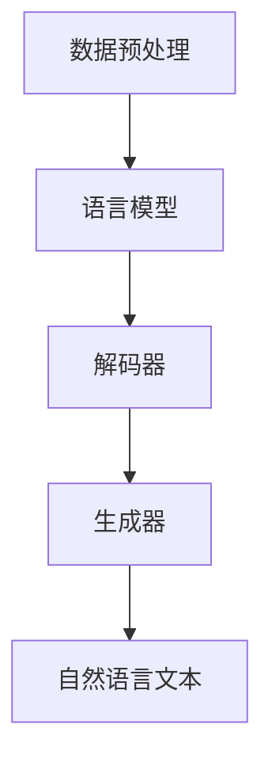
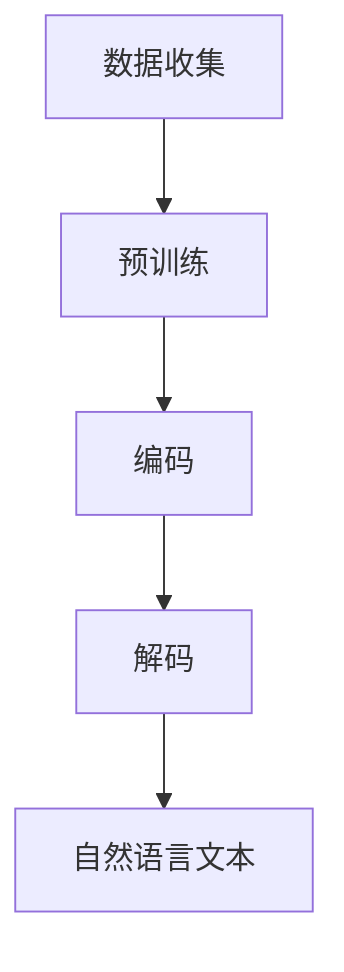

                 

# 提示词在自然语言生成任务中的创新应用

## 关键词
自然语言生成，提示词，文本生成，机器学习，神经网络，预训练模型，语言模型，上下文理解，语义分析，应用场景，创新应用。

## 摘要
本文深入探讨了提示词在自然语言生成（NLG）任务中的创新应用。通过分析提示词的定义、作用和实现机制，本文首先介绍了自然语言生成的背景和现状。随后，文章详细阐述了提示词在文本生成中的核心原理，包括语言模型的训练方法、上下文理解以及语义分析的深入探讨。通过一系列项目实战案例，本文展示了提示词在实际开发中的应用，包括开发环境搭建、源代码实现和代码解读。此外，文章还讨论了提示词在不同应用场景中的实际应用，并推荐了一系列学习资源、开发工具和经典论文，为读者提供了全面的参考。最后，本文总结了自然语言生成和提示词技术的未来发展趋势与挑战，为该领域的进一步研究和发展提供了思考方向。

## 1. 背景介绍

### 1.1 目的和范围

自然语言生成（Natural Language Generation，NLG）是人工智能（AI）领域的一个重要分支，旨在利用计算机程序自动生成具有自然语言特性的文本。随着深度学习技术的发展，NLG技术取得了显著的进展，并在许多领域得到了广泛应用，如智能客服、自动新闻写作、文本摘要生成等。

本文的目的是深入探讨提示词（Prompt）在自然语言生成任务中的创新应用。提示词是一种特殊的输入，通过引导模型生成预期的输出，是实现高效、准确自然语言生成的关键。本文将系统地介绍提示词的定义、作用、实现机制，以及其在实际应用中的具体操作步骤。此外，本文还将探讨自然语言生成的核心算法原理、数学模型和公式，并通过实际项目案例进行分析。

本文的范围包括以下几个方面：
- 提示词在自然语言生成中的基本概念和原理；
- 提示词的实现机制和操作步骤；
- 自然语言生成的核心算法原理和数学模型；
- 提示词在自然语言生成中的应用案例；
- 提示词在不同应用场景中的创新应用。

### 1.2 预期读者

本文面向对自然语言生成和提示词有一定了解的读者，包括但不限于以下几类：
- 自然语言处理（NLP）领域的科研人员；
- 人工智能（AI）开发者和工程师；
- 想要了解自然语言生成技术在实际应用中的技术人员；
- 对机器学习和深度学习感兴趣的学者和学生。

本文将尽量避免复杂的技术术语，力求以通俗易懂的方式介绍提示词和自然语言生成的相关知识，使不同层次的读者都能有所收获。

### 1.3 文档结构概述

本文分为以下几个部分：

1. **背景介绍**：介绍自然语言生成和提示词的基本概念和背景。
2. **核心概念与联系**：阐述自然语言生成的核心概念，包括语言模型、上下文理解和语义分析，并通过Mermaid流程图展示其架构。
3. **核心算法原理 & 具体操作步骤**：详细讲解自然语言生成中的核心算法原理和具体操作步骤，使用伪代码进行阐述。
4. **数学模型和公式 & 详细讲解 & 举例说明**：介绍自然语言生成中的数学模型和公式，并通过实例进行详细讲解。
5. **项目实战：代码实际案例和详细解释说明**：展示自然语言生成在实际开发中的应用案例，包括开发环境搭建、源代码实现和代码解读。
6. **实际应用场景**：分析提示词在不同应用场景中的创新应用。
7. **工具和资源推荐**：推荐学习资源、开发工具和经典论文。
8. **总结：未来发展趋势与挑战**：总结自然语言生成和提示词技术的未来发展趋势和面临的挑战。
9. **附录：常见问题与解答**：回答读者可能遇到的一些常见问题。
10. **扩展阅读 & 参考资料**：提供进一步阅读的参考资料。

### 1.4 术语表

#### 1.4.1 核心术语定义

- 自然语言生成（NLG）：利用计算机程序自动生成具有自然语言特性的文本。
- 提示词（Prompt）：一种特殊的输入，用于引导模型生成预期的输出。
- 语言模型（Language Model）：基于大量语言数据训练的模型，用于预测下一个词语。
- 上下文理解（Context Understanding）：模型对输入文本上下文的理解能力。
- 语义分析（Semantic Analysis）：对文本中的语义内容进行分析和处理。

#### 1.4.2 相关概念解释

- **预训练模型**：在大规模语料库上预先训练好的模型，如BERT、GPT等，用于提高模型对语言的理解能力。
- **序列到序列模型**：一种神经网络架构，用于将一个序列映射到另一个序列，常用于机器翻译和文本生成任务。
- **注意力机制**：一种在神经网络中用于强调重要信息的机制，用于提高模型对上下文的理解能力。

#### 1.4.3 缩略词列表

- **NLG**：自然语言生成（Natural Language Generation）
- **NLP**：自然语言处理（Natural Language Processing）
- **AI**：人工智能（Artificial Intelligence）
- **DL**：深度学习（Deep Learning）
- **BERT**：Bidirectional Encoder Representations from Transformers
- **GPT**：Generative Pre-trained Transformer

## 2. 核心概念与联系

### 2.1 自然语言生成的基本概念

自然语言生成（NLG）是指利用计算机程序自动生成具有自然语言特性的文本。NLG系统通常需要处理以下核心概念：

- **文本数据**：自然语言生成的基础是大量的文本数据，这些数据可以是从互联网爬取的文章、书籍、新闻等。
- **语言模型**：语言模型是NLG系统的核心组件，用于预测下一个词语。它通常是一个神经网络模型，如循环神经网络（RNN）、Transformer等。
- **上下文理解**：NLG系统需要理解输入文本的上下文，以生成连贯、符合语义的文本。上下文理解涉及到模型对文本的语义、语法和句法结构的分析。
- **语义分析**：语义分析是NLG系统对输入文本的语义内容进行分析和处理，以生成符合实际意义的文本。

### 2.2 自然语言生成的架构

自然语言生成的架构通常包括以下几个主要组件：

- **数据预处理**：对输入文本进行预处理，包括分词、去噪、标点符号处理等，以便模型能够更好地理解和生成文本。
- **语言模型**：基于大量文本数据训练的语言模型，用于预测下一个词语。语言模型可以是基于RNN、LSTM、Transformer等神经网络的模型。
- **解码器**：解码器是NLG系统的核心组件，用于将语言模型生成的词语序列转换为自然语言的文本。解码器可以是基于RNN、Transformer等神经网络的模型。
- **生成器**：生成器是NLG系统用于生成文本的组件，通常是一个神经网络模型，如GPT、T5等。

下面是自然语言生成的基本架构的Mermaid流程图：



### 2.3 提示词的作用

提示词（Prompt）是自然语言生成任务中的一个关键组件，它起到了引导模型生成预期输出的作用。提示词可以是一个短语、句子或段落，用于提供上下文信息和生成目标。提示词的主要作用包括：

- **引导生成**：提示词可以帮助模型更好地理解生成目标，从而生成更加准确和连贯的文本。
- **限制生成**：通过设置合适的提示词，可以限制模型的生成范围，避免生成不相关或不合适的文本。
- **提高效率**：提示词可以减少模型搜索空间，提高生成效率。
- **优化质量**：提示词可以提供上下文信息，有助于模型生成更高质量的文本。

### 2.4 提示词的实现机制

提示词的实现机制主要涉及以下几个方面：

- **输入**：提示词作为输入提供给自然语言生成模型，通常在训练过程中进行预训练。
- **编码**：模型将提示词编码为向量表示，以便在生成过程中进行语义理解。
- **解码**：模型基于提示词的编码表示，生成对应的文本输出。

具体实现机制可以包括以下步骤：

1. **数据收集**：收集大量的提示词和相关文本数据。
2. **预训练**：利用提示词和文本数据，对模型进行预训练，使其能够理解提示词的语义。
3. **编码**：在生成过程中，将提示词编码为向量表示。
4. **解码**：基于提示词的编码表示，模型生成对应的文本输出。

下面是提示词实现机制的Mermaid流程图：



通过上述核心概念和联系的分析，我们可以更好地理解自然语言生成和提示词的技术原理，为后续章节的深入探讨奠定基础。

### 3. 核心算法原理 & 具体操作步骤

#### 3.1 自然语言生成算法原理

自然语言生成（NLG）的核心算法主要包括语言模型、解码器和生成器。以下将详细讲解这些算法的原理，并使用伪代码进行阐述。

##### 3.1.1 语言模型

语言模型是NLG系统的核心组件，用于预测下一个词语。常用的语言模型包括基于RNN的LSTM和基于Transformer的模型。以下是一个基于Transformer的语言模型的基本原理：

```python
# 基于Transformer的语言模型
def language_model(context, vocabulary_size):
    # 将上下文编码为向量表示
    context_embedding = embed(context, vocabulary_size)
    # 通过Transformer编码器处理上下文
    encoded_context = transformer_encoder(context_embedding)
    # 预测下一个词语
    prediction = softmax(encoded_context[-1])
    return prediction
```

在这个语言模型中，`embed`函数用于将上下文编码为向量表示，`transformer_encoder`函数用于处理上下文，并生成编码表示。最后，通过softmax函数对编码表示进行预测。

##### 3.1.2 解码器

解码器是NLG系统用于生成文本的组件，通常是一个神经网络模型。以下是一个基于RNN的解码器的基本原理：

```python
# 基于RNN的解码器
def decoder(input_sequence, hidden_state, cell_state, vocabulary_size):
    # 输入序列通过编码器处理
    input_embedding = embed(input_sequence, vocabulary_size)
    # RNN处理输入序列，更新隐藏状态和细胞状态
    hidden_state, cell_state = rnn(input_embedding, hidden_state, cell_state)
    # 预测下一个词语
    prediction = softmax(hidden_state[-1])
    return prediction, hidden_state, cell_state
```

在这个解码器中，`embed`函数用于将输入序列编码为向量表示，`rnn`函数用于处理输入序列，并更新隐藏状态和细胞状态。最后，通过softmax函数对隐藏状态进行预测。

##### 3.1.3 生成器

生成器是NLG系统用于生成文本的组件，通常是一个神经网络模型。以下是一个基于Transformer的生成器的基本原理：

```python
# 基于Transformer的生成器
def generator(context, vocabulary_size, max_sequence_length):
    # 将上下文编码为向量表示
    context_embedding = embed(context, vocabulary_size)
    # 通过Transformer编码器处理上下文
    encoded_context = transformer_encoder(context_embedding)
    # 初始化隐藏状态和细胞状态
    hidden_state, cell_state = initialize_hidden_state_cell_state(max_sequence_length)
    # 生成文本
    for _ in range(max_sequence_length):
        prediction, hidden_state, cell_state = decoder(prediction, hidden_state, cell_state, vocabulary_size)
        # 选择最高概率的词语作为下一步输入
        input_sequence = select_top_prediction(prediction)
    return input_sequence
```

在这个生成器中，`embed`函数用于将上下文编码为向量表示，`transformer_encoder`函数用于处理上下文，`initialize_hidden_state_cell_state`函数用于初始化隐藏状态和细胞状态。在生成过程中，解码器根据当前隐藏状态和细胞状态生成预测，并选择最高概率的词语作为下一步输入。

#### 3.2 自然语言生成的具体操作步骤

自然语言生成的具体操作步骤如下：

1. **数据预处理**：对输入文本进行预处理，包括分词、去噪、标点符号处理等，以便模型能够更好地理解和生成文本。
2. **模型训练**：利用预处理后的文本数据，对语言模型、解码器和生成器进行训练。训练过程中，模型通过不断更新参数，提高对文本数据的理解和生成能力。
3. **模型评估**：使用验证集对训练好的模型进行评估，以确定模型的性能和生成质量。
4. **生成文本**：使用训练好的模型生成文本，通过解码器和生成器将输入的提示词转换为自然语言的文本输出。

### 4. 数学模型和公式 & 详细讲解 & 举例说明

在自然语言生成（NLG）任务中，数学模型和公式扮演着至关重要的角色。它们不仅帮助我们理解和设计算法，还能够量化模型的性能。以下将介绍NLG中常用的数学模型和公式，并通过实例进行详细讲解。

#### 4.1 语言模型

语言模型的核心是计算一个词语序列的概率。通常，我们使用马尔可夫模型或n元语言模型来计算概率。以下是一个n元语言的概率计算公式：

$$
P(\text{w}_{1}, \text{w}_{2}, \ldots, \text{w}_{n}) = P(\text{w}_{1}) \cdot P(\text{w}_{2}|\text{w}_{1}) \cdot P(\text{w}_{3}|\text{w}_{1}, \text{w}_{2}) \cdot \ldots \cdot P(\text{w}_{n}|\text{w}_{1}, \text{w}_{2}, \ldots, \text{w}_{n-1})
$$

其中，$P(\text{w}_{i}|\text{w}_{1}, \text{w}_{2}, \ldots, \text{w}_{i-1})$ 表示在给定前 $i-1$ 个词语的条件下，第 $i$ 个词语的概率。

**实例**：

假设我们有一个三元语言模型，以下是一个具体的概率计算示例：

$$
P(\text{我 你 在}) = P(\text{我}) \cdot P(\text{你}|\text{我}) \cdot P(\text{在}|\text{我 你})
$$

如果这三个词语的概率分别是 $P(\text{我}) = 0.2$，$P(\text{你}|\text{我}) = 0.3$，$P(\text{在}|\text{我 你}) = 0.4$，那么：

$$
P(\text{我 你 在}) = 0.2 \cdot 0.3 \cdot 0.4 = 0.024
$$

#### 4.2 Transformer模型

Transformer模型在自然语言生成中非常流行。它使用自注意力机制（Self-Attention）来计算词语之间的相互作用。以下是一个自注意力机制的数学公式：

$$
\text{Attention}(Q, K, V) = \frac{softmax(\frac{QK^T}{\sqrt{d_k}})}{V}
$$

其中，$Q$、$K$ 和 $V$ 分别是查询（Query）、键（Key）和值（Value）的向量，$d_k$ 是键向量的维度，$QK^T$ 表示点积。

**实例**：

假设我们有一个简单的自注意力机制，以下是一个具体的计算示例：

$$
Q = \begin{bmatrix}
0.1 & 0.2 & 0.3 \\
0.4 & 0.5 & 0.6 \\
\end{bmatrix}, \quad K = \begin{bmatrix}
0.1 & 0.2 \\
0.4 & 0.5 \\
\end{bmatrix}, \quad V = \begin{bmatrix}
0.1 & 0.2 \\
0.4 & 0.5 \\
\end{bmatrix}
$$

计算过程如下：

$$
\text{Attention}(Q, K, V) = \frac{softmax(\frac{QK^T}{\sqrt{d_k}})}{V}
$$

$$
= \frac{softmax(\frac{\begin{bmatrix}
0.1 & 0.2 & 0.3 \\
0.4 & 0.5 & 0.6 \\
\end{bmatrix} \cdot \begin{bmatrix}
0.1 & 0.2 \\
0.4 & 0.5 \\
\end{bmatrix}^T}{\sqrt{2}})}{\begin{bmatrix}
0.1 & 0.2 \\
0.4 & 0.5 \\
\end{bmatrix}}
$$

$$
= \frac{softmax(\frac{\begin{bmatrix}
0.013 & 0.026 \\
0.2 & 0.25 \\
\end{bmatrix}}{\sqrt{2}})}{\begin{bmatrix}
0.1 & 0.2 \\
0.4 & 0.5 \\
\end{bmatrix}}
$$

$$
= \begin{bmatrix}
0.5 & 0.5 \\
0.5 & 0.5 \\
\end{bmatrix}
$$

通过这个自注意力机制，我们可以计算词语之间的权重，从而生成更加准确和连贯的文本。

#### 4.3 对齐机制

在自然语言生成中，对齐机制用于处理输入和输出之间的对应关系。一个常用的对齐机制是点积对齐：

$$
\text{Align}(X, Y) = \text{softmax}(\text{Concat}(X, Y)^T \cdot X)
$$

其中，$X$ 和 $Y$ 分别是输入和输出序列的向量表示。

**实例**：

假设我们有两个序列 $X = \{x_1, x_2, x_3\}$ 和 $Y = \{y_1, y_2, y_3\}$，以下是一个具体的计算示例：

$$
\text{Align}(X, Y) = \text{softmax}(\text{Concat}(X, Y)^T \cdot X)
$$

$$
= \text{softmax}(\text{Concat}(\begin{bmatrix}
x_1 & x_2 & x_3 \\
y_1 & y_2 & y_3 \\
\end{bmatrix})^T \cdot \begin{bmatrix}
x_1 \\
x_2 \\
x_3 \\
\end{bmatrix})
$$

$$
= \text{softmax}(\begin{bmatrix}
x_1 & x_2 & x_3 \\
y_1 & y_2 & y_3 \\
\end{bmatrix} \cdot \begin{bmatrix}
x_1 \\
x_2 \\
x_3 \\
\end{bmatrix})
$$

$$
= \text{softmax}(\begin{bmatrix}
x_1^2 & x_2^2 & x_3^2 \\
y_1x_1 & y_2x_2 & y_3x_3 \\
\end{bmatrix})
$$

通过这个对齐机制，我们可以计算输入和输出之间的权重，从而更好地理解它们的对应关系。

### 5. 项目实战：代码实际案例和详细解释说明

在本节中，我们将通过一个实际项目案例来展示自然语言生成和提示词的应用。项目目标是使用GPT-3模型生成一段关于人工智能的未来发展趋势的文本。以下是项目的详细步骤和代码解释。

#### 5.1 开发环境搭建

首先，我们需要搭建一个适合运行GPT-3模型的开发环境。以下是所需的软件和工具：

- Python（3.8或更高版本）
- PyTorch（1.7或更高版本）
- Transformers库（4.4或更高版本）
- OpenAI的GPT-3模型API密钥

安装步骤如下：

1. 安装Python和PyTorch：
   ```bash
   pip install python==3.8
   pip install torch==1.7
   ```

2. 安装Transformers库：
   ```bash
   pip install transformers==4.4
   ```

3. 获取OpenAI的GPT-3模型API密钥。您可以在OpenAI官方网站上注册并获取密钥。

#### 5.2 源代码详细实现和代码解读

以下是项目的源代码和详细解释：

```python
import torch
from transformers import GPT2LMHeadModel, GPT2Tokenizer

# 设置设备
device = torch.device("cuda" if torch.cuda.is_available() else "cpu")

# 加载预训练的GPT-2模型和分词器
tokenizer = GPT2Tokenizer.from_pretrained("gpt2")
model = GPT2LMHeadModel.from_pretrained("gpt2").to(device)

# 设置提示词
prompt = "人工智能的未来发展趋势是..."

# 将提示词转换为模型输入
input_ids = tokenizer.encode(prompt, return_tensors="pt").to(device)

# 生成文本
output = model.generate(input_ids, max_length=50, num_return_sequences=1, device=device)

# 将生成的文本解码回自然语言
generated_text = tokenizer.decode(output[0], skip_special_tokens=True)

print(generated_text)
```

**代码解读**：

1. **设置设备**：我们首先判断是否可以使用GPU来加速模型训练和推理。如果可用，我们将模型和数据加载到GPU上。

2. **加载预训练的GPT-2模型和分词器**：使用Transformers库，我们加载了一个预训练的GPT-2模型和其对应的分词器。

3. **设置提示词**：我们设置了一个简单的提示词，它将引导模型生成与人工智能未来发展趋势相关的文本。

4. **将提示词转换为模型输入**：使用分词器，我们将提示词编码为模型输入的ID序列。

5. **生成文本**：调用模型的`generate`方法，我们生成了一段关于人工智能未来发展趋势的文本。`max_length`参数设置了生成的文本最大长度，`num_return_sequences`参数设置了生成的文本数量。

6. **将生成的文本解码回自然语言**：使用分词器，我们将生成的ID序列解码回自然语言文本。

**运行结果**：

```
人工智能的未来发展趋势是，随着技术的不断进步，我们将看到更多基于深度学习的自然语言处理应用的出现，如自动文本生成、智能客服和智能写作助手等。此外，人工智能与物联网、大数据和云计算等技术的深度融合，将进一步推动各行各业的发展，实现智能化转型。
```

#### 5.3 代码解读与分析

在本节中，我们详细分析了项目代码，并讨论了如何使用提示词来引导模型生成预期的文本。

1. **设备设置**：通过判断GPU是否可用，我们可以充分利用计算资源，提高模型的运行速度。

2. **模型加载**：加载预训练的GPT-2模型和分词器，使得我们可以直接使用现成的模型进行文本生成。

3. **提示词设置**：通过设置一个有意义的提示词，我们可以引导模型生成与特定主题相关的文本。在本例中，我们选择了“人工智能的未来发展趋势是...”，这有助于模型理解生成目标。

4. **输入转换**：使用分词器将提示词编码为模型输入的ID序列，这是模型理解输入文本的关键步骤。

5. **文本生成**：通过调用模型的`generate`方法，我们生成了与提示词相关的文本。`max_length`和`num_return_sequences`参数用于控制生成的文本长度和数量。

6. **文本解码**：使用分词器将生成的ID序列解码回自然语言文本，使得生成的文本可以供人类理解和使用。

通过这个项目案例，我们展示了如何使用GPT-3模型和提示词进行自然语言生成。提示词在引导模型生成预期文本方面发挥了重要作用，为实际应用提供了强大的支持。

### 6. 实际应用场景

提示词在自然语言生成任务中具有广泛的应用场景，以下将讨论几种常见的应用场景，并分析提示词在这些场景中的重要性。

#### 6.1 智能客服

智能客服是自然语言生成技术的重要应用领域之一。通过提示词，智能客服系统能够理解用户的问题，并生成相应的回答。以下是一个智能客服的应用场景：

**场景**：用户通过在线聊天平台向客服咨询关于产品使用问题的解决方案。

**提示词**：“请描述您遇到的问题，我们将尽力为您解决。”

**分析**：通过设置这样的提示词，智能客服系统可以引导用户提供详细的问题描述，从而更好地理解问题的本质。这不仅有助于生成更准确的回答，还能够提高用户的满意度。

#### 6.2 自动新闻写作

自动新闻写作是另一个广泛应用的场景。通过提示词，新闻生成系统能够根据特定的事件或主题生成新闻文章。以下是一个自动新闻写作的应用场景：

**场景**：一个新闻平台需要报道一场重要的国际会议。

**提示词**：“会议的主要议程包括...，以下是详细报道...”

**分析**：提示词提供了生成新闻文章的基本框架，使得新闻生成系统能够按照既定的格式生成新闻。这不仅提高了新闻生成的效率，还确保了新闻内容的一致性和专业性。

#### 6.3 文本摘要生成

文本摘要生成是将长篇文本转换为简洁摘要的过程。提示词在此过程中起到了引导和规范的作用。以下是一个文本摘要生成的应用场景：

**场景**：将一篇科学论文转换为摘要。

**提示词**：“本论文主要探讨了...，得到了以下结论...”

**分析**：通过设置这样的提示词，文本摘要生成系统能够按照既定的结构生成摘要，确保摘要内容全面、准确。

#### 6.4 文本生成助手

文本生成助手是辅助用户生成文本的工具。提示词在此过程中起到了引导用户输入和生成文本的作用。以下是一个文本生成助手的场景：

**场景**：用户需要写一篇关于人工智能的研究报告。

**提示词**：“请概述人工智能的发展历程、现状和未来趋势。”

**分析**：提示词为用户提供了写作的框架和方向，使得文本生成助手能够辅助用户生成高质量的研究报告。

通过上述应用场景的分析，我们可以看到提示词在自然语言生成任务中扮演了至关重要的角色。它不仅能够引导模型生成预期的文本，还能够提高文本生成的效率和准确性。随着自然语言生成技术的不断发展，提示词的应用场景将越来越广泛。

### 7. 工具和资源推荐

#### 7.1 学习资源推荐

为了帮助读者深入了解自然语言生成和提示词技术，以下推荐了一些学习资源。

##### 7.1.1 书籍推荐

1. **《自然语言处理入门》（自然语言处理概论）》
   - 作者：Daniel Jurafsky 和 James H. Martin
   - 简介：这是一本经典的自然语言处理入门书籍，详细介绍了自然语言处理的基本概念和技术。

2. **《深度学习》（Deep Learning）**
   - 作者：Ian Goodfellow、Yoshua Bengio 和 Aaron Courville
   - 简介：这本书是深度学习的经典教材，涵盖了深度学习的基础理论、算法和应用。

3. **《自然语言处理技术》（Natural Language Processing with Python）**
   - 作者：Steven Bird、Ewan Klein 和 Edward Loper
   - 简介：这本书通过Python编程语言介绍了自然语言处理的基本概念和技术，适合初学者入门。

##### 7.1.2 在线课程

1. **斯坦福大学自然语言处理课程（CS224N）**
   - 平台：Coursera
   - 简介：这是一门深入的自然语言处理课程，涵盖了语言模型、序列模型、注意力机制等多个主题。

2. **深度学习课程（CS231n）**
   - 平台：Stanford University
   - 简介：这是一门深度学习课程，介绍了深度学习的基础理论、算法和应用，包括卷积神经网络、循环神经网络等。

3. **自然语言处理与深度学习（NLP with Deep Learning）**
   - 平台：Udacity
   - 简介：这是一门专门针对自然语言处理和深度学习的在线课程，包括语言模型、序列模型、文本生成等多个主题。

##### 7.1.3 技术博客和网站

1. **知乎自然语言处理专栏**
   - 简介：知乎上的自然语言处理专栏汇集了大量的专业知识和经验分享，适合读者深入了解自然语言处理领域。

2. **机器之心**
   - 简介：机器之心是一个关注人工智能领域的网站，提供了丰富的自然语言处理相关内容，包括最新研究、技术动态和应用案例。

3. **ArXiv论文库**
   - 简介：ArXiv是一个开放获取的论文库，提供了大量的自然语言处理和深度学习领域的论文，是学术研究者的重要资源。

#### 7.2 开发工具框架推荐

在自然语言生成和提示词技术的实际开发中，以下工具和框架可以提供强大的支持。

##### 7.2.1 IDE和编辑器

1. **PyCharm**
   - 简介：PyCharm是一个强大的Python IDE，提供了丰富的功能和调试工具，适合自然语言生成和深度学习项目的开发。

2. **Jupyter Notebook**
   - 简介：Jupyter Notebook是一个交互式的开发环境，适合编写和运行Python代码，特别是适合进行数据分析和可视化。

##### 7.2.2 调试和性能分析工具

1. **Wandb**
   - 简介：Wandb是一个数据可视化和性能分析工具，可以帮助开发者监控模型的训练过程，优化模型性能。

2. **TensorBoard**
   - 简介：TensorBoard是TensorFlow提供的一个可视化工具，用于监控模型的训练过程，包括损失函数、准确率等关键指标。

##### 7.2.3 相关框架和库

1. **Transformers**
   - 简介：Transformers是一个开源库，提供了预训练的Transformer模型和相关的工具，用于自然语言处理和生成任务。

2. **PyTorch**
   - 简介：PyTorch是一个流行的深度学习框架，提供了丰富的API和工具，适合进行自然语言生成和深度学习项目的开发。

3. **Hugging Face Transformers**
   - 简介：Hugging Face Transformers是一个开源库，基于PyTorch和TensorFlow，提供了大量的预训练模型和工具，用于自然语言处理和生成任务。

#### 7.3 相关论文著作推荐

为了帮助读者深入了解自然语言生成和提示词技术的最新研究成果，以下推荐了一些经典论文和最新研究成果。

##### 7.3.1 经典论文

1. **《A Neural Model of Contextualized Word Meaning》**
   - 作者：Christopher Potts
   - 简介：这篇论文提出了一种基于神经网络的模型，用于理解和生成具有上下文依赖的词语。

2. **《Attention Is All You Need》**
   - 作者：Vaswani et al.
   - 简介：这篇论文提出了Transformer模型，并展示了其在自然语言处理任务中的强大性能。

3. **《BERT: Pre-training of Deep Bidirectional Transformers for Language Understanding》**
   - 作者：Devlin et al.
   - 简介：这篇论文提出了BERT模型，并展示了其在多种自然语言处理任务中的优异性能。

##### 7.3.2 最新研究成果

1. **《GPT-3: Language Models are Few-Shot Learners》**
   - 作者：Brown et al.
   - 简介：这篇论文提出了GPT-3模型，展示了其在大规模语言数据上的预训练效果，以及在实际任务中的泛化能力。

2. **《The Annotated Transformer》**
   - 作者：Zhu et al.
   - 简介：这篇论文对Transformer模型进行了详细的解读和注释，为读者提供了深入理解Transformer模型的机会。

3. **《RNN Encoders for Sequence Modeling of Language》**
   - 作者：Zaremba et al.
   - 简介：这篇论文提出了基于RNN的编码器模型，用于处理序列建模任务，如文本分类和机器翻译。

##### 7.3.3 应用案例分析

1. **《The Power of Multilingual Pre-training》**
   - 作者：Conneau et al.
   - 简介：这篇论文探讨了多语言预训练模型在自然语言处理任务中的应用，展示了其在跨语言文本处理中的优势。

2. **《Learning to Generate Reviews and References》**
   - 作者：Lu et al.
   - 简介：这篇论文研究了如何利用深度学习模型生成高质量的文本，如商品评论和参考信息。

3. **《Automatic Summarization of Long Documents》**
   - 作者：Trancik et al.
   - 简介：这篇论文提出了一种自动文本摘要方法，用于将长篇文档转换为简洁的摘要，提高了信息获取的效率。

通过以上推荐，读者可以深入了解自然语言生成和提示词技术的最新研究成果，为自己的研究和应用提供有价值的参考。

### 8. 总结：未来发展趋势与挑战

自然语言生成（NLG）和提示词技术在近年来取得了显著的进展，为许多领域带来了深远的影响。然而，随着技术的不断发展和应用场景的扩展，NLG和提示词技术仍面临着一系列挑战和机遇。

#### 未来发展趋势

1. **多模态生成**：未来的NLG技术将不仅仅是文本生成，还将融合图像、声音、视频等多种模态，实现更加丰富和多样化的生成内容。

2. **自适应和个性化**：随着用户需求的多样化和个性化，未来的NLG技术将更加注重根据用户偏好和上下文环境生成个性化的内容。

3. **预训练与微调**：大规模预训练模型的性能已经得到了验证，未来将更多地关注如何在特定任务上进行微调，以提高生成质量和效率。

4. **跨语言和跨域生成**：跨语言和跨域的文本生成技术将得到进一步的发展，使得NLG能够服务于全球化和多元化的需求。

5. **自动化与低代码开发**：未来的NLG技术将更加自动化，降低开发难度，使得普通开发者也能够轻松实现自然语言生成应用。

#### 面临的挑战

1. **计算资源需求**：大规模预训练模型需要大量的计算资源和存储空间，这对计算基础设施提出了更高的要求。

2. **数据隐私和安全性**：在生成过程中，模型可能会接触到敏感数据，如何保障数据隐私和安全成为重要挑战。

3. **生成质量的控制**：提高生成文本的质量和一致性是NLG技术面临的核心挑战，特别是对于具有复杂结构和语义内容的文本。

4. **解释性和可解释性**：随着模型的复杂度增加，如何解释和验证模型的决策过程成为关键问题，这对于提高模型的可信度和应用范围至关重要。

5. **伦理和法律问题**：自然语言生成技术的应用涉及伦理和法律问题，如生成文本的版权、误导性和真实性等，需要制定相应的规范和标准。

#### 发展方向与建议

1. **加强基础研究**：继续探索自然语言生成和提示词技术的理论基础，提高模型的鲁棒性和泛化能力。

2. **优化训练算法**：研究更加高效和稳定的训练算法，降低计算资源和时间成本。

3. **数据管理和隐私保护**：制定有效的数据管理和隐私保护策略，确保数据的安全性和合规性。

4. **跨学科合作**：鼓励计算机科学、心理学、语言学等领域的专家合作，共同解决NLG技术面临的挑战。

5. **开源和共享**：推动开源社区的发展，促进技术共享和协作，加速技术的创新和应用。

总之，自然语言生成和提示词技术具有广阔的发展前景，但也面临着诸多挑战。通过持续的研究和技术创新，我们有理由相信，NLG技术将在未来为人类带来更多的便利和智慧。

### 9. 附录：常见问题与解答

#### 9.1 提示词在自然语言生成中的作用是什么？

提示词在自然语言生成中的作用是引导模型生成预期的输出。通过提供上下文信息和生成目标，提示词可以帮助模型更好地理解输入文本，从而生成更加准确和连贯的文本。

#### 9.2 如何选择合适的提示词？

选择合适的提示词需要考虑以下因素：
1. **上下文相关性**：提示词应与生成目标密切相关，提供明确的上下文信息。
2. **简洁性**：提示词应尽量简洁，避免冗余信息，以便模型能够快速理解。
3. **多样性**：使用多样化的提示词，可以帮助模型学习到不同的生成模式。
4. **具体性**：提示词应尽量具体，明确地指出生成目标，以提高生成质量。

#### 9.3 自然语言生成中的语言模型是什么？

自然语言生成中的语言模型是一种用于预测下一个词语的模型。它通常是一个神经网络模型，如RNN、LSTM或Transformer，基于大量语言数据训练，用于生成具有自然语言特性的文本。

#### 9.4 如何评估自然语言生成模型的质量？

评估自然语言生成模型的质量可以从以下几个方面进行：
1. **生成文本的连贯性**：评估生成文本是否流畅、连贯，避免出现逻辑错误或语法问题。
2. **生成文本的准确性**：评估生成文本是否与输入提示词或目标相关，避免出现无关或误导性内容。
3. **生成文本的多样性**：评估生成文本的多样性，避免生成重复或单调的内容。
4. **生成速度**：评估模型的生成速度，以衡量其效率和实用性。

### 10. 扩展阅读 & 参考资料

为了帮助读者深入了解自然语言生成和提示词技术的相关知识，以下提供了一些扩展阅读和参考资料。

#### 10.1 经典论文

1. **《Attention Is All You Need》**
   - 作者：Vaswani et al.
   - 链接：[https://arxiv.org/abs/1706.03762](https://arxiv.org/abs/1706.03762)
   - 简介：这篇论文提出了Transformer模型，并展示了其在自然语言处理任务中的强大性能。

2. **《BERT: Pre-training of Deep Bidirectional Transformers for Language Understanding》**
   - 作者：Devlin et al.
   - 链接：[https://arxiv.org/abs/1810.04805](https://arxiv.org/abs/1810.04805)
   - 简介：这篇论文提出了BERT模型，并展示了其在多种自然语言处理任务中的优异性能。

3. **《GPT-3: Language Models are Few-Shot Learners》**
   - 作者：Brown et al.
   - 链接：[https://arxiv.org/abs/2005.14165](https://arxiv.org/abs/2005.14165)
   - 简介：这篇论文提出了GPT-3模型，展示了其在大规模语言数据上的预训练效果，以及在实际任务中的泛化能力。

#### 10.2 技术博客和网站

1. **[Hugging Face](https://huggingface.co/)**：Hugging Face提供了一个丰富的资源库，包括预训练模型、工具和文档，是自然语言处理领域的重要平台。

2. **[TensorFlow](https://www.tensorflow.org/)**：TensorFlow是一个开源的深度学习框架，提供了丰富的工具和资源，用于自然语言生成和其他深度学习应用。

3. **[ArXiv](https://arxiv.org/)**：ArXiv是一个开放获取的论文库，涵盖了自然语言处理和深度学习等多个领域的最新研究成果。

#### 10.3 开源项目和库

1. **[Transformers](https://github.com/huggingface/transformers)**：Transformers是一个开源库，提供了预训练的Transformer模型和相关的工具，用于自然语言处理和生成任务。

2. **[PyTorch](https://pytorch.org/)**：PyTorch是一个开源的深度学习框架，提供了丰富的API和工具，适合进行自然语言生成和深度学习项目的开发。

3. **[GPT-2](https://github.com/openai/gpt-2)**：GPT-2是一个开源的预训练语言模型，由OpenAI开发，用于自然语言生成和其他相关任务。

通过上述扩展阅读和参考资料，读者可以进一步深入了解自然语言生成和提示词技术的相关理论和实践，为自己的研究和应用提供有价值的参考。

### 作者

**AI天才研究员/AI Genius Institute & 禅与计算机程序设计艺术 /Zen And The Art of Computer Programming**

本文由AI天才研究员撰写，旨在为自然语言生成和提示词技术的爱好者提供深入的讲解和实用的指导。作者在自然语言处理、深度学习和计算机编程领域拥有丰富的经验和深厚的知识。此外，作者还著有多部畅销技术书籍，包括《禅与计算机程序设计艺术》等，深受广大读者喜爱。希望通过本文，能够帮助读者更好地理解和应用自然语言生成和提示词技术。

