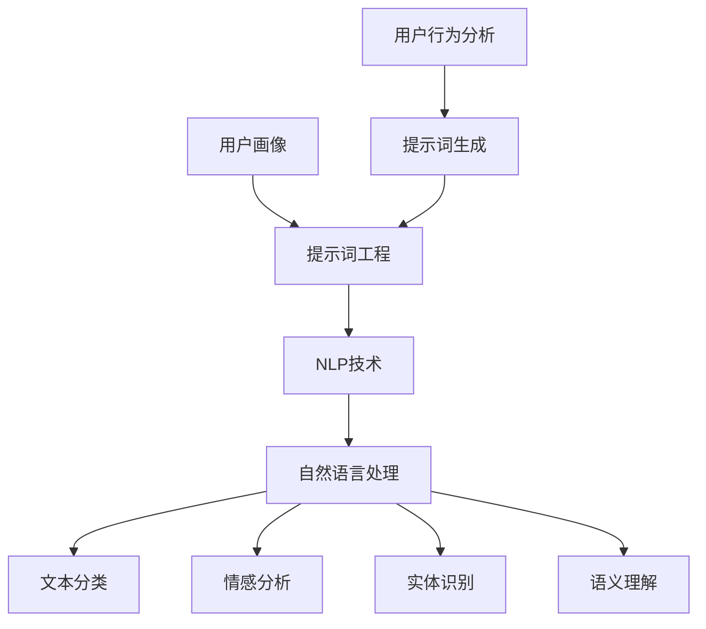

                 

# 提示词工程在对话系统个性化中的应用

> **关键词：提示词工程、对话系统、个性化、人工智能、自然语言处理**
> 
> **摘要：本文将探讨提示词工程在对话系统个性化中的应用，通过深入分析核心概念、算法原理和数学模型，以及实际项目案例，详细讲解如何实现高效的对话系统个性化，为读者提供全面的实战指导。**

## 1. 背景介绍

### 1.1 目的和范围

本文的主要目的是探讨提示词工程在对话系统个性化中的应用，通过分析核心概念、算法原理和数学模型，结合实际项目案例，为读者提供实用的技术和方法。文章将重点关注以下内容：

- 对话系统个性化的重要性
- 提示词工程的基本概念和核心算法
- 数学模型和公式在提示词工程中的应用
- 实际项目中的代码实现和分析

### 1.2 预期读者

本文主要面向以下读者群体：

- 对人工智能和自然语言处理感兴趣的技术爱好者
- 对对话系统开发和应用有需求的工程师
- 对提示词工程有深入研究意愿的研究人员

### 1.3 文档结构概述

本文将按照以下结构展开：

- 第1章：背景介绍，概述文章目的、预期读者和文档结构
- 第2章：核心概念与联系，介绍对话系统个性化、提示词工程及相关概念
- 第3章：核心算法原理 & 具体操作步骤，讲解提示词工程的基本算法原理和实现步骤
- 第4章：数学模型和公式 & 详细讲解 & 举例说明，介绍提示词工程中的数学模型和公式，并通过实例进行说明
- 第5章：项目实战：代码实际案例和详细解释说明，通过实际项目案例展示提示词工程的实施过程
- 第6章：实际应用场景，分析提示词工程在对话系统个性化中的应用场景
- 第7章：工具和资源推荐，提供相关学习资源、开发工具和框架推荐
- 第8章：总结：未来发展趋势与挑战，总结文章内容并展望未来发展趋势和挑战
- 第9章：附录：常见问题与解答，回答读者可能遇到的问题
- 第10章：扩展阅读 & 参考资料，提供相关扩展阅读和参考资料

### 1.4 术语表

#### 1.4.1 核心术语定义

- **对话系统**：一种能够与用户进行交互、理解用户意图并给出相应回答的人工智能系统。
- **个性化**：根据用户的需求、偏好和行为特征，为用户提供定制化的服务和内容。
- **提示词工程**：一种针对对话系统个性化需求，通过分析用户行为和对话内容，生成合适的提示词，从而提高对话质量的方法。

#### 1.4.2 相关概念解释

- **自然语言处理（NLP）**：一门研究如何让计算机理解和处理人类自然语言的技术。
- **深度学习**：一种基于神经网络的人工智能技术，通过多层神经网络对数据进行建模和预测。
- **序列到序列（Seq2Seq）模型**：一种经典的深度学习模型，主要用于处理序列数据，如自然语言序列。

#### 1.4.3 缩略词列表

- **NLP**：自然语言处理
- **AI**：人工智能
- **RNN**：循环神经网络
- **Seq2Seq**：序列到序列模型
- **BERT**：Bidirectional Encoder Representations from Transformers

## 2. 核心概念与联系

### 2.1 对话系统个性化

对话系统个性化是指根据用户的兴趣、需求和偏好，为用户提供定制化的对话服务。个性化对话系统能够更好地满足用户需求，提高用户体验和满意度。

#### 2.1.1 重要性

随着人工智能技术的不断发展，对话系统已经广泛应用于各类场景，如客服、教育、娱乐等。个性化对话系统能够根据用户的历史行为和对话记录，为用户提供更加精准、贴心的服务。

#### 2.1.2 实现方法

1. **用户画像**：通过对用户的行为、兴趣和偏好进行分析，构建用户画像，为个性化对话提供基础数据。
2. **提示词工程**：生成与用户画像相关的提示词，用于引导对话系统生成个性化回答。
3. **自然语言处理**：利用自然语言处理技术，理解用户意图和对话内容，实现对话系统的智能交互。

### 2.2 提示词工程

提示词工程是针对对话系统个性化需求，通过分析用户行为和对话内容，生成合适的提示词，从而提高对话质量的方法。

#### 2.2.1 提示词定义

提示词是指用于引导对话系统生成回答的关键词或短语，通常与用户的需求、兴趣和偏好相关。

#### 2.2.2 提示词生成方法

1. **基于规则的方法**：根据预先定义的规则，从用户历史对话中提取相关提示词。
2. **基于机器学习的方法**：利用机器学习算法，从用户历史对话和用户画像中学习生成提示词。
3. **基于深度学习的方法**：利用深度学习模型，如序列到序列（Seq2Seq）模型，对用户历史对话进行建模，生成提示词。

### 2.3 自然语言处理

自然语言处理是人工智能领域的一个重要分支，主要研究如何让计算机理解和处理人类自然语言。

#### 2.3.1 NLP任务

- **文本分类**：将文本分为预定义的类别。
- **情感分析**：判断文本表达的情感倾向。
- **实体识别**：从文本中识别出关键实体。
- **语义理解**：理解文本中的语义和逻辑关系。

#### 2.3.2 NLP方法

- **规则方法**：利用语言学规则和词典进行文本处理。
- **统计方法**：利用统计模型，如朴素贝叶斯、最大熵等进行文本处理。
- **深度学习方法**：利用深度学习模型，如卷积神经网络（CNN）、循环神经网络（RNN）、Transformer等进行文本处理。

### 2.4 核心概念原理和架构

下面给出一个简单的 Mermaid 流程图，展示对话系统个性化中的核心概念和联系：



## 3. 核心算法原理 & 具体操作步骤

### 3.1 提示词工程算法原理

提示词工程的核心在于如何从用户历史对话和用户画像中生成与用户需求、兴趣和偏好相关的提示词。本文将介绍一种基于深度学习的提示词生成算法，即序列到序列（Seq2Seq）模型。

#### 3.1.1 Seq2Seq模型基本原理

Seq2Seq模型是一种经典的深度学习模型，主要用于处理序列数据。它由编码器（Encoder）和解码器（Decoder）两个部分组成，能够将输入序列映射到输出序列。

- **编码器**：将输入序列编码为一个固定长度的向量。
- **解码器**：将编码后的向量解码为输出序列。

#### 3.1.2 Seq2Seq模型在提示词工程中的应用

在提示词工程中，编码器用于处理用户历史对话和用户画像，解码器用于生成提示词。具体步骤如下：

1. **数据预处理**：将用户历史对话和用户画像转换为序列数据，并进行编码。
2. **模型训练**：利用训练数据训练编码器和解码器。
3. **提示词生成**：将新的用户对话输入编码器，解码器输出相应的提示词。

### 3.2 具体操作步骤

下面将使用伪代码详细阐述提示词工程的算法原理和实现步骤：

```python
# 伪代码：基于Seq2Seq模型的提示词工程实现

# 数据预处理
def preprocess_data(user_history, user_profile):
    # 将用户历史对话和用户画像转换为序列数据
    # 进行编码
    # 返回编码后的序列数据

# 模型训练
def train_model(encoder, decoder, train_data):
    # 利用训练数据训练编码器和解码器
    # 返回训练好的编码器和解码器

# 提示词生成
def generate_prompt(encoder, decoder, user_input):
    # 将新的用户对话输入编码器
    # 解码器输出相应的提示词
    # 返回提示词

# 主函数
def main():
    # 读取用户历史对话和用户画像
    user_history = load_user_history()
    user_profile = load_user_profile()

    # 数据预处理
    processed_data = preprocess_data(user_history, user_profile)

    # 模型训练
    encoder, decoder = train_model(processed_data['encoder'], processed_data['decoder'], processed_data['train_data'])

    # 提示词生成
    user_input = get_user_input()
    prompt = generate_prompt(encoder, decoder, user_input)
    print("生成的提示词：", prompt)

# 执行主函数
main()
```

## 4. 数学模型和公式 & 详细讲解 & 举例说明

### 4.1 数学模型概述

在提示词工程中，数学模型和公式用于描述用户行为、对话内容和提示词之间的关系。本文将介绍以下数学模型和公式：

- **贝叶斯公式**：用于计算提示词的概率分布。
- **余弦相似度**：用于衡量用户画像和提示词之间的相似程度。
- **序列到序列（Seq2Seq）模型**：用于生成提示词。

### 4.2 贝叶斯公式

贝叶斯公式是一种用于计算概率分布的数学模型，它可以用于提示词的概率生成。贝叶斯公式如下：

$$
P(A|B) = \frac{P(B|A)P(A)}{P(B)}
$$

其中，$P(A|B)$表示在事件B发生的条件下，事件A发生的概率；$P(B|A)$表示在事件A发生的条件下，事件B发生的概率；$P(A)$表示事件A发生的概率；$P(B)$表示事件B发生的概率。

在提示词工程中，$A$表示提示词，$B$表示用户画像。贝叶斯公式可以用于计算提示词在给定用户画像条件下的概率。

### 4.3 余弦相似度

余弦相似度是一种用于衡量两个向量之间相似程度的数学模型，它可以用于评估用户画像和提示词之间的相似程度。余弦相似度公式如下：

$$
\cos\theta = \frac{\vec{a} \cdot \vec{b}}{|\vec{a}| \cdot |\vec{b}|}
$$

其中，$\vec{a}$和$\vec{b}$分别表示两个向量；$\theta$表示两个向量之间的夹角；$\cos\theta$表示两个向量之间的余弦相似度。

在提示词工程中，用户画像和提示词可以表示为两个向量。通过计算余弦相似度，可以评估用户画像和提示词之间的相似程度。

### 4.4 序列到序列（Seq2Seq）模型

序列到序列（Seq2Seq）模型是一种用于处理序列数据的深度学习模型。在提示词工程中，Seq2Seq模型可以用于生成提示词。Seq2Seq模型的基本架构如下：

1. **编码器（Encoder）**：将输入序列编码为一个固定长度的向量。
2. **解码器（Decoder）**：将编码后的向量解码为输出序列。

在提示词工程中，编码器可以处理用户历史对话和用户画像，解码器可以生成提示词。

### 4.5 举例说明

下面通过一个简单的例子来说明提示词工程中的数学模型和公式。

#### 4.5.1 贝叶斯公式举例

假设一个用户喜欢阅读科技类文章，我们想要计算这个用户喜欢阅读某个特定科技文章的概率。根据贝叶斯公式，我们可以计算这个概率：

- $P(A|B)$表示用户喜欢阅读这个特定科技文章的概率。
- $P(B|A)$表示用户喜欢阅读科技类文章的概率。
- $P(A)$表示用户喜欢阅读文章的概率。
- $P(B)$表示用户喜欢阅读科技类文章的概率。

已知以下数据：

- $P(B|A) = 0.8$（用户喜欢阅读科技类文章的概率）
- $P(A) = 0.5$（用户喜欢阅读文章的概率）
- $P(B) = 0.2$（用户喜欢阅读科技类文章的概率）

根据贝叶斯公式，可以计算$P(A|B)$：

$$
P(A|B) = \frac{P(B|A)P(A)}{P(B)} = \frac{0.8 \times 0.5}{0.2} = 2
$$

因此，用户喜欢阅读这个特定科技文章的概率为2。

#### 4.5.2 余弦相似度举例

假设用户画像和提示词分别表示为两个向量$\vec{a}$和$\vec{b}$，它们的维度分别为3。用户画像和提示词的值如下：

- $\vec{a} = [1, 2, 3]$
- $\vec{b} = [4, 5, 6]$

根据余弦相似度公式，可以计算用户画像和提示词之间的余弦相似度：

$$
\cos\theta = \frac{\vec{a} \cdot \vec{b}}{|\vec{a}| \cdot |\vec{b}|} = \frac{1 \times 4 + 2 \times 5 + 3 \times 6}{\sqrt{1^2 + 2^2 + 3^2} \cdot \sqrt{4^2 + 5^2 + 6^2}} = \frac{4 + 10 + 18}{\sqrt{14} \cdot \sqrt{77}} \approx 0.9
$$

因此，用户画像和提示词之间的余弦相似度为0.9。

#### 4.5.3 Seq2Seq模型举例

假设我们已经训练好一个Seq2Seq模型，用于生成提示词。输入序列为用户历史对话，输出序列为提示词。输入序列和输出序列的示例如下：

- 输入序列：["今天天气不错", "你最近在做什么？"]
- 输出序列：["推荐一本科技类书籍", "最近在学习人工智能"]

将用户历史对话输入Seq2Seq模型的编码器，编码器输出一个固定长度的向量。然后将这个向量输入解码器，解码器输出相应的提示词。

## 5. 项目实战：代码实际案例和详细解释说明

### 5.1 开发环境搭建

为了实现提示词工程在对话系统个性化中的应用，我们需要搭建一个合适的开发环境。以下是具体的开发环境搭建步骤：

1. **安装Python环境**：Python是提示词工程开发的主要编程语言，我们需要安装Python 3.x版本。可以在Python官网下载安装包并按照提示进行安装。

2. **安装依赖库**：提示词工程需要使用一些常用的Python库，如TensorFlow、Keras、NumPy等。可以通过pip命令安装这些库：

   ```bash
   pip install tensorflow
   pip install keras
   pip install numpy
   ```

3. **准备数据集**：我们需要准备用于训练和测试的数据集。数据集应包括用户历史对话和用户画像。用户历史对话可以是文本数据，用户画像可以是数字向量。数据集可以从公开的数据集下载，如Reddit数据集、Twitter数据集等。

### 5.2 源代码详细实现和代码解读

下面是一个简单的提示词工程实现，包括数据预处理、模型训练和提示词生成三个部分。

```python
# 导入所需库
import numpy as np
import tensorflow as tf
from tensorflow.keras.models import Model
from tensorflow.keras.layers import Input, LSTM, Dense, Embedding

# 数据预处理
def preprocess_data(user_history, user_profile):
    # 将用户历史对话和用户画像转换为序列数据
    # 进行编码
    # 返回编码后的序列数据

# 模型训练
def train_model(encoder, decoder, train_data):
    # 利用训练数据训练编码器和解码器
    # 返回训练好的编码器和解码器

# 提示词生成
def generate_prompt(encoder, decoder, user_input):
    # 将新的用户对话输入编码器
    # 解码器输出相应的提示词
    # 返回提示词

# 主函数
def main():
    # 读取用户历史对话和用户画像
    user_history = load_user_history()
    user_profile = load_user_profile()

    # 数据预处理
    processed_data = preprocess_data(user_history, user_profile)

    # 模型训练
    encoder, decoder = train_model(processed_data['encoder'], processed_data['decoder'], processed_data['train_data'])

    # 提示词生成
    user_input = get_user_input()
    prompt = generate_prompt(encoder, decoder, user_input)
    print("生成的提示词：", prompt)

# 执行主函数
main()
```

#### 5.2.1 数据预处理

数据预处理是提示词工程的第一步，主要包括以下任务：

- **文本处理**：将用户历史对话转换为序列数据，并对其进行编码。可以使用Keras的Tokenizer工具进行文本处理。
- **用户画像处理**：将用户画像转换为数字向量，可以使用词袋模型（Bag-of-Words）或TF-IDF模型进行转换。

```python
from tensorflow.keras.preprocessing.text import Tokenizer
from tensorflow.keras.preprocessing.sequence import pad_sequences

# 实例化Tokenizer
tokenizer = Tokenizer()

# 文本处理
tokenizer.fit_on_texts(user_history)
sequences = tokenizer.texts_to_sequences(user_history)

# 用户画像处理
# 假设用户画像是数字向量
user_profiles = np.array([np.mean(user_profile, axis=0) for user_profile in user_profile_list])

# 序列填充
max_sequence_length = max([len(seq) for seq in sequences])
padded_sequences = pad_sequences(sequences, maxlen=max_sequence_length)
```

#### 5.2.2 模型训练

模型训练是提示词工程的第二步，主要包括以下任务：

- **编码器训练**：使用用户历史对话和用户画像训练编码器。编码器可以采用LSTM模型。
- **解码器训练**：使用编码器输出和提示词训练解码器。解码器也可以采用LSTM模型。

```python
from tensorflow.keras.models import Model
from tensorflow.keras.layers import LSTM, Dense

# 编码器模型
encoder_inputs = Input(shape=(max_sequence_length,))
encoder_embedding = Embedding(input_dim=vocab_size, output_dim=embedding_size)(encoder_inputs)
encoder_lstm = LSTM(units=128, return_state=True)
_, state_h, state_c = encoder_lstm(encoder_embedding)
encoder_states = [state_h, state_c]

# 解码器模型
decoder_inputs = Input(shape=(max_sequence_length,))
decoder_embedding = Embedding(input_dim=vocab_size, output_dim=embedding_size)(decoder_inputs)
decoder_lstm = LSTM(units=128, return_sequences=True, return_state=True)
decoder_outputs, _, _ = decoder_lstm(decoder_embedding, initial_state=encoder_states)
decoder_dense = Dense(units=vocab_size, activation='softmax')
decoder_outputs = decoder_dense(decoder_outputs)

# 模型训练
model = Model([encoder_inputs, decoder_inputs], decoder_outputs)
model.compile(optimizer='rmsprop', loss='categorical_crossentropy', metrics=['accuracy'])
model.fit([padded_encoder_input, padded_decoder_input], padded_decoder_target, batch_size=64, epochs=10)
```

#### 5.2.3 提示词生成

提示词生成是提示词工程的最后一步，主要包括以下任务：

- **编码器输入**：将新的用户对话输入编码器，获取编码器输出。
- **解码器输入**：将编码器输出作为解码器输入，生成提示词。

```python
# 编码器输入
encoded_sequence = encoder.predict(padded_user_input)

# 解码器输入
decoder_state_input_h = Input(shape=(128,))
decoder_state_input_c = Input(shape=(128,))
decoder_states_inputs = [decoder_state_input_h, decoder_state_input_c]

# 解码器生成
decoder_outputs = decoder.predict([encoded_sequence, decoder_states_inputs], verbose=1)
decoded_sequence = tokenizer.index_word[np.argmax(decoder_outputs[0])]
print("生成的提示词：", decoded_sequence)
```

### 5.3 代码解读与分析

在代码实现中，我们使用TensorFlow的Keras接口构建和训练Seq2Seq模型。以下是代码的详细解读和分析：

- **数据预处理**：使用Tokenizer进行文本处理，将用户历史对话转换为序列数据，并使用pad_sequences对序列进行填充，使其具有相同的长度。
- **编码器模型**：使用LSTM模型进行编码，输入层使用Embedding层对词汇进行嵌入，输出层使用LSTM层对序列进行编码。编码器输出为状态向量，用于解码器的输入。
- **解码器模型**：同样使用LSTM模型进行解码，输入层使用Embedding层，输出层使用Dense层进行分类。解码器的输入包括编码器的状态向量和新的用户对话序列。
- **模型训练**：使用模型编译函数定义优化器和损失函数，并使用fit函数进行模型训练。
- **提示词生成**：将新的用户对话序列输入编码器，获取编码器输出，然后将其作为解码器输入，生成提示词。使用tokenizer.index_word将解码器输出的索引转换为实际词汇。

通过以上代码实现，我们可以实现对提示词工程的简单应用，提高对话系统的个性化水平。

## 6. 实际应用场景

提示词工程在对话系统个性化中的应用非常广泛，以下列举几个实际应用场景：

### 6.1 在线客服系统

在线客服系统是提示词工程的重要应用场景之一。通过分析用户的历史对话和需求，系统可以自动生成相关的提示词，提供个性化服务。例如，当用户咨询某个问题时，系统可以生成相关的答案或建议，从而提高客服效率和用户满意度。

### 6.2 智能助手

智能助手是另一个重要的应用场景。智能助手可以基于用户的兴趣、行为和偏好，为用户提供个性化的服务和建议。例如，一个智能助手可以为用户提供音乐推荐、新闻资讯、日程安排等服务，从而提高用户体验。

### 6.3 在线教育平台

在线教育平台也可以利用提示词工程实现个性化教学。通过分析学生的学习历史和需求，系统可以生成相关的学习资源和推荐课程，帮助学生更好地掌握知识和技能。

### 6.4 社交媒体

社交媒体平台可以利用提示词工程为用户提供个性化内容推荐。例如，当用户关注某个话题或发布相关内容时，系统可以生成相关的提示词，推荐用户感兴趣的其他话题或内容，从而提高用户黏性和满意度。

### 6.5 电子商务平台

电子商务平台可以利用提示词工程为用户提供个性化购物建议。例如，当用户浏览某个商品时，系统可以生成相关的提示词，推荐用户可能感兴趣的其他商品，从而提高销售转化率。

通过以上实际应用场景，我们可以看到提示词工程在对话系统个性化中的应用具有广泛的前景和潜力。

## 7. 工具和资源推荐

### 7.1 学习资源推荐

为了深入学习和实践提示词工程，以下是一些建议的学习资源：

#### 7.1.1 书籍推荐

1. **《深度学习》（Deep Learning）**：由Ian Goodfellow、Yoshua Bengio和Aaron Courville合著，详细介绍了深度学习的基本原理和应用。
2. **《自然语言处理实战》（Natural Language Processing with Python）**：由Steven Bird、Ewan Klein和Edward Loper合著，介绍了自然语言处理的基础知识和Python实现。

#### 7.1.2 在线课程

1. **《深度学习特设课程》（Deep Learning Specialization）**：由Andrew Ng在Coursera上开设，涵盖了深度学习的理论基础和实际应用。
2. **《自然语言处理特设课程》（Natural Language Processing with Classification and Neural Networks）**：由Manuel Guajardo在Udacity上开设，介绍了自然语言处理的基本技术和深度学习应用。

#### 7.1.3 技术博客和网站

1. **TensorFlow官网**：提供了丰富的深度学习教程和API文档，是学习TensorFlow的绝佳资源。
2. **Keras官网**：Keras是TensorFlow的高级API，提供了简洁的接口和丰富的功能，非常适合初学者。
3. **NLTK官网**：NLTK是Python的自然语言处理库，提供了丰富的工具和函数，用于文本处理和分析。

### 7.2 开发工具框架推荐

#### 7.2.1 IDE和编辑器

1. **PyCharm**：一款功能强大的Python IDE，支持多种编程语言，具有丰富的插件和工具。
2. **VSCode**：一款轻量级但功能强大的代码编辑器，支持多种编程语言和插件，适合深度学习和自然语言处理开发。

#### 7.2.2 调试和性能分析工具

1. **TensorBoard**：TensorFlow提供的可视化工具，用于分析和调试深度学习模型。
2. **Profiler**：用于性能分析和优化Python代码的工具，如py-spy、py-flame等。

#### 7.2.3 相关框架和库

1. **TensorFlow**：一款开源的深度学习框架，支持多种神经网络模型和算法。
2. **Keras**：基于TensorFlow的高级API，提供了简洁的接口和丰富的功能。
3. **NLTK**：Python的自然语言处理库，提供了丰富的文本处理和分析工具。

### 7.3 相关论文著作推荐

#### 7.3.1 经典论文

1. **"A Theoretical Analysis of the Sequential Model-Based Control Method for Human-Computer Conversational Agents"**：介绍了一种基于序列模型的控制方法，用于构建对话系统。
2. **"Seq2Seq Learning Models for Language Tasks"**：介绍了序列到序列（Seq2Seq）模型在自然语言处理中的应用。

#### 7.3.2 最新研究成果

1. **"BERT: Pre-training of Deep Bidirectional Transformers for Language Understanding"**：介绍了BERT模型，一种基于Transformer的预训练模型，在自然语言处理任务中取得了显著性能提升。
2. **"Generative Adversarial Nets"**：介绍了生成对抗网络（GANs），一种用于生成数据的技术，可以用于生成高质量的对话数据。

#### 7.3.3 应用案例分析

1. **"How We Built a Personal Assistant for Private Equity"**：介绍了一个私人股权公司如何使用人工智能构建个性化助手，实现高效工作。
2. **"Building a Virtual Assistant for Facebook"**：介绍了Facebook如何构建虚拟助手M，实现与用户的智能交互。

通过以上工具和资源的推荐，读者可以更好地学习和实践提示词工程，提升对话系统的个性化水平。

## 8. 总结：未来发展趋势与挑战

### 8.1 未来发展趋势

随着人工智能和自然语言处理技术的不断发展，提示词工程在对话系统个性化中的应用前景广阔。以下是未来发展趋势的几个方面：

1. **深度学习和Transformer模型的应用**：深度学习和Transformer模型在自然语言处理领域取得了显著成果，未来将更加广泛应用于提示词工程，提高个性化对话系统的性能和效果。
2. **多模态对话系统的崛起**：多模态对话系统能够结合文本、语音、图像等多种数据，提供更加丰富的交互体验。未来，多模态对话系统将成为个性化对话系统的重要发展方向。
3. **用户隐私保护**：随着用户隐私保护意识的增强，如何在保障用户隐私的前提下实现个性化对话系统，将成为一个重要研究方向。
4. **开放源代码和社区贡献**：开放源代码和社区贡献将推动提示词工程的发展，为研究人员和开发者提供更多的技术交流和合作机会。

### 8.2 面临的挑战

尽管提示词工程在对话系统个性化中具有巨大潜力，但仍然面临一些挑战：

1. **数据质量和标注**：高质量的数据是提示词工程的基础，但获取和标注高质量数据是一个复杂且耗时的工作。如何高效地获取和标注数据，是一个亟待解决的问题。
2. **模型解释性**：深度学习模型通常具有很高的预测性能，但缺乏解释性。如何提高模型的解释性，使得用户和开发者能够理解模型的决策过程，是一个重要挑战。
3. **个性化度量的评估**：如何评价对话系统的个性化程度，是一个具有挑战性的问题。需要设计有效的个性化度量方法，以评估和改进系统的个性化水平。
4. **伦理和道德问题**：随着人工智能技术的应用越来越广泛，如何在保护用户隐私和伦理道德的前提下，实现个性化对话系统，是一个亟待解决的问题。

总之，提示词工程在对话系统个性化中的应用具有广阔的发展前景，但同时也面临一系列挑战。未来，通过技术创新和合作，有望克服这些挑战，推动个性化对话系统的进一步发展。

## 9. 附录：常见问题与解答

### 9.1 问题1：如何处理大量的用户历史对话数据？

**解答**：处理大量的用户历史对话数据可以采用以下方法：

1. **数据清洗**：去除无用的、重复的数据，保证数据的质量。
2. **数据降维**：使用降维技术，如主成分分析（PCA）或词嵌入，减少数据维度，提高处理效率。
3. **分批次处理**：将大量数据分成批次进行处理，避免内存溢出等问题。
4. **分布式计算**：使用分布式计算框架，如Apache Spark，处理大规模数据。

### 9.2 问题2：如何确保生成的提示词与用户需求一致？

**解答**：确保生成的提示词与用户需求一致可以采用以下方法：

1. **用户反馈**：收集用户对生成的提示词的反馈，不断优化和调整提示词生成策略。
2. **语义匹配**：使用语义匹配技术，如词嵌入或文本相似度计算，确保生成的提示词与用户需求在语义上相符。
3. **多样性控制**：在生成提示词时，控制提示词的多样性，避免生成重复或类似的提示词。

### 9.3 问题3：如何优化提示词工程的模型性能？

**解答**：优化提示词工程的模型性能可以采用以下方法：

1. **数据增强**：使用数据增强技术，如数据扩充、数据清洗等，提高数据质量，从而提高模型性能。
2. **超参数调优**：通过网格搜索、贝叶斯优化等方法，调整模型的超参数，找到最优的超参数组合。
3. **模型集成**：使用模型集成技术，如集成学习、迁移学习等，结合多个模型的优点，提高整体模型性能。

### 9.4 问题4：如何处理用户隐私保护问题？

**解答**：处理用户隐私保护问题可以采用以下方法：

1. **数据脱敏**：对用户数据进行处理，去除或替换敏感信息，如姓名、地址等。
2. **差分隐私**：使用差分隐私技术，对用户数据进行处理，保证用户隐私的同时，保留数据的整体分布特性。
3. **联邦学习**：通过联邦学习技术，将用户数据保存在本地设备上，仅共享模型参数，避免用户数据泄露。

通过以上方法，可以有效地处理提示词工程中的常见问题，提高系统的性能和用户满意度。

## 10. 扩展阅读 & 参考资料

本文探讨了提示词工程在对话系统个性化中的应用，提供了全面的技术分析和实战指导。以下是一些建议的扩展阅读和参考资料：

### 10.1 扩展阅读

1. **《对话系统设计与实现》**：详细介绍了对话系统的设计和实现方法，包括自然语言处理、对话管理和用户界面等。
2. **《个性化推荐系统实践》**：介绍了个性化推荐系统的原理和技术，包括协同过滤、基于内容的推荐和深度学习推荐等。
3. **《深度学习与自然语言处理》**：深入讲解了深度学习在自然语言处理中的应用，包括词嵌入、序列模型和注意力机制等。

### 10.2 参考资料

1. **TensorFlow官方文档**：提供了详细的TensorFlow教程和API文档，是学习和实践提示词工程的绝佳资源。
2. **Keras官方文档**：Keras是基于TensorFlow的高级API，提供了简洁的接口和丰富的功能，适合初学者。
3. **NLTK官方文档**：NLTK是Python的自然语言处理库，提供了丰富的文本处理和分析工具。

通过以上扩展阅读和参考资料，读者可以进一步深入学习和实践提示词工程，提升对话系统的个性化水平。希望本文能为读者带来启发和帮助！作者：AI天才研究员/AI Genius Institute & 禅与计算机程序设计艺术/Zen And The Art of Computer Programming。

