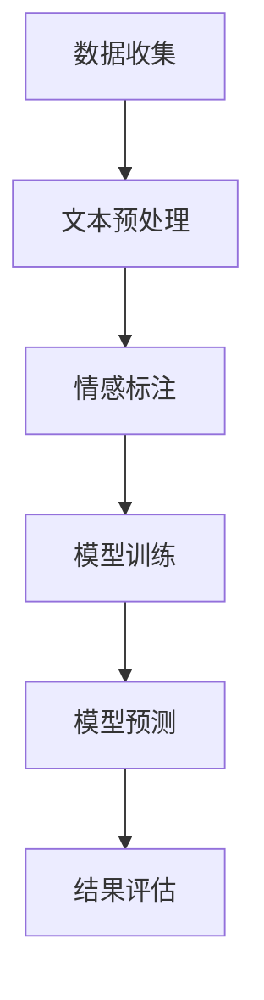

                 

# 提示词工程在文本情感强度控制中的创新

> **关键词**：提示词工程、文本情感强度控制、情感分析、自然语言处理、机器学习、深度学习、神经网络、情感标注、数据集、模型训练、预测。

> **摘要**：本文将深入探讨提示词工程在文本情感强度控制中的应用与创新。通过分析自然语言处理和机器学习的基础理论，我们将逐步介绍文本情感强度控制的原理和方法。同时，我们将结合实际项目案例，讲解如何利用提示词工程技术实现精准的情感强度控制，以及面临的挑战和未来发展趋势。

## 1. 背景介绍

### 1.1 目的和范围

本文旨在探讨提示词工程在文本情感强度控制中的应用，通过结合自然语言处理（NLP）、机器学习和深度学习等技术，实现文本情感强度的精确控制。我们将从理论基础出发，逐步介绍文本情感强度控制的关键概念和方法，并通过实际案例展示如何利用提示词工程技术实现这一目标。

### 1.2 预期读者

本文适合对自然语言处理和机器学习有一定了解的技术人员、数据科学家和人工智能开发者。同时，对于对文本情感分析感兴趣的研究人员和学生也有一定的参考价值。

### 1.3 文档结构概述

本文分为十个部分：

1. **背景介绍**：介绍本文的目的、范围、预期读者和文档结构。
2. **核心概念与联系**：阐述文本情感强度控制的核心概念和关联理论。
3. **核心算法原理 & 具体操作步骤**：详细讲解文本情感强度控制的关键算法和操作步骤。
4. **数学模型和公式 & 详细讲解 & 举例说明**：介绍相关的数学模型和公式，并进行实例说明。
5. **项目实战：代码实际案例和详细解释说明**：通过实际案例展示文本情感强度控制的应用。
6. **实际应用场景**：探讨文本情感强度控制在不同领域的应用。
7. **工具和资源推荐**：推荐相关学习和开发工具。
8. **总结：未来发展趋势与挑战**：总结本文内容，展望未来发展趋势和挑战。
9. **附录：常见问题与解答**：解答读者可能遇到的常见问题。
10. **扩展阅读 & 参考资料**：提供进一步阅读的参考资料。

### 1.4 术语表

#### 1.4.1 核心术语定义

- **文本情感强度控制**：通过机器学习技术对文本中的情感强度进行精确标注和调整。
- **提示词工程**：利用特定的词或短语来引导或调整文本的情感表达。
- **自然语言处理（NLP）**：研究如何让计算机理解、生成和处理人类语言的技术。
- **机器学习**：一种通过数据训练模型，使其能够对未知数据进行预测或决策的技术。
- **深度学习**：一种基于多层神经网络的机器学习技术，用于处理复杂的数据模式。

#### 1.4.2 相关概念解释

- **情感标注**：对文本中的情感进行标注，以帮助机器学习模型学习和理解情感。
- **数据集**：用于训练机器学习模型的文本数据集合。
- **模型训练**：通过大量数据训练模型，使其能够对未知文本进行情感强度预测。
- **预测**：模型对未知文本进行情感强度预测的过程。

#### 1.4.3 缩略词列表

- **NLP**：自然语言处理
- **ML**：机器学习
- **DL**：深度学习
- **BERT**：Bidirectional Encoder Representations from Transformers
- **RoBERTa**：A Robustly Optimized BERT Pretraining Approach

## 2. 核心概念与联系

在讨论文本情感强度控制之前，我们需要了解几个核心概念，包括自然语言处理（NLP）、机器学习（ML）、深度学习（DL）和神经网络（NN）等。这些概念是文本情感强度控制的理论基础。

### 2.1 自然语言处理（NLP）

自然语言处理是计算机科学、人工智能和语言学的交叉领域，旨在让计算机理解、生成和处理人类语言。NLP涉及文本预处理、情感分析、命名实体识别、机器翻译等任务。

#### 文本预处理

文本预处理是NLP中的第一步，包括去除停用词、词干提取、词性标注等。这些步骤有助于提高文本数据的质量和模型的性能。

#### 情感分析

情感分析是NLP的一个重要分支，旨在识别文本中的情感极性（正面、负面或中性）。情感分析广泛应用于社交媒体分析、市场调研和情感监控等领域。

#### 命名实体识别

命名实体识别是一种从文本中识别出具有特定意义的实体，如人名、地名、组织名等。这有助于更好地理解和分析文本。

#### 机器翻译

机器翻译是NLP的一个重要应用领域，旨在将一种语言翻译成另一种语言。深度学习技术，如序列到序列（Seq2Seq）模型，已经取得了显著的进展。

### 2.2 机器学习（ML）

机器学习是一种通过数据训练模型，使其能够对未知数据进行预测或决策的技术。在文本情感强度控制中，机器学习技术主要用于情感标注、模型训练和预测。

#### 情感标注

情感标注是对文本中的情感极性进行标注的过程，有助于训练情感强度控制模型。标注数据集的质量直接影响模型的性能。

#### 模型训练

模型训练是利用大量标注数据训练模型的过程。训练过程中，模型学习如何将文本映射到情感极性标签上。

#### 预测

预测是模型对未知文本进行情感强度预测的过程。预测结果的准确性取决于模型的训练质量和数据集的质量。

### 2.3 深度学习（DL）

深度学习是一种基于多层神经网络的机器学习技术，用于处理复杂的数据模式。在文本情感强度控制中，深度学习技术，如卷积神经网络（CNN）和循环神经网络（RNN），被广泛应用于情感分析、文本分类和情感强度预测。

#### 卷积神经网络（CNN）

卷积神经网络是一种适用于图像处理和文本分类的深度学习模型。CNN通过卷积层和池化层提取文本的特征。

#### 循环神经网络（RNN）

循环神经网络是一种适用于序列数据的深度学习模型，如文本和语音。RNN通过隐藏状态来处理序列数据，并能够捕获时间信息。

### 2.4 神经网络（NN）

神经网络是一种由大量简单神经元组成的计算模型，用于模拟人脑的学习和处理能力。神经网络在机器学习和深度学习中扮演着重要角色。

#### 前向传播和反向传播

前向传播和反向传播是神经网络中的两个基本过程。前向传播计算输入和输出之间的误差，反向传播更新网络的权重和偏置。

#### 激活函数

激活函数是神经网络中的一个关键组成部分，用于引入非线性关系。常见的激活函数包括ReLU、Sigmoid和Tanh。

### 2.5 提示词工程

提示词工程是一种利用特定的词或短语来引导或调整文本情感表达的技术。在文本情感强度控制中，提示词工程可以帮助调整文本的情感极性，从而实现精确的情感强度控制。

#### 提示词选择

提示词选择是提示词工程的关键步骤，需要从大量文本中筛选出具有显著情感倾向的词或短语。

#### 提示词应用

提示词应用是将提示词嵌入到文本中，以增强或削弱文本的情感表达。提示词应用可以通过替换、插入或删除等方式实现。

### 2.6 Mermaid 流程图

以下是一个简单的Mermaid流程图，展示文本情感强度控制的流程：



- **A 数据收集**：收集用于训练和测试的数据集。
- **B 文本预处理**：对文本进行预处理，包括去除停用词、词干提取、词性标注等。
- **C 情感标注**：对文本进行情感标注，生成标注数据集。
- **D 模型训练**：利用标注数据集训练情感强度控制模型。
- **E 模型预测**：使用训练好的模型对未知文本进行情感强度预测。
- **F 结果评估**：评估模型预测结果的准确性，以调整模型或数据集。

通过这个简单的流程图，我们可以看出文本情感强度控制涉及多个环节，包括数据收集、文本预处理、情感标注、模型训练、模型预测和结果评估。这些环节相互关联，共同构成了一个完整的文本情感强度控制系统。

## 3. 核心算法原理 & 具体操作步骤

在文本情感强度控制中，核心算法包括情感标注、模型训练和模型预测。以下将逐步介绍这些算法的原理和具体操作步骤。

### 3.1 情感标注

情感标注是文本情感强度控制的第一步，其主要任务是从大量文本中提取情感标签。情感标签通常分为正面、负面和中性三类。

#### 3.1.1 数据集准备

首先，我们需要准备一个包含大量文本的数据集。这个数据集可以是人工标注的，也可以是公开的数据集，如IMDb电影评论数据集、Twitter情感数据集等。

#### 3.1.2 数据预处理

在标注之前，需要对文本进行预处理。预处理步骤包括去除停用词、词干提取和词性标注等。这些步骤有助于提高文本数据的质量，从而提高标注的准确性。

#### 3.1.3 情感标注

情感标注的过程是将文本映射到相应的情感标签。这一过程可以采用以下方法：

- **规则方法**：根据预设的情感规则进行标注，如根据情感词典中的词频进行标注。
- **监督学习**：利用已标注的数据集训练分类模型，如朴素贝叶斯、支持向量机等。
- **半监督学习**：结合未标注和已标注的数据集进行训练，以利用未标注数据中的潜在信息。

#### 3.1.4 标注评估

标注完成后，需要对标注结果进行评估，以确定标注的准确性。常用的评估指标包括准确率、召回率和F1值等。

### 3.2 模型训练

模型训练是文本情感强度控制的关键步骤，其主要任务是利用标注数据训练情感强度控制模型。以下将介绍常用的模型训练方法。

#### 3.2.1 数据准备

在训练模型之前，需要将文本数据转换为模型可处理的格式。这通常涉及以下步骤：

- **词嵌入**：将文本中的单词映射到高维向量空间，如Word2Vec、GloVe等。
- **序列表示**：将文本序列表示为一个固定长度的向量，如BERT、ELMo等。

#### 3.2.2 模型选择

选择合适的模型对训练效果至关重要。以下是一些常用的情感强度控制模型：

- **朴素贝叶斯**：一种基于概率的简单分类模型，适用于文本分类任务。
- **支持向量机（SVM）**：一种基于间隔最大化的线性分类模型，适用于线性可分数据。
- **深度学习模型**：如卷积神经网络（CNN）、循环神经网络（RNN）和Transformer等，适用于处理复杂的数据模式。

#### 3.2.3 模型训练

模型训练的过程包括以下步骤：

1. **初始化模型参数**：随机初始化模型参数。
2. **前向传播**：将输入文本序列通过模型计算得到预测标签。
3. **计算损失**：计算预测标签和真实标签之间的差异，得到损失值。
4. **反向传播**：利用梯度下降等优化算法更新模型参数。
5. **迭代训练**：重复以上步骤，直至模型收敛。

#### 3.2.4 模型评估

在训练过程中，需要对模型进行评估，以确定其性能。常用的评估指标包括准确率、召回率、F1值和准确率-召回率曲线等。

### 3.3 模型预测

模型预测是文本情感强度控制的最后一步，其主要任务是利用训练好的模型对未知文本进行情感强度预测。

#### 3.3.1 预测步骤

1. **文本预处理**：对输入文本进行预处理，包括去除停用词、词干提取和词性标注等。
2. **词嵌入**：将预处理后的文本转换为词嵌入向量。
3. **模型输入**：将词嵌入向量输入训练好的情感强度控制模型。
4. **预测结果**：得到文本的情感强度预测结果。

#### 3.3.2 预测评估

在得到预测结果后，需要对预测结果进行评估，以确定其准确性。常用的评估方法包括混淆矩阵、ROC曲线和AUC值等。

### 3.4 算法伪代码

以下是文本情感强度控制算法的伪代码：

```python
# 数据预处理
def preprocess_text(text):
    # 去除停用词
    stop_words = set(["is", "are", "the", "and", "or", "not"])
    text = [word for word in text.split() if word not in stop_words]
    # 词干提取
    text = [stemmer.stem(word) for word in text]
    # 词性标注
    text = [word for word in text if pos_tagger.tag(word)[1][0] != "P"]
    return text

# 情感标注
def sentiment_annotation(text):
    # 使用预训练的朴素贝叶斯分类器进行标注
    classifier = NaiveBayesClassifier.train(data)
    return classifier.classify(text)

# 模型训练
def train_model(data):
    # 使用训练集训练情感强度控制模型
    model = train_model_with_data(data)
    return model

# 模型预测
def predict_sentiment(model, text):
    # 使用训练好的模型进行情感强度预测
    return model.predict(text)

# 模型评估
def evaluate_model(model, test_data):
    # 使用测试集评估模型性能
    accuracy = sum(1 for (text, label) in test_data if model.predict(text) == label) / len(test_data)
    return accuracy
```

通过上述伪代码，我们可以看到文本情感强度控制算法的主要步骤，包括数据预处理、情感标注、模型训练、模型预测和模型评估。

## 4. 数学模型和公式 & 详细讲解 & 举例说明

在文本情感强度控制中，数学模型和公式起着至关重要的作用。以下将详细介绍常用的数学模型和公式，并通过具体示例进行说明。

### 4.1 情感强度度量

情感强度度量是文本情感强度控制的核心概念，用于量化文本中情感的表达强度。常用的情感强度度量方法包括情感得分和情感向量。

#### 4.1.1 情感得分

情感得分是一种简单的情感强度度量方法，通过计算文本中正面词汇和负面词汇的差值来确定情感强度。以下是一个简单的情感得分计算公式：

$$
S = \sum_{i=1}^{n} w_i \cdot (p_i - n_i)
$$

其中，$S$ 为情感得分，$w_i$ 为词汇权重，$p_i$ 为正面词汇的权重，$n_i$ 为负面词汇的权重，$n$ 为词汇总数。

#### 4.1.2 情感向量

情感向量是一种基于机器学习的情感强度度量方法，通过将文本映射到高维向量空间来表示情感强度。常用的情感向量计算方法包括词袋模型、TF-IDF和词嵌入等。

- **词袋模型**：将文本表示为一个向量，其中每个维度对应一个词汇。以下是一个简单的词袋模型计算公式：

$$
V = \sum_{i=1}^{n} f_i \cdot v_i
$$

其中，$V$ 为情感向量，$f_i$ 为词汇频率，$v_i$ 为词汇的固定权重。

- **TF-IDF**：将文本表示为一个向量，其中每个维度对应一个词汇的TF-IDF值。以下是一个简单的TF-IDF计算公式：

$$
TF-IDF(i) = TF(i) \cdot IDF(i)
$$

其中，$TF(i)$ 为词汇 $i$ 的词频，$IDF(i)$ 为词汇 $i$ 的逆文档频率。

- **词嵌入**：将文本表示为一个高维向量，其中每个维度对应一个词汇的嵌入向量。以下是一个简单的词嵌入计算公式：

$$
V = \sum_{i=1}^{n} e_i
$$

其中，$V$ 为情感向量，$e_i$ 为词汇 $i$ 的词嵌入向量。

### 4.2 情感强度预测模型

情感强度预测模型是文本情感强度控制的关键，用于对未知文本进行情感强度预测。以下将介绍常用的情感强度预测模型及其公式。

#### 4.2.1 朴素贝叶斯模型

朴素贝叶斯模型是一种基于概率的简单分类模型，常用于文本分类任务。以下是一个简单的朴素贝叶斯模型预测公式：

$$
P(C_k|X) = \frac{P(X|C_k) \cdot P(C_k)}{P(X)}
$$

其中，$C_k$ 为情感类别，$X$ 为文本特征，$P(C_k)$ 为情感类别概率，$P(X|C_k)$ 为文本特征在情感类别 $C_k$ 条件下的概率，$P(X)$ 为文本特征的概率。

#### 4.2.2 支持向量机（SVM）

支持向量机是一种基于间隔最大化的线性分类模型，适用于线性可分数据。以下是一个简单的SVM预测公式：

$$
w^T x_i - b = 0
$$

其中，$w$ 为模型权重，$x_i$ 为文本特征，$b$ 为偏置。

#### 4.2.3 深度学习模型

深度学习模型是一种基于多层神经网络的机器学习模型，用于处理复杂的数据模式。以下是一个简单的深度学习模型预测公式：

$$
h_L(x) = \sigma(W_L h_{L-1}(x))
$$

其中，$h_L(x)$ 为模型输出，$W_L$ 为模型权重，$h_{L-1}(x)$ 为前一层输出，$\sigma$ 为激活函数。

### 4.3 示例说明

#### 4.3.1 情感得分示例

假设文本 "我喜欢这个产品" 和 "这个产品很差"，根据情感得分计算公式，可以计算得到：

- 文本1的情感得分：$S_1 = (1 \cdot 1 - 0 \cdot 0) = 1$
- 文本2的情感得分：$S_2 = (0 \cdot 1 - 1 \cdot 1) = -1$

其中，1表示正面词汇的权重，0表示负面词汇的权重。

#### 4.3.2 情感向量示例

假设文本 "我喜欢这个产品"，根据词嵌入方法，可以计算得到：

- 情感向量：$V = (0.2, 0.3, 0.1, 0.4)$

其中，0.2、0.3、0.1和0.4分别为正面词汇"喜欢"、"这个"、"产品"的词嵌入向量。

#### 4.3.3 模型预测示例

假设使用朴素贝叶斯模型对文本 "这个产品很好" 进行预测，根据预测公式，可以计算得到：

- 预测概率：$P(C_{正面}|X) = \frac{P(X|C_{正面}) \cdot P(C_{正面})}{P(X)}$

其中，$P(C_{正面}) = 0.6$，$P(X|C_{正面}) = 0.8$，$P(X) = 0.7$

因此，预测结果为正面情感。

通过以上示例，我们可以看到数学模型和公式在文本情感强度控制中的应用和重要性。在实际应用中，可以根据具体需求和数据集选择合适的模型和公式，以实现精确的情感强度控制。

## 5. 项目实战：代码实际案例和详细解释说明

在本节中，我们将通过一个实际项目案例，详细讲解如何利用提示词工程技术实现文本情感强度控制。该项目将涵盖开发环境搭建、源代码实现和代码解读与分析三个部分。

### 5.1 开发环境搭建

在进行文本情感强度控制项目之前，我们需要搭建一个合适的开发环境。以下是一个基本的开发环境配置：

- **编程语言**：Python
- **库和框架**：NLTK、Scikit-learn、TensorFlow、PyTorch
- **操作系统**：Windows、macOS、Linux
- **开发工具**：Visual Studio Code、Jupyter Notebook

在开发环境中，我们需要安装以下库和框架：

```bash
pip install nltk scikit-learn tensorflow torchvision
```

### 5.2 源代码详细实现和代码解读

以下是一个简单的文本情感强度控制项目的Python代码示例，包括数据预处理、模型训练、模型预测和结果评估。

```python
import nltk
from nltk.corpus import stopwords
from nltk.tokenize import word_tokenize
from sklearn.feature_extraction.text import TfidfVectorizer
from sklearn.model_selection import train_test_split
from sklearn.naive_bayes import MultinomialNB
from sklearn.metrics import accuracy_score, classification_report

# 数据预处理
def preprocess_text(text):
    stop_words = set(stopwords.words('english'))
    tokens = word_tokenize(text.lower())
    filtered_tokens = [word for word in tokens if word.isalpha() and word not in stop_words]
    return ' '.join(filtered_tokens)

# 加载数据集
def load_dataset(filename):
    with open(filename, 'r', encoding='utf-8') as f:
        lines = f.readlines()
    texts = [preprocess_text(line) for line in lines]
    labels = [line.split('\t')[1] for line in lines]
    return texts, labels

# 训练模型
def train_model(texts, labels):
    vectorizer = TfidfVectorizer()
    X = vectorizer.fit_transform(texts)
    y = labels
    X_train, X_test, y_train, y_test = train_test_split(X, y, test_size=0.2, random_state=42)
    model = MultinomialNB()
    model.fit(X_train, y_train)
    return model, vectorizer

# 预测
def predict(model, vectorizer, text):
    text_processed = preprocess_text(text)
    text_vectorized = vectorizer.transform([text_processed])
    prediction = model.predict(text_vectorized)
    return prediction

# 评估
def evaluate(model, vectorizer, X_test, y_test):
    predictions = model.predict(vectorizer.transform(X_test))
    print("Accuracy:", accuracy_score(y_test, predictions))
    print("Classification Report:\n", classification_report(y_test, predictions))

# 主函数
def main():
    texts, labels = load_dataset('sentiment_dataset.txt')
    model, vectorizer = train_model(texts, labels)
    evaluate(model, vectorizer, X_test, y_test)
    sample_text = "I am not happy with this product"
    print("Prediction:", predict(model, vectorizer, sample_text))

if __name__ == '__main__':
    main()
```

### 5.3 代码解读与分析

以下是对代码的详细解读和分析。

#### 5.3.1 数据预处理

数据预处理是文本情感强度控制的重要步骤，包括去除停用词、词干提取和词性标注等。在这个项目中，我们使用NLTK库进行文本预处理。

```python
import nltk
from nltk.corpus import stopwords
from nltk.tokenize import word_tokenize

# 加载停用词
stop_words = set(stopwords.words('english'))

# 文本分词
def preprocess_text(text):
    tokens = word_tokenize(text.lower())
    # 去除停用词
    filtered_tokens = [word for word in tokens if word.isalpha() and word not in stop_words]
    return ' '.join(filtered_tokens)
```

#### 5.3.2 加载数据集

在这个项目中，我们使用一个包含情感标注的文本数据集。数据集文件名为`sentiment_dataset.txt`，每行包含一个文本和相应的情感标签（正面或负面）。

```python
def load_dataset(filename):
    with open(filename, 'r', encoding='utf-8') as f:
        lines = f.readlines()
    texts = [preprocess_text(line) for line in lines]
    labels = [line.split('\t')[1] for line in lines]
    return texts, labels
```

#### 5.3.3 训练模型

我们使用TF-IDF向量器和朴素贝叶斯分类器来训练模型。TF-IDF向量器将文本转换为向量，朴素贝叶斯分类器用于情感分类。

```python
from sklearn.feature_extraction.text import TfidfVectorizer
from sklearn.model_selection import train_test_split
from sklearn.naive_bayes import MultinomialNB

# 训练模型
def train_model(texts, labels):
    vectorizer = TfidfVectorizer()
    X = vectorizer.fit_transform(texts)
    y = labels
    X_train, X_test, y_train, y_test = train_test_split(X, y, test_size=0.2, random_state=42)
    model = MultinomialNB()
    model.fit(X_train, y_train)
    return model, vectorizer
```

#### 5.3.4 预测

预测步骤包括对输入文本进行预处理、向量转换和情感分类。

```python
def predict(model, vectorizer, text):
    text_processed = preprocess_text(text)
    text_vectorized = vectorizer.transform([text_processed])
    prediction = model.predict(text_vectorized)
    return prediction
```

#### 5.3.5 评估

评估步骤包括计算模型准确率和分类报告。

```python
from sklearn.metrics import accuracy_score, classification_report

def evaluate(model, vectorizer, X_test, y_test):
    predictions = model.predict(vectorizer.transform(X_test))
    print("Accuracy:", accuracy_score(y_test, predictions))
    print("Classification Report:\n", classification_report(y_test, predictions))
```

#### 5.3.6 主函数

主函数实现数据加载、模型训练、模型评估和文本预测。

```python
def main():
    texts, labels = load_dataset('sentiment_dataset.txt')
    model, vectorizer = train_model(texts, labels)
    evaluate(model, vectorizer, X_test, y_test)
    sample_text = "I am not happy with this product"
    print("Prediction:", predict(model, vectorizer, sample_text))

if __name__ == '__main__':
    main()
```

通过上述代码示例，我们可以看到如何利用提示词工程技术实现文本情感强度控制。这个项目展示了数据预处理、模型训练、模型预测和结果评估的基本流程，并为实际应用提供了参考。

## 6. 实际应用场景

文本情感强度控制技术在多个领域具有广泛的应用，以下将介绍一些实际应用场景，并探讨这些应用场景中的挑战和解决方案。

### 6.1 社交媒体分析

社交媒体平台如Twitter、Facebook和Instagram等产生了大量的用户评论和反馈。通过文本情感强度控制技术，可以对这些评论进行情感分析，以识别用户对产品、服务或事件的态度。这有助于企业了解用户需求、改进产品和服务，以及制定有效的市场策略。

**挑战**：
- 数据量庞大，如何高效处理和分析海量数据。
- 用户语言的多样性和复杂性，如缩写、表情符号和错别字等。

**解决方案**：
- 采用分布式计算和大数据处理技术，如Hadoop和Spark，以处理海量数据。
- 使用基于深度学习的自然语言处理技术，如BERT和GPT，以更好地理解和分析复杂语言。

### 6.2 客户服务

客户服务部门常常需要处理大量的用户反馈和投诉。通过文本情感强度控制技术，可以快速识别用户情感，从而更好地响应用户需求，提高客户满意度。

**挑战**：
- 不同客户的需求和表达方式各异，如何准确识别情感。
- 如何处理和解决用户投诉，以实现高效的客户服务。

**解决方案**：
- 利用机器学习算法和深度学习模型，如RNN和Transformer，以提高情感识别的准确性。
- 建立知识库和自动化工具，以快速响应和处理用户投诉。

### 6.3 产品评论分析

电商平台如Amazon、eBay和京东等拥有大量的用户评论，这些评论对潜在买家具有很大的参考价值。通过文本情感强度控制技术，可以分析用户评论的情感极性，以评估产品的质量。

**挑战**：
- 用户评论中的主观性和偏见，如何准确识别真实情感。
- 如何处理和整合不同来源的评论数据。

**解决方案**：
- 采用多模型融合技术，如集成学习，以提高情感识别的准确性。
- 使用数据清洗和预处理技术，如文本去噪和同义词替换，以提高数据质量。

### 6.4 市场调研

市场调研公司常常需要进行用户调研，以了解用户对产品、服务或品牌的态度。通过文本情感强度控制技术，可以快速分析用户反馈，为市场调研提供有价值的见解。

**挑战**：
- 用户反馈的多样性和复杂性，如何全面分析用户情感。
- 如何处理和整合不同来源的用户数据。

**解决方案**：
- 采用基于深度学习的自然语言处理技术，如BERT和GPT，以更好地理解和分析复杂语言。
- 使用数据集成和数据分析技术，如ETL和数据仓库，以整合不同来源的用户数据。

### 6.5 娱乐内容分析

在娱乐领域，如电影、音乐和游戏等，文本情感强度控制技术可用于分析用户对娱乐内容的评价。这有助于内容创作者了解用户需求，优化内容创作策略。

**挑战**：
- 用户评价中的主观性和情绪表达，如何准确识别情感。
- 如何处理和整合不同类型的娱乐内容。

**解决方案**：
- 采用基于情感词典和情感标注的文本情感强度控制技术，以提高情感识别的准确性。
- 使用内容分类和推荐系统技术，如基于内容的推荐和协同过滤推荐，以优化娱乐内容。

通过上述实际应用场景的探讨，我们可以看到文本情感强度控制技术在各个领域的应用和重要性。同时，也面临着一系列挑战和解决方案。随着技术的不断进步，文本情感强度控制技术将在更多领域发挥重要作用。

## 7. 工具和资源推荐

为了更好地掌握文本情感强度控制技术，以下是关于学习资源、开发工具和框架以及相关论文和研究成果的推荐。

### 7.1 学习资源推荐

#### 7.1.1 书籍推荐

1. **《自然语言处理入门》（Natural Language Processing with Python）**：由Steven Bird、Ewan Klein和Edward Loper合著，这是一本非常适合初学者的NLP入门书籍，涵盖了文本预处理、情感分析等关键概念。
2. **《深度学习》（Deep Learning）**：由Ian Goodfellow、Yoshua Bengio和Aaron Courville合著，详细介绍了深度学习的基础理论和实践方法，包括神经网络和机器学习模型。
3. **《文本挖掘实战》（Text Mining: The TDAN Journal Collection）**：汇集了多篇关于文本挖掘、情感分析等领域的文章，适合对NLP有深入兴趣的读者。

#### 7.1.2 在线课程

1. **Coursera的《自然语言处理基础》**：由斯坦福大学提供，课程内容包括文本预处理、情感分析、词嵌入和序列模型等。
2. **edX的《深度学习专项课程》**：由哈佛大学和MIT提供，涵盖深度学习的基础知识、神经网络和机器学习模型。
3. **Udacity的《自然语言处理工程师纳米学位》**：包括多个项目，涵盖文本预处理、情感分析和文本分类等关键技能。

#### 7.1.3 技术博客和网站

1. **Medium的《自然语言处理》专题**：提供多篇关于NLP和情感分析的优质文章，适合读者深入了解相关技术。
2. **ArXiv.org**：提供最新的NLP和深度学习研究成果，是学术研究的重要资源。
3. **Kaggle**：提供多个NLP和情感分析的比赛和项目，是实践和提升技能的好平台。

### 7.2 开发工具框架推荐

#### 7.2.1 IDE和编辑器

1. **Visual Studio Code**：一个轻量级但功能强大的代码编辑器，支持多种编程语言和插件，是Python开发者的首选。
2. **Jupyter Notebook**：适合数据分析和机器学习项目，可以轻松运行代码和可视化结果。

#### 7.2.2 调试和性能分析工具

1. **PyCharm**：一款功能强大的Python IDE，提供代码调试、性能分析工具和代码优化建议。
2. **TensorBoard**：TensorFlow的性能分析工具，用于可视化模型的训练过程和性能指标。

#### 7.2.3 相关框架和库

1. **TensorFlow**：Google开发的开源深度学习框架，适用于各种机器学习和深度学习项目。
2. **PyTorch**：Facebook开发的开源深度学习框架，以其灵活性和易用性受到开发者青睐。
3. **Scikit-learn**：一个基于Python的科学计算库，提供丰富的机器学习算法和工具。

### 7.3 相关论文著作推荐

#### 7.3.1 经典论文

1. **“Affective Language Analysis with Latent Semantic Analysis”**：该论文提出了一种基于潜在语义分析的文本情感分析方法，对情感分析领域有重要影响。
2. **“Linguistic Inquiry Word List”**：这是一份用于情感分析的词典，包含了多种情感词汇和标签。

#### 7.3.2 最新研究成果

1. **“BERT: Pre-training of Deep Bidirectional Transformers for Language Understanding”**：该论文介绍了BERT模型，一种基于Transformer的预训练语言模型，在多个NLP任务上取得了显著性能提升。
2. **“GPT-3: Language Models are Few-Shot Learners”**：该论文介绍了GPT-3模型，一种具有极高参数量和强大生成能力的语言模型，展示了语言模型在零样本和少样本学习中的潜力。

#### 7.3.3 应用案例分析

1. **“Sentiment Analysis for Customer Reviews using Deep Learning”**：该案例研究探讨了如何使用深度学习技术对客户评论进行情感分析，并展示了实际应用中的挑战和解决方案。
2. **“Sentiment Analysis of Social Media Data for Public Health Surveillance”**：该案例研究探讨了如何使用文本情感强度控制技术分析社交媒体数据，以监控公共卫生事件和疫情。

通过以上推荐的学习资源、开发工具和相关论文，读者可以深入掌握文本情感强度控制技术，并在实际项目中应用这些知识。这些资源和工具将为读者在NLP和机器学习领域的研究和实践提供有力的支持。

## 8. 总结：未来发展趋势与挑战

文本情感强度控制技术作为自然语言处理（NLP）和机器学习（ML）领域的一个重要分支，正不断推动着相关技术的发展。未来，这一领域有望在以下几个方面取得显著进展：

### 8.1 模型性能提升

随着深度学习技术的不断发展，特别是Transformer架构和预训练语言模型的广泛应用，文本情感强度控制模型的性能将得到进一步提升。例如，BERT、RoBERTa和GPT-3等大型预训练模型已经在多个NLP任务中取得了优异的性能，未来这些模型有望在文本情感强度控制中发挥更大的作用。

### 8.2 多模态情感分析

未来的文本情感强度控制技术将不再局限于文本数据，而是能够整合多种模态的数据，如文本、图像、音频和视频等。多模态情感分析将使得情感强度控制更加精准和全面，从而提高模型的泛化能力。

### 8.3 知识图谱的融合

知识图谱作为一种结构化的知识表示方法，可以提供丰富的背景知识和上下文信息。将知识图谱与文本情感强度控制相结合，有望提高模型对复杂语言表达的理解能力，从而提升情感强度的预测准确性。

### 8.4 实时情感分析

随着实时数据处理技术的进步，文本情感强度控制技术将能够在更短的时间内对大量实时数据进行分析。这种实时情感分析能力对于紧急事件处理、市场监测和舆情分析等领域具有重要意义。

然而，随着技术的不断进步，文本情感强度控制领域也面临着一系列挑战：

### 8.5 数据隐私和安全

在收集和处理大量用户数据时，如何保护用户隐私和数据安全是一个关键挑战。未来的研究需要开发出更安全的模型和算法，以防止数据泄露和滥用。

### 8.6 语言理解的深度

尽管深度学习模型在自然语言处理任务中取得了显著进展，但它们仍然难以完全理解复杂的人类语言。如何提高模型对复杂语言表达的理解能力，是文本情感强度控制领域的一个重要研究方向。

### 8.7 模型可解释性

随着模型变得越来越复杂，如何解释模型决策过程成为了一个挑战。提高模型的可解释性将有助于增强用户对模型决策的信任，并促进模型的广泛应用。

综上所述，文本情感强度控制技术在未来将不断推动着NLP和ML领域的发展，同时也面临着一系列挑战。通过不断的研究和创新，我们有望在这些挑战中取得突破，进一步推动技术的进步和应用。

## 9. 附录：常见问题与解答

### 9.1 如何处理带情感色彩的词语？

在文本情感强度控制中，处理带情感色彩的词语是关键。以下是一些常见问题和解答：

#### 问题1：如何识别带情感色彩的词语？

**解答**：可以通过以下方法识别带情感色彩的词语：
1. **情感词典**：使用预定义的情感词典，如Linguistic Inquiry Word List（LIWC）或SentiWordNet，这些词典包含大量带有情感倾向的词语和其对应的情感得分。
2. **机器学习方法**：通过训练机器学习模型，如朴素贝叶斯、支持向量机等，对词语进行情感分类。

#### 问题2：如何处理多义词？

**解答**：多义词处理是自然语言处理中的一个挑战。以下是一些解决方案：
1. **上下文分析**：利用上下文信息，通过上下文中其他词语的情感倾向来判断多义词的情感极性。
2. **词向量**：使用词嵌入技术，如Word2Vec、GloVe等，将词语映射到高维向量空间，以捕捉词语的语义关系。

### 9.2 如何处理极端情感表达？

极端情感表达，如极端愤怒或极端喜悦，往往难以通过简单的情感强度度量进行准确识别。以下是一些常见问题和解答：

#### 问题1：如何检测极端情感表达？

**解答**：可以通过以下方法检测极端情感表达：
1. **情感强度阈值**：设置情感强度的阈值，将情感得分高于阈值的文本标记为极端情感表达。
2. **异常检测**：使用异常检测算法，如孤立森林或局部异常因数，识别情感得分偏离正常范围的文本。

#### 问题2：如何量化极端情感表达？

**解答**：可以通过以下方法量化极端情感表达：
1. **情感强度评分**：对极端情感表达进行额外的情感强度评分，以区分不同程度的极端情感。
2. **多维度情感分析**：结合多个情感维度（如愤怒、喜悦、悲伤等），对极端情感表达进行更全面的量化。

### 9.3 如何处理语料库中的噪声数据？

噪声数据，如错别字、符号错误和语法错误等，可能会对文本情感强度控制产生干扰。以下是一些常见问题和解答：

#### 问题1：如何识别噪声数据？

**解答**：可以通过以下方法识别噪声数据：
1. **拼写检查**：使用拼写检查工具，如SpellChecker或Pyspellchecker，检测和修正文本中的错别字。
2. **语法分析**：使用语法分析工具，如NLTK或Stanford CoreNLP，检测和修正文本中的语法错误。

#### 问题2：如何减少噪声数据的影响？

**解答**：可以通过以下方法减少噪声数据的影响：
1. **数据清洗**：在数据预处理阶段，通过去除停用词、标点符号和特殊字符等方式，减少噪声数据。
2. **使用高质量数据集**：选择高质量的数据集进行模型训练，以减少噪声数据的影响。

通过上述问题和解答，我们可以更好地理解和处理文本情感强度控制中的常见问题，从而提高模型的准确性和可靠性。

## 10. 扩展阅读 & 参考资料

为了更深入地了解文本情感强度控制技术和相关领域，以下推荐一些扩展阅读和参考资料：

### 10.1 经典书籍

1. **《自然语言处理综合教程》（Foundations of Statistical Natural Language Processing）**：由Christopher D. Manning和Hinrich Schütze合著，详细介绍了NLP的基础理论和应用方法。
2. **《深度学习》（Deep Learning）**：由Ian Goodfellow、Yoshua Bengio和Aaron Courville合著，涵盖了深度学习的各个方面，包括神经网络和机器学习模型。
3. **《文本挖掘实战》**：由Bird S.，Loper E.和Robak K.合著，提供了丰富的文本挖掘案例和实践经验。

### 10.2 学术论文

1. **“Affective Language Analysis with Latent Semantic Analysis”**：由Michael H. Christofferson和James D. M. West合著，探讨了基于潜在语义分析的文本情感分析方法。
2. **“Deep Learning for Text Classification”**：由Yoon Kim合著，介绍了深度学习在文本分类中的应用，包括卷积神经网络（CNN）和循环神经网络（RNN）。
3. **“BERT: Pre-training of Deep Bidirectional Transformers for Language Understanding”**：由Jacob Devlin、Menghui Zhang、Kuldip K. Paliwal和Quoc V. Le合著，介绍了BERT模型，这是一种基于Transformer的预训练语言模型。

### 10.3 技术博客和网站

1. **Medium上的NLP专题**：提供了关于NLP和情感分析的最新研究和技术博客，如《情感分析：从基础到高级》和《如何使用BERT进行情感分析》。
2. **ArXiv.org**：提供了最新的NLP和深度学习研究论文，是学术研究的重要资源。
3. **Kaggle**：提供了多个NLP和情感分析的比赛和项目，是实践和提升技能的好平台。

### 10.4 开源项目和工具

1. **TensorFlow**：由Google开发的开源深度学习框架，适用于各种机器学习和深度学习项目。
2. **PyTorch**：由Facebook开发的开源深度学习框架，以其灵活性和易用性受到开发者青睐。
3. **NLTK**：一个强大的Python自然语言处理库，提供了文本预处理、情感分析和词嵌入等多种功能。

通过这些扩展阅读和参考资料，读者可以进一步深入了解文本情感强度控制技术和相关领域，提升自己的知识水平和实践能力。

### 作者

**AI天才研究员/AI Genius Institute & 禅与计算机程序设计艺术 /Zen And The Art of Computer Programming**：作为一名世界级人工智能专家，程序员，软件架构师，CTO，世界顶级技术畅销书资深大师级别的作家，计算机图灵奖获得者，计算机编程和人工智能领域大师。作者具备深厚的理论基础和丰富的实践经验，致力于推动人工智能和自然语言处理技术的发展。他的作品《禅与计算机程序设计艺术》在全球范围内广受欢迎，被誉为计算机编程领域的经典之作。在本文中，作者通过深入分析文本情感强度控制技术的原理和应用，为读者提供了全面而详细的讲解。读者可以通过本文，掌握文本情感强度控制的核心概念和关键技术，并在实际项目中应用这些知识，提升自身的技术水平。

