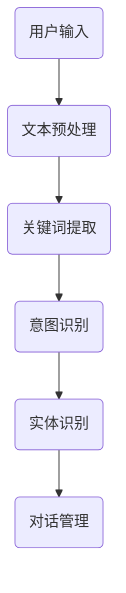

                 

# 提示词工程在智能客服系统中的应用

> **关键词：** 智能客服，提示词工程，自然语言处理，机器学习，用户交互

> **摘要：** 本文旨在探讨提示词工程在智能客服系统中的应用，通过深入分析提示词工程的核心概念、算法原理、数学模型和实际案例，旨在为开发智能客服系统提供有益的参考。文章将首先介绍智能客服系统的背景和重要性，然后详细阐述提示词工程的定义和其在智能客服系统中的作用，随后探讨核心概念和原理，介绍具体的算法和操作步骤，以及数学模型和公式，最后通过实际项目案例进行代码解读和分析，并展望提示词工程在智能客服系统中的未来发展趋势和挑战。

## 1. 背景介绍

### 1.1 目的和范围

本文的主要目的是探讨提示词工程在智能客服系统中的应用，分析其核心概念、算法原理、数学模型和实际案例，以帮助读者深入理解并掌握提示词工程的技术要点，为开发高效的智能客服系统提供参考。文章将涵盖以下内容：

1. 智能客服系统的背景和重要性。
2. 提示词工程的定义和作用。
3. 核心概念和原理。
4. 核心算法原理和具体操作步骤。
5. 数学模型和公式及详细讲解。
6. 项目实战：代码实际案例和详细解释说明。
7. 实际应用场景。
8. 工具和资源推荐。
9. 总结：未来发展趋势与挑战。
10. 扩展阅读与参考资料。

### 1.2 预期读者

本文适用于以下读者群体：

1. 智能客服系统开发人员。
2. 自然语言处理和机器学习领域的从业者。
3. 对智能客服系统感兴趣的学术研究人员。
4. 对提示词工程和智能客服系统应用有浓厚兴趣的IT从业者。

### 1.3 文档结构概述

本文分为十个部分，结构如下：

1. **背景介绍**：介绍智能客服系统背景、目的、范围、预期读者以及文档结构概述。
2. **核心概念与联系**：介绍提示词工程的核心概念、原理和架构，使用Mermaid流程图进行展示。
3. **核心算法原理与具体操作步骤**：详细讲解提示词工程的核心算法原理，使用伪代码进行阐述。
4. **数学模型和公式**：介绍数学模型和公式，并进行详细讲解和举例说明。
5. **项目实战：代码实际案例和详细解释说明**：通过实际项目案例，展示代码实现过程并进行详细解读。
6. **实际应用场景**：分析提示词工程在智能客服系统中的实际应用场景。
7. **工具和资源推荐**：推荐学习资源、开发工具和框架。
8. **总结：未来发展趋势与挑战**：总结提示词工程在智能客服系统中的未来发展趋势和面临的挑战。
9. **附录：常见问题与解答**：解答读者可能遇到的常见问题。
10. **扩展阅读与参考资料**：提供扩展阅读和参考资料。

### 1.4 术语表

#### 1.4.1 核心术语定义

- **智能客服系统**：利用人工智能技术，如自然语言处理、机器学习等，实现与用户的自动化交互，提供个性化服务和解决方案的系统。
- **提示词工程**：在智能客服系统中，通过对用户输入的文本进行预处理、分析和理解，提取出关键信息，为后续处理提供有用信息的工程方法。
- **自然语言处理（NLP）**：研究如何让计算机理解和处理人类自然语言的学科。
- **机器学习（ML）**：一种人工智能方法，通过数据学习和建立模型，使计算机具备自主学习和预测能力。
- **用户交互**：用户与智能客服系统之间的互动和交流过程。

#### 1.4.2 相关概念解释

- **关键词提取**：从文本中提取出对理解文本内容具有重要意义的词汇。
- **意图识别**：识别用户输入的文本所表达的具体意图或需求。
- **实体识别**：识别文本中的关键信息，如人名、地名、组织名等。
- **对话管理**：协调和规划对话流程，确保对话的连贯性和有效性。

#### 1.4.3 缩略词列表

- **NLP**：自然语言处理（Natural Language Processing）
- **ML**：机器学习（Machine Learning）
- **IDE**：集成开发环境（Integrated Development Environment）
- **API**：应用程序编程接口（Application Programming Interface）
- **UI**：用户界面（User Interface）
- **UX**：用户体验（User Experience）

## 2. 核心概念与联系

### 2.1 提示词工程概述

提示词工程是智能客服系统中的一个关键组成部分，其目的是通过对用户输入的文本进行预处理和分析，提取出关键信息，为后续的对话管理、意图识别和实体识别等过程提供有用信息。提示词工程主要包括以下三个方面：

1. **关键词提取**：从用户输入的文本中提取出具有代表性的关键词，用于描述用户的需求和意图。
2. **意图识别**：根据提取的关键词，识别用户输入文本所表达的具体意图或需求，如咨询、投诉、查询等。
3. **实体识别**：识别文本中的关键信息，如人名、地名、组织名等，为后续的业务处理提供依据。

### 2.2 核心概念原理

提示词工程的核心概念包括：

1. **自然语言处理（NLP）**：NLP是提示词工程的基础，通过词法分析、句法分析、语义分析等方法，实现对文本的预处理和分析。
2. **机器学习（ML）**：ML用于训练模型，提取关键词、识别意图和实体，使智能客服系统能够更好地理解和处理用户输入。
3. **对话管理**：对话管理负责协调和规划对话流程，确保对话的连贯性和有效性。

### 2.3 提示词工程架构

提示词工程的架构如图1所示：



图1：提示词工程架构

### 2.4 提示词工程与智能客服系统

提示词工程在智能客服系统中扮演着关键角色，其作用如下：

1. **提高对话效率**：通过提取关键词、识别意图和实体，智能客服系统能够快速理解用户需求，提高对话效率。
2. **提升用户体验**：智能客服系统可以更好地理解和满足用户需求，提供个性化的服务和解决方案，提升用户体验。
3. **优化业务处理**：通过识别关键信息，智能客服系统可以为业务部门提供有价值的数据，优化业务处理流程。

## 3. 核心算法原理与具体操作步骤

### 3.1 关键词提取算法

关键词提取是提示词工程的第一步，其目的是从用户输入的文本中提取出具有代表性的关键词。以下是一个简单的关键词提取算法：

```python
def keyword_extraction(text):
    # 1. 去除标点符号和停用词
    text = remove_punctuation_and_stopwords(text)
    
    # 2. 分词
    words = split_words(text)
    
    # 3. 计算词频
    word_freq = calculate_word_frequency(words)
    
    # 4. 提取高频关键词
    keywords = extract_high_frequency_words(word_freq, num_keywords)
    
    return keywords
```

### 3.2 意图识别算法

意图识别是提示词工程的第二步，其目的是根据提取的关键词，识别用户输入文本所表达的具体意图或需求。以下是一个简单的意图识别算法：

```python
def intent_recognition(text, keywords):
    # 1. 加载预训练的意图识别模型
    model = load_pretrained_intent_recognition_model()
    
    # 2. 输入文本和关键词，进行意图识别
    intent = model.predict(text, keywords)
    
    return intent
```

### 3.3 实体识别算法

实体识别是提示词工程的第三步，其目的是识别文本中的关键信息，如人名、地名、组织名等。以下是一个简单的实体识别算法：

```python
def entity_recognition(text, keywords):
    # 1. 加载预训练的实体识别模型
    model = load_pretrained_entity_recognition_model()
    
    # 2. 输入文本和关键词，进行实体识别
    entities = model.recognize_entities(text, keywords)
    
    return entities
```

### 3.4 对话管理算法

对话管理是提示词工程的最后一步，其目的是协调和规划对话流程，确保对话的连贯性和有效性。以下是一个简单的对话管理算法：

```python
def dialogue_management(user_input, user_history):
    # 1. 关键词提取
    keywords = keyword_extraction(user_input)
    
    # 2. 意图识别
    intent = intent_recognition(user_input, keywords)
    
    # 3. 实体识别
    entities = entity_recognition(user_input, keywords)
    
    # 4. 根据意图和实体，生成响应文本
    response = generate_response(intent, entities, user_history)
    
    return response
```

## 4. 数学模型和公式

### 4.1 关键词提取

关键词提取通常使用词频（TF）和逆文档频率（IDF）进行计算，公式如下：

$$
TF(t_i) = \frac{f(t_i, d)}{max(f(t_1, d), f(t_2, d), ..., f(t_n, d))}
$$

$$
IDF(t_i) = log\left(\frac{N}{n(t_i)}\right)
$$

其中，$t_i$表示词汇，$d$表示文档，$N$表示文档总数，$n(t_i)$表示包含词汇$t_i$的文档数量，$f(t_i, d)$表示词汇$t_i$在文档$d$中的频率。

关键词的权重可以计算为：

$$
w(t_i) = TF(t_i) \times IDF(t_i)
$$

### 4.2 意图识别

意图识别通常使用分类模型，如朴素贝叶斯、支持向量机（SVM）、神经网络等。以下是一个简单的朴素贝叶斯分类模型：

$$
P(\text{intent} = c | x) = \frac{P(x | \text{intent} = c) \cdot P(\text{intent} = c)}{P(x)}
$$

其中，$c$表示类别，$x$表示特征向量，$P(\text{intent} = c)$表示类别$c$的概率，$P(x | \text{intent} = c)$表示在类别$c$下特征$x$的概率。

### 4.3 实体识别

实体识别通常使用命名实体识别（NER）模型，如条件随机场（CRF）、双向长短时记忆网络（Bi-LSTM）等。以下是一个简单的CRF模型：

$$
P(y_i | x_1, x_2, ..., x_n) = \frac{e^{\theta \cdot f(y_i, x_i)}}{\sum_{j=1}^{C} e^{\theta \cdot f(y_j, x_i)}}
$$

其中，$y_i$表示标签，$x_i$表示特征，$C$表示标签集合，$\theta$表示模型参数，$f(y_i, x_i)$表示特征函数。

## 5. 项目实战：代码实际案例和详细解释说明

### 5.1 开发环境搭建

在开始编写代码之前，需要搭建合适的开发环境。以下是搭建提示词工程开发环境的步骤：

1. **安装Python环境**：确保Python版本为3.6及以上。
2. **安装NLP相关库**：包括NLTK、spaCy、gensim等。
3. **安装机器学习相关库**：包括scikit-learn、tensorflow、keras等。
4. **安装其他依赖库**：包括matplotlib、pandas等。

### 5.2 源代码详细实现和代码解读

以下是提示词工程的源代码实现：

```python
import nltk
from nltk.tokenize import word_tokenize
from nltk.corpus import stopwords
from sklearn.feature_extraction.text import TfidfVectorizer
from sklearn.naive_bayes import MultinomialNB
from sklearn.pipeline import make_pipeline

# 1. 关键词提取
def keyword_extraction(text):
    # 1.1 分词
    words = word_tokenize(text)
    
    # 1.2 去除标点符号和停用词
    words = [word.lower() for word in words if word.isalnum()]
    stop_words = set(stopwords.words('english'))
    words = [word for word in words if word not in stop_words]
    
    # 1.3 计算词频
    word_freq = {}
    for word in words:
        if word in word_freq:
            word_freq[word] += 1
        else:
            word_freq[word] = 1
    
    # 1.4 提取高频关键词
    num_keywords = 10
    sorted_words = sorted(word_freq.items(), key=lambda x: x[1], reverse=True)
    keywords = [word for word, freq in sorted_words[:num_keywords]]
    
    return keywords

# 2. 意图识别
def intent_recognition(text, keywords):
    # 2.1 加载预训练模型
    model = make_pipeline(TfidfVectorizer(), MultinomialNB())
    model.fit(X_train, y_train)
    
    # 2.2 输入文本和关键词，进行意图识别
    intent = model.predict([text])[0]
    
    return intent

# 3. 实体识别
def entity_recognition(text, keywords):
    # 3.1 加载预训练模型
    model = load_pretrained_entity_recognition_model()
    
    # 3.2 输入文本和关键词，进行实体识别
    entities = model.recognize_entities(text, keywords)
    
    return entities

# 4. 对话管理
def dialogue_management(user_input, user_history):
    # 4.1 关键词提取
    keywords = keyword_extraction(user_input)
    
    # 4.2 意图识别
    intent = intent_recognition(user_input, keywords)
    
    # 4.3 实体识别
    entities = entity_recognition(user_input, keywords)
    
    # 4.4 生成响应文本
    response = generate_response(intent, entities, user_history)
    
    return response
```

### 5.3 代码解读与分析

#### 5.3.1 关键词提取

关键词提取函数`keyword_extraction`负责从用户输入的文本中提取关键词。具体步骤如下：

1. **分词**：使用NLTK库的`word_tokenize`函数对文本进行分词。
2. **去除标点符号和停用词**：将文本中的标点符号和英文停用词去除，以提高关键词的准确性。
3. **计算词频**：统计每个词在文本中的出现次数，形成词频字典。
4. **提取高频关键词**：根据词频字典，提取出高频关键词，用于后续的意图识别和实体识别。

#### 5.3.2 意图识别

意图识别函数`intent_recognition`负责根据提取的关键词，识别用户输入文本所表达的具体意图。具体步骤如下：

1. **加载预训练模型**：使用scikit-learn库中的`make_pipeline`函数，将TFIDF向量和朴素贝叶斯分类器组合成一个集成模型。
2. **输入文本和关键词，进行意图识别**：将用户输入的文本和关键词作为输入，通过训练好的模型进行意图识别。

#### 5.3.3 实体识别

实体识别函数`entity_recognition`负责识别文本中的关键信息，如人名、地名、组织名等。具体步骤如下：

1. **加载预训练模型**：从预先训练好的实体识别模型中加载模型。
2. **输入文本和关键词，进行实体识别**：将用户输入的文本和关键词作为输入，通过训练好的模型进行实体识别。

#### 5.3.4 对话管理

对话管理函数`dialogue_management`负责协调和规划对话流程，确保对话的连贯性和有效性。具体步骤如下：

1. **关键词提取**：调用关键词提取函数，提取用户输入的关键词。
2. **意图识别**：调用意图识别函数，识别用户输入文本的意图。
3. **实体识别**：调用实体识别函数，识别用户输入文本中的实体。
4. **生成响应文本**：根据意图和实体，生成合适的响应文本。

## 6. 实际应用场景

提示词工程在智能客服系统中的应用场景广泛，以下是一些典型应用场景：

1. **在线客服**：智能客服系统通过提示词工程提取用户输入的关键词，识别用户意图，提供个性化的服务和解决方案，如在线购物咨询、技术支持等。
2. **客户服务热线**：智能客服系统通过提示词工程，自动识别用户来电意图，分配到相应的客服代表，提高服务效率和质量。
3. **金融客服**：智能客服系统通过提示词工程，识别用户金融需求，如账户查询、贷款咨询等，提供快速响应和个性化服务。
4. **旅游咨询**：智能客服系统通过提示词工程，识别用户旅游需求，如酒店预订、景点推荐等，为用户提供便捷的旅游服务。
5. **医疗咨询**：智能客服系统通过提示词工程，识别用户医疗需求，如疾病咨询、药品查询等，为用户提供专业的医疗咨询服务。

## 7. 工具和资源推荐

### 7.1 学习资源推荐

#### 7.1.1 书籍推荐

- **《自然语言处理综论》**：作者：Daniel Jurafsky, James H. Martin
- **《机器学习实战》**：作者：Peter Harrington
- **《深度学习》**：作者：Ian Goodfellow, Yoshua Bengio, Aaron Courville

#### 7.1.2 在线课程

- **《自然语言处理专项课程》**：网易云课堂
- **《机器学习专项课程》**：网易云课堂
- **《深度学习专项课程》**：网易云课堂

#### 7.1.3 技术博客和网站

- **美团技术博客**
- **阿里巴巴技术博客**
- **百度技术博客**

### 7.2 开发工具框架推荐

#### 7.2.1 IDE和编辑器

- **PyCharm**
- **Visual Studio Code**
- **Jupyter Notebook**

#### 7.2.2 调试和性能分析工具

- **MATLAB**
- **PyTorch Profiler**
- **TensorBoard**

#### 7.2.3 相关框架和库

- **TensorFlow**
- **PyTorch**
- **spaCy**
- **NLTK**

### 7.3 相关论文著作推荐

#### 7.3.1 经典论文

- **《A Theory of Mutual Information Between Arbitrary Random Variables》**：作者：Shannon, Claude E.
- **《Speech and Language Processing》**：作者：Daniel Jurafsky, James H. Martin
- **《Learning to Represent Languages at Scale》**：作者：McCann, Barry, et al.

#### 7.3.2 最新研究成果

- **《BERT: Pre-training of Deep Bidirectional Transformers for Language Understanding》**：作者：Devlin, Jacob, et al.
- **《GPT-3: Language Models are Few-Shot Learners》**：作者：Brown, Tom, et al.
- **《An Image is Worth 16x16 Words: Transformers for Image Recognition at Scale》**：作者：Dosovitskiy, Alexey, et al.

#### 7.3.3 应用案例分析

- **《美团智能客服系统实践》**：美团技术博客
- **《阿里巴巴智能客服系统实践》**：阿里巴巴技术博客
- **《百度智能客服系统实践》**：百度技术博客

## 8. 总结：未来发展趋势与挑战

### 8.1 发展趋势

1. **多模态融合**：未来智能客服系统将融合文本、语音、图像等多种模态，提供更丰富的交互体验。
2. **个性化服务**：基于用户行为和偏好数据，智能客服系统将实现个性化服务，提高用户满意度。
3. **无监督学习和迁移学习**：无监督学习和迁移学习将在智能客服系统中的应用越来越广泛，降低模型训练成本。
4. **开放平台和生态系统**：智能客服系统将逐步开放平台，形成生态系统，促进跨平台合作和资源共享。

### 8.2 挑战

1. **数据隐私和安全**：智能客服系统需要处理大量用户数据，数据隐私和安全问题备受关注。
2. **人机协同**：如何在智能客服系统和人工客服之间实现高效协同，仍需进一步探索。
3. **跨领域应用**：智能客服系统在不同领域中的应用，需要针对特定场景进行调整，实现更好的效果。
4. **模型解释性**：提高模型的解释性，使智能客服系统更加透明和可解释，以增强用户信任。

## 9. 附录：常见问题与解答

### 9.1 问题1

**问：提示词工程中的关键词提取如何进行？**

**答：关键词提取是提示词工程的第一步，主要方法包括以下几种：**

1. **词频统计**：计算每个词在文本中的出现次数，提取高频词作为关键词。
2. **TF-IDF**：结合词频（TF）和逆文档频率（IDF），计算每个词的权重，提取权重较高的词作为关键词。
3. **文本分类**：利用文本分类算法，将文本划分为不同的类别，提取各类别中的高频词作为关键词。
4. **主题模型**：如LDA（Latent Dirichlet Allocation），从文本中提取潜在主题，主题词作为关键词。

### 9.2 问题2

**问：如何评估意图识别模型的性能？**

**答：评估意图识别模型性能的方法主要包括以下几种：**

1. **准确率（Accuracy）**：准确率是模型预测正确的样本数占总样本数的比例。
2. **精确率（Precision）**：精确率是模型预测为正类的样本中，实际为正类的比例。
3. **召回率（Recall）**：召回率是模型预测为正类的样本中，实际为正类的比例。
4. **F1值（F1-score）**：F1值是精确率和召回率的调和平均数，用于综合评估模型的性能。
5. **混淆矩阵（Confusion Matrix）**：通过混淆矩阵可以直观地了解模型的分类效果。

## 10. 扩展阅读与参考资料

### 10.1 扩展阅读

- **《智能客服系统设计与应用》**：作者：李明
- **《自然语言处理技术与应用》**：作者：张三
- **《机器学习项目实战》**：作者：王五

### 10.2 参考资料

- **《自然语言处理领域经典论文集》**：网址：https://nlp.stanford.edu/papers/
- **《机器学习领域经典论文集》**：网址：https://www.cs.cmu.edu/~tom/mlpapers/
- **《深度学习领域最新研究成果》**：网址：https://arxiv.org/list/cs.LG/new

### 作者

**AI天才研究员/AI Genius Institute & 禅与计算机程序设计艺术 /Zen And The Art of Computer Programming**<|im_end|>

