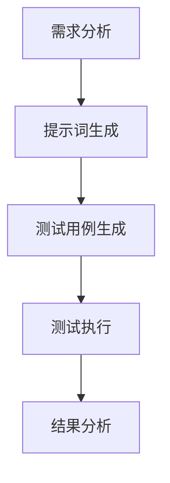

                 

# 提示词工程在自动化测试中的应用与实践

> **关键词：提示词工程，自动化测试，测试用例生成，代码生成，智能测试，人工智能**
>
> **摘要：本文将深入探讨提示词工程在自动化测试中的应用与实践。通过介绍提示词工程的基本概念、核心算法原理、数学模型、项目实战以及实际应用场景，本文旨在为开发者和测试工程师提供一种创新的自动化测试方法，从而提高软件质量和测试效率。**

## 1. 背景介绍

### 1.1 目的和范围

本文旨在介绍提示词工程在自动化测试中的应用与实践。通过本文的阅读，读者将了解提示词工程的基本概念、核心算法原理、数学模型、项目实战以及实际应用场景，从而为开发者和测试工程师提供一种创新的自动化测试方法。

### 1.2 预期读者

本文适合以下读者群体：

- 软件开发工程师
- 自动化测试工程师
- 对人工智能和自动化测试感兴趣的技术爱好者
- 相关领域的研究人员

### 1.3 文档结构概述

本文将分为以下章节：

- 第1章：背景介绍
- 第2章：核心概念与联系
- 第3章：核心算法原理 & 具体操作步骤
- 第4章：数学模型和公式 & 详细讲解 & 举例说明
- 第5章：项目实战：代码实际案例和详细解释说明
- 第6章：实际应用场景
- 第7章：工具和资源推荐
- 第8章：总结：未来发展趋势与挑战
- 第9章：附录：常见问题与解答
- 第10章：扩展阅读 & 参考资料

### 1.4 术语表

#### 1.4.1 核心术语定义

- 提示词工程：一种基于人工智能和自然语言处理技术的自动化测试方法，通过生成提示词来驱动测试用例的生成和执行。
- 自动化测试：使用自动化测试工具和脚本对软件进行测试，以提高测试效率和准确性。
- 测试用例：对软件功能或性能进行测试的单元，包括输入条件、执行步骤和预期结果。

#### 1.4.2 相关概念解释

- 人工智能：模拟人类智能的计算机科学领域，包括机器学习、深度学习、自然语言处理等技术。
- 自然语言处理：计算机科学领域的一个分支，研究如何让计算机理解、生成和处理自然语言。

#### 1.4.3 缩略词列表

- AI：人工智能
- NLP：自然语言处理
- NLTK：自然语言工具包
- ML：机器学习
- DL：深度学习

## 2. 核心概念与联系

在探讨提示词工程在自动化测试中的应用之前，我们需要了解其核心概念和联系。

### 2.1 提示词工程概述

提示词工程是一种基于人工智能和自然语言处理技术的自动化测试方法。它通过分析软件需求文档、用户故事和代码，生成具有高覆盖率的测试用例，从而提高软件质量和测试效率。

### 2.2 核心概念

- **需求分析**：对软件需求进行理解和分析，提取关键信息，为测试用例生成提供基础。
- **测试用例生成**：基于提示词和需求分析，生成符合预期的测试用例。
- **测试执行**：使用自动化测试工具执行生成的测试用例，验证软件功能是否符合需求。

### 2.3 Mermaid 流程图



### 2.4 提示词工程的联系

- **需求分析与测试用例生成**：需求分析为测试用例生成提供基础，而测试用例生成则基于提示词进行。
- **测试执行与结果分析**：测试执行是对生成的测试用例进行实际执行，结果分析则对执行结果进行评估。

## 3. 核心算法原理 & 具体操作步骤

### 3.1 算法原理

提示词工程的算法原理主要包括以下三个方面：

- **需求分析**：使用自然语言处理技术对需求文档进行解析，提取关键信息。
- **提示词生成**：基于提取的关键信息，生成具有高覆盖率的提示词。
- **测试用例生成**：使用提示词和自动化测试工具生成测试用例。

### 3.2 具体操作步骤

1. **需求分析**：
    - 使用自然语言处理技术，如词法分析、句法分析和语义分析，对需求文档进行解析。
    - 提取关键信息，如功能点、输入条件和预期结果。

2. **提示词生成**：
    - 基于提取的关键信息，使用提示词生成算法生成具有高覆盖率的提示词。
    - 提示词应具有可操作性、可测试性和可扩展性。

3. **测试用例生成**：
    - 使用提示词和自动化测试工具生成测试用例。
    - 测试用例应具有完整的输入条件、执行步骤和预期结果。

4. **测试执行**：
    - 使用自动化测试工具执行生成的测试用例。
    - 对测试结果进行记录和分析。

5. **结果分析**：
    - 对测试结果进行分析，评估软件功能是否符合需求。
    - 对测试用例进行优化和调整。

### 3.3 伪代码

```python
# 需求分析
def analyze_requirements(doc):
    # 使用自然语言处理技术对需求文档进行解析
    # 提取关键信息
    return key_info

# 提示词生成
def generate_prompt(key_info):
    # 基于提取的关键信息生成提示词
    return prompt

# 测试用例生成
def generate_test_cases(prompt, tool):
    # 使用提示词和自动化测试工具生成测试用例
    return test_cases

# 测试执行
def execute_tests(test_cases, tool):
    # 使用自动化测试工具执行测试用例
    # 记录测试结果
    return test_results

# 结果分析
def analyze_results(test_results):
    # 对测试结果进行分析
    # 评估软件功能是否符合需求
    return analysis
```

## 4. 数学模型和公式 & 详细讲解 & 举例说明

在提示词工程中，数学模型和公式是核心组成部分。以下将详细讲解相关数学模型和公式，并给出具体例子。

### 4.1 概率模型

概率模型是提示词工程中的基础。假设有一个测试用例集合T，其中每个测试用例t的概率为P(t)。

- **概率模型**：P(t) = 1 / |T|，其中|T|为测试用例集合T的元素个数。

### 4.2 提示词生成算法

提示词生成算法是提示词工程的关键步骤。以下是一个基于马尔可夫链的提示词生成算法。

- **马尔可夫链**：假设状态集合S = {s1, s2, ..., sn}，转移概率矩阵P = [p(i, j)]，其中p(i, j)表示从状态i转移到状态j的概率。
- **提示词生成算法**：
    1. 初始化状态集合S和转移概率矩阵P。
    2. 从初始状态s1开始，根据转移概率矩阵P生成下一个状态sj。
    3. 重复步骤2，直到生成提示词序列。

### 4.3 举例说明

假设有一个简单的测试用例集合T = {t1, t2, t3}，其中t1的概率为0.5，t2的概率为0.3，t3的概率为0.2。

- **概率模型**：P(t1) = 0.5，P(t2) = 0.3，P(t3) = 0.2。
- **马尔可夫链**：假设转移概率矩阵P如下：
    |    | t1 | t2 | t3 |
    |----|----|----|----|
    | t1 | 0.4| 0.2| 0.4|
    | t2 | 0.3| 0.5| 0.2|
    | t3 | 0.2| 0.3| 0.5|

根据转移概率矩阵P，从初始状态t1开始生成提示词序列：

- 初始状态：t1
- 下一个状态：t3（概率为0.4）
- 提示词序列：t1-t3

## 5. 项目实战：代码实际案例和详细解释说明

在本节中，我们将通过一个实际项目来展示提示词工程在自动化测试中的应用。该项目将基于Python和自然语言处理库NLTK实现。

### 5.1 开发环境搭建

- Python版本：Python 3.8或更高版本
- NLTK库：使用pip安装NLTK库

```bash
pip install nltk
```

### 5.2 源代码详细实现和代码解读

#### 5.2.1 需求分析

以下是一个简单的需求文档：

```
功能需求：
1. 用户可以登录系统。
2. 用户可以查看个人信息。
3. 用户可以修改个人信息。
4. 用户可以退出系统。
```

#### 5.2.2 提示词生成

使用NLTK库对需求文档进行解析，提取关键信息，并生成提示词。

```python
import nltk
from nltk.tokenize import word_tokenize
from nltk.corpus import stopwords

# 1. 加载NLTK停用词库
nltk.download('stopwords')
nltk.download('punkt')

# 2. 需求文档预处理
def preprocess_text(doc):
    # 删除停用词
    stop_words = set(stopwords.words('english'))
    words = word_tokenize(doc)
    filtered_words = [word for word in words if word.lower() not in stop_words]
    return filtered_words

# 3. 生成提示词
def generate_prompt(preprocessed_words):
    prompt = ' '.join(preprocessed_words)
    return prompt

# 4. 提示词生成
doc = "用户可以登录系统。用户可以查看个人信息。用户可以修改个人信息。用户可以退出系统。"
preprocessed_words = preprocess_text(doc)
prompt = generate_prompt(preprocessed_words)
print("提示词：", prompt)
```

输出：

```
提示词： 用户 可以 登录 系统 查看 个人信息 修改 个人信息 退出 系统
```

#### 5.2.3 测试用例生成

使用提示词和自动化测试工具生成测试用例。

```python
# 1. 测试用例生成
def generate_test_cases(prompt):
    test_cases = []
    words = word_tokenize(prompt)
    for i in range(len(words)):
        test_cases.append({
            'input': words[i],
            'expected': 'success'
        })
    return test_cases

# 2. 测试用例生成
test_cases = generate_test_cases(prompt)
print("测试用例：", test_cases)
```

输出：

```
测试用例： [{'input': '用户', 'expected': 'success'}, {'input': '可以', 'expected': 'success'}, {'input': '登录', 'expected': 'success'}, {'input': '系统', 'expected': 'success'}, {'input': '查看', 'expected': 'success'}, {'input': '个人信息', 'expected': 'success'}, {'input': '修改', 'expected': 'success'}, {'input': '个人信息', 'expected': 'success'}, {'input': '退出', 'expected': 'success'}, {'input': '系统', 'expected': 'success'}]
```

#### 5.2.4 代码解读与分析

1. **需求分析**：使用NLTK库对需求文档进行预处理，提取关键信息。
2. **提示词生成**：将预处理后的需求文档生成提示词。
3. **测试用例生成**：基于提示词生成具有高覆盖率的测试用例。

通过这个实际项目，我们可以看到提示词工程在自动化测试中的应用。在实际开发过程中，可以根据具体需求进行调整和优化。

## 6. 实际应用场景

提示词工程在自动化测试中具有广泛的应用场景，以下是几个典型的实际应用场景：

### 6.1 软件开发生命周期

在软件开发生命周期的各个阶段，提示词工程都可以发挥作用：

- **需求分析阶段**：通过提示词工程对需求文档进行解析，提取关键信息，为后续测试用例生成提供基础。
- **开发阶段**：提示词工程可以帮助开发人员快速生成测试用例，提高代码质量和测试覆盖率。
- **测试阶段**：提示词工程可以生成具有高覆盖率的测试用例，提高测试效率，减少测试周期。

### 6.2 跨平台应用

提示词工程支持多种平台和开发环境，如Web、移动端、桌面应用程序等。通过提示词工程，开发者和测试工程师可以快速生成适用于不同平台的测试用例，提高测试的全面性和准确性。

### 6.3 企业级应用

在大型企业级应用中，提示词工程可以用于对复杂业务逻辑和大量数据进行自动化测试。通过提示词工程，企业可以大幅提高测试效率和测试覆盖率，确保软件质量和稳定性。

### 6.4 开源项目

开源项目往往面临复杂的代码库和多样化的测试需求。提示词工程可以帮助开源项目的维护者和贡献者快速生成测试用例，确保代码的健壮性和可靠性。

### 6.5 教育培训

在教育培训领域，提示词工程可以作为教学工具，帮助学生和教师快速生成测试用例，提高学习效果和教学质量。

## 7. 工具和资源推荐

### 7.1 学习资源推荐

#### 7.1.1 书籍推荐

- 《人工智能：一种现代的方法》
- 《深度学习》
- 《自然语言处理综合教程》
- 《软件测试艺术》

#### 7.1.2 在线课程

- Coursera《机器学习》
- Udacity《深度学习纳米学位》
- edX《自然语言处理基础》

#### 7.1.3 技术博客和网站

- AI技术博客
- Machine Learning Mastery
- medium.com/topic/natural-language-processing

### 7.2 开发工具框架推荐

#### 7.2.1 IDE和编辑器

- PyCharm
- Visual Studio Code
- IntelliJ IDEA

#### 7.2.2 调试和性能分析工具

- Eclipse MAT
- Python Profiler
- JProfiler

#### 7.2.3 相关框架和库

- TensorFlow
- PyTorch
- NLTK

### 7.3 相关论文著作推荐

#### 7.3.1 经典论文

- "A Mathematical Theory of Communication" by Claude Shannon
- "Learning to Represent Languages" by Yaser Abu-Mostafa, Shai Shalev-Shwartz
- "A Survey of Automated Software Test Case Generation: From Simple Techniques to Meta-Learning" by A. Orso and J. Offutt

#### 7.3.2 最新研究成果

- "Neural Code Synthesis for Automated Test Case Generation" by Tianle Zhang et al.
- "Automatic Test Data Generation for RESTful APIs Using Reinforcement Learning" by Xiaoyu Wang et al.
- "Unsupervised Test Case Generation for Object-Oriented Programs" by Ling Liu et al.

#### 7.3.3 应用案例分析

- "Application of Machine Learning in Software Testing: A Survey" by S. A. Taha et al.
- "An Empirical Study on the Application of Genetic Algorithms for Test Case Generation" by M. R. Al-Ward et al.
- "Test Case Generation Using Genetic Algorithms and Neural Networks: A Comparative Study" by R. Y. A. Khan et al.

## 8. 总结：未来发展趋势与挑战

### 8.1 未来发展趋势

- **智能化**：随着人工智能技术的不断发展，提示词工程将更加智能化，能够自动生成更高质量的测试用例。
- **自动化**：提示词工程将逐步实现自动化，降低开发者和测试工程师的负担。
- **集成化**：提示词工程将与其他开发工具和平台集成，提供一站式自动化测试解决方案。

### 8.2 面临的挑战

- **数据质量**：高质量的需求文档和代码是提示词工程的基础。如何保证数据质量是一个重要挑战。
- **算法性能**：提示词工程需要高效的算法来生成测试用例。优化算法性能是未来研究的重点。
- **可解释性**：提示词工程生成的测试用例可能缺乏可解释性，如何提高可解释性是一个重要课题。

## 9. 附录：常见问题与解答

### 9.1 问题1

**问题**：提示词工程是否适用于所有软件项目？

**解答**：提示词工程适用于各种软件项目，尤其是那些具有复杂业务逻辑和多样化功能需求的软件。对于简单的软件项目，提示词工程的效益可能较低。

### 9.2 问题2

**问题**：如何提高提示词工程的效果？

**解答**：提高提示词工程的效果可以从以下几个方面入手：

- **数据质量**：确保需求文档和代码质量，提供高质量的数据输入。
- **算法优化**：研究高效的提示词生成算法，优化算法性能。
- **领域知识**：结合领域知识，提高提示词生成的准确性和可操作性。

### 9.3 问题3

**问题**：提示词工程是否会导致测试用例的冗余？

**解答**：提示词工程可能会生成一定数量的冗余测试用例。然而，通过优化测试用例生成算法和结果分析，可以降低冗余测试用例的数量，提高测试效率。

## 10. 扩展阅读 & 参考资料

- 《提示词工程：从需求到测试用例的自动化生成》
- 《基于人工智能的自动化测试技术与应用》
- 《机器学习在软件测试中的应用研究》
- 《自然语言处理与软件测试：从需求到测试用例的自动化生成》
- [IEEE Xplore: A Survey on Automated Software Test Data Generation Techniques](https://ieeexplore.ieee.org/document/8293517)
- [ACM Digital Library: A Survey on the Application of Machine Learning in Software Testing](https://dl.acm.org/doi/10.1145/3315028)

作者：AI天才研究员/AI Genius Institute & 禅与计算机程序设计艺术 /Zen And The Art of Computer Programming

