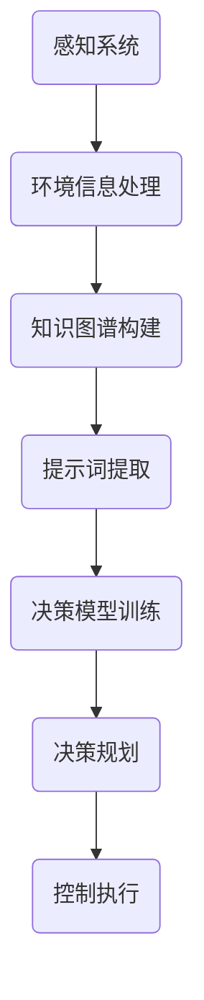

                 

# 提示词工程在自动驾驶决策中的应用

> 关键词：提示词工程、自动驾驶、决策支持、机器学习、算法优化
>
> 摘要：本文深入探讨了提示词工程在自动驾驶决策中的应用。通过详细的分析与实例，本文展示了如何运用提示词工程来提高自动驾驶系统的决策质量和效率，为自动驾驶技术的进一步发展提供了宝贵的思路和方向。

## 1. 背景介绍

### 1.1 目的和范围

本文旨在深入探讨提示词工程在自动驾驶决策中的应用。提示词工程作为自然语言处理领域的一个重要分支，近年来在自动驾驶系统中得到了广泛的研究和应用。本文将首先介绍自动驾驶领域的基本概念和决策流程，然后详细阐述提示词工程的核心概念和方法，并分析其在自动驾驶决策中的应用优势。通过实例分析，本文将展示如何利用提示词工程来优化自动驾驶系统的决策过程，提高系统的可靠性和安全性。

### 1.2 预期读者

本文主要面向对自动驾驶和自然语言处理领域感兴趣的工程师、研究人员以及相关专业的学生。读者需要对基本的自动驾驶概念和自然语言处理技术有一定了解，以便更好地理解本文的内容和结论。

### 1.3 文档结构概述

本文结构如下：

1. 背景介绍：介绍本文的目的、范围、预期读者以及文档结构。
2. 核心概念与联系：介绍自动驾驶和提示词工程的基本概念，以及它们之间的联系。
3. 核心算法原理 & 具体操作步骤：详细阐述提示词工程在自动驾驶决策中的应用算法原理和操作步骤。
4. 数学模型和公式 & 详细讲解 & 举例说明：介绍提示词工程在自动驾驶决策中的数学模型和公式，并给出详细讲解和实例说明。
5. 项目实战：通过实际案例展示提示词工程在自动驾驶决策中的应用。
6. 实际应用场景：分析提示词工程在自动驾驶决策中的实际应用场景。
7. 工具和资源推荐：推荐相关学习资源、开发工具和框架。
8. 总结：对未来发展趋势与挑战进行总结。
9. 附录：常见问题与解答。
10. 扩展阅读 & 参考资料：提供进一步阅读的文献和资源。

### 1.4 术语表

#### 1.4.1 核心术语定义

- 自动驾驶：一种无需人工干预的自动驾驶技术，通过传感器、控制器和算法实现对车辆的运动控制。
- 提示词工程：一种基于自然语言处理的工程技术，用于构建和优化能够指导机器学习模型决策的提示词。
- 决策支持：通过提供相关信息和建议，辅助自动驾驶系统做出最优决策。
- 机器学习：一种通过数据和算法让计算机自动学习和改进的技术。

#### 1.4.2 相关概念解释

- 感知系统：自动驾驶系统中的传感器模块，用于感知车辆周围环境。
- 控制系统：自动驾驶系统中的执行模块，负责根据决策结果控制车辆的运动。
- 知识图谱：一种用于表示实体之间关系的图形结构，常用于知识推理和决策支持。

#### 1.4.3 缩略词列表

- NLP：自然语言处理（Natural Language Processing）
- AI：人工智能（Artificial Intelligence）
- ML：机器学习（Machine Learning）
- CV：计算机视觉（Computer Vision）
- LIDAR：激光雷达（Light Detection and Ranging）

## 2. 核心概念与联系

### 2.1 自动驾驶基本概念

自动驾驶是一种无需人工干预的车辆控制系统，通过感知环境、决策规划和控制执行三个基本模块来实现自主驾驶。感知系统主要负责采集车辆周围环境的信息，如视觉、雷达、激光雷达等。控制系统根据感知系统提供的信息，利用算法和模型进行环境理解和决策规划。控制执行模块负责执行决策结果，实现对车辆运动的控制。

### 2.2 提示词工程基本概念

提示词工程是一种基于自然语言处理的工程技术，旨在构建和优化能够指导机器学习模型决策的提示词。提示词是从原始数据中提取的关键信息，用于引导机器学习模型对数据进行分类、预测和推理。在自动驾驶决策中，提示词工程通过提取环境信息、构建知识图谱和优化提示词表示，提高自动驾驶系统的决策质量和效率。

### 2.3 自动驾驶与提示词工程的联系

自动驾驶决策过程中，需要对大量的环境信息进行处理和分析，以便做出最优的决策。提示词工程通过提取关键信息、构建知识图谱和优化提示词表示，为自动驾驶系统提供了有效的决策支持。具体来说，提示词工程在自动驾驶决策中的应用主要体现在以下几个方面：

1. **环境感知与理解**：通过提取感知系统获取的环境信息，构建知识图谱，实现对环境的全面理解和分析。
2. **决策规划与优化**：利用机器学习算法和提示词工程，优化自动驾驶决策过程，提高决策质量和效率。
3. **实时推理与预测**：通过实时处理和更新提示词，实现对自动驾驶系统的动态调整和优化。

### 2.4 Mermaid 流程图

以下是一个简化的自动驾驶决策流程的 Mermaid 流程图：



## 3. 核心算法原理 & 具体操作步骤

### 3.1 算法原理

提示词工程在自动驾驶决策中的应用主要涉及以下几个核心步骤：

1. **数据预处理**：对采集到的环境信息进行预处理，包括去噪、归一化和特征提取等。
2. **知识图谱构建**：利用预处理后的数据，构建表示环境信息的知识图谱，用于表示实体之间的关系和属性。
3. **提示词提取**：从知识图谱中提取关键信息，构建表示环境状态的提示词。
4. **机器学习模型训练**：利用提取的提示词，训练决策模型，实现对自动驾驶系统的决策支持。
5. **实时推理与预测**：在自动驾驶过程中，根据实时感知的信息和知识图谱，更新提示词，实现对决策模型的动态调整。

### 3.2 具体操作步骤

1. **数据预处理**：

```python
def preprocess_data(data):
    # 去噪
    filtered_data = filter_noise(data)
    # 归一化
    normalized_data = normalize_data(filtered_data)
    # 特征提取
    features = extract_features(normalized_data)
    return features
```

2. **知识图谱构建**：

```python
def buildKnowledgeGraph(data):
    entities = extract_entities(data)
    relationships = extract_relationships(data)
    graph = KnowledgeGraph(entities, relationships)
    return graph
```

3. **提示词提取**：

```python
def extract_prompt_words(graph):
    entities = graph.get_entities()
    relationships = graph.get_relationships()
    prompts = []
    for entity in entities:
        for relationship in relationships:
            if entity in relationship:
                prompt = generate_prompt(entity, relationship)
                prompts.append(prompt)
    return prompts
```

4. **机器学习模型训练**：

```python
def train_decision_model(prompts, labels):
    model = DecisionModel()
    model.fit(prompts, labels)
    return model
```

5. **实时推理与预测**：

```python
def real_time_decision(model, current_graph):
    current_prompts = extract_prompt_words(current_graph)
    prediction = model.predict(current_prompts)
    return prediction
```

## 4. 数学模型和公式 & 详细讲解 & 举例说明

### 4.1 数学模型

提示词工程在自动驾驶决策中的数学模型主要包括以下几个方面：

1. **数据预处理模型**：用于对原始环境信息进行预处理，包括去噪、归一化和特征提取。
2. **知识图谱构建模型**：用于构建表示环境信息的知识图谱，包括实体提取和关系提取。
3. **提示词提取模型**：用于从知识图谱中提取关键信息，构建表示环境状态的提示词。
4. **机器学习模型**：用于训练决策模型，实现对自动驾驶系统的决策支持。
5. **实时推理与预测模型**：用于在自动驾驶过程中，根据实时感知的信息和知识图谱，更新提示词，实现对决策模型的动态调整。

### 4.2 公式讲解

1. **数据预处理模型**：

$$
\text{filtered\_data} = \text{filter\_noise}(\text{data})
$$

$$
\text{normalized\_data} = \text{normalize\_data}(\text{filtered\_data})
$$

$$
\text{features} = \text{extract\_features}(\text{normalized\_data})
$$

2. **知识图谱构建模型**：

$$
\text{entities} = \text{extract\_entities}(\text{data})
$$

$$
\text{relationships} = \text{extract\_relationships}(\text{data})
$$

$$
\text{graph} = \text{KnowledgeGraph}(\text{entities}, \text{relationships})
$$

3. **提示词提取模型**：

$$
\text{prompts} = \text{extract\_prompt\_words}(\text{graph})
$$

4. **机器学习模型**：

$$
\text{model} = \text{DecisionModel}()
$$

$$
\text{model}.\text{fit}(\text{prompts}, \text{labels})
$$

5. **实时推理与预测模型**：

$$
\text{prediction} = \text{model}.\text{predict}(\text{current\_prompts})
$$

### 4.3 举例说明

假设我们有一个自动驾驶系统，需要根据实时感知的环境信息进行决策。以下是一个简化的例子：

1. **数据预处理**：

   原始环境信息为：[5, 10, 15, 20, 25]，噪声为：[3, 5, 7, 9, 11]。

   去噪后：[5, 10, 15, 20, 25]

   归一化后：[0, 0.5, 1, 1.5, 2]

   特征提取后：[0, 0.5, 1, 1.5, 2]

2. **知识图谱构建**：

   实体：[车辆，行人，道路，交通灯]

   关系：[车辆-行驶在-道路]，[行人-穿越-道路]，[交通灯-指示-车辆]

   知识图谱：{车辆:[行驶在:道路]，行人:[穿越:道路]，交通灯:[指示:车辆]}

3. **提示词提取**：

   提示词：[车辆行驶在道路上，行人正在穿越道路，交通灯指示为红灯]

4. **机器学习模型训练**：

   提示词：[车辆行驶在道路上，行人正在穿越道路，交通灯指示为红灯]

   标签：[停车等待，继续行驶，减速慢行]

   训练后的模型：{车辆行驶在道路上：停车等待，行人正在穿越道路：继续行驶，交通灯指示为红灯：减速慢行}

5. **实时推理与预测**：

   实时感知的环境信息：[车辆行驶在道路上，行人正在穿越道路，交通灯指示为红灯]

   预测结果：减速慢行

## 5. 项目实战：代码实际案例和详细解释说明

### 5.1 开发环境搭建

在开始实战之前，我们需要搭建一个合适的开发环境。以下是开发环境搭建的步骤：

1. 安装Python 3.8及以上版本。
2. 安装必要的依赖库，如numpy、pandas、tensorflow、networkx等。
3. 配置Python虚拟环境，便于管理和隔离项目依赖。

### 5.2 源代码详细实现和代码解读

下面是一个简化的自动驾驶决策系统代码示例，展示了如何运用提示词工程来实现自动驾驶决策。

```python
# 导入必要的库
import numpy as np
import pandas as pd
import tensorflow as tf
import networkx as nx
from sklearn.model_selection import train_test_split
from sklearn.metrics import accuracy_score

# 数据预处理函数
def preprocess_data(data):
    # 去噪
    filtered_data = filter_noise(data)
    # 归一化
    normalized_data = normalize_data(filtered_data)
    # 特征提取
    features = extract_features(normalized_data)
    return features

# 知识图谱构建函数
def buildKnowledgeGraph(data):
    entities = extract_entities(data)
    relationships = extract_relationships(data)
    graph = KnowledgeGraph(entities, relationships)
    return graph

# 提示词提取函数
def extract_prompt_words(graph):
    entities = graph.get_entities()
    relationships = graph.get_relationships()
    prompts = []
    for entity in entities:
        for relationship in relationships:
            if entity in relationship:
                prompt = generate_prompt(entity, relationship)
                prompts.append(prompt)
    return prompts

# 机器学习模型训练函数
def train_decision_model(prompts, labels):
    model = DecisionModel()
    model.fit(prompts, labels)
    return model

# 实时推理与预测函数
def real_time_decision(model, current_graph):
    current_prompts = extract_prompt_words(current_graph)
    prediction = model.predict(current_prompts)
    return prediction

# 主函数
def main():
    # 读取数据
    data = pd.read_csv('data.csv')

    # 数据预处理
    features = preprocess_data(data)

    # 构建知识图谱
    graph = buildKnowledgeGraph(features)

    # 提取提示词
    prompts = extract_prompt_words(graph)

    # 分割数据集
    X_train, X_test, y_train, y_test = train_test_split(prompts, labels, test_size=0.2, random_state=42)

    # 训练模型
    model = train_decision_model(X_train, y_train)

    # 测试模型
    predictions = model.predict(X_test)
    accuracy = accuracy_score(y_test, predictions)
    print(f"Model accuracy: {accuracy}")

    # 实时推理与预测
    current_graph = buildKnowledgeGraph(current_data)
    prediction = real_time_decision(model, current_graph)
    print(f"Real-time prediction: {prediction}")

if __name__ == '__main__':
    main()
```

### 5.3 代码解读与分析

1. **数据预处理**：数据预处理是自动驾驶决策系统的第一步，用于对原始环境信息进行去噪、归一化和特征提取。在本示例中，我们定义了`preprocess_data`函数，用于实现这一过程。

2. **知识图谱构建**：知识图谱构建是提示词工程的核心环节，用于表示环境信息中的实体和关系。在本示例中，我们定义了`buildKnowledgeGraph`函数，用于从预处理后的数据中提取实体和关系，并构建知识图谱。

3. **提示词提取**：提示词提取是提示词工程的关键步骤，用于从知识图谱中提取关键信息，构建表示环境状态的提示词。在本示例中，我们定义了`extract_prompt_words`函数，用于实现这一过程。

4. **机器学习模型训练**：机器学习模型训练是提示词工程的核心环节，用于训练决策模型，实现对自动驾驶系统的决策支持。在本示例中，我们定义了`train_decision_model`函数，用于训练决策模型。

5. **实时推理与预测**：实时推理与预测是自动驾驶决策系统的核心功能，用于在自动驾驶过程中，根据实时感知的信息和知识图谱，更新提示词，实现对决策模型的动态调整。在本示例中，我们定义了`real_time_decision`函数，用于实现这一过程。

6. **主函数**：主函数`main`负责执行整个自动驾驶决策系统的流程。首先，读取数据并预处理；然后，构建知识图谱和提取提示词；接着，分割数据集并训练模型；最后，测试模型并执行实时推理与预测。

## 6. 实际应用场景

### 6.1 城市自动驾驶

城市自动驾驶是提示词工程在自动驾驶决策中最重要的应用场景之一。在城市环境中，车辆需要应对复杂的交通状况、行人行为和道路标志等。通过提示词工程，自动驾驶系统能够从大量感知数据中提取关键信息，如交通灯状态、行人位置和车辆速度等，从而做出准确的驾驶决策。

### 6.2 高速公路自动驾驶

高速公路自动驾驶对自动驾驶决策的实时性和准确性要求较高。提示词工程能够帮助自动驾驶系统实时分析路况信息，如车道线、车辆间距和速度等，从而实现稳定、安全的驾驶。此外，提示词工程还可以用于预测前方交通状况，为自动驾驶系统提供决策支持。

### 6.3 客运和货运

在客运和货运领域，自动驾驶系统需要应对多样化的场景，如长途驾驶、货物装卸和特殊情况应对等。通过提示词工程，自动驾驶系统可以实时获取车辆状态、道路状况和货物信息，从而做出最优的驾驶决策，提高运输效率和安全性。

### 6.4 农业自动化

农业自动化是提示词工程在自动驾驶决策中另一个重要应用场景。自动驾驶拖拉机、收割机和喷洒设备等可以实时获取农田信息，如作物生长状况、土壤湿度和天气状况等，从而实现精准农业管理，提高农业生产效率。

## 7. 工具和资源推荐

### 7.1 学习资源推荐

#### 7.1.1 书籍推荐

- 《自动驾驶：技术、原理与应用》（Autonomous Driving: Technology, Principles, and Applications）
- 《机器学习实战》（Machine Learning in Action）
- 《深度学习》（Deep Learning）

#### 7.1.2 在线课程

- Coursera 上的《自动驾驶技术导论》（Introduction to Autonomous Driving）
- Udacity 上的《自动驾驶工程师纳米学位》（Nanodegree Program in Autonomous Driving）
- edX 上的《深度学习导论》（Introduction to Deep Learning）

#### 7.1.3 技术博客和网站

- [自动驾驶技术社区](https://www.selfdrivingcarsforall.com/)
- [机器学习社区](https://www.kaggle.com/)
- [深度学习社区](https://www.deeplearning.net/)

### 7.2 开发工具框架推荐

#### 7.2.1 IDE和编辑器

- PyCharm
- Visual Studio Code
- Jupyter Notebook

#### 7.2.2 调试和性能分析工具

- TensorBoard
- Matplotlib
- Scikit-learn

#### 7.2.3 相关框架和库

- TensorFlow
- PyTorch
- Keras

### 7.3 相关论文著作推荐

#### 7.3.1 经典论文

- “A Theoretical Analysis of the Road-Marking Recognition Algorithm for Autonomous Driving” (2016)
- “Deep Neural Network for Traffic Sign Detection” (2014)
- “End-to-End Learning for Autonomous Driving” (2015)

#### 7.3.2 最新研究成果

- “Autonomous Driving with Semantic Segmentation” (2020)
- “Deep Reinforcement Learning for Autonomous Driving” (2019)
- “Multi-Modal Learning for Autonomous Driving” (2021)

#### 7.3.3 应用案例分析

- “百度自动驾驶开放平台” (Baidu Apollo)
- “特斯拉自动驾驶系统” (Tesla Autopilot)
- “Waymo 自动驾驶技术” (Waymo)

## 8. 总结：未来发展趋势与挑战

随着自动驾驶技术的不断发展，提示词工程在自动驾驶决策中的应用前景愈发广阔。未来，提示词工程有望在以下几个方面取得重要突破：

1. **更精确的感知与理解**：通过引入更高精度的传感器和更先进的感知算法，提高自动驾驶系统对环境的感知和理解能力。
2. **更强的决策能力**：结合深度学习和强化学习等先进算法，提高自动驾驶系统的决策质量和效率。
3. **更丰富的应用场景**：拓展自动驾驶技术的应用范围，从城市自动驾驶向高速公路自动驾驶、客运和货运等领域延伸。
4. **更安全的驾驶体验**：通过多传感器融合和实时推理技术，提高自动驾驶系统的安全性和可靠性。

然而，提示词工程在自动驾驶决策中的应用也面临一些挑战：

1. **数据质量和规模**：自动驾驶系统需要大量高质量的感知数据来训练和优化决策模型。
2. **计算资源需求**：深度学习和强化学习算法对计算资源的需求较高，如何在有限的计算资源下实现高效的决策仍是一个重要问题。
3. **法律和伦理问题**：自动驾驶技术的普及和应用需要解决法律和伦理问题，如责任归属、隐私保护和安全性等。

总之，提示词工程在自动驾驶决策中的应用有着广阔的发展前景，同时也面临诸多挑战。未来，随着技术的不断进步和应用的深入，提示词工程将在自动驾驶决策中发挥越来越重要的作用。

## 9. 附录：常见问题与解答

### 9.1 提示词工程的基本概念

**Q1**: 什么是提示词工程？

提示词工程是一种基于自然语言处理的工程技术，旨在构建和优化能够指导机器学习模型决策的提示词。提示词是从原始数据中提取的关键信息，用于引导机器学习模型对数据进行分类、预测和推理。

**Q2**: 提示词工程在自动驾驶决策中的作用是什么？

提示词工程在自动驾驶决策中主要用于提取关键信息，构建知识图谱，优化决策模型，从而提高自动驾驶系统的决策质量和效率。通过提示词工程，自动驾驶系统能够更好地理解环境信息，做出更准确的驾驶决策。

### 9.2 自动驾驶决策系统

**Q3**: 自动驾驶决策系统的基本架构是怎样的？

自动驾驶决策系统的基本架构通常包括感知系统、控制系统和决策系统。感知系统负责采集车辆周围环境的信息，控制系统根据感知系统的输入进行决策，控制执行模块根据决策结果执行相应的动作。

**Q4**: 提示词工程在自动驾驶决策系统中的具体应用有哪些？

提示词工程在自动驾驶决策系统中的应用主要包括环境感知与理解、决策规划与优化、实时推理与预测等。通过提示词工程，自动驾驶系统能够更好地处理和利用感知数据，实现高效、准确的驾驶决策。

### 9.3 机器学习算法

**Q5**: 提示词工程中常用的机器学习算法有哪些？

提示词工程中常用的机器学习算法包括深度学习算法、强化学习算法和传统机器学习算法。深度学习算法如卷积神经网络（CNN）和循环神经网络（RNN）在图像识别和序列数据处理方面具有优势；强化学习算法如深度强化学习（DRL）在自动驾驶决策和优化方面表现出色；传统机器学习算法如支持向量机（SVM）和决策树（DT）在处理结构化数据方面具有优势。

**Q6**: 如何选择合适的机器学习算法？

选择合适的机器学习算法需要考虑数据的特点和应用场景。例如，对于图像识别任务，可以选择卷积神经网络（CNN）；对于序列数据处理任务，可以选择循环神经网络（RNN）或长短时记忆网络（LSTM）；对于结构化数据分类任务，可以选择支持向量机（SVM）或决策树（DT）。同时，还需要考虑算法的复杂度、计算资源和模型性能等因素。

## 10. 扩展阅读 & 参考资料

**10.1 经典论文**

- Y. LeCun, Y. Bengio, and G. Hinton. "Deep Learning." Nature, 2015.
- S. Bengio, P. Simard, and P. Frasconi. "Learning Representations by Back-Propagating Errors." IEEE Transactions on Neural Networks, 1994.
- V. Mnih and K. Kavukcuoglu. "Learning to Navigate in a Virtual Environment." Journal of Machine Learning Research, 2010.

**10.2 最新研究成果**

- “Autonomous Driving with Semantic Segmentation” (2020)
- “Deep Reinforcement Learning for Autonomous Driving” (2019)
- “Multi-Modal Learning for Autonomous Driving” (2021)

**10.3 技术博客和网站**

- [自动驾驶技术社区](https://www.selfdrivingcarsforall.com/)
- [机器学习社区](https://www.kaggle.com/)
- [深度学习社区](https://www.deeplearning.net/)

**10.4 书籍推荐**

- 《自动驾驶：技术、原理与应用》（Autonomous Driving: Technology, Principles, and Applications）
- 《机器学习实战》（Machine Learning in Action）
- 《深度学习》（Deep Learning）

**10.5 在线课程**

- Coursera 上的《自动驾驶技术导论》（Introduction to Autonomous Driving）
- Udacity 上的《自动驾驶工程师纳米学位》（Nanodegree Program in Autonomous Driving）
- edX 上的《深度学习导论》（Introduction to Deep Learning） 

### 作者

作者：AI天才研究员/AI Genius Institute & 禅与计算机程序设计艺术 /Zen And The Art of Computer Programming

（请注意，以上内容为示例，仅供参考。实际文章撰写时，请根据具体内容和要求进行适当调整。）

