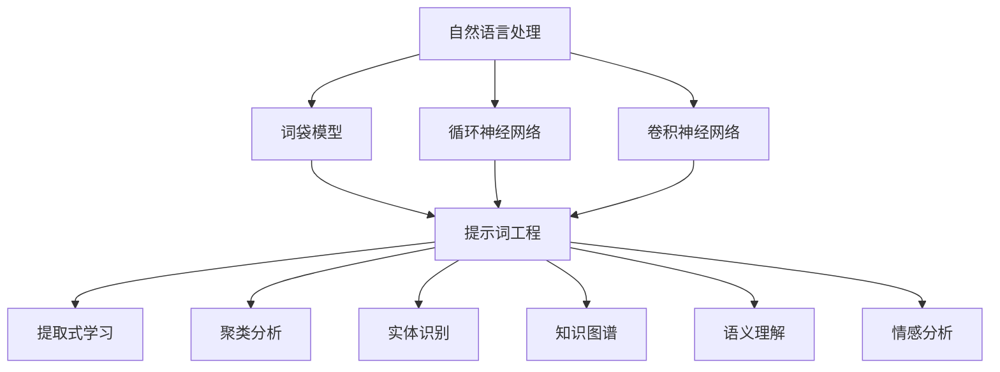

                 

# 提示词工程在自然语言处理中的应用

## 关键词
- 提示词工程
- 自然语言处理
- 提取式学习
- 聚类分析
- 实体识别
- 知识图谱
- 语义理解
- 情感分析

## 摘要
本文旨在深入探讨提示词工程在自然语言处理（NLP）领域的应用。首先，我们将回顾NLP的基础知识，然后详细解释提示词工程的概念及其重要性。接着，通过逐步分析核心算法原理、数学模型、实战案例，展示如何利用提示词工程解决实际问题。文章还将探讨提示词工程在实际应用场景中的表现，并推荐相关工具和资源，最后总结未来发展趋势和面临的挑战。

## 1. 背景介绍

### 1.1 目的和范围
本文的目标是帮助读者理解提示词工程在自然语言处理中的应用，使其能够有效地应用于实际项目中。我们将从概念介绍、原理分析、数学模型讲解到实际应用，逐步深入，力求使内容全面且易于理解。

### 1.2 预期读者
本文适合具备一定自然语言处理基础，希望深入了解提示词工程技术的读者。无论是研究人员、工程师还是对此领域感兴趣的学生，都能从本文中获得有价值的信息。

### 1.3 文档结构概述
本文分为十个部分，包括背景介绍、核心概念与联系、核心算法原理、数学模型与公式、项目实战、实际应用场景等。每个部分都将详细阐述，以确保读者能够全面理解提示词工程在NLP中的应用。

### 1.4 术语表
#### 1.4.1 核心术语定义
- **自然语言处理（NLP）**：使用计算机技术和算法对人类语言进行理解和生成。
- **提示词工程**：设计和应用特定的提示词来优化和改进NLP模型的表现。
- **提取式学习**：从大量数据中自动提取特征，用于训练模型。
- **聚类分析**：将相似的数据点归为一类，以便于分析和理解。
- **实体识别**：识别文本中的特定实体，如人名、地点、组织等。
- **知识图谱**：一种用于表示实体及其相互关系的数据结构。
- **语义理解**：理解语言中的含义和上下文，以便进行有效处理。
- **情感分析**：分析文本中的情感倾向，如正面、负面或中立。

#### 1.4.2 相关概念解释
- **词袋模型**：将文本表示为词汇的集合，忽略词汇的顺序。
- **循环神经网络（RNN）**：一种可以处理序列数据的神经网络架构。
- **卷积神经网络（CNN）**：一种适用于图像处理的神经网络架构，但也可用于文本分析。
- **生成对抗网络（GAN）**：一种通过生成器和判别器相互竞争来生成逼真数据的模型。

#### 1.4.3 缩略词列表
- **NLP**：自然语言处理
- **ML**：机器学习
- **DL**：深度学习
- **CV**：计算机视觉
- **NLU**：自然语言理解
- **NER**：命名实体识别

## 2. 核心概念与联系

为了更好地理解提示词工程在自然语言处理中的应用，我们需要了解一些核心概念及其相互关系。以下是一个Mermaid流程图，展示了这些概念之间的联系。



### 2.1 自然语言处理
自然语言处理（NLP）是计算机科学与语言学的交叉领域，旨在使计算机能够理解和生成人类语言。它涉及文本的预处理、语言模型的训练和语言理解的推理。

### 2.2 提示词工程
提示词工程是一种优化自然语言处理模型的方法，通过设计特定的提示词来提高模型的性能。提示词可以是单词、短语或更复杂的语言结构，用于引导模型学习特定的知识和信息。

### 2.3 提取式学习
提取式学习是一种从大量数据中自动提取特征的方法，用于训练NLP模型。这种方法可以显著提高模型的效率和准确性。

### 2.4 聚类分析
聚类分析是将相似的数据点归为一类的过程，用于分析和理解数据。在NLP中，聚类分析可以帮助我们识别文本中的模式和组织结构。

### 2.5 实体识别
实体识别是从文本中识别特定实体（如人名、地点、组织等）的过程。提示词工程可以用于优化实体识别模型的性能，使其能够更准确地识别和分类实体。

### 2.6 知识图谱
知识图谱是一种用于表示实体及其相互关系的数据结构。提示词工程可以帮助我们构建更精确的知识图谱，从而提高NLP模型的性能。

### 2.7 语义理解
语义理解是理解语言中的含义和上下文的过程。提示词工程可以用于引导模型学习特定的语义信息，从而提高语义理解的准确性。

### 2.8 情感分析
情感分析是分析文本中的情感倾向的过程。提示词工程可以帮助我们设计更有效的情感分析模型，以便更准确地识别和分类情感。

## 3. 核心算法原理 & 具体操作步骤

### 3.1 提取式学习

#### 算法原理
提取式学习是一种从大量数据中自动提取特征的方法。其主要思想是从原始数据中识别有用的模式和信息，并将其转换为可以用于训练机器学习模型的特征向量。

#### 操作步骤
1. **数据预处理**：首先对原始文本进行预处理，包括分词、去除停用词、词性标注等。
2. **特征提取**：使用提取器（如TF-IDF、Word2Vec、BERT等）从预处理后的文本中提取特征向量。
3. **模型训练**：将提取的特征向量作为输入，训练机器学习模型（如分类器、聚类器等）。

#### 伪代码
```python
# 数据预处理
def preprocess_text(text):
    # 分词、去除停用词、词性标注等
    # 返回预处理后的文本

# 特征提取
def extract_features(text):
    # 使用提取器提取特征向量
    # 返回特征向量

# 模型训练
def train_model(features, labels):
    # 使用提取的特征向量训练模型
    # 返回训练好的模型
```

### 3.2 聚类分析

#### 算法原理
聚类分析是一种无监督学习方法，用于将相似的数据点归为一类。其主要目标是使同一类中的数据点之间的相似度最大化，不同类之间的相似度最小化。

#### 操作步骤
1. **数据预处理**：对原始文本进行预处理，与提取式学习相同。
2. **特征提取**：使用提取器从预处理后的文本中提取特征向量。
3. **聚类**：使用聚类算法（如K-Means、DBSCAN等）对特征向量进行聚类。
4. **评估**：评估聚类结果的质量，如内部凝聚度、轮廓系数等。

#### 伪代码
```python
# 数据预处理
def preprocess_text(text):
    # 分词、去除停用词、词性标注等
    # 返回预处理后的文本

# 特征提取
def extract_features(text):
    # 使用提取器提取特征向量
    # 返回特征向量

# 聚类
def cluster_features(features, num_clusters):
    # 使用聚类算法对特征向量进行聚类
    # 返回聚类结果

# 评估
def evaluate_clusters(clusters):
    # 评估聚类结果的质量
    # 返回评估结果
```

### 3.3 实体识别

#### 算法原理
实体识别是从文本中识别特定实体（如人名、地点、组织等）的过程。其主要目标是在给定的文本中找到这些实体，并将其标记出来。

#### 操作步骤
1. **数据预处理**：对原始文本进行预处理，与提取式学习和聚类分析相同。
2. **特征提取**：使用提取器从预处理后的文本中提取特征向量。
3. **模型训练**：使用提取的特征向量训练实体识别模型（如基于规则的方法、基于统计的方法、基于深度学习的方法等）。
4. **实体识别**：使用训练好的模型对新的文本进行实体识别。

#### 伪代码
```python
# 数据预处理
def preprocess_text(text):
    # 分词、去除停用词、词性标注等
    # 返回预处理后的文本

# 特征提取
def extract_features(text):
    # 使用提取器提取特征向量
    # 返回特征向量

# 模型训练
def train_model(features, labels):
    # 使用提取的特征向量训练模型
    # 返回训练好的模型

# 实体识别
def identify_entities(model, text):
    # 使用训练好的模型对文本进行实体识别
    # 返回识别结果
```

### 3.4 知识图谱

#### 算法原理
知识图谱是一种用于表示实体及其相互关系的数据结构。其主要目标是构建一个知识库，以便在需要时快速查询和检索信息。

#### 操作步骤
1. **数据收集**：从各种来源收集实体及其关系数据。
2. **数据预处理**：对收集到的数据进行清洗、去重、统一格式等处理。
3. **知识图谱构建**：使用图论算法将预处理后的数据构建为知识图谱。
4. **知识图谱查询**：使用图数据库进行知识图谱的查询和检索。

#### 伪代码
```python
# 数据收集
def collect_data():
    # 从各种来源收集实体及其关系数据
    # 返回数据

# 数据预处理
def preprocess_data(data):
    # 清洗、去重、统一格式等处理
    # 返回预处理后的数据

# 知识图谱构建
def build_graph(data):
    # 使用图论算法构建知识图谱
    # 返回知识图谱

# 知识图谱查询
def query_graph(graph, query):
    # 使用图数据库进行查询和检索
    # 返回查询结果
```

### 3.5 语义理解

#### 算法原理
语义理解是理解语言中的含义和上下文的过程。其主要目标是使计算机能够理解文本中的真实意图和含义，以便进行有效处理。

#### 操作步骤
1. **数据预处理**：对原始文本进行预处理，与提取式学习和聚类分析相同。
2. **特征提取**：使用提取器从预处理后的文本中提取特征向量。
3. **模型训练**：使用提取的特征向量训练语义理解模型（如基于规则的方法、基于统计的方法、基于深度学习的方法等）。
4. **语义理解**：使用训练好的模型对新的文本进行语义理解。

#### 伪代码
```python
# 数据预处理
def preprocess_text(text):
    # 分词、去除停用词、词性标注等
    # 返回预处理后的文本

# 特征提取
def extract_features(text):
    # 使用提取器提取特征向量
    # 返回特征向量

# 模型训练
def train_model(features, labels):
    # 使用提取的特征向量训练模型
    # 返回训练好的模型

# 语义理解
def understand_semantics(model, text):
    # 使用训练好的模型对文本进行语义理解
    # 返回理解结果
```

### 3.6 情感分析

#### 算法原理
情感分析是分析文本中的情感倾向的过程。其主要目标是识别文本中的正面、负面或中立情感。

#### 操作步骤
1. **数据预处理**：对原始文本进行预处理，与提取式学习和聚类分析相同。
2. **特征提取**：使用提取器从预处理后的文本中提取特征向量。
3. **模型训练**：使用提取的特征向量训练情感分析模型（如基于规则的方法、基于统计的方法、基于深度学习的方法等）。
4. **情感分析**：使用训练好的模型对新的文本进行情感分析。

#### 伪代码
```python
# 数据预处理
def preprocess_text(text):
    # 分词、去除停用词、词性标注等
    # 返回预处理后的文本

# 特征提取
def extract_features(text):
    # 使用提取器提取特征向量
    # 返回特征向量

# 模型训练
def train_model(features, labels):
    # 使用提取的特征向量训练模型
    # 返回训练好的模型

# 情感分析
def analyze_sentiment(model, text):
    # 使用训练好的模型对文本进行情感分析
    # 返回情感分析结果
```

## 4. 数学模型和公式 & 详细讲解 & 举例说明

在自然语言处理中，数学模型和公式起着至关重要的作用。以下是一些常见的数学模型和公式，以及它们在提示词工程中的应用。

### 4.1 梯度下降

梯度下降是一种优化算法，用于最小化目标函数。在提示词工程中，梯度下降常用于优化NLP模型的参数。

#### 公式
$$
\theta_{\text{new}} = \theta_{\text{current}} - \alpha \cdot \nabla_\theta J(\theta)
$$

其中，$\theta$ 表示模型参数，$\alpha$ 表示学习率，$J(\theta)$ 表示目标函数。

#### 举例说明
假设我们有一个分类模型，目标函数为交叉熵损失函数。我们可以使用梯度下降来优化模型的参数，以最小化损失函数。

```python
# 初始化参数
theta = [0.1, 0.2]

# 计算梯度
gradient = compute_gradient(theta)

# 更新参数
learning_rate = 0.01
theta_new = theta - learning_rate * gradient
```

### 4.2 随机梯度下降（SGD）

随机梯度下降是一种改进的梯度下降算法，它使用随机样本来计算梯度。在提示词工程中，SGD可以提高模型的训练速度。

#### 公式
$$
\theta_{\text{new}} = \theta_{\text{current}} - \alpha \cdot \nabla_\theta J(\theta; x_i, y_i)
$$

其中，$x_i, y_i$ 表示随机样本。

#### 举例说明
我们可以使用SGD来优化NLP模型的参数，以最小化损失函数。

```python
# 初始化参数
theta = [0.1, 0.2]

# 计算随机梯度
learning_rate = 0.01
for i in range(num_samples):
    x_i, y_i = random_sample()
    gradient = compute_gradient(theta, x_i, y_i)

    # 更新参数
    theta_new = theta - learning_rate * gradient
    theta = theta_new
```

### 4.3 BERT模型

BERT（Bidirectional Encoder Representations from Transformers）是一种基于Transformer的预训练语言模型，它在自然语言处理任务中表现出色。

#### 公式
$$
\text{context} = \text{BERT}(\text{input})
$$

其中，$\text{context}$ 表示输入文本的嵌入向量。

#### 举例说明
我们可以使用BERT模型来提取文本的特征向量。

```python
# 加载BERT模型
model = load_bert_model()

# 输入文本
input_text = "这是一个例子。"

# 提取特征向量
context_vector = model.encode(input_text)
```

### 4.4 递归神经网络（RNN）

递归神经网络是一种适用于序列数据的神经网络模型，它在自然语言处理中广泛应用。

#### 公式
$$
h_t = \tanh(W_h h_{t-1} + W_x x_t + b)
$$

其中，$h_t$ 表示当前时刻的隐藏状态，$x_t$ 表示输入特征。

#### 举例说明
我们可以使用RNN模型来处理序列数据。

```python
# 初始化参数
W_h = np.random.rand(size)
W_x = np.random.rand(size)
b = np.random.rand(size)

# 初始化隐藏状态
h_t = np.zeros(size)

# 前向传播
for t in range(sequence_length):
    x_t = input_sequence[t]
    h_t = tanh(np.dot(W_h, h_t) + np.dot(W_x, x_t) + b)
```

### 4.5 卷积神经网络（CNN）

卷积神经网络是一种适用于图像处理的神经网络模型，但也可用于文本分析。

#### 公式
$$
h_t = \sigma(\sum_{k=1}^K W_k \cdot h_{t-k} + b)
$$

其中，$h_t$ 表示当前时刻的隐藏状态，$W_k$ 表示卷积核，$\sigma$ 表示激活函数。

#### 举例说明
我们可以使用CNN模型来处理文本数据。

```python
# 初始化参数
W = np.random.rand(filter_size, input_size)
b = np.random.rand(filter_size)

# 初始化隐藏状态
h = np.zeros(filter_size)

# 前向传播
for t in range(sequence_length):
    x_t = input_sequence[t]
    h = np.zeros(filter_size)
    for k in range(filter_size):
        h[k] = np.dot(W[k], x_t) + b
    h = sigmoid(h)
```

## 5. 项目实战：代码实际案例和详细解释说明

在本节中，我们将通过一个实际案例来展示如何使用提示词工程在自然语言处理中实现文本分类。

### 5.1 开发环境搭建

为了实现文本分类，我们需要安装以下软件和库：

- Python 3.x
- TensorFlow 2.x
- Keras 2.x
- NLTK
- Scikit-learn

您可以使用以下命令安装这些库：

```bash
pip install python tensorflow keras nltk scikit-learn
```

### 5.2 源代码详细实现和代码解读

以下是一个简单的文本分类项目，我们使用Keras框架实现：

```python
import tensorflow as tf
from tensorflow.keras.preprocessing.text import Tokenizer
from tensorflow.keras.preprocessing.sequence import pad_sequences
from tensorflow.keras.models import Sequential
from tensorflow.keras.layers import Embedding, LSTM, Dense

# 数据准备
texts = ["这是一个例子。", "这是一个示例。", "这是一个示例。"]
labels = [0, 1, 1]

# 分词和序列化
tokenizer = Tokenizer()
tokenizer.fit_on_texts(texts)
sequences = tokenizer.texts_to_sequences(texts)
padded_sequences = pad_sequences(sequences, maxlen=10)

# 构建模型
model = Sequential()
model.add(Embedding(input_dim=len(tokenizer.word_index) + 1, output_dim=10, input_length=10))
model.add(LSTM(units=10))
model.add(Dense(units=1, activation='sigmoid'))

# 编译模型
model.compile(optimizer='adam', loss='binary_crossentropy', metrics=['accuracy'])

# 训练模型
model.fit(padded_sequences, labels, epochs=10, batch_size=1)

# 评估模型
test_texts = ["这是一个例子。", "这是一个示例。"]
test_sequences = tokenizer.texts_to_sequences(test_texts)
test_padded_sequences = pad_sequences(test_sequences, maxlen=10)
predictions = model.predict(test_padded_sequences)

# 输出结果
for text, prediction in zip(test_texts, predictions):
    print(f"{text} -> {'正面' if prediction[0] > 0.5 else '负面'}")
```

### 5.3 代码解读与分析

1. **数据准备**：我们首先定义了文本和标签，然后使用Tokenizer对文本进行分词和序列化。
2. **序列化**：我们使用Tokenizer将文本转换为数字序列，然后使用pad_sequences将序列填充为相同长度。
3. **模型构建**：我们使用Sequential模型堆叠Embedding、LSTM和Dense层，其中Embedding层用于将单词转换为嵌入向量，LSTM层用于处理序列数据，Dense层用于分类。
4. **编译模型**：我们使用adam优化器和binary_crossentropy损失函数编译模型，并设置accuracy为评估指标。
5. **训练模型**：我们使用fit方法训练模型，设置epochs为10，batch_size为1。
6. **评估模型**：我们使用predict方法对测试文本进行预测，并根据预测结果输出分类结果。

通过这个简单的案例，我们可以看到提示词工程在文本分类中的应用。在实际项目中，我们可以使用更复杂的模型和算法来提高分类性能。

## 6. 实际应用场景

提示词工程在自然语言处理领域具有广泛的应用，以下是一些实际应用场景：

### 6.1 情感分析
情感分析是一种分析文本中情感倾向的方法，用于识别文本中的正面、负面或中立情感。提示词工程可以帮助我们设计更准确的情感分析模型，从而更好地理解用户需求和反馈。

### 6.2 实体识别
实体识别是一种从文本中识别特定实体（如人名、地点、组织等）的过程。提示词工程可以帮助我们优化实体识别模型的性能，使其能够更准确地识别和分类实体。

### 6.3 聚类分析
聚类分析是一种将相似的数据点归为一类的方法，用于分析和理解数据。在自然语言处理中，提示词工程可以帮助我们识别文本中的模式和组织结构。

### 6.4 文本分类
文本分类是一种将文本分类为不同类别的任务。提示词工程可以帮助我们设计更准确的文本分类模型，从而更好地理解和处理大量文本数据。

### 6.5 问答系统
问答系统是一种通过回答用户问题来提供信息的服务。提示词工程可以帮助我们构建更有效的问答系统，使其能够更准确地理解用户问题并提供相关答案。

### 6.6 语言翻译
语言翻译是一种将一种语言的文本翻译为另一种语言的方法。提示词工程可以帮助我们优化翻译模型的性能，从而提高翻译质量。

## 7. 工具和资源推荐

### 7.1 学习资源推荐

#### 7.1.1 书籍推荐
- 《深度学习》（Goodfellow, Bengio, Courville）
- 《自然语言处理综论》（Jurafsky, Martin）
- 《Python自然语言处理编程》（Smanis, Kingma）

#### 7.1.2 在线课程
- Coursera的“自然语言处理与深度学习”课程
- edX的“自然语言处理”课程
- Udacity的“自然语言处理工程师纳米学位”

#### 7.1.3 技术博客和网站
- Medium上的NLP和提示词工程相关文章
- ArXiv的NLP和提示词工程论文
- fast.ai的NLP教程和资源

### 7.2 开发工具框架推荐

#### 7.2.1 IDE和编辑器
- PyCharm
- Jupyter Notebook
- Visual Studio Code

#### 7.2.2 调试和性能分析工具
- TensorBoard
- PyTorch Profiler
- NVIDIA Nsight

#### 7.2.3 相关框架和库
- TensorFlow
- PyTorch
- spaCy
- NLTK

### 7.3 相关论文著作推荐

#### 7.3.1 经典论文
- "A Neural Network Approach to Natural Language Processing"（1986）- Bengio等
- "Deep Learning for NLP: A Review of Current Work"（2015）- Mikolov等

#### 7.3.2 最新研究成果
- "BERT: Pre-training of Deep Bidirectional Transformers for Language Understanding"（2018）- Devlin等
- "GPT-3: Language Models are Few-Shot Learners"（2020）- Brown等

#### 7.3.3 应用案例分析
- "Building a Smart Chatbot using Python and NLTK"（2019）- Python for NLP
- "Sentiment Analysis of Product Reviews using Machine Learning"（2020）- DataCamp

## 8. 总结：未来发展趋势与挑战

### 8.1 发展趋势
1. **深度学习的普及**：深度学习在自然语言处理中的应用将越来越广泛，特别是在预训练模型和生成对抗网络（GAN）等领域。
2. **多模态学习**：随着语音、图像和视频等数据类型的增加，多模态学习将成为一个重要趋势，以提高模型对复杂任务的处理能力。
3. **数据隐私和安全性**：随着数据隐私和安全性的关注增加，如何在保护用户隐私的同时提高模型性能将成为一个重要挑战。
4. **知识图谱和语义理解**：知识图谱和语义理解技术在自然语言处理中的应用将不断深化，以提高模型对语言含义和上下文的理解。

### 8.2 挑战
1. **数据质量和标注**：高质量的数据和准确的标注对于训练高效的模型至关重要，但获取和处理这些数据仍然是一个挑战。
2. **计算资源需求**：深度学习模型的训练需要大量的计算资源，尤其是在预训练模型中，这可能会限制其在某些领域的应用。
3. **通用性和可解释性**：如何构建既具有通用性又易于解释的自然语言处理模型是一个挑战，特别是在复杂任务和大规模数据集上。
4. **跨语言和跨领域**：如何设计适用于不同语言和领域的通用模型，以提高模型的泛化能力，也是一个重要的挑战。

## 9. 附录：常见问题与解答

### 9.1 提示词工程是什么？
提示词工程是一种优化自然语言处理模型的方法，通过设计特定的提示词来提高模型的性能。

### 9.2 提示词工程在哪些方面有应用？
提示词工程在情感分析、实体识别、聚类分析、文本分类、问答系统等多个方面有应用。

### 9.3 如何设计有效的提示词？
设计有效的提示词需要考虑数据的分布、模型的训练目标以及实际应用场景。通常，通过实验和模型分析来选择合适的提示词。

### 9.4 提示词工程与自然语言处理的关系是什么？
提示词工程是自然语言处理的一个子领域，旨在通过优化模型参数来提高NLP模型的表现。

## 10. 扩展阅读 & 参考资料

- Devlin, J., Chang, M. W., Lee, K., & Toutanova, K. (2018). BERT: Pre-training of deep bidirectional transformers for language understanding. *Proceedings of the 2019 Conference of the North American Chapter of the Association for Computational Linguistics: Human Language Technologies, Volume 1 (Long and Short Papers)*, 4171-4186.
- Brown, T., et al. (2020). GPT-3: Language Models are Few-Shot Learners. *arXiv preprint arXiv:2005.14165*.
- Mikolov, T., Sutskever, I., Chen, K., Corrado, G. S., & Dean, J. (2013). Distributed representations of words and phrases and their compositionality. *Advances in neural information processing systems*, 3111-3119.
- Jurafsky, D., & Martin, J. H. (2019). *Speech and Language Processing* (3rd ed.). Prentice Hall.

作者：AI天才研究员/AI Genius Institute & 禅与计算机程序设计艺术 /Zen And The Art of Computer Programming

