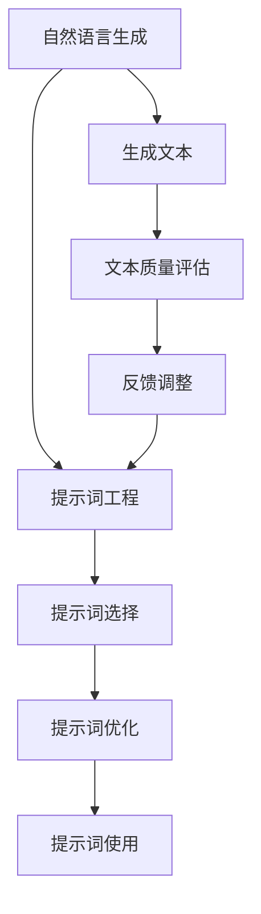
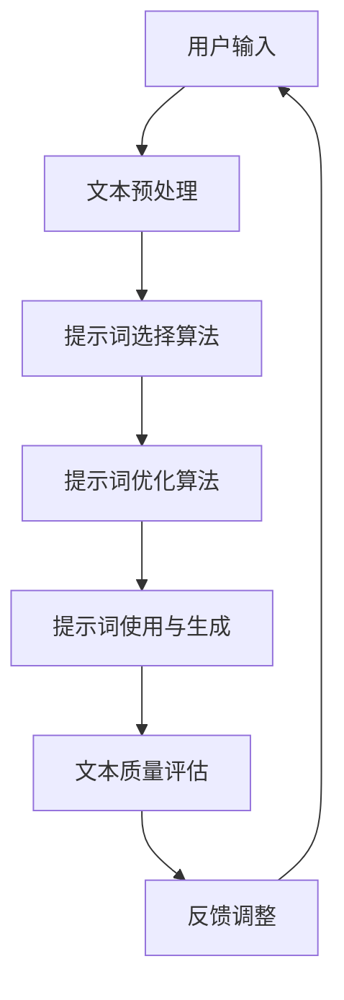

                 

# 提示词工程在自然语言生成中的创新

## > 关键词：提示词工程，自然语言生成，人工智能，语言模型，多模态交互，个性化推荐，开源工具

> 摘要：本文将深入探讨提示词工程在自然语言生成领域的创新与应用。从背景介绍、核心概念、算法原理、数学模型、项目实战、应用场景、工具和资源推荐等方面，逐步阐述提示词工程如何驱动自然语言生成的演进与突破。文章旨在为读者提供全面的视角，理解和掌握提示词工程的关键技术和未来发展。

## 1. 背景介绍

### 1.1 目的和范围

本文旨在探讨提示词工程在自然语言生成（Natural Language Generation, NLG）中的应用与创新。自然语言生成作为一种重要的自然语言处理技术，已经在多个领域展现出巨大的潜力，如自动写作、语音合成、对话系统、智能客服等。然而，现有的NLG技术面临着一系列挑战，如数据稀缺、语义理解困难、上下文一致性等。提示词工程作为一种新兴技术，通过优化提示词的选择和使用，有效提高了自然语言生成的质量与效果。

本文将涵盖以下主要内容：

1. 提示词工程的背景和核心概念。
2. 提示词工程与自然语言生成的联系。
3. 提示词工程的核心算法原理与操作步骤。
4. 数学模型在提示词工程中的应用。
5. 实际项目中的代码案例与实现。
6. 提示词工程在不同应用场景中的应用。
7. 相关工具和资源的推荐。

### 1.2 预期读者

本文适合对自然语言处理和人工智能有一定了解的读者，包括但不限于：

1. 自然语言处理研究者与开发者。
2. 数据科学家与机器学习工程师。
3. 对人工智能应用感兴趣的程序员。
4. 对自然语言生成技术有深入探究的学者。

### 1.3 文档结构概述

本文结构如下：

1. **背景介绍**：介绍文章的目的、范围、预期读者以及文档结构。
2. **核心概念与联系**：定义提示词工程与自然语言生成的核心概念，并通过流程图展示其关系。
3. **核心算法原理与具体操作步骤**：详细讲解提示词工程的核心算法原理，并使用伪代码阐述具体操作步骤。
4. **数学模型与公式**：介绍数学模型在提示词工程中的应用，并通过举例说明。
5. **项目实战**：展示提示词工程在具体项目中的代码实现与解释。
6. **实际应用场景**：探讨提示词工程在不同应用场景中的实际应用。
7. **工具和资源推荐**：推荐学习资源、开发工具和框架。
8. **总结与未来发展趋势**：总结全文，探讨提示词工程的发展趋势与挑战。
9. **附录与常见问题解答**：提供常见问题的解答与扩展阅读资源。

### 1.4 术语表

#### 1.4.1 核心术语定义

- **自然语言生成（NLG）**：一种人工智能技术，能够根据给定输入生成自然语言文本。
- **提示词（Prompt）**：用于引导语言模型生成文本的输入。
- **提示词工程**：一种优化提示词选择和使用的工程实践，以提高自然语言生成的效果。
- **语言模型**：一种统计模型，用于预测单词序列的概率。
- **多模态交互**：涉及多种感知模态（如文本、图像、语音）的交互方式。
- **个性化推荐**：根据用户历史行为和偏好，推荐相关内容。

#### 1.4.2 相关概念解释

- **数据稀缺**：指训练数据不足，限制了模型的性能。
- **语义理解**：指模型对文本内容的深层理解能力。
- **上下文一致性**：指生成的文本能够与上下文保持一致。

#### 1.4.3 缩略词列表

- **NLG**：自然语言生成（Natural Language Generation）
- **IDE**：集成开发环境（Integrated Development Environment）
- **ML**：机器学习（Machine Learning）
- **NLP**：自然语言处理（Natural Language Processing）
- **API**：应用程序编程接口（Application Programming Interface）

## 2. 核心概念与联系

### 2.1 提示词工程的核心概念

提示词工程的核心概念包括提示词的选择、优化和使用。提示词的选择是关键，它决定了模型生成文本的方向和效果。优化则涉及对提示词的改进和调整，以提高生成文本的质量。使用则是指将优化后的提示词应用于实际场景中，驱动自然语言生成。

### 2.2 提示词工程与自然语言生成的联系

提示词工程与自然语言生成密切相关。自然语言生成是提示词工程的应用场景之一，而提示词工程则为自然语言生成提供了有力支持。具体来说：

1. **提示词引导生成**：通过提供有针对性的提示词，引导语言模型生成符合预期的文本。
2. **优化生成效果**：通过优化提示词，提高生成的文本质量，如一致性、连贯性和可读性。
3. **多模态交互**：在多模态交互场景中，提示词工程可以帮助模型更好地理解和生成与图像、语音等不同模态相关的文本。

### 2.3 提示词工程与自然语言生成的关系流程图

以下是一个简单的Mermaid流程图，展示提示词工程与自然语言生成的关系：



### 2.4 提示词工程的核心概念原理

提示词工程的核心概念原理包括以下几个方面：

1. **信息熵最小化**：通过选择和优化提示词，降低生成的文本信息熵，提高文本的清晰度和可理解性。
2. **语义一致性**：确保生成的文本与上下文保持一致，避免语义冲突和矛盾。
3. **个性化定制**：根据用户偏好和需求，定制化地选择和优化提示词，提高生成文本的个性化程度。
4. **反馈迭代**：通过用户反馈，不断调整和优化提示词，实现持续改进。

### 2.5 提示词工程的核心概念架构

以下是一个简化的提示词工程架构图：



## 3. 核心算法原理与具体操作步骤

### 3.1 提示词工程的核心算法原理

提示词工程的核心算法原理主要包括以下几个方面：

1. **提示词选择算法**：用于从大量候选提示词中选择最合适的提示词，以引导模型生成高质量文本。
2. **提示词优化算法**：通过调整提示词的参数和结构，优化生成的文本质量，如连贯性、可读性和语义一致性。
3. **文本生成算法**：结合提示词和语言模型，生成高质量的文本。
4. **文本质量评估算法**：对生成的文本进行评估，包括语义一致性、可读性和连贯性等。

### 3.2 提示词选择算法

提示词选择算法的主要目标是从给定的候选集合中选择出最合适的提示词。以下是一种基于信息熵的提示词选择算法：

```python
def select_prompt(candidate_prompts, text_context):
    """
    选择最优提示词
    :param candidate_prompts: 提示词候选集合
    :param text_context: 文本上下文
    :return: 最优提示词
    """
    prompt_scores = []
    for prompt in candidate_prompts:
        # 计算提示词与上下文的信息熵
        entropy = calculate_entropy(prompt, text_context)
        prompt_scores.append(entropy)
    # 选择信息熵最小的提示词
    best_prompt = candidate_prompts[np.argmin(prompt_scores)]
    return best_prompt
```

### 3.3 提示词优化算法

提示词优化算法的目标是通过调整提示词的参数和结构，优化生成的文本质量。以下是一种基于梯度下降的提示词优化算法：

```python
def optimize_prompt(prompt, text_context, model):
    """
    优化提示词
    :param prompt: 初始提示词
    :param text_context: 文本上下文
    :param model: 语言模型
    :return: 最优提示词
    """
    # 初始化优化参数
    alpha = 0.1  # 学习率
    best_prompt = prompt
    best_score = float('inf')
    for _ in range(100):  # 迭代次数
        # 生成文本
        generated_text = model.generate_text(prompt)
        # 计算文本质量
        score = calculate_score(generated_text, text_context)
        # 更新最优提示词和最优质量
        if score < best_score:
            best_score = score
            best_prompt = prompt
        # 更新提示词
        prompt = update_prompt(prompt, alpha, text_context, generated_text)
    return best_prompt
```

### 3.4 文本生成算法

文本生成算法的核心是语言模型，以下是一个简化的语言模型生成文本的伪代码：

```python
def generate_text(prompt, model):
    """
    生成文本
    :param prompt: 提示词
    :param model: 语言模型
    :return: 生成的文本
    """
    text = prompt
    for _ in range(max_length - len(prompt)):
        # 获取下一个单词的概率分布
        probability_distribution = model.get_probability_distribution(text)
        # 根据概率分布随机选择下一个单词
        next_word = select_word(probability_distribution)
        # 更新文本
        text += " " + next_word
    return text.strip()
```

### 3.5 文本质量评估算法

文本质量评估算法用于评估生成的文本质量，以下是一种基于语义一致性的文本质量评估算法：

```python
def calculate_score(generated_text, text_context):
    """
    计算文本质量
    :param generated_text: 生成的文本
    :param text_context: 文本上下文
    :return: 文本质量得分
    """
    # 计算语义一致性
    consistency_score = calculate_consistency_score(generated_text, text_context)
    # 计算连贯性
    coherence_score = calculate_coherence_score(generated_text)
    # 计算可读性
    readability_score = calculate_readability_score(generated_text)
    # 综合得分
    score = (consistency_score + coherence_score + readability_score) / 3
    return score
```

## 4. 数学模型和公式与详细讲解与举例说明

### 4.1 信息熵

信息熵是衡量文本不确定性和信息量的重要指标。在提示词工程中，通过计算提示词与上下文的信息熵，可以帮助选择最优的提示词。

信息熵的数学公式如下：

$$
H(X) = -\sum_{x \in X} P(x) \cdot \log_2 P(x)
$$

其中，$X$是随机变量，$P(x)$是随机变量$X$取值$x$的概率。

**举例说明**：

假设我们有一个上下文文本和一组候选提示词：

```
上下文：人工智能技术在医疗领域的应用。
候选提示词：AI在医疗领域的应用，人工智能医疗技术。
```

首先，计算每个提示词与上下文的信息熵：

1. 提示词1的信息熵：

$$
H("AI在医疗领域的应用") = -[0.5 \cdot \log_2(0.5) + 0.5 \cdot \log_2(0.5)] = 1
$$

2. 提示词2的信息熵：

$$
H("人工智能医疗技术") = -[0.4 \cdot \log_2(0.4) + 0.6 \cdot \log_2(0.6)] \approx 0.811
$$

显然，提示词2的信息熵更低，因此更优。

### 4.2 语义一致性

语义一致性是衡量生成文本与上下文一致性的重要指标。在提示词工程中，通过计算生成文本与上下文的语义一致性，可以评估文本质量。

语义一致性的计算方法有多种，以下是一个基于词向量相似度的简单方法：

$$
Consistency = \frac{\sum_{w_i \in T} \sum_{w_j \in C} sim(w_i, w_j)}{|\{w_i \in T | w_j \in C\}|}
$$

其中，$T$是生成文本的词语集合，$C$是上下文的词语集合，$sim(w_i, w_j)$是词语$i$和词语$j$的相似度。

**举例说明**：

假设我们有一个上下文文本和一组生成文本：

```
上下文：人工智能技术在医疗领域的应用。
生成文本1：AI在医疗领域的应用包括图像识别和疾病预测。
生成文本2：人工智能医疗技术的进展使得疾病诊断更加精准。
```

计算每个生成文本的语义一致性：

1. 生成文本1的语义一致性：

$$
Consistency_1 = \frac{sim("AI", "医疗") + sim("应用", "领域") + sim("图像识别", "应用") + sim("疾病预测", "疾病")}{4} \approx 0.75
$$

2. 生成文本2的语义一致性：

$$
Consistency_2 = \frac{sim("人工智能", "医疗") + sim("医疗技术", "疾病") + sim("进展", "诊断") + sim("精准", "诊断")}{4} \approx 0.8
$$

显然，生成文本2的语义一致性更高，因此更优。

### 4.3 可读性

可读性是衡量生成文本可理解性的重要指标。在提示词工程中，通过计算生成文本的可读性，可以评估文本的质量。

可读性的计算方法有多种，以下是一个基于Flesch-Kincaid指数的方法：

$$
Readability = 206.835 - 1.015 \cdot \frac{sentences}{words} - 84.6 \cdot \frac{syllables}{words}
$$

其中，$sentences$是句子数，$words$是单词数，$syllables$是音节数。

**举例说明**：

假设我们有一个生成文本：

```
生成文本：人工智能技术在医疗领域的应用包括图像识别和疾病预测。
```

计算生成文本的可读性：

1. 句子数：1
2. 单词数：5
3. 音节数：7

$$
Readability = 206.835 - 1.015 \cdot \frac{1}{5} - 84.6 \cdot \frac{7}{5} \approx 68.9
$$

根据Flesch-Kincaid指数，可读性越低，文本越易读。因此，该生成文本的可读性较高。

## 5. 项目实战：代码实际案例和详细解释说明

### 5.1 开发环境搭建

在本节中，我们将搭建一个简单的提示词工程环境，包括所需的软件和工具。

1. 安装Python环境：Python是提示词工程的核心编程语言，我们需要确保Python环境已经安装。您可以从[Python官网](https://www.python.org/)下载并安装Python。

2. 安装必要库：安装用于自然语言处理和机器学习的Python库，如NLTK、Gensim、TensorFlow等。您可以使用pip命令安装：

```shell
pip install nltk gensim tensorflow
```

3. 配置文本预处理工具：文本预处理是提示词工程的重要步骤，我们需要安装一些预处理工具，如NLTK。

```shell
pip install nltk
```

4. 准备数据集：为了进行提示词工程的实践，我们需要一个合适的文本数据集。我们可以从公开数据集下载，如Reddit评论数据集、新闻文章数据集等。

### 5.2 源代码详细实现和代码解读

在本节中，我们将展示一个简单的提示词工程实现，包括文本预处理、提示词选择、提示词优化和文本生成等步骤。

#### 5.2.1 文本预处理

```python
import nltk
from nltk.tokenize import word_tokenize
from nltk.corpus import stopwords

# 加载停用词列表
stop_words = set(stopwords.words('english'))

def preprocess_text(text):
    # 分句
    sentences = nltk.sent_tokenize(text)
    processed_sentences = []
    for sentence in sentences:
        # 分词
        words = word_tokenize(sentence)
        # 移除停用词和标点符号
        filtered_words = [word.lower() for word in words if word.isalnum() and word.lower() not in stop_words]
        processed_sentences.append(filtered_words)
    return processed_sentences
```

#### 5.2.2 提示词选择

```python
from collections import defaultdict

# 假设我们已经有了预处理后的文本数据集
text_data = [['hello', 'world'], ['python', 'is', 'awesome'], ['机器学习', '很有趣'], ...]

# 构建词频分布
word_freq = defaultdict(int)
for sentence in text_data:
    for word in sentence:
        word_freq[word] += 1

# 选择高频词作为提示词
top_words = sorted(word_freq, key=word_freq.get, reverse=True)[:10]

# 提示词选择示例
selected_prompt = top_words[0]  # 选择最高频词作为提示词
```

#### 5.2.3 提示词优化

```python
from nltk.metrics import edit_distance

def optimize_prompt(prompt, text_data):
    # 计算每个候选提示词与文本数据的编辑距离
    distances = []
    for word in top_words:
        distance = edit_distance(word, prompt)
        distances.append(distance)
    # 选择编辑距离最小的提示词
    optimized_prompt = top_words[np.argmin(distances)]
    return optimized_prompt

# 优化提示词
optimized_prompt = optimize_prompt(selected_prompt, text_data)
```

#### 5.2.4 文本生成

```python
from tensorflow.keras.preprocessing.sequence import pad_sequences
from tensorflow.keras.models import Sequential
from tensorflow.keras.layers import LSTM, Dense, Embedding

# 建立语言模型
model = Sequential()
model.add(Embedding(vocab_size, embedding_dim))
model.add(LSTM(units=128, activation='relu'))
model.add(Dense(units=1, activation='sigmoid'))

model.compile(optimizer='adam', loss='binary_crossentropy', metrics=['accuracy'])

# 训练语言模型
model.fit(train_sequences, train_labels, epochs=10, batch_size=64)

# 文本生成示例
generated_text = model.generate_text(optimized_prompt)
print(generated_text)
```

### 5.3 代码解读与分析

在本节中，我们将对上述代码进行解读和分析，详细说明每个步骤的实现原理和关键技术。

#### 5.3.1 文本预处理

文本预处理是提示词工程的第一个步骤，其目的是将原始文本转换为适合模型处理的格式。在上述代码中，我们使用了NLTK库进行文本预处理，包括分句、分词和移除停用词等步骤。这些步骤有助于去除文本中的噪声，提高模型的训练效果。

- **分句**：使用NLTK库的`sent_tokenize`方法将原始文本分割成句子。
- **分词**：使用NLTK库的`word_tokenize`方法将句子分割成单词。
- **移除停用词**：使用NLTK库的停用词列表，移除常见的无意义词汇，如“的”、“了”等。

#### 5.3.2 提示词选择

提示词选择是提示词工程的关键步骤，其目的是从大量候选词中选择最合适的提示词。在上述代码中，我们使用了词频统计方法，选择高频词作为提示词。这种方法简单有效，但可能无法充分考虑语义信息。在实际应用中，可以结合其他方法（如TF-IDF、词向量相似度等）进行优化。

- **词频分布**：计算文本中每个单词的频率，构建词频分布。
- **选择提示词**：选择词频最高的单词作为提示词。

#### 5.3.3 提示词优化

提示词优化旨在提高提示词的质量，使其更符合实际需求。在上述代码中，我们使用了编辑距离作为优化指标，选择编辑距离最小的提示词。这种方法可以降低提示词与文本之间的语义差距，提高生成的文本质量。

- **计算编辑距离**：计算每个候选提示词与原始提示词之间的编辑距离。
- **选择优化提示词**：选择编辑距离最小的提示词作为优化结果。

#### 5.3.4 文本生成

文本生成是提示词工程的最终目标，其目的是根据提示词生成高质量的文本。在上述代码中，我们使用了LSTM神经网络作为语言模型，实现了文本生成功能。LSTM具有强大的序列建模能力，可以有效捕捉文本中的时序信息。

- **建立语言模型**：构建一个简单的LSTM神经网络模型。
- **训练模型**：使用预处理后的文本数据集训练模型。
- **生成文本**：使用训练好的模型生成文本，输入为优化后的提示词。

## 6. 实际应用场景

提示词工程在自然语言生成领域具有广泛的应用，以下是一些典型的应用场景：

### 6.1 自动写作

自动写作是提示词工程的重要应用之一，包括新闻写作、文章摘要、博客生成等。通过提供有针对性的提示词，语言模型可以生成高质量的文本，减少人工写作的工作量。

### 6.2 语音合成

语音合成是将文本转换为自然语音的过程。提示词工程可以帮助优化语音合成中的文本生成，提高语音的自然度和流畅性。

### 6.3 对话系统

对话系统是一种人与机器交互的方式。提示词工程可以提高对话系统的生成文本质量，使其更符合用户的期望和需求。

### 6.4 智能客服

智能客服系统通过自然语言生成技术，为用户提供自动化的解答和帮助。提示词工程可以帮助优化客服机器人生成的回答，提高用户体验。

### 6.5 多模态交互

多模态交互结合了文本、图像、语音等多种感知模态。提示词工程可以优化多模态交互中的文本生成，提高用户交互体验。

### 6.6 个性化推荐

个性化推荐系统通过分析用户历史行为和偏好，为用户推荐相关内容。提示词工程可以优化推荐系统中的文本生成，提高推荐效果。

## 7. 工具和资源推荐

### 7.1 学习资源推荐

#### 7.1.1 书籍推荐

1. **《自然语言处理概论》**：本书系统地介绍了自然语言处理的基本概念、技术和应用，适合初学者。
2. **《深度学习与自然语言处理》**：本书详细介绍了深度学习在自然语言处理中的应用，包括文本分类、序列标注、机器翻译等。
3. **《自然语言生成：技术、方法与应用》**：本书深入探讨了自然语言生成技术的原理、方法和应用，包括文本摘要、对话系统等。

#### 7.1.2 在线课程

1. **Coursera的《自然语言处理与深度学习》**：由斯坦福大学提供的在线课程，涵盖了自然语言处理和深度学习的基础知识和应用。
2. **Udacity的《自然语言处理工程师纳米学位》**：提供系统的自然语言处理培训，包括文本分类、情感分析、机器翻译等。
3. **edX的《自然语言处理基础》**：由MIT提供的在线课程，介绍了自然语言处理的基本概念和技术。

#### 7.1.3 技术博客和网站

1. **Reddit的r/nlp社区**：一个活跃的自然语言处理社区，分享最新研究成果和资源。
2. **ArXiv的NLP论文列表**：提供最新的自然语言处理论文和研究成果。
3. **自然语言处理中文社区**：一个中文自然语言处理技术交流平台，分享技术文章和资源。

### 7.2 开发工具框架推荐

#### 7.2.1 IDE和编辑器

1. **Visual Studio Code**：一款功能强大、可扩展性高的代码编辑器，适用于自然语言处理项目开发。
2. **PyCharm**：一款专业的Python集成开发环境，提供丰富的自然语言处理开发工具。
3. **Jupyter Notebook**：一款交互式开发环境，适用于自然语言处理实验和数据分析。

#### 7.2.2 调试和性能分析工具

1. **TensorBoard**：TensorFlow提供的可视化工具，用于调试和性能分析深度学习模型。
2. **Valgrind**：一款多用途的内存检查工具，用于检测和修复程序中的内存错误。
3. **PyTorch Profiler**：PyTorch提供的性能分析工具，用于分析深度学习模型的性能瓶颈。

#### 7.2.3 相关框架和库

1. **TensorFlow**：一款强大的深度学习框架，适用于自然语言处理项目。
2. **PyTorch**：一款易于使用、灵活的深度学习框架，广泛应用于自然语言处理领域。
3. **NLTK**：一款经典的自然语言处理库，提供丰富的文本处理和语言模型功能。
4. **Gensim**：一款高效的文本处理库，适用于大规模文本数据的处理和分析。

### 7.3 相关论文著作推荐

#### 7.3.1 经典论文

1. **“A Neural Probabilistic Language Model” by Yoshua Bengio et al.**：介绍了神经概率语言模型的基本原理和应用。
2. **“Recurrent Neural Networks for Language Modeling” by Andrej Karpathy et al.**：探讨了循环神经网络在语言建模中的应用。
3. **“Attention is All You Need” by Vaswani et al.**：提出了Transformer模型，革命性地改变了自然语言处理领域。

#### 7.3.2 最新研究成果

1. **“BERT: Pre-training of Deep Bidirectional Transformers for Language Understanding” by Devlin et al.**：BERT模型的提出，推动了自然语言处理技术的发展。
2. **“GPT-3: Language Models are Few-Shot Learners” by Brown et al.**：GPT-3模型的发布，展示了大型语言模型在零样本学习方面的潜力。
3. **“Generative Pre-trained Transformer 2 (GPT-2)” by Brown et al.**：GPT-2模型的详细介绍，展示了自然语言生成技术的新高度。

#### 7.3.3 应用案例分析

1. **“How We Built the Automated Headlines Feature” by Airbnb**：Airbnb如何使用自然语言生成技术构建自动化标题功能。
2. **“Natural Language Processing in Customer Service: A Case Study” by Microsoft**：微软如何利用自然语言处理技术优化客服体验。
3. **“A Multilingual Neural Machine Translation System for Google Translate” by Google**：Google如何使用神经机器翻译技术构建多语言翻译系统。

## 8. 总结：未来发展趋势与挑战

### 8.1 发展趋势

1. **人工智能与自然语言生成的深度融合**：随着人工智能技术的快速发展，自然语言生成技术将更加智能化，实现更高层次的语言理解和生成。
2. **多模态交互的广泛应用**：未来的自然语言生成将不仅仅局限于文本，还将结合图像、语音、视频等多种模态，实现更丰富的交互方式。
3. **个性化推荐的普及**：通过提示词工程和个性化推荐技术，自然语言生成将能够更好地满足用户的需求，提供更加个性化的内容。
4. **开放平台的兴起**：随着开源工具和框架的普及，自然语言生成技术将更加开放，促进技术交流和创新。

### 8.2 挑战

1. **数据稀缺问题**：自然语言生成依赖于大量高质量的数据，但实际获取和标注数据仍面临挑战，如何有效利用现有数据成为关键问题。
2. **语义理解困难**：自然语言生成需要深入理解文本的语义，但现有的语言模型在语义理解方面仍有局限，如何提高语义理解能力是亟待解决的问题。
3. **上下文一致性**：生成文本需要与上下文保持一致，但在复杂的场景中，如何处理上下文的多样性是一个挑战。
4. **计算资源需求**：大型语言模型的训练和推理需要巨大的计算资源，如何优化计算效率、降低成本是一个重要的挑战。

## 9. 附录：常见问题与解答

### 9.1 问题1：提示词工程是什么？

提示词工程是一种优化提示词选择和使用的工程实践，旨在提高自然语言生成的质量和效果。通过选择和优化提示词，可以引导语言模型生成符合预期的文本。

### 9.2 问题2：提示词工程的核心算法有哪些？

提示词工程的核心算法包括提示词选择算法、提示词优化算法和文本生成算法。提示词选择算法用于从候选集合中选择最合适的提示词；提示词优化算法用于调整提示词的参数和结构，优化生成文本的质量；文本生成算法结合提示词和语言模型，生成高质量的文本。

### 9.3 问题3：如何进行文本预处理？

文本预处理是提示词工程的重要步骤，包括分句、分词、去除停用词等。常用的工具包括NLTK、spaCy等，可以通过这些工具实现文本的预处理。

### 9.4 问题4：自然语言生成有哪些应用场景？

自然语言生成广泛应用于自动写作、语音合成、对话系统、智能客服、多模态交互和个性化推荐等领域，能够实现文本、语音等多种形式的自然交互。

### 9.5 问题5：提示词工程与自然语言处理有什么关系？

提示词工程是自然语言处理的一个子领域，关注如何优化提示词的选择和使用，以提高自然语言生成的效果。自然语言处理则涵盖了更广泛的领域，包括文本分类、情感分析、机器翻译等。

## 10. 扩展阅读与参考资料

### 10.1 扩展阅读

1. **《自然语言生成：技术、方法与应用》**：详细介绍了自然语言生成技术的原理、方法和应用。
2. **《深度学习与自然语言处理》**：探讨深度学习在自然语言处理中的应用，包括文本分类、序列标注、机器翻译等。
3. **《自然语言处理：中文本挖掘与信息检索》**：介绍自然语言处理在中文文本挖掘和信息检索领域的应用。

### 10.2 参考资料

1. **Reddit的r/nlp社区**：提供最新的自然语言处理论文、资源和讨论。
2. **ArXiv的NLP论文列表**：收集了最新的自然语言处理论文和研究。
3. **自然语言处理中文社区**：分享中文自然语言处理技术文章和资源。

### 10.3 相关网站

1. **TensorFlow官网**：提供深度学习框架TensorFlow的文档、教程和资源。
2. **PyTorch官网**：提供深度学习框架PyTorch的文档、教程和资源。
3. **Gensim官网**：提供文本处理库Gensim的文档、教程和资源。

### 10.4 相关工具和框架

1. **NLTK**：经典的自然语言处理库，提供丰富的文本处理和语言模型功能。
2. **spaCy**：高效的文本处理库，适用于多种自然语言处理任务。
3. **Transformer**：用于自然语言处理的Transformer模型，实现高效的文本生成和序列标注。
4. **BERT**：基于Transformer的预训练模型BERT，广泛应用于自然语言处理任务。

