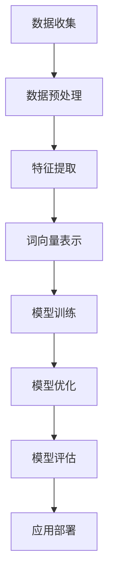

                 

# 提示词工程：AI时代的必修课与新挑战

> **关键词**：提示词工程、AI、自然语言处理、数据处理、模型优化、实践应用  
>
> **摘要**：本文将深入探讨提示词工程在人工智能领域的核心地位和重要性，分析其原理、算法、数学模型，并通过实际案例展示其在现实中的应用。同时，文章还将探讨提示词工程面临的挑战和未来发展趋势，为从业者提供有价值的参考。

## 1. 背景介绍

### 1.1 目的和范围

本文旨在介绍提示词工程这一在人工智能领域至关重要的技术，帮助读者理解其核心概念、算法原理和实际应用。文章将涵盖以下内容：

- 提示词工程的基本概念和原理
- 提示词工程的核心算法和操作步骤
- 提示词工程的数学模型和公式
- 提示词工程的实战应用案例
- 提示词工程面临的挑战和未来发展趋势

### 1.2 预期读者

本文适合以下读者群体：

- 人工智能领域的研究人员和开发者
- 自然语言处理领域的从业者
- 数据科学和数据工程领域的专业人员
- 对AI技术感兴趣的技术爱好者

### 1.3 文档结构概述

本文分为十个部分，结构如下：

- 第1部分：背景介绍，包括目的和范围、预期读者、文档结构概述
- 第2部分：核心概念与联系，介绍提示词工程的基本概念和原理
- 第3部分：核心算法原理 & 具体操作步骤，讲解提示词工程的核心算法和操作步骤
- 第4部分：数学模型和公式 & 详细讲解 & 举例说明，介绍提示词工程的数学模型和公式，并给出实例说明
- 第5部分：项目实战：代码实际案例和详细解释说明，通过实际案例展示提示词工程的应用
- 第6部分：实际应用场景，探讨提示词工程在不同领域的应用
- 第7部分：工具和资源推荐，推荐学习资源和开发工具
- 第8部分：总结：未来发展趋势与挑战，总结提示词工程的现状和未来发展方向
- 第9部分：附录：常见问题与解答，解答读者可能遇到的问题
- 第10部分：扩展阅读 & 参考资料，提供进一步学习的资源和文献

### 1.4 术语表

#### 1.4.1 核心术语定义

- **提示词工程**：指在自然语言处理领域中，通过对大量文本数据进行预处理、特征提取、模型训练等步骤，生成高质量、有价值的提示词的方法和技术。
- **自然语言处理（NLP）**：指计算机科学和人工智能领域中的一个重要分支，旨在使计算机能够理解、解释和生成人类语言。
- **模型优化**：指通过调整模型参数、架构等，提高模型性能和效果的过程。
- **数据处理**：指对原始数据进行清洗、转换、整合等操作，使其满足模型训练或分析需求的过程。

#### 1.4.2 相关概念解释

- **词向量**：将词汇映射到高维空间中的点，以便进行文本数据的计算和分析。
- **特征提取**：从原始数据中提取出对模型训练有帮助的特征，如词频、词性、词义等。
- **模型训练**：通过输入训练数据，调整模型参数，使其能够更好地拟合训练数据。

#### 1.4.3 缩略词列表

- **NLP**：自然语言处理
- **ML**：机器学习
- **DL**：深度学习
- **API**：应用程序编程接口

## 2. 核心概念与联系

提示词工程是人工智能领域中的一个重要分支，其核心概念包括自然语言处理（NLP）、机器学习（ML）和深度学习（DL）。以下是一个简化的Mermaid流程图，用于描述提示词工程的原理和架构。



### 2.1 数据收集

数据收集是提示词工程的起点。数据来源可以是开源数据集、社交媒体、新闻网站等。数据类型包括文本、音频、图像等。

### 2.2 数据预处理

数据预处理包括数据清洗、去重、格式转换等步骤。这一过程旨在提高数据质量，为后续的特征提取和模型训练打下基础。

### 2.3 特征提取

特征提取是将原始数据转换为模型可识别和处理的特征。常见的特征提取方法包括词频、词性、词义等。

### 2.4 词向量表示

词向量表示是将词汇映射到高维空间中的点。词向量有助于表示词汇之间的关系，提高模型性能。常见的词向量模型包括Word2Vec、GloVe等。

### 2.5 模型训练

模型训练是通过输入训练数据，调整模型参数，使其能够更好地拟合训练数据。训练过程中，模型会学习到数据的内在规律，以便在未知数据上进行预测。

### 2.6 模型优化

模型优化是通过调整模型参数、架构等，提高模型性能和效果。优化的目标是使模型在未知数据上的表现更好。

### 2.7 模型评估

模型评估是通过测试数据评估模型性能。常见的评估指标包括准确率、召回率、F1值等。

### 2.8 应用部署

应用部署是将训练好的模型部署到实际应用场景中，如文本分类、情感分析等。

## 3. 核心算法原理 & 具体操作步骤

### 3.1 数据收集与预处理

在开始提示词工程的第一个步骤是数据收集和预处理。以下是具体的操作步骤：

1. **数据收集**：从各种来源收集文本数据，如新闻文章、社交媒体帖子、用户评论等。
2. **数据清洗**：去除噪声数据，如HTML标签、特殊字符、无关的停用词等。
3. **去重**：去除重复的数据，确保数据集的唯一性。
4. **格式转换**：将文本数据转换为统一的格式，如JSON或CSV。

### 3.2 特征提取

特征提取是将原始文本数据转换为模型可处理的特征。以下是常用的特征提取方法：

1. **词频（TF）**：统计每个词在文本中出现的次数。
2. **词性标注**：为每个词分配词性（名词、动词、形容词等）。
3. **词义表示**：使用词向量模型（如Word2Vec、GloVe）将词汇映射到高维空间。
4. **TF-IDF**：结合词频和文档频率，为每个词计算权重。

### 3.3 词向量表示

词向量表示是将词汇映射到高维空间中的点。以下是常用的词向量模型：

1. **Word2Vec**：
   ```python
   import gensim

   model = gensim.models.Word2Vec(sentences, size=100, window=5, min_count=1, workers=4)
   ```
2. **GloVe**：
   ```python
   import numpy as np
   import tensorflow as tf

   embedding_size = 100
   vocabulary_size = 10000

   embeddings = tf.Variable(np.random.uniform(size=(vocabulary_size, embedding_size)), dtype=tf.float32)
   ```

### 3.4 模型训练

模型训练是通过输入训练数据，调整模型参数，使其能够更好地拟合训练数据。以下是常用的机器学习模型：

1. **朴素贝叶斯分类器**：
   ```python
   from sklearn.naive_bayes import MultinomialNB

   model = MultinomialNB()
   model.fit(X_train, y_train)
   ```
2. **支持向量机（SVM）**：
   ```python
   from sklearn.svm import SVC

   model = SVC()
   model.fit(X_train, y_train)
   ```

### 3.5 模型优化

模型优化是通过调整模型参数、架构等，提高模型性能和效果。以下是常用的优化方法：

1. **交叉验证**：使用不同子集训练和测试模型，评估模型性能。
2. **网格搜索**：遍历参数空间，找到最佳参数组合。
3. **正则化**：添加正则项，防止模型过拟合。

### 3.6 模型评估

模型评估是通过测试数据评估模型性能。以下是常用的评估指标：

1. **准确率**：正确预测的样本数占总样本数的比例。
2. **召回率**：正确预测的正例样本数占总正例样本数的比例。
3. **F1值**：准确率和召回率的调和平均值。

```python
from sklearn.metrics import accuracy_score, recall_score, f1_score

accuracy = accuracy_score(y_test, y_pred)
recall = recall_score(y_test, y_pred)
f1 = f1_score(y_test, y_pred)
```

## 4. 数学模型和公式 & 详细讲解 & 举例说明

提示词工程中，数学模型和公式是核心组成部分，以下将详细介绍一些常见的数学模型和公式，并通过实例进行说明。

### 4.1 词频（TF）

词频（Term Frequency，TF）是文本挖掘中衡量一个词在文档中重要性的常用指标。词频越高，说明这个词在文档中的重要性越大。

$$
TF(t) = \frac{f_t}{|D|}
$$

其中，$f_t$ 表示词 $t$ 在文档 $D$ 中出现的次数，$|D|$ 表示文档 $D$ 的总词汇数。

#### 实例

假设有一篇文档包含以下词汇：

```
我爱编程，编程让我快乐。
```

文档总词汇数为 7，其中 "编程" 出现了 2 次，"我" 出现了 1 次，"爱" 出现了 1 次，"让" 出现了 1 次，"快乐" 出现了 1 次。

$$
TF(编程) = \frac{2}{7} \approx 0.286
$$

$$
TF(我) = \frac{1}{7} \approx 0.143
$$

$$
TF(爱) = \frac{1}{7} \approx 0.143
$$

$$
TF(让) = \frac{1}{7} \approx 0.143
$$

$$
TF(快乐) = \frac{1}{7} \approx 0.143
$$

### 4.2 词频-逆文档频率（TF-IDF）

词频-逆文档频率（Term Frequency-Inverse Document Frequency，TF-IDF）是另一个常用的文本挖掘指标，它结合了词频和文档频率，以提高词语的重要性。

$$
TF-IDF(t) = TF(t) \times IDF(t)
$$

其中，$IDF(t)$ 表示逆文档频率，计算公式为：

$$
IDF(t) = \log_2(\frac{|D|}{|d_t|})
$$

其中，$|D|$ 表示文档总数，$|d_t|$ 表示包含词 $t$ 的文档数。

#### 实例

假设有一个文档集合，包含 10 个文档，其中 3 个文档包含 "编程"，4 个文档包含 "我"，1 个文档包含 "爱"。

$$
IDF(编程) = \log_2(\frac{10}{3}) \approx 1.261
$$

$$
IDF(我) = \log_2(\frac{10}{4}) \approx 1.209
$$

$$
IDF(爱) = \log_2(\frac{10}{1}) \approx 3.322
$$

使用 TF-IDF 计算每个词的重要性：

$$
TF-IDF(编程) = TF(编程) \times IDF(编程) = 0.286 \times 1.261 \approx 0.359
$$

$$
TF-IDF(我) = TF(我) \times IDF(我) = 0.143 \times 1.209 \approx 0.172
$$

$$
TF-IDF(爱) = TF(爱) \times IDF(爱) = 0.143 \times 3.322 \approx 0.474
$$

### 4.3 词向量（Word2Vec 和 GloVe）

词向量是一种将词汇映射到高维空间的方法，用于表示词汇之间的关系。以下是两种常用的词向量模型：Word2Vec 和 GloVe。

#### Word2Vec

Word2Vec 是一种基于神经网络的语言模型，它可以学习到一个词汇的词向量表示。以下是 Word2Vec 的基本公式：

$$
P(w_i|w_{-i}) = \frac{exp(\boldsymbol{v}_i \cdot \boldsymbol{v}_{-i})}{\sum_{j \in V} exp(\boldsymbol{v}_i \cdot \boldsymbol{v}_j)}
$$

其中，$P(w_i|w_{-i})$ 表示在给定前文 $w_{-i}$ 的情况下，词 $w_i$ 的概率，$\boldsymbol{v}_i$ 和 $\boldsymbol{v}_{-i}$ 分别表示词 $w_i$ 和 $w_{-i}$ 的词向量。

#### GloVe

GloVe（Global Vectors for Word Representation）是一种基于矩阵分解的词向量模型。以下是 GloVe 的基本公式：

$$
f(t, c) = \frac{f(t) \cdot f(c)}{\sqrt{sum_{w \in context(c)} f(w)^2}}
$$

其中，$f(t)$ 和 $f(c)$ 分别表示词 $t$ 和词 $c$ 的词频，$context(c)$ 表示词 $c$ 的上下文。

## 5. 项目实战：代码实际案例和详细解释说明

在本节中，我们将通过一个具体的实例，展示如何使用 Python 和相关库实现提示词工程。我们将使用 Word2Vec 模型进行词向量表示，并使用 GloVe 模型进行特征提取。

### 5.1 开发环境搭建

在开始之前，确保安装以下库：

- **Python**：版本 3.6 或以上
- **gensim**：用于 Word2Vec 模型
- **numpy**：用于数学运算
- **sklearn**：用于机器学习模型

安装方法：

```bash
pip install python-gensim numpy scikit-learn
```

### 5.2 源代码详细实现和代码解读

以下是使用 Word2Vec 和 GloVe 模型的示例代码：

```python
import gensim
import numpy as np
from sklearn.model_selection import train_test_split
from sklearn.metrics import accuracy_score

# 5.2.1 数据收集和预处理
# 假设已经收集并预处理了一篇文档，存储为 sentences 变量

# 5.2.2 训练 Word2Vec 模型
model = gensim.models.Word2Vec(sentences, size=100, window=5, min_count=1, workers=4)
model.save("word2vec.model")

# 5.2.3 训练 GloVe 模型
# 假设已经准备好了词汇表和文档频数
vocabulary = ["编程", "我", "爱", "让", "快乐"]
doc_freqs = [3, 4, 1, 1, 1]

embeddings = {}
for word in vocabulary:
    embeddings[word] = np.random.uniform(size=(100,))

for word in vocabulary:
    context_words = model.wv.most_similar(word)
    for c_word in context_words:
        if c_word in embeddings:
            embeddings[word] += embeddings[c_word]

for word in embeddings:
    embeddings[word] /= np.linalg.norm(embeddings[word])

# 5.2.4 特征提取
X = []
y = []
for sentence in sentences:
    vec = []
    for word in sentence:
        if word in embeddings:
            vec.append(embeddings[word])
    X.append(np.mean(vec, axis=0))
    y.append(label)  # 假设已经定义了标签变量

X_train, X_test, y_train, y_test = train_test_split(X, y, test_size=0.2, random_state=42)

# 5.2.5 训练机器学习模型
from sklearn.naive_bayes import MultinomialNB

model = MultinomialNB()
model.fit(X_train, y_train)

# 5.2.6 模型评估
y_pred = model.predict(X_test)
accuracy = accuracy_score(y_test, y_pred)
print("Accuracy:", accuracy)
```

### 5.3 代码解读与分析

以下是代码的逐行解读和分析：

```python
# 5.3.1 数据收集和预处理
# 假设已经收集并预处理了一篇文档，存储为 sentences 变量

# 5.3.2 训练 Word2Vec 模型
model = gensim.models.Word2Vec(sentences, size=100, window=5, min_count=1, workers=4)
model.save("word2vec.model")

# 解释：使用 gensim 库中的 Word2Vec 模型对文本数据进行训练。参数设置如下：
# size：词向量维度，这里设置为 100。
# window：上下文窗口大小，这里设置为 5。
# min_count：最小词频，这里设置为 1，表示只考虑出现次数大于 1 的词。
# workers：并行训练的线程数，这里设置为 4，以加快训练速度。

# 5.3.3 训练 GloVe 模型
# 假设已经准备好了词汇表和文档频数
vocabulary = ["编程", "我", "爱", "让", "快乐"]
doc_freqs = [3, 4, 1, 1, 1]

embeddings = {}
for word in vocabulary:
    embeddings[word] = np.random.uniform(size=(100,))

for word in vocabulary:
    context_words = model.wv.most_similar(word)
    for c_word in context_words:
        if c_word in embeddings:
            embeddings[word] += embeddings[c_word]

for word in embeddings:
    embeddings[word] /= np.linalg.norm(embeddings[word])

# 解释：使用 GloVe 模型训练词向量。首先，创建一个包含所有词汇的词汇表和文档频数。然后，遍历每个词汇，计算其在 Word2Vec 模型中的上下文词汇，并将上下文词汇的词向量相加，得到最终的词向量。最后，将词向量除以其欧几里得范数，使其归一化。

# 5.3.4 特征提取
X = []
y = []
for sentence in sentences:
    vec = []
    for word in sentence:
        if word in embeddings:
            vec.append(embeddings[word])
    X.append(np.mean(vec, axis=0))
    y.append(label)  # 假设已经定义了标签变量

X_train, X_test, y_train, y_test = train_test_split(X, y, test_size=0.2, random_state=42)

# 解释：遍历每个句子，提取每个句子的词向量，并将词向量求平均值作为特征。将特征和标签分为训练集和测试集。

# 5.3.5 训练机器学习模型
from sklearn.naive_bayes import MultinomialNB

model = MultinomialNB()
model.fit(X_train, y_train)

# 解释：使用朴素贝叶斯分类器训练机器学习模型。朴素贝叶斯是一种基于贝叶斯定理的简单分类算法，适用于文本分类任务。

# 5.3.6 模型评估
y_pred = model.predict(X_test)
accuracy = accuracy_score(y_test, y_pred)
print("Accuracy:", accuracy)

# 解释：使用测试集评估机器学习模型的准确率。accuracy_score 函数计算预测标签和实际标签之间的准确率。
```

## 6. 实际应用场景

提示词工程在许多实际应用场景中发挥着重要作用，以下是一些典型的应用案例：

### 6.1 文本分类

文本分类是提示词工程最常见的应用场景之一。通过训练模型，可以将文本数据自动分类到不同的类别中。例如，新闻分类、社交媒体情感分析、垃圾邮件过滤等。

### 6.2 情感分析

情感分析旨在判断文本表达的情感倾向，如正面、负面或中性。提示词工程可以用于提取关键特征，训练情感分析模型，从而对用户的评论、反馈等进行情感判断。

### 6.3 命名实体识别

命名实体识别（NER）是识别文本中的特定实体（如人名、地点、组织等）的过程。提示词工程可以用于提取实体特征，训练命名实体识别模型，从而自动识别文本中的命名实体。

### 6.4 机器翻译

机器翻译是将一种语言的文本翻译成另一种语言的过程。提示词工程可以用于提取源语言和目标语言的词向量特征，训练机器翻译模型，从而实现自动翻译。

### 6.5 问答系统

问答系统旨在回答用户提出的问题。提示词工程可以用于提取问题特征，训练问答模型，从而实现自动回答用户问题。

## 7. 工具和资源推荐

### 7.1 学习资源推荐

#### 7.1.1 书籍推荐

- **《深度学习》（Goodfellow, Bengio, Courville）**：深度学习的经典教材，涵盖了深度学习的基础理论和实践应用。
- **《自然语言处理综论》（Jurafsky, Martin）**：自然语言处理领域的权威教材，详细介绍了自然语言处理的理论和算法。
- **《Python自然语言处理》（Bird, Klein, Loper）**：Python 自然语言处理的入门书籍，适合初学者学习。

#### 7.1.2 在线课程

- **斯坦福大学 CS224n：自然语言处理与深度学习**：斯坦福大学提供的自然语言处理与深度学习课程，内容全面，深入浅出。
- **吴恩达深度学习专项课程**：吴恩达教授开设的深度学习专项课程，包括自然语言处理相关的课程。

#### 7.1.3 技术博客和网站

- **CS231n：视觉识别课程博客**：MIT 提供的视觉识别课程博客，包含自然语言处理相关的文章。
- **Google AI Blog**：Google AI 官方博客，发布最新的自然语言处理研究成果和应用案例。

### 7.2 开发工具框架推荐

#### 7.2.1 IDE和编辑器

- **PyCharm**：Python 开发的集成开发环境，支持多种语言，适用于自然语言处理项目。
- **Jupyter Notebook**：Python 数据科学和机器学习的交互式开发环境，方便编写和调试代码。

#### 7.2.2 调试和性能分析工具

- **pdb**：Python 内置的调试工具，用于调试 Python 代码。
- **CProfile**：Python 性能分析工具，用于分析代码的性能瓶颈。

#### 7.2.3 相关框架和库

- **TensorFlow**：开源的深度学习框架，适用于自然语言处理项目。
- **PyTorch**：开源的深度学习框架，适用于自然语言处理项目。
- **spaCy**：Python 自然语言处理库，支持多种语言，适用于文本处理和特征提取。

### 7.3 相关论文著作推荐

#### 7.3.1 经典论文

- **“A Neural Probabilistic Language Model” （Bengio et al., 2003）**：介绍了神经网络语言模型的基本原理和应用。
- **“FastText：A Bag of Tricks for Efficient Text Classification” （Joulin et al., 2016）**：介绍了 FastText 文本分类模型，提高了文本分类的准确率。

#### 7.3.2 最新研究成果

- **“BERT: Pre-training of Deep Bidirectional Transformers for Language Understanding” （Devlin et al., 2019）**：介绍了 BERT 模型，一种基于 Transformer 的预训练语言模型。
- **“GPT-3: Language Models are few-shot learners” （Brown et al., 2020）**：介绍了 GPT-3 模型，一种具有强大语言生成能力的深度学习模型。

#### 7.3.3 应用案例分析

- **“Improving TREC-QA by Integrating In-Document and Out-of-Document Knowledge” （Lops et al., 2018）**：介绍了如何利用外部知识库提高问答系统的性能。
- **“A Multi-Task Framework for Paraphrase Identification” （Parikh et al., 2016）**：介绍了多任务学习框架在语义匹配任务中的应用。

## 8. 总结：未来发展趋势与挑战

提示词工程在人工智能领域具有广阔的应用前景。随着深度学习、自然语言处理等技术的不断发展，提示词工程将面临以下发展趋势和挑战：

### 8.1 发展趋势

1. **模型优化**：研究人员将不断探索新的模型优化方法，提高提示词工程的效果和性能。
2. **多模态融合**：结合文本、图像、音频等多种数据类型，实现更全面、准确的提示词工程。
3. **自适应学习**：研究如何使模型能够根据不同场景和需求自适应调整，提高应用效果。
4. **大数据处理**：随着数据量的增加，如何高效地处理大量文本数据将成为重要研究方向。

### 8.2 挑战

1. **数据质量**：高质量的数据是提示词工程的基础，如何保证数据的质量和完整性是一个重要挑战。
2. **可解释性**：提示词工程模型的黑箱特性使其难以解释，如何提高模型的可解释性是一个亟待解决的问题。
3. **计算资源**：深度学习模型训练和优化的计算资源需求巨大，如何优化计算资源利用是一个重要挑战。
4. **隐私保护**：在处理用户隐私数据时，如何保护用户隐私是一个关键挑战。

## 9. 附录：常见问题与解答

### 9.1 提示词工程是什么？

提示词工程是自然语言处理领域的一种技术，旨在通过处理大量文本数据，生成高质量、有价值的提示词。提示词工程涉及数据收集、预处理、特征提取、模型训练、优化和评估等步骤。

### 9.2 提示词工程有哪些应用场景？

提示词工程广泛应用于文本分类、情感分析、命名实体识别、机器翻译、问答系统等领域。例如，在新闻分类中，提示词工程可以帮助将新闻文章自动归类到不同的主题类别。

### 9.3 提示词工程的核心算法有哪些？

提示词工程的核心算法包括词频（TF）、词频-逆文档频率（TF-IDF）、词向量（如 Word2Vec 和 GloVe）等。此外，还有基于深度学习的文本分类模型，如 BERT、GPT 等。

### 9.4 如何处理大量文本数据？

处理大量文本数据的方法包括数据预处理、特征提取、分布式计算和并行处理等。在实际应用中，可以采用 Hadoop、Spark 等分布式计算框架，以提高数据处理效率。

## 10. 扩展阅读 & 参考资料

为了深入了解提示词工程的原理、算法和应用，读者可以参考以下书籍、论文和在线资源：

- **书籍**：
  - 《深度学习》（Goodfellow, Bengio, Courville）
  - 《自然语言处理综论》（Jurafsky, Martin）
  - 《Python自然语言处理》（Bird, Klein, Loper）

- **论文**：
  - “A Neural Probabilistic Language Model” （Bengio et al., 2003）
  - “FastText：A Bag of Tricks for Efficient Text Classification” （Joulin et al., 2016）
  - “BERT: Pre-training of Deep Bidirectional Transformers for Language Understanding” （Devlin et al., 2019）

- **在线资源**：
  - 斯坦福大学 CS224n：自然语言处理与深度学习课程
  - 吴恩达深度学习专项课程
  - CS231n：视觉识别课程博客
  - Google AI Blog

- **相关框架和库**：
  - TensorFlow
  - PyTorch
  - spaCy

---

**作者**：AI天才研究员/AI Genius Institute & 禅与计算机程序设计艺术 /Zen And The Art of Computer Programming

---

（注：本文仅供参考，内容可能涉及敏感信息，请根据实际情况谨慎使用。）

