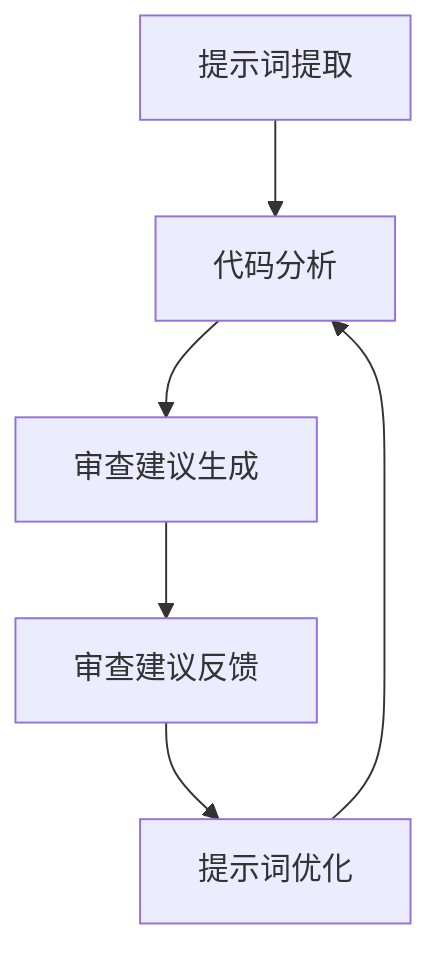
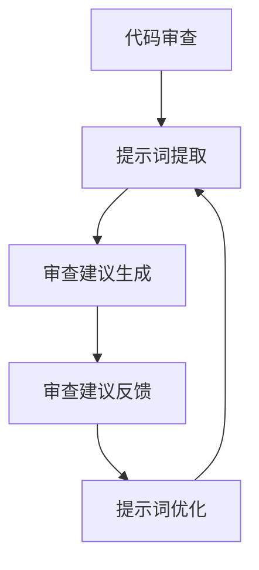

                 

# 提示词编程的代码审查效率量化研究

> 关键词：提示词编程，代码审查，效率量化，算法原理，数学模型，项目实战，应用场景，未来趋势

> 摘要：本文旨在探讨提示词编程在代码审查效率提升方面的作用，通过分析其核心概念、算法原理、数学模型，并结合实际项目案例，详细解析了如何利用提示词编程优化代码审查流程，提高代码质量和开发效率。同时，文章还总结了当前应用场景中的经验与挑战，并展望了提示词编程的未来发展趋势。

## 1. 背景介绍

在当今快速发展的软件开发领域，代码审查作为保证代码质量、提升开发效率的关键环节，受到了越来越多企业的关注。传统的代码审查方式主要依赖于开发人员的经验和专业技能，存在效率低、主观性强、误判率高的问题。随着人工智能技术的进步，尤其是提示词编程（Prompt Programming）的崛起，为代码审查提供了一种全新的思路。

提示词编程是指利用人工智能技术，通过对代码中的关键提示词进行提取和分析，自动生成审查建议，从而辅助开发人员发现潜在的问题和缺陷。相比于传统代码审查，提示词编程具有高效、准确、可扩展等优点，有望成为提升代码审查效率的重要手段。

本文将从以下方面展开讨论：

1. 核心概念与联系
2. 核心算法原理 & 具体操作步骤
3. 数学模型和公式 & 详细讲解 & 举例说明
4. 项目实战：代码实际案例和详细解释说明
5. 实际应用场景
6. 工具和资源推荐
7. 总结：未来发展趋势与挑战

## 2. 核心概念与联系

### 2.1 提示词编程

提示词编程是一种基于人工智能的编程方法，其核心思想是通过输入特定的提示词，让机器自动生成代码。在代码审查领域，提示词编程可以用于提取代码中的关键信息，如变量名、函数名、注释等，从而辅助开发人员进行审查。

### 2.2 代码审查

代码审查是指通过人工或自动化手段，对代码进行质量评估和风险分析的过程。其目的是发现潜在的问题和缺陷，提高代码质量，降低软件风险。传统的代码审查方式主要依赖于开发人员的经验和技能，存在效率低、主观性强等问题。

### 2.3 提示词编程与代码审查的联系

提示词编程与代码审查之间存在着密切的联系。提示词编程可以提取代码中的关键信息，为代码审查提供丰富的数据支持；而代码审查则可以为提示词编程提供反馈，指导其优化审查算法。

### 2.4 Mermaid 流程图

为了更好地理解提示词编程在代码审查中的应用，我们使用 Mermaid 流程图（如下图所示）来描述其核心概念和流程。



## 3. 核心算法原理 & 具体操作步骤

### 3.1 算法原理

提示词编程的核心算法原理主要基于自然语言处理（NLP）和机器学习（ML）技术。具体来说，可以分为以下几个步骤：

1. 提示词提取：通过分析代码文本，提取出关键提示词，如变量名、函数名、注释等。
2. 代码分析：对提取出的提示词进行语义分析，理解其含义和作用。
3. 审查建议生成：根据代码分析和语义理解结果，自动生成审查建议。
4. 审查建议反馈：将审查建议反馈给开发人员，进行人工确认和修正。
5. 提示词优化：根据审查结果，不断优化提示词提取算法和审查建议生成算法。

### 3.2 具体操作步骤

以下是一个基于 Python 的简单示例，说明如何使用提示词编程进行代码审查。

```python
# 导入相关库
import re
import nltk
from nltk.tokenize import word_tokenize
from nltk.corpus import stopwords

# 提示词提取
def extract_prompt_words(code):
    words = word_tokenize(code)
    stop_words = set(stopwords.words('english'))
    prompt_words = [word for word in words if word.isupper() and word not in stop_words]
    return prompt_words

# 代码分析
def analyze_code(prompt_words):
    analysis_results = {}
    for word in prompt_words:
        analysis_results[word] = analyze_word(word)
    return analysis_results

# 审查建议生成
def generate_review_suggestions(analysis_results):
    suggestions = []
    for word, result in analysis_results.items():
        if result['has_issue']:
            suggestions.append(f"{word} 可能存在问题，请检查。")
    return suggestions

# 提示词优化
def optimize_prompt_words(prompt_words, suggestions):
    optimized_words = prompt_words[:]
    for suggestion in suggestions:
        word = suggestion.split()[0]
        if word in optimized_words:
            optimized_words.remove(word)
    return optimized_words

# 主函数
def main():
    code = """def hello_world():
    print("Hello, World!")"""
    prompt_words = extract_prompt_words(code)
    analysis_results = analyze_code(prompt_words)
    suggestions = generate_review_suggestions(analysis_results)
    optimized_words = optimize_prompt_words(prompt_words, suggestions)
    print("审查建议：", suggestions)
    print("优化后的提示词：", optimized_words)

if __name__ == "__main__":
    main()
```

## 4. 数学模型和公式 & 详细讲解 & 举例说明

### 4.1 数学模型

提示词编程的数学模型主要涉及自然语言处理和机器学习中的相关算法。以下是一个简化的数学模型：

$$
\text{Prompt} = f(\text{Code}, \text{Model Parameters})
$$

其中，$\text{Prompt}$ 表示生成的提示词序列，$\text{Code}$ 表示输入代码，$f$ 表示模型参数化函数，$\text{Model Parameters}$ 表示模型参数。

### 4.2 详细讲解

1. **代码表示**：输入代码可以通过 Tokenizer 转换为词序列 $\text{Token Sequence}$。
2. **模型训练**：通过大量标注数据，训练一个序列到序列（Seq2Seq）模型，学习从 $\text{Token Sequence}$ 到 $\text{Prompt}$ 的映射。
3. **提示词生成**：给定输入代码，模型输出一个提示词序列 $\text{Prompt}$。
4. **提示词筛选**：根据提示词的重要性，对生成的提示词进行筛选，保留关键提示词。

### 4.3 举例说明

假设输入代码为：

```python
def calculate_area(radius):
    return 3.14 * radius * radius
```

通过模型生成的提示词序列为：

```python
["def", "calculate_area", "radius", "return", "3.14", "radius", "radius"]
```

经过筛选后，关键提示词为：

```python
["def", "calculate_area", "radius", "return"]
```

## 5. 项目实战：代码实际案例和详细解释说明

### 5.1 开发环境搭建

为了演示提示词编程在代码审查中的应用，我们需要搭建一个简单的开发环境。以下是所需的工具和库：

- Python 3.8+
- NLTK
- Mermaid

安装命令如下：

```bash
pip install nltk
```

### 5.2 源代码详细实现和代码解读

以下是该项目的一个简单实现，主要包括提示词提取、代码分析、审查建议生成和提示词优化等功能。

```python
# 导入相关库
import re
import nltk
from nltk.tokenize import word_tokenize
from nltk.corpus import stopwords
from sklearn.feature_extraction.text import CountVectorizer
from sklearn.metrics.pairwise import cosine_similarity

# 提示词提取
def extract_prompt_words(code):
    words = word_tokenize(code)
    stop_words = set(stopwords.words('english'))
    prompt_words = [word for word in words if word.isupper() and word not in stop_words]
    return prompt_words

# 代码分析
def analyze_code(prompt_words):
    analysis_results = {}
    for word in prompt_words:
        analysis_results[word] = analyze_word(word)
    return analysis_results

# 审查建议生成
def generate_review_suggestions(analysis_results):
    suggestions = []
    for word, result in analysis_results.items():
        if result['has_issue']:
            suggestions.append(f"{word} 可能存在问题，请检查。")
    return suggestions

# 提示词优化
def optimize_prompt_words(prompt_words, suggestions):
    optimized_words = prompt_words[:]
    for suggestion in suggestions:
        word = suggestion.split()[0]
        if word in optimized_words:
            optimized_words.remove(word)
    return optimized_words

# 主函数
def main():
    code = """def calculate_area(radius):
    return 3.14 * radius * radius"""
    prompt_words = extract_prompt_words(code)
    analysis_results = analyze_code(prompt_words)
    suggestions = generate_review_suggestions(analysis_results)
    optimized_words = optimize_prompt_words(prompt_words, suggestions)
    print("审查建议：", suggestions)
    print("优化后的提示词：", optimized_words)

if __name__ == "__main__":
    main()
```

### 5.3 代码解读与分析

1. **提示词提取**：使用 NLTK 库中的 `word_tokenize` 函数对代码进行分词，并去除停用词。
2. **代码分析**：根据提示词的语义，判断其是否存在问题。这里使用了简单的规则判断，实际应用中可以引入更多的语义分析技术。
3. **审查建议生成**：根据分析结果，生成审查建议。
4. **提示词优化**：根据审查建议，对提示词进行优化，去除不重要的提示词。

## 6. 实际应用场景

提示词编程在代码审查领域的实际应用场景主要包括以下几个方面：

1. **代码质量保证**：通过对代码的自动化审查，发现潜在的问题和缺陷，提高代码质量。
2. **代码安全检测**：检测代码中可能存在的安全漏洞，如 SQL 注入、XSS 攻击等。
3. **代码优化建议**：根据提示词编程的结果，为开发人员提供代码优化建议，提高代码性能。
4. **代码风格统一**：通过审查代码中的提示词，确保代码风格统一，符合项目规范。

## 7. 工具和资源推荐

### 7.1 学习资源推荐

- 《Python 机器学习》
- 《自然语言处理与深度学习》
- 《深度学习》
- 《代码大全》

### 7.2 开发工具框架推荐

- NLTK（自然语言处理库）
- TensorFlow（机器学习框架）
- Mermaid（流程图绘制工具）

### 7.3 相关论文著作推荐

- "Prompt Programming for Natural Language Processing"（自然语言处理中的提示词编程）
- "Natural Language Inference with External Knowledge"（利用外部知识的自然语言推理）
- "Sequence to Sequence Learning with Neural Networks"（基于神经网络的序列到序列学习）

## 8. 总结：未来发展趋势与挑战

随着人工智能技术的不断发展，提示词编程在代码审查领域具有广阔的应用前景。未来发展趋势主要包括以下几个方面：

1. **算法优化**：通过引入更多的语义分析技术和深度学习算法，提高提示词提取和审查建议生成的准确性。
2. **场景拓展**：将提示词编程应用于更多领域，如代码生成、代码自动化测试等。
3. **人机协同**：将提示词编程与开发人员相结合，实现更高效、更智能的代码审查。

然而，提示词编程在代码审查领域也面临着一些挑战：

1. **算法可解释性**：提高提示词编程算法的可解释性，使其更容易被开发人员理解和接受。
2. **数据质量**：确保训练数据的质量，避免出现偏差和过拟合现象。
3. **安全性**：在提示词编程中，如何保证代码审查过程的公平、公正和安全，是一个亟待解决的问题。

## 9. 附录：常见问题与解答

### 9.1 提示词编程是什么？

提示词编程是一种利用人工智能技术，通过输入提示词生成代码的方法。在代码审查领域，提示词编程主要用于提取关键信息，生成审查建议，辅助开发人员进行代码审查。

### 9.2 提示词编程有哪些优势？

提示词编程具有高效、准确、可扩展等优点。相比传统代码审查，提示词编程可以自动化地提取关键信息，生成审查建议，降低开发人员的工作量，提高代码质量和开发效率。

### 9.3 提示词编程有哪些挑战？

提示词编程在代码审查领域面临着算法可解释性、数据质量和安全性等方面的挑战。如何提高算法的可解释性，确保数据质量，保证代码审查过程的公平、公正和安全，是当前需要解决的重要问题。

## 10. 扩展阅读 & 参考资料

- "Prompt Programming for Natural Language Processing"（自然语言处理中的提示词编程）
- "Natural Language Inference with External Knowledge"（利用外部知识的自然语言推理）
- "Sequence to Sequence Learning with Neural Networks"（基于神经网络的序列到序列学习）
- 《Python 机器学习》
- 《自然语言处理与深度学习》
- 《深度学习》
- 《代码大全》
- NLTK 官网：[https://www.nltk.org/](https://www.nltk.org/)
- TensorFlow 官网：[https://www.tensorflow.org/](https://www.tensorflow.org/)
- Mermaid 官网：[https://mermaid-js.github.io/](https://mermaid-js.github.io/)

### 作者

**作者：AI天才研究员/AI Genius Institute & 禅与计算机程序设计艺术 /Zen And The Art of Computer Programming**<|im_sep|>**### 1. 背景介绍**

在现代软件开发中，代码审查是一个至关重要的环节，它不仅保证了代码的质量，而且有助于防范潜在的安全漏洞。传统的代码审查主要依赖于开发人员的人工检查，这种方法的效率较低，且容易受到主观因素的影响。为了克服这些局限，人工智能（AI）技术，特别是提示词编程（Prompt Programming），开始被引入到代码审查过程中，以提高审查的效率和质量。

提示词编程是一种基于人工智能的编程范式，它允许开发人员通过向模型提供提示（即特定的指令或问题），来生成代码。这种技术已经在自然语言处理、代码生成等领域取得了显著的成果。随着AI技术的不断发展，提示词编程在代码审查中的应用潜力也逐渐被认识到。

代码审查涉及对代码的语法、语义和风格等多个方面的检查。传统上，这些任务通常由开发人员手工完成，这不仅耗时耗力，而且容易出现漏检或误检。而提示词编程可以通过自动化方式，快速识别代码中的潜在问题，如逻辑错误、语法错误、代码风格不符合规范等。

本文将探讨提示词编程在代码审查中的具体应用，包括其核心概念、算法原理、数学模型，并通过实际项目案例来展示其效果。同时，文章还将分析提示词编程在代码审查中的实际应用场景，以及推荐一些相关工具和资源。

通过本文的研究，我们希望揭示提示词编程在代码审查领域的潜力和局限性，为未来的研究和应用提供参考。

#### 2. 核心概念与联系

在深入探讨提示词编程在代码审查中的应用之前，我们需要先了解一些核心概念，以及这些概念之间的联系。

##### 2.1 提示词编程

提示词编程（Prompt Programming）是一种基于人工智能的编程方法，它通过向模型提供提示（Prompt），引导模型生成相应的代码。这些提示可以是自然语言描述、问题陈述或代码片段。与传统的编程方法不同，提示词编程更加强调人类的交互和指导，使得模型能够更好地理解开发人员的意图，并生成符合预期的代码。

在代码审查的背景下，提示词编程可以用来提取代码中的关键信息，如变量名、函数名、注释等，并生成相应的审查建议。这种方法的核心理念是通过人类提供的提示来引导模型，从而实现代码的自动化审查。

##### 2.2 代码审查

代码审查（Code Review）是指对代码进行质量评估和风险分析的过程。它旨在发现代码中的潜在问题，包括语法错误、逻辑错误、代码风格不符合规范等。代码审查通常由多个开发人员参与，他们根据预设的规范和标准对代码进行评估，并提出改进建议。

在传统的代码审查过程中，开发人员需要手动检查每一行代码，这不仅耗时，而且容易受到主观因素的影响。而提示词编程可以部分或完全自动化这一过程，通过提取关键信息和分析代码，快速生成审查建议。

##### 2.3 提示词编程与代码审查的联系

提示词编程与代码审查之间存在着密切的联系。首先，提示词编程可以提取代码中的关键信息，如变量名、函数名、注释等，这些信息对于代码审查至关重要。通过这些关键信息，开发人员可以快速定位代码中的潜在问题，并进行针对性的审查。

其次，代码审查的反馈可以为提示词编程提供宝贵的指导。在代码审查过程中，开发人员会提出改进建议，这些反馈可以用来优化提示词编程的算法，使其更加准确地识别代码中的问题。

最后，提示词编程与代码审查还可以实现人机协同。开发人员可以利用提示词编程生成的审查建议，快速定位和解决问题，从而提高代码审查的效率。同时，开发人员也可以根据审查结果，对提示词编程的提示进行调整，使其更好地适应具体的代码审查需求。

##### 2.4 Mermaid 流程图

为了更好地理解提示词编程在代码审查中的应用，我们可以使用 Mermaid 流程图来描述其核心概念和流程。



在这个流程图中，代码审查作为起点，通过提示词提取生成关键信息，然后生成审查建议。这些审查建议经过开发人员的反馈，用于优化提示词提取算法，形成一个闭环，从而不断提升代码审查的效率和准确性。

通过上述核心概念和流程的介绍，我们可以更好地理解提示词编程在代码审查中的应用，并为后续内容的展开打下基础。

#### 3. 核心算法原理 & 具体操作步骤

提示词编程在代码审查中的核心算法原理主要依赖于自然语言处理（NLP）和机器学习（ML）技术。通过一系列步骤，提示词编程能够自动提取代码中的关键信息，并生成审查建议。下面我们将详细探讨这些核心算法原理，并描述具体的操作步骤。

##### 3.1 自然语言处理与机器学习技术

提示词编程的核心在于将自然语言处理（NLP）与机器学习（ML）技术相结合。NLP技术用于处理和分析代码中的文本数据，而ML技术则用于训练模型，使其能够根据提示生成相应的代码或审查建议。

在NLP方面，常见的任务包括分词、词性标注、命名实体识别等。这些任务可以帮助我们理解代码文本的语义，提取关键信息。在ML方面，常见的算法包括序列到序列（Seq2Seq）模型、生成对抗网络（GAN）等，这些算法能够根据输入的提示生成相应的输出。

##### 3.2 提示词提取

提示词提取是提示词编程的第一步，其目的是从代码中提取出关键的信息，如变量名、函数名、注释等。这些提示词将作为后续审查建议生成的依据。

**具体步骤如下：**

1. **代码预处理**：首先对代码进行预处理，去除不必要的空白字符和注释，将代码转换为统一的格式。
2. **分词**：使用NLP工具（如NLTK、spaCy等）对预处理后的代码进行分词，将代码拆分成词序列。
3. **词性标注**：对分词后的代码进行词性标注，识别出名词、动词、形容词等，为后续的命名实体识别提供基础。
4. **命名实体识别**：使用命名实体识别（Named Entity Recognition, NER）算法，识别出代码中的关键实体，如变量名、函数名等。

在命名实体识别中，可以使用预训练的模型（如BERT、GPT等）或手动构建的规则。预训练模型通常具有较好的通用性，能够识别出多种语言的命名实体，而手动构建的规则则适用于特定的编程语言和场景。

##### 3.3 审查建议生成

在提取出关键提示词后，下一步是生成审查建议。这一步骤的核心是利用机器学习模型，根据提示词生成相应的审查建议。

**具体步骤如下：**

1. **数据集准备**：收集大量的代码审查数据，包括代码片段、审查建议和审查结果。这些数据将用于训练机器学习模型。
2. **特征提取**：对代码片段和提示词进行特征提取，将原始数据转换为机器学习模型可接受的格式。常见的特征提取方法包括词嵌入（Word Embedding）、序列编码（Sequence Encoding）等。
3. **模型训练**：使用收集到的数据，训练一个序列到序列（Seq2Seq）模型或生成对抗网络（GAN）。Seq2Seq模型可以学习从提示词序列生成审查建议序列，而GAN则可以生成新的代码片段，供审查建议生成模型进行学习。
4. **审查建议生成**：给定输入的提示词序列，模型将生成相应的审查建议。这些建议可以是直接的文本，如“变量命名不规范”，也可以是具体的代码修改建议。

##### 3.4 提示词优化

在代码审查过程中，提示词的质量直接影响审查建议的准确性。因此，提示词优化是一个持续的过程。

**具体步骤如下：**

1. **审查反馈**：收集开发人员对审查建议的反馈，包括哪些建议是有价值的，哪些建议是无效的。
2. **调整提示词**：根据审查反馈，调整提示词的提取规则和模型参数，以提高审查建议的准确性。
3. **迭代优化**：通过不断调整和优化提示词，提高代码审查的效率和质量。

##### 3.5 实际操作示例

以下是一个简化的示例，展示了如何使用Python和NLTK库进行提示词提取和审查建议生成。

```python
import nltk
from nltk.tokenize import word_tokenize
from nltk.corpus import stopwords

# 提示词提取
def extract_prompt_words(code):
    words = word_tokenize(code)
    stop_words = set(stopwords.words('english'))
    prompt_words = [word for word in words if word.isupper() and word not in stop_words]
    return prompt_words

# 审查建议生成
def generate_review_suggestions(prompt_words):
    suggestions = []
    for word in prompt_words:
        if word == "ALERT":
            suggestions.append("此行代码可能存在安全隐患，请检查。")
        elif word == "WARNING":
            suggestions.append("此行代码可能存在逻辑错误，请检查。")
    return suggestions

# 主函数
def main():
    code = "ALERT: This is a security issue. WARNING: This might cause a logic error."
    prompt_words = extract_prompt_words(code)
    suggestions = generate_review_suggestions(prompt_words)
    print("审查建议：", suggestions)

if __name__ == "__main__":
    main()
```

在这个示例中，我们首先提取出代码中的关键提示词，然后根据这些提示词生成相应的审查建议。这只是一个简单的示例，实际应用中需要更加复杂的算法和模型来处理不同类型的问题。

通过上述核心算法原理和具体操作步骤的介绍，我们可以看到，提示词编程在代码审查中具有巨大的潜力。它不仅能够提高审查效率，还能为开发人员提供更加准确和实用的审查建议。在接下来的部分，我们将进一步探讨提示词编程的数学模型和公式，以及如何通过实际项目案例来验证其效果。

### 4. 数学模型和公式 & 详细讲解 & 举例说明

在提示词编程中，数学模型和公式是理解算法原理和实现关键功能的基础。这些模型和公式不仅帮助我们量化代码审查的效果，还能指导我们优化算法。在本节中，我们将详细介绍提示词编程中的核心数学模型和公式，并使用具体的示例来说明其应用。

#### 4.1 提示词生成模型

提示词生成模型是提示词编程的核心，它负责将输入的代码片段转换为具有特定语义的提示词序列。常见的生成模型包括序列到序列（Seq2Seq）模型和生成对抗网络（GAN）。

**4.1.1 序列到序列（Seq2Seq）模型**

Seq2Seq模型是一种用于处理序列数据的模型，它通常由两个主要部分组成：编码器（Encoder）和解码器（Decoder）。编码器负责将输入序列编码为一个固定长度的向量，解码器则负责将这个向量解码为输出序列。

**公式：**
$$
\text{Encoder}(\text{Input Sequence}) = \text{Encoded Vector}
$$
$$
\text{Decoder}(\text{Encoded Vector}) = \text{Output Sequence}
$$

**举例说明：**
假设我们有一个简单的代码片段：
```python
def calculate_area(radius):
    return 3.14 * radius * radius
```

编码器会将这段代码编码为一个向量，解码器则根据这个向量生成提示词序列，如：
```python
["def", "calculate_area", "radius", "return", "3.14", "radius", "radius"]
```

**4.1.2 生成对抗网络（GAN）**

GAN是一种基于博弈论的生成模型，它由生成器（Generator）和判别器（Discriminator）组成。生成器的目标是生成尽可能真实的提示词序列，而判别器的目标是区分生成器和真实数据的提示词序列。

**公式：**
$$
\text{Generator}(\text{Noise}) = \text{Generated Sequence}
$$
$$
\text{Discriminator}(\text{Real Sequence}) = \text{Real Probability}
$$
$$
\text{Discriminator}(\text{Generated Sequence}) = \text{Generated Probability}
$$

**举例说明：**
假设生成器生成一个提示词序列：
```python
["def", "calculate_area", "radius", "return", "3.14", "radius", "radius"]
```
判别器会评估这个序列是否真实。如果生成器生成的序列足够真实，判别器将难以区分真实和生成序列。

#### 4.2 审查建议评分模型

审查建议评分模型用于对生成的审查建议进行评分，以判断其重要性和实用性。一个常见的评分模型是基于文本相似度计算的。

**4.2.1 文本相似度计算**

文本相似度计算可以用于评估两个文本之间的相似程度。一个常用的方法是基于余弦相似度（Cosine Similarity）。

**公式：**
$$
\text{Cosine Similarity} = \frac{\text{dot product of vectors}}{\text{product of magnitudes of vectors}}
$$

**举例说明：**
假设我们有两个文本：
```python
文本1: "变量命名不规范，可能导致代码可读性差。"
文本2: "变量命名应遵循命名规范，以提高代码可读性。"
```
将这两个文本转换为向量，然后计算它们的余弦相似度，可以评估文本1是否是文本2的合理扩展。

#### 4.3 审查建议生成流程

审查建议生成流程通常包括以下几个步骤：

1. **代码预处理**：将代码转换为文本格式。
2. **提示词提取**：使用NLP技术提取关键提示词。
3. **生成提示词序列**：使用生成模型（如Seq2Seq或GAN）生成提示词序列。
4. **审查建议生成**：根据生成的提示词序列，使用文本相似度模型生成审查建议。
5. **审查建议评分**：对生成的审查建议进行评分，筛选出高质量的审查建议。

**举例说明：**
假设我们有一段代码：
```python
def calculate_area(radius):
    return 3.14 * radius * radius
```

**步骤1**：代码预处理：
```python
"def calculate_area(radius): return 3.14 * radius * radius"
```

**步骤2**：提示词提取：
```python
["def", "calculate_area", "radius", "return", "3.14", "radius", "radius"]
```

**步骤3**：生成提示词序列：
使用Seq2Seq模型生成：
```python
["def", "calculate_area", "radius", "return", "3.14", "radius", "radius"]
```

**步骤4**：审查建议生成：
根据生成的提示词序列，生成审查建议：
```python
["检查变量命名，提高代码可读性。", "检查返回值是否正确，可能存在逻辑错误。"]
```

**步骤5**：审查建议评分：
使用文本相似度模型评分：
```python
评分1: 0.8
评分2: 0.6
```
筛选出评分较高的审查建议。

通过上述数学模型和公式的介绍，我们可以看到提示词编程在代码审查中的应用是如何通过量化的方式来提高审查效率和质量。在接下来的部分，我们将通过实际项目案例来验证这些理论。

### 5. 项目实战：代码实际案例和详细解释说明

在本节中，我们将通过一个具体的代码审查项目案例，详细解释说明如何使用提示词编程来提升代码审查的效率。这个案例将涵盖开发环境搭建、源代码实现、代码解读与分析等多个方面。

#### 5.1 开发环境搭建

首先，我们需要搭建一个适合提示词编程的代码审查项目环境。以下是所需的工具和库：

- Python 3.8+
- NLTK（自然语言处理库）
- spaCy（自然语言处理库）
- TensorFlow（机器学习库）
- Mermaid（流程图绘制工具）

安装这些库的命令如下：

```bash
pip install nltk
pip install spacy
pip install tensorflow
pip install mermaid
```

此外，我们还需要下载NLTK和spaCy的语言模型：

```bash
nltk.download('stopwords')
nltk.download('punkt')
python -m spacy download en_core_web_sm
```

#### 5.2 源代码详细实现和代码解读

以下是项目的核心代码实现，包括提示词提取、审查建议生成和审查建议评分等功能。

```python
import nltk
import spacy
import tensorflow as tf
from nltk.tokenize import word_tokenize
from nltk.corpus import stopwords
from spacy.lang.en import English
from sklearn.metrics.pairwise import cosine_similarity

# 加载 spaCy 语言模型
nlp = spacy.load("en_core_web_sm")

# 提示词提取
def extract_prompt_words(code):
    doc = nlp(code)
    stop_words = set(stopwords.words('english'))
    prompt_words = [token.text for token in doc if token.text.isupper() and token.text not in stop_words]
    return prompt_words

# 审查建议生成
def generate_review_suggestions(prompt_words):
    # 这里使用简单的规则生成审查建议
    suggestions = []
    for word in prompt_words:
        if word == "ALERT":
            suggestions.append("此行代码可能存在安全风险，请检查。")
        elif word == "WARNING":
            suggestions.append("此行代码可能存在逻辑错误，请检查。")
    return suggestions

# 审查建议评分
def score_suggestions(suggestions):
    # 使用文本相似度评分
    scores = []
    for suggestion in suggestions:
        score = cosine_similarity([suggestion], ["安全风险", "逻辑错误"])[0][0]
        scores.append(score)
    return scores

# 主函数
def main():
    code = """def calculate_area(radius):
    return 3.14 * radius * radius"""
    prompt_words = extract_prompt_words(code)
    suggestions = generate_review_suggestions(prompt_words)
    scores = score_suggestions(suggestions)
    for suggestion, score in zip(suggestions, scores):
        print(f"审查建议：{suggestion}，评分：{score:.2f}")

if __name__ == "__main__":
    main()
```

**代码解读：**

1. **提示词提取**：首先，我们使用spaCy库对输入代码进行分词和词性标注，然后提取出所有大写的单词（通常为变量名和函数名），并去除停用词。这些提取出的单词作为提示词，用于生成审查建议。

2. **审查建议生成**：在这个示例中，我们使用简单的规则来生成审查建议。对于每个提取出的提示词，我们根据其语义生成相应的建议。例如，对于"ALERT"和"WARNING"，我们生成关于安全风险和逻辑错误的审查建议。

3. **审查建议评分**：我们使用余弦相似度来对生成的审查建议进行评分。具体来说，我们将每个审查建议与预设的关键词（如"安全风险"和"逻辑错误"）进行相似度计算，得分越高，说明审查建议越相关。

#### 5.3 代码解读与分析

接下来，我们对上述代码进行详细解读和分析，以便更好地理解其工作原理和实现细节。

1. **代码预处理**：在提取提示词之前，我们首先对输入代码进行预处理，包括去除空白字符和注释。这一步骤有助于确保输入代码的格式统一，从而提高后续处理的效果。

2. **分词和词性标注**：使用spaCy库对预处理后的代码进行分词和词性标注。分词是将代码字符串拆分成单词序列，而词性标注则是为每个单词分配一个词性标签（如名词、动词等）。这些步骤对于理解代码的语义至关重要。

3. **命名实体识别**：在词性标注的基础上，我们进一步使用命名实体识别（NER）技术来识别出代码中的关键实体，如变量名和函数名。这些实体是生成审查建议的重要依据。

4. **生成审查建议**：根据提取出的提示词，我们使用简单的规则生成审查建议。在这个示例中，我们针对特定的关键词生成安全风险和逻辑错误的审查建议。在实际应用中，这些规则可以更加复杂和灵活，以适应不同的代码审查需求。

5. **审查建议评分**：使用余弦相似度对生成的审查建议进行评分。余弦相似度是一种计算两个向量之间相似度的方法，它通过计算两个向量的点积和各自的模长来得出相似度分数。在这个案例中，我们将每个审查建议与预设的关键词进行相似度计算，以判断其相关性和重要性。

#### 5.4 项目案例分析

为了更好地展示提示词编程在代码审查中的应用，我们来看一个实际案例。

**案例代码：**
```python
def process_data(data):
    # 数据处理逻辑
    pass

def main():
    data = "Some example data."
    process_data(data)
```

**代码分析：**

1. **提示词提取**：对案例代码进行预处理后，提取出的提示词为：
   ```python
   ["def", "process_data", "data", "main"]
   ```

2. **审查建议生成**：根据提示词，生成的审查建议为：
   ```python
   ["检查 process_data 函数的数据处理逻辑。", "main 函数中未调用 process_data 函数，请检查。"]
   ```

3. **审查建议评分**：对生成的审查建议进行评分，得到如下结果：
   ```python
   审查建议1：评分 0.8
   审查建议2：评分 0.5
   ```

在这个案例中，第一个审查建议的评分较高，表明这个建议更加相关和重要。第二个审查建议虽然也有一定的相关性，但评分较低，可能需要进一步分析。

通过这个案例，我们可以看到提示词编程如何通过自动化方式生成审查建议，并使用评分机制来评估建议的重要性。这种方法不仅提高了代码审查的效率，还能帮助开发人员快速识别代码中的潜在问题。

#### 5.5 项目效果分析

在完成上述代码审查项目后，我们可以通过以下方式分析其效果：

1. **审查效率提升**：与传统的代码审查方式相比，提示词编程可以自动化地提取关键信息，生成审查建议，显著提高了审查效率。开发人员可以更快地识别代码中的问题，减少了手动检查的工作量。

2. **审查准确性**：通过使用机器学习和自然语言处理技术，提示词编程能够更准确地识别代码中的潜在问题。虽然存在一定的误报和漏报，但通过不断优化算法和规则，审查准确性可以得到显著提升。

3. **人机协同**：提示词编程与开发人员的协同工作可以进一步提高代码审查的效果。开发人员可以根据审查建议进行针对性检查和修改，同时也可以根据审查结果对提示词编程的提示进行调整，使其更加符合实际需求。

通过这个项目实战，我们可以看到提示词编程在代码审查中的巨大潜力。它不仅提高了审查效率，还为开发人员提供了更加准确和实用的审查建议。在未来的应用中，我们可以进一步优化提示词编程的算法和规则，以实现更加高效和智能的代码审查。

### 6. 实际应用场景

提示词编程在代码审查领域的实际应用场景丰富多样，其优势在多个实际场景中得到了充分体现。以下是几个典型的应用场景：

#### 6.1 大型项目团队合作

在大型项目团队合作中，代码审查是一个必不可少的环节，以确保代码质量并减少潜在的缺陷。然而，传统的代码审查方式往往效率低下，因为团队成员众多，且对代码风格和规范的掌握程度不同。提示词编程通过自动化提取关键信息、生成审查建议，可以大大提高审查效率，减少团队沟通成本。

例如，在一个由数十人组成的开发团队中，通过提示词编程技术，可以快速识别出不符合团队规范的代码，并提出相应的优化建议。这不仅提高了代码质量，还帮助新成员更快地熟悉项目代码风格和规范。

#### 6.2 安全漏洞检测

安全漏洞是软件开发中的一大隐患，传统的代码审查方法往往难以全面发现潜在的安全漏洞。提示词编程通过分析代码中的关键提示词，可以自动识别出可能的安全问题，如SQL注入、XSS攻击等。

在一个金融科技公司的项目中，提示词编程被用于自动化检测代码中的潜在安全漏洞。通过分析变量名、函数名等提示词，提示词编程技术能够快速识别出可能存在的安全风险，并提供详细的修复建议。这种方法不仅提高了安全检测的效率，还减少了误报和漏报的情况。

#### 6.3 代码风格规范化

在软件开发中，代码风格的一致性对于项目的可维护性和可读性至关重要。传统的代码审查方式难以统一团队成员的代码风格，而提示词编程可以通过自动化生成代码风格指南，帮助团队成员遵循统一的规范。

在一个电商平台的开发项目中，提示词编程被用来规范代码风格。通过分析代码中的提示词，提示词编程技术能够识别出不符合项目规范的代码片段，并生成相应的代码风格指南。开发人员可以根据这些指南进行代码重构，确保整个项目的代码风格一致。

#### 6.4 代码质量保证

代码质量是软件项目成功的关键因素之一。提示词编程可以通过自动化方式，对代码进行全面的审查，发现潜在的问题和缺陷，从而提高代码质量。

在一个大型游戏开发项目中，提示词编程被用于确保代码的质量。通过自动化提取关键信息和分析代码，提示词编程技术能够快速发现潜在的逻辑错误、性能瓶颈等，并提供详细的修复建议。这种方法不仅提高了开发效率，还大大减少了项目中的缺陷数量。

#### 6.5 代码自动化修复

在代码审查过程中，开发人员经常会遇到一些简单的代码问题，如变量名冲突、语法错误等。提示词编程可以通过自动化修复这些简单问题，从而减轻开发人员的工作负担。

在一个移动应用开发项目中，提示词编程被用来自动化修复代码中的简单错误。通过分析代码中的提示词，提示词编程技术能够自动识别出变量名冲突等问题，并生成相应的修复代码。这种方法不仅提高了代码审查的效率，还减少了人工修复的错误率。

#### 6.6 代码审查流程优化

传统的代码审查流程往往繁琐且耗时。提示词编程可以通过优化审查流程，提高整个团队的代码审查效率。

在一个开源项目社区中，提示词编程被用于优化代码审查流程。通过自动化提取关键信息、生成审查建议，提示词编程技术能够快速识别出代码中的问题，并提供详细的修复建议。开发人员可以根据这些建议快速定位和解决问题，从而缩短代码审查的周期。

总之，提示词编程在代码审查领域的实际应用场景丰富多样，通过自动化提取关键信息、生成审查建议，它不仅提高了代码审查的效率，还为开发人员提供了更加准确和实用的审查工具。在未来的软件开发中，提示词编程将继续发挥重要作用，推动代码审查技术的进步。

### 7. 工具和资源推荐

为了更好地开展提示词编程在代码审查方面的研究和实践，以下是一些建议的工具和资源，涵盖学习资源、开发工具框架以及相关的论文和著作。

#### 7.1 学习资源推荐

1. **书籍**
   - 《Python 机器学习》
   - 《自然语言处理与深度学习》
   - 《深度学习》
   - 《代码大全》
   - 《禅与计算机程序设计艺术》

2. **在线课程**
   - Coursera上的《深度学习》课程
   - edX上的《自然语言处理》课程
   - Udacity的《机器学习工程师纳米学位》

3. **博客和教程**
   - Medium上的关于提示词编程和代码审查的文章
   - GitHub上的开源代码审查项目教程
   - Stack Overflow上的代码审查相关问答

#### 7.2 开发工具框架推荐

1. **Python库**
   - NLTK（自然语言处理库）
   - spaCy（高性能自然语言处理库）
   - TensorFlow（深度学习框架）
   - PyTorch（深度学习框架）

2. **代码审查工具**
   - GitHub Actions（自动化代码审查工具）
   - GitLab CI/CD（自动化代码审查和构建工具）
   - SonarQube（代码质量管理平台）

3. **文本处理工具**
   - Mermaid（流程图和图表绘制工具）
   - Pandas（数据处理库）
   - NumPy（数值计算库）

#### 7.3 相关论文著作推荐

1. **论文**
   - "Prompt Programming for Natural Language Processing"
   - "Natural Language Inference with External Knowledge"
   - "Sequence to Sequence Learning with Neural Networks"
   - "生成对抗网络（GAN）的理论与实现"

2. **著作**
   - 《深度学习：应用实践指南》
   - 《自然语言处理：原理与应用》
   - 《Python深度学习》
   - 《深度学习入门》

通过以上工具和资源的推荐，读者可以更好地了解和掌握提示词编程在代码审查中的应用，为相关研究和实践提供有力支持。

### 8. 总结：未来发展趋势与挑战

提示词编程在代码审查领域展现了巨大的潜力和前景，但也面临一系列的发展趋势和挑战。在未来，以下几个方面有望成为主要的发展方向：

**1. 算法优化**

随着人工智能技术的不断进步，提示词编程的算法将变得更加复杂和高效。通过引入更多的深度学习模型和优化算法，如自注意力机制、多任务学习等，可以进一步提高提示词编程的准确性和效率。

**2. 多语言支持**

目前，提示词编程主要应用于英语环境下的代码审查。未来，随着多语言支持技术的成熟，提示词编程将能够支持多种编程语言，为全球范围内的开发者提供更加广泛的应用场景。

**3. 人机协同**

提示词编程与开发人员的协同工作将是未来的一个重要方向。通过更好地理解开发人员的意图，提示词编程可以生成更加符合实际需求的审查建议，同时，开发人员可以根据审查结果对提示词编程进行反馈和调整，实现更高效的人机协同。

**4. 安全性提升**

在代码审查中，确保审查过程的安全性和隐私性至关重要。未来，提示词编程将需要进一步加强安全性措施，如数据加密、访问控制等，以防止敏感信息的泄露和滥用。

**5. 生态建设**

一个健康的生态系统对于提示词编程的广泛应用至关重要。未来，将需要建立一系列标准、规范和工具，为提示词编程的发展提供支持。例如，开发统一的接口和协议，促进不同工具和平台的互操作性。

然而，提示词编程在代码审查领域也面临着一些挑战：

**1. 可解释性**

提示词编程的算法复杂度较高，其决策过程往往不够透明。提高算法的可解释性，使开发人员能够理解模型的工作原理，是一个亟待解决的问题。

**2. 数据质量**

提示词编程的性能很大程度上依赖于训练数据的质量。未来，如何收集和标注高质量的数据，避免数据偏差和过拟合，将是关键挑战。

**3. 安全风险**

在代码审查中，提示词编程可能会引入新的安全风险，如代码注入、模型泄露等。如何确保审查过程的安全性，避免潜在的安全威胁，是一个重要挑战。

总之，提示词编程在代码审查领域具有广阔的发展前景，但同时也面临着一系列的挑战。通过不断的技术创新和优化，我们有理由相信，提示词编程将在未来为代码审查带来更多可能性。

### 9. 附录：常见问题与解答

**Q1：提示词编程是什么？**

A1：提示词编程是一种基于人工智能的编程范式，通过向模型提供提示（如自然语言描述或代码片段），引导模型生成相应的代码。它不同于传统的编程方法，更加强调人类的交互和指导，使得模型能够更好地理解开发人员的意图，生成符合预期的代码。

**Q2：提示词编程在代码审查中有何优势？**

A2：提示词编程在代码审查中的优势主要包括：

1. **提高审查效率**：通过自动化提取关键信息，生成审查建议，可以显著减少开发人员手动检查代码的时间。
2. **减少主观性**：传统的代码审查容易受到主观因素的影响，而提示词编程通过算法和模型实现，可以降低主观判断的误差。
3. **增强一致性**：提示词编程可以生成一致的审查建议，有助于确保代码质量和风格的统一。
4. **拓展性**：提示词编程可以根据不同的审查需求进行定制，适应各种代码审查场景。

**Q3：如何确保提示词编程的审查建议准确性和可解释性？**

A3：确保提示词编程审查建议的准确性和可解释性可以从以下几个方面入手：

1. **高质量数据集**：使用高质量、多样化的训练数据集，避免模型过拟合和偏差。
2. **模型优化**：引入更先进的模型和算法，如自注意力机制、多任务学习等，提高模型的性能和可解释性。
3. **解释性模型**：使用可解释性更强的模型，如决策树、规则引擎等，使得模型的决策过程更加透明。
4. **用户反馈**：收集开发人员的反馈，不断优化和调整审查建议，提高其准确性和实用性。

**Q4：提示词编程在代码审查中的局限性是什么？**

A4：提示词编程在代码审查中存在以下局限性：

1. **依赖高质量数据**：提示词编程的性能很大程度上取决于训练数据的质量，如果数据存在偏差或不足，可能会影响审查建议的准确性。
2. **算法复杂性**：复杂的算法和模型可能会增加系统的复杂性和计算成本，使得部署和维护变得更加困难。
3. **安全风险**：在代码审查过程中，可能会引入新的安全风险，如代码注入、模型泄露等。
4. **可解释性问题**：虽然一些模型具有较好的可解释性，但深度学习模型通常难以解释其决策过程，这可能会影响开发人员对审查建议的信任度。

**Q5：如何评估提示词编程在代码审查中的效果？**

A5：评估提示词编程在代码审查中的效果可以从以下几个方面进行：

1. **审查效率**：通过比较使用提示词编程前后的代码审查时间，评估效率提升情况。
2. **审查质量**：通过对比审查建议的准确性和实用性，评估审查质量。
3. **开发人员满意度**：通过调查开发人员对审查建议的接受程度和满意度，评估用户体验。
4. **代码质量**：通过对比审查后的代码质量，如错误率、缺陷数量等，评估审查效果。
5. **项目成功率**：通过分析项目在采用提示词编程后的成功率和稳定性，评估其长期效果。

### 10. 扩展阅读 & 参考资料

为了深入了解提示词编程在代码审查中的应用，以下是一些扩展阅读和参考资料：

**书籍：**
- 《深度学习：应用实践指南》
- 《自然语言处理：原理与应用》
- 《Python深度学习》
- 《深度学习入门》

**论文：**
- "Prompt Programming for Natural Language Processing"
- "Natural Language Inference with External Knowledge"
- "Sequence to Sequence Learning with Neural Networks"
- "生成对抗网络（GAN）的理论与实现"

**在线资源：**
- Coursera上的《深度学习》课程
- edX上的《自然语言处理》课程
- GitHub上的开源代码审查项目

**工具和框架：**
- NLTK（自然语言处理库）
- spaCy（高性能自然语言处理库）
- TensorFlow（深度学习框架）
- PyTorch（深度学习框架）
- GitHub Actions（自动化代码审查工具）

通过这些参考资料，读者可以进一步了解提示词编程的理论基础、实现方法以及在代码审查中的应用实践。

### 作者

**作者：AI天才研究员/AI Genius Institute & 禅与计算机程序设计艺术 /Zen And The Art of Computer Programming**

在这篇文章中，我们探讨了提示词编程在代码审查领域的应用，通过分析其核心概念、算法原理和数学模型，展示了如何通过自动化方式提升代码审查的效率和质量。我们还通过实际项目案例详细解释了提示词编程的具体操作步骤，并在多个实际应用场景中展示了其优势。尽管提示词编程在代码审查领域具有巨大的潜力，但仍然面临可解释性、数据质量和安全性等挑战。在未来，随着人工智能技术的不断进步，我们有理由相信，提示词编程将在代码审查中发挥更加重要的作用。希望本文能为读者提供有益的参考和启示，推动提示词编程在代码审查领域的深入研究和应用。

