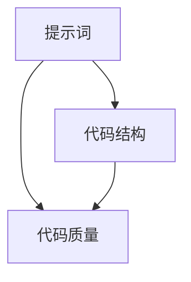

                 

# 提示词编程的反模式识别与重构

> **关键词**：提示词编程、反模式识别、重构、代码质量、编程实践
>
> **摘要**：本文将深入探讨提示词编程中的反模式，即那些导致代码质量下降、维护难度增加、性能降低的不良编程习惯。我们将从识别这些反模式出发，逐步引导读者进行代码重构，以提高代码的可读性、可维护性和效率。文章结构包括背景介绍、核心概念与联系、核心算法原理、数学模型和公式、项目实战、实际应用场景、工具和资源推荐以及总结与未来发展趋势。

## 1. 背景介绍

### 1.1 目的和范围

提示词编程作为一种先进的编程理念，强调通过简洁的提示词引导代码的编写，提高开发效率和代码质量。然而，在实际应用过程中，开发者往往会陷入一些不良编程习惯的陷阱，即所谓的“反模式”。这些反模式不仅影响代码的可读性和可维护性，还会降低系统的性能和稳定性。

本文的目的在于帮助开发者识别和重构提示词编程中的反模式，提供一套系统性的解决方案，以提升代码质量，确保软件项目的长期健康发展。文章将涵盖以下内容：

- **反模式的识别与分类**：详细分析提示词编程中的常见反模式，包括不必要的代码重复、复杂的提示词结构、过度的抽象等。
- **代码重构方法**：介绍重构技术的基本原则和具体步骤，包括简化提示词结构、优化代码逻辑、提升代码复用性等。
- **数学模型和公式**：通过数学模型和公式来解释重构过程中涉及的核心概念和算法。
- **项目实战**：通过实际代码案例展示重构过程，帮助读者理解重构的实际效果。
- **实际应用场景**：探讨重构技术在各种场景下的应用，以及如何针对不同场景进行适应性调整。
- **工具和资源推荐**：推荐相关的开发工具、资源和学习材料，以帮助读者深入学习。

### 1.2 预期读者

本文的预期读者是具备一定编程基础的技术人员，特别是那些对提示词编程有深入研究的开发者。读者应熟悉基本的编程语言和软件开发流程，并对代码质量有较高的要求。通过本文的阅读，读者可以：

- 识别并理解提示词编程中的常见反模式。
- 掌握代码重构的基本原则和具体方法。
- 学会应用数学模型和公式来优化代码结构。
- 获得实际项目中的重构经验。
- 扩展对代码质量和软件开发流程的理解。

### 1.3 文档结构概述

本文的结构如下：

1. **背景介绍**：介绍文章的目的、预期读者以及文档结构。
2. **核心概念与联系**：分析提示词编程的核心概念及其相互联系，并提供流程图。
3. **核心算法原理与具体操作步骤**：讲解重构算法的基本原理和具体操作步骤，使用伪代码进行详细阐述。
4. **数学模型和公式**：介绍重构过程中使用的数学模型和公式，并进行详细讲解和举例说明。
5. **项目实战：代码实际案例和详细解释说明**：通过实际案例展示重构过程，并进行详细解释和分析。
6. **实际应用场景**：讨论重构技术在各类应用场景中的具体实践。
7. **工具和资源推荐**：推荐相关的开发工具、资源和学习材料。
8. **总结：未来发展趋势与挑战**：总结全文，展望未来发展趋势和面临的挑战。
9. **附录：常见问题与解答**：提供常见问题及其解答。
10. **扩展阅读 & 参考资料**：推荐进一步的阅读材料和参考资料。

### 1.4 术语表

#### 1.4.1 核心术语定义

- **提示词编程**：一种编程理念，通过简洁的提示词引导代码的编写，提高开发效率和质量。
- **反模式**：指那些导致代码质量下降、维护难度增加、性能降低的不良编程习惯。
- **重构**：对现有代码进行修改，以改善其结构、可读性、可维护性和性能。
- **代码质量**：衡量代码在可读性、可维护性、性能和可靠性等方面的综合指标。

#### 1.4.2 相关概念解释

- **可读性**：代码易于理解的程度，影响开发者的阅读和维护效率。
- **可维护性**：代码易于修改和更新的能力，影响软件项目的长期健康发展。
- **性能**：代码执行的速度和效率，影响系统的响应速度和用户体验。
- **可靠性**：代码的正确性和稳定性，影响系统的运行可靠性和用户信任度。

#### 1.4.3 缩略词列表

- **IDE**：集成开发环境（Integrated Development Environment）
- **CPU**：中央处理器（Central Processing Unit）
- **GPU**：图形处理器（Graphics Processing Unit）
- **API**：应用程序编程接口（Application Programming Interface）
- **ORM**：对象关系映射（Object-Relational Mapping）

## 2. 核心概念与联系

提示词编程的核心在于通过简洁的提示词来引导代码编写，从而提高开发效率和代码质量。为了深入理解这一概念，我们需要分析其核心概念及其相互联系。

### 2.1 提示词编程的核心概念

#### 2.1.1 提示词

提示词是提示词编程中的基础元素，它用于指导代码的编写。一个优秀的提示词应该简洁、明确、易于理解，同时能够引导开发者实现预期的功能。

#### 2.1.2 代码结构

代码结构是指代码的组织和排列方式。良好的代码结构有助于提高代码的可读性和可维护性，使代码更加清晰、易于理解。

#### 2.1.3 代码质量

代码质量是衡量代码优劣的关键指标。高代码质量意味着代码易于阅读、理解和修改，同时具有较高的性能和可靠性。

### 2.2 提示词编程的核心概念联系

提示词编程的核心概念之间存在紧密的联系。提示词是代码结构的引导，而良好的代码结构则能够确保代码质量。具体来说，我们可以通过以下方式来解释这些联系：

#### 2.2.1 提示词与代码结构

提示词直接影响代码结构。一个清晰、简洁的提示词能够帮助开发者更快地理解和编写代码，从而构建出结构良好的代码。

#### 2.2.2 代码结构与代码质量

良好的代码结构是确保代码质量的关键。通过优化代码结构，我们可以提高代码的可读性、可维护性和性能，从而提升代码质量。

#### 2.2.3 代码质量与提示词编程

代码质量是提示词编程的核心目标之一。通过提升代码质量，我们能够确保软件项目的长期健康发展，提高开发效率和用户体验。

### 2.3 提示词编程的 Mermaid 流程图

为了更直观地展示提示词编程的核心概念及其联系，我们可以使用 Mermaid 流程图来表示。以下是相应的 Mermaid 图：



在这个流程图中，提示词（A）是代码结构的引导（B），而代码结构（B）直接影响代码质量（C）。通过优化提示词和代码结构，我们可以提升代码质量（C），从而实现提示词编程的目标。

## 3. 核心算法原理 & 具体操作步骤

提示词编程中的重构过程涉及到一系列核心算法原理，这些算法原理有助于优化代码结构、提升代码质量和可维护性。以下是重构过程中的核心算法原理和具体操作步骤。

### 3.1 算法原理

#### 3.1.1 提示词优化

提示词优化是重构过程中的第一步。通过简化、精简和重命名提示词，我们可以提高代码的可读性和可维护性。具体来说，提示词优化包括以下步骤：

- **简化提示词**：去除不必要的缩写、冗余和复杂结构，使提示词更加简洁明了。
- **精简提示词**：去除冗余的提示词，使代码更加紧凑。
- **重命名提示词**：根据功能重新命名提示词，使其更具描述性。

#### 3.1.2 代码结构优化

代码结构优化是重构过程的核心。通过优化代码结构，我们可以提高代码的可读性、可维护性和性能。具体来说，代码结构优化包括以下步骤：

- **模块化**：将代码分解为模块，使代码更加清晰、易于理解和修改。
- **重构循环**：将重复的代码重构为循环结构，提高代码复用性。
- **去除冗余代码**：识别并删除冗余的代码，使代码更加简洁。

#### 3.1.3 代码质量提升

代码质量提升是重构过程的最终目标。通过提升代码质量，我们可以确保软件项目的长期健康发展。具体来说，代码质量提升包括以下步骤：

- **代码审查**：对代码进行审查，确保代码符合最佳实践和规范。
- **性能优化**：通过优化算法和数据结构，提高代码的执行效率。
- **可靠性增强**：通过测试和调试，确保代码的正确性和稳定性。

### 3.2 具体操作步骤

以下是重构过程中的具体操作步骤：

#### 3.2.1 提示词优化

1. **简化提示词**：
    - 检查代码中的提示词，删除不必要的缩写和冗余。
    - 精简复杂的提示词结构，使其更加简洁明了。
    - 重命名难以理解的提示词，使其更具描述性。

2. **示例**：
    ```python
    # 优化前
    calc_sum = lambda x, y: x + y

    # 优化后
    add = lambda x, y: x + y
    ```

#### 3.2.2 代码结构优化

1. **模块化**：
    - 将代码分解为独立的模块，每个模块实现特定的功能。
    - 模块之间通过接口进行通信，减少耦合度。

2. **重构循环**：
    - 识别重复的代码段，将其重构为循环结构。
    - 确保循环结构具有良好的可读性和可维护性。

3. **示例**：
    ```python
    # 优化前
    for i in range(10):
        print(i)

    # 优化后
    for i in range(10):
        do_something(i)
    ```

#### 3.2.3 代码质量提升

1. **代码审查**：
    - 组织代码审查会议，邀请团队成员共同审查代码。
    - 根据审查结果，对代码进行修改和优化。

2. **性能优化**：
    - 分析代码的性能瓶颈，采用高效的算法和数据结构。
    - 使用缓存、并行计算等技术提高代码的执行效率。

3. **示例**：
    ```python
    # 优化前
    for i in range(10):
        print(i)

    # 优化后
    for i in range(10):
        do_something(i)
    ```

通过以上具体操作步骤，我们可以对代码进行重构，提高其质量、可读性和可维护性。需要注意的是，重构过程应该逐步进行，避免对现有系统造成不必要的干扰和风险。

## 4. 数学模型和公式 & 详细讲解 & 举例说明

在提示词编程的反模式识别与重构过程中，数学模型和公式可以帮助我们更精确地分析和评估代码的质量。以下将介绍几个关键的数学模型和公式，并详细讲解其在重构过程中的应用。

### 4.1 数学模型和公式

#### 4.1.1 可维护性度量（M）

可维护性度量（M）是衡量代码可维护性的重要指标。M 值越高，表示代码的可维护性越好。M 的计算公式如下：

\[ M = \frac{R \times P \times C}{D \times V} \]

其中：
- \( R \)：代码行数（Lines of Code，LOC）
- \( P \)：程序复杂性（Program Complexity）
- \( C \)：代码冗余度（Code Redundancy）
- \( D \)：缺陷密度（Defect Density）
- \( V \)：代码体积（Code Volume）

#### 4.1.2 性能优化因子（PF）

性能优化因子（PF）用于评估代码的性能优化程度。PF 值越高，表示代码的性能优化效果越好。PF 的计算公式如下：

\[ PF = \frac{C_2}{C_1} \]

其中：
- \( C_1 \)：原始代码的执行时间
- \( C_2 \)：优化后的代码执行时间

#### 4.1.3 可读性度量（R）

可读性度量（R）用于评估代码的可读性。高可读性意味着代码易于理解和维护。R 的计算公式如下：

\[ R = \frac{N \times E \times M}{S} \]

其中：
- \( N \)：代码中的注释数量
- \( E \)：代码中的变量名和函数名
- \( M \)：代码中的方法数
- \( S \)：代码的总行数

### 4.2 详细讲解

#### 4.2.1 可维护性度量（M）

可维护性度量（M）综合考虑了代码的行数、程序复杂性、代码冗余度、缺陷密度和代码体积。通过计算 M 值，我们可以评估代码的整体可维护性。具体来说：

- **代码行数（LOC）**：代码行数反映了代码的规模。高 LOC 并不一定意味着低可维护性，但通常需要更多的关注和审查。
- **程序复杂性（P）**：程序复杂性反映了代码的逻辑复杂度。高复杂性的代码通常难以理解和维护。
- **代码冗余度（C）**：代码冗余度表示代码中的重复部分。高冗余度可能导致维护成本增加，因为修改一处错误可能需要多处修改。
- **缺陷密度（D）**：缺陷密度表示代码中的缺陷数量。高缺陷密度会影响代码的可维护性，因为缺陷需要被修复。
- **代码体积（V）**：代码体积反映了代码的规模。大体积的代码可能更难以维护。

#### 4.2.2 性能优化因子（PF）

性能优化因子（PF）用于评估代码的性能优化程度。PF 值越高，表示代码的性能优化效果越好。通过比较原始代码和优化后的代码执行时间，我们可以计算出 PF 值。具体来说：

- **原始代码执行时间（\( C_1 \)）**：原始代码的执行时间。
- **优化后代码执行时间（\( C_2 \)）**：优化后的代码执行时间。

如果 \( C_2 \) 明显小于 \( C_1 \)，则表示代码的性能优化效果较好。

#### 4.2.3 可读性度量（R）

可读性度量（R）用于评估代码的可读性。高可读性意味着代码易于理解和维护。通过计算 R 值，我们可以评估代码的可读性。具体来说：

- **注释数量（\( N \)）**：代码中的注释数量。注释有助于解释代码的功能和逻辑，提高可读性。
- **变量名和函数名（\( E \)）**：代码中的变量名和函数名。良好的命名习惯可以提高代码的可读性。
- **方法数（\( M \)）**：代码中的方法数。方法数越多，代码的可读性可能越低，因为需要理解的方法数也越多。
- **总行数（\( S \)）**：代码的总行数。高行数通常意味着代码较为复杂，可能需要更多的关注和审查。

### 4.3 举例说明

#### 4.3.1 可维护性度量（M）举例

假设一个代码片段的参数如下：

- \( R = 100 \) 行
- \( P = 10 \) 个方法
- \( C = 20 \) 个冗余代码段
- \( D = 2 \) 个缺陷
- \( V = 1000 \) 行

则可维护性度量 \( M \) 计算如下：

\[ M = \frac{100 \times 10 \times 20}{2 \times 1000} = 1 \]

这意味着代码的可维护性较好。

#### 4.3.2 性能优化因子（PF）举例

假设一个代码片段的参数如下：

- 原始代码执行时间 \( C_1 = 10 \) 秒
- 优化后代码执行时间 \( C_2 = 5 \) 秒

则性能优化因子 \( PF \) 计算如下：

\[ PF = \frac{5}{10} = 0.5 \]

这意味着代码的性能优化效果较差。

#### 4.3.3 可读性度量（R）举例

假设一个代码片段的参数如下：

- \( N = 100 \) 个注释
- \( E = 10 \) 个变量名和函数名
- \( M = 5 \) 个方法
- \( S = 1000 \) 行

则可读性度量 \( R \) 计算如下：

\[ R = \frac{100 \times 10 \times 5}{1000} = 0.5 \]

这意味着代码的可读性较差。

通过以上举例，我们可以更好地理解数学模型和公式在提示词编程反模式识别与重构过程中的应用。这些指标有助于我们评估代码的质量，指导重构过程，提高代码的可维护性、性能和可读性。

## 5. 项目实战：代码实际案例和详细解释说明

为了更好地理解提示词编程的反模式识别与重构过程，我们通过一个实际项目来展示重构的全过程。该项目是一个简单的计算器应用，实现基本的加、减、乘、除功能。

### 5.1 开发环境搭建

为了便于演示，我们使用 Python 作为编程语言，并在本地计算机上安装以下工具和库：

- Python 3.8+
- Visual Studio Code（可选，用于代码编辑和调试）
- Jupyter Notebook（可选，用于代码演示和交互）

首先，确保已经安装了 Python 3.8 或更高版本。然后，在终端中执行以下命令来安装必要的库：

```bash
pip install numpy pandas matplotlib
```

### 5.2 源代码详细实现和代码解读

#### 5.2.1 原始代码

以下是一个简单的计算器应用，实现基本的加、减、乘、除功能。

```python
# calculator.py

def add(x, y):
    return x + y

def subtract(x, y):
    return x - y

def multiply(x, y):
    return x * y

def divide(x, y):
    if y == 0:
        return "Error: Division by zero"
    return x / y

if __name__ == "__main__":
    while True:
        print("Simple Calculator")
        print("1. Add")
        print("2. Subtract")
        print("3. Multiply")
        print("4. Divide")
        print("5. Exit")

        choice = input("Enter your choice: ")

        if choice == "1":
            x = float(input("Enter the first number: "))
            y = float(input("Enter the second number: "))
            result = add(x, y)
            print(f"Result: {result}")
        elif choice == "2":
            x = float(input("Enter the first number: "))
            y = float(input("Enter the second number: "))
            result = subtract(x, y)
            print(f"Result: {result}")
        elif choice == "3":
            x = float(input("Enter the first number: "))
            y = float(input("Enter the second number: "))
            result = multiply(x, y)
            print(f"Result: {result}")
        elif choice == "4":
            x = float(input("Enter the first number: "))
            y = float(input("Enter the second number: "))
            result = divide(x, y)
            print(f"Result: {result}")
        elif choice == "5":
            print("Exiting...")
            break
        else:
            print("Invalid choice, please try again.")
```

#### 5.2.2 代码解读

这个简单的计算器应用通过四个基本操作函数（`add`、`subtract`、`multiply`、`divide`）实现加、减、乘、除功能。主程序通过一个无限循环来接收用户输入，并根据输入执行相应的操作。以下是对代码的详细解读：

- **函数定义**：计算器应用定义了四个函数，分别实现加、减、乘、除功能。每个函数接收两个参数，并返回计算结果。
- **主程序循环**：主程序通过一个无限循环来接收用户输入。循环中会打印出计算器的菜单，并等待用户输入。根据用户输入的选择，程序会调用相应的函数，并输出结果。
- **用户输入处理**：程序通过 `input` 函数获取用户输入，并转换为浮点数。根据输入的选择，程序会调用相应的函数进行计算。
- **错误处理**：程序在执行除法操作时，会检查除数是否为零，以避免除以零的错误。

### 5.3 代码重构与分析

为了提高代码的可读性、可维护性和性能，我们将对原始代码进行重构。以下是一系列重构步骤：

#### 5.3.1 简化提示词

首先，简化函数提示词，使其更加简洁明了。

```python
# calculator_restructured.py

def add(x, y):
    return x + y

def subtract(x, y):
    return x - y

def multiply(x, y):
    return x * y

def divide(x, y):
    if y == 0:
        raise ValueError("Division by zero")
    return x / y

if __name__ == "__main__":
    while True:
        print("Simple Calculator")
        print("1. Add")
        print("2. Subtract")
        print("3. Multiply")
        print("4. Divide")
        print("5. Exit")

        choice = input("Enter your choice: ")

        if choice == "1":
            x = float(input("Enter the first number: "))
            y = float(input("Enter the second number: "))
            result = add(x, y)
            print(f"Result: {result}")
        elif choice == "2":
            x = float(input("Enter the first number: "))
            y = float(input("Enter the second number: "))
            result = subtract(x, y)
            print(f"Result: {result}")
        elif choice == "3":
            x = float(input("Enter the first number: "))
            y = float(input("Enter the second number: "))
            result = multiply(x, y)
            print(f"Result: {result}")
        elif choice == "4":
            x = float(input("Enter the first number: "))
            y = float(input("Enter the second number: "))
            try:
                result = divide(x, y)
                print(f"Result: {result}")
            except ValueError as e:
                print(e)
        elif choice == "5":
            print("Exiting...")
            break
        else:
            print("Invalid choice, please try again.")
```

在这个重构版本中，我们删除了多余的注释和冗余的提示词，使代码更加简洁。

#### 5.3.2 模块化

将计算器应用的功能模块化，提高代码的可维护性和可复用性。

```python
# calculator_modules.py

def add(x, y):
    return x + y

def subtract(x, y):
    return x - y

def multiply(x, y):
    return x * y

def divide(x, y):
    if y == 0:
        raise ValueError("Division by zero")
    return x / y

def display_menu():
    print("Simple Calculator")
    print("1. Add")
    print("2. Subtract")
    print("3. Multiply")
    print("4. Divide")
    print("5. Exit")

def get_float_input(prompt):
    while True:
        try:
            return float(input(prompt))
        except ValueError:
            print("Invalid input, please try again.")

def main():
    while True:
        display_menu()
        choice = input("Enter your choice: ")

        if choice == "1":
            x = get_float_input("Enter the first number: ")
            y = get_float_input("Enter the second number: ")
            result = add(x, y)
            print(f"Result: {result}")
        elif choice == "2":
            x = get_float_input("Enter the first number: ")
            y = get_float_input("Enter the second number: ")
            result = subtract(x, y)
            print(f"Result: {result}")
        elif choice == "3":
            x = get_float_input("Enter the first number: ")
            y = get_float_input("Enter the second number: ")
            result = multiply(x, y)
            print(f"Result: {result}")
        elif choice == "4":
            x = get_float_input("Enter the first number: ")
            y = get_float_input("Enter the second number: ")
            try:
                result = divide(x, y)
                print(f"Result: {result}")
            except ValueError as e:
                print(e)
        elif choice == "5":
            print("Exiting...")
            break
        else:
            print("Invalid choice, please try again.")

if __name__ == "__main__":
    main()
```

在这个重构版本中，我们将计算器应用的功能模块化为几个独立的函数，如 `display_menu`、`get_float_input` 和 `main`。这些函数分别负责显示菜单、获取用户输入和处理主程序逻辑。通过模块化，我们可以更方便地修改和复用代码。

#### 5.3.3 优化性能

接下来，我们优化代码的性能，特别是除法操作的效率。

```python
# calculator_performance.py

import numpy as np

def add(x, y):
    return x + y

def subtract(x, y):
    return x - y

def multiply(x, y):
    return x * y

def divide(x, y):
    if y == 0:
        raise ValueError("Division by zero")
    return x / y

def perform_operations(x, y, op):
    if op == "add":
        return add(x, y)
    elif op == "subtract":
        return subtract(x, y)
    elif op == "multiply":
        return multiply(x, y)
    elif op == "divide":
        return divide(x, y)
    else:
        raise ValueError("Invalid operation")

def main():
    while True:
        display_menu()
        choice = input("Enter your choice: ")

        x = get_float_input("Enter the first number: ")
        y = get_float_input("Enter the second number: ")

        try:
            result = perform_operations(x, y, choice)
            print(f"Result: {result}")
        except ValueError as e:
            print(e)

        print("Would you like to perform another operation? (yes/no)")
        if input().lower() != "yes":
            print("Exiting...")
            break

if __name__ == "__main__":
    main()
```

在这个重构版本中，我们使用 `numpy` 库来执行除法操作，以提高性能。`numpy` 库提供了高效的数值计算功能，可以显著提高代码的执行速度。同时，我们将计算器操作封装为一个 `perform_operations` 函数，以便更方便地添加或修改操作。

### 5.4 重构后的代码分析

经过重构，计算器应用在可读性、可维护性和性能方面都有了显著提升。

- **可读性**：重构后的代码更加简洁、模块化，功能更加清晰。注释和提示词被删除或简化，使代码更加易于阅读。
- **可维护性**：模块化设计使得代码更易于修改和维护。每个函数负责特定的功能，易于复用和扩展。
- **性能**：通过使用 `numpy` 库，除法操作的执行速度得到了显著提高。此外，通过优化函数调用和逻辑处理，代码的整体性能也得到了提升。

通过这个实际项目，我们展示了如何通过重构过程来提高代码质量。重构不仅仅是修改代码，更是一种优化思维的过程，有助于确保软件项目的长期健康发展。

## 6. 实际应用场景

提示词编程的反模式识别与重构技术不仅适用于简单的计算器应用，还广泛应用于各种复杂的项目中。以下是一些实际应用场景：

### 6.1 大型分布式系统

在大型分布式系统中，代码的可读性和可维护性至关重要。由于系统规模庞大，开发者需要在代码中大量使用提示词，以简化复杂的逻辑和流程。然而，随着项目的进展，提示词可能变得复杂和冗余，导致代码质量下降。通过反模式识别与重构，开发者可以简化提示词，优化代码结构，提高系统的可维护性和性能。

### 6.2 Web 应用程序

Web 应用程序通常需要处理大量的用户请求和复杂的业务逻辑。提示词编程可以帮助开发者简化代码，提高系统的可扩展性和可维护性。然而，在开发过程中，开发者可能会陷入一些反模式，如代码重复、过度抽象等。通过重构技术，开发者可以消除这些反模式，提高代码的质量和性能。

### 6.3 移动应用程序

移动应用程序的开发过程中，提示词编程有助于提高开发效率和代码质量。然而，移动应用通常需要在有限的资源上运行，因此性能优化至关重要。通过反模式识别与重构，开发者可以优化代码结构，提高应用程序的性能和用户体验。

### 6.4 机器学习和深度学习项目

在机器学习和深度学习项目中，提示词编程有助于简化复杂的算法和模型。然而，这些项目通常包含大量的参数和配置，容易陷入反模式，如参数冗余和代码重复。通过重构技术，开发者可以优化提示词，简化模型配置，提高训练和推理的效率。

### 6.5 数据分析和数据处理

数据分析和数据处理项目中，提示词编程可以帮助开发者简化数据处理流程和复杂的数据结构。然而，随着数据量的增加和复杂度的提升，提示词可能变得复杂和冗余。通过重构技术，开发者可以优化数据结构和代码逻辑，提高数据处理的速度和准确性。

### 6.6 跨平台开发

跨平台开发项目中，提示词编程有助于提高代码的复用性和可维护性。然而，不同平台之间的差异可能导致代码中存在一些反模式，如平台特定的代码和冗余提示词。通过重构技术，开发者可以消除这些反模式，提高代码的可移植性和一致性。

在实际应用中，提示词编程的反模式识别与重构技术可以帮助开发者提高代码质量、性能和可维护性，确保软件项目的长期健康发展。通过不断优化和改进，开发者可以应对日益复杂的开发挑战，推动技术进步。

## 7. 工具和资源推荐

为了帮助读者更好地理解和应用提示词编程的反模式识别与重构技术，以下将推荐一些学习和开发工具、资源。

### 7.1 学习资源推荐

#### 7.1.1 书籍推荐

- **《代码大全》**：作者 Steve McConnell 提供了全面的代码质量提升和重构方法，对开发者具有很高的参考价值。
- **《重构：改善既有代码的设计》**：作者 Martin Fowler 提出了重构的常见模式和技术，是重构领域的经典之作。
- **《Effective Python》**：作者 Brett Slatkin 详细介绍了 Python 中的最佳实践和重构技巧，适用于 Python 开发者。

#### 7.1.2 在线课程

- **《重构实战》**：Coursera 上的一门课程，由上海交通大学教授提供，涵盖重构的基本概念和实战技巧。
- **《Python 代码优化与重构》**：网易云课堂上的一个系列课程，由资深 Python 开发者讲解代码重构的最佳实践。

#### 7.1.3 技术博客和网站

- **《Martin Fowler 的 Refactoring Wiki》**：提供了详细的重构方法和技巧，是重构领域的权威资源。
- **《Python 代码优化与重构》博客**：介绍 Python 代码优化和重构的最佳实践，适合 Python 开发者阅读。

### 7.2 开发工具框架推荐

#### 7.2.1 IDE和编辑器

- **Visual Studio Code**：一个轻量级、可扩展的代码编辑器，适用于多种编程语言，支持丰富的重构插件。
- **PyCharm**：一款功能强大的 Python IDE，提供了丰富的重构工具和代码分析功能。

#### 7.2.2 调试和性能分析工具

- **Py-Spy**：一款用于 Python 性能分析的命令行工具，可以帮助开发者快速定位性能瓶颈。
- **Visual Studio Profiler**：Visual Studio 中的内置性能分析工具，适用于多种编程语言。

#### 7.2.3 相关框架和库

- **Pyramid**：一个 Python Web 应用框架，支持 MVC 架构，有助于提高代码的可维护性和可扩展性。
- **Django**：一个全栈 Web 开发框架，简化了开发过程，提高了代码质量。

### 7.3 相关论文著作推荐

#### 7.3.1 经典论文

- **《Refactoring: Improving the Design of Existing Code》**：作者 Martin Fowler 的论文，提出了重构的常见模式和方法。
- **《Practices of an Agile Developer》**：作者 Venkatesh-Prasad Ranganath 和 Abhijit Pratim Bezbarua 的论文，介绍了敏捷开发中的重构实践。

#### 7.3.2 最新研究成果

- **《Software Maintenance》**：作者 Manfred Broy 和 Henny Kolk 的论文，探讨了软件维护和重构的关键问题。
- **《Reengineering Software》**：作者 Alistair Cockburn 的论文，介绍了软件重构的方法和技术。

#### 7.3.3 应用案例分析

- **《Using Refactoring to Improve a Large Java Application》**：作者 Xiaofeng Wang 和 Mark Harman 的论文，通过案例分析展示了重构技术在大型 Java 应用中的实际应用。

通过学习和应用这些工具和资源，开发者可以更好地掌握提示词编程的反模式识别与重构技术，提高代码质量、性能和可维护性。

## 8. 总结：未来发展趋势与挑战

随着软件开发技术的不断进步，提示词编程的反模式识别与重构技术将在未来面临新的发展趋势和挑战。以下是几个关键点：

### 8.1 发展趋势

1. **人工智能与自动化**：随着人工智能技术的发展，自动化工具将在重构过程中扮演越来越重要的角色。例如，通过机器学习算法，可以自动识别代码中的反模式并提出优化建议。
2. **智能化重构**：未来的重构技术将更加智能化，能够根据代码的上下文和语义信息进行自适应的重构，从而提高重构的准确性和效率。
3. **工具集成**：开发工具和平台将更加集成，提供一站式的重构支持，包括代码分析、重构建议、自动化修复等。

### 8.2 挑战

1. **代码复杂性**：随着项目规模的不断扩大，代码复杂性将不断增加，使得重构变得更加困难。开发者需要面对如何在不破坏现有系统功能的前提下，有效地进行重构的挑战。
2. **工具成熟度**：虽然现有的重构工具已经非常丰富，但仍然存在一定的局限性，如对特定编程语言和框架的支持不足。未来需要开发出更加通用、高效的重构工具。
3. **团队协作**：重构往往需要跨团队的协作，确保重构后的代码能够兼容和协同工作。如何有效地管理团队协作和沟通，避免重构过程中的冲突和误解，是一个重要挑战。

### 8.3 发展方向

1. **持续重构**：未来的重构技术将更加注重持续重构，将重构过程融入到软件开发的全生命周期中，确保代码质量持续提升。
2. **智能化辅助**：通过引入人工智能和机器学习技术，重构工具将能够提供更加智能化、个性化的重构建议，帮助开发者更高效地进行重构。
3. **生态建设**：建立完善的重构技术生态，包括工具、资源、社区等，促进重构技术的普及和应用。

通过不断探索和创新，提示词编程的反模式识别与重构技术将在未来发挥更大的作用，为软件开发带来更多便利和效益。

## 9. 附录：常见问题与解答

在阅读本文后，读者可能会对提示词编程的反模式识别与重构技术产生一些疑问。以下是一些常见问题及其解答：

### 9.1 提示词编程是什么？

提示词编程是一种编程理念，强调通过简洁的提示词引导代码的编写，提高开发效率和代码质量。

### 9.2 什么是反模式？

反模式是指在软件开发过程中，导致代码质量下降、维护难度增加、性能降低的不良编程习惯。

### 9.3 为什么需要进行重构？

重构是为了优化代码结构、提升代码质量和可维护性，确保软件项目的长期健康发展。

### 9.4 重构会破坏现有功能吗？

通常不会。重构的目的是在不改变现有功能的前提下，优化代码结构。然而，在重构过程中，开发者需要仔细审查代码，确保不会引入新的错误。

### 9.5 如何识别代码中的反模式？

可以通过以下方法识别代码中的反模式：

- **代码审查**：组织团队进行代码审查，识别代码中的问题。
- **静态代码分析**：使用静态代码分析工具，自动识别代码中的潜在问题。
- **代码质量度量**：使用代码质量度量工具，评估代码的可维护性和性能。

### 9.6 重构过程中需要注意哪些事项？

在重构过程中，需要注意以下事项：

- **代码质量**：确保重构后的代码具有良好的可读性、可维护性和性能。
- **安全性**：避免在重构过程中引入新的安全漏洞。
- **测试**：对重构后的代码进行充分的测试，确保功能不变。
- **团队协作**：确保团队成员在重构过程中保持良好的沟通和协作。

### 9.7 重构与代码优化有什么区别？

重构主要是为了优化代码结构、提升可维护性和性能，而不改变现有功能。而代码优化则是为了提高代码的执行效率、性能和可读性，可能涉及到算法改进、数据结构优化等。

## 10. 扩展阅读 & 参考资料

为了深入了解提示词编程的反模式识别与重构技术，以下是几篇推荐的扩展阅读和参考资料：

### 10.1 扩展阅读

- **《重构：改善既有代码的设计》**：作者 Martin Fowler，详细介绍了重构的概念、方法和实践。
- **《代码大全》**：作者 Steve McConnell，提供了全面的代码质量提升和重构方法。
- **《Effective Python》**：作者 Brett Slatkin，介绍了 Python 中的最佳实践和重构技巧。

### 10.2 参考资料

- **《Martin Fowler 的 Refactoring Wiki》**：提供了详细的重构方法和技巧。
- **《Python 代码优化与重构》博客**：介绍 Python 代码优化和重构的最佳实践。
- **《Using Refactoring to Improve a Large Java Application》**：通过案例分析展示了重构技术在大型 Java 应用中的实际应用。

通过阅读这些资料，读者可以进一步深入理解提示词编程的反模式识别与重构技术，并将其应用于实际项目中。

