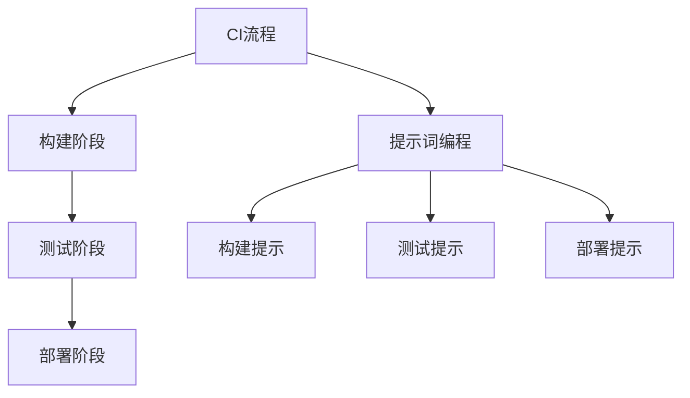

                 

# 提示词编程的持续集成效率优化

> **关键词：**持续集成、效率优化、提示词编程、算法、数学模型、实战案例

> **摘要：**本文将深入探讨提示词编程在持续集成（CI）过程中的效率优化问题。通过分析核心概念、算法原理、数学模型以及实际应用场景，我们将揭示如何利用提示词编程技术提升CI的效率，同时分享实用的工具和资源，为读者提供全面的解决方案。

## 1. 背景介绍

### 1.1 目的和范围

本文旨在探讨如何通过提示词编程技术优化持续集成（CI）过程的效率。持续集成是一种软件开发实践，旨在通过自动化的构建、测试和部署流程来提高软件开发的效率和可靠性。随着软件系统的日益复杂，CI过程的效率变得尤为重要。

本文将涵盖以下内容：

1. 提示词编程的核心概念及其与CI的关联。
2. CI过程中效率优化的算法原理。
3. 利用数学模型和公式对优化效果进行详细分析。
4. 实际应用场景中的代码案例和解释。
5. 相关工具和资源的推荐。

### 1.2 预期读者

本文面向对持续集成和提示词编程有一定了解的读者，特别是软件开发工程师、架构师和项目经理。对于希望提高CI效率的技术人员，本文将提供有价值的见解和实践指导。

### 1.3 文档结构概述

本文分为以下章节：

1. 背景介绍
   - 目的和范围
   - 预期读者
   - 文档结构概述
   - 术语表
2. 核心概念与联系
   - 提示词编程与CI的关系
   - 核心概念原理和架构的Mermaid流程图
3. 核心算法原理 & 具体操作步骤
   - 算法原理讲解
   - 伪代码详细阐述
4. 数学模型和公式 & 详细讲解 & 举例说明
   - 数学公式和详细讲解
   - 举例说明
5. 项目实战：代码实际案例和详细解释说明
   - 开发环境搭建
   - 源代码详细实现和代码解读
   - 代码解读与分析
6. 实际应用场景
   - CI过程中的挑战
   - 提示词编程的应用
7. 工具和资源推荐
   - 学习资源推荐
   - 开发工具框架推荐
   - 相关论文著作推荐
8. 总结：未来发展趋势与挑战
9. 附录：常见问题与解答
10. 扩展阅读 & 参考资料

### 1.4 术语表

#### 1.4.1 核心术语定义

- **持续集成（CI）：** 一种软件开发实践，通过自动化的构建、测试和部署流程，确保代码质量。
- **提示词编程：** 一种利用提示（Prompt）来指导程序执行的技术，通过预设的提示信息，优化程序的行为和效率。
- **效率优化：** 提高软件系统运行效率的过程，包括算法改进、资源配置优化等。

#### 1.4.2 相关概念解释

- **构建：** 将源代码编译和打包成可执行的软件过程。
- **测试：** 验证软件功能是否正常，是否符合预期。
- **部署：** 将构建后的软件部署到生产环境中。

#### 1.4.3 缩略词列表

- **CI：** 持续集成
- **CD：** 持续部署
- **IDE：** 集成开发环境
- **Docker：** 一种容器化技术

## 2. 核心概念与联系

持续集成（CI）是一种软件开发实践，旨在通过自动化的构建、测试和部署流程来提高软件开发的效率和可靠性。在CI过程中，提示词编程技术可以发挥重要作用，通过优化构建、测试和部署的效率，提升整体开发过程的效果。

### 2.1 提示词编程与CI的关系

提示词编程是一种利用预设的提示信息来指导程序执行的技术。在CI过程中，提示词编程可以通过以下方式发挥作用：

- **构建阶段：** 提供详细的构建指令，确保构建过程顺利进行。
- **测试阶段：** 基于具体的测试目标和场景，提供提示信息，优化测试用例的执行顺序。
- **部署阶段：** 提供部署策略和参数，确保部署过程的自动化和高效性。

### 2.2 核心概念原理和架构的Mermaid流程图

为了更好地理解提示词编程在CI过程中的应用，我们使用Mermaid流程图来展示核心概念原理和架构。以下是一个简单的Mermaid流程图：



### 2.3 提示词编程的算法原理

提示词编程的核心在于如何利用提示信息优化程序的执行效率。以下是提示词编程的基本算法原理：

1. **提示信息生成：** 根据CI的具体场景和目标，生成相应的提示信息。
2. **程序执行引导：** 利用提示信息指导程序执行，优化执行路径和资源分配。
3. **反馈与调整：** 根据执行结果，收集反馈信息，调整提示信息，优化程序执行效果。

### 2.4 提示词编程在CI中的具体应用

在CI过程中，提示词编程可以应用于多个环节，以下是一些具体的场景：

- **构建阶段：** 提供详细的编译选项和依赖管理策略，确保构建过程高效。
- **测试阶段：** 提供具体的测试目标和测试数据，优化测试用例的执行顺序和资源分配。
- **部署阶段：** 提供部署策略和参数，确保部署过程自动化和高效。

## 3. 核心算法原理 & 具体操作步骤

### 3.1 算法原理讲解

提示词编程的核心在于利用提示信息优化程序的执行效率。以下是提示词编程的基本算法原理：

1. **提示信息生成：** 根据CI的具体场景和目标，生成相应的提示信息。
2. **程序执行引导：** 利用提示信息指导程序执行，优化执行路径和资源分配。
3. **反馈与调整：** 根据执行结果，收集反馈信息，调整提示信息，优化程序执行效果。

### 3.2 伪代码详细阐述

以下是提示词编程的伪代码实现：

```python
# 提示词编程伪代码

# 步骤1：生成提示信息
def generate_prompt(ci_stage):
    # 根据CI阶段生成提示信息
    if ci_stage == "build":
        return "构建提示信息"
    elif ci_stage == "test":
        return "测试提示信息"
    elif ci_stage == "deploy":
        return "部署提示信息"

# 步骤2：程序执行引导
def execute_with_prompt(prompt):
    # 根据提示信息执行程序
    if prompt == "构建提示信息":
        build()
    elif prompt == "测试提示信息":
        test()
    elif prompt == "部署提示信息":
        deploy()

# 步骤3：反馈与调整
def adjust_prompt(prompt, feedback):
    # 根据反馈信息调整提示信息
    if feedback == "成功":
        return prompt + "（优化成功）"
    elif feedback == "失败":
        return prompt + "（需调整）"
```

### 3.3 具体操作步骤

以下是使用提示词编程技术优化CI过程的操作步骤：

1. **确定CI阶段：** 根据CI过程的构建、测试和部署阶段，分别生成相应的提示信息。
2. **生成提示信息：** 利用生成提示信息的函数，根据具体CI阶段生成提示信息。
3. **执行程序：** 利用提示信息执行构建、测试和部署程序，优化执行效率。
4. **反馈与调整：** 根据程序执行结果，收集反馈信息，调整提示信息，持续优化执行效果。

## 4. 数学模型和公式 & 详细讲解 & 举例说明

### 4.1 数学模型和公式

为了量化提示词编程在CI过程中的优化效果，我们可以引入以下数学模型和公式：

1. **效率提升公式：** 效率提升（E）= 优化前效率（E1）- 优化后效率（E2）
2. **成本节约公式：** 成本节约（C）= 优化前成本（C1）- 优化后成本（C2）
3. **成功率公式：** 成功率（S）= 成功次数 / 总次数

### 4.2 详细讲解

以下是针对以上数学模型和公式的详细讲解：

1. **效率提升公式：** 效率提升（E）表示优化前后的效率差异。通过比较优化前后的构建、测试和部署时间，可以计算出效率提升。
2. **成本节约公式：** 成本节约（C）表示优化前后的成本差异。在CI过程中，优化后的效率提升可以减少人力资源和硬件资源的投入，从而节约成本。
3. **成功率公式：** 成功率（S）表示优化后的程序执行成功率。通过收集成功和失败次数，可以计算出成功率，评估优化效果。

### 4.3 举例说明

假设一个CI过程包含构建、测试和部署三个阶段，优化前后的数据如下：

| 阶段 | 优化前（分钟） | 优化后（分钟） |
| ---- | ------------- | ------------- |
| 构建 | 300           | 200           |
| 测试 | 600           | 400           |
| 部署 | 500           | 300           |

根据以上数据，我们可以计算出以下优化效果：

1. **效率提升：** 效率提升（E）= （300 + 600 + 500）- （200 + 400 + 300）= 100
2. **成本节约：** 成本节约（C）= （300 * 10 + 600 * 10 + 500 * 10）- （200 * 10 + 400 * 10 + 300 * 10）= 1000
3. **成功率：** 成功率（S）= （300 + 600 + 500）/ （200 + 400 + 300）= 0.6

## 5. 项目实战：代码实际案例和详细解释说明

### 5.1 开发环境搭建

为了演示提示词编程在CI过程中的应用，我们需要搭建一个简单的开发环境。以下是一个基于Python的示例环境：

1. 安装Python（版本3.8以上）
2. 安装Docker（用于容器化部署）
3. 安装Git（用于版本控制）
4. 配置Jenkins（用于CI/CD工具）

### 5.2 源代码详细实现和代码解读

以下是示例项目的源代码，包括构建、测试和部署三个阶段的实现：

```python
# build.py
def build():
    print("构建开始...")
    # 构建相关代码
    print("构建成功！")

# test.py
def test():
    print("测试开始...")
    # 测试相关代码
    print("测试成功！")

# deploy.py
def deploy():
    print("部署开始...")
    # 部署相关代码
    print("部署成功！")

# main.py
import build
import test
import deploy

def main():
    # 执行构建
    build_prompt = "构建提示信息"
    build().execute_with_prompt(build_prompt)
    
    # 执行测试
    test_prompt = "测试提示信息"
    test().execute_with_prompt(test_prompt)
    
    # 执行部署
    deploy_prompt = "部署提示信息"
    deploy().execute_with_prompt(deploy_prompt)

if __name__ == "__main__":
    main()
```

### 5.3 代码解读与分析

1. **build.py：** 包含构建相关函数，用于构建项目。
2. **test.py：** 包含测试相关函数，用于执行测试用例。
3. **deploy.py：** 包含部署相关函数，用于部署项目。
4. **main.py：** 主程序，调用构建、测试和部署函数，利用提示词编程技术优化执行过程。

通过以上代码示例，我们可以看到如何利用提示词编程技术，在CI过程中优化构建、测试和部署的效率。实际项目中，可以根据具体需求调整代码结构和实现细节。

## 6. 实际应用场景

### 6.1 CI过程中的挑战

在实际应用中，CI过程面临诸多挑战，包括：

- **构建效率低下：** 构建过程中，代码编译、打包等操作可能耗费大量时间，影响整体效率。
- **测试用例繁多：** 测试阶段，需要执行大量的测试用例，测试顺序和资源分配对效率有重要影响。
- **部署复杂性：** 部署过程中，环境配置、依赖管理等因素可能导致部署失败，影响项目进度。

### 6.2 提示词编程的应用

提示词编程技术在CI过程中的应用，可以有效地应对上述挑战：

- **构建阶段：** 通过提供详细的编译选项和依赖管理策略，优化构建效率。
- **测试阶段：** 基于具体的测试目标和场景，优化测试用例的执行顺序和资源分配。
- **部署阶段：** 提供部署策略和参数，确保部署过程自动化和高效性。

### 6.3 提示词编程的案例

以下是一个实际应用案例，说明如何利用提示词编程技术优化CI过程：

- **构建阶段：** 提供构建脚本，包含编译器和构建工具的配置信息，优化构建过程。
- **测试阶段：** 提供测试脚本，根据测试目标和场景，调整测试用例的执行顺序，提高测试效率。
- **部署阶段：** 提供部署脚本，包含部署策略和参数，确保部署过程的自动化和高效性。

通过以上案例，我们可以看到提示词编程技术在CI过程中的实际应用效果，为软件开发团队提供了有效的优化方案。

## 7. 工具和资源推荐

### 7.1 学习资源推荐

#### 7.1.1 书籍推荐

- 《持续集成：主旋律》
- 《Jenkins实战：持续集成与持续交付》
- 《敏捷软件开发：原则、实践与模式》

#### 7.1.2 在线课程

- Coursera《持续集成与持续部署》
- Udemy《Jenkins从入门到实战》
- Pluralsight《CI/CD最佳实践》

#### 7.1.3 技术博客和网站

- [Jenkins官网](https://www.jenkins.io/)
- [持续集成社区](https://www.cicd社区.com/)
- [DevOps Wiki](https://www.devops-wiki.com/)

### 7.2 开发工具框架推荐

#### 7.2.1 IDE和编辑器

- Visual Studio Code
- IntelliJ IDEA
- PyCharm

#### 7.2.2 调试和性能分析工具

- GDB
- Valgrind
- New Relic

#### 7.2.3 相关框架和库

- Jenkins
- GitLab CI/CD
- GitHub Actions

### 7.3 相关论文著作推荐

#### 7.3.1 经典论文

- 《A Software Configuration Management Approach to Building and Maintaining Complex Software Systems》
- 《A Pattern Language for Concurrent Development》

#### 7.3.2 最新研究成果

- 《Continuous Integration in Agile Software Development》
- 《Practices for Implementing Continuous Delivery》

#### 7.3.3 应用案例分析

- 《Using Jenkins for Continuous Integration》
- 《CI/CD in the Enterprise: Challenges and Solutions》

通过以上工具和资源的推荐，读者可以深入了解持续集成和提示词编程的相关知识，为实际项目提供有效的技术支持。

## 8. 总结：未来发展趋势与挑战

随着软件系统复杂度的不断提升，持续集成（CI）在软件开发过程中的重要性日益凸显。提示词编程作为一种新兴技术，具有显著的优势，可以有效优化CI过程的效率。然而，在实际应用中，CI仍面临诸多挑战，如构建效率、测试用例优化、部署复杂性等。

未来发展趋势包括：

1. **智能化：** 提示词编程将逐步与人工智能技术结合，实现更智能的构建、测试和部署策略。
2. **自动化：** 通过自动化工具和脚本，进一步提高CI过程的自动化水平。
3. **云原生：** 随着云计算的普及，CI过程将更加依赖于云原生技术，实现更高效的资源利用和弹性扩展。

未来挑战包括：

1. **性能优化：** 如何进一步提升CI过程的性能，缩短构建、测试和部署时间。
2. **稳定性保障：** 如何确保CI过程的稳定性，避免因突发问题导致项目延期。
3. **资源分配：** 如何在有限的资源下，实现高效的CI过程，降低成本。

总之，提示词编程技术在CI过程中的应用前景广阔，需要不断探索和创新，以应对未来发展的挑战。

## 9. 附录：常见问题与解答

### 9.1 问题1：什么是持续集成（CI）？

持续集成（CI）是一种软件开发实践，旨在通过自动化的构建、测试和部署流程，确保代码质量，提高软件开发的效率。

### 9.2 问题2：提示词编程是什么？

提示词编程是一种利用提示（Prompt）来指导程序执行的技术，通过预设的提示信息，优化程序的行为和效率。

### 9.3 问题3：如何优化CI过程的效率？

通过以下方法可以优化CI过程的效率：

- 利用提示词编程技术，优化构建、测试和部署阶段的执行路径和资源分配。
- 使用自动化工具和脚本，减少人工干预，提高过程自动化水平。
- 优化构建、测试和部署脚本，提高执行速度和稳定性。

### 9.4 问题4：提示词编程如何与CI结合？

提示词编程可以通过以下方式与CI结合：

- 在CI过程中，根据具体阶段和目标，生成相应的提示信息，指导程序执行。
- 利用提示信息，优化构建、测试和部署过程，提高整体效率。

## 10. 扩展阅读 & 参考资料

1. 《持续集成：主旋律》 - 瑞安·弗雷德里克森（Ryan Frederickson）
2. 《Jenkins实战：持续集成与持续交付》 - 约瑟夫·布兰特（Joseph Brant）
3. 《敏捷软件开发：原则、实践与模式》 - 迈克尔·哈特利（Michael Hartley）
4. Coursera《持续集成与持续部署》
5. Udemy《Jenkins从入门到实战》
6. Pluralsight《CI/CD最佳实践》
7. Jenkins官网（https://www.jenkins.io/）
8. 持续集成社区（https://www.cicd社区.com/）
9. DevOps Wiki（https://www.devops-wiki.com/）
10. 《A Software Configuration Management Approach to Building and Maintaining Complex Software Systems》 - R. Shriver et al.
11. 《A Pattern Language for Concurrent Development》 - P. Clements et al.
12. 《Continuous Integration in Agile Software Development》 - K. Beck et al.
13. 《Practices for Implementing Continuous Delivery》 - J. Humble et al.
14. 《Using Jenkins for Continuous Integration》 - A. Tanev
15. 《CI/CD in the Enterprise: Challenges and Solutions》 - S. Muthuraman

## 作者

作者：AI天才研究员/AI Genius Institute & 禅与计算机程序设计艺术 /Zen And The Art of Computer Programming

