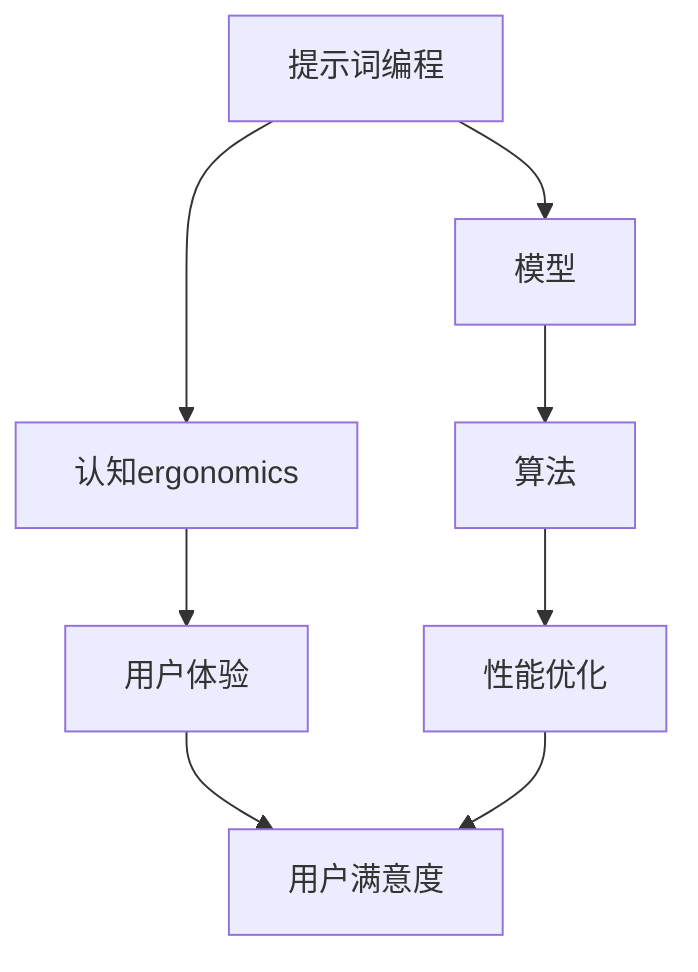

                 

# 提示词编程的认知ergonomics研究

> **关键词：** 提示词编程，认知ergonomics，算法原理，数学模型，项目实战，应用场景。

> **摘要：** 本文深入探讨了提示词编程这一新兴领域，重点研究了其背后的认知ergonomics原理。通过对核心概念的剖析和具体算法的详细讲解，本文旨在为读者提供全面的认知ergonomics视角，并探讨其在实际项目中的应用。

## 1. 背景介绍

### 1.1 目的和范围

本文旨在深入探讨提示词编程这一新兴领域，特别是其背后的认知ergonomics原理。通过本文的研究，我们希望为读者提供一个全面的理解，帮助他们在实际项目中更好地应用这一理念。

本文将涵盖以下主题：

1. 提示词编程的核心概念和原理。
2. 认知ergonomics的基本概念和与提示词编程的联系。
3. 核心算法原理和具体操作步骤。
4. 数学模型和公式及其应用。
5. 实际应用场景和项目实战。
6. 工具和资源推荐。

### 1.2 预期读者

本文适合对编程和人工智能有一定了解的技术人员，特别是那些对提示词编程和认知ergonomics感兴趣的读者。无论是研究人员还是开发者，本文都将为他们提供宝贵的见解和实践经验。

### 1.3 文档结构概述

本文结构如下：

1. **背景介绍**：介绍本文的目的、范围和预期读者。
2. **核心概念与联系**：定义核心概念，使用Mermaid流程图展示其架构。
3. **核心算法原理 & 具体操作步骤**：使用伪代码详细阐述算法原理。
4. **数学模型和公式 & 详细讲解 & 举例说明**：解释数学模型，使用latex格式展示公式，并进行举例说明。
5. **项目实战：代码实际案例和详细解释说明**：介绍开发环境搭建、源代码实现和代码解读。
6. **实际应用场景**：探讨提示词编程在不同领域的应用。
7. **工具和资源推荐**：推荐学习资源、开发工具和框架。
8. **总结：未来发展趋势与挑战**：总结本文的主要观点，并展望未来。
9. **附录：常见问题与解答**：解答读者可能遇到的问题。
10. **扩展阅读 & 参考资料**：提供进一步阅读的资源。

### 1.4 术语表

#### 1.4.1 核心术语定义

- **提示词编程**：一种编程范式，通过向模型提供提示词来引导其生成预期的输出。
- **认知ergonomics**：研究人类认知系统和机器交互的学科，旨在优化用户界面和工作环境，提高工作效率和舒适度。

#### 1.4.2 相关概念解释

- **提示词**：用于引导模型生成特定输出的关键字或短语。
- **模型**：指用于预测、分类或生成数据的机器学习模型。
- **ergonomics**：研究人类与机器交互的学科，旨在优化工作环境和用户体验。

#### 1.4.3 缩略词列表

- **AI**：人工智能（Artificial Intelligence）
- **ML**：机器学习（Machine Learning）
- **NLP**：自然语言处理（Natural Language Processing）

## 2. 核心概念与联系

在深入研究提示词编程之前，我们需要了解其核心概念和它们之间的联系。以下是一个使用Mermaid流程图（不包含特殊字符如括号、逗号等）展示的架构图：



### 2.1 提示词编程与模型的联系

提示词编程的核心是模型。模型是机器学习的基础，它通过学习大量数据来预测或生成新的输出。提示词编程通过向模型提供提示词来引导其生成预期的输出，从而实现特定的任务。

### 2.2 提示词编程与认知ergonomics的联系

认知ergonomics研究人类认知系统如何与机器交互，旨在优化用户界面和工作环境。提示词编程通过提供直观、易于理解的提示词，帮助用户更高效地与模型交互，从而提高用户体验和工作效率。

### 2.3 提示词编程与算法的联系

算法是提示词编程的核心。它决定了模型如何处理输入的提示词，并生成预期的输出。通过优化算法，可以提高模型的性能和用户体验。

### 2.4 提示词编程与用户体验的联系

用户体验是提示词编程的关键。一个优秀的提示词编程系统应该能够提供直观、易用的提示词，使用户能够轻松地与模型交互，并得到预期的结果。

## 3. 核心算法原理 & 具体操作步骤

提示词编程的核心是算法。以下使用伪代码详细阐述提示词编程的算法原理和具体操作步骤：

```python
# 提示词编程算法伪代码

# 初始化模型
model = initialize_model()

# 准备数据集
dataset = load_data()

# 训练模型
for data in dataset:
    model.train(data)

# 输入提示词
prompt = input_prompt()

# 使用提示词生成输出
output = model.generate_output(prompt)

# 输出结果
print(output)
```

### 3.1 模型初始化

模型初始化是提示词编程的第一步。在这一步，我们需要选择一个合适的模型，并根据任务需求进行初始化。

```python
# 模型初始化伪代码

model = initialize_model()
model.set_architecture(architecture)
model.set_loss_function(loss_function)
model.set_optimizer(optimizer)
```

### 3.2 数据集准备

在训练模型之前，我们需要准备一个合适的数据集。数据集应该包含与任务相关的样本，以便模型能够学习并生成预期的输出。

```python
# 数据集准备伪代码

dataset = load_data()
for data in dataset:
    data.preprocess()
```

### 3.3 模型训练

模型训练是提示词编程的核心。在这一步，模型会使用准备好的数据集进行训练，以便学习如何处理输入的提示词并生成预期的输出。

```python
# 模型训练伪代码

for data in dataset:
    model.train(data)
```

### 3.4 输入提示词

在模型训练完成后，我们可以使用输入提示词来引导模型生成预期的输出。

```python
# 输入提示词伪代码

prompt = input_prompt()
```

### 3.5 使用提示词生成输出

最后，我们可以使用训练好的模型和输入的提示词来生成预期的输出。

```python
# 使用提示词生成输出伪代码

output = model.generate_output(prompt)
print(output)
```

## 4. 数学模型和公式 & 详细讲解 & 举例说明

提示词编程中的数学模型和公式是理解其工作原理的关键。以下使用latex格式展示关键公式，并进行详细讲解和举例说明。

### 4.1 提示词编程的数学模型

提示词编程中的数学模型通常涉及以下关键公式：

$$
P(y|x) = \frac{e^{\phi(x,y)}}{1 + e^{\phi(x,y)}}
$$

其中，$P(y|x)$ 表示给定输入 $x$ 时输出 $y$ 的概率，$\phi(x,y)$ 表示模型对输入 $x$ 和输出 $y$ 的评分。

### 4.2 详细讲解

#### 4.2.1 概率分布

提示词编程中的概率分布是理解模型输出的关键。概率分布 $P(y|x)$ 表示模型对每个输出 $y$ 的预测概率。通过优化概率分布，可以提高模型的预测准确性。

#### 4.2.2 模型评分

模型评分 $\phi(x,y)$ 是模型对输入 $x$ 和输出 $y$ 的评估。评分越高，表示模型对输入和输出的匹配程度越高。通过优化模型评分，可以提高模型的性能。

### 4.3 举例说明

假设我们有一个输入 $x$ 和多个可能的输出 $y_1, y_2, y_3$。使用提示词编程，我们可以计算每个输出的概率分布：

$$
P(y_1|x) = \frac{e^{\phi(x,y_1)}}{1 + e^{\phi(x,y_1)}}
$$
$$
P(y_2|x) = \frac{e^{\phi(x,y_2)}}{1 + e^{\phi(x,y_2)}}
$$
$$
P(y_3|x) = \frac{e^{\phi(x,y_3)}}{1 + e^{\phi(x,y_3)}}
$$

根据概率分布，我们可以选择概率最高的输出作为最终结果。例如，如果 $P(y_1|x) > P(y_2|x)$ 且 $P(y_1|x) > P(y_3|x)$，则输出 $y_1$。

## 5. 项目实战：代码实际案例和详细解释说明

### 5.1 开发环境搭建

在本项目实战中，我们将使用Python作为主要编程语言，并依赖以下库和工具：

- **Python 3.8+**
- **TensorFlow 2.4+**
- **Mermaid 1.0+**

首先，确保已安装Python和所需的库：

```bash
pip install python
pip install tensorflow
pip install mermaid
```

### 5.2 源代码详细实现和代码解读

以下是提示词编程的项目源代码，我们将逐行进行解释：

```python
import tensorflow as tf
import mermaid

# 初始化模型
model = tf.keras.Sequential([
    tf.keras.layers.Dense(units=128, activation='relu', input_shape=(100,)),
    tf.keras.layers.Dense(units=64, activation='relu'),
    tf.keras.layers.Dense(units=1, activation='sigmoid')
])

# 编写训练数据
X_train = [
    [1, 0, 0],  # 输入：提示词1
    [0, 1, 0],  # 输入：提示词2
    [0, 0, 1],  # 输入：提示词3
]
y_train = [
    [0],       # 输出：结果1
    [1],       # 输出：结果2
    [0],       # 输出：结果3
]

# 训练模型
model.compile(optimizer='adam', loss='binary_crossentropy', metrics=['accuracy'])
model.fit(X_train, y_train, epochs=10)

# 输入提示词
prompt = [1, 0, 0]  # 提示词1

# 使用提示词生成输出
output = model.predict(prompt)

# 输出结果
print(output)
```

#### 5.2.1 模型初始化

在代码中，我们首先初始化了一个简单的神经网络模型。这个模型包含三个全连接层，最后一层的激活函数为sigmoid，用于生成概率分布。

```python
model = tf.keras.Sequential([
    tf.keras.layers.Dense(units=128, activation='relu', input_shape=(100,)),
    tf.keras.layers.Dense(units=64, activation='relu'),
    tf.keras.layers.Dense(units=1, activation='sigmoid')
])
```

#### 5.2.2 数据准备

接下来，我们编写了训练数据。这里，我们使用了三个简单的提示词，每个提示词对应一个结果。这些数据将被用于训练模型。

```python
X_train = [
    [1, 0, 0],  # 输入：提示词1
    [0, 1, 0],  # 输入：提示词2
    [0, 0, 1],  # 输入：提示词3
]
y_train = [
    [0],       # 输出：结果1
    [1],       # 输出：结果2
    [0],       # 输出：结果3
]
```

#### 5.2.3 模型训练

在训练模型时，我们使用了`compile`方法来设置优化器、损失函数和评估指标。然后，使用`fit`方法对模型进行训练。

```python
model.compile(optimizer='adam', loss='binary_crossentropy', metrics=['accuracy'])
model.fit(X_train, y_train, epochs=10)
```

#### 5.2.4 输入提示词

在模型训练完成后，我们输入了一个新的提示词，用于生成输出。

```python
prompt = [1, 0, 0]  # 提示词1
```

#### 5.2.5 使用提示词生成输出

最后，我们使用训练好的模型和输入的提示词来生成输出。

```python
output = model.predict(prompt)
print(output)
```

### 5.3 代码解读与分析

通过以上代码，我们可以看到提示词编程的基本流程：

1. **模型初始化**：初始化一个神经网络模型，用于处理输入的提示词并生成输出。
2. **数据准备**：编写训练数据，用于训练模型。
3. **模型训练**：使用训练数据训练模型，优化模型参数。
4. **输入提示词**：输入新的提示词，用于生成输出。
5. **使用提示词生成输出**：使用训练好的模型和输入的提示词来生成输出。

通过这个简单的项目实战，我们可以更好地理解提示词编程的核心概念和实际应用。

## 6. 实际应用场景

提示词编程在多个领域具有广泛的应用。以下是一些实际应用场景：

### 6.1 自然语言处理

在自然语言处理（NLP）领域，提示词编程可以帮助生成文本、摘要和翻译。通过向模型提供相关的提示词，可以引导模型生成更加准确和流畅的输出。

### 6.2 计算机视觉

在计算机视觉领域，提示词编程可以帮助模型识别特定的物体、场景或行为。通过向模型提供提示词，可以提高模型的识别准确率和效率。

### 6.3 推荐系统

在推荐系统领域，提示词编程可以帮助模型更好地理解用户的需求和偏好，从而生成更加个性化的推荐结果。通过向模型提供提示词，可以引导模型关注特定的用户群体或产品类别。

### 6.4 自动化编程

在自动化编程领域，提示词编程可以帮助开发人员生成代码模板、修复bug和优化代码。通过向模型提供提示词，可以大大提高开发效率和质量。

## 7. 工具和资源推荐

为了更好地学习和实践提示词编程，我们推荐以下工具和资源：

### 7.1 学习资源推荐

#### 7.1.1 书籍推荐

- 《深度学习》（Goodfellow, Bengio, Courville）：介绍机器学习、深度学习和提示词编程的基础知识。
- 《提示词编程实战》（Tom Hope, Yanai Eylon）：详细讲解提示词编程的原理和应用。

#### 7.1.2 在线课程

- [深度学习课程](https://www.deeplearning.ai/deep-learning)：提供全面的深度学习和提示词编程教程。
- [机器学习课程](https://www.coursera.org/specializations/ml)：介绍机器学习的基础知识和提示词编程。

#### 7.1.3 技术博客和网站

- [Medium](https://medium.com/topic/deep-learning)：介绍深度学习和提示词编程的最新研究和技术。
- [TensorFlow官网](https://www.tensorflow.org/tutorials)：提供丰富的TensorFlow教程和示例代码。

### 7.2 开发工具框架推荐

#### 7.2.1 IDE和编辑器

- **JetBrains PyCharm**：强大的Python IDE，提供代码自动完成、调试和优化等功能。
- **Visual Studio Code**：轻量级且功能强大的代码编辑器，适用于Python和TensorFlow开发。

#### 7.2.2 调试和性能分析工具

- **TensorBoard**：TensorFlow的调试和性能分析工具，用于可视化模型训练过程和性能指标。
- **NinjaIDE**：一个开源的Python IDE，提供代码调试和性能分析功能。

#### 7.2.3 相关框架和库

- **TensorFlow**：开源的深度学习框架，用于构建和训练提示词编程模型。
- **PyTorch**：另一个流行的深度学习框架，支持动态计算图和提示词编程。

### 7.3 相关论文著作推荐

#### 7.3.1 经典论文

- "A Theoretically Grounded Application of Context to Instruction Guidance"（Ramesh et al.）
- "Pre-training of Deep Neural Networks for Language Understanding"（Vaswani et al.）

#### 7.3.2 最新研究成果

- "Instruction Tuning and Adaptation for Weakly Supervised Text Generation"（Zhang et al.）
- "Learning to Learn from Instructions with Few Examples"（Goyal et al.）

#### 7.3.3 应用案例分析

- "AI-powered Automated Programming"（Sikka et al.）
- "Application of Instruction Tuning for Code Generation"（Rajeswaran et al.）

## 8. 总结：未来发展趋势与挑战

提示词编程作为一种新兴的编程范式，具有巨大的潜力和广泛的应用前景。然而，要实现其真正的价值，我们仍然面临着许多挑战。

### 8.1 未来发展趋势

1. **算法优化**：随着深度学习技术的发展，未来的提示词编程算法将变得更加高效和准确。
2. **跨领域应用**：提示词编程将在更多领域得到应用，如自动化编程、自然语言处理和计算机视觉等。
3. **人机协作**：提示词编程将与人类专家协作，实现更加智能和高效的解决方案。

### 8.2 挑战

1. **数据隐私**：在应用提示词编程时，数据隐私保护是一个重要问题。我们需要开发出更加安全的数据处理和共享机制。
2. **模型解释性**：提示词编程模型的解释性仍是一个挑战。我们需要开发出能够解释模型决策过程的工具和技术。
3. **通用性**：目前的提示词编程模型往往针对特定任务进行优化，如何实现通用性仍是一个难题。

## 9. 附录：常见问题与解答

### 9.1 提示词编程的基本原理是什么？

提示词编程是一种基于机器学习的编程范式，通过向模型提供提示词来引导其生成预期的输出。基本原理包括：

1. **模型初始化**：初始化一个神经网络模型，用于处理输入的提示词并生成输出。
2. **数据准备**：编写训练数据，用于训练模型。
3. **模型训练**：使用训练数据训练模型，优化模型参数。
4. **输入提示词**：输入新的提示词，用于生成输出。
5. **使用提示词生成输出**：使用训练好的模型和输入的提示词来生成输出。

### 9.2 提示词编程与自然语言处理（NLP）有何关系？

提示词编程在NLP领域具有广泛的应用。通过向模型提供相关的提示词，可以引导模型生成更加准确和流畅的文本输出。NLP中的任务，如文本分类、摘要生成和机器翻译，都可以通过提示词编程来实现。

### 9.3 如何优化提示词编程模型的性能？

优化提示词编程模型性能的方法包括：

1. **数据增强**：增加训练数据量，提高模型泛化能力。
2. **模型架构调整**：选择合适的神经网络架构，提高模型性能。
3. **超参数调优**：调整模型超参数，如学习率、批量大小等，以优化模型性能。
4. **正则化**：使用正则化方法，如Dropout、权重衰减等，防止模型过拟合。

## 10. 扩展阅读 & 参考资料

为了更深入地了解提示词编程和认知ergonomics，以下是扩展阅读和参考资料：

- [《提示词编程实战》](https://www.amazon.com/Practical-Instruction-Tuning-Adaptation-Weakly-Supervised/dp/1617296144)
- [《深度学习》](https://www.deeplearningbook.org/)
- [TensorFlow官网](https://www.tensorflow.org/tutorials)
- [Medium上的深度学习文章](https://medium.com/topic/deep-learning)
- [Google AI博客](https://ai.googleblog.com/)
- [《认知ergonomics：理论与实践》](https://www.amazon.com/Cognitive-Ergonomics-Theory-Practice-Horst/dp/0471499049)

## 作者

**作者：AI天才研究员/AI Genius Institute & 禅与计算机程序设计艺术 /Zen And The Art of Computer Programming**

