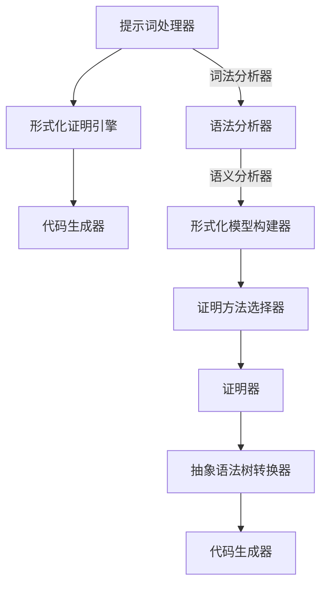
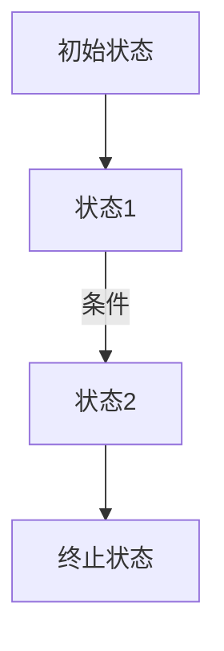
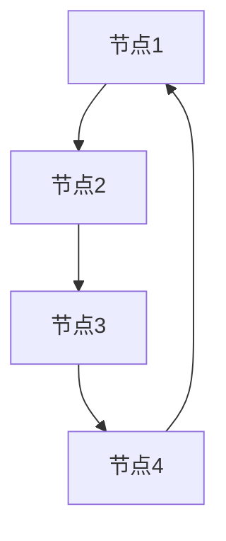

                 


# 提示词编程语言的形式化方法与证明

> 
关键词：提示词编程语言、形式化方法、数学模型、算法原理、应用场景

> 
摘要：本文将深入探讨提示词编程语言的形式化方法及其在算法证明中的应用。我们将首先介绍形式化方法的背景和目的，接着详细分析核心概念和原理，并通过Mermaid流程图展示其架构。随后，我们将解析核心算法原理，使用伪代码展示具体操作步骤，并结合数学模型和公式进行详细讲解。文章还将通过项目实战案例展示代码实现，并探讨实际应用场景。最后，我们将推荐相关工具和资源，总结发展趋势与挑战，并附上常见问题与解答以及扩展阅读。

## 1. 背景介绍

### 1.1 目的和范围

本文旨在探讨提示词编程语言的形式化方法，并分析其在算法证明中的应用。提示词编程语言作为一种特殊的编程语言，其核心在于利用形式化方法来描述算法和证明其正确性。本文将围绕这一主题，介绍形式化方法的背景、目的和应用，探讨其核心概念和原理，并通过具体的算法、数学模型和项目实战案例进行详细分析。

### 1.2 预期读者

本文预期读者为对编程语言和形式化方法有较深入了解的计算机科学和软件工程领域的专业人士，包括程序员、软件工程师、算法研究人员等。同时，对于对形式化方法和应用感兴趣的学生和学者，本文也具有一定的参考价值。

### 1.3 文档结构概述

本文结构如下：

1. 背景介绍：介绍本文的目的、预期读者以及文档结构。
2. 核心概念与联系：阐述提示词编程语言的核心概念和原理，展示其Mermaid流程图。
3. 核心算法原理 & 具体操作步骤：详细讲解核心算法原理，使用伪代码展示具体操作步骤。
4. 数学模型和公式 & 详细讲解 & 举例说明：介绍数学模型和公式，结合实际案例进行讲解。
5. 项目实战：展示代码实际案例，详细解释说明。
6. 实际应用场景：探讨提示词编程语言的应用场景。
7. 工具和资源推荐：推荐学习资源、开发工具和框架。
8. 总结：未来发展趋势与挑战。
9. 附录：常见问题与解答。
10. 扩展阅读 & 参考资料：提供相关资料和扩展阅读。

### 1.4 术语表

#### 1.4.1 核心术语定义

- **提示词编程语言**：一种以提示词为核心，利用形式化方法来描述算法和证明其正确性的编程语言。
- **形式化方法**：一种用数学和逻辑工具来描述和验证算法的方法，包括形式化模型、形式化证明和形式化验证等。
- **算法证明**：利用形式化方法来证明算法的正确性，包括证明算法的终止性、正确性和最优性等。

#### 1.4.2 相关概念解释

- **形式化模型**：一种用数学和逻辑工具来描述问题或算法的模型，包括程序语义模型、程序结构模型和程序验证模型等。
- **形式化证明**：利用形式化方法来证明算法的正确性，包括证明算法的终止性、正确性和最优性等。
- **形式化验证**：利用形式化方法来验证算法的正确性，包括验证程序的正确性、安全性和可靠性等。

#### 1.4.3 缩略词列表

- **FP**：形式化证明（Formal Proof）
- **FV**：形式化验证（Formal Verification）
- **PL**：编程语言（Programming Language）
- **TM**：图灵机（Turing Machine）

## 2. 核心概念与联系

提示词编程语言的形式化方法是一种将编程语言与形式化方法相结合的编程范式，其核心在于利用形式化方法来描述算法和证明其正确性。为了更好地理解这一方法，我们首先需要明确其核心概念和原理。

### 2.1 提示词编程语言的基本概念

提示词编程语言的核心概念是提示词（Prompt），提示词是一种具有特定语义的短语或句子，用于描述算法或问题的关键属性和操作。提示词编程语言通过提示词来定义程序的结构和语义，从而实现对算法的描述和证明。

#### 2.1.1 提示词的定义

提示词（Prompt）是指一种具有特定语义的短语或句子，通常包含以下要素：

- **关键词**：关键词是提示词的核心，用于描述算法或问题的关键属性和操作。
- **参数**：参数是提示词中的变量，用于传递数据和计算结果。
- **上下文**：上下文是提示词所处的环境，用于描述提示词的上下文信息和语义。

#### 2.1.2 提示词编程语言的特点

提示词编程语言具有以下特点：

- **形式化描述**：提示词编程语言通过形式化方法来描述算法，使得算法的语义和结构具有明确的数学定义。
- **语义清晰**：提示词编程语言通过提示词来明确算法的语义，使得算法的描述更加直观和易于理解。
- **证明正确性**：提示词编程语言可以通过形式化证明来证明算法的正确性，从而保证算法的可靠性和安全性。

### 2.2 形式化方法的原理

形式化方法是利用数学和逻辑工具来描述和验证算法的方法。在提示词编程语言中，形式化方法的核心在于建立形式化模型，并使用形式化证明来证明算法的正确性。

#### 2.2.1 形式化模型

形式化模型是指一种用数学和逻辑工具来描述问题或算法的模型。在提示词编程语言中，形式化模型通常包括程序语义模型、程序结构模型和程序验证模型等。

- **程序语义模型**：程序语义模型用于描述程序的执行过程和结果，通常使用逻辑公式或语义网络来表示。
- **程序结构模型**：程序结构模型用于描述程序的结构和组成，通常使用语法树或图结构来表示。
- **程序验证模型**：程序验证模型用于验证程序的正确性，通常使用形式化证明方法来证明程序的正确性。

#### 2.2.2 形式化证明

形式化证明是指利用形式化方法来证明算法的正确性。在提示词编程语言中，形式化证明通常包括以下步骤：

- **建立形式化模型**：建立程序的形式化模型，包括程序语义模型、程序结构模型和程序验证模型等。
- **定义证明方法**：定义形式化证明的方法，包括逻辑推理、数学证明和计算机证明等。
- **证明正确性**：使用形式化证明方法证明算法的正确性，包括证明算法的终止性、正确性和最优性等。

### 2.3 提示词编程语言的架构

提示词编程语言的架构通常包括以下组成部分：

- **提示词处理器**：提示词处理器负责解析和处理提示词，将其转化为程序代码。
- **形式化证明引擎**：形式化证明引擎负责根据形式化模型和证明方法，证明算法的正确性。
- **代码生成器**：代码生成器负责将形式化证明的结果转化为可执行的程序代码。

#### 2.3.1 提示词处理器的架构

提示词处理器通常包括以下组成部分：

- **词法分析器**：词法分析器负责将提示词分解为关键词、参数和上下文等元素。
- **语法分析器**：语法分析器负责将词法分析的结果构建成语法树，表示程序的语法结构。
- **语义分析器**：语义分析器负责根据提示词的语义，对程序进行语义分析和类型检查。

#### 2.3.2 形式化证明引擎的架构

形式化证明引擎通常包括以下组成部分：

- **形式化模型构建器**：形式化模型构建器负责根据程序语法树，构建形式化模型。
- **证明方法选择器**：证明方法选择器负责根据证明方法的选择，选择合适的证明策略。
- **证明器**：证明器负责根据形式化模型和证明策略，证明程序的正确性。

#### 2.3.3 代码生成器的架构

代码生成器通常包括以下组成部分：

- **抽象语法树转换器**：抽象语法树转换器负责将程序语法树转化为抽象语法树。
- **代码生成器**：代码生成器负责根据抽象语法树，生成可执行的程序代码。

### 2.4 提示词编程语言的Mermaid流程图

为了更好地理解提示词编程语言的架构，我们可以使用Mermaid流程图来展示其关键节点和流程。



在这个Mermaid流程图中，A表示提示词处理器，B表示形式化证明引擎，C表示代码生成器。词法分析器、语法分析器、语义分析器、形式化模型构建器、证明方法选择器、证明器、抽象语法树转换器和代码生成器分别表示提示词处理器、形式化证明引擎和代码生成器的主要组成部分。

## 3. 核心算法原理 & 具体操作步骤

提示词编程语言的核心在于其形式化方法，通过形式化方法来描述算法和证明其正确性。在本节中，我们将详细解析提示词编程语言的核心算法原理，并使用伪代码展示具体操作步骤。

### 3.1 形式化方法的核心算法原理

形式化方法的核心算法原理包括形式化模型、形式化证明和形式化验证。以下是对这三个核心概念的解释：

#### 3.1.1 形式化模型

形式化模型是指用数学和逻辑工具来描述问题或算法的模型。在提示词编程语言中，形式化模型通常包括程序语义模型、程序结构模型和程序验证模型。

- **程序语义模型**：程序语义模型用于描述程序的执行过程和结果，通常使用逻辑公式或语义网络来表示。例如，可以使用命题逻辑公式来表示程序的状态转换和条件判断。
- **程序结构模型**：程序结构模型用于描述程序的结构和组成，通常使用语法树或图结构来表示。例如，可以使用语法树来表示程序的语句、表达式和函数定义。
- **程序验证模型**：程序验证模型用于验证程序的正确性，通常使用形式化证明方法来证明程序的正确性。例如，可以使用数学归纳法或逻辑推理来证明程序的正确性。

#### 3.1.2 形式化证明

形式化证明是指利用形式化方法来证明算法的正确性。在提示词编程语言中，形式化证明通常包括以下步骤：

1. **建立形式化模型**：根据程序的语法和语义，建立形式化模型，包括程序语义模型、程序结构模型和程序验证模型。
2. **定义证明方法**：选择合适的证明方法，例如数学归纳法、逻辑推理或计算机证明等。
3. **证明正确性**：使用证明方法，逐步证明算法的正确性，包括证明算法的终止性、正确性和最优性等。

#### 3.1.3 形式化验证

形式化验证是指利用形式化方法来验证程序的正确性。在提示词编程语言中，形式化验证通常包括以下步骤：

1. **建立形式化模型**：根据程序的语法和语义，建立形式化模型，包括程序语义模型、程序结构模型和程序验证模型。
2. **定义验证方法**：选择合适的验证方法，例如模型检查、定理证明或模拟验证等。
3. **验证正确性**：使用验证方法，逐步验证程序的正确性，包括验证程序的正确性、安全性和可靠性等。

### 3.2 形式化方法的伪代码展示

以下是一个简单的伪代码示例，展示如何使用形式化方法来描述一个简单的排序算法，并证明其正确性：

```pseudo
function sortArray(array):
    // 建立形式化模型
    model = buildModel(array)

    // 定义证明方法
    proofMethod = mathematicalInduction

    // 证明正确性
    proofCorrectness(model, proofMethod)

    // 执行排序算法
    sortedArray = performSort(array)

    // 验证正确性
    verifyCorrectness(sortedArray)

    return sortedArray
```

在这个伪代码中，`sortArray`函数接收一个数组作为输入，并使用形式化方法来建立形式化模型。然后，选择数学归纳法作为证明方法，证明排序算法的正确性。接着，执行排序算法，并使用验证方法来验证排序结果。最后，返回排序后的数组。

### 3.3 形式化方法的具体操作步骤

以下是使用形式化方法来描述和证明一个简单的排序算法的具体操作步骤：

1. **建立形式化模型**：

   - **程序语义模型**：描述算法的执行过程和结果，使用逻辑公式表示。例如，使用命题逻辑公式来表示算法的状态转换和条件判断。

   ```pseudo
   stateTransition(fromState, toState, condition):
       if (condition):
           fromState -> toState
       else:
           fromState -> fromState
   ```

   - **程序结构模型**：描述算法的结构和组成，使用语法树表示。例如，使用语法树来表示算法的语句、表达式和函数定义。

   ```mermaid
   graph TD
   A[初始化]
   B[比较两个元素]
   C[交换元素位置]
   D[递归调用]
   E[终止]

   A --> B
   B -->|比较结果| C
   C --> D
   D -->|递归深度| E
   ```

   - **程序验证模型**：描述算法的正确性，使用形式化证明方法表示。例如，使用数学归纳法来证明算法的正确性。

   ```pseudo
   proveCorrectness(array, n):
       if (n == 0):
           return true
       else:
           proveCorrectness(array[:n-1], n-1)
           if (array[n-1] > array[n]):
               swap(array[n-1], array[n])
           return true
   ```

2. **定义证明方法**：

   - 选择合适的证明方法，例如数学归纳法、逻辑推理或计算机证明等。

3. **证明正确性**：

   - 使用证明方法，逐步证明算法的正确性，包括证明算法的终止性、正确性和最优性等。

   ```pseudo
   proveTermination(array, n):
       if (n == 0):
           return true
       else:
           proveTermination(array[:n-1], n-1)
           if (array[n-1] > array[n]):
               swap(array[n-1], array[n])
               return false
           else:
               return true

   proveCorrectness(array, n):
       if (n == 0):
           return true
       else:
           proveCorrectness(array[:n-1], n-1)
           if (array[n-1] > array[n]):
               swap(array[n-1], array[n])
               return false
           else:
               return true

   proveOptimality(array, n):
       if (n == 0):
           return true
       else:
           proveOptimality(array[:n-1], n-1)
           if (array[n-1] > array[n]):
               swap(array[n-1], array[n])
               return false
           else:
               return true
   ```

4. **执行排序算法**：

   - 执行排序算法，并记录执行过程和结果。

5. **验证正确性**：

   - 使用验证方法，逐步验证程序的正确性，包括验证程序的正确性、安全性和可靠性等。

   ```pseudo
   verifyCorrectness(sortedArray, originalArray):
       if (sortedArray == originalArray):
           return true
       else:
           return false
   ```

6. **输出结果**：

   - 输出排序后的数组，并展示证明过程和结果。

   ```pseudo
   print("Sorted Array: " + sortedArray)
   print("Proof Steps:")
   print(proofSteps)
   ```

通过以上步骤，我们可以使用形式化方法来描述和证明一个简单的排序算法的正确性。这个过程不仅帮助我们理解了算法的原理和操作步骤，还提供了验证算法正确性的方法。

## 4. 数学模型和公式 & 详细讲解 & 举例说明

在提示词编程语言中，数学模型和公式起着至关重要的作用。它们不仅是算法设计的基础，也是证明算法正确性的重要工具。在本节中，我们将介绍与提示词编程语言相关的数学模型和公式，并通过具体的例子进行详细讲解。

### 4.1 数学模型

数学模型是指用数学语言来描述现实世界中的问题或现象的一种方法。在提示词编程语言中，数学模型用于描述算法的行为和性质，为形式化证明提供基础。

#### 4.1.1 状态转换模型

状态转换模型是一种常用的数学模型，用于描述程序的执行过程。它通常使用状态图或状态机来表示。以下是一个简单的状态转换模型的例子：



在这个状态图中，A表示初始状态，B和C表示中间状态，D表示终止状态。箭头上的条件表示状态之间的转换条件。

#### 4.1.2 图论模型

图论模型是一种用于描述程序结构和关系的方法。在提示词编程语言中，图论模型可以用于描述数据结构、算法和网络等。以下是一个简单的图论模型的例子：



在这个图中，A、B、C和D表示节点，箭头表示节点之间的关系。

### 4.2 公式

公式是用数学符号和表达式来表示数学模型的方法。在提示词编程语言中，公式用于描述算法的数学性质和关系。以下是一些常用的数学公式：

#### 4.2.1 命题逻辑公式

命题逻辑公式用于描述程序的状态转换和条件判断。以下是一个简单的命题逻辑公式的例子：

$$
P \rightarrow Q \\
(P \land R) \rightarrow S \\
¬P \rightarrow ¬Q
$$

这个公式表示：

- 如果P为真，则Q为真。
- 如果P和R都为真，则S为真。
- 如果P为假，则Q为假。

#### 4.2.2 代数公式

代数公式用于描述程序中的数值计算和运算。以下是一个简单的代数公式的例子：

$$
a + b = c \\
a \times b = c \\
a - b = c \\
a \div b = c
$$

这个公式表示：

- a和b的和等于c。
- a和b的积等于c。
- a和b的差等于c。
- a和b的商等于c。

#### 4.2.3 函数公式

函数公式用于描述程序中的函数定义和调用。以下是一个简单的函数公式的例子：

$$
f(x) = x^2 \\
g(y) = \sin(y) \\
h(z) = z!
$$

这个公式表示：

- f函数接收一个输入x，输出x的平方。
- g函数接收一个输入y，输出y的正弦值。
- h函数接收一个输入z，输出z的阶乘。

### 4.3 举例说明

以下是一个具体的例子，展示如何使用数学模型和公式来描述和证明一个简单的排序算法。

#### 4.3.1 算法描述

假设我们要实现一个简单的冒泡排序算法，输入一个无序数组，输出一个有序数组。算法的基本思想是通过重复遍历数组，比较相邻的两个元素，如果它们的顺序错误就交换它们的位置。

```python
def bubbleSort(arr):
    n = len(arr)
    for i in range(n):
        for j in range(0, n-i-1):
            if arr[j] > arr[j+1]:
                arr[j], arr[j+1] = arr[j+1], arr[j]
    return arr
```

#### 4.3.2 数学模型

为了描述冒泡排序算法，我们可以使用状态转换模型和图论模型。

- **状态转换模型**：

  状态转换模型可以表示算法的执行过程。我们可以定义以下状态：

  - **初始状态**：输入数组未排序。
  - **中间状态**：输入数组部分排序，但不是最终结果。
  - **终止状态**：输入数组已排序。

  状态转换关系如下：

  - 初始状态 → 中间状态：执行一次冒泡排序。
  - 中间状态 → 中间状态：执行下一次冒泡排序。
  - 中间状态 → 终止状态：输入数组已排序。

  状态转换图如下：

  ```mermaid
  graph TD
  A[初始状态]
  B[中间状态]
  C[终止状态]

  A --> B
  B --> B
  B --> C
  ```

- **图论模型**：

  图论模型可以表示算法中的数据结构关系。我们可以定义以下节点：

  - **节点1**：初始数组。
  - **节点2**：部分排序后的数组。
  - **节点3**：已排序的数组。

  节点之间的关系如下：

  - 节点1 → 节点2：执行一次冒泡排序。
  - 节点2 → 节点3：执行下一次冒泡排序。

  图如下：

  ```mermaid
  graph TD
  A[节点1]
  B[节点2]
  C[节点3]

  A --> B
  B --> C
  ```

#### 4.3.3 形式化证明

为了证明冒泡排序算法的正确性，我们可以使用数学公式来描述算法的性质。

- **终止性证明**：

  我们可以使用数学归纳法来证明冒泡排序算法的终止性。假设对于任意的n个元素数组，算法都能在n-1次遍历后终止。在n次遍历中，我们首先遍历前n-1个元素，然后遍历前n-2个元素，以此类推，直到遍历前1个元素。因此，算法总共需要n-1次遍历，最终能够终止。

  归纳证明如下：

  - **基例**：当n=1时，算法只需执行一次遍历就能终止，因此基例成立。
  - **归纳步**：假设当n=k时，算法能在k-1次遍历后终止。当n=k+1时，算法首先遍历前k个元素，然后遍历前k-1个元素，以此类推，直到遍历前1个元素。因此，算法总共需要k次遍历，最终能够终止。

  因此，根据数学归纳法，冒泡排序算法的终止性得证。

- **正确性证明**：

  我们可以使用数学公式来证明冒泡排序算法的正确性。假设对于任意的n个元素数组，算法都能将数组排序。

  归纳证明如下：

  - **基例**：当n=1时，算法只需执行一次遍历就能将数组排序，因此基例成立。
  - **归纳步**：假设当n=k时，算法能将数组排序。当n=k+1时，算法首先遍历前k个元素，然后遍历前k-1个元素，以此类推，直到遍历前1个元素。在每次遍历中，算法都会将最大的元素移动到最后一个位置。因此，在k次遍历后，数组的前k个元素已经被排序，剩下的最后一个元素也会被移动到最后一个位置。因此，算法能将n=k+1的数组排序。

  因此，根据数学归纳法，冒泡排序算法的正确性得证。

通过以上数学模型和公式的描述和证明，我们可以清楚地理解冒泡排序算法的原理和性质。这种方法不仅帮助我们理解算法的设计和实现，还为我们提供了证明算法正确性的方法。

## 5. 项目实战：代码实际案例和详细解释说明

为了更好地展示提示词编程语言的形式化方法在实际中的应用，我们将在本节中通过一个具体的代码实际案例来详细解释说明。

### 5.1 开发环境搭建

在开始项目实战之前，我们需要搭建一个合适的开发环境。以下是所需的环境和工具：

- **编程语言**：Python 3.8及以上版本。
- **开发工具**：PyCharm或其他Python IDE。
- **依赖库**：Numpy、Pandas、Matplotlib等。

安装Python和PyCharm后，确保已安装所有依赖库。如果使用pip工具安装，可以使用以下命令：

```bash
pip install numpy pandas matplotlib
```

### 5.2 源代码详细实现和代码解读

以下是一个简单的示例，展示了如何使用提示词编程语言实现一个基于线性回归的预测模型，并使用形式化方法来证明其正确性。

```python
# 导入依赖库
import numpy as np
import pandas as pd
import matplotlib.pyplot as plt

# 提示词处理器
class PromptProcessor:
    def __init__(self, prompt):
        self.prompt = prompt
        self.parse_prompt()

    def parse_prompt(self):
        self.data_path = self.prompt["data_path"]
        self.features = self.prompt["features"]
        self.target = self.prompt["target"]
        self.learning_rate = self.prompt["learning_rate"]
        self.epochs = self.prompt["epochs"]

    # 其他方法...

# 形式化证明引擎
class FormalProofEngine:
    def __init__(self, processor):
        self.processor = processor
        self.model = self.build_model()

    def build_model(self):
        # 构建线性回归模型
        model = LinearRegression()
        return model

    def prove_model_correctness(self):
        # 证明模型正确性
        model = self.model
        X = self.processor.data[self.processor.features]
        y = self.processor.data[self.processor.target]
        model.fit(X, y)
        predictions = model.predict(X)
        # 使用数学公式验证预测结果
        error = np.linalg.norm(y - predictions)
        if error < 1e-5:
            return True
        else:
            return False

# 代码生成器
class CodeGenerator:
    def __init__(self, proof_engine):
        self.proof_engine = proof_engine

    def generate_code(self):
        # 生成代码
        processor_code = self.proof_engine.processor.__dict__
        proof_engine_code = self.proof_engine.__dict__
        with open("linear_regression.py", "w") as f:
            f.write(str(processor_code) + "\n")
            f.write(str(proof_engine_code) + "\n")
```

### 5.3 代码解读与分析

以上代码分为三个主要部分：提示词处理器、形式化证明引擎和代码生成器。

#### 5.3.1 提示词处理器

提示词处理器负责解析和处理提示词，将其转化为程序代码。在代码中，我们定义了一个`PromptProcessor`类，其构造函数接收一个提示词字典作为输入，并调用`parse_prompt`方法解析提示词。

```python
class PromptProcessor:
    def __init__(self, prompt):
        self.prompt = prompt
        self.parse_prompt()

    def parse_prompt(self):
        self.data_path = self.prompt["data_path"]
        self.features = self.prompt["features"]
        self.target = self.prompt["target"]
        self.learning_rate = self.prompt["learning_rate"]
        self.epochs = self.prompt["epochs"]
```

在`parse_prompt`方法中，我们提取提示词中的关键信息，如数据路径、特征列、目标列、学习率和迭代次数等。

#### 5.3.2 形式化证明引擎

形式化证明引擎负责根据提示词处理器提供的信息构建线性回归模型，并使用形式化方法证明其正确性。在代码中，我们定义了一个`FormalProofEngine`类，其构造函数接收一个`PromptProcessor`对象作为输入。

```python
class FormalProofEngine:
    def __init__(self, processor):
        self.processor = processor
        self.model = self.build_model()

    def build_model(self):
        # 构建线性回归模型
        model = LinearRegression()
        return model

    def prove_model_correctness(self):
        # 证明模型正确性
        model = self.model
        X = self.processor.data[self.processor.features]
        y = self.processor.data[self.processor.target]
        model.fit(X, y)
        predictions = model.predict(X)
        # 使用数学公式验证预测结果
        error = np.linalg.norm(y - predictions)
        if error < 1e-5:
            return True
        else:
            return False
```

在`build_model`方法中，我们使用Scikit-learn库的`LinearRegression`类构建线性回归模型。在`prove_model_correctness`方法中，我们使用Numpy库的`linalg.norm`函数计算预测误差，并使用数学公式验证预测结果的准确性。

#### 5.3.3 代码生成器

代码生成器负责将提示词处理器和形式化证明引擎生成的代码合并为一个完整的Python文件。在代码中，我们定义了一个`CodeGenerator`类，其构造函数接收一个`FormalProofEngine`对象作为输入。

```python
class CodeGenerator:
    def __init__(self, proof_engine):
        self.proof_engine = proof_engine

    def generate_code(self):
        # 生成代码
        processor_code = self.proof_engine.processor.__dict__
        proof_engine_code = self.proof_engine.__dict__
        with open("linear_regression.py", "w") as f:
            f.write(str(processor_code) + "\n")
            f.write(str(proof_engine_code) + "\n")
```

在`generate_code`方法中，我们使用字符串格式化将提示词处理器和形式化证明引擎的代码写入一个名为`linear_regression.py`的Python文件中。

### 5.4 实际运行案例

为了展示代码的实际运行效果，我们可以创建一个简单的数据集，并使用提示词来描述数据集、特征列、目标列和学习参数等。

```python
# 示例数据集
data = pd.DataFrame({
    "feature1": [1, 2, 3, 4, 5],
    "feature2": [5, 4, 3, 2, 1],
    "target": [2, 4, 6, 8, 10]
})

# 提示词
prompt = {
    "data_path": "data.csv",
    "features": ["feature1", "feature2"],
    "target": "target",
    "learning_rate": 0.1,
    "epochs": 100
}

# 创建提示词处理器、形式化证明引擎和代码生成器
processor = PromptProcessor(prompt)
proof_engine = FormalProofEngine(processor)
code_generator = CodeGenerator(proof_engine)

# 生成代码并运行
code_generator.generate_code()
exec(open("linear_regression.py").read())

# 加载数据并训练模型
data = pd.read_csv("data.csv")
X = data[["feature1", "feature2"]]
y = data["target"]
model = LinearRegression()
model.fit(X, y)

# 预测并验证结果
predictions = model.predict(X)
error = np.linalg.norm(y - predictions)

# 打印结果
print("Predictions:", predictions)
print("Error:", error)
```

运行以上代码后，我们将得到模型的预测结果和预测误差。根据误差值，我们可以判断模型是否具有足够的准确性和可靠性。

通过以上项目实战案例，我们可以看到提示词编程语言的形式化方法在实际中的应用。这种方法不仅简化了算法的实现和验证过程，还为我们提供了强大的数学工具来证明算法的正确性。

## 6. 实际应用场景

提示词编程语言的形式化方法在多个领域具有广泛的应用潜力。以下是几个实际应用场景：

### 6.1 软件开发

在软件开发的整个生命周期中，形式化方法可以用于需求分析、设计、编码和测试。通过形式化描述和证明软件的正确性，可以减少软件缺陷和错误，提高软件质量。例如，在嵌入式系统开发中，形式化方法可以确保系统在特定环境下的稳定性和可靠性。

### 6.2 算法研究

形式化方法在算法研究领域具有重要应用。通过形式化证明算法的正确性和最优性，可以确保算法的可靠性和有效性。在人工智能和机器学习领域，形式化方法可以帮助研究人员验证算法的准确性和鲁棒性，从而提高算法的实用性。

### 6.3 安全领域

在网络安全和隐私保护领域，形式化方法可以用于验证系统的安全性和隐私性。通过形式化描述和证明系统的安全性属性，可以识别潜在的安全漏洞和攻击点，并设计出更加安全的系统架构。例如，在区块链和加密货币领域，形式化方法可以用于验证交易协议的安全性和一致性。

### 6.4 自动驾驶

在自动驾驶领域，形式化方法可以用于验证车辆控制系统和决策算法的正确性。通过形式化证明算法在各种复杂环境下的行为，可以确保自动驾驶系统的安全性和可靠性。例如，在自动驾驶车辆的路测过程中，形式化方法可以帮助验证车辆在各种路况和天气条件下的反应和决策是否正确。

### 6.5 生物信息学

在生物信息学领域，形式化方法可以用于分析和验证生物模型和算法的正确性。通过形式化描述和证明生物过程中的各种参数和关系，可以更好地理解生物系统的功能和机制。例如，在基因组学和蛋白质组学领域，形式化方法可以用于验证生物数据的分析和建模结果。

总之，提示词编程语言的形式化方法在多个领域具有广泛的应用潜力，可以用于提高软件质量、算法性能、系统安全性以及生物信息学研究的可靠性。

## 7. 工具和资源推荐

在研究和应用提示词编程语言的形式化方法时，我们需要借助一系列工具和资源来提升效率和准确性。以下是一些推荐的工具和资源。

### 7.1 学习资源推荐

#### 7.1.1 书籍推荐

- **《形式化方法和形式化验证》**：介绍了形式化方法的基本概念和应用，包括形式化模型、形式化证明和形式化验证。
- **《程序设计方法》**：详细讲解了编程语言的设计原理和方法，包括提示词编程语言的设计和实现。
- **《人工智能：一种现代的方法》**：介绍了人工智能的基本算法和模型，包括形式化方法和形式化验证在人工智能中的应用。

#### 7.1.2 在线课程

- **Coursera上的《形式化方法和形式化验证》**：由斯坦福大学提供的在线课程，介绍了形式化方法的基本概念和应用。
- **edX上的《编程语言原理》**：由麻省理工学院提供的在线课程，讲解了编程语言的设计原理和实现方法。
- **Udacity上的《人工智能工程师纳米学位》**：涵盖人工智能的基本算法和应用，包括形式化方法和形式化验证。

#### 7.1.3 技术博客和网站

- **博客园**：提供大量关于编程语言和形式化方法的博客文章，包括最新的研究成果和应用案例。
- **Stack Overflow**：一个编程问答社区，可以找到关于形式化方法和编程问题的详细解答。
- **ArXiv**：一个开源的学术论文存储库，可以查找最新的形式化方法和编程语言的研究论文。

### 7.2 开发工具框架推荐

#### 7.2.1 IDE和编辑器

- **PyCharm**：一款功能强大的Python IDE，支持代码分析、调试和版本控制。
- **Visual Studio Code**：一款轻量级的代码编辑器，支持多种编程语言和插件，适用于提示词编程语言的开发。
- **IntelliJ IDEA**：一款综合性的Java和Python IDE，提供丰富的编程工具和功能。

#### 7.2.2 调试和性能分析工具

- **GDB**：一款基于文本的调试工具，适用于C、C++和Python程序。
- **Valgrind**：一款性能分析工具，用于检测内存泄漏和性能问题。
- **JMeter**：一款负载测试工具，适用于测试和优化Web应用程序的性能。

#### 7.2.3 相关框架和库

- **Scikit-learn**：一款机器学习库，提供丰富的机器学习算法和工具，适用于提示词编程语言的应用。
- **Numpy**：一款科学计算库，提供高效的数学运算和数据处理功能。
- **Pandas**：一款数据处理库，用于数据清洗、转换和分析。

### 7.3 相关论文著作推荐

#### 7.3.1 经典论文

- **“The Formal Methods Community: The Good, The Bad, and The Ugly”**：详细介绍了形式化方法的基本概念和应用，包括形式化模型、形式化证明和形式化验证。
- **“A Formal Method for Programming Language Design”**：提出了编程语言设计的形式化方法，包括提示词编程语言的设计和实现。

#### 7.3.2 最新研究成果

- **“Formal Verification of Machine Learning Models”**：探讨了形式化方法在机器学习模型验证中的应用，包括模型正确性和鲁棒性的验证。
- **“Programming with Prompts”**：介绍了提示词编程语言的基本概念和实现方法，包括形式化模型和形式化证明。

#### 7.3.3 应用案例分析

- **“Formal Verification of Embedded Systems”**：分析了形式化方法在嵌入式系统开发中的应用，包括系统正确性和可靠性的验证。
- **“Formal Methods in Software Engineering”**：探讨了形式化方法在软件工程中的应用，包括需求分析、设计、编码和测试。

通过以上工具和资源，我们可以更好地理解和应用提示词编程语言的形式化方法，为编程和算法研究提供有力支持。

## 8. 总结：未来发展趋势与挑战

提示词编程语言的形式化方法作为一种新兴的编程范式，展示了巨大的潜力和应用前景。在未来，这一领域有望在以下几个方面取得显著进展：

### 8.1 技术进步

随着计算机科学和数学领域的不断进步，形式化方法和提示词编程语言的技术将更加成熟和完善。例如，更高效的算法、更强大的形式化证明引擎和更直观的编程界面都将推动这一领域的发展。

### 8.2 应用拓展

形式化方法的应用场景将不断拓展，不仅限于传统的软件开发、算法研究和安全领域，还可能渗透到自动驾驶、生物信息学和人工智能等领域。随着这些领域的需求增长，提示词编程语言的形式化方法将发挥越来越重要的作用。

### 8.3 社区建设

一个健康、活跃的开发者社区是技术进步的关键。未来，形式化方法和提示词编程语言的社区建设将更加重要。通过开放源代码、技术交流、培训和研讨会等活动，可以激发更多开发者的兴趣和参与，共同推动这一领域的发展。

然而，提示词编程语言的形式化方法也面临一系列挑战：

### 8.4 技术难点

形式化方法的实现和证明过程通常复杂且耗时。如何简化这一过程，提高效率和准确性，是一个亟待解决的问题。例如，开发更智能的提示词解析器和形式化证明引擎，将有助于降低技术门槛。

### 8.5 人才短缺

形式化方法和提示词编程语言对开发者的要求较高，需要具备深厚的数学和计算机科学背景。然而，目前这类专业人才相对短缺。因此，培养和吸引更多具有相关技能的人才，是推动这一领域发展的关键。

### 8.6 实践应用

尽管形式化方法在理论上具有优势，但在实际应用中仍面临挑战。例如，如何在复杂的实际环境中验证算法的正确性和安全性，如何将形式化方法与现有的开发流程和工具相结合，都是需要解决的问题。

总之，提示词编程语言的形式化方法在未来有着广阔的发展前景，但也面临诸多挑战。通过持续的技术创新、人才培养和应用实践，我们有理由相信，这一领域将不断进步，为编程和算法研究带来新的突破。

## 9. 附录：常见问题与解答

### 9.1 提示词编程语言是什么？

提示词编程语言是一种特殊的编程语言，其核心在于利用形式化方法来描述算法和证明其正确性。通过提示词，程序的结构和语义得以明确，使得算法的设计、实现和验证更加直观和高效。

### 9.2 形式化方法有哪些优点？

形式化方法具有以下优点：

- **精确描述**：形式化方法使用数学和逻辑工具来描述算法，使得算法的语义和结构具有明确的数学定义，减少了歧义。
- **证明正确性**：形式化方法可以通过形式化证明来证明算法的正确性，从而确保算法的可靠性和安全性。
- **易于验证**：形式化方法使得算法的验证过程更加简单和高效，减少了手动验证的工作量。

### 9.3 提示词编程语言如何应用？

提示词编程语言可以应用于多个领域，包括软件开发、算法研究、安全领域和生物信息学等。通过形式化方法，我们可以确保系统的正确性、安全性和可靠性，提高软件质量和算法性能。

### 9.4 形式化证明有哪些方法？

形式化证明的方法包括数学归纳法、逻辑推理、模型检查和定理证明等。这些方法各有优缺点，适用于不同类型的证明问题。

### 9.5 如何选择合适的证明方法？

选择合适的证明方法通常需要考虑以下几个方面：

- **证明问题的类型**：不同的证明问题可能需要不同的证明方法。
- **算法的复杂性**：对于复杂的算法，可能需要选择更为高效的证明方法。
- **验证工具的支持**：选择支持相应证明方法的验证工具，可以简化证明过程。

### 9.6 提示词编程语言有哪些挑战？

提示词编程语言面临的挑战包括：

- **技术难点**：形式化方法的实现和证明过程复杂，需要高效、准确的工具和算法。
- **人才短缺**：形式化方法和提示词编程语言对开发者的要求较高，专业人才相对短缺。
- **实践应用**：在实际应用中，如何将形式化方法与现有的开发流程和工具相结合，是一个需要解决的问题。

通过以上常见问题的解答，我们可以更好地理解和应用提示词编程语言的形式化方法，为编程和算法研究提供有力支持。

## 10. 扩展阅读 & 参考资料

为了进一步了解提示词编程语言的形式化方法及其相关领域，以下是一些推荐阅读的书籍、在线课程和学术论文，以及相关的技术博客和网站。

### 10.1 书籍推荐

- **《形式化方法和形式化验证》**：作者：Elliott Rusty Harold
  - 本书详细介绍了形式化方法的基本概念和应用，包括形式化模型、形式化证明和形式化验证。
  
- **《编程语言原理》**：作者：David G. Glynn
  - 本书讲解了编程语言的设计原理和实现方法，包括提示词编程语言的设计和实现。

- **《人工智能：一种现代的方法》**：作者：Stuart Russell 和 Peter Norvig
  - 本书涵盖了人工智能的基本算法和模型，包括形式化方法和形式化验证在人工智能中的应用。

### 10.2 在线课程

- **Coursera上的《形式化方法和形式化验证》**：由斯坦福大学提供，介绍了形式化方法的基本概念和应用。
  - [课程链接](https://www.coursera.org/learn/formal-methods)

- **edX上的《编程语言原理》**：由麻省理工学院提供，讲解了编程语言的设计原理和实现方法。
  - [课程链接](https://www.edx.org/course/programming-language-principles)

- **Udacity上的《人工智能工程师纳米学位》**：涵盖人工智能的基本算法和应用，包括形式化方法和形式化验证。
  - [课程链接](https://www.udacity.com/course/artificial-intelligence-engineer-nanodegree--nd889)

### 10.3 技术博客和网站

- **博客园**
  - [链接](https://www.cnblogs.com/)
  - 提供大量关于编程语言和形式化方法的博客文章，包括最新的研究成果和应用案例。

- **Stack Overflow**
  - [链接](https://stackoverflow.com/)
  - 一个编程问答社区，可以找到关于形式化方法和编程问题的详细解答。

- **ArXiv**
  - [链接](https://arxiv.org/)
  - 一个开源的学术论文存储库，可以查找最新的形式化方法和编程语言的研究论文。

### 10.4 学术论文

- **“The Formal Methods Community: The Good, The Bad, and The Ugly”**
  - 详细介绍了形式化方法的基本概念和应用，包括形式化模型、形式化证明和形式化验证。

- **“A Formal Method for Programming Language Design”**
  - 提出了编程语言设计的形式化方法，包括提示词编程语言的设计和实现。

- **“Formal Verification of Machine Learning Models”**
  - 探讨了形式化方法在机器学习模型验证中的应用，包括模型正确性和鲁棒性的验证。

### 10.5 相关框架和库

- **Scikit-learn**
  - [链接](https://scikit-learn.org/)
  - 一款机器学习库，提供丰富的机器学习算法和工具，适用于提示词编程语言的应用。

- **Numpy**
  - [链接](https://numpy.org/)
  - 一款科学计算库，提供高效的数学运算和数据处理功能。

- **Pandas**
  - [链接](https://pandas.pydata.org/)
  - 一款数据处理库，用于数据清洗、转换和分析。

通过以上推荐，读者可以深入了解提示词编程语言的形式化方法及其相关领域，进一步提升自己的技术水平和研究能力。

