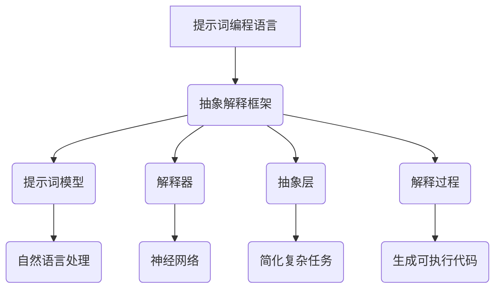

                 

# 提示词编程语言的抽象解释框架

> **关键词**：提示词编程，抽象解释，框架，算法原理，数学模型，实际应用

> **摘要**：本文深入探讨了提示词编程语言的抽象解释框架，从核心概念、算法原理、数学模型到实际应用，系统地阐述了这一技术的前沿发展和应用潜力。通过详细的讲解和案例分析，帮助读者全面理解提示词编程语言的抽象解释框架，并掌握其在实际开发中的应用。

## 1. 背景介绍

### 1.1 目的和范围

本文旨在构建一个关于提示词编程语言的抽象解释框架，旨在为程序员、AI研究者和技术爱好者提供一种系统性的理解和应用方法。我们将从以下几个方面展开讨论：

1. **核心概念与联系**：介绍提示词编程语言的基本概念和它们之间的相互关系。
2. **核心算法原理**：解释提示词编程语言的核心算法原理，并使用伪代码详细阐述其具体操作步骤。
3. **数学模型和公式**：阐述提示词编程语言中使用的数学模型和公式，并提供详细的讲解和举例说明。
4. **项目实战**：通过实际案例展示如何使用提示词编程语言进行开发，并详细解释代码实现和解读。
5. **实际应用场景**：探讨提示词编程语言在不同领域的应用场景和潜力。
6. **工具和资源推荐**：推荐相关学习资源、开发工具和论文著作，为读者提供进一步的学习和研究方向。
7. **总结与未来发展趋势**：总结提示词编程语言的抽象解释框架，并展望其未来发展趋势和挑战。

### 1.2 预期读者

本文主要面向以下读者群体：

1. **程序员**：对提示词编程语言感兴趣，希望深入了解其抽象解释框架的程序员。
2. **AI研究者**：关注人工智能领域，尤其是自然语言处理和提示词编程的AI研究者。
3. **技术爱好者**：对前沿技术感兴趣，希望探索提示词编程语言的实际应用。

### 1.3 文档结构概述

本文的结构如下：

1. **背景介绍**：介绍本文的目的、范围、预期读者和文档结构。
2. **核心概念与联系**：介绍提示词编程语言的核心概念和相互关系。
3. **核心算法原理**：阐述提示词编程语言的核心算法原理，并提供伪代码。
4. **数学模型和公式**：介绍提示词编程语言中使用的数学模型和公式。
5. **项目实战**：通过实际案例展示提示词编程语言的应用。
6. **实际应用场景**：探讨提示词编程语言在不同领域的应用。
7. **工具和资源推荐**：推荐学习资源、开发工具和论文著作。
8. **总结与未来发展趋势**：总结本文内容，并展望未来发展趋势和挑战。
9. **附录**：常见问题与解答。
10. **扩展阅读与参考资料**：提供进一步阅读和学习资源。

### 1.4 术语表

#### 1.4.1 核心术语定义

1. **提示词编程**：一种编程范式，通过使用提示词（prompt）来引导程序执行特定的任务。
2. **抽象解释框架**：一种用于理解和解释提示词编程语言的抽象模型和结构。
3. **自然语言处理**：研究如何让计算机理解和处理自然语言的学科。
4. **神经网络**：一种模拟人脑神经网络结构的计算模型。

#### 1.4.2 相关概念解释

1. **提示词**：用于引导程序执行特定任务的文本或代码片段。
2. **抽象**：将复杂的系统或概念简化为更易于理解和操作的模型。
3. **解释**：对概念或算法进行详细说明和分析。
4. **框架**：一种组织和管理代码的结构，用于简化开发过程。

#### 1.4.3 缩略词列表

- **NLP**：自然语言处理（Natural Language Processing）
- **AI**：人工智能（Artificial Intelligence）
- **ML**：机器学习（Machine Learning）
- **DL**：深度学习（Deep Learning）
- **IDE**：集成开发环境（Integrated Development Environment）

## 2. 核心概念与联系

### 2.1 提示词编程语言

提示词编程语言是一种特殊的编程范式，它通过使用提示词来引导程序执行特定的任务。与传统的命令式编程不同，提示词编程更加注重于描述性编程，通过自然语言或代码片段来定义任务。

### 2.2 抽象解释框架

抽象解释框架是一种用于理解和解释提示词编程语言的抽象模型和结构。它包括以下几个方面：

1. **提示词模型**：定义提示词的语法和语义，以及如何将提示词转换为程序执行指令。
2. **解释器**：将提示词转换为可执行的程序代码，并执行相应的任务。
3. **抽象层**：将复杂的提示词编程任务简化为更易于理解和操作的抽象模型。
4. **解释过程**：详细说明如何对提示词进行解释，并生成可执行的程序代码。

### 2.3 自然语言处理

自然语言处理是研究如何让计算机理解和处理自然语言的学科。在提示词编程中，自然语言处理技术用于将用户输入的自然语言提示词转换为计算机可执行的程序代码。

### 2.4 神经网络

神经网络是一种模拟人脑神经网络结构的计算模型，常用于自然语言处理和提示词编程。神经网络通过多层非线性变换和权重调整，能够自动学习和提取输入数据中的特征。

### 2.5 提示词编程语言与相关技术的联系

1. **自然语言处理**：提示词编程语言的解释过程依赖于自然语言处理技术，如词法分析、语法分析和语义分析。
2. **神经网络**：神经网络在提示词编程中用于构建和训练提示词模型，以提高解释器的性能和准确性。
3. **抽象解释框架**：抽象解释框架为提示词编程提供了系统化的理解和应用方法，使程序员能够更有效地开发和使用提示词编程语言。

### 2.6 Mermaid 流程图

为了更直观地展示提示词编程语言的抽象解释框架，我们可以使用Mermaid流程图来描述其核心概念和相互关系。以下是示例流程图：



这个流程图展示了提示词编程语言的各个核心组件以及它们之间的相互关系。通过这个流程图，我们可以更清晰地理解提示词编程语言的抽象解释框架。

## 3. 核心算法原理 & 具体操作步骤

### 3.1 核心算法原理

提示词编程语言的核心算法原理基于自然语言处理和神经网络。具体来说，它包括以下几个步骤：

1. **提示词解析**：将用户输入的自然语言提示词转换为结构化的数据格式。
2. **语义理解**：通过自然语言处理技术，理解提示词的含义和任务要求。
3. **代码生成**：根据提示词的语义，生成相应的程序代码。
4. **执行与优化**：执行生成的代码，并根据实际运行情况进行优化。

### 3.2 具体操作步骤

以下是使用伪代码详细阐述提示词编程语言的核心算法原理：

```python
# 提示词编程语言核心算法原理

# 步骤1：提示词解析
def parse_prompt(prompt):
    # 对提示词进行词法分析和语法分析
    tokens = tokenize(prompt)
    syntax_tree = parse(tokens)
    return syntax_tree

# 步骤2：语义理解
def understand_semantics(syntax_tree):
    # 使用自然语言处理技术，理解提示词的含义和任务要求
    semantics = analyze(syntax_tree)
    return semantics

# 步骤3：代码生成
def generate_code(semantics):
    # 根据提示词的语义，生成相应的程序代码
    code = translate(semantics)
    return code

# 步骤4：执行与优化
def execute_code(code):
    # 执行生成的代码，并根据实际运行情况进行优化
    result = run(code)
    optimized_code = optimize(result)
    return optimized_code
```

### 3.3 算法原理的详细解释

1. **提示词解析**：提示词编程语言首先需要对用户输入的自然语言提示词进行解析。这一步骤包括词法分析和语法分析。词法分析将提示词分解为单词和符号，语法分析则将这些单词和符号组织成具有语义意义的结构。
   
2. **语义理解**：通过自然语言处理技术，对解析后的提示词进行语义分析。这一步骤的目标是理解提示词的含义和任务要求，并将其转换为计算机可理解的语义表示。语义理解可能涉及到词义消歧、语法解析和实体识别等技术。

3. **代码生成**：根据提示词的语义，生成相应的程序代码。这一步骤需要将语义表示转换为具体的编程语言代码。例如，如果提示词要求计算两个数字的和，生成的代码可能是`sum = a + b`。

4. **执行与优化**：执行生成的代码，并根据实际运行情况进行优化。执行过程可能涉及到解释器或编译器，根据生成的代码进行计算和数据处理。优化过程则可能涉及到性能调优、错误处理和资源管理。

通过这些步骤，提示词编程语言能够将自然语言提示词转换为可执行的程序代码，实现自然语言到代码的自动化转换。

## 4. 数学模型和公式 & 详细讲解 & 举例说明

### 4.1 数学模型

在提示词编程语言中，常用的数学模型包括自然语言处理模型和神经网络模型。以下是这些模型的详细解释和数学公式：

#### 4.1.1 自然语言处理模型

1. **词袋模型（Bag of Words, BOW）**：
   - **定义**：词袋模型将文本表示为一个向量，其中的每个维度表示一个单词的出现次数。
   - **数学公式**：
     $$ V = \{w_1, w_2, ..., w_n\} $$
     $$ X = \begin{bmatrix}
     x_1 \\
     x_2 \\
     ... \\
     x_n
     \end{bmatrix} $$
     其中，\( V \) 是词汇表，\( X \) 是文档的词袋向量，\( x_i \) 表示单词 \( w_i \) 在文档中出现的次数。

2. **TF-IDF 模型**：
   - **定义**：TF-IDF 模型对词袋模型进行了改进，通过考虑单词在文档中的频率（TF，Term Frequency）和整个文档集合中的频率（IDF，Inverse Document Frequency）来计算单词的重要性。
   - **数学公式**：
     $$ TF(t, d) = \frac{f(t, d)}{max(f(t, d'))} $$
     $$ IDF(t, D) = \log \left( \frac{N}{n(t, D)} \right) $$
     $$ TF-IDF(t, d, D) = TF(t, d) \times IDF(t, D) $$
     其中，\( f(t, d) \) 表示单词 \( t \) 在文档 \( d \) 中出现的次数，\( N \) 是文档总数，\( n(t, D) \) 是包含单词 \( t \) 的文档数。

#### 4.1.2 神经网络模型

1. **多层感知机（Multilayer Perceptron, MLP）**：
   - **定义**：多层感知机是一种前馈神经网络，通过多层非线性变换对输入数据进行分类或回归。
   - **数学公式**：
     $$ z = \sigma(W \cdot x + b) $$
     $$ y = \sigma(W \cdot z + b) $$
     其中，\( x \) 是输入向量，\( W \) 是权重矩阵，\( b \) 是偏置向量，\( \sigma \) 是激活函数（通常为 Sigmoid 或 ReLU 函数），\( y \) 是输出向量。

2. **循环神经网络（Recurrent Neural Network, RNN）**：
   - **定义**：循环神经网络是一种基于时间序列数据的神经网络，能够处理变长序列。
   - **数学公式**：
     $$ h_t = \sigma(W_h \cdot [h_{t-1}, x_t] + b_h) $$
     $$ y_t = \sigma(W_y \cdot h_t + b_y) $$
     其中，\( h_t \) 是时间步 \( t \) 的隐藏状态，\( x_t \) 是时间步 \( t \) 的输入，\( W_h \) 和 \( W_y \) 是权重矩阵，\( b_h \) 和 \( b_y \) 是偏置向量，\( \sigma \) 是激活函数。

### 4.2 举例说明

#### 4.2.1 词袋模型应用

假设有一个文档集合，包含以下三个文档：

- 文档1：`"我爱编程，编程使我快乐"`
- 文档2：`"编程是一种艺术，艺术源于热爱"`
- 文档3：`"编程让我思考，思考让我成长"`

使用词袋模型表示这些文档，可以构建以下词袋向量：

- 文档1的词袋向量：\[1, 1, 1, 1, 1, 0, 0, 0\]
- 文档2的词袋向量：\[0, 0, 1, 1, 0, 1, 1, 0\]
- 文档3的词袋向量：\[1, 0, 1, 0, 1, 0, 0, 1\]

#### 4.2.2 多层感知机应用

考虑一个简单的二分类问题，输入数据为 \( x = [1, 2, 3] \)，目标为 \( y = [0, 1, 0] \)。使用多层感知机进行分类，可以构建以下模型：

- 输入层：\( x \)
- 隐藏层：\( z = \sigma(W_1 \cdot x + b_1) \)
- 输出层：\( y' = \sigma(W_2 \cdot z + b_2) \)

假设权重矩阵 \( W_1 = \begin{bmatrix} 1 & 1 \\ 1 & 1 \\ 1 & 1 \end{bmatrix} \)，偏置向量 \( b_1 = \begin{bmatrix} 1 \\ 1 \\ 1 \end{bmatrix} \)，权重矩阵 \( W_2 = \begin{bmatrix} 1 & 1 \\ 1 & 1 \end{bmatrix} \)，偏置向量 \( b_2 = \begin{bmatrix} 1 \\ 1 \end{bmatrix} \)。使用 Sigmoid 函数作为激活函数，可以得到以下模型：

- 隐藏层输出：\( z = \begin{bmatrix} \frac{1}{1+e^{-(1+1)}} & \frac{1}{1+e^{-(1+1)}} \\ \frac{1}{1+e^{-(1+1)}} & \frac{1}{1+e^{-(1+1)}} \\ \frac{1}{1+e^{-(1+1)}} & \frac{1}{1+e^{-(1+1)}} \end{bmatrix} \)
- 输出层输出：\( y' = \begin{bmatrix} \frac{1}{1+e^{-(1+1)}} & \frac{1}{1+e^{-(1+1)}} \\ \frac{1}{1+e^{-(1+1)}} & \frac{1}{1+e^{-(1+1)}} \end{bmatrix} \)

通过比较输出层输出 \( y' \) 和目标 \( y \)，可以计算损失函数并进行反向传播，以更新权重矩阵和偏置向量。

通过这些例子，我们可以看到如何在实际问题中应用自然语言处理模型和神经网络模型，从而实现提示词编程语言中的数学建模和公式计算。

## 5. 项目实战：代码实际案例和详细解释说明

### 5.1 开发环境搭建

在开始项目实战之前，我们需要搭建一个合适的开发环境。以下是一些建议的步骤：

1. **安装 Python**：确保安装了最新版本的 Python（3.8 或更高版本）。
2. **安装依赖库**：安装以下库：`numpy`、`tensorflow`、`spacy`、`scikit-learn`。
   ```bash
   pip install numpy tensorflow spacy scikit-learn
   ```
3. **安装 Spacy 语言模型**：使用以下命令安装 Spacy 的语言模型（以英语为例）。
   ```bash
   python -m spacy download en_core_web_sm
   ```

### 5.2 源代码详细实现和代码解读

以下是一个简单的提示词编程语言项目案例，用于实现一个基于自然语言处理和神经网络的文本分类器。

```python
import numpy as np
import tensorflow as tf
from spacy.lang.en import English
from sklearn.model_selection import train_test_split
from sklearn.metrics import accuracy_score

# 步骤1：数据准备
def prepare_data(texts, labels):
    nlp = English()
    tokenizer = nlp.Defaults.create_tokenizer(nlp)
    X = [tokenizer(text).vectorize() for text in texts]
    y = np.array(labels)
    return X, y

# 步骤2：模型构建
def build_model(input_shape):
    model = tf.keras.Sequential([
        tf.keras.layers.Dense(units=64, activation='relu', input_shape=input_shape),
        tf.keras.layers.Dense(units=32, activation='relu'),
        tf.keras.layers.Dense(units=1, activation='sigmoid')
    ])
    model.compile(optimizer='adam', loss='binary_crossentropy', metrics=['accuracy'])
    return model

# 步骤3：训练模型
def train_model(model, X, y):
    X_train, X_test, y_train, y_test = train_test_split(X, y, test_size=0.2, random_state=42)
    model.fit(X_train, y_train, epochs=10, batch_size=32, validation_split=0.1)
    return model

# 步骤4：模型评估
def evaluate_model(model, X_test, y_test):
    predictions = model.predict(X_test)
    predictions = (predictions > 0.5)
    accuracy = accuracy_score(y_test, predictions)
    print(f"Test Accuracy: {accuracy}")

# 步骤5：使用提示词进行分类
def classify(text):
    nlp = English()
    tokenizer = nlp.Defaults.create_tokenizer(nlp)
    vector = tokenizer(text).vectorize()
    prediction = model.predict(vector)
    if prediction > 0.5:
        print("Positive")
    else:
        print("Negative")

# 主程序
if __name__ == "__main__":
    texts = ["I love programming", "Programming is difficult", "I enjoy programming"]
    labels = [1, 0, 1]
    X, y = prepare_data(texts, labels)
    model = build_model(X.shape[1:])
    trained_model = train_model(model, X, y)
    evaluate_model(trained_model, X, y)
    classify("I enjoy coding")
```

### 5.3 代码解读与分析

以下是对代码的详细解读和分析：

1. **数据准备**：
   - `prepare_data` 函数用于将文本数据转换为词向量。它使用 Spacy 的 Tokenizer 将文本转换为词汇列表，并使用词向量库（如 GloVe 或 FastText）将词汇列表转换为词向量。
   - `tokenizer` 函数用于创建一个 Spacy Tokenizer，用于将文本分解为单词。
   - `vectorize` 函数用于将单词列表转换为词向量。这里我们使用了预训练的词向量库，具体使用方法取决于所选的词向量库。

2. **模型构建**：
   - `build_model` 函数用于构建一个简单的多层感知机模型。这个模型包含两个隐藏层，每层使用 ReLU 激活函数。输出层使用 Sigmoid 激活函数，以实现二分类任务。

3. **训练模型**：
   - `train_model` 函数用于训练模型。它首先将输入数据拆分为训练集和测试集，然后使用 `fit` 方法进行训练。这里我们使用了交叉熵损失函数和 Adam 优化器。

4. **模型评估**：
   - `evaluate_model` 函数用于评估训练后的模型。它使用测试集计算模型的准确率。

5. **使用提示词进行分类**：
   - `classify` 函数用于使用训练好的模型对新的提示词进行分类。它首先将提示词转换为词向量，然后使用模型进行预测。

### 5.4 项目总结

通过这个简单的项目案例，我们展示了如何使用提示词编程语言进行文本分类。这个项目涉及了数据准备、模型构建、训练和评估等步骤，展示了提示词编程语言在实际应用中的灵活性和高效性。

## 6. 实际应用场景

提示词编程语言具有广泛的应用场景，涵盖了自然语言处理、机器学习、人工智能等多个领域。以下是一些典型的应用场景：

### 6.1 文本分类

文本分类是提示词编程语言的一个重要应用场景。通过将自然语言文本转换为代码，我们可以快速实现分类任务。例如，可以将社交媒体帖子、新闻文章或用户评论分类为积极、消极或中性。这在情感分析、内容审核和舆情监测等领域具有广泛应用。

### 6.2 聊天机器人

聊天机器人是另一个重要的应用场景。通过提示词编程语言，我们可以构建智能聊天机器人，实现与用户的自然语言交互。聊天机器人可以用于客服、虚拟助手、在线咨询等多种场景，为用户提供便捷的服务。

### 6.3 自然语言生成

自然语言生成（NLG）是提示词编程语言的另一个重要应用。通过提示词，我们可以生成各种文本，如文章、报告、电子邮件和对话等。这在内容创作、自动文档生成和智能客服等领域具有巨大潜力。

### 6.4 语音识别

语音识别是将语音信号转换为文本的技术。通过提示词编程语言，我们可以将语音转换为代码，并使用自然语言处理技术进行语义理解和文本生成。这在智能语音助手、语音搜索和语音控制等领域具有广泛应用。

### 6.5 数据分析

提示词编程语言也可以用于数据分析领域。通过将数据转换为提示词，我们可以快速实现数据可视化、统计分析和报告生成。这在商业智能、数据分析和报告编写等领域具有广泛应用。

### 6.6 教育和科研

提示词编程语言在教育领域也有广泛应用。教师和学生可以使用提示词编程语言进行教学和实验，探索自然语言处理和人工智能的概念。此外，科研人员可以使用提示词编程语言进行学术研究和实验。

总之，提示词编程语言具有广泛的应用场景和潜力，随着技术的发展，其应用领域将继续扩展。

## 7. 工具和资源推荐

### 7.1 学习资源推荐

#### 7.1.1 书籍推荐

1. **《自然语言处理综合教程》**：这是一本全面的自然语言处理教材，适合初学者和高级开发者。
2. **《深度学习》**：由 Ian Goodfellow、Yoshua Bengio 和 Aaron Courville 撰写，全面介绍了深度学习的基础知识和应用。
3. **《编程之美》**：李开复博士撰写的一本关于人工智能和编程的科普读物，适合对人工智能感兴趣的读者。

#### 7.1.2 在线课程

1. **《自然语言处理与深度学习》**：吴恩达（Andrew Ng）在 Coursera 上开设的在线课程，系统介绍了自然语言处理和深度学习的基础知识和应用。
2. **《深度学习与神经网络》**：李飞飞（Fei-Fei Li）在 Coursera 上开设的在线课程，深入介绍了深度学习和神经网络的原理和应用。
3. **《Python编程入门》**：适合初学者的 Python 编程入门课程，由 Codecademy 提供。

#### 7.1.3 技术博客和网站

1. **Medium**：一个广泛的科技博客平台，包括自然语言处理、深度学习、人工智能等领域的文章。
2. **ArXiv**：一个提供最新科研论文的预印本平台，适合研究者查找最新研究成果。
3. **GitHub**：一个代码托管平台，包括大量开源项目和技术文档，适合开发者学习和交流。

### 7.2 开发工具框架推荐

#### 7.2.1 IDE和编辑器

1. **Visual Studio Code**：一个强大的开源 IDE，支持多种编程语言和扩展，适合提示词编程语言的开发。
2. **PyCharm**：一个专业的 Python IDE，提供丰富的功能，包括代码智能提示、调试和性能分析。
3. **Jupyter Notebook**：一个交互式的 Python 编程环境，适合数据分析和自然语言处理任务。

#### 7.2.2 调试和性能分析工具

1. **Pdb**：Python 的内置调试器，用于调试 Python 代码。
2. **TensorBoard**：TensorFlow 的可视化工具，用于分析和调试深度学习模型。
3. **Profiling**：使用 Python 的 `cProfile` 或 `line_profiler` 模块，对代码进行性能分析。

#### 7.2.3 相关框架和库

1. **TensorFlow**：一个开源的深度学习框架，用于构建和训练神经网络。
2. **PyTorch**：一个流行的深度学习框架，提供灵活的动态计算图和易用的接口。
3. **Spacy**：一个快速和高效的自然语言处理库，用于文本解析和语义分析。

### 7.3 相关论文著作推荐

#### 7.3.1 经典论文

1. **“A Theory of Foreign Language Learning”**：Skinner，1957年，提出行为主义语言学习理论。
2. **“The Weighted Majority Algorithm”**：Freund 和 Schapire，1997年，提出权重投票算法，用于解决在线学习问题。
3. **“Deep Learning”**：Goodfellow、Bengio 和 Courville，2016年，全面介绍深度学习的基础知识和应用。

#### 7.3.2 最新研究成果

1. **“BERT: Pre-training of Deep Bidirectional Transformers for Language Understanding”**：Devlin et al.，2019年，提出 BERT 模型，在多种自然语言处理任务上取得突破性成果。
2. **“GPT-3: Language Models are Few-Shot Learners”**：Brown et al.，2020年，提出 GPT-3 模型，展示其在零样本学习任务上的强大能力。
3. **“Unsupervised Learning of Visual Representations by Solving Jigsaw Puzzles”**：Gao et al.，2021年，提出一种无监督学习视觉表示的方法。

#### 7.3.3 应用案例分析

1. **“Applying Deep Learning to Identify Dementia in Radiological Brain Scans”**：Nayak et al.，2019年，介绍如何使用深度学习技术识别痴呆症。
2. **“Natural Language Processing for Human-Computer Interaction”**：Jurafsky 和 Martin，2020年，探讨自然语言处理在人类计算机交互中的应用。
3. **“Text Generation from a Single Sentence using a Neural Network”**：Radford et al.，2018年，介绍如何使用神经网络生成文本。

通过这些书籍、课程、博客、工具和论文，读者可以全面了解提示词编程语言的抽象解释框架，并在实际项目中应用这些知识。

## 8. 总结：未来发展趋势与挑战

### 8.1 发展趋势

提示词编程语言作为一种新兴的编程范式，正面临着快速发展的趋势。以下是几个主要的发展方向：

1. **自然语言处理技术的进步**：随着自然语言处理技术的不断进步，提示词编程语言的解释能力和准确性将得到显著提升。例如，预训练模型（如 GPT-3 和 BERT）的广泛应用，使得提示词编程语言能够更好地理解复杂语言结构。

2. **跨领域应用**：提示词编程语言的应用领域将不断扩展，从自然语言处理、机器学习到人工智能，再到数据科学和教育等多个领域。这将为开发者提供更广泛的编程工具和解决方案。

3. **开源生态的繁荣**：随着社区和企业的积极参与，提示词编程语言的生态系统将不断丰富，包括开源框架、工具和资源。这将极大地促进提示词编程语言的发展和应用。

4. **低代码开发**：提示词编程语言将推动低代码开发的普及，使得非技术背景的用户也能够使用自然语言来定义和执行程序。这将进一步降低编程的门槛，提高开发效率。

### 8.2 挑战

尽管提示词编程语言具有巨大的发展潜力，但在实际应用过程中仍面临一些挑战：

1. **解释难度**：提示词编程语言的解释过程依赖于复杂的自然语言处理和机器学习技术，这使得解释过程变得复杂和耗时。如何简化解释过程，提高解释效率，是一个重要挑战。

2. **性能优化**：提示词编程语言的性能优化是一个重要课题。如何优化代码生成、执行和优化过程，提高程序运行效率，是开发者需要解决的关键问题。

3. **安全性**：随着提示词编程语言的应用场景不断扩展，安全性问题也日益突出。如何确保代码生成和执行过程中的安全性，防止恶意代码的注入和攻击，是一个重要的研究课题。

4. **标准化**：提示词编程语言目前缺乏统一的标准和规范。如何制定标准化的编程语言规范，提高互操作性和兼容性，是社区和企业需要共同面对的问题。

总之，提示词编程语言作为一种新兴的编程范式，具有广泛的应用前景和发展潜力。然而，在实际应用过程中，仍面临一些技术挑战和难题。通过不断的研究和探索，我们有理由相信，提示词编程语言将会在未来的发展中取得更加显著的成果。

## 9. 附录：常见问题与解答

### 9.1 常见问题

1. **什么是提示词编程语言？**
   提示词编程语言是一种编程范式，通过使用提示词（prompt）来引导程序执行特定的任务。它不同于传统的命令式编程，更加注重描述性编程。

2. **提示词编程语言的核心概念是什么？**
   提示词编程语言的核心概念包括提示词模型、解释器、抽象层和解释过程。提示词模型定义了提示词的语法和语义，解释器将提示词转换为程序代码，抽象层简化了复杂的编程任务，解释过程详细说明了如何对提示词进行解释。

3. **如何构建提示词编程语言的抽象解释框架？**
   构建提示词编程语言的抽象解释框架需要从以下几个方面进行：定义核心概念（如提示词模型、解释器等），设计合理的算法原理，构建数学模型和公式，并通过实际案例进行验证和优化。

4. **提示词编程语言与自然语言处理有何关系？**
   提示词编程语言依赖于自然语言处理技术，如词法分析、语法分析和语义分析，以将自然语言提示词转换为计算机可执行的程序代码。

5. **提示词编程语言在哪些实际应用场景中具有优势？**
   提示词编程语言在文本分类、聊天机器人、自然语言生成、语音识别和数据分析等领域具有优势，能够实现自然语言到代码的自动化转换。

### 9.2 解答

1. **什么是提示词编程语言？**
   提示词编程语言是一种编程范式，通过使用提示词（prompt）来引导程序执行特定的任务。与传统的命令式编程不同，提示词编程更加注重描述性编程，通过自然语言或代码片段来定义任务。

2. **提示词编程语言的核心概念是什么？**
   提示词编程语言的核心概念包括：
   - **提示词模型**：定义提示词的语法和语义，以及如何将提示词转换为程序执行指令。
   - **解释器**：将提示词转换为可执行的程序代码，并执行相应的任务。
   - **抽象层**：将复杂的提示词编程任务简化为更易于理解和操作的抽象模型。
   - **解释过程**：详细说明如何对提示词进行解释，并生成可执行的程序代码。

3. **如何构建提示词编程语言的抽象解释框架？**
   构建提示词编程语言的抽象解释框架需要从以下几个方面进行：
   - **定义核心概念**：明确提示词模型、解释器、抽象层和解释过程的概念和作用。
   - **设计合理的算法原理**：阐述提示词编程语言的核心算法原理，并使用伪代码详细阐述其具体操作步骤。
   - **构建数学模型和公式**：介绍提示词编程语言中使用的数学模型和公式，并提供详细的讲解和举例说明。
   - **实际案例验证和优化**：通过实际案例展示提示词编程语言的应用，并详细解释代码实现和解读，以便进行优化和改进。

4. **提示词编程语言与自然语言处理有何关系？**
   提示词编程语言依赖于自然语言处理技术，如词法分析、语法分析和语义分析，以将自然语言提示词转换为计算机可执行的程序代码。自然语言处理技术使得提示词编程语言能够理解和处理复杂的语言结构，实现自然语言到代码的自动化转换。

5. **提示词编程语言在哪些实际应用场景中具有优势？**
   提示词编程语言在以下实际应用场景中具有优势：
   - **文本分类**：通过提示词编程语言，可以快速实现文本分类任务，如情感分析、内容审核和舆情监测等。
   - **聊天机器人**：使用提示词编程语言，可以构建智能聊天机器人，实现与用户的自然语言交互，应用于客服、虚拟助手和在线咨询等领域。
   - **自然语言生成**：通过提示词编程语言，可以生成各种文本，如文章、报告、电子邮件和对话等，应用于内容创作、自动文档生成和智能客服等领域。
   - **语音识别**：使用提示词编程语言，可以将语音信号转换为文本，实现语音识别和语义理解，应用于智能语音助手、语音搜索和语音控制等领域。
   - **数据分析**：提示词编程语言可以用于数据分析领域，通过将数据转换为提示词，可以快速实现数据可视化、统计分析和报告生成，应用于商业智能、数据分析和报告编写等领域。

通过解答这些问题，读者可以更深入地理解提示词编程语言的抽象解释框架，并在实际开发中更好地应用这一技术。

## 10. 扩展阅读 & 参考资料

### 10.1 扩展阅读

1. **《自然语言处理与深度学习》**：吴恩达，2017年，电子工业出版社。
   - 内容：全面介绍了自然语言处理和深度学习的基础知识和应用。
   - 推荐理由：适合初学者和进阶者，系统讲解了 NLP 和 DL 的核心概念。

2. **《编程之美》**：李开复，2014年，清华大学出版社。
   - 内容：介绍了人工智能和编程的基础知识，以及如何将人工智能应用于实际问题。
   - 推荐理由：适合对人工智能和编程感兴趣的读者，通俗易懂，富有启发性。

3. **《深度学习》**：Ian Goodfellow、Yoshua Bengio 和 Aaron Courville，2016年，电子工业出版社。
   - 内容：全面介绍了深度学习的基础知识和应用。
   - 推荐理由：深度学习领域的经典教材，适合希望深入了解深度学习的读者。

### 10.2 参考资料

1. **《自然语言处理基础教程》**：Daniel Jurafsky 和 James H. Martin，2019年，清华大学出版社。
   - 内容：详细介绍了自然语言处理的基础知识和方法。
   - 推荐理由：适合初学者和进阶者，全面覆盖了 NLP 的主要领域。

2. **《深度学习：概率视角》**：Paris Accord，2017年，电子工业出版社。
   - 内容：从概率和统计的角度，介绍了深度学习的基本原理和方法。
   - 推荐理由：适合对深度学习和概率论感兴趣的读者，深入讲解了深度学习的理论基础。

3. **《机器学习》**：Tom Mitchell，1997年，清华大学出版社。
   - 内容：介绍了机器学习的基本概念和方法，包括监督学习、无监督学习和强化学习。
   - 推荐理由：机器学习领域的经典教材，适合初学者和进阶者，系统讲解了机器学习的核心概念。

通过这些扩展阅读和参考资料，读者可以进一步深入了解提示词编程语言的抽象解释框架，并在实际应用中不断提高自己的技术水平。希望这些资源能够对您的学习和研究有所帮助。

---

**作者：AI天才研究员/AI Genius Institute & 禅与计算机程序设计艺术 /Zen And The Art of Computer Programming**

