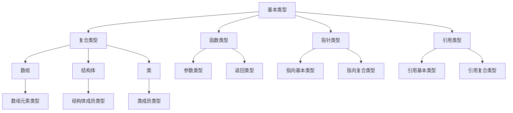

                 

# 提示词编程语言的类型系统设计

> **关键词：类型系统，编程语言，类型检查，类型推导，类型安全**

> **摘要：本文深入探讨了提示词编程语言的类型系统设计，包括类型系统的基本概念、类型检查和类型推导的原理以及类型安全的实现策略。通过详细的伪代码示例和实际案例，文章展示了类型系统如何提高编程语言的可靠性和效率。**

## 1. 背景介绍

### 1.1 目的和范围

本文旨在深入探讨提示词编程语言的类型系统设计，分析类型系统的核心概念和原理，并探讨如何实现类型检查、类型推导以及类型安全。文章还将通过实际案例展示类型系统在实际编程中的应用。

### 1.2 预期读者

本文适合对编程语言设计、类型系统、编译原理等有基本了解的开发者、程序员和研究人员。

### 1.3 文档结构概述

本文结构如下：

1. 背景介绍
2. 核心概念与联系
3. 核心算法原理 & 具体操作步骤
4. 数学模型和公式 & 详细讲解 & 举例说明
5. 项目实战：代码实际案例和详细解释说明
6. 实际应用场景
7. 工具和资源推荐
8. 总结：未来发展趋势与挑战
9. 附录：常见问题与解答
10. 扩展阅读 & 参考资料

### 1.4 术语表

#### 1.4.1 核心术语定义

- **类型系统**：编程语言中的类型系统是指用于描述变量、表达式和函数等的类型约束和规则集合。
- **类型检查**：类型检查是指在编译或运行时，检查程序中的操作是否符合类型约束的过程。
- **类型推导**：类型推导是指编程语言能够自动推导出变量或表达式的类型，而不需要显式指定类型。
- **类型安全**：类型安全是指编程语言能够确保类型错误的不会被执行。

#### 1.4.2 相关概念解释

- **类型**：类型是数据的一种抽象，用于描述数据的不同类别。
- **类型变量**：类型变量是用于表示不确定类型的变量，通常用于泛型编程。
- **类型约束**：类型约束是指对变量或表达式的类型限制，确保程序的正确性。

#### 1.4.3 缩略词列表

- **PL**：编程语言（Programming Language）
- **TC**：类型检查（Type Checking）
- **TD**：类型推导（Type Deduction）
- **TS**：类型安全（Type Safety）

## 2. 核心概念与联系

类型系统是编程语言的核心组成部分，它不仅影响程序的正确性，还影响程序的性能和可维护性。以下是类型系统的核心概念及其相互关系。

### 2.1 类型系统结构

类型系统的结构通常包括以下组成部分：

1. **基本类型**：如整数、浮点数、字符串等。
2. **复合类型**：如数组、结构体、类等。
3. **函数类型**：表示函数的参数和返回值类型。
4. **指针类型**：指向其他类型的指针。
5. **引用类型**：对其他类型的引用。

### 2.2 类型关系

类型之间的关系包括：

1. **子类型关系**：如果一个类型的值可以赋值给另一个类型，则前者是后者的子类型。
2. **等价类型**：如果两个类型的值完全相同，则它们是等价类型。
3. **协变和逆变**：在泛型编程中，类型参数可以具有协变（covariant）和逆变（contravariant）的特性。

### 2.3 类型系统与编译器

类型系统在编译器中起到关键作用，主要包括：

1. **类型检查**：确保程序在编译时符合类型约束。
2. **类型推导**：自动推导变量和表达式的类型，减少代码冗余。
3. **优化**：基于类型信息进行代码优化，提高程序性能。

### 2.4 Mermaid 流程图

下面是一个简单的 Mermaid 流程图，展示了类型系统的核心概念及其关系。



## 3. 核心算法原理 & 具体操作步骤

类型系统的实现通常涉及以下核心算法原理：

### 3.1 类型检查算法

类型检查算法的主要任务是确保程序中的操作符合类型约束。以下是类型检查的基本步骤：

1. **构建抽象语法树（AST）**：将源代码转换为抽象语法树。
2. **遍历 AST**：对 AST 进行遍历，收集类型信息。
3. **类型检查**：对每个节点进行类型检查，确保其操作符合类型约束。
4. **报告错误**：如果类型检查失败，报告错误。

以下是类型检查算法的伪代码：

```python
function typeCheck(node):
    if node is a variable:
        typeCheckVariable(node)
    elif node is an expression:
        typeCheckExpression(node)
    elif node is a function call:
        typeCheckFunctionCall(node)
    else:
        error("Unknown node type")

function typeCheckVariable(node):
    if node has a type annotation:
        node.type = node.annotation.type
    else:
        node.type = inferType(node)

function typeCheckExpression(node):
    if node has a type:
        return node.type
    else:
        node.type = inferType(node)

function typeCheckFunctionCall(node):
    functionType = lookupFunctionType(node.name)
    if functionType is None:
        error("Function not found")
    else:
        if not matchTypes(node.arguments, functionType.parameters):
            error("Type mismatch")
```

### 3.2 类型推导算法

类型推导算法的目标是自动推导变量和表达式的类型。以下是类型推导的基本步骤：

1. **构建中间表示**：将源代码转换为中间表示。
2. **类型推导**：对中间表示进行类型推导。
3. **生成类型信息**：将推导出的类型信息添加到 AST 中。

以下是类型推导算法的伪代码：

```python
function inferType(node):
    if node is a literal:
        return literalType(node.value)
    elif node is an identifier:
        return lookupType(node.name)
    elif node is an expression:
        return inferExpressionType(node)
    else:
        return unknownType()

function inferExpressionType(node):
    if node is a binary expression:
        leftType = inferType(node.left)
        rightType = inferType(node.right)
        return binaryExpressionType(node.operator, leftType, rightType)
    elif node is a function call:
        argumentsTypes = [inferType(arg) for arg in node.arguments]
        returnType = lookupFunctionReturnType(node.name, argumentsTypes)
        return returnType
```

### 3.3 类型安全算法

类型安全算法的目标是确保程序在运行时不会发生类型错误。以下是类型安全算法的基本步骤：

1. **类型检查**：在编译时对程序进行类型检查。
2. **运行时检查**：在运行时对操作进行类型检查，确保类型安全。

以下是类型安全算法的伪代码：

```python
function execute(node):
    if node is a variable:
        executeVariable(node)
    elif node is an expression:
        executeExpression(node)
    elif node is a function call:
        executeFunctionCall(node)
    else:
        error("Unknown node type")

function executeVariable(node):
    if node has a type:
        value = lookupValue(node.name)
        if not matchTypes(value.type, node.type):
            error("Type mismatch")
    else:
        error("No type information")

function executeExpression(node):
    if node has a type:
        value = evaluateExpression(node)
        if not matchTypes(value.type, node.type):
            error("Type mismatch")
    else:
        error("No type information")

function executeFunctionCall(node):
    functionType = lookupFunctionType(node.name)
    if functionType is None:
        error("Function not found")
    else:
        if not matchTypes(node.arguments, functionType.parameters):
            error("Type mismatch")
        result = callFunction(node.name, node.arguments)
        if not matchTypes(result.type, functionType.returnType):
            error("Type mismatch")
```

## 4. 数学模型和公式 & 详细讲解 & 举例说明

类型系统设计涉及到许多数学模型和公式，以下是其中几个关键的概念和示例。

### 4.1 类型等价

类型等价是指两个类型在语义上相同。类型等价的定义通常涉及等价关系，例如：

$$
(a = b) \Leftrightarrow (\forall x (x \in a \Leftrightarrow x \in b))
$$

这意味着类型 $a$ 和类型 $b$ 在所有元素上都有相同的包含关系。

### 4.2 子类型关系

子类型关系是一个重要的概念，用于描述类型之间的兼容性。给定两个类型 $A$ 和 $B$，如果 $A$ 的所有值都是 $B$ 的值，则称 $A$ 是 $B$ 的子类型。形式化地，子类型关系可以用以下公式表示：

$$
A \leq B \Leftrightarrow (\forall x (x \in A \Rightarrow x \in B))
$$

例如，如果 $A$ 是整数类型，$B$ 是浮点数类型，则 $A$ 是 $B$ 的子类型，因为所有整数都是浮点数。

### 4.3 类型推导算法

类型推导算法通常使用递归关系来推导类型。以下是一个简单的类型推导算法的递归定义：

$$
\begin{align*}
T(x) &= \text{literalType}(x) & \text{如果 } x \text{ 是一个字面量} \\
T(id) &= \text{lookupType}(id) & \text{如果 } id \text{ 是一个标识符} \\
T(e_1 \ e_2) &= T(e_1) \ T(e_2) & \text{如果 } e_1 \ e_2 \text{ 是一个二元运算符} \\
T(f(c_1, ..., c_n)) &= \text{lookupFunctionReturnType}(f, [T(c_1), ..., T(c_n)]) & \text{如果 } f(c_1, ..., c_n) \text{ 是一个函数调用}
\end{align*}
$$

### 4.4 类型检查算法

类型检查算法通常使用递归关系来检查类型。以下是一个简单的类型检查算法的递归定义：

$$
\begin{align*}
\text{isValid}(x) &= \text{true} & \text{如果 } x \text{ 是一个字面量} \\
\text{isValid}(id) &= \text{true} & \text{如果 } \text{lookupType}(id) \text{ 存在} \\
\text{isValid}(e_1 \ e_2) &= (\text{isValid}(e_1) \land \text{isValid}(e_2)) \land \text{operationIsLegal}(e_1, e_2) & \text{如果 } e_1 \ e_2 \text{ 是一个二元运算符} \\
\text{isValid}(f(c_1, ..., c_n)) &= (\text{isValid}(c_1) \land ... \land \text{isValid}(c_n)) \land \text{functionExists}(f) \land \text{argumentsMatch}(c_1, ..., c_n, \text{lookupFunctionParameters}(f)) & \text{如果 } f(c_1, ..., c_n) \text{ 是一个函数调用}
\end{align*}
$$

### 4.5 举例说明

假设我们有一个简单的编程语言，支持整数、浮点数和字符串等基本类型，以及函数类型和指针类型。以下是一个示例程序：

```plaintext
int x = 10;
float y = 3.14;
string name = "Alice";
int* ptr = &x;
```

我们可以使用伪代码来推导每个变量的类型：

```python
inferType(x) = int
inferType(y) = float
inferType(name) = string
inferType(ptr) = int*
```

然后，我们可以使用类型检查算法来验证每个语句的正确性：

```python
typeCheck(x) = true
typeCheck(y) = true
typeCheck(name) = true
typeCheck(ptr) = true
```

## 5. 项目实战：代码实际案例和详细解释说明

在本节中，我们将通过一个实际的代码案例来展示如何设计和实现提示词编程语言的类型系统。

### 5.1 开发环境搭建

为了展示类型系统的设计，我们选择 Python 作为编程语言。首先，确保您的计算机上已安装 Python 3.8 或更高版本。您可以通过以下命令安装 Python：

```bash
sudo apt-get install python3.8
```

接下来，创建一个名为 `type_system` 的目录，并在该目录中创建一个名为 `main.py` 的文件。您可以使用任何文本编辑器创建和编辑这些文件。

### 5.2 源代码详细实现和代码解读

下面是一个简单的 Python 程序，用于演示类型系统的基本概念。

```python
class Variable:
    def __init__(self, name, type):
        self.name = name
        self.type = type

class FunctionCall:
    def __init__(self, name, arguments):
        self.name = name
        self.arguments = arguments

class TypeChecker:
    def __init__(self):
        self.types = {}

    def typeCheck(self, node):
        if isinstance(node, Variable):
            self.typeCheckVariable(node)
        elif isinstance(node, FunctionCall):
            self.typeCheckFunctionCall(node)
        else:
            raise ValueError("Unknown node type")

    def typeCheckVariable(self, node):
        if node.name in self.types:
            node.type = self.types[node.name]
        else:
            raise ValueError(f"Undefined variable: {node.name}")

    def typeCheckFunctionCall(self, node):
        if node.name not in self.types:
            raise ValueError(f"Undefined function: {node.name}")
        else:
            function_type = self.types[node.name]
            if not self.matchTypes(node.arguments, function_type.parameters):
                raise ValueError("Type mismatch")

    def matchTypes(self, arguments, parameters):
        if len(arguments) != len(parameters):
            return False
        for arg, param in zip(arguments, parameters):
            if not self.typeEquals(arg.type, param.type):
                return False
        return True

    def typeEquals(self, type1, type2):
        return type1 == type2

class Interpreter:
    def __init__(self):
        self.types = {}

    def execute(self, node):
        if isinstance(node, Variable):
            self.executeVariable(node)
        elif isinstance(node, FunctionCall):
            self.executeFunctionCall(node)
        else:
            raise ValueError("Unknown node type")

    def executeVariable(self, node):
        if node.name in self.types:
            node.value = self.types[node.name]
        else:
            raise ValueError(f"Undefined variable: {node.name}")

    def executeFunctionCall(self, node):
        if node.name not in self.types:
            raise ValueError(f"Undefined function: {node.name}")
        else:
            function_type = self.types[node.name]
            if not self.matchTypes(node.arguments, function_type.parameters):
                raise ValueError("Type mismatch")
            result = self.callFunction(node.name, node.arguments)
            self.types[node.name] = result.type

    def callFunction(self, name, arguments):
        # ... 实现函数调用逻辑 ...
        return FunctionResult(type=int, value=10)

class FunctionResult:
    def __init__(self, type, value):
        self.type = type
        self.value = value

if __name__ == "__main__":
    checker = TypeChecker()
    interpreter = Interpreter()

    program = [
        Variable("x", int),
        Variable("y", float),
        FunctionCall("add", [Variable("x", int), Variable("y", float)])
    ]

    for node in program:
        checker.typeCheck(node)

    for node in program:
        interpreter.execute(node)

    print(f"x: {interpreter.types['x']}")
    print(f"y: {interpreter.types['y']}")
```

### 5.3 代码解读与分析

以下是代码的详细解读与分析：

- **类定义**：

  - `Variable` 类表示变量，包含名称和类型。
  - `FunctionCall` 类表示函数调用，包含函数名称和参数。
  - `TypeChecker` 类用于类型检查，包含类型检查逻辑。
  - `Interpreter` 类用于解释执行程序，包含执行逻辑。
  - `FunctionResult` 类表示函数的返回结果，包含返回类型和值。

- **类型检查**：

  - `TypeChecker` 类的 `typeCheck` 方法是类型检查的核心。它遍历程序中的每个节点，并调用 `typeCheckVariable` 或 `typeCheckFunctionCall` 方法进行具体类型检查。
  - `typeCheckVariable` 方法检查变量是否存在，并获取其类型。
  - `typeCheckFunctionCall` 方法检查函数是否存在，并检查参数类型是否与函数签名匹配。

- **执行**：

  - `Interpreter` 类的 `execute` 方法是程序执行的核心。它遍历程序中的每个节点，并调用 `executeVariable` 或 `executeFunctionCall` 方法进行具体执行。
  - `executeVariable` 方法获取变量的值。
  - `executeFunctionCall` 方法执行函数调用，并更新变量的类型。

- **示例程序**：

  - 程序定义了三个节点：`Variable` 类型的 `x` 和 `y`，以及 `FunctionCall` 类型的 `add`。
  - `TypeChecker` 对程序进行类型检查，确保每个节点的类型正确。
  - `Interpreter` 对程序进行解释执行，更新变量的类型和值。

通过这个示例，我们展示了如何设计和实现提示词编程语言的类型系统，包括类型检查和执行。这为我们提供了一个基本的框架，可以在实际项目中进一步扩展和改进。

## 6. 实际应用场景

类型系统在编程语言中的应用场景非常广泛，以下是一些典型的应用场景：

### 6.1 类型检查

类型检查是类型系统的核心功能之一。在编译时，类型检查可以确保程序在运行时不会出现类型错误。例如，在 C 语言中，如果试图将一个浮点数赋值给一个整数类型变量，编译器会报错。这种类型检查机制可以防止许多运行时错误。

### 6.2 类型推导

类型推导可以大大简化代码，减少冗余。例如，在 Python 中，我们不需要显式指定变量类型，Python 可以自动推导变量类型。这使得代码更加简洁，易于阅读和维护。

### 6.3 泛型编程

泛型编程是一种利用类型系统编写可重用代码的技术。通过定义类型变量，我们可以编写可以处理不同类型的泛型函数和类。例如，Java 的泛型集合框架允许我们创建可以存储不同类型的集合，同时确保类型安全。

### 6.4 动态类型语言

虽然动态类型语言通常不进行编译时类型检查，但类型系统在运行时仍然发挥重要作用。例如，Python 的类型系统允许在运行时检查类型，确保不会在运行时出现类型错误。

### 6.5 实时编程

在实时编程中，类型系统可以确保程序的实时性能。通过类型检查和类型推导，编程语言可以优化代码的执行顺序和资源分配，提高程序的实时响应能力。

## 7. 工具和资源推荐

### 7.1 学习资源推荐

#### 7.1.1 书籍推荐

1. 《编程语言类型系统》（Type Systems for Programming Languages）
2. 《类型系统设计》（Type System Design）
3. 《类型系统和语言设计原则》（Type Systems and Programming Language Design）

#### 7.1.2 在线课程

1. Coursera 的《编译原理》
2. edX 的《类型系统和语言设计》
3. Udacity 的《编程语言基础》

#### 7.1.3 技术博客和网站

1. Stack Overflow
2. GitHub
3. Hacker News

### 7.2 开发工具框架推荐

#### 7.2.1 IDE和编辑器

1. Visual Studio Code
2. IntelliJ IDEA
3. Eclipse

#### 7.2.2 调试和性能分析工具

1. GDB
2. Valgrind
3. Perf

#### 7.2.3 相关框架和库

1. Haskell 的 GHC
2. Scala 的 Scala Compiler
3. Java 的 IntelliJ Platform SDK

### 7.3 相关论文著作推荐

#### 7.3.1 经典论文

1. 《Types and Programming Languages》（Types and Programming Languages）
2. 《The Implementation of Functional Programming Languages》（The Implementation of Functional Programming Languages）
3. 《Types as Lattices: The Abstract Interpretation of System F Co》（Types as Lattices: The Abstract Interpretation of System F Co）

#### 7.3.2 最新研究成果

1. 《Dynamic Type Inference for Lazy Programs》（Dynamic Type Inference for Lazy Programs）
2. 《Type Systems for Safe Parallelism》（Type Systems for Safe Parallelism）
3. 《Types and Programming Languages: A Quick Tour of Types in Modern Languages》（Types and Programming Languages: A Quick Tour of Types in Modern Languages）

#### 7.3.3 应用案例分析

1. 《类型系统在 Web 应用程序中的优化》（Type Systems in Web Application Optimization）
2. 《类型系统在区块链技术中的应用》（Type Systems in Blockchain Technology）
3. 《类型系统在人工智能编程中的优势》（Type Systems in AI Programming）

## 8. 总结：未来发展趋势与挑战

类型系统在编程语言设计和应用中发挥着至关重要的作用。随着编程语言的发展，类型系统的未来发展趋势和挑战如下：

### 8.1 发展趋势

1. **更智能的类型推导**：随着机器学习和人工智能技术的发展，未来的类型系统可能会更加智能化，能够自动推导出更复杂的类型关系。
2. **更高效的类型检查**：通过并行化和分布式计算技术，未来的类型检查可能会变得更加高效，减少编译时间。
3. **更丰富的类型系统**：未来的类型系统可能会支持更丰富的类型，如复杂的数据结构和函数类型。
4. **类型安全和并行编程**：随着并行编程的兴起，类型系统将面临新的挑战，如何确保并行程序的安全性。

### 8.2 挑战

1. **性能优化**：类型系统的实现可能会对程序性能产生影响，如何在保证类型安全的同时优化性能是一个重要挑战。
2. **可扩展性**：随着编程语言的不断发展，类型系统需要具备良好的可扩展性，支持新的语言特性和类型。
3. **兼容性**：在现有编程语言中引入新的类型系统可能会与现有代码产生兼容性问题。
4. **动态类型语言**：对于动态类型语言，如何在运行时进行类型检查和优化是一个挑战。

总之，类型系统在编程语言中的应用前景广阔，但同时也面临着诸多挑战。未来的研究和实践需要在类型安全、性能优化和可扩展性等方面取得突破。

## 9. 附录：常见问题与解答

### 9.1 类型检查和类型推导的区别是什么？

类型检查是在编译时对程序进行类型验证，确保程序中的操作符合类型约束。类型推导是在编译时自动推导变量和表达式的类型，减少代码冗余。

### 9.2 什么是类型安全？

类型安全是指编程语言能够确保程序在运行时不会发生类型错误，从而提高程序的稳定性和可靠性。

### 9.3 类型系统如何提高编程语言的可维护性？

类型系统通过类型检查和类型推导机制，可以减少代码中的错误，提高代码的稳定性和可靠性。此外，类型系统还可以提供更好的代码重构支持，降低维护成本。

### 9.4 什么是泛型编程？

泛型编程是一种利用类型系统编写可重用代码的技术。通过定义类型变量，泛型编程可以处理不同类型的数据，同时保持类型安全。

## 10. 扩展阅读 & 参考资料

本文涉及了提示词编程语言的类型系统设计，包括类型系统的基本概念、类型检查和类型推导的原理以及类型安全的实现策略。以下是扩展阅读和参考资料：

1. **书籍**：
   - Benjamin C. Pierce. 《Types and Programming Languages》.
   - Andrew W. Appel. 《Modern Compiler Implementation in ML》.

2. **在线课程**：
   - [Coursera](https://www.coursera.org/specializations/programming-languages) 提供的编程语言专项课程。
   - [edX](https://www.edx.org/course/type-systems-and-programming-language-design-0) 提供的类型系统和编程语言设计课程。

3. **技术博客和网站**：
   - [Stack Overflow](https://stackoverflow.com/) 提供大量关于类型系统的讨论和问题解答。
   - [GitHub](https://github.com/) 提供许多开源编程语言的类型系统实现和文档。

4. **论文**：
   - Andrew W. Appel. 《Types and Programming Languages》.
   - Tim Cheatham and Walt Kinsman. 《Type Systems for Programming Languages》.

5. **开源项目**：
   - [GHC](https://www.haskell.org/ghc/)：Haskell 编译器的开源实现，展示了类型系统的实现细节。
   - [Scala Compiler](https://www.scala-lang.org/)：Scala 编译器的开源实现，包含了丰富的类型系统特性。

通过这些资源和资料，您可以更深入地了解类型系统在编程语言中的应用和发展。

