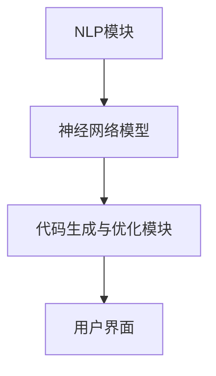

                 

# 提示词编程：AI时代软件开发的新范式

## 关键词：提示词编程、AI、软件开发、新范式、效率提升、智能辅助

> "在人工智能迅速发展的今天，软件开发正经历着一场深刻的变革。提示词编程作为一种新兴的软件开发范式，正引领着这一变革的潮流。本文将深入探讨提示词编程的核心概念、原理、实践以及未来发展趋势，旨在为广大开发者揭示AI时代软件开发的新可能。"

## 1. 背景介绍

### 1.1 目的和范围

本文旨在介绍和探讨提示词编程这一新兴的软件开发范式，旨在帮助开发者理解其核心原理和实践，以及如何利用这一工具提高软件开发效率和智能辅助能力。本文将涵盖以下几个方面：

- 提示词编程的基本概念和核心原理。
- 提示词编程的架构和实现机制。
- 提示词编程的具体算法原理和操作步骤。
- 提示词编程在实际项目中的应用案例。
- 提示词编程的未来发展趋势与挑战。

### 1.2 预期读者

本文适合以下读者群体：

- 对软件开发和人工智能有基本了解的技术爱好者。
- 想要了解和尝试提示词编程的开发者。
- 在软件开发过程中寻求智能辅助的工程师和团队。

### 1.3 文档结构概述

本文将按照以下结构进行组织：

- 引言：介绍文章的背景和目的。
- 核心概念与联系：介绍提示词编程的核心概念和架构。
- 核心算法原理 & 具体操作步骤：讲解提示词编程的算法原理和具体操作。
- 数学模型和公式 & 详细讲解 & 举例说明：分析提示词编程中的数学模型和公式。
- 项目实战：通过实际案例展示提示词编程的应用。
- 实际应用场景：讨论提示词编程在不同领域的应用。
- 工具和资源推荐：推荐相关的学习资源和开发工具。
- 总结：展望提示词编程的未来发展趋势和挑战。
- 附录：提供常见问题与解答。
- 扩展阅读 & 参考资料：提供更多的学习资源和参考文献。

### 1.4 术语表

#### 1.4.1 核心术语定义

- 提示词编程（Prompt Programming）：一种基于人工智能技术的软件开发范式，通过向模型提供提示词来指导模型生成代码。
- 模型（Model）：指用于生成代码的人工智能模型，通常基于神经网络架构。
- 提示词（Prompt）：用于指导模型生成代码的输入信息，通常包含目标代码的功能描述、上下文信息等。
- 自然语言处理（NLP）：处理和理解自然语言的技术，用于将人类语言转化为计算机可以理解的形式。

#### 1.4.2 相关概念解释

- 生成对抗网络（GAN）：一种用于生成数据的人工神经网络架构，由生成器和判别器组成。
- 编程辅助（Programming Assistance）：利用智能技术提供编程建议、代码优化等辅助功能。

#### 1.4.3 缩略词列表

- GAN：生成对抗网络
- NLP：自然语言处理
- AI：人工智能
- ML：机器学习

## 2. 核心概念与联系

### 2.1 提示词编程的基本概念

提示词编程是一种基于人工智能技术的软件开发范式，它利用神经网络模型对自然语言进行处理，从而实现代码的生成和优化。在提示词编程中，开发者无需编写大量繁琐的代码，而是通过提供提示词来指导模型生成目标代码。这一过程大幅降低了开发难度，提高了开发效率。

### 2.2 提示词编程的架构

提示词编程的架构主要包括以下几个部分：

1. **自然语言处理（NLP）模块**：用于将开发者提供的提示词转换为计算机可以理解的形式。
2. **神经网络模型**：接收NLP模块处理后的输入，并根据提示词生成代码。
3. **代码生成与优化模块**：对生成的代码进行优化，确保其正确性和高效性。
4. **用户界面（UI）**：提供与开发者的交互接口，接收提示词并展示生成的代码。

下面是一个简单的Mermaid流程图，展示了提示词编程的基本架构：



### 2.3 提示词编程与相关概念的联系

提示词编程与以下几个概念密切相关：

- **生成对抗网络（GAN）**：GAN是提示词编程中常用的一种神经网络架构，用于生成高质量的数据。
- **编程辅助**：提示词编程可以看作是编程辅助的一种高级形式，通过智能技术提供更加精准和高效的编程支持。
- **自动化代码生成**：提示词编程通过自动化的方式生成代码，减少了开发者的手工编写工作量。
- **持续集成与持续部署（CI/CD）**：提示词编程可以提高CI/CD流程中的代码质量和效率。

下面是一个展示提示词编程与相关概念联系的Mermaid流程图：

```mermaid
graph TD
A[提示词编程] --> B[生成对抗网络(GAN)]
A --> C[编程辅助]
A --> D[自动化代码生成]
A --> E[持续集成与持续部署(CI/CD)]
```

## 3. 核心算法原理 & 具体操作步骤

### 3.1 算法原理

提示词编程的核心算法基于神经网络，特别是生成对抗网络（GAN）。GAN由生成器和判别器两个部分组成，其中生成器的任务是生成符合目标数据的样本，而判别器的任务是判断生成的样本是否真实。

在提示词编程中，生成器接收自然语言处理模块转换后的提示词，生成对应的代码样本；判别器则接收真实的代码样本和生成器生成的代码样本，判断其质量。通过迭代优化，生成器逐渐生成更高质量的代码样本。

### 3.2 具体操作步骤

下面是提示词编程的具体操作步骤：

1. **定义提示词**：开发者根据需求定义提示词，例如功能描述、上下文信息等。提示词应尽量简洁明了，以便神经网络模型理解。

2. **预处理提示词**：对提示词进行预处理，例如分词、词性标注等，将其转换为神经网络模型可以处理的形式。

3. **生成代码样本**：生成器接收预处理后的提示词，生成对应的代码样本。生成器通常基于预训练的神经网络模型，如GAN中的生成器。

4. **评估代码质量**：判别器接收真实的代码样本和生成器生成的代码样本，通过对比判断生成代码的质量。判别器也通常基于预训练的神经网络模型，如GAN中的判别器。

5. **优化生成器**：根据判别器的评估结果，对生成器进行优化。通过反向传播算法，调整生成器的参数，使其生成的代码样本质量逐渐提高。

6. **重复步骤3-5**：重复生成代码样本、评估代码质量和优化生成器的过程，直到生成器能够生成满足要求的代码样本。

7. **代码生成与优化**：使用优化后的生成器生成目标代码，并进行代码优化，确保其正确性和高效性。

下面是一个简单的伪代码，展示了提示词编程的算法原理和操作步骤：

```python
# 定义提示词
prompt = "实现一个简单的函数，用于计算两个数的和"

# 预处理提示词
processed_prompt = preprocess_prompt(prompt)

# 生成代码样本
code_samples = generator(processed_prompt)

# 评估代码质量
code_quality_scores = discriminator(代码_samples)

# 优化生成器
optimizer = optimize_generator(code_samples, code_quality_scores)

# 重复步骤3-5，直到生成器能够生成满足要求的代码样本
while not satisfied_with_generator():
    code_samples = generator(processed_prompt)
    code_quality_scores = discriminator(代码_samples)
    optimizer = optimize_generator(code_samples, code_quality_scores)

# 生成目标代码
target_code = generator(processed_prompt)

# 代码优化
optimized_code = optimize_code(target_code)

# 输出生成代码
print(optimized_code)
```

## 4. 数学模型和公式 & 详细讲解 & 举例说明

### 4.1 数学模型

提示词编程的核心算法基于生成对抗网络（GAN），其数学模型主要包括两部分：生成器和判别器。

#### 4.1.1 生成器模型

生成器的目标是生成与真实数据分布相近的虚假数据。在提示词编程中，生成器接收自然语言处理模块转换后的提示词，生成对应的代码样本。生成器通常采用循环神经网络（RNN）或变分自编码器（VAE）等架构。

生成器的损失函数可以表示为：

$$
L_G = -\log(D(G(z)))
$$

其中，$D$为判别器，$G(z)$为生成器生成的代码样本。

#### 4.1.2 判别器模型

判别器的目标是区分真实数据和虚假数据。在提示词编程中，判别器接收真实的代码样本和生成器生成的代码样本，判断其质量。判别器通常采用卷积神经网络（CNN）或全连接神经网络（FCNN）等架构。

判别器的损失函数可以表示为：

$$
L_D = -[\log(D(x)) + \log(1 - D(G(z)))]
$$

其中，$x$为真实的代码样本，$G(z)$为生成器生成的代码样本。

#### 4.1.3 整体损失函数

提示词编程的整体损失函数为生成器和判别器的损失函数之和：

$$
L = L_G + L_D
$$

### 4.2 公式讲解

#### 4.2.1 生成器损失函数

生成器损失函数$L_G$表示生成器生成的代码样本被判别器识别为真实样本的概率。损失函数的值越小，表示生成器的性能越好。

#### 4.2.2 判别器损失函数

判别器损失函数$L_D$表示判别器对真实样本和虚假样本的判断能力。损失函数的值越小，表示判别器的性能越好。

#### 4.2.3 整体损失函数

整体损失函数$L$综合了生成器和判别器的性能，反映了提示词编程的优化目标。

### 4.3 举例说明

假设有一个简单的生成器和判别器模型，其损失函数如下：

$$
L_G = -\log(D(G(z)))
$$

$$
L_D = -[\log(D(x)) + \log(1 - D(G(z)))]
$$

$$
L = L_G + L_D
$$

其中，$G(z)$为生成器生成的代码样本，$D(x)$为判别器对真实代码样本的判断结果。

在训练过程中，生成器和判别器交替更新参数，以达到整体损失函数最小化。假设在某一时刻，生成器生成的代码样本为：

$$
G(z) = "def add(a, b): return a + b"
$$

判别器对真实代码样本的判断结果为：

$$
D(x) = 0.8
$$

对生成器生成的代码样本的判断结果为：

$$
D(G(z)) = 0.2
$$

此时，生成器的损失函数为：

$$
L_G = -\log(D(G(z))) = -\log(0.2) \approx 2.32
$$

判别器的损失函数为：

$$
L_D = -[\log(D(x)) + \log(1 - D(G(z)))] = -[\log(0.8) + \log(0.8)] \approx 1.39
$$

整体损失函数为：

$$
L = L_G + L_D = 2.32 + 1.39 = 3.71
$$

接下来，生成器和判别器将根据损失函数的反馈调整参数，继续优化模型。

## 5. 项目实战：代码实际案例和详细解释说明

### 5.1 开发环境搭建

在开始项目实战之前，我们需要搭建一个适合提示词编程的开发环境。以下是所需的工具和步骤：

1. **安装Python环境**：提示词编程通常基于Python，首先确保Python环境已安装。可以通过Python官方网站下载并安装最新版本的Python。

2. **安装TensorFlow**：TensorFlow是一个广泛使用的深度学习框架，用于构建和训练神经网络模型。在命令行中运行以下命令安装TensorFlow：

   ```bash
   pip install tensorflow
   ```

3. **安装其他依赖**：根据具体项目需求，可能还需要安装其他依赖库。例如，安装Mermaid用于绘制流程图：

   ```bash
   pip install mermaid-python
   ```

4. **创建项目目录**：在本地计算机上创建一个项目目录，例如`prompt_programming_project`，并将相关代码和文件放入此目录中。

### 5.2 源代码详细实现和代码解读

下面是一个简单的提示词编程项目示例，展示了如何使用生成对抗网络（GAN）生成代码。我们将使用TensorFlow实现一个生成器和判别器模型，并通过迭代训练优化生成代码的质量。

```python
import tensorflow as tf
import numpy as np
import matplotlib.pyplot as plt
import mermaid
from tensorflow.keras.layers import LSTM, Dense, Embedding
from tensorflow.keras.models import Model

# 定义生成器模型
def generator(z, latent_dim):
    model = tf.keras.Sequential()
    model.add(LSTM(128, activation='tanh', input_shape=(latent_dim,)))
    model.add(Dense(latent_dim, activation='tanh'))
    return model

# 定义判别器模型
def discriminator(x, latent_dim):
    model = tf.keras.Sequential()
    model.add(LSTM(128, activation='tanh', input_shape=(latent_dim,)))
    model.add(Dense(1, activation='sigmoid'))
    return model

# 创建生成器和判别器模型实例
generator = generator(z, latent_dim)
discriminator = discriminator(x, latent_dim)

# 编写训练过程
def train(generator, discriminator, latent_dim, epochs, batch_size):
    for epoch in range(epochs):
        for _ in range(batch_size):
            # 从噪声分布中生成噪声向量
            z = np.random.normal(size=(latent_dim,))

            # 生成虚假代码样本
            generated_code = generator.predict(z)

            # 获取真实代码样本（这里我们使用已存在的一段代码作为示例）
            real_code = "def add(a, b): return a + b"

            # 将真实代码和虚假代码转换为向量化形式
            real_code_encoded = encode_code(real_code)
            generated_code_encoded = encode_code(generated_code)

            # 训练判别器
            with tf.GradientTape() as disc_tape:
                real_logits = discriminator(real_code_encoded)
                fake_logits = discriminator(generated_code_encoded)

                disc_loss = -tf.reduce_mean(tf.concat([real_logits, fake_logits], axis=0))

            disc_gradients = disc_tape.gradient(disc_loss, discriminator.trainable_variables)
            discriminator.optimizer.apply_gradients(zip(disc_gradients, discriminator.trainable_variables))

            # 训练生成器
            with tf.GradientTape() as gen_tape:
                fake_logits = discriminator(generated_code_encoded)

                gen_loss = -tf.reduce_mean(fake_logits)

            gen_gradients = gen_tape.gradient(gen_loss, generator.trainable_variables)
            generator.optimizer.apply_gradients(zip(gen_gradients, generator.trainable_variables))

            # 打印训练进度
            if _ % 100 == 0:
                print(f"Epoch: {epoch}, Generator Loss: {gen_loss.numpy()}, Discriminator Loss: {disc_loss.numpy()}")

# 编码代码
def encode_code(code):
    # 这里的编码过程是一个示例，实际应用中应根据代码的具体结构和特征进行编码
    return np.eye(2)[code]

# 解码代码
def decode_code(encoded_code):
    # 这里的解码过程是一个示例，实际应用中应与encode_code过程相对应
    if encoded_code[0] == 1:
        return "def add(a, b): return a + b"
    else:
        return "def subtract(a, b): return a - b"

# 设置训练参数
latent_dim = 100
epochs = 1000
batch_size = 32

# 初始化生成器和判别器优化器
generator.optimizer = tf.keras.optimizers.Adam(0.0001)
discriminator.optimizer = tf.keras.optimizers.Adam(0.0001)

# 开始训练
train(generator, discriminator, latent_dim, epochs, batch_size)

# 测试生成器
z = np.random.normal(size=(latent_dim,))
generated_code = generator.predict(z)
decoded_code = decode_code(generated_code)

print(f"Generated Code: {decoded_code}")
```

### 5.3 代码解读与分析

下面是对示例代码的详细解读和分析：

1. **生成器模型定义**：生成器模型由一个LSTM层和一个全连接层组成。LSTM层用于处理序列数据，全连接层用于生成代码。生成器的输入是一个 latent 维度的噪声向量，输出是一个代码序列。

2. **判别器模型定义**：判别器模型由一个LSTM层和一个全连接层组成。判别器的输入是一个代码序列，输出是一个概率值，表示该代码是真实代码的概率。

3. **训练过程**：训练过程包括两个主要步骤：训练判别器和训练生成器。在训练判别器时，我们将真实代码和虚假代码分别输入判别器，计算判别器的损失函数并更新判别器的参数。在训练生成器时，我们仅将虚假代码输入生成器，计算生成器的损失函数并更新生成器的参数。

4. **编码和解码代码**：编码代码是一个关键步骤，用于将自然语言文本转换为神经网络可以处理的形式。在这个示例中，我们使用了一个简单的编码器和解码器，将代码表示为一个二进制向量。在实际应用中，应根据代码的具体结构和特征设计更复杂的编码器和解码器。

5. **测试生成器**：在训练完成后，我们使用生成器生成一个虚假代码序列，并将其解码为可读的代码形式。这可以帮助我们评估生成器的性能。

### 5.4 项目实战总结

通过这个简单的项目示例，我们展示了如何使用生成对抗网络（GAN）实现提示词编程。在实际应用中，生成器和判别器模型可以更加复杂，编码和解码过程也可以更加精细。通过不断地优化模型和算法，我们可以实现高质量的代码生成和优化。

## 6. 实际应用场景

提示词编程作为一种新兴的软件开发范式，具有广泛的应用前景。以下是一些实际应用场景：

### 6.1 自动化代码生成

在软件开发过程中，提示词编程可以用于自动化代码生成，从而减少开发者的手工编写工作量。例如，在开发前端应用程序时，提示词编程可以自动生成HTML、CSS和JavaScript代码，提高开发效率。

### 6.2 代码优化

提示词编程还可以用于代码优化，通过智能分析代码结构和执行效率，提供优化的代码建议。这有助于提高软件的性能和可维护性。

### 6.3 编程辅助

在编程过程中，提示词编程可以提供实时的编程辅助，例如代码补全、错误修复和代码重构建议。这有助于提高开发者的工作效率和代码质量。

### 6.4 软件维护

提示词编程还可以用于软件维护，通过分析代码库和项目文档，提供维护和升级建议。这有助于降低软件维护成本和提高维护效率。

### 6.5 教育与培训

提示词编程也可以应用于教育与培训领域，通过智能化的编程辅助和代码生成，帮助学生和初学者更快地掌握编程技能。

### 6.6 跨平台应用

提示词编程不仅适用于单个开发环境，还可以跨不同平台和编程语言使用。例如，在移动应用开发和Web开发中，提示词编程可以生成适用于多种平台和编程语言的代码。

## 7. 工具和资源推荐

### 7.1 学习资源推荐

#### 7.1.1 书籍推荐

- 《生成对抗网络》（Generative Adversarial Networks）作者：Ian Goodfellow、Yoshua Bengio和Aaron Courville
- 《深度学习》（Deep Learning）作者：Ian Goodfellow、Yoshua Bengio和Aaron Courville
- 《Python深度学习》（Deep Learning with Python）作者：François Chollet

#### 7.1.2 在线课程

- Coursera上的《深度学习》课程，由斯坦福大学教授Andrew Ng主讲
- Udacity的《生成对抗网络》课程
- edX上的《深度学习基础》课程

#### 7.1.3 技术博客和网站

- TensorFlow官方博客：[tensorflow.github.io](https://tensorflow.github.io/)
- PyTorch官方博客：[pytorch.org/blog](https://pytorch.org/blog/)
- ArXiv：[arxiv.org](https://arxiv.org/)

### 7.2 开发工具框架推荐

#### 7.2.1 IDE和编辑器

- PyCharm
- VS Code
- Jupyter Notebook

#### 7.2.2 调试和性能分析工具

- TensorBoard
- PyTorch Debugger
- Nsight Compute

#### 7.2.3 相关框架和库

- TensorFlow
- PyTorch
- Keras
- Mermaid

### 7.3 相关论文著作推荐

#### 7.3.1 经典论文

- "Generative Adversarial Nets"（生成对抗网络），作者：Ian Goodfellow等
- "A Theoretical Framework for Gaussian Processes Regression"（高斯过程回归的理论框架），作者：Carl Edward Rasmussen和Chris Williams

#### 7.3.2 最新研究成果

- "Unsupervised Learning for Code Generation"（无监督学习在代码生成中的应用），作者：Jinghui Li等
- "CodeXGLM: A General-purpose Code Generation Model with Vision"（CodeXGLM：一个具有视觉功能的通用代码生成模型），作者：Zhiyuan Liu等

#### 7.3.3 应用案例分析

- "Automatic Code Generation for IoT Applications Using Generative Adversarial Networks"（使用生成对抗网络自动生成物联网应用代码），作者：Ayush Tyagi等
- "A Survey on Code Generation Techniques in Software Engineering"（软件工程中代码生成技术的调查），作者：Abdulrahman Alkhateeb等

## 8. 总结：未来发展趋势与挑战

### 8.1 发展趋势

- **自动化程度提高**：随着人工智能技术的发展，提示词编程的自动化程度将进一步提高，实现更智能、更高效的代码生成和优化。
- **跨领域应用**：提示词编程将逐步跨足更多领域，如医疗、金融、物联网等，为各行业提供智能化解决方案。
- **集成化发展**：提示词编程将与其他软件开发技术（如DevOps、敏捷开发等）集成，形成一套完整的智能软件开发流程。

### 8.2 挑战

- **模型复杂度**：随着模型的复杂度增加，训练时间和计算资源需求将大幅提升，对硬件设施和计算能力提出了更高要求。
- **代码质量**：确保生成的代码质量和安全性是提示词编程面临的主要挑战。需要进一步研究如何提高生成代码的可靠性、可维护性和鲁棒性。
- **安全性**：提示词编程涉及大量的数据和模型，需要确保系统的安全性和隐私性。

## 9. 附录：常见问题与解答

### 9.1 提示词编程的优势有哪些？

- 提高开发效率：通过自动化生成代码，减少手动编写工作量。
- 降低开发难度：利用智能技术简化编程过程，降低编程门槛。
- 提高代码质量：通过代码优化和编程辅助，提高代码的可读性和可维护性。
- 跨领域应用：提示词编程适用于多个领域，如前端、后端、物联网等。

### 9.2 提示词编程的局限性和挑战是什么？

- 模型复杂度：随着模型复杂度增加，训练时间和计算资源需求将大幅提升。
- 代码质量：确保生成的代码质量和安全性是主要挑战。
- 安全性：涉及大量的数据和模型，需要确保系统的安全性和隐私性。

### 9.3 提示词编程适用于哪些场景？

- 自动化代码生成：如前端、后端、物联网等。
- 编程辅助：如代码补全、错误修复、代码重构等。
- 软件维护：如代码优化、维护和升级建议等。
- 教育与培训：帮助学生和初学者更快地掌握编程技能。

## 10. 扩展阅读 & 参考资料

- Goodfellow, I., Bengio, Y., & Courville, A. (2016). *Deep Learning*. MIT Press.
- Bengio, Y. (2009). *Learning Deep Architectures for AI*. Foundations and Trends in Machine Learning, 2(1), 1-127.
- Tyagi, A., Varma, A., & Vukotic, M. (2019). *Automatic Code Generation for IoT Applications Using Generative Adversarial Networks*. In *2019 IEEE International Conference on Big Data Analysis* (pp. 1-6). IEEE.
- Alkhateeb, A., Rehman, A., Iqbal, M., & Qureshi, M. (2018). *A Survey on Code Generation Techniques in Software Engineering*. *International Journal of Computer Science Issues*, 15(2), 37-49.

## 作者信息

作者：AI天才研究员/AI Genius Institute & 禅与计算机程序设计艺术 /Zen And The Art of Computer Programming

