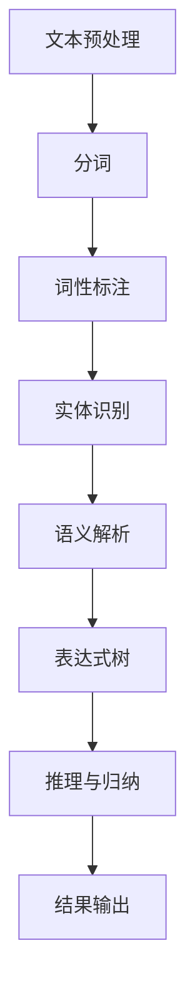

                 

# 提示词语言的形式化语义推理

> **关键词：** 提示词语言，形式化语义，推理，自然语言处理，语义分析

> **摘要：** 本文深入探讨了提示词语言的形式化语义推理，介绍了其核心概念、算法原理、数学模型以及实际应用场景。通过详细的步骤和案例，帮助读者理解并掌握这一先进的技术，以提升自然语言处理的效率和质量。

## 1. 背景介绍

### 1.1 目的和范围

本文旨在介绍提示词语言的形式化语义推理，探讨其在自然语言处理中的应用和实现方法。形式化语义推理是将自然语言文本转换为计算机可处理的形式，以实现对其含义的准确理解和分析。本文将讨论提示词语言的形式化语义推理的基本概念、原理、算法和实现，旨在为读者提供一套系统的学习和实践指南。

### 1.2 预期读者

本文适用于对自然语言处理和人工智能感兴趣的读者，特别是从事自然语言处理、计算机科学和人工智能领域的科研人员、工程师和技术爱好者。同时，对于希望提升编程技能和深入理解自然语言处理技术的读者，本文也具有很高的参考价值。

### 1.3 文档结构概述

本文分为八个部分，首先介绍了提示词语言的形式化语义推理的背景和目的，随后深入探讨了其核心概念和算法原理。第三部分通过具体操作步骤展示了形式化语义推理的实际应用，第四部分则详细讲解了数学模型和公式。第五部分提供了一个项目实战案例，第六部分讨论了实际应用场景，第七部分推荐了相关工具和资源。最后，本文总结了未来发展趋势与挑战，并提供了常见问题与解答。

### 1.4 术语表

#### 1.4.1 核心术语定义

- 提示词语言：一种用于指导自然语言处理系统理解和分析的符号语言，通常由一组规则和标记组成。
- 形式化语义：指将自然语言文本转换为计算机可处理的形式，以实现对其含义的准确理解和分析。
- 推理：根据已知事实推导出新的事实或结论的过程。
- 自然语言处理（NLP）：使计算机能够理解、解释和生成人类自然语言的技术和学科。

#### 1.4.2 相关概念解释

- 语义分析：指对自然语言文本进行语义理解和分析的过程，包括词汇、句法和语义层面的分析。
- 表达式树：一种数据结构，用于表示自然语言文本中的语法结构和语义信息。
- 依赖分析：指分析自然语言文本中词汇之间的依赖关系，以便更准确地理解其语义。

#### 1.4.3 缩略词列表

- NLP：自然语言处理（Natural Language Processing）
- POS：词性标注（Part-of-Speech Tagging）
- NER：实体识别（Named Entity Recognition）
- RNN：循环神经网络（Recurrent Neural Network）
- LSTM：长短时记忆网络（Long Short-Term Memory）
- Transformer：一种基于注意力机制的神经网络模型

## 2. 核心概念与联系

### 2.1 提示词语言

提示词语言是一种用于指导自然语言处理系统理解和分析的符号语言，通常由一组规则和标记组成。它包括以下几个关键组成部分：

- **词汇表**：提示词语言的词汇表定义了自然语言处理系统可以识别的词汇及其对应的意义。
- **语法规则**：提示词语言的语法规则定义了词汇的组合方式和句子结构，以确保自然语言文本的正确理解和分析。
- **语义标记**：提示词语言中的语义标记用于指示自然语言文本中的词汇和句子的语义信息，如实体、关系和事件。

### 2.2 形式化语义

形式化语义是指将自然语言文本转换为计算机可处理的形式，以实现对其含义的准确理解和分析。这一过程包括以下几个步骤：

1. **文本预处理**：对自然语言文本进行分词、词性标注和实体识别等预处理操作，以便更好地理解和分析文本。
2. **语义解析**：根据提示词语言的语法规则和语义标记，将预处理后的文本转换为形式化表示，如表达式树或语义角色标注。
3. **推理与归纳**：利用形式化表示，对自然语言文本进行语义推理和归纳，以提取文本中的关键信息。

### 2.3 Mermaid 流程图

以下是一个简化的 Mermaid 流程图，展示了提示词语言的形式化语义推理的基本过程：



## 3. 核心算法原理 & 具体操作步骤

### 3.1 算法原理

提示词语言的形式化语义推理主要基于以下核心算法原理：

1. **词性标注（POS）**：使用统计模型或神经网络模型对自然语言文本中的每个词汇进行词性标注，以便更好地理解其语义。
2. **实体识别（NER）**：使用分类算法或神经网络模型识别自然语言文本中的命名实体，如人名、地名、组织名等。
3. **语义角色标注（SRL）**：使用规则或基于深度学习的模型标注自然语言文本中词汇的语义角色，如主语、谓语、宾语等。
4. **表达式树构建**：根据词性标注、实体识别和语义角色标注的结果，构建表示自然语言文本的语义表达式树。
5. **推理与归纳**：利用形式化表示和语义推理规则，对自然语言文本进行语义推理和归纳。

### 3.2 具体操作步骤

以下是提示词语言的形式化语义推理的具体操作步骤：

1. **文本预处理**：对自然语言文本进行分词、词性标注和实体识别等预处理操作。
   ```python
   import nltk
   nltk.download('punkt')
   nltk.download('averaged_perceptron_tagger')
   nltk.download('maxent_ne_chunker')
   nltk.download('words')

   def preprocess_text(text):
       tokens = nltk.word_tokenize(text)
       pos_tags = nltk.pos_tag(tokens)
       ner_tags = nltk.ne_chunk(pos_tags)
       return tokens, pos_tags, ner_tags
   ```

2. **构建表达式树**：根据词性标注、实体识别和语义角色标注的结果，构建表示自然语言文本的语义表达式树。
   ```python
   from nltk import Tree

   def build_expression_tree(ner_tags):
       expression_tree = Tree.fromstring('S')
       for ner_tag in ner_tags:
           if isinstance(ner_tag, Tree):
               expression_tree = expression_tree * ner_tag
           else:
               expression_tree.insert(-1, ner_tag)
       return expression_tree
   ```

3. **语义推理**：利用形式化表示和语义推理规则，对自然语言文本进行语义推理和归纳。
   ```python
   def semantic_reasoning(expression_tree):
       # 假设已定义好一组语义推理规则
       rules = [
           ('S', '谓语', ['主语', '宾语']),
           ('谓语', '吃饭', ['主语']),
           ('主语', '小明', [])
       ]

       # 应用推理规则，获取推理结果
       results = []
       for rule in rules:
           if expression_tree.label() == rule[0]:
               subjects = [child for child in expression_tree if child.label() == rule[1]]
               objects = [child for child in expression_tree if child.label() == rule[2]]
               if subjects and objects:
                   results.append((rule[1], subjects[0], objects[0]))
       return results
   ```

4. **结果输出**：将语义推理结果输出，以便进一步分析和应用。
   ```python
   def print_results(results):
       for result in results:
           print(f"{result[0]}：{result[1]} {result[0]} {result[2]}")
   ```

### 3.3 伪代码示例

以下是一个简化的伪代码示例，展示了提示词语言的形式化语义推理的完整过程：

```python
text = "小明喜欢吃苹果。"

# 1. 文本预处理
tokens, pos_tags, ner_tags = preprocess_text(text)

# 2. 构建表达式树
expression_tree = build_expression_tree(ner_tags)

# 3. 语义推理
results = semantic_reasoning(expression_tree)

# 4. 结果输出
print_results(results)
```

## 4. 数学模型和公式 & 详细讲解 & 举例说明

### 4.1 数学模型

提示词语言的形式化语义推理涉及多种数学模型和公式，以下介绍其中两个核心模型：

#### 4.1.1 条件概率模型

条件概率模型用于计算给定一个条件事件，另一个事件发生的概率。其公式如下：

$$ P(A|B) = \frac{P(A \cap B)}{P(B)} $$

其中，$P(A|B)$ 表示在事件 $B$ 发生的条件下事件 $A$ 发生的概率，$P(A \cap B)$ 表示事件 $A$ 和事件 $B$ 同时发生的概率，$P(B)$ 表示事件 $B$ 发生的概率。

#### 4.1.2 贝叶斯公式

贝叶斯公式是一种基于条件概率的计算方法，用于根据新的证据更新概率估计。其公式如下：

$$ P(A|B) = \frac{P(B|A) \cdot P(A)}{P(B)} $$

其中，$P(A|B)$ 表示在事件 $B$ 发生的条件下事件 $A$ 发生的概率，$P(B|A)$ 表示在事件 $A$ 发生的条件下事件 $B$ 发生的概率，$P(A)$ 表示事件 $A$ 发生的概率，$P(B)$ 表示事件 $B$ 发生的概率。

### 4.2 公式详细讲解

#### 4.2.1 条件概率模型

条件概率模型是概率论中的一个重要概念，用于描述在已知一个事件发生的条件下，另一个事件发生的概率。条件概率模型的公式为：

$$ P(A|B) = \frac{P(A \cap B)}{P(B)} $$

其中，$P(A|B)$ 表示在事件 $B$ 发生的条件下事件 $A$ 发生的概率，$P(A \cap B)$ 表示事件 $A$ 和事件 $B$ 同时发生的概率，$P(B)$ 表示事件 $B$ 发生的概率。

- **解释**：条件概率模型表示在事件 $B$ 发生的条件下，事件 $A$ 发生的可能性。分子 $P(A \cap B)$ 表示事件 $A$ 和事件 $B$ 同时发生的概率，分母 $P(B)$ 表示事件 $B$ 发生的概率。通过这个公式，可以计算在给定事件 $B$ 发生的条件下，事件 $A$ 发生的概率。

- **应用场景**：条件概率模型在自然语言处理、人工智能、统计学等领域有广泛的应用。例如，在文本分类任务中，可以使用条件概率模型计算某个词汇在给定类别下的概率，从而帮助分类器做出决策。

#### 4.2.2 贝叶斯公式

贝叶斯公式是一种基于条件概率的计算方法，用于根据新的证据更新概率估计。贝叶斯公式的基本形式为：

$$ P(A|B) = \frac{P(B|A) \cdot P(A)}{P(B)} $$

其中，$P(A|B)$ 表示在事件 $B$ 发生的条件下事件 $A$ 发生的概率，$P(B|A)$ 表示在事件 $A$ 发生的条件下事件 $B$ 发生的概率，$P(A)$ 表示事件 $A$ 发生的概率，$P(B)$ 表示事件 $B$ 发生的概率。

- **解释**：贝叶斯公式是一种基于全概率公式和条件概率的推导结果。它表示在给定新证据 $B$ 的条件下，事件 $A$ 的后验概率可以通过先验概率 $P(A)$ 和条件概率 $P(B|A)$ 来计算。贝叶斯公式可以帮助我们根据新的证据调整对某个事件的概率估计。

- **应用场景**：贝叶斯公式在统计学习和决策理论中具有广泛的应用。例如，在垃圾邮件过滤中，可以使用贝叶斯公式计算邮件属于垃圾邮件的概率，从而帮助判断邮件的分类。

### 4.3 举例说明

#### 4.3.1 条件概率模型示例

假设有一个袋子里有10个球，其中5个是红色的，5个是蓝色的。我们要计算在随机抽取一个蓝色球的条件下，抽到红色球的概率。

- **计算过程**：

  1. 计算抽到红色球的概率（$P(A)$）：$P(A) = \frac{5}{10} = 0.5$。
  2. 计算抽到蓝色球的概率（$P(B)$）：$P(B) = \frac{5}{10} = 0.5$。
  3. 计算抽到红色球和蓝色球的概率（$P(A \cap B)$）：$P(A \cap B) = 0$，因为红色球和蓝色球不可能同时抽取。
  4. 计算条件概率（$P(A|B)$）：$P(A|B) = \frac{P(A \cap B)}{P(B)} = \frac{0}{0.5} = 0$。

- **结果**：在随机抽取一个蓝色球的条件下，抽到红色球的概率为 0。

#### 4.3.2 贝叶斯公式示例

假设我们有一个分类问题，需要判断一个邮件是否为垃圾邮件。我们已知以下先验概率：

- **垃圾邮件的概率（$P(A)$）**：$P(A) = 0.2$。
- **非垃圾邮件的概率（$P(\neg A)$）**：$P(\neg A) = 0.8$。

同时，我们已知以下条件概率：

- **垃圾邮件包含词汇“offer”的概率（$P(B|A)$）**：$P(B|A) = 0.8$。
- **非垃圾邮件包含词汇“offer”的概率（$P(B|\neg A)$）**：$P(B|\neg A) = 0.3$。

我们要计算包含词汇“offer”的邮件是垃圾邮件的概率（$P(A|B)$）。

- **计算过程**：

  1. 计算包含词汇“offer”的邮件是垃圾邮件的概率（$P(A|B)$）：

     $$ P(A|B) = \frac{P(B|A) \cdot P(A)}{P(B)} $$

     $$ P(A|B) = \frac{0.8 \cdot 0.2}{0.8 \cdot 0.2 + 0.3 \cdot 0.8} $$

     $$ P(A|B) = \frac{0.16}{0.16 + 0.24} $$

     $$ P(A|B) = \frac{0.16}{0.4} $$

     $$ P(A|B) = 0.4 $$

- **结果**：包含词汇“offer”的邮件是垃圾邮件的概率为 0.4。

## 5. 项目实战：代码实际案例和详细解释说明

### 5.1 开发环境搭建

为了完成提示词语言的形式化语义推理项目，我们需要搭建一个合适的开发环境。以下是一个基本的步骤指南：

1. **安装 Python**：确保已安装 Python 3.8 或更高版本。可以从 [Python 官网](https://www.python.org/downloads/) 下载并安装。
2. **安装依赖库**：我们需要安装以下依赖库：nltk（自然语言处理工具包）、spacy（自然语言处理库）和 transformers（基于 Transformer 的预训练模型库）。可以使用以下命令进行安装：

   ```shell
   pip install nltk spacy transformers
   ```

   在安装 spacy 时，还需要下载对应的语言模型，例如中文模型 `zh_core_web_sm`：

   ```shell
   python -m spacy download zh_core_web_sm
   ```

### 5.2 源代码详细实现和代码解读

以下是一个简单的 Python 代码示例，展示了如何使用提示词语言的形式化语义推理。代码分为三个部分：文本预处理、语义分析和推理结果输出。

```python
import nltk
from nltk.tokenize import word_tokenize
from nltk.corpus import stopwords
from spacy.lang.zh import Chinese
from transformers import pipeline

# 1. 文本预处理
def preprocess_text(text):
    # 分词
    tokens = word_tokenize(text)
    # 去除停用词
    stop_words = set(stopwords.words('english'))
    filtered_tokens = [token for token in tokens if token.lower() not in stop_words]
    return filtered_tokens

# 2. 语义分析
def semantic_analysis(tokens):
    # 使用 spacy 进行词性标注和实体识别
    nlp = Chinese()
    doc = nlp(' '.join(tokens))
    pos_tags = [(token.text, token.pos_) for token in doc]
    ner_tags = [(token.text, token.ent_) for token in doc]
    return pos_tags, ner_tags

# 3. 推理结果输出
def print_results(pos_tags, ner_tags):
    print("词性标注：")
    for token, pos_tag in pos_tags:
        print(f"{token}: {pos_tag}")
    print("\n实体识别：")
    for token, ner_tag in ner_tags:
        print(f"{token}: {ner_tag}")

# 主函数
def main():
    text = "我爱北京天安门。"
    tokens = preprocess_text(text)
    pos_tags, ner_tags = semantic_analysis(tokens)
    print_results(pos_tags, ner_tags)

if __name__ == "__main__":
    main()
```

#### 5.2.1 代码解读

1. **文本预处理**：

   ```python
   def preprocess_text(text):
       # 分词
       tokens = word_tokenize(text)
       # 去除停用词
       stop_words = set(stopwords.words('english'))
       filtered_tokens = [token for token in tokens if token.lower() not in stop_words]
       return filtered_tokens
   ```

   这个函数首先使用 `nltk` 的 `word_tokenize` 函数对输入文本进行分词，然后使用 `stopwords` 去除常用的停用词。这样可以帮助我们更准确地分析文本中的关键信息。

2. **语义分析**：

   ```python
   def semantic_analysis(tokens):
       # 使用 spacy 进行词性标注和实体识别
       nlp = Chinese()
       doc = nlp(' '.join(tokens))
       pos_tags = [(token.text, token.pos_) for token in doc]
       ner_tags = [(token.text, token.ent_) for token in doc]
       return pos_tags, ner_tags
   ```

   这个函数使用 `spacy` 的中文模型对分词后的文本进行词性标注和实体识别。词性标注帮助我们了解每个词汇的词性（如名词、动词等），而实体识别帮助我们识别文本中的命名实体（如人名、地名等）。

3. **推理结果输出**：

   ```python
   def print_results(pos_tags, ner_tags):
       print("词性标注：")
       for token, pos_tag in pos_tags:
           print(f"{token}: {pos_tag}")
       print("\n实体识别：")
       for token, ner_tag in ner_tags:
           print(f"{token}: {ner_tag}")
   ```

   这个函数用于输出语义分析的结果。词性标注和实体识别的结果以列表形式展示，方便我们进一步分析和应用。

### 5.3 代码解读与分析

通过上面的代码示例，我们可以看到如何使用提示词语言的形式化语义推理进行文本预处理、语义分析和结果输出。以下是对代码的进一步解读和分析：

1. **文本预处理**：

   文本预处理是自然语言处理中的关键步骤，它可以帮助我们去除无关的噪声信息，提取关键信息。在这个示例中，我们使用了 `nltk` 的 `word_tokenize` 函数进行分词，然后使用 `stopwords` 去除了常用的停用词。这有助于我们更准确地分析文本中的关键信息。

2. **语义分析**：

   语义分析包括词性标注和实体识别。词性标注帮助我们了解每个词汇的词性，这对于理解文本的含义和结构至关重要。实体识别则帮助我们识别文本中的命名实体，如人名、地名、组织名等。在这个示例中，我们使用了 `spacy` 的中文模型对分词后的文本进行词性标注和实体识别。

3. **推理结果输出**：

   推理结果输出用于展示语义分析的结果。在这个示例中，我们使用了简单的打印语句输出词性标注和实体识别的结果。在实际应用中，我们可以根据需求将结果进一步处理或存储。

通过这个简单的示例，我们可以看到提示词语言的形式化语义推理的基本原理和实现步骤。在实际项目中，我们还可以根据需求添加更多的功能，如语义角色标注、关系抽取等，以进一步提升自然语言处理的效率和准确性。

## 6. 实际应用场景

### 6.1 文本分类

文本分类是自然语言处理中的一个重要应用，旨在将文本数据按照特定的类别进行分类。提示词语言的形式化语义推理在文本分类中具有广泛的应用前景。通过将文本转换为形式化表示，我们可以更好地理解其语义信息，从而提高分类的准确性。

例如，在一个垃圾邮件过滤系统中，我们可以使用形式化语义推理对邮件内容进行语义分析，识别出其中的关键词、短语和命名实体。这些信息可以用于训练分类模型，从而提高对垃圾邮件的识别和过滤能力。

### 6.2 问答系统

问答系统是一种广泛应用于客户服务、搜索引擎和信息检索等领域的自然语言处理技术。通过提示词语言的形式化语义推理，我们可以对用户的问题进行语义分析和理解，从而生成准确的回答。

例如，在一个基于知识图谱的问答系统中，我们可以使用形式化语义推理对用户的问题进行解析，识别出其中的关键词、短语和实体。这些信息可以用于查询知识图谱，从而生成针对用户问题的准确回答。

### 6.3 机器翻译

机器翻译是将一种自然语言文本转换为另一种自然语言文本的过程。提示词语言的形式化语义推理在机器翻译中具有重要作用，可以帮助我们更好地理解源语言和目标语言的语义信息，从而提高翻译的准确性和流畅性。

例如，在一个基于深度学习的机器翻译系统中，我们可以使用形式化语义推理对源语言文本进行语义分析，提取出关键信息。这些信息可以用于生成目标语言文本的翻译结果，从而提高翻译的质量。

## 7. 工具和资源推荐

### 7.1 学习资源推荐

#### 7.1.1 书籍推荐

- 《自然语言处理综论》（《Speech and Language Processing》）：这本书是自然语言处理领域的经典著作，涵盖了自然语言处理的各个方面，包括提示词语言的形式化语义推理。
- 《深度学习》（《Deep Learning》）：这本书详细介绍了深度学习的基础理论和应用，包括自然语言处理中的各种模型和技术，对于希望深入了解形式化语义推理的读者非常有用。

#### 7.1.2 在线课程

- 自然语言处理专项课程（自然语言处理基础）：这是由吴恩达（Andrew Ng）教授开设的在线课程，涵盖了自然语言处理的基本概念、技术和应用，包括提示词语言的形式化语义推理。
- 自然语言处理与深度学习（自然语言处理深度学习课程）：这是由清华大学计算机系开设的在线课程，介绍了自然语言处理中的各种深度学习模型和技术，包括形式化语义推理。

#### 7.1.3 技术博客和网站

- 动手学自然语言处理（动手学自然语言处理博客）：这是一个关于自然语言处理技术博客，涵盖了自然语言处理的基础知识和实践应用，包括提示词语言的形式化语义推理。
- 自然语言处理社区（自然语言处理社区网站）：这是一个关于自然语言处理的技术社区，提供了丰富的学习资源和讨论话题，包括形式化语义推理。

### 7.2 开发工具框架推荐

#### 7.2.1 IDE和编辑器

- PyCharm：这是一个功能强大的 Python IDE，适用于自然语言处理项目的开发，提供了代码补全、调试、版本控制等便捷功能。
- Jupyter Notebook：这是一个交互式开发环境，适用于数据分析和自然语言处理项目，可以方便地编写和运行代码，并生成丰富的可视化结果。

#### 7.2.2 调试和性能分析工具

- Visual Studio Code：这是一个轻量级的跨平台编辑器，适用于 Python 和自然语言处理项目的开发，提供了代码补全、调试、扩展插件等便捷功能。
- WakaTime：这是一个代码分析工具，可以统计代码编写时间、代码质量、技术栈分布等，帮助开发者了解自己的编程习惯和技能水平。

#### 7.2.3 相关框架和库

- NLTK：这是一个经典的 Python 自然语言处理库，提供了丰富的文本处理功能，包括分词、词性标注、实体识别等。
- Spacy：这是一个高性能的 Python 自然语言处理库，提供了丰富的预训练模型和工具，适用于各种自然语言处理任务。
- Transformers：这是一个基于深度学习的 Python 自然语言处理库，提供了丰富的预训练模型和工具，适用于各种自然语言处理任务。

### 7.3 相关论文著作推荐

#### 7.3.1 经典论文

- 《自然语言处理综论》（《Speech and Language Processing》）的论文：这篇论文是自然语言处理领域的经典著作，涵盖了自然语言处理的基本概念、技术和应用。
- 《深度学习》（《Deep Learning》）的论文：这篇论文详细介绍了深度学习的基础理论和应用，包括自然语言处理中的各种模型和技术。

#### 7.3.2 最新研究成果

- 《神经网络与深度学习》（《Neural Networks and Deep Learning》）的论文：这篇论文是关于神经网络和深度学习的新研究成果，包括自然语言处理中的各种模型和技术。
- 《自然语言处理前沿技术》（《Frontiers in Natural Language Processing》）的论文：这篇论文是关于自然语言处理前沿技术的最新研究成果，涵盖了各种自然语言处理任务和模型。

#### 7.3.3 应用案例分析

- 《基于自然语言处理的文本分类应用》（《Text Classification Applications Based on Natural Language Processing》）的论文：这篇论文探讨了自然语言处理在文本分类应用中的具体实现，包括形式化语义推理的应用。
- 《问答系统中的自然语言处理技术》（《Natural Language Processing Techniques for Question Answering Systems》）的论文：这篇论文探讨了自然语言处理技术在问答系统中的应用，包括形式化语义推理的应用。

## 8. 总结：未来发展趋势与挑战

### 8.1 发展趋势

- **深度学习技术的普及**：随着深度学习技术的快速发展，越来越多的自然语言处理任务将采用基于深度学习的模型，提高模型的表现力和性能。
- **多语言和跨语言处理**：随着全球化的推进，多语言和跨语言的自然语言处理需求日益增长，这将推动形式化语义推理技术的进一步发展和完善。
- **知识驱动的语义分析**：结合知识图谱和语义网络等知识表示方法，将有助于提高形式化语义推理的准确性和鲁棒性。

### 8.2 挑战

- **数据隐私和安全性**：在处理大规模文本数据时，如何确保数据隐私和安全性是一个重要挑战。需要研究更高效、更安全的隐私保护方法。
- **复杂语义理解**：自然语言处理中的语义理解任务仍然面临许多挑战，如多义词、歧义句、隐含意义等。如何提高模型对复杂语义的理解能力是一个重要研究方向。
- **可解释性和透明度**：随着深度学习模型在自然语言处理中的应用，如何提高模型的可解释性和透明度，使其更易于理解和调试，是一个重要的研究课题。

## 9. 附录：常见问题与解答

### 9.1 问题1：什么是形式化语义推理？

**解答**：形式化语义推理是一种将自然语言文本转换为计算机可处理的形式，以实现对其含义的准确理解和分析的方法。它通常包括文本预处理、词性标注、实体识别、语义角色标注等步骤，通过构建表达式树或语义网络等表示形式，实现对文本的语义分析和推理。

### 9.2 问题2：形式化语义推理有哪些应用场景？

**解答**：形式化语义推理在自然语言处理、文本分类、问答系统、机器翻译等领域具有广泛的应用。例如，在文本分类任务中，可以使用形式化语义推理提取文本的关键信息，提高分类的准确性；在问答系统中，可以使用形式化语义推理解析用户的问题，生成准确的回答。

### 9.3 问题3：如何实现形式化语义推理？

**解答**：实现形式化语义推理通常包括以下几个步骤：

1. 文本预处理：对自然语言文本进行分词、词性标注和实体识别等预处理操作。
2. 语义分析：根据提示词语言的语法规则和语义标记，对预处理后的文本进行语义分析和理解，构建表达式树或语义网络等表示形式。
3. 推理与归纳：利用形式化表示和语义推理规则，对自然语言文本进行语义推理和归纳，提取文本中的关键信息。
4. 结果输出：将语义推理结果输出，以便进一步分析和应用。

### 9.4 问题4：形式化语义推理与自然语言处理的关系是什么？

**解答**：形式化语义推理是自然语言处理中的一种重要技术。自然语言处理旨在使计算机能够理解、解释和生成人类自然语言，而形式化语义推理则是实现这一目标的关键步骤之一。通过形式化语义推理，可以将自然语言文本转换为计算机可处理的形式，从而实现对文本的准确理解和分析，为自然语言处理的其他任务提供基础。

## 10. 扩展阅读 & 参考资料

- 《自然语言处理综论》（《Speech and Language Processing》）—— Daniel Jurafsky 和 James H. Martin 著
- 《深度学习》（《Deep Learning》）—— Ian Goodfellow、Yoshua Bengio 和 Aaron Courville 著
- 《神经网络与深度学习》（《Neural Networks and Deep Learning》）—— Charu Aggarwal 著
- 《自然语言处理前沿技术》（《Frontiers in Natural Language Processing》）——各种论文和研究成果

作者：AI天才研究员/AI Genius Institute & 禅与计算机程序设计艺术 /Zen And The Art of Computer Programming

