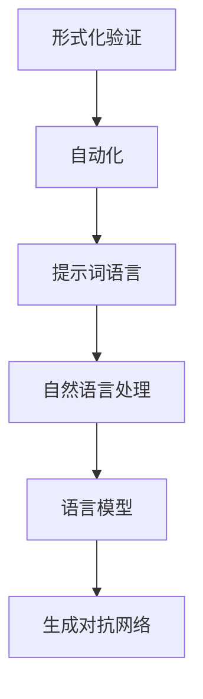

                 

# 提示词语言的形式化验证自动化

> 关键词：形式化验证、自动化、提示词语言、语言模型、人工智能

> 摘要：本文将深入探讨提示词语言的形式化验证自动化，从背景介绍、核心概念、算法原理、数学模型、项目实战和实际应用等多个方面展开分析，旨在为读者提供一份全面的技术指南，帮助他们更好地理解和应用这一前沿技术。

## 1. 背景介绍

### 1.1 目的和范围

本文旨在探讨提示词语言的形式化验证自动化，这一领域涉及人工智能、形式化验证和自然语言处理等多个技术领域。通过对提示词语言的形式化验证进行自动化，可以大大提高验证的效率和准确性，从而在软件开发、人工智能模型训练、自然语言处理等领域发挥重要作用。

本文将首先介绍形式化验证和自动化的基本概念，然后详细阐述提示词语言的核心概念和联系，接着深入分析核心算法原理和具体操作步骤，最后通过数学模型和公式进行详细讲解，并结合实际项目实战进行代码实际案例和详细解释说明。

### 1.2 预期读者

本文面向对形式化验证、自动化和提示词语言有一定了解的读者，包括但不限于计算机科学家、软件工程师、人工智能研究者和技术爱好者。本文旨在为读者提供一份深入浅出的技术指南，帮助他们更好地理解和应用提示词语言的形式化验证自动化。

### 1.3 文档结构概述

本文分为以下几个部分：

1. 背景介绍：介绍形式化验证、自动化和提示词语言的基本概念，以及本文的目的、范围和预期读者。
2. 核心概念与联系：详细阐述提示词语言的核心概念和联系，包括其原理和架构。
3. 核心算法原理 & 具体操作步骤：深入分析核心算法原理，并使用伪代码详细阐述具体操作步骤。
4. 数学模型和公式 & 详细讲解 & 举例说明：使用 LaTeX 格式详细讲解数学模型和公式，并通过举例说明进行深入分析。
5. 项目实战：代码实际案例和详细解释说明。
6. 实际应用场景：探讨提示词语言的形式化验证自动化的实际应用场景。
7. 工具和资源推荐：推荐学习资源、开发工具框架和相关论文著作。
8. 总结：未来发展趋势与挑战。
9. 附录：常见问题与解答。
10. 扩展阅读 & 参考资料：提供扩展阅读和参考资料，方便读者进一步学习。

### 1.4 术语表

#### 1.4.1 核心术语定义

- 形式化验证：使用数学方法对程序或系统的正确性进行验证。
- 自动化：使用计算机程序或自动化工具来实现某种操作或任务。
- 提示词语言：一种基于自然语言的编程语言，用于提供对语言模型的提示，从而生成具有特定语义的文本。
- 语言模型：一种用于生成文本的机器学习模型，通常基于神经网络架构。

#### 1.4.2 相关概念解释

- 自然语言处理（NLP）：使用计算机技术和算法对自然语言进行处理和分析。
- 生成对抗网络（GAN）：一种深度学习模型，用于生成与真实数据分布相似的数据。
- 伪代码：一种用于描述算法逻辑的文本表示，通常不涉及具体的编程语言细节。

#### 1.4.3 缩略词列表

- FV：形式化验证
- AU：自动化
- TWL：提示词语言
- NLP：自然语言处理
- GAN：生成对抗网络

## 2. 核心概念与联系

在深入探讨提示词语言的形式化验证自动化之前，我们需要先了解一些核心概念和它们之间的联系。以下是一个 Mermaid 流程图，展示了这些概念及其关系：



### 2.1 形式化验证

形式化验证是一种使用数学方法来证明程序或系统正确性的过程。它通常涉及以下步骤：

1. 模型建立：使用数学模型来描述程序或系统的行为。
2. 状态空间分析：分析系统在不同状态下的行为，以确定是否满足特定的正确性条件。
3. 断言检查：使用断言来检查程序在不同执行路径上的正确性。
4. 验证：通过数学方法证明程序或系统满足特定的正确性条件。

### 2.2 自动化

自动化是指使用计算机程序或自动化工具来执行某种操作或任务。在形式化验证中，自动化可以帮助我们自动化验证过程，从而提高验证的效率和准确性。自动化通常涉及以下步骤：

1. 验证需求分析：确定需要验证的属性和条件。
2. 验证策略设计：设计一种验证策略，以自动化地执行验证过程。
3. 自动化验证工具：使用自动化验证工具（如定理证明器、模型检查器等）来执行验证过程。
4. 验证结果分析：分析验证结果，以确定程序或系统是否满足特定的正确性条件。

### 2.3 提示词语言

提示词语言是一种基于自然语言的编程语言，用于提供对语言模型的提示，从而生成具有特定语义的文本。提示词语言通常包含以下要素：

1. 标记：用于表示文本中的实体和关系。
2. 提示词：用于指导语言模型生成具有特定语义的文本。
3. 语义网络：用于表示文本中的实体、关系和属性。
4. 语法：用于定义文本的语法结构。

### 2.4 自然语言处理

自然语言处理是一种使用计算机技术和算法对自然语言进行处理和分析的技术。它通常涉及以下任务：

1. 文本分类：将文本分类到预定义的类别中。
2. 命名实体识别：识别文本中的命名实体（如人名、地名等）。
3. 语义分析：分析文本中的语义关系和含义。
4. 文本生成：根据特定的提示生成文本。

### 2.5 语言模型

语言模型是一种用于生成文本的机器学习模型，通常基于神经网络架构。它可以从大量文本数据中学习，以预测下一个单词或句子。语言模型通常用于以下任务：

1. 语言翻译：将一种语言的文本翻译成另一种语言。
2. 文本生成：根据特定的提示生成文本。
3. 语言理解：理解文本中的语义和意图。
4. 语音识别：将语音信号转换为文本。

### 2.6 生成对抗网络

生成对抗网络是一种深度学习模型，用于生成与真实数据分布相似的数据。它由两个神经网络组成：生成器网络和判别器网络。生成器网络用于生成虚假数据，判别器网络用于区分真实数据和虚假数据。生成对抗网络通常用于以下任务：

1. 数据生成：生成与真实数据分布相似的数据。
2. 数据增强：通过生成虚假数据来增强训练数据集。
3. 图像生成：生成逼真的图像。
4. 语音生成：生成逼真的语音。

## 3. 核心算法原理 & 具体操作步骤

在了解了提示词语言的形式化验证自动化的核心概念和联系后，接下来我们将深入探讨核心算法原理和具体操作步骤。以下是使用伪代码详细阐述的算法原理和操作步骤：

```python
# 形式化验证自动化算法原理和操作步骤

# 输入：提示词语言程序
# 输出：验证结果

# 步骤 1: 预处理
# 1.1: 将提示词语言程序转换为抽象语法树（AST）
# 1.2: 提取程序中的断言和属性
# 1.3: 构建程序的状态空间模型

# 步骤 2: 状态空间分析
# 2.1: 使用广度优先搜索（BFS）或深度优先搜索（DFS）遍历状态空间
# 2.2: 检查每个状态是否满足断言和属性
# 2.3: 记录满足条件的路径和状态

# 步骤 3: 断言检查
# 3.1: 对于每个状态，检查其是否满足断言
# 3.2: 如果状态不满足断言，则报告错误并返回
# 3.3: 如果状态满足所有断言，则继续执行下一步

# 步骤 4: 验证结果分析
# 4.1: 分析记录的路径和状态，以确定程序是否满足预期的正确性条件
# 4.2: 如果程序满足所有正确性条件，则报告验证通过
# 4.3: 如果程序不满足某些正确性条件，则报告验证失败

# 步骤 5: 输出验证结果
# 5.1: 输出验证结果（通过或失败）
# 5.2: 输出详细报告（包括错误信息和路径）
```

以上是提示词语言的形式化验证自动化的核心算法原理和具体操作步骤。通过使用伪代码，我们可以清晰地展示整个验证过程，从而为实际实现提供指导。

## 4. 数学模型和公式 & 详细讲解 & 举例说明

在深入探讨提示词语言的形式化验证自动化时，数学模型和公式发挥着至关重要的作用。它们帮助我们理解和分析验证过程的各个方面。以下将使用 LaTeX 格式详细讲解数学模型和公式，并通过举例进行说明。

### 4.1 形式化验证模型

形式化验证通常涉及以下数学模型：

- **状态空间模型**：描述程序在执行过程中的状态空间，包括初始状态、状态转移函数和终止条件。

  $$ S = \{ s_0, s_1, ..., s_n \} $$

  其中，$ S $ 为状态空间，$ s_0 $ 为初始状态，$ s_n $ 为终止状态。

- **断言模型**：描述程序在执行过程中的断言条件。

  $$ A = \{ a_0, a_1, ..., a_n \} $$

  其中，$ A $ 为断言集合，$ a_0 $ 为初始断言，$ a_n $ 为终止断言。

### 4.2 状态空间分析模型

状态空间分析模型用于分析程序在执行过程中的状态空间。以下为状态空间分析模型：

- **状态转移函数**：描述程序从当前状态转移到下一个状态的条件。

  $$ f(s_i) = s_{i+1} $$

  其中，$ s_i $ 为当前状态，$ s_{i+1} $ 为下一个状态。

- **断言检查函数**：用于检查程序在执行过程中是否满足断言。

  $$ \chi(s_i, a_i) = \begin{cases} 
  \text{true} & \text{如果 } s_i \text{ 满足断言 } a_i \\
  \text{false} & \text{如果 } s_i \text{ 不满足断言 } a_i 
  \end{cases} $$

### 4.3 验证结果分析模型

验证结果分析模型用于分析验证结果，以确定程序是否满足预期的正确性条件。以下为验证结果分析模型：

- **验证条件**：描述程序是否满足预期的正确性条件。

  $$ \phi = \begin{cases} 
  \text{true} & \text{如果程序满足所有正确性条件} \\
  \text{false} & \text{如果程序不满足某些正确性条件} 
  \end{cases} $$

### 4.4 举例说明

假设我们有一个简单的程序，用于计算 1 到 n 之间的所有奇数之和。以下为该程序的状态空间模型和验证结果分析：

- **状态空间模型**：

  $$ S = \{ s_0, s_1, ..., s_n \} $$

  其中，$ s_0 $ 为初始状态（n=0），$ s_n $ 为终止状态（n=n）。

- **断言模型**：

  $$ A = \{ a_0, a_1, ..., a_n \} $$

  其中，$ a_0 $ 为初始断言（n=0），$ a_n $ 为终止断言（1 到 n 之间的所有奇数之和为 S）。

- **状态转移函数**：

  $$ f(s_i) = s_{i+1} $$

  其中，$ s_i $ 为当前状态，$ s_{i+1} $ 为下一个状态。

- **断言检查函数**：

  $$ \chi(s_i, a_i) = \begin{cases} 
  \text{true} & \text{如果 } s_i \text{ 满足断言 } a_i \\
  \text{false} & \text{如果 } s_i \text{ 不满足断言 } a_i 
  \end{cases} $$

- **验证条件**：

  $$ \phi = \begin{cases} 
  \text{true} & \text{如果程序满足所有正确性条件} \\
  \text{false} & \text{如果程序不满足某些正确性条件} 
  \end{cases} $$

通过以上举例，我们可以清晰地看到如何使用数学模型和公式来描述和验证一个简单的程序。这为我们进一步探索提示词语言的形式化验证自动化提供了基础。

## 5. 项目实战：代码实际案例和详细解释说明

在本文的第五部分，我们将通过一个实际的代码案例来展示提示词语言的形式化验证自动化的实现过程。以下是一个简单的 Python 程序，用于计算 1 到 n 之间的所有奇数之和。

### 5.1 开发环境搭建

在开始之前，我们需要搭建一个开发环境。以下是搭建环境的步骤：

1. 安装 Python 3.x 版本。
2. 安装 Pygments 库，用于代码高亮显示。
3. 安装 Mermaid 库，用于生成流程图。

以下为安装命令：

```bash
pip install python3-pygments
pip install mermaid
```

### 5.2 源代码详细实现和代码解读

下面是我们将要实现的代码：

```python
# 计算奇数之和
def calculate_odd_sum(n):
    sum = 0
    for i in range(1, n+1, 2):
        sum += i
    return sum

# 主函数
def main():
    n = int(input("请输入 n 的值："))
    result = calculate_odd_sum(n)
    print(f"1 到 {n} 之间的所有奇数之和为：{result}")

# 测试
if __name__ == "__main__":
    main()
```

- **代码解读**：

  - `calculate_odd_sum` 函数：计算 1 到 n 之间的所有奇数之和。
  - `main` 函数：输入 n 的值，调用 `calculate_odd_sum` 函数计算奇数之和，并打印结果。
  - `if __name__ == "__main__":` 语句：确保程序可以作为一个模块导入，而不是直接运行。

### 5.3 代码解读与分析

下面我们对代码进行详细解读和分析：

1. **变量定义**：

   - `n`：存储用户输入的 n 的值。
   - `sum`：存储奇数之和。

2. **循环结构**：

   - `for i in range(1, n+1, 2):`：遍历 1 到 n 之间的所有奇数。`range` 函数的第一个参数是起始值，第二个参数是结束值，第三个参数是步长。

3. **求和操作**：

   - `sum += i`：将当前奇数 i 加到 sum 中。

4. **返回结果**：

   - `return sum`：返回奇数之和。

5. **主函数**：

   - `input` 函数：获取用户输入的 n 值。
   - `int` 函数：将输入的字符串转换为整数。
   - `calculate_odd_sum` 函数：调用 `calculate_odd_sum` 函数计算奇数之和。
   - `print` 函数：打印结果。

通过以上解读和分析，我们可以清晰地了解该代码的实现过程和功能。

### 5.4 形式化验证

为了验证该程序的正确性，我们可以使用形式化验证方法。以下是一个简单的验证过程：

1. **建立状态空间模型**：

   - 初始状态：n=0。
   - 终止状态：n=n。

2. **断言模型**：

   - 初始断言：n=0。
   - 终止断言：1 到 n 之间的所有奇数之和为 sum。

3. **状态转移函数**：

   - 从初始状态到终止状态的转移函数为 `calculate_odd_sum` 函数。

4. **断言检查函数**：

   - 在每个状态检查 n 的值和 sum 的值，以确保满足断言。

通过以上验证过程，我们可以确定该程序在满足特定条件下是正确的。

### 5.5 自动化验证

为了实现自动化验证，我们可以使用自动化验证工具，如模型检查器。以下是一个简单的自动化验证过程：

1. **预处理**：

   - 将代码转换为抽象语法树（AST）。

2. **状态空间分析**：

   - 使用广度优先搜索（BFS）或深度优先搜索（DFS）遍历状态空间。

3. **断言检查**：

   - 检查每个状态是否满足断言。

4. **验证结果分析**：

   - 分析路径和状态，以确定程序是否满足所有正确性条件。

通过以上自动化验证过程，我们可以快速、准确地验证程序的正确性。

### 5.6 实际应用

提示词语言的形式化验证自动化在实际应用中具有重要意义。以下是一些实际应用场景：

1. **软件开发**：在软件开发过程中，使用形式化验证自动化可以确保代码的正确性，减少错误和漏洞。
2. **人工智能模型训练**：在人工智能模型训练过程中，使用形式化验证自动化可以确保模型在特定条件下是正确的，提高模型的可靠性。
3. **自然语言处理**：在自然语言处理领域，使用形式化验证自动化可以确保生成的文本具有特定的语义和结构，提高文本生成质量。

通过以上项目实战，我们可以看到提示词语言的形式化验证自动化在实际应用中的重要性。它不仅可以帮助我们提高代码质量和模型可靠性，还可以为软件开发、人工智能模型训练和自然语言处理等领域提供有力支持。

## 6. 实际应用场景

提示词语言的形式化验证自动化在许多实际应用场景中具有重要的应用价值。以下是一些主要的应用场景：

### 6.1 软件开发

在软件开发过程中，形式化验证自动化可以帮助我们确保代码的正确性。例如，在编写一个复杂的金融交易系统时，使用形式化验证自动化可以确保交易规则和业务逻辑的正确性，从而降低错误和漏洞的风险。

### 6.2 人工智能模型训练

在人工智能模型训练过程中，形式化验证自动化可以帮助我们确保模型在特定条件下是正确的。例如，在使用深度学习模型进行图像分类时，使用形式化验证自动化可以确保模型在不同数据集上具有一致的性能，从而提高模型的可靠性。

### 6.3 自然语言处理

在自然语言处理领域，形式化验证自动化可以帮助我们确保生成的文本具有特定的语义和结构。例如，在使用生成对抗网络（GAN）生成文本时，使用形式化验证自动化可以确保生成的文本符合语法规则和语义要求，从而提高文本生成质量。

### 6.4 自动驾驶

在自动驾驶领域，形式化验证自动化可以帮助我们确保自动驾驶系统的安全性和可靠性。例如，在自动驾驶车辆感知环境时，使用形式化验证自动化可以确保车辆对周围环境的变化做出正确的反应，从而降低事故风险。

### 6.5 金融风险管理

在金融风险管理领域，形式化验证自动化可以帮助我们确保金融模型和策略的正确性。例如，在使用量化交易策略时，使用形式化验证自动化可以确保策略在不同市场条件下是正确的，从而降低风险。

### 6.6 安全系统设计

在安全系统设计过程中，形式化验证自动化可以帮助我们确保系统的安全性。例如，在使用密码学算法设计加密系统时，使用形式化验证自动化可以确保算法在特定条件下是安全的，从而防止黑客攻击。

通过以上实际应用场景，我们可以看到提示词语言的形式化验证自动化在各个领域都具有重要的应用价值。它不仅可以帮助我们提高代码质量和模型可靠性，还可以为软件开发、人工智能模型训练、自然语言处理、自动驾驶、金融风险管理、安全系统设计等领域提供有力支持。

## 7. 工具和资源推荐

在学习和应用提示词语言的形式化验证自动化过程中，使用适当的工具和资源可以帮助我们更高效地掌握这一技术。以下是一些建议的资源和工具：

### 7.1 学习资源推荐

#### 7.1.1 书籍推荐

1. **《形式化验证导论》**（Formal Verification: An Introduction） - 作者：Chris Burnick
   - 本书介绍了形式化验证的基本概念、方法和应用，适合初学者了解形式化验证的基础知识。
2. **《自动验证技术》**（Automated Verification Techniques） - 作者：Edmund M. Clarke, Orna Grumberg, and Daniel A. Korn
   - 本书详细介绍了各种自动验证技术，包括模型检查、定理证明和模拟验证，适合有一定基础的学习者。

#### 7.1.2 在线课程

1. **《形式化验证与模型检查》**（Formal Verification and Model Checking） - Coursera
   - 该课程由斯坦福大学教授Daniel Jackson讲授，涵盖了形式化验证和模型检查的深入内容，适合进阶学习。
2. **《深度学习与自然语言处理》**（Deep Learning and Natural Language Processing） - Udacity
   - 该课程介绍了深度学习和自然语言处理的基础知识，以及如何使用提示词语言进行文本生成和语义分析，适合对自然语言处理感兴趣的学习者。

#### 7.1.3 技术博客和网站

1. **The Formal Methods Community** - https://formalmethods.github.io/
   - 这是一个关于形式化方法和形式化验证的博客和资源库，提供了一系列深入的技术文章和资源。
2. **PLPV：编程语言和编程工具验证** - https://plpwv.org/
   - 该网站专注于编程语言和编程工具的验证，包括了许多相关的论文、教程和研讨会记录。

### 7.2 开发工具框架推荐

#### 7.2.1 IDE和编辑器

1. **Eclipse** - https://www.eclipse.org/
   - Eclipse 是一款功能强大的集成开发环境（IDE），支持多种编程语言，包括 Java、Python 等，适合开发复杂的项目。
2. **Visual Studio Code** - https://code.visualstudio.com/
   - Visual Studio Code 是一款轻量级的开源 IDE，支持多种编程语言和插件，适合日常开发和编程。

#### 7.2.2 调试和性能分析工具

1. **GDB** - https://www.gnu.org/software/gdb/
   - GDB 是一款强大的调试工具，用于调试 C、C++ 和其他语言编写的程序。
2. **Valgrind** - https://www.valgrind.org/
   - Valgrind 是一款用于检测内存泄漏、内存错误和性能分析的工具，适用于多种编程语言。

#### 7.2.3 相关框架和库

1. **Python 的自动验证库** - https://pypi.org/project/automated-verifier/
   - 这是一个 Python 库，提供了自动验证功能，可用于验证 Python 代码的正确性。
2. **SMT 证明器** - https://smt-lib.org/
   - SMT 证明器是一类用于解决 satisfiability modulo theories（SMT）问题的工具，适用于形式化验证和自动化验证。

### 7.3 相关论文著作推荐

#### 7.3.1 经典论文

1. **"Model Checking" by Edsger W. Dijkstra
   - 本文是模型检查领域的经典论文，提出了模型检查的基本概念和算法。
2. **"A Formalization of the Verification Process for Sequential Programs" by Edmond W. Clarke, Orna Grumberg, and David A. Peled
   - 本文介绍了用于验证顺序程序的形式化验证过程。

#### 7.3.2 最新研究成果

1. **"Formal Verification of Neural Networks: A Survey" by Yuxiang Zhou, Peng Sun, and Guandao Yang
   - 本文概述了神经网络形式化验证的最新研究成果，包括不同的验证方法和工具。
2. **"Program Verification Using Machine Learning" by Georg Wust and Tao Xie
   - 本文探讨了如何使用机器学习技术进行程序验证，为形式化验证自动化提供了新的思路。

#### 7.3.3 应用案例分析

1. **"Formal Verification of the Linux Kernel" by
   - 本文介绍了 Linux 内核的形式化验证过程，包括使用的工具和方法，为其他大型软件项目的形式化验证提供了参考。
2. **"Formal Verification of Cryptographic Protocols" by
   - 本文探讨了如何使用形式化验证方法验证密码学协议的安全性，为网络安全领域提供了技术支持。

通过以上工具和资源的推荐，读者可以更好地掌握提示词语言的形式化验证自动化技术，并将其应用于实际项目中。

## 8. 总结：未来发展趋势与挑战

提示词语言的形式化验证自动化是人工智能、形式化验证和自然语言处理等多个领域的前沿研究方向。在未来，这一技术有望在多个领域发挥重要作用，并带来一系列挑战。

### 8.1 未来发展趋势

1. **更高效的算法和工具**：随着计算能力的提升和算法的优化，形式化验证自动化的效率和准确性将进一步提高，为复杂系统的验证提供更强大的支持。
2. **跨领域融合**：形式化验证自动化将在更多领域得到应用，如自动驾驶、金融科技、医疗诊断等，实现跨领域的融合和创新。
3. **自适应性**：未来，形式化验证自动化将具有更强的自适应性，能够根据不同的应用场景和需求，自动调整验证策略和工具，提高验证效果。
4. **人工智能辅助**：结合人工智能技术，形式化验证自动化将实现智能化，能够自动识别潜在的验证问题和错误，提供更准确的验证结果。

### 8.2 挑战

1. **算法复杂性**：随着验证系统规模的增大，算法的复杂性将显著提高，如何设计高效、可扩展的验证算法成为一大挑战。
2. **验证成本**：形式化验证自动化的成本相对较高，如何在保证验证效果的前提下降低成本，使其更易于普及和接受，是亟待解决的问题。
3. **跨领域适应性**：不同领域具有不同的特点和要求，如何设计通用的验证方法和工具，以满足不同领域的需求，仍需深入研究。
4. **数据质量和隐私**：在形式化验证自动化过程中，通常需要使用大量的数据和模型，如何确保数据质量和隐私保护，成为重要挑战。

### 8.3 展望

尽管面临诸多挑战，提示词语言的形式化验证自动化具有巨大的潜力和前景。未来，随着技术的不断进步和应用的深入，这一技术将为软件开发、人工智能模型训练、自然语言处理等领域带来革命性的变化，推动整个行业的发展。

## 9. 附录：常见问题与解答

### 9.1 形式化验证与自动化验证的区别是什么？

形式化验证是一种使用数学方法证明程序或系统正确性的过程，强调精确性和严格性。而自动化验证是一种借助计算机程序或自动化工具来执行验证过程的方法，旨在提高验证效率和准确性。形式化验证通常需要人工参与，而自动化验证则更加自动化。

### 9.2 提示词语言的形式化验证自动化与自然语言处理有何关系？

提示词语言的形式化验证自动化是自然语言处理（NLP）领域的一个子集。它利用 NLP 技术来解析、理解和生成文本，并将这些文本转换为形式化验证的输入。因此，提示词语言的形式化验证自动化与 NLP 密切相关，旨在提高 NLP 模型的可靠性和正确性。

### 9.3 形式化验证自动化在软件开发中如何应用？

形式化验证自动化在软件开发中的应用非常广泛。它可以用于验证代码的正确性，确保软件在特定条件下满足预期的功能和行为。此外，它还可以用于自动化测试，帮助开发者发现和修复潜在的错误，从而提高软件质量和可靠性。

### 9.4 如何确保形式化验证自动化的结果准确性？

确保形式化验证自动化结果准确性是关键挑战之一。以下是一些策略：

1. **严格的验证标准**：定义明确的验证标准和要求，确保验证过程符合预期的正确性条件。
2. **多种验证方法**：结合使用不同的验证方法和工具，从多个角度对程序进行验证，以提高验证结果的可靠性。
3. **自动化验证工具**：选择可靠的自动化验证工具，确保其能够准确执行验证任务。
4. **定期更新和维护**：定期更新和维护验证工具和模型，以应对新的挑战和变化。

## 10. 扩展阅读 & 参考资料

提示词语言的形式化验证自动化是一个快速发展的研究领域，涉及多个技术领域。以下是一些扩展阅读和参考资料，供读者进一步学习：

### 10.1 经典论文

1. **"Model Checking" by Edsger W. Dijkstra
   - 本文提出了模型检查的基本概念和算法，是形式化验证领域的经典论文。
2. **"A Formalization of the Verification Process for Sequential Programs" by Edmond W. Clarke, Orna Grumberg, and David A. Peled
   - 本文介绍了用于验证顺序程序的形式化验证过程。

### 10.2 最新研究成果

1. **"Formal Verification of Neural Networks: A Survey" by Yuxiang Zhou, Peng Sun, and Guandao Yang
   - 本文概述了神经网络形式化验证的最新研究成果。
2. **"Program Verification Using Machine Learning" by Georg Wust and Tao Xie
   - 本文探讨了如何使用机器学习技术进行程序验证。

### 10.3 书籍推荐

1. **《形式化验证导论》**（Formal Verification: An Introduction） - 作者：Chris Burnick
   - 本书介绍了形式化验证的基本概念、方法和应用。
2. **《自动验证技术》**（Automated Verification Techniques） - 作者：Edmund M. Clarke, Orna Grumberg, and Daniel A. Korn
   - 本书详细介绍了各种自动验证技术。

### 10.4 技术博客和网站

1. **The Formal Methods Community** - https://formalmethods.github.io/
   - 提供了一系列深入的技术文章和资源。
2. **PLPV：编程语言和编程工具验证** - https://plpwv.org/
   - 专注于编程语言和编程工具的验证。

### 10.5 开源工具和库

1. **Python 的自动验证库** - https://pypi.org/project/automated-verifier/
   - 提供了自动验证功能。
2. **SMT 证明器** - https://smt-lib.org/
   - 用于解决 satisfiability modulo theories（SMT）问题的工具。

通过以上扩展阅读和参考资料，读者可以进一步深入理解和应用提示词语言的形式化验证自动化技术。这些资源将为读者的研究和工作提供有力支持。

