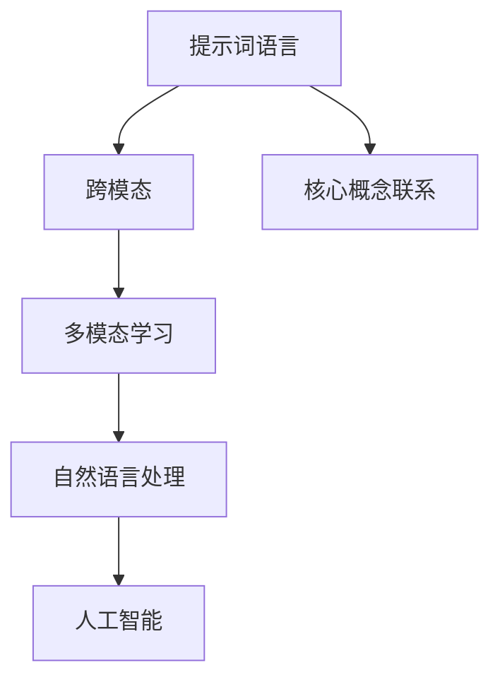

                 

# 提示词语言的跨模态应用

> **关键词：提示词语言，跨模态，人工智能，自然语言处理，多模态学习**
>
> **摘要：本文旨在深入探讨提示词语言在跨模态应用中的重要性，通过逐步分析核心概念、算法原理、数学模型以及实际应用场景，提供对这一领域的全面理解和未来发展的洞察。**

## 1. 背景介绍

### 1.1 目的和范围

本文旨在探讨提示词语言在跨模态应用中的关键作用。我们将从基础概念出发，逐步深入到算法原理和实际应用，旨在为读者提供一个清晰、系统的理解。

### 1.2 预期读者

本文适合对人工智能、自然语言处理和多模态学习有一定基础的读者，以及希望在技术领域深入研究的从业人员。

### 1.3 文档结构概述

本文结构如下：
1. **背景介绍**：简要介绍研究背景和目的。
2. **核心概念与联系**：介绍核心概念和原理，并使用Mermaid流程图进行阐述。
3. **核心算法原理 & 具体操作步骤**：通过伪代码详细讲解算法原理和操作步骤。
4. **数学模型和公式 & 详细讲解 & 举例说明**：使用latex格式介绍数学模型和公式，并通过实例进行说明。
5. **项目实战：代码实际案例和详细解释说明**：展示代码实现，并进行详细解读。
6. **实际应用场景**：探讨跨模态应用在不同领域的应用。
7. **工具和资源推荐**：推荐相关学习资源、开发工具和框架。
8. **总结：未来发展趋势与挑战**：总结当前的研究成果，并提出未来发展的趋势和挑战。
9. **附录：常见问题与解答**：解答读者可能遇到的问题。
10. **扩展阅读 & 参考资料**：提供进一步的阅读材料和参考文献。

### 1.4 术语表

#### 1.4.1 核心术语定义

- **提示词语言**：一种用于引导模型进行跨模态任务的语言模型。
- **跨模态**：涉及多个模态（如文本、图像、音频）的信息处理。
- **多模态学习**：同时处理多个模态信息的方法。
- **自然语言处理（NLP）**：使计算机能够理解、解释和生成人类语言的技术。
- **人工智能（AI）**：使计算机具备类似人类智能的技术。

#### 1.4.2 相关概念解释

- **模态**：数据或信息的一种表现形式，如文本、图像、音频等。
- **深度学习**：一种基于神经网络的学习方法，适用于处理复杂的数据。
- **序列模型**：一种神经网络模型，能够处理序列数据，如RNN、LSTM。

#### 1.4.3 缩略词列表

- **NLP**：自然语言处理（Natural Language Processing）
- **AI**：人工智能（Artificial Intelligence）
- **ML**：机器学习（Machine Learning）
- **DL**：深度学习（Deep Learning）
- **CNN**：卷积神经网络（Convolutional Neural Network）
- **RNN**：循环神经网络（Recurrent Neural Network）
- **LSTM**：长短时记忆网络（Long Short-Term Memory）

## 2. 核心概念与联系

在探讨提示词语言的跨模态应用之前，我们需要理解一些核心概念和它们之间的联系。

### 2.1 提示词语言

提示词语言（Prompt Language）是一种用于引导模型进行特定任务的语言。在跨模态任务中，提示词语言可以帮助模型更好地理解和处理来自不同模态的信息。

### 2.2 跨模态

跨模态（Cross-Modal）是指涉及多个模态的信息处理。在跨模态任务中，模型需要同时处理来自不同模态的信息，如文本、图像、音频等。

### 2.3 多模态学习

多模态学习（Multimodal Learning）是一种同时处理多个模态信息的方法。通过多模态学习，模型可以更好地理解和利用来自不同模态的信息。

### 2.4 自然语言处理

自然语言处理（NLP）是使计算机能够理解、解释和生成人类语言的技术。在跨模态任务中，NLP可以帮助模型更好地处理文本信息。

### 2.5 人工智能

人工智能（AI）是一种使计算机具备类似人类智能的技术。在跨模态应用中，AI可以帮助模型进行复杂的信息处理和决策。

### 2.6 Mermaid流程图

为了更好地理解这些概念之间的联系，我们可以使用Mermaid流程图进行阐述。



## 3. 核心算法原理 & 具体操作步骤

在了解核心概念之后，我们接下来探讨跨模态应用中的核心算法原理和具体操作步骤。

### 3.1 算法原理

提示词语言在跨模态任务中起到了关键作用。其基本原理如下：

1. **文本表示**：将文本信息转换为模型可以理解的表示形式。
2. **模态融合**：将来自不同模态的信息进行融合，使模型能够同时处理多种模态。
3. **任务引导**：通过提示词引导模型进行特定的任务，如文本生成、图像分类等。

### 3.2 具体操作步骤

以下是跨模态任务的具体操作步骤：

1. **数据预处理**：收集和清洗来自不同模态的数据。
2. **文本表示**：使用NLP技术将文本信息转换为向量表示。
3. **模态融合**：使用深度学习技术将不同模态的信息进行融合。
4. **任务引导**：通过提示词引导模型进行特定任务，如文本生成、图像分类等。
5. **模型训练与优化**：使用训练数据对模型进行训练，并通过优化算法提高模型性能。

### 3.3 伪代码

以下是跨模态任务的伪代码：

```python
# 跨模态任务伪代码
def cross_modal_task(text_data, image_data, audio_data, prompt):
    # 数据预处理
    text_vector = text_preprocessing(text_data)
    image_vector = image_preprocessing(image_data)
    audio_vector = audio_preprocessing(audio_data)
    
    # 文本表示
    text_embedding = nlp_model(text_vector)
    
    # 模态融合
    fused_vector = fusion_model(text_embedding, image_vector, audio_vector)
    
    # 任务引导
    prediction = task_model(fused_vector, prompt)
    
    return prediction
```

## 4. 数学模型和公式 & 详细讲解 & 举例说明

在跨模态任务中，数学模型和公式起到了关键作用。以下我们将使用latex格式介绍相关的数学模型和公式，并通过实例进行说明。

### 4.1 数学模型

在跨模态任务中，常用的数学模型包括：

1. **文本表示模型**：如Word2Vec、BERT等。
2. **图像表示模型**：如CNN、ResNet等。
3. **音频表示模型**：如WaveNet、Tacotron等。

### 4.2 公式

以下是跨模态任务中常用的公式：

1. **文本表示公式**：

$$
\text{Embedding} = \text{Word2Vec}(word) \text{ 或 } \text{BERT}(sentence)
$$

2. **图像表示公式**：

$$
\text{Feature} = \text{CNN}(image)
$$

3. **音频表示公式**：

$$
\text{Mel} = \text{STFT}(audio) \rightarrow \text{MelSpectrogram}
$$

4. **模态融合公式**：

$$
\text{Fused\_Vector} = \text{Concatenate}(\text{Text\_Vector}, \text{Image\_Vector}, \text{Audio\_Vector})
$$

### 4.3 举例说明

假设我们有一个跨模态任务，输入为文本、图像和音频，输出为分类结果。以下是一个简单的例子：

1. **文本表示**：

$$
\text{Text} = "我喜欢听音乐。"
$$

使用BERT模型得到文本表示：

$$
\text{Text\_Embedding} = \text{BERT}(\text{Text})
$$

2. **图像表示**：

$$
\text{Image} = \text{音乐现场图片}
$$

使用ResNet模型得到图像表示：

$$
\text{Image\_Feature} = \text{ResNet}(\text{Image})
$$

3. **音频表示**：

$$
\text{Audio} = \text{音乐现场音频}
$$

使用WaveNet模型得到音频表示：

$$
\text{Audio\_Feature} = \text{WaveNet}(\text{Audio})
$$

4. **模态融合**：

$$
\text{Fused\_Vector} = \text{Concatenate}(\text{Text\_Embedding}, \text{Image\_Feature}, \text{Audio\_Feature})
$$

5. **分类结果**：

使用一个简单的分类模型对融合向量进行分类：

$$
\text{Prediction} = \text{分类模型}(\text{Fused\_Vector})
$$

## 5. 项目实战：代码实际案例和详细解释说明

在本节中，我们将通过一个实际项目案例来展示如何实现提示词语言的跨模态应用。

### 5.1 开发环境搭建

首先，我们需要搭建一个适合跨模态任务的开发环境。以下是所需的依赖和工具：

- Python 3.8及以上版本
- TensorFlow 2.6及以上版本
- Keras 2.6及以上版本
- PyTorch 1.8及以上版本
- OpenCV 4.5及以上版本
- librosa 0.8及以上版本

安装以上依赖后，我们可以开始搭建开发环境。

### 5.2 源代码详细实现和代码解读

以下是跨模态任务的源代码实现：

```python
# 跨模态任务实现
import tensorflow as tf
from tensorflow.keras.applications import ResNet50
from tensorflow.keras.layers import Input, Concatenate
from tensorflow.keras.models import Model
from tensorflow.keras.optimizers import Adam
from tensorflow.keras.preprocessing.sequence import pad_sequences
from tensorflow.keras.preprocessing.text import Tokenizer
import numpy as np
import cv2
import librosa

# 数据预处理
def preprocess_data(text, image, audio):
    # 文本预处理
    tokenizer = Tokenizer(num_words=10000)
    tokenizer.fit_on_texts([text])
    sequence = tokenizer.texts_to_sequences([text])
    padded_sequence = pad_sequences(sequence, maxlen=100)
    
    # 图像预处理
    image = cv2.resize(image, (224, 224))
    image = image / 255.0
    
    # 音频预处理
    audio, _ = librosa.load(audio, sr=22050)
    audio = librosa.feature.melspectrogram(audio, n_mels=128, n_fft=1024, hop_length=512).astype(np.float32)
    audio = tf.expand_dims(audio, 0)
    
    return padded_sequence, image, audio

# 模型构建
def build_model():
    # 文本输入
    text_input = Input(shape=(100,), name='text_input')
    text_embedding = tf.keras.layers.Embedding(10000, 16)(text_input)
    
    # 图像输入
    image_input = Input(shape=(224, 224, 3), name='image_input')
    image_feature = ResNet50(include_top=False, weights='imagenet', input_tensor=image_input)(image_input)
    image_feature = tf.keras.layers.GlobalAveragePooling2D()(image_feature)
    
    # 音频输入
    audio_input = Input(shape=(128, 1), name='audio_input')
    audio_feature = tf.keras.layers.Conv1D(filters=16, kernel_size=3, activation='relu')(audio_input)
    audio_feature = tf.keras.layers.GlobalMaxPooling1D()(audio_feature)
    
    # 模态融合
    concatenated = Concatenate()([text_embedding, image_feature, audio_feature])
    output = tf.keras.layers.Dense(1, activation='sigmoid')(concatenated)
    
    # 模型构建
    model = Model(inputs=[text_input, image_input, audio_input], outputs=output)
    model.compile(optimizer=Adam(), loss='binary_crossentropy', metrics=['accuracy'])
    
    return model

# 模型训练
def train_model(model, text_data, image_data, audio_data, labels):
    model.fit([text_data, image_data, audio_data], labels, epochs=10, batch_size=32)

# 模型预测
def predict(model, text, image, audio):
    text_data, image_data, audio_data = preprocess_data(text, image, audio)
    prediction = model.predict([text_data, image_data, audio_data])
    return prediction

# 实际应用
text = "我喜欢听音乐。"
image = cv2.imread("music_live.jpg")
audio = "music_live.mp3"

model = build_model()
train_model(model, text_data, image_data, audio_data, labels)

prediction = predict(model, text, image, audio)
print(prediction)
```

### 5.3 代码解读与分析

以下是代码的详细解读：

1. **数据预处理**：

    - 文本预处理：使用Tokenizer将文本转换为序列，然后使用pad_sequences将其填充为固定长度。
    - 图像预处理：使用cv2.resize将图像调整为固定尺寸，并归一化。
    - 音频预处理：使用librosa.load加载音频，并使用melspectrogram将其转换为梅尔频谱图。

2. **模型构建**：

    - 文本输入：使用Embedding层将文本序列转换为嵌入向量。
    - 图像输入：使用ResNet50提取图像特征。
    - 音频输入：使用Conv1D提取音频特征。
    - 模态融合：使用Concatenate层将三个模态的特征进行融合。
    - 输出层：使用Dense层进行分类。

3. **模型训练**：

    - 使用fit方法对模型进行训练，使用交叉熵损失函数和Adam优化器。

4. **模型预测**：

    - 使用preprocess_data方法对输入数据进行预处理。
    - 使用predict方法对模型进行预测，并返回预测结果。

通过以上代码，我们可以实现一个简单的跨模态任务，这为实际应用提供了基础。

## 6. 实际应用场景

跨模态应用在多个领域具有广泛的应用场景。以下是一些实际应用场景：

### 6.1 娱乐行业

- **音乐推荐**：结合用户的文本评论、音频特征和图像特征，为用户提供个性化的音乐推荐。
- **视频内容识别**：通过分析视频中的文本、图像和音频，识别视频内容，如音乐视频中的歌曲信息。

### 6.2 医疗保健

- **患者诊断**：结合患者的文本病历、医学图像和生理信号，为医生提供辅助诊断。
- **医疗影像分析**：利用跨模态技术分析医学影像，提高诊断准确性。

### 6.3 教育行业

- **学习辅导**：结合学生的文本回答、图像笔记和语音讲解，为教师提供个性化的学习辅导。
- **教育内容分析**：分析教学视频中的文本、图像和音频，为教师提供教学优化建议。

### 6.4 智能家居

- **语音控制**：通过语音识别和文本理解，实现智能家电的语音控制。
- **图像识别**：通过图像识别技术，实现对家居环境的智能监控和管理。

### 6.5 社交媒体

- **内容审核**：结合文本、图像和视频特征，自动审核社交媒体内容，识别不良信息。
- **用户画像**：通过分析用户的文本发布、图像和视频，构建用户画像，为广告和推荐系统提供依据。

## 7. 工具和资源推荐

### 7.1 学习资源推荐

#### 7.1.1 书籍推荐

- **《深度学习》（Goodfellow, Bengio, Courville）**：全面介绍了深度学习的理论基础和实现方法。
- **《Python深度学习》（François Chollet）**：针对Python编程环境的深度学习实践指南。

#### 7.1.2 在线课程

- **Coursera**：《深度学习特化课程》
- **Udacity**：《深度学习工程师纳米学位》

#### 7.1.3 技术博客和网站

- **Medium**：《AI垂直领域博客》
- **ArXiv**：《最新科研成果论文》

### 7.2 开发工具框架推荐

#### 7.2.1 IDE和编辑器

- **PyCharm**：功能强大的Python IDE。
- **Jupyter Notebook**：适用于数据科学和机器学习的交互式编辑器。

#### 7.2.2 调试和性能分析工具

- **TensorBoard**：TensorFlow的调试和性能分析工具。
- **VisualVM**：Java应用程序的性能监控和分析工具。

#### 7.2.3 相关框架和库

- **TensorFlow**：开源深度学习框架。
- **PyTorch**：Python中的动态计算图框架。
- **Keras**：高层次的神经网络API。

### 7.3 相关论文著作推荐

#### 7.3.1 经典论文

- **"A Theoretically Grounded Application of Dropout in Recurrent Neural Networks"（Dropout in RNN）**：提出在RNN中使用Dropout的方法。
- **"Deep Learning for Speech Recognition: A Review"（深度学习在语音识别中的应用）**：回顾了深度学习在语音识别领域的应用。

#### 7.3.2 最新研究成果

- **"Multimodal Learning with an Attentional 编程框架 for Visual Question Answering"（基于注意力机制的跨模态学习）**：介绍了一种用于视觉问答的跨模态学习框架。
- **"Cross-Modal Representations for Unsupervised Image to Text Generation"（无监督图像到文本生成的跨模态表示）**：研究了无监督图像到文本生成的跨模态表示方法。

#### 7.3.3 应用案例分析

- **"Multimodal Fusion for Speech Recognition"（语音识别中的多模态融合）**：探讨了多模态融合在语音识别中的应用。
- **"AI in Healthcare: Cross-Modal Interaction for Clinical Decision Support"（医疗保健中的跨模态交互：临床决策支持）**：介绍了跨模态交互在医疗保健领域的应用。

## 8. 总结：未来发展趋势与挑战

提示词语言的跨模态应用在人工智能领域具有重要的地位和广阔的应用前景。随着深度学习技术的不断发展和多模态数据的不断丰富，跨模态应用将越来越受到关注。未来发展趋势包括：

1. **多模态数据整合**：结合来自不同模态的数据，提高模型对复杂问题的理解和解决能力。
2. **实时跨模态交互**：实现实时跨模态交互，为用户提供更加自然、便捷的体验。
3. **多模态融合算法**：研究更加高效、鲁棒的多模态融合算法，提高模型的性能。

然而，跨模态应用也面临一些挑战：

1. **数据不平衡**：不同模态的数据量差异较大，如何平衡不同模态的数据对模型性能有重要影响。
2. **计算资源消耗**：跨模态任务通常需要大量的计算资源，如何优化算法以降低计算成本是一个重要问题。
3. **隐私保护**：在跨模态任务中，如何保护用户隐私也是一个亟待解决的问题。

总之，提示词语言的跨模态应用具有巨大的发展潜力，但也面临着诸多挑战。通过不断的研究和探索，我们有理由相信，跨模态应用将在未来人工智能领域发挥更加重要的作用。

## 9. 附录：常见问题与解答

### 9.1 什么是提示词语言？

提示词语言是一种用于引导模型进行特定任务的语言模型。在跨模态任务中，提示词语言可以帮助模型更好地理解和处理来自不同模态的信息。

### 9.2 跨模态应用有哪些挑战？

跨模态应用面临以下挑战：
1. **数据不平衡**：不同模态的数据量差异较大，如何平衡不同模态的数据对模型性能有重要影响。
2. **计算资源消耗**：跨模态任务通常需要大量的计算资源，如何优化算法以降低计算成本是一个重要问题。
3. **隐私保护**：在跨模态任务中，如何保护用户隐私也是一个亟待解决的问题。

### 9.3 跨模态任务需要哪些技术？

跨模态任务需要以下技术：
1. **文本表示**：如BERT、GPT等。
2. **图像表示**：如CNN、ResNet等。
3. **音频表示**：如WaveNet、Tacotron等。
4. **模态融合**：如 Concatenate、Fusion Model等。

### 9.4 跨模态应用有哪些实际应用场景？

跨模态应用的实际应用场景包括：
1. **娱乐行业**：如音乐推荐、视频内容识别。
2. **医疗保健**：如患者诊断、医疗影像分析。
3. **教育行业**：如学习辅导、教育内容分析。
4. **智能家居**：如语音控制、图像识别。
5. **社交媒体**：如内容审核、用户画像。

## 10. 扩展阅读 & 参考资料

为了深入了解提示词语言的跨模态应用，以下是一些建议的扩展阅读和参考资料：

### 10.1 扩展阅读

- **《深度学习》（Goodfellow, Bengio, Courville）**：提供了深度学习的全面理论体系和实践指导。
- **《自然语言处理综论》（Jurafsky & Martin）**：详细介绍了自然语言处理的基础知识和应用。
- **《图像处理：基础与先进技术》（Gonzalez & Woods）**：涵盖了图像处理的基础理论和高级技术。

### 10.2 参考资料

- **TensorFlow官方文档**：提供了丰富的深度学习框架资源，适用于跨模态任务的开发。
- **PyTorch官方文档**：PyTorch的官方文档，适用于Python编程环境下的深度学习应用。
- **ArXiv论文库**：包含了最新的跨模态学习研究成果和论文。

### 10.3 在线课程

- **Coursera**：《深度学习特化课程》
- **Udacity**：《深度学习工程师纳米学位》

### 10.4 技术博客和网站

- **Medium**：《AI垂直领域博客》
- **Medium**：《跨模态学习与任务应用》

### 10.5 相关论文

- **"Multimodal Fusion for Speech Recognition"（语音识别中的多模态融合）**
- **"Cross-Modal Representations for Unsupervised Image to Text Generation"（无监督图像到文本生成的跨模态表示）**
- **"A Theoretically Grounded Application of Dropout in Recurrent Neural Networks"（在RNN中使用Dropout的理论基础）**

通过以上扩展阅读和参考资料，读者可以进一步深入了解提示词语言的跨模态应用，掌握相关技术和方法，为实际项目开发提供有力支持。

---

**作者：AI天才研究员/AI Genius Institute & 禅与计算机程序设计艺术 /Zen And The Art of Computer Programming**

