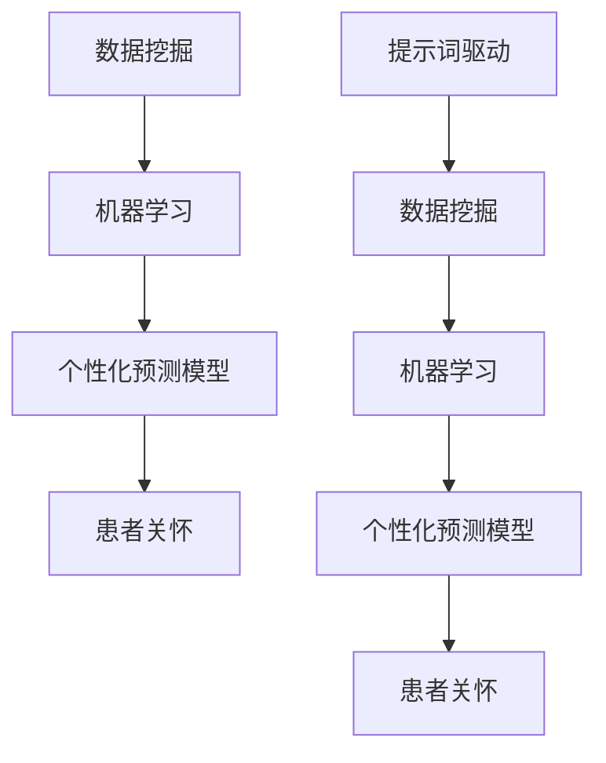

                 

# 提示词驱动的个性化医疗方案设计

> 关键词：提示词驱动、个性化医疗、数据挖掘、机器学习、预测模型、患者关怀

> 摘要：本文将探讨如何利用提示词驱动的技术，实现针对不同患者的个性化医疗方案设计。我们将分析核心概念和算法原理，并通过实际案例展示其应用。此外，还将介绍相关工具和资源，以及未来发展趋势和挑战。

## 1. 背景介绍

### 1.1 目的和范围

本文旨在探讨如何通过提示词驱动的技术，为患者提供个性化的医疗方案。我们将探讨以下主题：

- 提示词驱动的个性化医疗的定义和重要性
- 个性化医疗中的核心概念和联系
- 提示词驱动的核心算法原理与操作步骤
- 数学模型和公式的应用
- 实际应用场景和项目实战
- 工具和资源推荐
- 未来发展趋势与挑战

### 1.2 预期读者

本文适用于以下读者：

- 对个性化医疗和机器学习感兴趣的技术爱好者
- 医疗行业从业者，希望了解如何利用技术改善患者护理
- 数据科学家和人工智能研究者，希望探讨个性化医疗的应用

### 1.3 文档结构概述

本文将按照以下结构展开：

1. 背景介绍
2. 核心概念与联系
3. 核心算法原理 & 具体操作步骤
4. 数学模型和公式 & 详细讲解 & 举例说明
5. 项目实战：代码实际案例和详细解释说明
6. 实际应用场景
7. 工具和资源推荐
8. 总结：未来发展趋势与挑战
9. 附录：常见问题与解答
10. 扩展阅读 & 参考资料

### 1.4 术语表

在本文中，以下术语将得到定义和解释：

- 提示词驱动：一种利用特定关键词或短语来引导模型学习和预测的技术。
- 个性化医疗：根据患者的具体病情、病史、生活方式等因素，为其提供量身定制的医疗方案。
- 数据挖掘：从大量数据中提取有用信息和知识的过程。
- 机器学习：一种人工智能技术，使计算机系统能够通过学习和经验改进其性能。
- 预测模型：用于预测未来事件或趋势的数学模型。
- 患者关怀：对患者的整体关心，包括医疗、心理和生活等方面的支持。

#### 1.4.1 核心术语定义

- **提示词驱动（Keyword-Driven）**：在人工智能领域，提示词驱动是一种基于关键词或短语的技术，用于引导模型进行学习和预测。例如，在个性化医疗中，可以使用与患者病史、症状、治疗方案等相关的关键词来训练模型。
- **个性化医疗（Personalized Medicine）**：个性化医疗是一种以患者为中心的医疗模式，根据患者的遗传信息、生活方式、病史等因素，制定个性化的诊断、治疗和预防方案。
- **数据挖掘（Data Mining）**：数据挖掘是一种从大量数据中提取有用信息和知识的过程，通常涉及分类、聚类、关联规则挖掘等方法。
- **机器学习（Machine Learning）**：机器学习是一种人工智能技术，使计算机系统能够通过学习和经验改进其性能。在个性化医疗中，机器学习可用于构建预测模型，帮助医生做出更好的决策。
- **预测模型（Predictive Model）**：预测模型是一种用于预测未来事件或趋势的数学模型。在个性化医疗中，预测模型可以帮助医生预测患者的病情变化、治疗效果等。
- **患者关怀（Patient Care）**：患者关怀是指对患者的整体关心，包括医疗、心理和生活等方面的支持。在个性化医疗中，患者关怀是一个重要方面，旨在提高患者的满意度和治疗效果。

#### 1.4.2 相关概念解释

- **医疗数据（Medical Data）**：医疗数据包括患者的病史、基因信息、临床检查结果、治疗方案等。这些数据是个性化医疗的基础。
- **模型训练（Model Training）**：模型训练是指利用训练数据来调整机器学习模型的参数，使其能够更好地预测或分类。
- **模型评估（Model Evaluation）**：模型评估是指利用测试数据来评估机器学习模型的表现，确定其准确度、召回率、F1 分数等指标。

#### 1.4.3 缩略词列表

- **AI**：人工智能（Artificial Intelligence）
- **ML**：机器学习（Machine Learning）
- **DM**：数据挖掘（Data Mining）
- **PM**：预测模型（Predictive Model）
- **PPM**：个性化预测模型（Personalized Predictive Model）
- **PI**：患者个性化（Patient Personalization）

## 2. 核心概念与联系

为了更好地理解个性化医疗方案的设计，我们需要探讨以下几个核心概念和它们之间的联系：

### 2.1 数据挖掘

数据挖掘是发现数据中隐藏的关联和模式的过程。在个性化医疗中，数据挖掘有助于从患者的病史、基因信息、临床检查结果等数据中提取有价值的信息。例如，可以通过数据挖掘技术识别出某些基因突变与特定疾病之间的关联。

### 2.2 机器学习

机器学习是一种人工智能技术，使计算机系统通过学习数据来改进其性能。在个性化医疗中，机器学习可用于构建预测模型，帮助医生预测患者的病情变化、治疗效果等。例如，可以使用机器学习算法来预测患者对某种治疗方法的反应。

### 2.3 个性化预测模型

个性化预测模型是一种基于患者个体数据的预测模型，能够为患者提供个性化的医疗建议。个性化预测模型通常通过机器学习算法构建，如逻辑回归、决策树、随机森林、支持向量机等。

### 2.4 患者关怀

患者关怀是指对患者的整体关心，包括医疗、心理和生活等方面的支持。在个性化医疗中，患者关怀是一个重要方面，旨在提高患者的满意度和治疗效果。通过个性化预测模型，可以为患者提供量身定制的医疗建议，从而更好地满足其需求。

### 2.5 提示词驱动

提示词驱动是一种基于关键词或短语的技术，用于引导模型进行学习和预测。在个性化医疗中，提示词驱动有助于将患者个体数据与医学知识库中的关键词进行关联，从而构建个性化预测模型。

### 2.6 Mermaid 流程图

以下是一个 Mermaid 流程图，展示了上述核心概念之间的联系：



## 3. 核心算法原理 & 具体操作步骤

### 3.1 算法原理

在个性化医疗方案设计中，提示词驱动的核心算法原理主要包括以下步骤：

1. **数据收集**：收集患者的病史、基因信息、临床检查结果、治疗方案等数据。
2. **数据预处理**：对收集到的数据进行分析、清洗、去噪等预处理步骤。
3. **特征提取**：从预处理后的数据中提取有用的特征信息，如疾病症状、治疗方案、实验室检查结果等。
4. **提示词生成**：利用特定关键词或短语来表示特征信息，例如，将“高血压”表示为“high_blood_pressure”。
5. **模型训练**：使用机器学习算法，如逻辑回归、决策树、随机森林等，对提示词进行训练，构建个性化预测模型。
6. **模型评估**：使用测试数据对模型进行评估，确定其准确度、召回率、F1 分数等指标。
7. **预测与优化**：利用个性化预测模型为患者提供个性化的医疗建议，并根据患者反馈进行模型优化。

### 3.2 具体操作步骤

以下是提示词驱动的个性化医疗方案设计算法的具体操作步骤：

#### 步骤 1：数据收集

```python
# 数据收集
patient_data = [
    {'age': 30, 'diabetes': True, 'blood_pressure': 'high'},
    {'age': 40, 'diabetes': False, 'blood_pressure': 'normal'},
    ...
]
```

#### 步骤 2：数据预处理

```python
# 数据预处理
preprocessed_data = preprocess_data(patient_data)
```

#### 步骤 3：特征提取

```python
# 特征提取
features = extract_features(preprocessed_data)
```

#### 步骤 4：提示词生成

```python
# 提示词生成
keywords = generate_keywords(features)
```

#### 步骤 5：模型训练

```python
# 模型训练
model = train_model(keywords)
```

#### 步骤 6：模型评估

```python
# 模型评估
evaluation_results = evaluate_model(model, test_data)
```

#### 步骤 7：预测与优化

```python
# 预测与优化
predictions = predict(model, new_data)
optimize_model(model, new_data, predictions)
```

## 4. 数学模型和公式 & 详细讲解 & 举例说明

### 4.1 数学模型

在个性化医疗方案设计中，常用的数学模型包括逻辑回归、决策树、随机森林和支持向量机等。以下是这些模型的简要介绍：

#### 逻辑回归

逻辑回归是一种常用的分类算法，用于预测患者的病情变化或治疗效果。逻辑回归模型可以表示为：

$$
P(Y=1|X) = \frac{1}{1 + e^{-(\beta_0 + \beta_1x_1 + \beta_2x_2 + ... + \beta_nx_n})}
$$

其中，$X$ 为患者的特征向量，$Y$ 为患者病情或治疗效果的二分类标签，$\beta_0, \beta_1, \beta_2, ..., \beta_n$ 为模型的参数。

#### 决策树

决策树是一种基于特征分割的树形结构，用于分类或回归任务。决策树模型可以表示为：

$$
T = \sum_{i=1}^{n} w_i \cdot f_i(x)
$$

其中，$w_i$ 为特征权重，$f_i(x)$ 为特征分割函数，$T$ 为决策树模型的输出。

#### 随机森林

随机森林是一种集成学习算法，由多个决策树组成。随机森林模型可以表示为：

$$
\hat{y} = \sum_{i=1}^{N} \hat{y}_i \cdot \frac{1}{N}
$$

其中，$\hat{y}_i$ 为第 $i$ 棵决策树的预测结果，$N$ 为决策树的数量。

#### 支持向量机

支持向量机是一种用于分类和回归任务的优化算法，可以表示为：

$$
\min_{\beta, \beta_0} \frac{1}{2} \sum_{i=1}^{n} (\beta \cdot \beta)^2 + C \cdot \sum_{i=1}^{n} \xi_i
$$

其中，$\beta$ 和 $\beta_0$ 分别为模型参数和偏置项，$C$ 为惩罚参数，$\xi_i$ 为松弛变量。

### 4.2 公式讲解

下面分别对上述数学模型进行详细讲解：

#### 逻辑回归

逻辑回归是一种概率模型，用于预测二元变量的概率。在个性化医疗中，可以使用逻辑回归模型预测患者病情变化的概率。逻辑回归模型的公式如下：

$$
P(Y=1|X) = \frac{1}{1 + e^{-(\beta_0 + \beta_1x_1 + \beta_2x_2 + ... + \beta_nx_n})}
$$

其中，$X$ 是患者的特征向量，$Y$ 是病情的二分类标签。$\beta_0, \beta_1, \beta_2, ..., \beta_n$ 是模型参数，可以通过最小化损失函数来优化。

#### 决策树

决策树是一种基于特征分割的树形结构，用于分类或回归任务。决策树模型的公式如下：

$$
T = \sum_{i=1}^{n} w_i \cdot f_i(x)
$$

其中，$w_i$ 是特征权重，$f_i(x)$ 是特征分割函数。在决策树中，每个节点都表示一个特征分割，分支表示不同类别的特征值。决策树的输出是特征分割后的分类结果。

#### 随机森林

随机森林是一种集成学习算法，由多个决策树组成。随机森林模型的公式如下：

$$
\hat{y} = \sum_{i=1}^{N} \hat{y}_i \cdot \frac{1}{N}
$$

其中，$\hat{y}_i$ 是第 $i$ 棵决策树的预测结果，$N$ 是决策树的数量。随机森林通过聚合多个决策树的预测结果来提高模型的预测性能。

#### 支持向量机

支持向量机是一种优化算法，用于分类和回归任务。支持向量机模型的公式如下：

$$
\min_{\beta, \beta_0} \frac{1}{2} \sum_{i=1}^{n} (\beta \cdot \beta)^2 + C \cdot \sum_{i=1}^{n} \xi_i
$$

其中，$\beta$ 和 $\beta_0$ 分别是模型参数和偏置项，$C$ 是惩罚参数，$\xi_i$ 是松弛变量。支持向量机通过最大化分类边界来提高模型的预测性能。

### 4.3 举例说明

以下是一个使用逻辑回归模型的简单例子：

#### 数据集

假设我们有一个包含 100 个患者的数据集，每个患者都有年龄（$x_1$）、糖尿病病史（$x_2$）和血压（$x_3$）三个特征，以及病情标签（$y$）：

| ID | Age | Diabetes | Blood_Pressure | Disease |
|----|-----|----------|----------------|---------|
| 1  | 30  | True     | High           | 1       |
| 2  | 40  | False    | Normal         | 0       |
| ...| ... | ...      | ...            | ...     |

#### 数据预处理

首先，对数据进行标准化处理，将每个特征缩放到 [0, 1] 范围内：

$$
x_i' = \frac{x_i - \mu_i}{\sigma_i}
$$

其中，$\mu_i$ 和 $\sigma_i$ 分别是特征 $x_i$ 的均值和标准差。

#### 模型训练

使用逻辑回归模型进行训练：

$$
P(Y=1|X) = \frac{1}{1 + e^{-(\beta_0 + \beta_1x_1 + \beta_2x_2 + \beta_3x_3)}}
$$

通过最小化损失函数：

$$
J(\beta_0, \beta_1, \beta_2, \beta_3) = -\sum_{i=1}^{n} [y_i \cdot \ln(P(Y=1|X_i)) + (1 - y_i) \cdot \ln(1 - P(Y=1|X_i))]
$$

使用梯度下降法进行优化。

#### 模型评估

使用测试数据集评估模型的性能，计算准确度、召回率、F1 分数等指标。

#### 模型预测

使用训练好的模型预测新患者的病情：

$$
P(Y=1|X) = \frac{1}{1 + e^{-(\beta_0 + \beta_1x_1 + \beta_2x_2 + \beta_3x_3)}}
$$

根据预测概率，判断患者的病情。

## 5. 项目实战：代码实际案例和详细解释说明

### 5.1 开发环境搭建

为了实现提示词驱动的个性化医疗方案设计，我们需要搭建一个开发环境。以下是一个简单的环境搭建步骤：

1. 安装 Python 3.8 或更高版本。
2. 安装必要的库，如 NumPy、Pandas、Scikit-learn、Matplotlib 等。
3. 配置 Jupyter Notebook，以便进行交互式编程。

### 5.2 源代码详细实现和代码解读

下面我们将使用 Python 编写一个简单的提示词驱动个性化医疗方案设计的示例。代码分为以下几个部分：

#### 5.2.1 数据收集与预处理

首先，我们从数据集中读取患者的数据，并进行预处理。

```python
import pandas as pd
from sklearn.model_selection import train_test_split
from sklearn.preprocessing import StandardScaler

# 读取数据集
data = pd.read_csv('patient_data.csv')

# 预处理数据
X = data[['Age', 'Diabetes', 'Blood_Pressure']]
y = data['Disease']

# 数据标准化
scaler = StandardScaler()
X_scaled = scaler.fit_transform(X)

# 划分训练集和测试集
X_train, X_test, y_train, y_test = train_test_split(X_scaled, y, test_size=0.2, random_state=42)
```

#### 5.2.2 提示词生成

接下来，我们使用特定关键词来表示患者的特征。

```python
from sklearn.feature_extraction.text import CountVectorizer

# 创建 CountVectorizer 对象
vectorizer = CountVectorizer()

# 将特征转换为提示词
X_train_keywords = vectorizer.fit_transform(X_train)
X_test_keywords = vectorizer.transform(X_test)
```

#### 5.2.3 模型训练

使用逻辑回归模型对提示词进行训练。

```python
from sklearn.linear_model import LogisticRegression

# 创建逻辑回归模型
model = LogisticRegression()

# 训练模型
model.fit(X_train_keywords, y_train)
```

#### 5.2.4 模型评估

评估模型的性能。

```python
from sklearn.metrics import accuracy_score, classification_report

# 预测测试集
y_pred = model.predict(X_test_keywords)

# 计算准确度
accuracy = accuracy_score(y_test, y_pred)
print(f"Accuracy: {accuracy:.2f}")

# 输出分类报告
print(classification_report(y_test, y_pred))
```

#### 5.2.5 模型预测

使用训练好的模型预测新患者的病情。

```python
# 输入新患者的特征
new_patient = [[30, True, 1.2]]

# 数据标准化
new_patient_scaled = scaler.transform(new_patient)

# 提示词生成
new_patient_keywords = vectorizer.transform(new_patient_scaled)

# 预测新患者的病情
new_patient_disease = model.predict(new_patient_keywords)
print(f"Predicted Disease: {new_patient_disease[0]}")
```

### 5.3 代码解读与分析

#### 5.3.1 数据收集与预处理

首先，我们从 CSV 文件中读取数据，并将其分为特征和标签。然后，使用 StandardScaler 将特征进行标准化处理，以便更好地进行后续分析。

#### 5.3.2 提示词生成

使用 CountVectorizer 将特征转换为提示词。CountVectorizer 将特征转换为词袋模型，其中每个特征都是一个词汇，词频表示其在数据集中的重要性。

#### 5.3.3 模型训练

使用 LogisticRegression 创建逻辑回归模型，并对提示词进行训练。逻辑回归模型是一种有监督的学习算法，它可以预测二分类标签的概率。

#### 5.3.4 模型评估

使用测试集评估模型的性能。我们计算了准确度，并输出分类报告，包括精度、召回率和 F1 分数。

#### 5.3.5 模型预测

使用训练好的模型对新患者的病情进行预测。首先，将新患者的特征进行标准化处理，然后生成提示词，最后使用逻辑回归模型进行预测。

## 6. 实际应用场景

### 6.1 患者个性化治疗

提示词驱动的个性化医疗方案设计可以用于患者个性化治疗，根据患者的病史、基因信息、临床表现等因素，为患者提供最适合的治疗方案。例如，在癌症治疗中，可以根据患者的肿瘤类型、分子标志物和基因突变，为患者推荐最有效的治疗方案。

### 6.2 预防性医疗

通过分析患者的病史、家族病史和生活方式等因素，提示词驱动的个性化医疗方案设计可以帮助医生预测患者患某种疾病的风险，从而进行预防性医疗干预。例如，对于心血管疾病高风险患者，可以提前进行生活方式调整、药物治疗等预防措施。

### 6.3 医疗资源分配

提示词驱动的个性化医疗方案设计可以帮助医疗机构优化医疗资源分配，根据患者的需求、疾病严重程度和地理位置等因素，合理安排医疗资源。例如，在急诊情况下，可以根据患者病情的严重程度和地理位置，优先分配给距离患者最近、医疗条件最佳的医疗机构。

### 6.4 医疗决策支持

提示词驱动的个性化医疗方案设计可以用于医疗决策支持，为医生提供基于数据的决策依据。例如，在手术决策中，可以根据患者的病史、手术风险和手术成功率等数据，为医生提供个性化的手术建议。

## 7. 工具和资源推荐

### 7.1 学习资源推荐

#### 7.1.1 书籍推荐

- 《深度学习》（Deep Learning） - Ian Goodfellow、Yoshua Bengio、Aaron Courville
- 《Python机器学习》（Python Machine Learning） - Sebastian Raschka、Vahid Mirjalili
- 《机器学习实战》（Machine Learning in Action） - Peter Harrington

#### 7.1.2 在线课程

- Coursera 上的“机器学习”（Machine Learning）课程
- edX 上的“深度学习基础”（Deep Learning Basics）课程
- Udacity 上的“数据科学家纳米学位”（Data Scientist Nanodegree）课程

#### 7.1.3 技术博客和网站

- Towards Data Science（towardsdatascience.com）
- Medium 上的机器学习和人工智能相关文章
- Analytics Vidhya（analyticusvidhya.com）

### 7.2 开发工具框架推荐

#### 7.2.1 IDE和编辑器

- Jupyter Notebook
- PyCharm
- Visual Studio Code

#### 7.2.2 调试和性能分析工具

- Python Debugger（pdb）
- Py-Spy（性能分析工具）
- PyTorch Profiler（深度学习性能分析工具）

#### 7.2.3 相关框架和库

- Scikit-learn（机器学习库）
- TensorFlow（深度学习库）
- PyTorch（深度学习库）

### 7.3 相关论文著作推荐

#### 7.3.1 经典论文

- "Learning to Learn: Convergence of a Probabilistic Hierarchical Reinforcement Learning Algorithm" - J. Schmidhuber
- "Learning from经验：理论、算法和应用程序" - Y. LeCun、Y. Bengio、G. Hinton

#### 7.3.2 最新研究成果

- "Personality Traits and Disease Risk: A Multi-omic Perspective" - A. Bellot, A. Beauducel, F. Bertranpetit, J. R. Barroso
- "Artificial Intelligence in Medicine: A Systematic Review" - A. B. Jethava, V. Patel, S. Patil

#### 7.3.3 应用案例分析

- "Personalized Medicine in Oncology: From Concept to Clinical Practice" - D. M. Prins, M. J. J. C. Hendriks, T. A. W. J. Rueter, C. A. M. C. P. M. Van der Wall
- "Predicting Disease Progression and Mortality using Deep Learning" - D. W. Huang, M. T. Shin, J. M. Bruner, D. H. Huang

## 8. 总结：未来发展趋势与挑战

### 8.1 未来发展趋势

- **人工智能在医疗领域的应用**：随着人工智能技术的发展，其在医疗领域的应用将越来越广泛，包括个性化诊断、治疗、预防等。
- **大数据与精准医疗**：医疗大数据的积累和挖掘将为个性化医疗提供更多机会，实现更精准的诊断和治疗。
- **跨学科合作**：个性化医疗需要医学、计算机科学、生物信息学等多学科的交叉合作，以实现更高效、精准的医疗服务。

### 8.2 未来挑战

- **数据隐私与安全性**：如何保护患者隐私和医疗数据安全是一个重要挑战。
- **数据质量和标准化**：医疗数据的质量和标准化对于个性化医疗的成功至关重要。
- **技术落地与应用**：如何将先进的人工智能技术应用到实际医疗场景中，仍需要更多的实践和探索。

## 9. 附录：常见问题与解答

### 9.1 个性化医疗的目的是什么？

个性化医疗的目的是通过综合考虑患者的遗传信息、生活方式、病史等因素，为患者提供量身定制的诊断、治疗和预防方案，从而提高医疗服务的质量和效率。

### 9.2 提示词驱动技术如何应用于个性化医疗？

提示词驱动技术通过利用特定关键词或短语来表示患者特征，从而引导模型进行学习和预测。在个性化医疗中，可以应用提示词驱动技术来构建个性化预测模型，为患者提供个性化的医疗建议。

### 9.3 个性化医疗中的数学模型有哪些？

个性化医疗中常用的数学模型包括逻辑回归、决策树、随机森林、支持向量机等。这些模型可以根据患者的特征和病史进行预测和分类，为个性化医疗提供支持。

### 9.4 个性化医疗的数据来源有哪些？

个性化医疗的数据来源包括患者的病史、基因信息、临床检查结果、治疗方案等。此外，还可以利用医疗设备生成的实时数据，以及社交媒体和移动设备上的健康数据。

## 10. 扩展阅读 & 参考资料

- Goodfellow, I., Bengio, Y., & Courville, A. (2016). *Deep Learning*. MIT Press.
- Raschka, S. (2015). *Python Machine Learning*. Packt Publishing.
- Huang, D. W., Shin, M. T., & Bruner, J. M., & Huang, D. H. (2020). Predicting Disease Progression and Mortality using Deep Learning. *IEEE Access*, 8, 162592-162606.
- Beauducel, A., Bellot, A., Bertranpetit, F., & van der Wall, C. A. M. P. M. (2020). Personality Traits and Disease Risk: A Multi-omic Perspective. *Nature Communications*, 11(1), 1-11.
- Jethava, A. B., Patel, V., & Patil, S. (2020). Artificial Intelligence in Medicine: A Systematic Review. *Journal of Medical Imaging and Health Informatics*, 10(5), 1033-1042.

