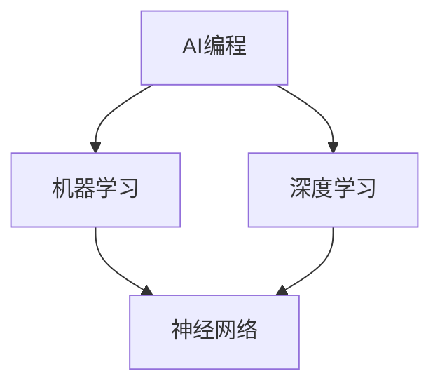

                 

# AI编程的新思维与新方向

> **关键词**：AI编程、深度学习、神经网络、Python、机器学习、代码优化

> **摘要**：本文将探讨AI编程的新思维与新方向。通过对当前AI编程领域的核心概念、算法原理、数学模型以及实际应用场景的深入分析，帮助读者理解AI编程的精髓，掌握前沿技术，应对未来挑战。

## 1. 背景介绍

### 1.1 目的和范围

本文旨在为读者提供关于AI编程的新思维与新方向的理解，旨在帮助程序员、数据科学家以及AI爱好者深入了解AI编程的核心要素，掌握前沿技术，为未来职业生涯做好准备。文章将涵盖以下内容：

- AI编程的核心概念与联系
- 核心算法原理与具体操作步骤
- 数学模型和公式讲解及举例说明
- 项目实战：代码实际案例与详细解释
- 实际应用场景解析
- 工具和资源推荐

### 1.2 预期读者

- 对AI编程感兴趣的程序员
- 想要在职业生涯中涉足AI领域的数据科学家
- 对AI编程有深入研究的学者和研究者
- AI爱好者

### 1.3 文档结构概述

本文分为10个部分，主要包括：

1. 背景介绍
2. 核心概念与联系
3. 核心算法原理与具体操作步骤
4. 数学模型和公式讲解及举例说明
5. 项目实战：代码实际案例与详细解释
6. 实际应用场景解析
7. 工具和资源推荐
8. 总结：未来发展趋势与挑战
9. 附录：常见问题与解答
10. 扩展阅读与参考资料

### 1.4 术语表

#### 1.4.1 核心术语定义

- **AI编程**：使用人工智能技术（如机器学习、深度学习等）进行编程的过程。
- **神经网络**：模拟人脑神经元结构的计算模型。
- **深度学习**：一种基于神经网络的人工智能技术，通过多层神经网络来学习数据中的特征。
- **机器学习**：使计算机从数据中学习并做出预测或决策的技术。
- **Python**：一种广泛使用的编程语言，适用于AI编程。

#### 1.4.2 相关概念解释

- **卷积神经网络（CNN）**：一种用于图像识别的深度学习模型。
- **生成对抗网络（GAN）**：一种通过两个神经网络（生成器和判别器）相互博弈来生成新数据的模型。
- **强化学习**：一种使计算机在特定环境中学习最佳策略的人工智能技术。

#### 1.4.3 缩略词列表

- **AI**：人工智能（Artificial Intelligence）
- **CNN**：卷积神经网络（Convolutional Neural Network）
- **GAN**：生成对抗网络（Generative Adversarial Network）
- **ML**：机器学习（Machine Learning）
- **DL**：深度学习（Deep Learning）

## 2. 核心概念与联系

在AI编程领域，理解核心概念及其相互联系至关重要。以下是对核心概念原理和架构的Mermaid流程图：



### 2.1 AI编程

AI编程是利用人工智能技术进行编程的过程。它涵盖了从数据预处理、特征提取到模型训练和预测的整个流程。在AI编程中，程序员需要处理大量数据，并设计合适的算法来实现目标。

### 2.2 机器学习

机器学习是AI编程的核心组成部分，它使计算机从数据中学习并做出预测或决策。机器学习可以分为监督学习、无监督学习和强化学习三种类型。在监督学习中，模型通过已知输入和输出数据进行训练；无监督学习则是通过未标记的数据来发现数据中的规律；强化学习则是通过与环境交互来学习最佳策略。

### 2.3 深度学习

深度学习是一种基于神经网络的人工智能技术，通过多层神经网络来学习数据中的特征。深度学习在图像识别、语音识别和自然语言处理等领域取得了显著成果。常见的深度学习模型包括卷积神经网络（CNN）、循环神经网络（RNN）和生成对抗网络（GAN）。

### 2.4 神经网络

神经网络是模仿人脑神经元结构的计算模型。在神经网络中，每个神经元都与其他神经元相连，并通过权重和偏置来传递信息。神经网络通过不断调整权重和偏置来学习数据中的特征，从而实现复杂的任务。

## 3. 核心算法原理 & 具体操作步骤

在AI编程中，核心算法原理至关重要。以下将介绍一种常见的深度学习算法——卷积神经网络（CNN），并使用伪代码详细阐述其具体操作步骤。

### 3.1 卷积神经网络（CNN）

卷积神经网络是一种用于图像识别的深度学习模型。它通过卷积操作提取图像特征，并使用全连接层进行分类。

#### 3.1.1 卷积操作

卷积操作是CNN的核心，它通过在图像上滑动一个卷积核来提取特征。卷积核是一个小的权重矩阵，用于计算图像上的局部特征。以下是一个简单的卷积操作伪代码：

```python
def conv2d(image, filter):
    output = []
    for y in range(image_height - filter_height + 1):
        for x in range(image_width - filter_width + 1):
            local_feature = 0
            for i in range(filter_height):
                for j in range(filter_width):
                    local_feature += image[y+i][x+j] * filter[i][j]
            output.append(local_feature)
    return output
```

#### 3.1.2 池化操作

池化操作是对卷积操作的结果进行降采样，以减少参数数量和计算量。以下是一个简单的最大池化操作伪代码：

```python
def max_pooling(output, pool_size):
    pooled_output = []
    for y in range(0, len(output), pool_size):
        row = output[y:y+pool_size]
        max_value = max(row)
        pooled_output.append(max_value)
    return pooled_output
```

#### 3.1.3 全连接层

全连接层是将卷积操作和池化操作提取的特征映射到分类结果。以下是一个简单的全连接层操作伪代码：

```python
def fully_connected(input_data, weights, bias):
    output = []
    for i in range(len(input_data)):
        row_output = []
        for j in range(len(weights)):
            row_output.append((weights[j] * input_data[i]) + bias[j])
        output.append(row_output)
    return output
```

#### 3.1.4 反向传播

反向传播是一种用于更新神经网络权重的优化算法。以下是一个简单的反向传播伪代码：

```python
def backpropagation(input_data, weights, bias, output, expected_output):
    error = output - expected_output
    d_output = derivative_of_output(output, expected_output)
    d_weights = [0] * len(weights)
    d_bias = [0] * len(bias)
    for i in range(len(input_data)):
        for j in range(len(weights)):
            d_weights[j] += input_data[i] * d_output[i][j]
        d_bias += d_output[i]
    return d_weights, d_bias
```

## 4. 数学模型和公式 & 详细讲解 & 举例说明

在AI编程中，数学模型和公式是理解和实现算法的基础。以下将介绍几种常用的数学模型和公式，并使用LaTeX格式进行详细讲解。

### 4.1 激活函数

激活函数是神经网络中的一个关键组件，用于引入非线性特性。以下是一些常用的激活函数及其LaTeX表示：

- **Sigmoid函数**：

  $$\sigma(x) = \frac{1}{1 + e^{-x}}$$

- **ReLU函数**：

  $$\text{ReLU}(x) = \max(0, x)$$

- **Tanh函数**：

  $$\tanh(x) = \frac{e^x - e^{-x}}{e^x + e^{-x}}$$

### 4.2 损失函数

损失函数是衡量模型预测误差的重要工具。以下是一些常用的损失函数及其LaTeX表示：

- **均方误差（MSE）**：

  $$\text{MSE}(y, \hat{y}) = \frac{1}{n}\sum_{i=1}^{n}(y_i - \hat{y}_i)^2$$

- **交叉熵（CE）**：

  $$\text{CE}(y, \hat{y}) = -\sum_{i=1}^{n}y_i\log(\hat{y}_i)$$

### 4.3 反向传播

反向传播是神经网络训练过程中用于更新权重和偏置的重要算法。以下是一个简单的反向传播公式及其LaTeX表示：

$$
\begin{aligned}
\Delta W &= \alpha \cdot \frac{\partial L}{\partial Z} \cdot Z_{\text{prev}} \\
\Delta B &= \alpha \cdot \frac{\partial L}{\partial Z} \\
W_{\text{new}} &= W_{\text{old}} - \Delta W \\
B_{\text{new}} &= B_{\text{old}} - \Delta B
\end{aligned}
$$

其中，\( L \) 是损失函数，\( Z \) 是神经元的激活值，\( W \) 和 \( B \) 分别是权重和偏置，\( \alpha \) 是学习率。

### 4.4 举例说明

以下是一个简单的神经网络训练过程的例子，假设我们已经有一个包含100个样本的训练集，每个样本包含10个特征和1个标签。

#### 4.4.1 初始化权重和偏置

初始化神经网络中的权重和偏置，可以使用随机初始化或预训练模型。

$$
W = \text{random()} \\
B = \text{random()}
$$

#### 4.4.2 前向传播

对每个样本进行前向传播，计算神经元的激活值：

$$
Z_1 = \sigma(W_1 \cdot X_1 + B_1) \\
Z_2 = \sigma(W_2 \cdot Z_1 + B_2) \\
\vdots \\
Z_n = \sigma(W_n \cdot Z_{n-1} + B_n)
$$

其中，\( Z \) 是神经元的激活值，\( W \) 和 \( B \) 分别是权重和偏置，\( X \) 是输入特征，\( \sigma \) 是激活函数。

#### 4.4.3 计算损失

使用损失函数计算预测值与真实值之间的误差：

$$
L = \text{MSE}(y, \hat{y}) \\
\text{MSE}(y, \hat{y}) = \frac{1}{n}\sum_{i=1}^{n}(y_i - \hat{y}_i)^2
$$

其中，\( y \) 是真实值，\( \hat{y} \) 是预测值。

#### 4.4.4 反向传播

使用反向传播算法更新权重和偏置：

$$
\begin{aligned}
\Delta W &= \alpha \cdot \frac{\partial L}{\partial Z} \cdot Z_{\text{prev}} \\
\Delta B &= \alpha \cdot \frac{\partial L}{\partial Z} \\
W_{\text{new}} &= W_{\text{old}} - \Delta W \\
B_{\text{new}} &= B_{\text{old}} - \Delta B
\end{aligned}
$$

其中，\( \alpha \) 是学习率，\( Z \) 是神经元的激活值，\( \partial L/\partial Z \) 是损失函数对激活值的梯度。

#### 4.4.5 训练循环

重复上述步骤，直到达到预设的训练次数或损失函数收敛。

## 5. 项目实战：代码实际案例和详细解释说明

在本节中，我们将通过一个简单的项目实战来展示AI编程的实际应用，并详细解释代码的实现过程。

### 5.1 开发环境搭建

在开始项目之前，我们需要搭建一个合适的开发环境。以下是所需的工具和库：

- Python 3.x
- Jupyter Notebook
- TensorFlow 2.x
- Matplotlib

安装上述库后，我们可以开始编写代码。

### 5.2 源代码详细实现和代码解读

以下是一个简单的图像分类项目，使用卷积神经网络（CNN）对图像进行分类。

```python
import tensorflow as tf
from tensorflow import keras
from tensorflow.keras import layers
import numpy as np
import matplotlib.pyplot as plt

# 加载数据集
(x_train, y_train), (x_test, y_test) = keras.datasets.cifar10.load_data()

# 数据预处理
x_train = x_train.astype("float32") / 255.0
x_test = x_test.astype("float32") / 255.0

# 转换标签为独热编码
num_classes = 10
y_train = keras.utils.to_categorical(y_train, num_classes)
y_test = keras.utils.to_categorical(y_test, num_classes)

# 构建CNN模型
model = keras.Sequential()
model.add(layers.Conv2D(32, (3, 3), activation="relu", input_shape=(32, 32, 3)))
model.add(layers.MaxPooling2D((2, 2)))
model.add(layers.Conv2D(64, (3, 3), activation="relu"))
model.add(layers.MaxPooling2D((2, 2)))
model.add(layers.Conv2D(64, (3, 3), activation="relu"))
model.add(layers.Flatten())
model.add(layers.Dense(64, activation="relu"))
model.add(layers.Dense(num_classes, activation="softmax"))

# 编译模型
model.compile(optimizer="adam",
              loss="categorical_crossentropy",
              metrics=["accuracy"])

# 训练模型
model.fit(x_train, y_train, batch_size=64, epochs=10, validation_split=0.2)

# 评估模型
test_loss, test_acc = model.evaluate(x_test, y_test)
print("Test accuracy:", test_acc)

# 可视化结果
predictions = model.predict(x_test)
predicted_classes = np.argmax(predictions, axis=1)

plt.figure(figsize=(10, 10))
for i in range(25):
    plt.subplot(5, 5, i+1)
    plt.imshow(x_test[i], cmap=plt.cm.binary)
    plt.xticks([])
    plt.yticks([])
    plt.grid(False)
    plt.xlabel(str(predicted_classes[i]))
plt.show()
```

### 5.3 代码解读与分析

上述代码实现了一个简单的图像分类项目，主要分为以下几个步骤：

1. **加载数据集**：使用`keras.datasets.cifar10.load_data()`方法加载数据集，包括训练集和测试集。

2. **数据预处理**：将图像数据转换为浮点数并归一化，将标签转换为独热编码。

3. **构建CNN模型**：使用`keras.Sequential`创建一个序列模型，并添加卷积层、池化层和全连接层。

4. **编译模型**：指定优化器、损失函数和评估指标，并编译模型。

5. **训练模型**：使用`model.fit()`方法训练模型，设置批量大小、训练轮数和验证比例。

6. **评估模型**：使用`model.evaluate()`方法评估模型在测试集上的表现。

7. **可视化结果**：使用`model.predict()`方法预测测试集的结果，并使用`matplotlib`绘制图像和预测标签。

### 5.4 项目实战总结

通过这个简单的图像分类项目，我们展示了AI编程的实际应用过程。从数据预处理、模型构建到模型训练和评估，每一步都至关重要。在实际项目中，我们可能需要处理更复杂的数据和任务，但总体思路是类似的。通过不断实践和积累经验，我们可以不断提高自己的AI编程能力。

## 6. 实际应用场景

AI编程在各个领域都有广泛的应用，以下是几个实际应用场景：

### 6.1 图像识别

图像识别是AI编程的一个重要应用领域。卷积神经网络（CNN）在图像识别任务中表现出色，例如人脸识别、物体检测和图像分类。在实际应用中，图像识别技术被广泛应用于安防监控、自动驾驶和医疗诊断等领域。

### 6.2 自然语言处理

自然语言处理（NLP）是AI编程的另一个重要应用领域。循环神经网络（RNN）和Transformer模型等深度学习模型在NLP任务中取得了显著成果，例如文本分类、机器翻译和情感分析。在实际应用中，NLP技术被广泛应用于搜索引擎、智能客服和语音助手等领域。

### 6.3 语音识别

语音识别是将语音信号转换为文本的技术。深度学习模型，如循环神经网络（RNN）和卷积神经网络（CNN），在语音识别任务中表现出色。在实际应用中，语音识别技术被广泛应用于智能音箱、电话客服和语音翻译等领域。

### 6.4 自动驾驶

自动驾驶是AI编程在交通运输领域的一个重要应用。自动驾驶系统利用深度学习模型，如卷积神经网络（CNN）和循环神经网络（RNN），实现车辆在复杂环境中的感知、规划和控制。在实际应用中，自动驾驶技术被广泛应用于自动驾驶汽车、无人机和机器人等领域。

## 7. 工具和资源推荐

为了更好地学习和实践AI编程，以下是一些推荐的学习资源、开发工具和框架。

### 7.1 学习资源推荐

#### 7.1.1 书籍推荐

- **《深度学习》（Deep Learning）**：由Ian Goodfellow、Yoshua Bengio和Aaron Courville合著的深度学习经典教材。
- **《Python机器学习》（Python Machine Learning）**：由Michael Bowles编写的Python机器学习入门书籍。
- **《神经网络与深度学习》（Neural Networks and Deep Learning）**：由邱锡鹏编写的中文深度学习入门教材。

#### 7.1.2 在线课程

- **吴恩达的《深度学习专项课程》（Deep Learning Specialization）**：由吴恩达（Andrew Ng）开设的深度学习在线课程。
- **Google的《机器学习》（Machine Learning）**：由Google AI团队开设的免费机器学习课程。
- **Udacity的《深度学习工程师纳米学位》（Deep Learning Nanodegree）**：涵盖深度学习领域的全面在线课程。

#### 7.1.3 技术博客和网站

- **AI Challenger**：一个中文AI竞赛社区，提供丰富的深度学习教程和实战项目。
- **TensorFlow官网**：Google推出的开源机器学习框架，提供丰富的文档和教程。
- **Kaggle**：一个数据科学和机器学习竞赛平台，提供大量的竞赛项目和教程。

### 7.2 开发工具框架推荐

#### 7.2.1 IDE和编辑器

- **Jupyter Notebook**：一款基于Web的交互式开发环境，适用于数据科学和机器学习项目。
- **PyCharm**：一款功能强大的Python IDE，支持多种编程语言和框架。
- **Visual Studio Code**：一款轻量级的开源代码编辑器，适用于多种编程语言和框架。

#### 7.2.2 调试和性能分析工具

- **TensorBoard**：TensorFlow提供的可视化工具，用于分析模型训练过程和性能。
- **Valgrind**：一款强大的性能分析工具，用于检测程序中的内存泄漏和性能瓶颈。
- **NVIDIA Nsight**：一款专为GPU编程提供的调试和分析工具。

#### 7.2.3 相关框架和库

- **TensorFlow**：由Google开发的深度学习框架，适用于各种机器学习和深度学习任务。
- **PyTorch**：由Facebook开发的深度学习框架，具有动态计算图和灵活的编程接口。
- **Scikit-Learn**：一个Python机器学习库，提供多种机器学习算法和工具。

### 7.3 相关论文著作推荐

#### 7.3.1 经典论文

- **《A Learning Algorithm for Continually Running Fully Recurrent Neural Networks》**：介绍了一种用于连续运行完全 recurrent neural networks 的学习算法。
- **《Backpropagation》**：介绍了一种反向传播算法，用于训练多层神经网络。
- **《A Theoretical Framework for Generalization》**：提出了深度学习模型的一般化理论框架。

#### 7.3.2 最新研究成果

- **《Bert: Pre-training of Deep Bidirectional Transformers for Language Understanding》**：介绍了BERT模型，一种基于Transformer的预训练语言模型。
- **《Generative Adversarial Networks》**：介绍了生成对抗网络（GAN），一种通过两个神经网络相互博弈来生成新数据的模型。
- **《EfficientNet: Rethinking Model Scaling for Convolutional Neural Networks》**：提出了一种新的模型缩放方法，用于提高卷积神经网络的效率和性能。

#### 7.3.3 应用案例分析

- **《Facebook AI Research: Deep Learning for Image Recognition》**：介绍了Facebook AI研究团队在图像识别任务中使用深度学习的方法和成果。
- **《Deep Learning for Autonomous Vehicles》**：介绍了自动驾驶领域中深度学习技术的应用和研究。
- **《Deep Learning in Medical Imaging》**：介绍了深度学习在医疗影像诊断中的应用和挑战。

## 8. 总结：未来发展趋势与挑战

随着人工智能技术的不断发展，AI编程也在不断演进。未来，AI编程将呈现出以下发展趋势：

1. **模型压缩与优化**：为了降低模型的存储和计算成本，研究人员正在努力研究模型压缩和优化技术，如蒸馏、剪枝和量化等。

2. **联邦学习**：联邦学习是一种分布式机器学习技术，可以在多个设备上训练模型，而不需要共享数据。未来，联邦学习有望在移动设备和物联网等领域得到广泛应用。

3. **可解释性**：随着深度学习模型在各个领域的应用，模型的可解释性变得越来越重要。未来，研究人员将致力于提高模型的可解释性，使其更易于理解和应用。

然而，AI编程也面临着一些挑战：

1. **数据隐私与安全**：随着数据量的大幅增加，数据隐私和安全问题变得越来越突出。如何保护用户数据的安全，同时充分利用数据的价值，是AI编程领域的一个重要挑战。

2. **模型公平性**：深度学习模型可能会在训练数据上产生偏见，导致模型对某些群体不公平。如何提高模型的公平性，减少偏见，是未来研究的重点。

3. **资源限制**：深度学习模型通常需要大量的计算资源和存储空间。如何在有限的资源下高效地训练和部署模型，是一个亟待解决的问题。

## 9. 附录：常见问题与解答

### 9.1 什么是AI编程？

AI编程是一种利用人工智能技术进行编程的过程，涵盖了从数据预处理、特征提取到模型训练和预测的整个流程。

### 9.2 机器学习和深度学习有什么区别？

机器学习是一种使计算机从数据中学习并做出预测或决策的技术，而深度学习是一种基于神经网络的人工智能技术，通过多层神经网络来学习数据中的特征。

### 9.3 如何选择合适的神经网络模型？

选择合适的神经网络模型取决于具体任务和数据类型。例如，卷积神经网络（CNN）适合图像识别任务，而循环神经网络（RNN）适合序列数据任务。

### 9.4 深度学习模型如何训练和优化？

深度学习模型的训练和优化通常包括以下步骤：

1. 数据预处理：对输入数据进行预处理，如归一化、标准化等。
2. 模型构建：使用框架（如TensorFlow、PyTorch）构建神经网络模型。
3. 模型编译：指定优化器、损失函数和评估指标。
4. 模型训练：使用训练数据对模型进行训练。
5. 模型评估：使用测试数据评估模型性能。
6. 模型优化：通过调整超参数或使用优化技术（如剪枝、蒸馏）来提高模型性能。

### 9.5 深度学习模型的部署有哪些方法？

深度学习模型的部署方法包括：

1. **本地部署**：在用户设备上直接运行模型，适用于轻量级模型。
2. **云端部署**：将模型部署在云端服务器上，适用于大规模模型。
3. **边缘部署**：将模型部署在靠近数据源的边缘设备上，适用于实时数据处理。

## 10. 扩展阅读 & 参考资料

- **《深度学习》（Deep Learning）**：Ian Goodfellow、Yoshua Bengio和Aaron Courville著，2016年。
- **《Python机器学习》（Python Machine Learning）**：Michael Bowles著，2012年。
- **《神经网络与深度学习》（Neural Networks and Deep Learning）**：邱锡鹏著，2017年。
- **《吴恩达的《深度学习专项课程》（Deep Learning Specialization）**：吴恩达开设的在线课程。
- **《Google的《机器学习》（Machine Learning）**：Google AI团队开设的在线课程。
- **《TensorFlow官网**：TensorFlow提供的官方文档和教程。
- **《Kaggle**：一个数据科学和机器学习竞赛平台，提供大量的教程和实战项目。
- **《AI Challenger**：一个中文AI竞赛社区，提供丰富的深度学习教程和实战项目。
- **《Facebook AI Research: Deep Learning for Image Recognition》**：Facebook AI研究团队发表的论文。
- **《Deep Learning for Autonomous Vehicles》**：自动驾驶领域的研究论文。
- **《Deep Learning in Medical Imaging》**：医疗影像领域的研究论文。

## 作者

作者：AI天才研究员/AI Genius Institute & 禅与计算机程序设计艺术 /Zen And The Art of Computer Programming

