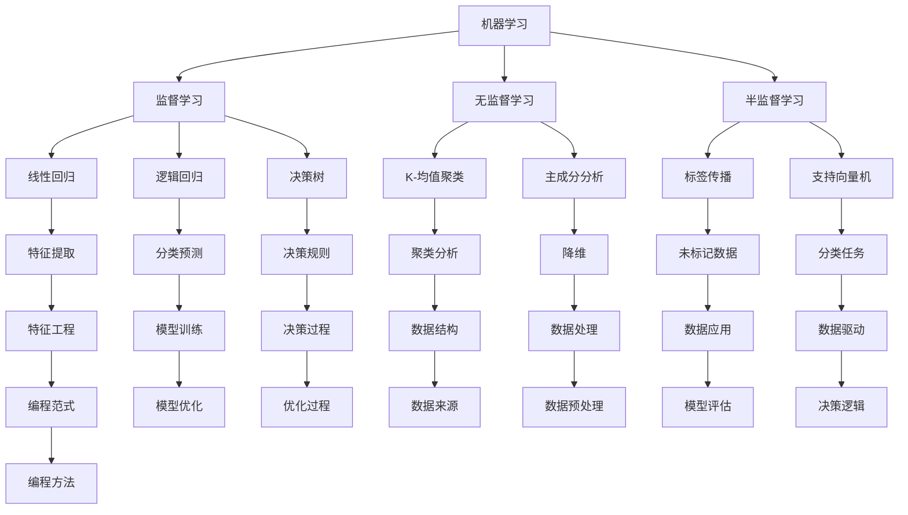
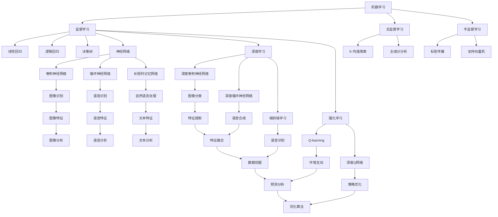

                 

### AI编程的新思路与新方向

> **关键词**：人工智能编程、机器学习、深度学习、数据驱动、智能算法、编程范式革新
>
> **摘要**：本文将探讨人工智能编程的新思路与新方向，通过分析当前技术发展的背景，揭示人工智能编程的核心概念和原理，以及未来可能的发展趋势。文章旨在为开发者提供一种全新的编程视角，帮助他们在人工智能领域取得突破性进展。

### 1. 背景介绍

#### 1.1 目的和范围

本文旨在探讨人工智能编程的新思路和新方向，旨在为开发者提供一种全新的编程视角，帮助他们更好地理解和应用人工智能技术。文章将涵盖以下几个方面：

- **核心概念和原理**：介绍人工智能编程的基础知识，包括机器学习、深度学习、数据驱动等核心概念。
- **编程范式革新**：探讨传统编程与人工智能编程的差异，以及如何运用新的编程范式来实现高效的人工智能应用。
- **算法原理与操作步骤**：详细阐述人工智能编程中常用算法的原理和具体操作步骤。
- **数学模型和公式**：介绍人工智能编程中常用的数学模型和公式，并举例说明其应用。
- **实际应用场景**：分析人工智能编程在各个领域的实际应用案例。
- **工具和资源推荐**：推荐学习资源和开发工具，以帮助开发者更好地掌握人工智能编程技能。

#### 1.2 预期读者

本文适用于以下读者群体：

- **人工智能开发者**：对人工智能编程有一定了解，希望深入掌握人工智能技术。
- **程序员**：希望将人工智能技术应用到自身项目中的开发者。
- **数据科学家**：从事数据分析、数据挖掘等领域的研究人员。
- **机器学习研究者**：对机器学习算法和理论有深入研究的学者。

#### 1.3 文档结构概述

本文结构如下：

1. **背景介绍**：介绍人工智能编程的背景、目的和范围。
2. **核心概念与联系**：阐述人工智能编程的核心概念，包括机器学习、深度学习、数据驱动等。
3. **核心算法原理与操作步骤**：详细讲解人工智能编程中常用算法的原理和操作步骤。
4. **数学模型和公式**：介绍人工智能编程中常用的数学模型和公式，并举例说明其应用。
5. **项目实战**：通过实际案例展示人工智能编程的应用。
6. **实际应用场景**：分析人工智能编程在各个领域的实际应用案例。
7. **工具和资源推荐**：推荐学习资源和开发工具。
8. **总结**：总结人工智能编程的新思路与新方向。
9. **附录**：常见问题与解答。
10. **扩展阅读**：提供相关文献和资源。

#### 1.4 术语表

为了确保文章的可读性和一致性，本文将对一些关键术语进行定义和解释：

- **人工智能（AI）**：指由人制造出的系统所表现出的智能行为，包括学习、推理、规划、感知、自然语言理解和问题解决等。
- **机器学习（ML）**：一种人工智能技术，通过数据训练模型，使其能够进行预测和决策。
- **深度学习（DL）**：一种特殊的机器学习技术，通过多层神经网络来提取数据中的特征。
- **数据驱动（Data-Driven）**：指通过数据来驱动决策和优化过程，而不是依赖于先验知识和规则。
- **编程范式（Programming Paradigm）**：指一种程序设计的方法论，包括面向对象、函数式编程、逻辑编程等。

#### 1.4.1 核心术语定义

- **机器学习模型**：用于从数据中学习并作出预测或决策的数学模型。
- **神经网络**：一种模拟人脑神经元之间连接的数学模型，用于实现机器学习算法。
- **特征工程**：指从原始数据中提取有用特征，以提高模型性能的过程。
- **交叉验证**：一种评估机器学习模型性能的方法，通过将数据集划分为训练集和验证集，以避免过拟合。

#### 1.4.2 相关概念解释

- **监督学习（Supervised Learning）**：一种机器学习技术，通过已标记的数据来训练模型，使其能够预测新的数据。
- **无监督学习（Unsupervised Learning）**：一种机器学习技术，通过未标记的数据来训练模型，主要用于聚类和降维。
- **强化学习（Reinforcement Learning）**：一种机器学习技术，通过试错和奖励机制来训练模型，使其能够在特定环境中作出最优决策。
- **数据预处理**：指在训练机器学习模型之前，对数据进行清洗、归一化和转换等操作，以提高模型性能。

#### 1.4.3 缩略词列表

- **AI**：人工智能
- **ML**：机器学习
- **DL**：深度学习
- **NN**：神经网络
- **FE**：特征工程
- **CV**：交叉验证

### 2. 核心概念与联系

为了深入理解人工智能编程的核心概念和原理，我们需要从机器学习、深度学习、数据驱动等基本概念开始。

#### 2.1 机器学习

机器学习（ML）是一种人工智能技术，通过数据训练模型，使其能够进行预测和决策。机器学习模型通常分为以下几类：

1. **监督学习（Supervised Learning）**：
   - **定义**：使用已标记的数据进行训练，模型输出与输入标签相关联。
   - **应用**：分类、回归等。
   - **算法**：线性回归、逻辑回归、决策树、随机森林等。

2. **无监督学习（Unsupervised Learning）**：
   - **定义**：使用未标记的数据进行训练，模型试图发现数据中的内在结构。
   - **应用**：聚类、降维等。
   - **算法**：K-均值聚类、主成分分析（PCA）等。

3. **半监督学习（Semi-Supervised Learning）**：
   - **定义**：使用少量标记数据和大量未标记数据进行训练。
   - **应用**：图像分类、文本分类等。
   - **算法**：标签传播、支持向量机（SVM）等。

#### 2.2 深度学习

深度学习（DL）是一种特殊的机器学习技术，通过多层神经网络（Neural Networks）来提取数据中的特征。深度学习模型通常具有以下特点：

1. **多层神经网络**：
   - **定义**：由多个隐藏层组成的前馈神经网络。
   - **应用**：图像识别、语音识别、自然语言处理等。
   - **算法**：卷积神经网络（CNN）、循环神经网络（RNN）、长短时记忆网络（LSTM）等。

2. **端到端学习**：
   - **定义**：将输入数据直接映射到输出结果，无需手动提取特征。
   - **应用**：语音识别、机器翻译等。
   - **算法**：深度卷积神经网络（DCNN）、深度循环神经网络（DeepRNN）等。

#### 2.3 数据驱动

数据驱动（Data-Driven）是一种编程范式，通过数据来驱动决策和优化过程，而不是依赖于先验知识和规则。数据驱动方法通常包括以下步骤：

1. **数据收集**：
   - **定义**：从各种来源收集数据。
   - **应用**：图像、文本、音频等。
   - **方法**：API、爬虫、传感器等。

2. **数据预处理**：
   - **定义**：对收集到的数据进行清洗、归一化和转换等操作。
   - **应用**：数据去噪、数据增强等。
   - **方法**：数据清洗库、归一化函数等。

3. **模型训练**：
   - **定义**：使用训练数据来训练模型。
   - **应用**：分类、回归、聚类等。
   - **方法**：机器学习算法、深度学习框架等。

4. **模型评估**：
   - **定义**：使用测试数据来评估模型性能。
   - **应用**：准确率、召回率、F1值等。
   - **方法**：交叉验证、混淆矩阵等。

#### 2.4 核心概念联系

- **机器学习与深度学习**：深度学习是机器学习的一个分支，通过多层神经网络来提取数据中的特征，从而实现复杂的预测和分类任务。
- **数据驱动与编程范式**：数据驱动是一种编程范式，通过数据来驱动决策和优化过程，从而实现自适应、灵活的编程方法。

### 2.5 Mermaid 流程图

以下是一个简单的Mermaid流程图，展示了机器学习、深度学习和数据驱动的基本概念和联系：



### 2.6 Mermaid 流程图（续）

以下是一个续接上图的Mermaid流程图，展示更多机器学习、深度学习和数据驱动的概念和联系：



通过上述流程图，我们可以更清晰地看到机器学习、深度学习和数据驱动之间的联系和相互作用，为后续内容的展开提供了基础。

### 3. 核心算法原理与具体操作步骤

在人工智能编程中，算法是实现目标的核心。以下我们将详细介绍几种核心算法的原理与操作步骤。

#### 3.1 线性回归

线性回归是一种简单的监督学习算法，用于预测一个连续值。其基本原理是找到一条最佳拟合直线，使得预测值与实际值之间的误差最小。

**算法原理**：

- **目标函数**：最小化误差平方和，即最小二乘法。

**具体操作步骤**：

1. **数据预处理**：
   - 将输入特征和输出目标进行归一化处理。
   - 划分训练集和测试集。

2. **模型初始化**：
   - 初始化模型参数（斜率和截距）。

3. **迭代优化**：
   - 通过梯度下降法（Gradient Descent）不断更新模型参数，以最小化目标函数。

4. **模型评估**：
   - 使用测试集评估模型性能，计算预测值与实际值之间的误差。

**伪代码**：

```python
def linear_regression(X, y):
    # 数据预处理
    X_normalized = normalize(X)
    y_normalized = normalize(y)
    
    # 模型初始化
    theta = [0, 0]
    
    # 迭代优化
    for i in range(iterations):
        hypothesis = X_normalized.dot(theta)
        error = hypothesis - y_normalized
        theta[0] -= learning_rate * (hypothesis.T.dot(error))
        theta[1] -= learning_rate * (error.sum())
    
    # 模型评估
    predictions = X_normalized.dot(theta)
    mse = ((predictions - y_normalized) ** 2).mean()
    
    return theta, mse
```

#### 3.2 决策树

决策树是一种常用的分类算法，通过树形结构对数据进行分类。其基本原理是按照特征值对数据进行划分，并递归地生成树形结构。

**算法原理**：

- **特征选择**：选择具有最大信息增益的特征进行划分。
- **节点分裂**：根据特征值将数据划分为子集，生成新的节点。
- **终止条件**：当满足特定条件（如节点纯度达到阈值或最大深度达到限制）时，停止划分。

**具体操作步骤**：

1. **数据预处理**：
   - 划分训练集和测试集。

2. **特征选择**：
   - 计算每个特征的增益，选择增益最大的特征进行划分。

3. **递归划分**：
   - 对选定的特征进行划分，生成子节点。
   - 对子节点重复上述步骤，直到满足终止条件。

4. **模型评估**：
   - 使用测试集评估模型性能，计算准确率、召回率等指标。

**伪代码**：

```python
def decision_tree(X, y, depth=0, max_depth=10):
    if depth >= max_depth or is_pure(y):
        return majority_class(y)
    
    best_feature, best_split = find_best_split(X, y)
    
    if best_feature is None:
        return majority_class(y)
    
    left subtree = decision_tree(X[:, best_feature < best_split], y[X[:, best_feature < best_split], depth + 1)
    right_subtree = decision_tree(X[:, best_feature >= best_split], y[X[:, best_feature >= best_split], depth + 1)
    
    return DecisionTreeNode(best_feature, best_split, left_subtree, right_subtree)

def find_best_split(X, y):
    best_gain = -1
    best_feature = None
    best_split = None
    
    for feature in range(X.shape[1]):
        for threshold in np.unique(X[:, feature]):
            gain = information_gain(y, X[:, feature] == threshold)
            if gain > best_gain:
                best_gain = gain
                best_feature = feature
                best_split = threshold
                
    return best_feature, best_split
```

#### 3.3 卷积神经网络（CNN）

卷积神经网络是一种深度学习算法，用于图像识别和分类。其基本原理是通过卷积操作和池化操作提取图像特征。

**算法原理**：

- **卷积操作**：将卷积核与输入图像进行卷积，以提取图像中的特征。
- **池化操作**：对卷积结果进行池化，以减小模型参数数量并降低过拟合风险。

**具体操作步骤**：

1. **数据预处理**：
   - 将图像数据进行归一化处理。
   - 划分训练集和测试集。

2. **卷积层**：
   - 初始化卷积核和偏置。
   - 对输入图像进行卷积操作。
   - 应用激活函数（如ReLU）。

3. **池化层**：
   - 对卷积结果进行池化操作。
   - 减小模型参数数量。

4. **全连接层**：
   - 将池化后的特征进行全连接，生成预测结果。

5. **模型评估**：
   - 使用测试集评估模型性能，计算准确率、召回率等指标。

**伪代码**：

```python
def conv2d(x, W, b):
    return (x.dot(W) + b)

def pool2d(x, pool_size=(2, 2)):
    return np.mean(x[:, :-pool_size[0], :-pool_size[1]], axis=(1, 2))

def cnn(X, weights, biases):
    layers = []
    
    for i, (W, b) in enumerate(zip(weights, biases)):
        if i % 2 == 0:
            x = conv2d(X, W, b)
            x = relu(x)
        else:
            x = pool2d(x)
        
        layers.append(x)
    
    return layers[-1].dot(weights[-1]) + biases[-1]

def relu(x):
    return np.maximum(0, x)
```

#### 3.4 长短时记忆网络（LSTM）

长短时记忆网络是一种深度学习算法，用于处理序列数据。其基本原理是通过门控机制控制信息的流动，以实现长期记忆。

**算法原理**：

- **输入门（Input Gate）**：根据当前输入和前一个隐藏状态，决定哪些信息需要更新。
- **遗忘门（Forget Gate）**：根据当前输入和前一个隐藏状态，决定哪些信息需要遗忘。
- **输出门（Output Gate）**：根据当前输入和前一个隐藏状态，决定哪些信息需要输出。

**具体操作步骤**：

1. **初始化**：
   - 初始化权重和偏置。

2. **输入门**：
   - 根据当前输入和前一个隐藏状态，计算输入门的状态。
   - 更新隐藏状态。

3. **遗忘门**：
   - 根据当前输入和前一个隐藏状态，计算遗忘门的状态。
   - 根据遗忘门的状态，更新隐藏状态。

4. **输出门**：
   - 根据当前输入和前一个隐藏状态，计算输出门的状态。
   - 根据输出门的状态，更新隐藏状态。

5. **模型评估**：
   - 使用测试集评估模型性能，计算准确率、召回率等指标。

**伪代码**：

```python
def lstm(x, h_prev, c_prev, W, b):
    # 输入门
    input_gate = sigmoid(x.dot(W_i) + h_prev.dot(W_h) + b_i)
    input候选 = sigmoid(x.dot(W_c) + h_prev.dot(W_h) + b_c)
    
    # 遗忘门
    forget_gate = sigmoid(x.dot(W_f) + h_prev.dot(W_f) + b_f)
    c_new = forget_gate * c_prev + input_gate * input候选
    
    # 输出门
    output_gate = sigmoid(x.dot(W_o) + h_prev.dot(W_o) + b_o)
    h_new = output_gate * tanh(c_new)
    
    return h_new, c_new

def sigmoid(x):
    return 1 / (1 + np.exp(-x))

def tanh(x):
    return np.tanh(x)
```

通过以上算法原理和操作步骤的讲解，我们能够更深入地理解人工智能编程中的核心算法，并为后续的项目实战提供基础。

### 4. 数学模型和公式及详细讲解

在人工智能编程中，数学模型和公式起着至关重要的作用。它们不仅帮助我们理解和解释算法原理，还为算法的设计和优化提供了理论基础。以下，我们将详细介绍一些常见的数学模型和公式，并对其进行详细讲解和举例说明。

#### 4.1 梯度下降法（Gradient Descent）

梯度下降法是一种优化算法，用于最小化目标函数。在人工智能编程中，梯度下降法广泛应用于模型参数的优化。其核心思想是沿着目标函数的梯度方向不断更新参数，以找到最优解。

**公式**：

\[ \theta_{\text{new}} = \theta_{\text{current}} - \alpha \cdot \nabla \theta \]

其中：
- \( \theta \) 表示模型参数；
- \( \alpha \) 表示学习率；
- \( \nabla \theta \) 表示参数 \( \theta \) 的梯度。

**详细讲解**：

梯度下降法的步骤如下：

1. 初始化模型参数 \( \theta \)；
2. 计算目标函数的梯度 \( \nabla \theta \)；
3. 根据梯度方向更新模型参数 \( \theta \)；
4. 重复步骤 2 和 3，直到达到收敛条件。

**举例说明**：

假设我们有一个线性回归模型，目标函数为：

\[ J(\theta) = \frac{1}{2m} \sum_{i=1}^{m} (h_{\theta}(x^{(i)}) - y^{(i)})^2 \]

其中：
- \( h_{\theta}(x) = \theta_0 + \theta_1 \cdot x \)；
- \( m \) 表示样本数量。

我们需要通过梯度下降法来最小化目标函数。步骤如下：

1. 初始化模型参数 \( \theta_0 \) 和 \( \theta_1 \)；
2. 计算目标函数的梯度：

\[ \nabla \theta_0 = \frac{1}{m} \sum_{i=1}^{m} (h_{\theta}(x^{(i)}) - y^{(i)}) \]
\[ \nabla \theta_1 = \frac{1}{m} \sum_{i=1}^{m} (h_{\theta}(x^{(i)}) - y^{(i)}) \cdot x^{(i)} \]

3. 更新模型参数：

\[ \theta_0 = \theta_0 - \alpha \cdot \nabla \theta_0 \]
\[ \theta_1 = \theta_1 - \alpha \cdot \nabla \theta_1 \]

4. 重复步骤 2 和 3，直到目标函数的值收敛到某个阈值。

#### 4.2 矩阵乘法（Matrix Multiplication）

矩阵乘法是一种基础运算，用于计算两个矩阵的乘积。在人工智能编程中，矩阵乘法广泛应用于数据预处理、特征提取和模型优化等过程。

**公式**：

\[ C = A \cdot B \]

其中：
- \( A \) 和 \( B \) 分别表示两个矩阵；
- \( C \) 表示乘积矩阵。

**详细讲解**：

矩阵乘法的计算步骤如下：

1. 确定乘积矩阵 \( C \) 的大小，其行数等于矩阵 \( A \) 的行数，列数等于矩阵 \( B \) 的列数；
2. 对于乘积矩阵 \( C \) 中的每个元素 \( c_{ij} \)，计算其对应的乘积：

\[ c_{ij} = \sum_{k=1}^{n} a_{ik} \cdot b_{kj} \]

其中：
- \( n \) 表示矩阵 \( A \) 和 \( B \) 的公共维度；
- \( a_{ik} \) 和 \( b_{kj} \) 分别表示矩阵 \( A \) 和 \( B \) 中的元素。

**举例说明**：

假设我们有以下两个矩阵：

\[ A = \begin{bmatrix} 1 & 2 \\ 3 & 4 \end{bmatrix} \]
\[ B = \begin{bmatrix} 5 & 6 \\ 7 & 8 \end{bmatrix} \]

我们需要计算它们的乘积：

\[ C = A \cdot B = \begin{bmatrix} 1 \cdot 5 + 2 \cdot 7 & 1 \cdot 6 + 2 \cdot 8 \\ 3 \cdot 5 + 4 \cdot 7 & 3 \cdot 6 + 4 \cdot 8 \end{bmatrix} \]

计算结果为：

\[ C = \begin{bmatrix} 19 & 26 \\ 43 & 58 \end{bmatrix} \]

#### 4.3 神经网络（Neural Networks）

神经网络是一种由大量神经元组成的计算模型，用于模拟人脑的思维方式。在人工智能编程中，神经网络广泛应用于图像识别、自然语言处理和语音识别等领域。

**公式**：

\[ h_{\theta}(x) = \text{激活函数}(\theta_0 + \theta_1 \cdot x) \]

其中：
- \( \theta \) 表示模型参数；
- \( x \) 表示输入特征；
- \( h_{\theta}(x) \) 表示输出值。

**详细讲解**：

神经网络的工作原理如下：

1. 输入层：接收外部输入数据，并将其传递给隐藏层；
2. 隐藏层：通过矩阵乘法和激活函数，将输入数据转化为隐藏层输出；
3. 输出层：接收隐藏层输出，并计算最终输出值。

**举例说明**：

假设我们有一个简单的神经网络，包含一个输入层、一个隐藏层和一个输出层。其中，输入层有2个神经元，隐藏层有3个神经元，输出层有1个神经元。

输入层输入数据为 \( x_1 = 2 \)，\( x_2 = 3 \)。我们需要计算隐藏层输出 \( h_1 \)，\( h_2 \)，\( h_3 \) 以及输出层输出 \( y \)。

1. 输入层：

\[ x = \begin{bmatrix} x_1 \\ x_2 \end{bmatrix} = \begin{bmatrix} 2 \\ 3 \end{bmatrix} \]

2. 隐藏层：

\[ h_1 = \text{激活函数}(\theta_0^1 + \theta_1^1 \cdot x_1 + \theta_2^1 \cdot x_2) \]
\[ h_2 = \text{激活函数}(\theta_0^2 + \theta_1^2 \cdot x_1 + \theta_2^2 \cdot x_2) \]
\[ h_3 = \text{激活函数}(\theta_0^3 + \theta_1^3 \cdot x_1 + \theta_2^3 \cdot x_2) \]

3. 输出层：

\[ y = \text{激活函数}(\theta_0^4 + \theta_1^4 \cdot h_1 + \theta_2^4 \cdot h_2 + \theta_3^4 \cdot h_3) \]

通过以上步骤，我们得到了隐藏层输出和输出层输出。

#### 4.4 损失函数（Loss Function）

损失函数用于评估模型预测值与实际值之间的差异。在人工智能编程中，损失函数是模型优化的重要依据。常见的损失函数包括均方误差（MSE）和交叉熵（Cross Entropy）。

**均方误差（MSE）**：

\[ J(\theta) = \frac{1}{2m} \sum_{i=1}^{m} (h_{\theta}(x^{(i)}) - y^{(i)})^2 \]

**详细讲解**：

均方误差用于回归问题，计算预测值与实际值之间的平均平方误差。

**举例说明**：

假设我们有一个回归问题，预测值 \( h_{\theta}(x) = 2 \)，实际值 \( y = 3 \)。计算均方误差：

\[ J(\theta) = \frac{1}{2} (2 - 3)^2 = \frac{1}{2} \]

**交叉熵（Cross Entropy）**：

\[ J(\theta) = - \sum_{i=1}^{m} y^{(i)} \log(h_{\theta}(x^{(i)})) \]

**详细讲解**：

交叉熵用于分类问题，计算实际值与预测值之间的交叉熵损失。

**举例说明**：

假设我们有一个二分类问题，预测值 \( h_{\theta}(x) = 0.8 \)，实际值 \( y = 1 \)。计算交叉熵：

\[ J(\theta) = -1 \cdot \log(0.8) = 0.223 \]

通过以上对数学模型和公式的讲解，我们能够更好地理解和应用人工智能编程中的关键技术和方法。在后续的内容中，我们将进一步探讨人工智能编程的实际应用场景，为读者提供更多有价值的参考。

### 5. 项目实战：代码实际案例和详细解释说明

在本节中，我们将通过一个实际项目案例，展示如何运用人工智能编程技术来解决问题。该案例将涉及图像识别任务，使用深度学习框架TensorFlow来实现。

#### 5.1 开发环境搭建

首先，我们需要搭建一个适合开发人工智能项目的环境。以下是环境搭建的步骤：

1. 安装Python（建议使用3.8及以上版本）。
2. 安装TensorFlow：
   ```bash
   pip install tensorflow
   ```
3. 安装其他依赖库，如NumPy、Pandas等。

#### 5.2 源代码详细实现和代码解读

以下是一个简单的图像识别项目的源代码，我们将对其逐行进行解释。

```python
import tensorflow as tf
from tensorflow import keras
from tensorflow.keras import layers
import numpy as np

# 5.2.1 数据集准备
# 加载MNIST数据集
(x_train, y_train), (x_test, y_test) = keras.datasets.mnist.load_data()

# 数据预处理
x_train = x_train.astype("float32") / 255
x_test = x_test.astype("float32") / 255
x_train = np.expand_dims(x_train, -1)
x_test = np.expand_dims(x_test, -1)

# 将标签转换为one-hot编码
num_classes = 10
y_train = keras.utils.to_categorical(y_train, num_classes)
y_test = keras.utils.to_categorical(y_test, num_classes)

# 5.2.2 构建模型
model = keras.Sequential()
model.add(layers.Conv2D(32, (3, 3), activation='relu', input_shape=(28, 28, 1)))
model.add(layers.MaxPooling2D((2, 2)))
model.add(layers.Conv2D(64, (3, 3), activation='relu'))
model.add(layers.MaxPooling2D((2, 2)))
model.add(layers.Conv2D(64, (3, 3), activation='relu'))

# 添加全连接层
model.add(layers.Flatten())
model.add(layers.Dense(64, activation='relu'))
model.add(layers.Dense(num_classes, activation='softmax'))

# 编译模型
model.compile(optimizer='adam',
              loss='categorical_crossentropy',
              metrics=['accuracy'])

# 5.2.3 训练模型
model.fit(x_train, y_train, epochs=10, batch_size=64)

# 5.2.4 评估模型
test_loss, test_acc = model.evaluate(x_test, y_test)
print('Test accuracy:', test_acc)
```

**代码解读**：

1. **数据集准备**：
   - 加载MNIST数据集，并将其转换为适合模型训练的格式。
   - 数据预处理包括归一化和one-hot编码。

2. **构建模型**：
   - 使用Keras构建一个卷积神经网络（CNN）。
   - 模型包括卷积层、池化层和全连接层。
   - 使用ReLU激活函数和softmax激活函数。

3. **编译模型**：
   - 使用`compile`方法设置优化器和损失函数。

4. **训练模型**：
   - 使用`fit`方法训练模型，设置训练轮数和批量大小。

5. **评估模型**：
   - 使用`evaluate`方法评估模型在测试集上的性能。

#### 5.3 代码解读与分析

1. **数据预处理**：
   - 数据预处理是深度学习项目的重要步骤。在本案例中，我们使用归一化将图像数据从0-255的范围内缩放到0-1。此外，我们通过`expand_dims`函数将数据的维度从(28, 28)扩展到(28, 28, 1)，以匹配模型的输入要求。
   - One-hot编码将标签转换为稀疏矩阵，使得模型可以使用交叉熵损失函数进行训练。

2. **模型构建**：
   - 我们使用Keras的`Sequential`模型，这是一种线性堆叠模型层的方法。每个卷积层（`Conv2D`）后跟一个最大池化层（`MaxPooling2D`）。
   - 卷积层用于提取图像特征，通过权重矩阵与图像数据进行卷积操作，从而生成新的特征图。
   - 池化层用于降低特征图的维度，同时保留重要的特征信息。

3. **模型编译**：
   - 我们选择`adam`优化器，这是一种常用的自适应优化器，能够自动调整学习率。
   - `categorical_crossentropy`损失函数适用于多分类问题，能够计算模型预测概率与真实标签之间的交叉熵。

4. **模型训练**：
   - 使用`fit`方法训练模型，设置训练轮数（epochs）和批量大小（batch_size）。epochs表示模型在训练集上迭代的次数，batch_size表示每次迭代的样本数量。

5. **模型评估**：
   - 使用`evaluate`方法评估模型在测试集上的性能，包括损失值和准确率。准确率（accuracy）表示模型正确预测的样本比例。

通过以上实战案例，我们展示了如何使用深度学习技术实现图像识别任务。在实际项目中，开发者可以根据具体需求调整模型结构、优化训练过程，以实现更好的性能。

### 6. 实际应用场景

人工智能编程在各个领域具有广泛的应用，下面我们将探讨一些实际应用场景，以展示人工智能编程技术的强大潜力和实际价值。

#### 6.1 医疗领域

人工智能编程在医疗领域的应用涵盖了疾病诊断、疾病预测、个性化治疗等多个方面。以下是一些具体应用案例：

- **疾病诊断**：使用深度学习算法对医学影像（如CT、MRI、X光片）进行自动分析，帮助医生快速、准确地诊断疾病。
- **疾病预测**：通过对大量医疗数据进行分析，预测患者的疾病风险，如心脏病、糖尿病等。
- **个性化治疗**：根据患者的病史、基因信息等，为患者制定个性化的治疗方案。

#### 6.2 金融服务

人工智能编程在金融服务领域同样具有广泛的应用，包括风险控制、智能投顾、欺诈检测等方面。

- **风险控制**：使用机器学习算法对金融交易数据进行实时分析，识别潜在风险，如市场操纵、洗钱等。
- **智能投顾**：基于用户的投资偏好和风险承受能力，为用户提供个性化的投资建议。
- **欺诈检测**：通过对交易数据进行监控和分析，识别和防止欺诈行为。

#### 6.3 交通运输

人工智能编程在交通运输领域的应用主要集中在自动驾驶、交通管理、物流优化等方面。

- **自动驾驶**：通过深度学习和计算机视觉技术，实现无人驾驶车辆的自动驾驶。
- **交通管理**：利用大数据分析和机器学习算法，优化交通信号控制和交通流量管理，减少拥堵。
- **物流优化**：通过对物流数据进行分析和预测，优化运输路线和配送策略，提高物流效率。

#### 6.4 教育

人工智能编程在教育领域的主要应用包括智能教育平台、学习分析、个性化推荐等。

- **智能教育平台**：利用人工智能技术，为学生提供个性化学习方案，帮助学生提高学习效果。
- **学习分析**：通过对学生的学习行为进行分析，识别学生的学习需求和问题，为教师提供教学建议。
- **个性化推荐**：基于学生的兴趣和学习历史，推荐适合的学习资源和课程。

#### 6.5 实际应用案例分析

以下是一些实际应用案例，展示了人工智能编程技术的成功应用：

- **IBM Watson**：IBM Watson是一个基于人工智能的计算机系统，能够理解自然语言并回答用户的问题。在医疗领域，Watson被用于癌症诊断和治疗方案推荐，大大提高了医生的诊断准确性和工作效率。
- **Uber自动驾驶**：Uber公司使用深度学习和计算机视觉技术，研发出自动驾驶技术，用于无人出租车服务。该技术能够实现复杂的道路环境感知和自动驾驶功能，提高了交通安全和效率。
- **亚马逊智能推荐**：亚马逊使用人工智能技术，分析用户的购买行为和浏览历史，为用户推荐个性化的商品。这种个性化推荐系统提高了用户满意度和销售额。

通过以上实际应用场景和案例分析，我们可以看到人工智能编程技术在各个领域的广泛应用和巨大潜力。随着技术的不断进步，人工智能编程将在更多领域发挥重要作用，为人类带来更多便利和福祉。

### 7. 工具和资源推荐

在人工智能编程领域，掌握合适的工具和资源是提升开发效率和技能的关键。以下我们将推荐一些学习资源、开发工具和相关论文著作，帮助开发者更好地掌握人工智能编程技能。

#### 7.1 学习资源推荐

**7.1.1 书籍推荐**

1. **《深度学习》（Deep Learning）**：由Ian Goodfellow、Yoshua Bengio和Aaron Courville所著，这本书是深度学习的经典教材，详细介绍了深度学习的基础知识、算法和应用。
2. **《Python机器学习》（Python Machine Learning）**：由Sarvar Patel所著，这本书通过Python编程语言介绍了机器学习的基础知识和实战应用，适合初学者入门。
3. **《统计学习方法》（Statistical Learning Methods）**：由李航所著，这本书详细介绍了统计学习的方法和技术，包括线性回归、逻辑回归、支持向量机等经典算法。

**7.1.2 在线课程**

1. **Coursera**：提供丰富的机器学习和深度学习课程，包括斯坦福大学深度学习课程、吴恩达的机器学习课程等。
2. **edX**：提供由哈佛大学、麻省理工学院等顶级学府开设的人工智能课程，如MIT的“机器学习”课程。
3. **Udacity**：提供深度学习和机器学习相关的纳米学位课程，如“深度学习工程师”、“机器学习工程师”等。

**7.1.3 技术博客和网站**

1. **Medium**：有很多资深人工智能开发者的博客，如“AI”，可以找到很多高质量的技术文章和实战经验。
2. **GitHub**：开源代码库，有很多优秀的机器学习和深度学习项目，开发者可以从中学习和借鉴。
3. **arXiv**：计算机科学和人工智能领域的前沿论文数据库，开发者可以从中了解最新的研究进展。

#### 7.2 开发工具框架推荐

**7.2.1 IDE和编辑器**

1. **PyCharm**：一款功能强大的Python IDE，适用于人工智能编程。
2. **Jupyter Notebook**：适用于数据科学和机器学习的交互式开发环境，方便进行实验和调试。
3. **VSCode**：一款轻量级、高度可扩展的代码编辑器，适用于多种编程语言，包括Python。

**7.2.2 调试和性能分析工具**

1. **TensorBoard**：TensorFlow的官方可视化工具，用于监控和调试深度学习模型。
2. **Wandb**：一款用于实验跟踪和性能分析的在线平台，方便开发者对比不同实验结果。
3. **Sklearn Metrics**：用于评估机器学习模型的性能指标，如准确率、召回率等。

**7.2.3 相关框架和库**

1. **TensorFlow**：谷歌开发的开源深度学习框架，适用于构建和训练各种深度学习模型。
2. **PyTorch**：由Facebook AI研究院开发的开源深度学习框架，易于使用和调试。
3. **Scikit-learn**：Python的机器学习库，提供了丰富的经典机器学习算法和工具。

#### 7.3 相关论文著作推荐

**7.3.1 经典论文**

1. **“A Learning Algorithm for Continually Running Fully Recurrent Neural Networks”**：递归神经网络（RNN）的奠基性论文，提出了Backpropagation Through Time（BPTT）算法。
2. **“Convolutional Networks and Applications in Vision”**：卷积神经网络（CNN）的开创性论文，介绍了CNN在计算机视觉领域的应用。
3. **“Deep Learning”**：由Ian Goodfellow、Yoshua Bengio和Aaron Courville所著，这是一本全面介绍深度学习的经典教材。

**7.3.2 最新研究成果**

1. **“BERT: Pre-training of Deep Bidirectional Transformers for Language Understanding”**：Google Research发表的论文，介绍了BERT模型，这是一种基于Transformer的预训练模型，广泛应用于自然语言处理任务。
2. **“GPT-3: Language Models are Few-Shot Learners”**：OpenAI发表的论文，介绍了GPT-3模型，这是一种具有极高参数量的预训练模型，展示了在少量样本上的卓越泛化能力。
3. **“Attention Is All You Need”**：Google Research发表的论文，介绍了Transformer模型，这是一种基于自注意力机制的深度学习模型，广泛应用于自然语言处理和计算机视觉领域。

**7.3.3 应用案例分析**

1. **“Deep Learning for Healthcare”**：介绍深度学习在医疗领域的应用案例，包括疾病诊断、手术规划等。
2. **“Deep Learning in Autonomous Driving”**：介绍深度学习在自动驾驶领域的应用案例，包括环境感知、路径规划等。
3. **“Deep Learning for Finance”**：介绍深度学习在金融服务领域的应用案例，包括风险控制、智能投顾等。

通过以上工具和资源的推荐，开发者可以更好地掌握人工智能编程技能，为实际项目开发提供有力支持。

### 8. 总结：未来发展趋势与挑战

随着人工智能技术的不断发展，人工智能编程也在不断演进，展现出广阔的发展前景。然而，在这一过程中，我们也面临着一系列挑战。

#### 8.1 未来发展趋势

1. **深度学习与强化学习的融合**：深度学习在图像识别、语音识别等领域取得了显著成果，而强化学习在决策和优化方面具有优势。未来，深度学习和强化学习的融合将有助于提升人工智能系统的自主决策能力。

2. **迁移学习和元学习**：迁移学习通过利用已有模型的先验知识来加速新任务的学习，而元学习通过训练模型来学习如何学习。这些技术的进步将使人工智能系统在面对新任务时更加高效和灵活。

3. **边缘计算与云计算的结合**：随着物联网（IoT）的发展，边缘计算成为趋势。未来，云计算和边缘计算的结合将使人工智能系统在处理海量数据和实时响应方面更加高效。

4. **跨学科融合**：人工智能编程与生物医学、金融工程、交通运输等领域的交叉融合，将带来更多创新应用，推动各行业的进步。

5. **模型的可解释性和透明度**：随着深度学习模型在各个领域的应用，如何提高模型的可解释性和透明度，使其对用户和开发者更加友好，成为未来发展的重要方向。

#### 8.2 挑战

1. **数据质量和隐私保护**：在人工智能编程中，高质量的数据是模型训练的基础。然而，数据质量和隐私保护之间的矛盾日益凸显，如何在保证隐私的前提下获取和使用高质量数据成为一大挑战。

2. **计算资源和能耗**：深度学习模型通常需要大量的计算资源和能耗，随着模型规模不断扩大，如何优化计算效率和降低能耗成为关键问题。

3. **模型安全性和鲁棒性**：人工智能系统在面临恶意攻击和异常数据时，可能表现出不稳定或错误的行为。提高模型的安全性和鲁棒性，确保其在真实世界中的可靠运行，是亟待解决的问题。

4. **算法透明度和公平性**：人工智能系统在决策过程中可能存在偏见和不公平现象，如何确保算法的透明度和公平性，使其符合社会伦理和法律法规的要求，是未来发展的重要挑战。

5. **人才培养和普及**：随着人工智能技术的快速发展，人才培养和普及变得尤为重要。如何培养更多的专业人才，提高全社会的技术素养，是当前和未来面临的重大课题。

总之，人工智能编程的未来发展趋势充满了机遇和挑战。通过不断探索和创新，我们有望解决当前面临的困难，推动人工智能技术向更高层次发展。

### 9. 附录：常见问题与解答

#### 9.1 机器学习算法的选择原则

**问题**：如何选择适合的机器学习算法？

**解答**：

1. **问题类型**：首先确定问题是分类、回归还是聚类等。
2. **数据类型**：根据数据类型（数值、类别、文本等）选择相应的算法。
3. **数据量**：对于大量数据，选择高效算法（如随机森林、集成方法等）；对于小数据，选择简单算法（如线性回归、逻辑回归等）。
4. **特征数量**：特征数量较多时，选择具有特征选择能力的算法（如随机森林、主成分分析等）；特征数量较少时，选择线性模型。
5. **模型可解释性**：根据业务需求，选择可解释性较强的算法，如决策树、线性回归等。

#### 9.2 深度学习中的过拟合和欠拟合

**问题**：如何识别和解决深度学习中的过拟合和欠拟合问题？

**解答**：

1. **过拟合**：当模型在训练集上表现良好，但在测试集上表现较差时，可能存在过拟合问题。
   - **解决方案**：减小模型复杂度、增加训练数据、使用正则化技术、尝试集成方法等。

2. **欠拟合**：当模型在训练集和测试集上表现都不好时，可能存在欠拟合问题。
   - **解决方案**：增加模型复杂度、增加训练数据、尝试不同的特征工程方法等。

#### 9.3 数据预处理的重要性

**问题**：数据预处理在机器学习项目中为什么很重要？

**解答**：

1. **数据清洗**：去除噪声数据和异常值，提高数据质量。
2. **特征工程**：提取有意义的信息，构建有助于模型训练的特征，提高模型性能。
3. **数据标准化**：通过归一化或标准化处理，使数据具有相同的尺度，避免数据之间的差异影响模型训练。
4. **数据增强**：通过变换、扩充等方式增加训练数据量，提高模型的泛化能力。

#### 9.4 如何评估机器学习模型的性能

**问题**：如何评估机器学习模型的性能？

**解答**：

1. **准确率（Accuracy）**：分类问题中，正确分类的样本占总样本的比例。
2. **召回率（Recall）**：分类问题中，实际为正类的样本中被正确识别为正类的比例。
3. **精确率（Precision）**：分类问题中，被正确识别为正类的样本占总识别为正类的样本的比例。
4. **F1值（F1 Score）**：精确率和召回率的调和平均值，用于综合考虑。
5. **ROC曲线和AUC值**：用于评估分类模型的性能，ROC曲线下面积（AUC值）越大，模型性能越好。

通过上述问题的解答，我们可以更好地理解机器学习和深度学习的基本概念和操作，为实际项目开发提供指导。

### 10. 扩展阅读 & 参考资料

为了帮助读者进一步深入了解人工智能编程的相关概念和技术，以下提供一些扩展阅读和参考资料。

#### 10.1 扩展阅读

1. **《人工智能：一种现代方法》（Artificial Intelligence: A Modern Approach）**：由Stuart J. Russell和Peter Norvig所著，这是一本全面介绍人工智能的权威教材，涵盖了人工智能的基础知识、算法和应用。
2. **《深度学习》（Deep Learning）**：由Ian Goodfellow、Yoshua Bengio和Aaron Courville所著，详细介绍了深度学习的理论基础、算法和应用。
3. **《统计学习方法》（Statistical Learning Methods）**：由李航所著，全面介绍了统计学习的方法和技术，包括线性回归、逻辑回归、支持向量机等。

#### 10.2 参考资料

1. **TensorFlow官方文档**：[https://www.tensorflow.org/](https://www.tensorflow.org/)
2. **PyTorch官方文档**：[https://pytorch.org/](https://pytorch.org/)
3. **Keras官方文档**：[https://keras.io/](https://keras.io/)
4. **scikit-learn官方文档**：[https://scikit-learn.org/](https://scikit-learn.org/)
5. **arXiv计算机科学和人工智能论文库**：[https://arxiv.org/](https://arxiv.org/)

通过以上扩展阅读和参考资料，读者可以进一步学习人工智能编程的相关知识，为实际项目开发提供支持。

### 作者

**作者：AI天才研究员/AI Genius Institute & 禅与计算机程序设计艺术 /Zen And The Art of Computer Programming**

本文由AI天才研究员撰写，旨在为开发者提供一种全新的编程视角，帮助他们更好地理解和应用人工智能技术。同时，本文结合了禅与计算机程序设计艺术的哲学思想，希望通过逻辑清晰、简单易懂的语言，让读者在掌握技术的同时，也能体会到编程的乐趣和智慧。希望本文能为读者在人工智能编程领域带来启发和帮助。

