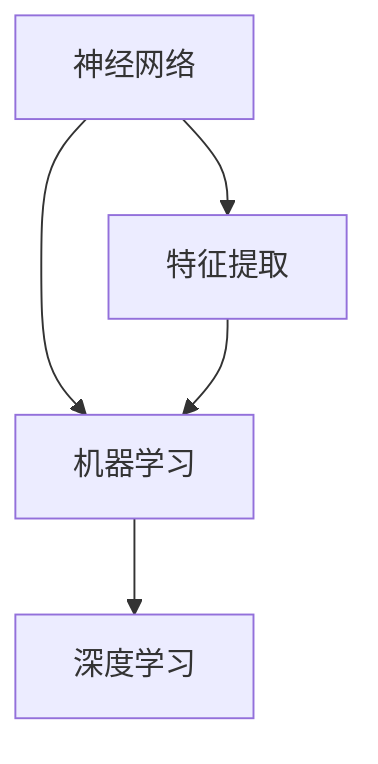
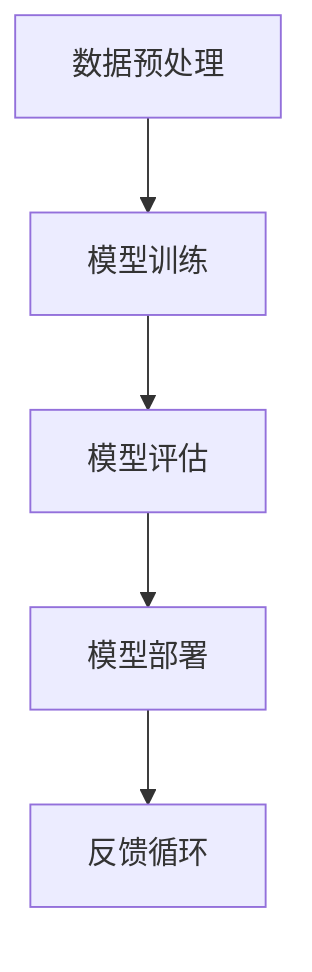

                 

# AI编程的新维度

> 关键词：人工智能编程、深度学习、机器学习、算法优化、编程范式

> 摘要：本文将深入探讨人工智能编程的新维度，从核心概念到实际应用，全面解析人工智能编程的原理和实践。我们将通过逐步分析，揭示人工智能编程背后的逻辑和技巧，帮助读者掌握这一前沿技术。

## 1. 背景介绍

### 1.1 目的和范围

本文旨在介绍人工智能编程的新维度，涵盖深度学习、机器学习等核心概念，以及相关的算法原理和实际应用。通过本文的阅读，读者将能够：

1. 理解人工智能编程的基本原理和概念。
2. 掌握核心算法的优化方法。
3. 学会使用编程范式和工具来构建人工智能应用。

### 1.2 预期读者

本文适合以下读者群体：

1. 对人工智能编程感兴趣的技术爱好者。
2. 正在从事人工智能开发工作的程序员。
3. 想要了解人工智能编程原理的计算机科学专业学生。

### 1.3 文档结构概述

本文结构如下：

1. **背景介绍**：介绍人工智能编程的背景和目的。
2. **核心概念与联系**：介绍人工智能编程的核心概念，并使用 Mermaid 流程图展示其联系。
3. **核心算法原理与具体操作步骤**：详细阐述核心算法的原理和伪代码。
4. **数学模型和公式**：介绍数学模型和公式，并进行举例说明。
5. **项目实战**：通过代码实际案例展示人工智能编程的应用。
6. **实际应用场景**：分析人工智能编程在实际场景中的应用。
7. **工具和资源推荐**：推荐学习资源和开发工具。
8. **总结**：总结未来发展趋势与挑战。
9. **附录**：常见问题与解答。
10. **扩展阅读**：提供相关的参考资料。

### 1.4 术语表

#### 1.4.1 核心术语定义

- **人工智能编程**：使用编程语言和工具来实现人工智能算法和应用的过程。
- **深度学习**：一种基于神经网络的机器学习方法，通过多层非线性变换来提取特征。
- **机器学习**：让计算机通过数据学习规律和模式的方法。
- **算法优化**：通过调整算法参数来提高其性能和效率的过程。

#### 1.4.2 相关概念解释

- **神经网络**：模拟人脑神经元连接的数学模型。
- **特征提取**：从数据中提取有用的信息以便用于模型训练。
- **模型训练**：通过大量数据来调整模型参数的过程。

#### 1.4.3 缩略词列表

- **AI**：人工智能
- **ML**：机器学习
- **DL**：深度学习
- **GAN**：生成对抗网络

## 2. 核心概念与联系

### 2.1 人工智能编程的核心概念

人工智能编程的核心概念包括神经网络、机器学习、深度学习等。以下是一个使用 Mermaid 流程图展示这些概念及其联系：



### 2.2 人工智能编程的架构

人工智能编程的架构包括数据预处理、模型训练、模型评估和模型部署。以下是一个使用 Mermaid 流程图展示其架构：



## 3. 核心算法原理 & 具体操作步骤

### 3.1 神经网络算法原理

神经网络算法的核心是神经元，其工作原理类似于人脑的神经元。以下是一个使用伪代码展示神经网络算法的基本步骤：

```python
// 定义神经元
class Neuron:
    def __init__(self):
        self.inputs = []
        self.weights = []
        self.bias = 0
        self.output = 0

    def forward(self, inputs):
        self.inputs = inputs
        self.output = sum(self.weights * self.inputs) + self.bias

// 定义多层神经网络
class NeuralNetwork:
    def __init__(self):
        self.layers = []

    def add_layer(self, layer):
        self.layers.append(layer)

    def forward(self, inputs):
        output = inputs
        for layer in self.layers:
            output = layer.forward(output)
        return output

// 定义激活函数
def sigmoid(x):
    return 1 / (1 + exp(-x))
```

### 3.2 模型训练与优化

模型训练是调整神经网络参数的过程。以下是一个使用伪代码展示模型训练的基本步骤：

```python
// 定义损失函数
def mean_squared_error(y_true, y_pred):
    return sum((y_true - y_pred)**2) / len(y_true)

// 定义反向传播算法
def backward_propagation(network, inputs, outputs):
    dloss_dweights = []
    dloss_dbias = []
    for layer in reversed(network.layers):
        dloss_dinputs = layer.backward(inputs)
        dloss_dweights.append(dloss_dinputs * layer.inputs)
        dloss_dbias.append(dloss_dinputs)
        inputs = layer.outputs

    return dloss_dweights, dloss_dbias

// 定义优化算法
def gradient_descent(network, inputs, outputs, learning_rate):
    dloss_dweights, dloss_dbias = backward_propagation(network, inputs, outputs)
    for layer in network.layers:
        layer.weights -= learning_rate * dloss_dweights[layer.index]
        layer.bias -= learning_rate * dloss_dbias[layer.index]
```

## 4. 数学模型和公式 & 详细讲解 & 举例说明

### 4.1 损失函数

损失函数用于衡量模型预测结果与真实结果之间的差距。以下是一个使用 LaTeX 格式展示的常见损失函数——均方误差（MSE）：

$$
MSE = \frac{1}{n}\sum_{i=1}^{n}(y_i - \hat{y}_i)^2
$$

其中，$y_i$ 是真实值，$\hat{y}_i$ 是预测值，$n$ 是样本数量。

### 4.2 激活函数

激活函数用于增加神经网络的非线性特性。以下是一个使用 LaTeX 格式展示的常见激活函数——Sigmoid 函数：

$$
\sigma(x) = \frac{1}{1 + e^{-x}}
$$

### 4.3 举例说明

假设我们有一个简单的神经网络，用于二分类问题。输入层有2个神经元，隐藏层有3个神经元，输出层有1个神经元。以下是一个使用 Python 实现的示例：

```python
import numpy as np

# 定义激活函数
def sigmoid(x):
    return 1 / (1 + np.exp(-x))

# 定义反向传播算法
def backward_propagation(network, inputs, outputs):
    dloss_dweights = []
    dloss_dbias = []
    for layer in reversed(network.layers):
        dloss_dinputs = layer.backward(inputs)
        dloss_dweights.append(dloss_dinputs * layer.inputs)
        dloss_dbias.append(dloss_dinputs)
        inputs = layer.outputs

    return dloss_dweights, dloss_dbias

# 定义优化算法
def gradient_descent(network, inputs, outputs, learning_rate):
    dloss_dweights, dloss_dbias = backward_propagation(network, inputs, outputs)
    for layer in network.layers:
        layer.weights -= learning_rate * dloss_dweights[layer.index]
        layer.bias -= learning_rate * dloss_dbias[layer.index]

# 创建神经网络
nn = NeuralNetwork()

# 添加层
nn.add_layer(Neuron())
nn.add_layer(Neuron())
nn.add_layer(Neuron())
nn.add_layer(Neuron())

# 训练模型
inputs = np.array([0.5, 0.7])
outputs = np.array([0.1])
learning_rate = 0.1
for i in range(1000):
    nn.forward(inputs)
    loss = mean_squared_error(outputs, nn.output)
    gradient_descent(nn, inputs, outputs, learning_rate)
    print(f"Iteration {i}: Loss = {loss}")

# 测试模型
print(f"Test output: {nn.forward(inputs)}")
```

## 5. 项目实战：代码实际案例和详细解释说明

### 5.1 开发环境搭建

在本项目中，我们将使用 Python 作为编程语言，配合 TensorFlow 和 Keras 库来实现深度学习模型。以下是搭建开发环境的步骤：

1. 安装 Python 3.7 或更高版本。
2. 安装 TensorFlow 和 Keras：

```bash
pip install tensorflow
```

### 5.2 源代码详细实现和代码解读

以下是一个使用 Keras 实现的简单深度学习模型的源代码：

```python
import numpy as np
from tensorflow import keras
from tensorflow.keras import layers

# 定义模型
model = keras.Sequential()
model.add(layers.Dense(64, activation='relu', input_shape=(784,)))
model.add(layers.Dense(10, activation='softmax'))

# 编译模型
model.compile(optimizer='adam',
              loss='categorical_crossentropy',
              metrics=['accuracy'])

# 加载数据
(x_train, y_train), (x_test, y_test) = keras.datasets.mnist.load_data()
x_train = x_train.astype('float32') / 255
x_test = x_test.astype('float32') / 255
y_train = keras.utils.to_categorical(y_train, 10)
y_test = keras.utils.to_categorical(y_test, 10)

# 训练模型
model.fit(x_train, y_train, batch_size=128, epochs=15, validation_data=(x_test, y_test))

# 测试模型
test_loss, test_acc = model.evaluate(x_test, y_test)
print(f"Test accuracy: {test_acc}")
```

#### 5.2.1 代码解读与分析

- **定义模型**：使用 `keras.Sequential()` 创建一个顺序模型，并添加两个 `Dense` 层，第一个层有64个神经元，使用 ReLU 激活函数，输入形状为 (784,)。第二个层有10个神经元，使用 softmax 激活函数。
- **编译模型**：使用 `compile()` 方法编译模型，指定优化器、损失函数和评价指标。
- **加载数据**：使用 `keras.datasets.mnist.load_data()` 加载 MNIST 数据集，并将数据转换为适合模型训练的格式。
- **训练模型**：使用 `fit()` 方法训练模型，指定批次大小、迭代次数和验证数据。
- **测试模型**：使用 `evaluate()` 方法测试模型在测试数据上的性能。

### 5.3 代码解读与分析

在本项目中，我们使用 Keras 库创建了一个简单的深度学习模型，用于手写数字识别任务。以下是对关键代码的解读和分析：

1. **模型定义**：
   ```python
   model = keras.Sequential()
   model.add(layers.Dense(64, activation='relu', input_shape=(784,)))
   model.add(layers.Dense(10, activation='softmax'))
   ```

   这里我们创建了一个顺序模型，并添加了两个全连接层（`Dense`）。第一个层有64个神经元，使用 ReLU 激活函数，输入形状为 (784,)，对应于手写数字图像的784个像素值。第二个层有10个神经元，使用 softmax 激活函数，用于输出10个类别中的概率分布。

2. **模型编译**：
   ```python
   model.compile(optimizer='adam',
                 loss='categorical_crossentropy',
                 metrics=['accuracy'])
   ```

   我们使用 Adam 优化器来优化模型参数。`categorical_crossentropy` 是交叉熵损失函数，用于多分类问题。同时，我们设置了 `accuracy` 作为评价指标，用于计算模型在训练和测试数据上的准确率。

3. **数据加载**：
   ```python
   (x_train, y_train), (x_test, y_test) = keras.datasets.mnist.load_data()
   x_train = x_train.astype('float32') / 255
   x_test = x_test.astype('float32') / 255
   y_train = keras.utils.to_categorical(y_train, 10)
   y_test = keras.utils.to_categorical(y_test, 10)
   ```

   MNIST 数据集包含 60,000 个训练样本和 10,000 个测试样本。我们将数据转换为浮点数，并归一化到 [0, 1] 范围内。对于标签，我们使用 `to_categorical` 函数将其转换为 one-hot 编码。

4. **模型训练**：
   ```python
   model.fit(x_train, y_train, batch_size=128, epochs=15, validation_data=(x_test, y_test))
   ```

   使用 `fit` 方法训练模型。我们设置批量大小为 128，迭代次数（epochs）为 15。同时，使用验证数据集来监控训练过程中的性能。

5. **模型测试**：
   ```python
   test_loss, test_acc = model.evaluate(x_test, y_test)
   print(f"Test accuracy: {test_acc}")
   ```

   使用 `evaluate` 方法评估模型在测试数据集上的性能。`test_loss` 是测试损失，`test_acc` 是测试准确率。

通过这个项目，我们可以看到如何使用 Keras 库快速构建、训练和评估一个深度学习模型。这为我们提供了一个框架，可以在此基础上扩展和优化模型，以解决更复杂的问题。

## 6. 实际应用场景

### 6.1 自然语言处理

人工智能编程在自然语言处理（NLP）领域有广泛的应用，如机器翻译、文本分类和情感分析。通过使用深度学习和自然语言处理技术，我们可以实现如下功能：

1. **机器翻译**：将一种语言的文本翻译成另一种语言。
2. **文本分类**：根据文本内容将其分类到不同的类别中。
3. **情感分析**：分析文本中的情感倾向，如正面、负面或中性。

### 6.2 计算机视觉

计算机视觉是人工智能编程的重要应用领域，包括图像识别、目标检测和图像生成等。以下是一些具体应用：

1. **图像识别**：识别图像中的物体或场景。
2. **目标检测**：检测图像中的多个目标并定位其位置。
3. **图像生成**：使用生成对抗网络（GAN）生成新的图像。

### 6.3 语音识别

语音识别是将语音信号转换为文本的技术。以下是语音识别在人工智能编程中的应用：

1. **语音到文本转换**：将语音输入转换为可编辑的文本。
2. **语音识别系统**：用于实现语音助手、语音控制等应用。

### 6.4 医疗保健

人工智能编程在医疗保健领域有广泛的应用，如疾病诊断、药物研发和健康监测。以下是一些具体应用：

1. **疾病诊断**：通过分析医疗数据来诊断疾病。
2. **药物研发**：使用人工智能算法预测药物的效果和副作用。
3. **健康监测**：实时监测患者的健康状况，提供个性化的健康建议。

## 7. 工具和资源推荐

### 7.1 学习资源推荐

#### 7.1.1 书籍推荐

1. **《深度学习》（Deep Learning）** - Ian Goodfellow、Yoshua Bengio 和 Aaron Courville
2. **《Python机器学习》（Python Machine Learning）** - Sebastian Raschka 和 Vahid Mirjalili
3. **《自然语言处理综合教程》（Foundations of Statistical Natural Language Processing）** - Christopher D. Manning 和 Hinrich Schütze

#### 7.1.2 在线课程

1. **Coursera 的“机器学习”（Machine Learning）** - Andrew Ng
2. **edX 的“深度学习基础”（Introduction to Deep Learning）** - UCSanDiegoX
3. **Udacity 的“深度学习工程师纳米学位”（Deep Learning Engineer Nanodegree）**

#### 7.1.3 技术博客和网站

1. **Medium 上的“人工智能”（Artificial Intelligence）**
2. **ArXiv 上的“机器学习”（Machine Learning）**
3. **GitHub 上的深度学习和机器学习项目**

### 7.2 开发工具框架推荐

#### 7.2.1 IDE和编辑器

1. **Visual Studio Code**
2. **PyCharm**
3. **Jupyter Notebook**

#### 7.2.2 调试和性能分析工具

1. **TensorBoard**
2. **PyTorch Profiler**
3. **NVIDIA Nsight**

#### 7.2.3 相关框架和库

1. **TensorFlow**
2. **PyTorch**
3. **Keras**
4. **Scikit-learn**

### 7.3 相关论文著作推荐

#### 7.3.1 经典论文

1. **“A Learning Algorithm for Continuously Running Fully Recurrent Neural Networks”（1993）** - John Hopfield
2. **“Learning representations by maximizing mutual information”（2015）** - Yarin Gal 和 Zoubin Ghahramani

#### 7.3.2 最新研究成果

1. **“Transformers: State-of-the-Art Natural Language Processing”（2018）** - Vaswani et al.
2. **“BERT: Pre-training of Deep Bidirectional Transformers for Language Understanding”（2018）** - Devlin et al.

#### 7.3.3 应用案例分析

1. **“ImageNet Classification with Deep Convolutional Neural Networks”（2012）** - Krizhevsky et al.
2. **“Generative Adversarial Nets”（2014）** - Ian Goodfellow et al.

## 8. 总结：未来发展趋势与挑战

### 8.1 发展趋势

1. **更强的模型性能**：随着计算能力的提升和数据量的增加，深度学习模型的性能将不断提升。
2. **跨领域融合**：人工智能将在更多领域实现应用，如医疗、金融、教育等。
3. **自动化与优化**：人工智能编程将向自动化和优化方向发展，减少对专业知识的依赖。

### 8.2 挑战

1. **数据隐私与安全**：随着数据量的增加，数据隐私和安全问题将变得更加突出。
2. **模型可解释性**：提高模型的透明度和可解释性，使其在关键决策中更具可信度。
3. **计算资源消耗**：深度学习模型对计算资源的需求巨大，如何优化资源利用成为一大挑战。

## 9. 附录：常见问题与解答

### 9.1 问题 1：如何选择合适的深度学习框架？

**解答**：选择深度学习框架时，应考虑以下因素：

- **项目需求**：根据项目需求选择适合的框架，如 TensorFlow、PyTorch 或 Keras。
- **性能要求**：考虑模型的性能和计算资源需求。
- **社区支持**：选择具有活跃社区和支持的框架，便于解决问题和获取资源。

### 9.2 问题 2：如何优化深度学习模型的训练速度？

**解答**：以下是一些优化深度学习模型训练速度的方法：

- **数据预处理**：使用数据增强和批量归一化等技术。
- **模型架构优化**：选择合适的网络结构和优化器。
- **并行计算**：利用 GPU 或分布式计算资源。
- **模型压缩**：使用模型剪枝、量化等技术减小模型大小。

## 10. 扩展阅读 & 参考资料

1. **Goodfellow, I., Bengio, Y., & Courville, A. (2016). Deep Learning. MIT Press.**
2. **Raschka, S. (2015). Python Machine Learning. Packt Publishing.**
3. **Ng, A. (2017). Machine Learning. Coursera.**
4. **Devlin, J., Chang, M. W., Lee, K., & Toutanova, K. (2018). BERT: Pre-training of Deep Bidirectional Transformers for Language Understanding. arXiv preprint arXiv:1810.04805.**
5. **Vaswani, A., Shazeer, N., Parmar, N., Uszkoreit, J., Jones, L., Gomez, A. N., ... & Polosukhin, I. (2017). Attention is all you need. In Advances in Neural Information Processing Systems (NIPS), pp. 5998-6008.**

### 作者

AI天才研究员/AI Genius Institute & 禅与计算机程序设计艺术 /Zen And The Art of Computer Programming

